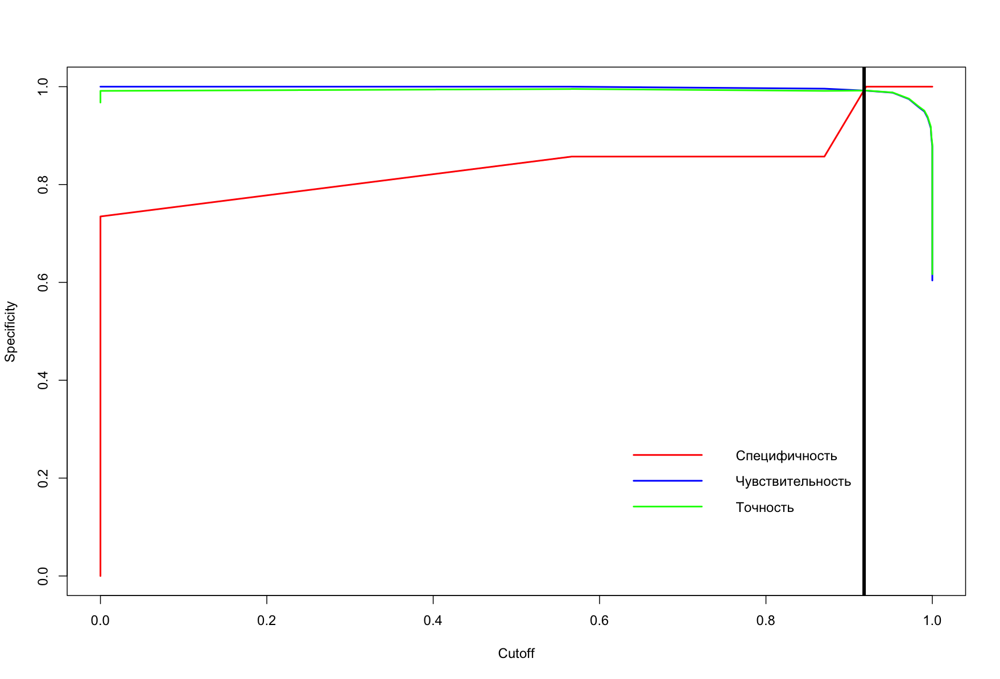
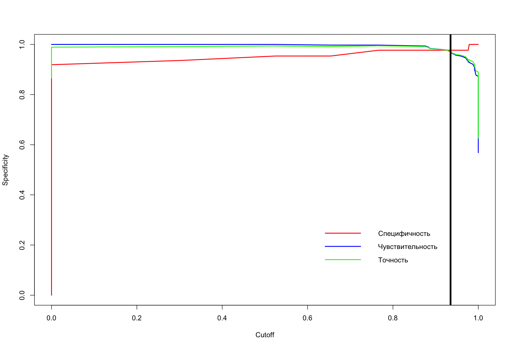

```{r setup, include=FALSE}
knitr::opts_chunk$set(echo = TRUE)
```

УДК 616-006.04

# ОПРЕДЕЛЕНИЕ МЕСТА АВТОМАТИЗИРОВАННОГО 3D УЗИ В СТРУКТУРЕ РАННЕЙ ДИАГНОСТИКИ НОВОБРАЗОВАНИЙ МОЛОЧНОЙ ЖЕЛЕЗЫ

Гаранина А.Э.
^1,2^, Холин А.В.^1^

^1^ Северо-Западный государственный Медицинский университет им.
И.
И.

Мечникова, Россия, Санкт-Петербург, 191015, Российская Федерация, г.

Санкт-Петербург, ул.
Кирочная, д.
41

^2^ Клиника СМТ АО Поликлинический комплекс, Россия, 190013, г.

Санкт-Петербург, Московский пр., д.
22, литер а

Контакты: Гаранина Анна Эдуардовна,

[anna.garanina.90\@mail.ru](mailto:anna.garanina.90@mail.ru)

**Резюме** Автоматическое ультразвуковое исследование МЖ (3D УЗИ) стало важным инструментом в диагностике РМЖ.
Считается, что 3D УЗИ обладает высокой воспроизводимостью, низкой зависимостью от оператора, меньшими затратами времени на получение изображений, автоматической трехмерной реконструкцией всей МЖ.

**Цель исследования.** Разработать новый алгоритма маршрутизации пациенток, основанный на предиктивных факторах и результатах диагностики для оптимизации использования 3D УЗИ в процессе скрининга и ранней диагностики рака молочной железы.

**Материалы и методы.** С февраля 2019 по май 2023 года проводилось ретро-проспективное клиническое исследование.
Всего в исследование вошло 2794 пациенток.
Всем пациенткам проводили клинический осмотр, пальпацию, собрали информацию о социально-демографических данных и потенциальных факторах риска РМЖ, также был проведено 2D УЗИ.
У пациенток от 40 лет и старше проводилась ММГ.
В выборку до 40 лет вошло 1511 пациенток из них 628 выполнено 3D УЗИ.
В выборку 40 лет и старше вошло 1283 пациенток из них 655 выполнено 3D УЗИ.

**Результаты.** Были выявлены наиболее значимые факторы и на их основании скрининг с 3D УЗИ в выборке до 40 лет в 95.96% его можно использовать и не показан в 4.04%.
Представленная модель в выборке до 40 лет сработала корректно в 99.21% и в 0.79%.
В то время как скрининг с 3D УЗИ в выборке 40 лет и старше не показан в 15.74%, в 84.26% исследование целесообразно.
Представленная модель сработала корректно в 97.12% и в 2.88% нет.

**Выводы.** 3D УЗИ не уступает по эффективности традиционному УЗИ в ранней диагностике опухолей молочных желез как у женщин до 40 лет, так и у женщин старше этого возраста.
3D УЗИ дополняет традиционную ультразвуковую диагностику, что позволяет улучшить организацию потока пациенток и обеспечить более точное и своевременное выявление опухолей в молочных железах.

**Ключевые слова:** рак молочной железы, ультразвуковое исследование, автоматизированное объемное сканирование молочных желез

Авторы подтверждают отсутствие конфликтов интересов.

# DETERMINING THE PLACE OF AUTOMATED 3D ULTRASOUND IN THE STRUCTURE OF EARLY DIAGNOSIS OF BREAST NEOPLASMS

Garanina A.E.
1,2, Kholin A.V.1

1 North-Western State Medical University named after I.I.
Mechnikov, Saint-Petersburg, 191015, 41 Kirochnaya str., Saint Petersburg, Russian Federation

2 SMT Clinic JSC Polyclinic Complex, Russia, 190013, St. Petersburg, Moskovsky ave., 22, letter a

**Abstract** Automatic ultrasound examination of the breast (3D ultrasound) has become an important tool in the diagnosis of breast cancer.
It is believed that 3D ultrasound has high reproducibility, low dependence on the operator, less time spent on obtaining images, and automatic three-dimensional reconstruction of the entire breast.

**Aim.** To develop a new patient routing algorithm based on predictive factors and diagnostic results to optimize the use of 3D ultrasound in the process of screening and early diagnosis of breast cancer.

**Methods.** From February 2019 to May 2023, a retro-prospective clinical study was conducted.
A total of 2794 patients were included in the study.
All patients underwent clinical examination, palpation, collected information on socio-demographic data and potential risk factors for breast cancer, and 2D ultrasound was also performed.
In patients 40 years of age and older, MMG was performed.
The sample under 40 years of age included 1511 patients, of which 628 underwent 3D ultrasound.
The sample of 40 years and older included 1283 patients, of which 655 underwent 3D ultrasound.

**Results.** The most significant factors were identified and, based on them, screening with 3D ultrasound in a sample up to 40 years of age in 95.96% can be used and is not indicated in 4.04%.
The presented model in the sample up to 40 years worked correctly in 99.21% and 0.79%.
While screening with 3D ultrasound in a sample of 40 years and older is not indicated in 15.74%, in 84.26% the study is appropriate.
The presented model worked correctly in 97.12% and in 2.88% it did not.

**Conclusion.** 3D ultrasound is not inferior in effectiveness to traditional ultrasound in the early diagnosis of breast tumors both in women under 40 years of age and in women older than this age.
3D ultrasound complements traditional ultrasound diagnostics, which improves the organization of the patient flow and provides more accurate and timely detection of tumors in the mammary glands.

**Keywords:** breast cancer, ultrasound, automated volumetric breast scanning.

Conflict of interest.
The authors declare no conflict of interest.
The study had no sponsorship

## Введение

Эпидемиологические данные показывают, что ежегодно во всем мире регистрируется около 12,7 миллионов новых случаев рака и до 7,6 миллионов смертей от рака.
По показателям заболеваемости и смертности от всех случаев рака рак молочной железы (РМЖ) занимает первое место среди болезней с летальным исходом для женщин, составляя 23% и 14% соответственно.
Эта доля относительно высока и с каждым годом демонстрирует тенденцию к увеличению.
В заключение отметим, что РМЖ представляет собой серьезную угрозу [@guo2018; @mann2019].
Поэтому вопрос о ранней диагностике рака является чрезвычайно актуальной темой обсуждения.

В настоящее время подходы к первоначальному анализу РМЖ включают традиционное ультразвуковое исследование, цифровую маммографию, магнитно-резонансную томографию (МРТ) и позитронно-эмиссионную/компьютерную томографию (ПЭТ/КТ).
Ультразвук в настоящее время является наиболее важным методом визуализации для клинической диагностики заболеваний молочной железы (МЖ) [@rix2021; @kaur2022; @suter2020].

Автоматическое ультразвуковое исследование МЖ (3D УЗИ) стало серьезным инструментом в диагностике РМЖ [@garanina2023].
Считается, что 3D УЗИ обладает высокой воспроизводимостью, низкой зависимостью от оператора, меньшими затратами времени на получение изображений, автоматической трехмерной реконструкцией всей МЖ, уникальным коронарным срезом и относительно широким полем обзора.
Исследования показали, что маммография (МГ) в сочетании с исследованием 3D УЗИ может повысить уровень выявления РМЖ у женщин с плотной МЖ, особенно уровень обнаружения небольших поражений [@brem2015].
Многоцентровое исследование с участием китайских женщин показало, что 3D УЗИ имеет более высокую надежность по сравнению с ручным ультразвуковым исследованием (2D УЗИ) и МГ [@hooley2012].
Другое исследование, проведенное в США, показало, что добавление 3D УЗИ к скринингу может помочь повысить уровень выявления РМЖ [@wilczek2016].

Однако на сегодняшний день метод 3D УЗИ обладает схожими показаниями с 2D УЗИ, но имеет иные временные возможности, что создает потенциал для оптимизации скрининга.
Перед исследователями встает вопрос на какие показатели обращать внимание, чтобы отправить пациентку сразу на 2D УЗИ или есть возможность провести 3D УЗИ.

## Цель исследования

Разработать новый алгоритма маршрутизации пациенток, основанный на предиктивных факторах и результатах диагностики для оптимизации использования 3D УЗИ в процессе скрининга и ранней диагностики рака молочной железы.

## Материалы и методы

Настоящее исследование можно характеризовать как клиническое исследование диагностических аспектов ранней диагностики РМЖ с плотной структурой.
Объектом исследования являются новообразования МЖ, диагностируемые с использованием 2D ультразвукового исследования (УЗИ), маммографии (ММГ) и автоматизированного объемного УЗИ сканирования МЖ (3D УЗИ).
Всего в исследование вошло 2794 пациенток.
В исследование включали женщин от 18 до 80 лет, которые обратились к врачу для обследования молочных желез без видимых признаков рака молочной железы.
Исключались женщины, находящиеся в состоянии беременности, кормящие грудью или планирующие беременность, а также те, кто проходил эксцизионную или чрескожную биопсию за последние 12 месяцев или получал лечение по поводу рака молочной железы за тот же период.
В данное исследование была включена одна медицинская клиника, состоящая из амбулаторно-поликлинический комплекса и хирургического корпуса со стационаром.
Все женщины, посещавшие амбулаторное отделение, были приглашены принять участие в исследовании, после чего они подписали форму информированного согласия.
Все обследования проводились медицинским персоналом с соответствующей квалификацией, включая клинический осмотр, пальпацию и сбор информации о социально-демографических данных и потенциальных факторах риска развития рака молочной железы.

Все пациентки были разделены на 2 независимые друг от друга выборки по принципу возраста: выборка пациенток до 40 лет и выборка пациенток старше 40 лет.
Разделение по возрасту было связано с различными принципами использования диагностических методов в скрининге РМЖ.
У женщин в возрасте до 40 лет маммография менее эффективна из-за её низкой чувствительности, и в качестве основного метода диагностики применяется ультразвуковое исследование (УЗИ) [@mandelson2000].
У пациенток, достигших возраста старше 40 лет, маммография является обязательным компонентом процедуры скрининга рака молочной железы.
[@narayan2020].
В выборку до 40 лет вошло 1511 пациенток.
В выборку 40 лет и старше вошло 1283 пациенток.

| Группы                             | до 40 лет                       | -----           | 40 лет и старше                 | ------          |
|------------------------------------|---------------------------------|-----------------|---------------------------------|-----------------|
| Жалобы                             | ------                          | ------          | ------                          | ------          |
| без жалоб                          | 84.911 % ( 1283 / 1511 случаев) | [ 0.83 ; 0.87 ] | 81.06 % ( 1040 / 1283 случаев)  | [ 0.79 ; 0.83 ] |
| боль                               | 5.03 % ( 76 / 1511 случаев)     | [ 0.04 ; 0.06 ] | 4.131 % ( 53 / 1283 случаев)    | [ 0.03 ; 0.05 ] |
| выделения из соска                 | 0.662 % ( 10 / 1511 случаев)    | [ 0 ; 0.01 ]    | 0.468 % ( 6 / 1283 случаев)     | [ 0 ; 0.01 ]    |
| уплотнение                         | 9.398 % ( 142 / 1511 случаев)   | [ 0.08 ; 0.11 ] | 14.341 % ( 184 / 1283 случаев)  | [ 0.12 ; 0.16 ] |
| Репродуктивный статус              | ------                          | ------          | ------                          | ------          |
| репродуктивный возраст             | 96.956 % ( 1465 / 1511 случаев) | [ 0.96 ; 0.98 ] | 22.369 % ( 287 / 1283 случаев)  | [ 0.2 ; 0.25 ]  |
| пременопауза                       | 3.044 % ( 46 / 1511 случаев)    | [ 0.02 ; 0.04 ] | 33.905 % ( 435 / 1283 случаев)  | [ 0.31 ; 0.37 ] |
| менопауза до 5 лет                 | 0 % ( 0 / 1511 случаев)         | [ 0 ; 0 ]       | 18.472 % ( 237 / 1283 случаев)  | [ 0.16 ; 0.21 ] |
| менопауза более 5 лет              | 0 % ( 0 / 1511 случаев)         | [ 0 ; 0 ]       | 24.942 % ( 320 / 1283 случаев)  | [ 0.23 ; 0.27 ] |
| оперативная менопауза              | 0 % ( 0 / 1511 случаев)         | [ 0 ; 0 ]       | 0.312 % ( 4 / 1283 случаев)     | [ 0 ; 0.01 ]    |
| Операции на молочной железе        | ------                          | ------          | ------                          | ------          |
| были операции                      | 1.588 % ( 24 / 1511 случаев)    | [ 0.01 ; 0.02 ] | 0.857 % ( 11 / 1283 случаев)    | [ 0 ; 0.02 ]    |
| не было операций                   | 98.412 % ( 1487 / 1511 случаев) | [ 0.98 ; 0.99 ] | 99.143 % ( 1272 / 1283 случаев) | [ 0.98 ; 1 ]    |
| Прием гормональных препаратов      | ------                          | ------          | ------                          | ------          |
| да                                 | 20.516 % ( 310 / 1511 случаев)  | [ 0.19 ; 0.23 ] | 20.655 % ( 265 / 1283 случаев)  | [ 0.18 ; 0.23 ] |
| нет                                | 79.484 % ( 1201 / 1511 случаев) | [ 0.77 ; 0.81 ] | 79.345 % ( 1018 / 1283 случаев) | [ 0.77 ; 0.82 ] |
| Наследственная предрасположенность | ------                          | ------          | ------                          | ------          |
| есть                               | 31.039 % ( 469 / 1511 случаев)  | [ 0.29 ; 0.33 ] | 36.399 % ( 467 / 1283 случаев)  | [ 0.34 ; 0.39 ] |
| нет                                | 68.961 % ( 1042 / 1511 случаев) | [ 0.67 ; 0.71 ] | 63.601 % ( 816 / 1283 случаев)  | [ 0.61 ; 0.66 ] |
| Симптом выделения из соска         | ------                          | ------          | ------                          | ------          |
| нет                                | 99.537 % ( 1504 / 1511 случаев) | [ 0.99 ; 1 ]    | 98.909 % ( 1269 / 1283 случаев) | [ 0.98 ; 0.99 ] |
| кровянистые                        | 0.463 % ( 7 / 1511 случаев)     | [ 0 ; 0.01 ]    | 0.468 % ( 6 / 1283 случаев)     | [ 0 ; 0.01 ]    |
| светлые                            | 0 % ( 0 / 1511 случаев)         | [ 0 ; 0 ]       | 0.624 % ( 8 / 1283 случаев)     | [ 0 ; 0.01 ]    |
| Тип структуры ACR                  | ------                          | ------          | ------                          | ------          |
| С                                  | 70.483 % ( 1065 / 1511 случаев) | [ 0.68 ; 0.73 ] | 87.997 % ( 1129 / 1283 случаев) | [ 0.86 ; 0.9 ]  |
| D                                  | 29.517 % ( 446 / 1511 случаев)  | [ 0.27 ; 0.32 ] | 12.003 % ( 154 / 1283 случаев)  | [ 0.1 ; 0.14 ]  |

2D ультразвуковое исследование выполняли два врача ультразвуковой диагностики со стажем работы более 7 лет.
Исследование проводилось в положении лежа, с руками за головой, с последовательным сканированием каждого квадранта обеих МЖ в сагитальной и аксиальной плоскостях, с исследованием ретроареолярной области и аксиллярных областей с двух сторон.
Устройства, используемые для проведения 2D УЗИ, включали GE LOGIQS 8 (GE Medical Systems, Милуоки, Висконсин, США), Toshiba Aplio 300(Canon Япония)- ультразвуковые системы экспертного класса.

3D-автоматизированная ультразвуковая система Invenia 3D УЗИ), производства GE Healthcare (Саннивейл, Калифорния, США) 2018 года выпуска— это компьютерная система для оценки плотной МЖ.
Оценку изображений 3D УЗИ выполнял один врач ультразвуковой диагностики, со стажем работы более 7 лет.
Общее время, необходимое для подготовки пациента и получения 3D УЗИ, фиксировалось, в каждом случае и варьировалось примерно между 10 и 15 мин.

Пациентки старше 40 лет прошли цифровую маммографию (в медиолатеральную косой и краниокаудальной проекции) обеих МЖ.
Маммографию также выполняли женщинам моложе 40 лет в случае положительного семейного или личного анамнеза - РМЖ.
Используемое оборудование- Planmed Clarity 3D с функцией томосинтеза (Финляндия).
Оценку изображений проводил один рентгенолог со стажем работы более 10 лет.

При категории BI-RADS4 или BI-RADS5 проводилась CORE-биопсии под УЗ-наведением или стереотаксическим наведением с последующей морфологической и при необходимости иммуногистохимической верификацией.

*Статистический анализ*

Статистическая обработка проводилась с помощью языка программы STATISTICS 12.
Для определения числа наблюдений при каждом типе воздействия в каждой группе производился расчет мощности пропорций при уровне значимости 95% и мощностью 0.8.
Данные, необходимые для расчета величины эффекта были взяты из исследования XinY.
и коллег (2021) [@xin2021].

Для описания количественных показателей проводилась оценка на нормальность распределения, в качестве метода использовался критерий Шапиро-Уилка.
Для построения предсказательной модели на основании данных использовалась логистическая регрессия с последуещим представлением в виде ROC- кривой.

## Результаты

*Оценка преддиагностических факторов в выборке пациенток до 40 лет*

Для определения наиболее значимых преддиагностических факторов производился подбор предиктороной модели с наиболее значимыми факторам.
В выборке пациенток до 40 лет была получена формула Y \~ 0.05\* (возраст пациента) + 1.82\*(Первичный диагноз: Диффузный фиброаденоматоз) + 1.6\*(Репродуктивный статус: пременопауза) + 0.86\*(Жалоба на уплотнение) + 2.92\*(Наследственная предрасположенность).

Были рассчитаны предиктивные коэффициенты на основании представленной модели и построек график ROC- кривой качества модели (Рисунок 1.а).
Площадь под кривой составила 0.9991 Также были рассчитаны показатели точности, специфичности и чувствительности модели с определением коэффициента отсечения (Рисунок 1.б).
в представленной модели коэффициент отсечения был 0.918 По высчитанному коэффициенту отсечения был составлен прогноз рекомендаций к скринингу.




**Рисунок 1. а.** ROC- кривая предикторной модели определения показаний к 3D УЗИ для скрининга у пациенток в выборке до 40 лет; **б.** Показатели точности, специфичности и чувствительности модели с определением коэффициента отсечения в выборке до 40 лет.

На основании данных, полученных в нашем исследовании скрининг с 3D УЗИ в выборке до 40 лет не показан в 4.04% (61/1511) и в 95.96% (1450/1511) его можно использовать.

Представленная модель в выборке до 40 лет сработала корректно в 99.21% (1499/1511) и в 0.79% (12/1511) предсказание можно отнести к неверному, а именно ложноположительные результаты.

*Оценка преддиагностических факторов и факторов ММГ в выборке пациенток 40 лет и старше*

Для определения наиболее значимых пред диагностическими факторами производился подбор предиктороной модели с наиболее значимыми факторам.
В выборке пациенток 40 лет и старше была получена формула Y \~ 0.05\* (возраст пациента) + 3.17\*(Первичный диагноз: Локализованный фиброаденоматоз) + 1.25\*(Репродуктивный статус: менопауза более 5 лет) + 3.01\*(Жалоба на уплотнение) + 1.75\*(Наследственная предрасположенность)+ 1.19\*(Наличие гормональной терапии)+ 2.18\*(Фон на ММГ: железистая ткань)+ 2.25\*(Характеристика узла на ММГ: фокус уплотнения)+ 5.02\*(Края образования на ММГ: нечеткие).

Были рассчитаны предикторные коэффициенты на основании представленной модели и построек график ROC- кривой качества модели (Рисунок 2.а).
Площадь под кривой составила 0.9983 Также были рассчитаны показатели точности, специфичности и чувствительности модели с определением коэффициента отсечения (Рисунок 2.б).
в представленной модели коэффициент отсечения был 0.935 По высчитанному коэффициенту отсечения был составлен прогноз рекомендаций к скринингу.




**Рисунок 2.а.** ROC- кривая предикторной модели определения показаний к 3D УЗИ для скрининга у пациенток в выборке 40 лет и старше; **б.** Показатели точности, специфичности и чувствительности модели с определением коэффициента отсечения в выборке 40 лет и старше

На основании данных, полученных в нашем исследовании скрининг с 3D УЗИ в выборке 40 лет и старше не показан в 15.74% (202/1283), в 84.26% (1081/1283).

Представленная модель в выборке 40 лет и старше сработала корректно в 97.12% (1246/1283 ) и в 2.88% (37/1283) нет.
Среди 37 случаев неверного предсказания было 4 случая ложноотрицательных результата, и эти пациенты буду направлены на повторное исследование к специалисту УЗИ для проведения CORE-биопсии, 33 случая квалифицированы как ложноположительные.

*Алгоритм оптимизации использования 3D УЗИ*

Исходя из данных, описанных в литературе, а также данных, полученных в настоящем исследовании, предлагается следующий алгоритм оптимизации использования системы 3D УЗИ.

Пациенты, пришедшие на первичный осмотр по жалобам или по скринингу подписывают согласие на исследование.
Далее пациентки маршрутизируются по возрасту до 40 лет и 40 лет, так как маммография остается золотым стандартом скрининга РМЖ, но маммография имеет меньшую чувствительность при выявлении РМЖ у женщин с плотной грудью, особенно если речь идет о пациентках до 40 лет.

В выборке пациенток до 40 лет, если не выявлены следующие предикторные факторы: пременопауза, жалоба на уплотнение, наследственная предрасположенность к раку МЖ, то пациентка может быть направлена на исследование 3D УЗИ, при обнаружении указанных предикторных факторов пациентку рекомендовано направить на 2D УЗИ исследование.
По результатам выставляется категория по классификации BI-RADS, в зависимости от которой проводят дальнейшие действия.

В выборке пациенток 40 лет и старше выполняется первичный осмотр и ММГ и если не выявлены следующие предикторные факторы: менопауза более 5 лет, жалоба на уплотнение, наследственная предрасположенность, наличие гормональной терапии, фон на ММГ: железистая ткань, характеристика узла на ММГ: фокус уплотнения, края образования на ММГ: нечеткие, то пациентка может быть направлена на исследование 3D УЗИ, при обнаружении указанных предикторных факторов пациентку рекомендовано направить на 2D УЗИ.
По результатам выполнения 2D УЗИ выставляется категория по классификации BI-RADS, в зависимости от которой проводят дальнейшие действия.

При категории BI-RADS1 или BI-RADS2 рекомендовано дальнейшее наблюдение.

При категории BI-RADS3 требуется дополнительное выполнение МРТ c контрастным усилением.

При категории после выполнений МРТ BI-RADS1, BI-RADS2 рекомендовано дальнейшее наблюдение.

При категории BI-RADS4 или BI-RADS5 рекомендуется проведение CORE-биопсии под УЗ-наведением или стереотаксическим наведением с последующей морфологической и при необходимости иммуногистохимической верификацией.


**Рисунок 3.** Алгоритм оптимизации использования 3D УЗИ

## Дискуссия

По сравнению с 2D УЗИ, 3D УЗИ все еще находится на стадии изучения по различным клиническим аспектам: частота обнаружения и характеристики поражений МЖ, диагностическая эффективность, чувствительность и специфичность, согласованность между исследователями и использование в предоперационной диагностике или вторичной оценке.
На сегодняшний день есть данные немногочисленных научных исследований, сравнивающих 3D УЗИ и 2D УЗИ [@гажонова2015возможности].
Данные свидетельствовали о значительном увеличении специфичности данного метода у пациенток с типами плотности МЖ C и D, что может иметь важное значение при скрининге у женщин данной категории [@berg2006].
Есть мнение, что частота выявления РМЖ с помощью 3D УЗИ увеличивается с размером поражения.
Некоторые исследования показали значительно более высокий уровень обнаружения РМЖ с помощью 3D УЗИ по сравнению с 2D УЗИ [@wang2012; @zhang2012; @xiao2015].
По сравнению с 2D УЗИ, которое выполняется врачами и занимает 20-30 минут на пациента, время, которое специалист тратит на 3D УЗИ, связано только с оценкой изображений, поскольку сбор данных осуществляет средний медицинский персонал.
В нескольких исследованиях анализировалось время, необходимое врачу для сообщения об обследовании 3D УЗИ [@skaane2015].
Kim, Sung Hun с соавторами в 2020 году в своем обзоре литературы поредилили 3d УЗИ как эффективный метод скрининга для выявления маммографически скрытый рак молочной железы у женщин с плотной МЖ с высокой диагностической точностью [@kim2020].
Femke Klein Wolterink с соавторами в 2024 году в своем ретоспективном исследовании провели анализ 3616 исследований у 1555 женщин с плотностью груди C/D и выявили эффективность обнаружения рака с помощью 3D-ABUS в условиях реального клинического скрининга и результаты были по мнению авторов сопоставимы с результатами, полученными в предыдущих исследованиях [@kleinwolterink2024].
Исследование Gianluca Gatta и коллег в 2024 подтверждает, что добавление автоматизированного 3D-УЗИ молочной железы к маммографическому скринингу у пациенток с плотной грудью (ACR C и D) значительно (p \<0,05) повышает уровень выявления рака [@gatta2023].
Существует единственное исследование, посвященное экономическому эффекту использования 3D УЗИ при скрининге.
Foglia и коллеги [@foglia2020] проанализировали влияние на бюджет использования 3D УЗИ при скрининге РМЖ.
Они обнаружили, что сценарий с использованием 3D УЗИ может привести к экономии средств, равной или превышающей 54 миллиона евро для Национальной службы здравоохранения Италии.
В нашем исследовании стояла задача определить место автоматизированного 3D УЗИ в существующей системе диагностики новообразований МЖ.
Для этого были собраны данные для многофакторного анализа.
По результатам этого анализа можно предположить в каких случаях ожидается определение категории BI-RADS4 или BI-RADS5 после проведения диагностики.
Эти категории пациентов необходимо направлять к специалисту УЗИ, так как предполагается последующее проведение СORE-биопсии под УЗ-наведением с морфологической и при необходимости иммуногистохимической верификацией.
На основе преддиагностических данных, включая информацию о жалобах, медицинской истории, результаты осмотра и маммографии, были выявлены факторы для двух групп пациенток: тех, кто моложе 40 лет, и тех, кто старше этого возраста.
Предложенный алгоритм представляет собой новый способ организации потока пациенток с низким риском развития опухолей.
Это поможет снизить нагрузку на врачей, позволяя им более эффективно использовать время и сосредоточиться на более важных случаях.
Кроме того, благодаря такому подходу возможно провести больше исследований за один и тот же период времени.
Однако метод не лишен недостатков и стоит обратить внимания на причины неверной диагностики такие как ложноположительные результаты и ложноотрицательные результаты.
Патологиями, которые могут быть причинами ложноположительных результатов, являются аденоз, внутрипротоковая папиллома, фиброаденома или мастит [@wang2012a].
Небольшие поражения, ограниченные края (как при медуллярной карциноме, листовидных опухолях или инвазивной солидной папиллярной карциноме) или периферическая локализация образования могут быть источниками ложноотрицательных результатов [@wang2012a].
Так же существуют ограничения метода, связанные с техникой выполнения исследования.
Поражения могут быть пропущены при 3D УЗИ, если они имеют периферическое расположение.
Этот технический недостаток снижает диагностическую эффективность метода по сравнению с 2D УЗИ, особенно при МЖ большого объема, и может стать причиной ошибочной диагностики рака.
Специалист должен знать об этом аспекте и сканировать всю, молочную железу, получая дополнительные проекции [@chang2015].
Основным ограничением 3D УЗИ является его неспособность оценить аксиллярную область, отсутствие информации о состоянии лимфатических узлов, васкуляризации и эластичности поражения [@kaplan2014].

## Вывод

1.  Можно с уверенностью сказать, что 3D УЗИ не уступает по своим возможностям традиционному методу УЗИ в ранней диагностике новообразований МЖ как у пациенток до 40 лет, так у пациенток 40 лет и старше.

2.  Метод обладает высокой воспроизводимостью, стандартизован и сокращает время обследования.

3.  Метод диагностики 3D УЗИ является не замещающим, а дополняющим традиционную УЗИ диагностику в структуре ранней диагностики и может поспособствовать оптимизации организации потока пациенток.

4.  Предлагаемый оптимизированный алгоритм определяет место 3d УЗИ в стрктуре скрининга рака молочной железы и потенциально может снизить нагрузку на врачей ультазвуковой диагностики и сократить время на проведение 1 исследования

## Участие авторов

Гаранина А.Э.
– концепция и дизайн исследования,

проведение исследования, анализ и интерпретация полученных данных, написание текста и статистическая обработка данных.

Холин А.В.
– концепция и дизайн исследования, подготовка и

редактирование текста, утверждение окончательного варианта

статьи.

## Authors’ participation

Garanina A.E.
– сoncept and design of the study, conducting research, analysis and interpretation of the data, text writing and data processing.

Kholin A.V.
– concept and design of the study, preparation and editing of the text and approval of the final version of the article.

## Информация об авторах

Гаранина Анна Эдуардовна – аспирант кафедры лучевой диагностики ФГБОУ ВО “Северо-Западный государственный Медицинский университет им.И.И.Мечникова”, Врач ультразвуковой диагностики, Клиника СМТ АО Поликлинический комплекс, Санкт-Петербург, Российская Федерация.

e-mail: [anna.garanina.90\@mail.ru](mailto:anna.garanina.90@mail.ru){.email}

SPIN-код: 8668-3521

ORCID: <https://orcid.org/0009-0001-8193-6657>

Холин Александр Васильевич - доктор медицинских наук, профессор заведующий кафедрой лучевой диагностики ФГБОУ ВО “Северо-Западный государственный Медицинский университет им.И.И.Мечникова”.

e-mail: [holin1959\@list.ru](mailto:holin1959@list.ru){.email}.

SPIN-код: 9791-8550

ORCID: <https://orcid.org/0000-0001-8227-1530>

## Информация об авторах

Контакты: Гаранина Анна Эдуардовна, [anna.garanina.90\@mail.ru](mailto:anna.garanina.90@mail.ru){.email}

Гаранина Анна Эдуардовна – аспирант кафедры лучевой диагностики ФГБОУ ВО “Северо-Западный государственный Медицинский университет им.И.И.Мечникова”, Врач ультразвуковой диагностики, Клиника СМТ АО Поликлинический комплекс, Санкт-Петербург, Российская Федерация.

e-mail: [anna.garanina.90\@mail.ru](mailto:anna.garanina.90@mail.ru){.email}

SPIN-код: 8668-3521

ORCID: <https://orcid.org/0009-0001-8193-6657>

Холин Александр Васильевич - доктор медицинских наук, профессор заведующий кафедрой лучевой диагностики ФГБОУ ВО “Северо-Западный государственный Медицинский университет им.И.И.Мечникова”.

e-mail: [holin1959\@list.ru](mailto:holin1959@list.ru){.email}.

SPIN-код: 9791-8550

ORCID: <https://orcid.org/0000-0001-8227-1530>

## About the authors

Contacts: Anna E. Garanina, [anna.garanina.90\@mail.ru](mailto:anna.garanina.90@mail.ru){.email}

Garanina Anna Eduardovna – PhD student at the Department of Radiation Diagnostics North-Western State Medical University named after I.I.
Mechnikov, Saint-Petersburg, 191015, 41 Kirochnaya str., Saint Petersburg, Russian Federation, Врач ультразвуковой диагностики, SMT Clinic JSC Polyclinic Complex, Russia, 190013, St. Petersburg, Moskovsky ave., 22, letter a.

e-mail: [anna.garanina.90\@mail.ru](mailto:anna.garanina.90@mail.ru){.email}

SPIN-код: 8668-3521

ORCID: <https://orcid.org/0009-0001-8193-6657>

Kholin Aleksandr Vasilevich - Doctor of Medical Sciences, Professor, Head of the Department of Radiation Diagnostics North-Western State Medical University named after I.I.
Mechnikov, Saint-Petersburg, 191015, 41 Kirochnaya str., Saint Petersburg, Russian Federation

e-mail: [holin1959\@list.ru](mailto:holin1959@list.ru){.email}.

SPIN-код: 9791-8550

ORCID: <https://orcid.org/0000-0001-8227-1530>

## Список литературы
