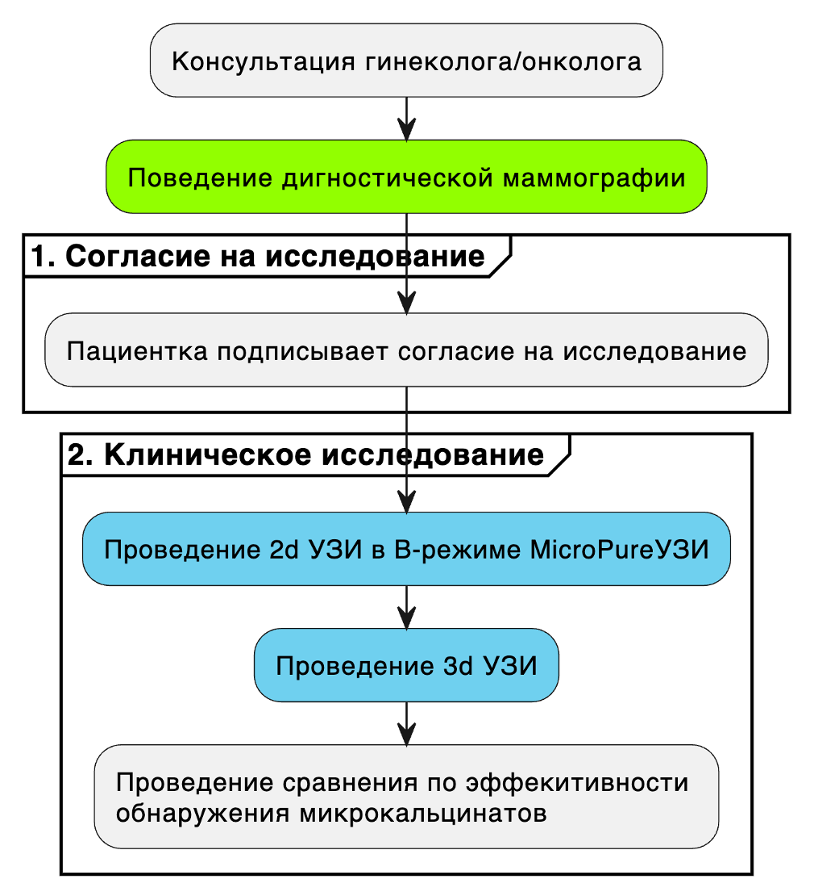
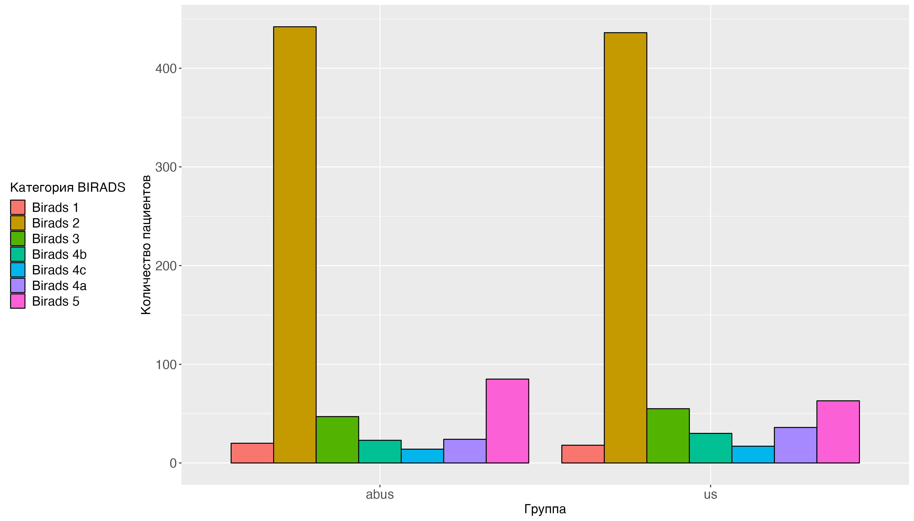
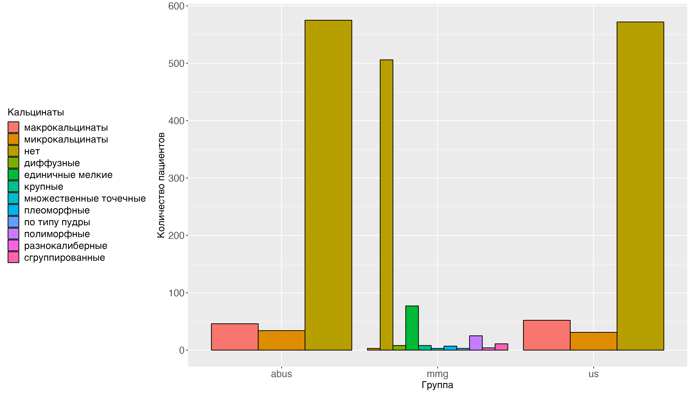
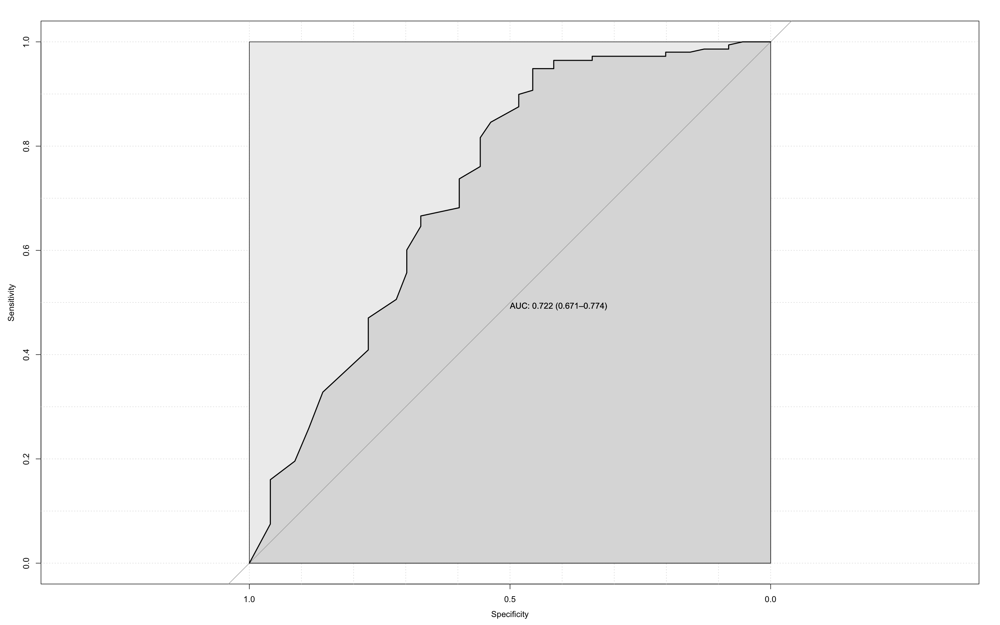

```{r setup, include=FALSE}
knitr::opts_chunk$set(echo = TRUE)
```

УДК 616-006.04

# Определение эффективности автоматизированного трехмерного 3d сканера для обнаружения кальцинатов при скрининге рака молочной железы

Гаранина А.Э. ^1,2^, Холин А.В.^1^

^1^ Северо-Западный государственный Медицинский университет им. И. И.
Мечникова, Россия, Санкт-Петербург, 191015, Российская Федерация, г.
Санкт-Петербург, ул. Кирочная, д. 41

^2^ Клиника СМТ АО Поликлинический комплекс, Россия, 190013, г.
Санкт-Петербург, Московский пр., д. 22, литер а

Контакты: Гаранина Анна Эдуардовна,
[anna.garanina.90\@mail.ru](mailto:anna.garanina.90@mail.ru)

## Резюме

## Введение

Микрокальцификации молочной железы представляют собой отложения кальция
в ткани молочной железы и проявляются на маммограммах в виде небольших
ярких пятен [@wilkinson2017]. Микрокальцификации играют решающую роль в
скрининге рака молочной железы, особенно при непальпируемом раке
молочной железы [@cox2012], и присутствуют примерно в одной трети всех
злокачественных поражений, обнаруженных при скрининговой маммографии
[@henrot2014; @park2000]. Они чаще встречаются при протоковой карциноме
in situ [@henrot2014], чем при инвазивном раке молочной железы
[@alshehali2019]. Золотым стандартом скринига рака молочной железы и
определения кальцинатов как прогностического фактора является
диагностическая маммография. Стандартный маммографический скрининг рака
молочной железы помог снизить смертность от рака молочной железы
[@gatta2021]. Тем не менее, количество раковых заболеваний, не
обнаруженных во время маммографии, существенно, особенно если речь идет
о женщинах с плотной грудью, со значением чувствительности 30--48%
[@niell2017screening]. Использование цифровой маммографии вместо
аналоговой маммографии показывает увеличение уровня выявления рака на
55--70% [@mckinney2020international]. Однако большое количество случаев
рака молочной железы до сих пор остается невыявленным. В течение
длительного времени ручной портативный УЗИ (HHUS) зарекомендовал себя
как ценный и эффективный дополнительный диагностический скрининговый
инструмент, который позволяет выявлять рак у женщин с плотной грудью.
Этому методу не препятствует плотность ткани молочной железы
[@freer2015mammographic]. Некоторые исследования показали значительно
более высокий уровень обнаружения при автоматизированном УЗИ молочной
железы (3D ABUS) по сравнению с HHUS [@bocabene2021].

В настоящем исследовании мы решили изучить вопрос возможности
обнаружения кальциатов методами УЗИ в B-режиме и автоматизированного
объемного сканирования молочных желез (ABUS).

## Цель исследования

Провести сравнительный анализ диагностической эффективности обнаружения
кальцианатов, именно УЗИ в B-режиме и автоматизированного объемного
сканирования молочных желез (ABUS) у женщин в возрастной группе 40 лет и
старше лет с неоднородной и высокой плотностью тканей молочной железы.

## Материалы и методы

С февраля 2019 по май 2023 года проводилось ретро-проспективное
наблюдательное исследование, в котором рассматривались диагностические
аспекты раннней диагностики рака молочной железы с реди женщин в
возрасте 40 лет и старше. Среди исследуемых диагностических методи
рассматривались УЗИ, ABUS и маммография. Протокол настоящего
исследования был одобрен на заседании локального этического комитета
СЗГМУ им.Мечникова №00 от ХХ.ХХ.ХХХХ года.

*Последовательность проведения диагностики*



Рисунок 1. Схема сравнительного иссдедования (УЗИ -ультразвуковое
исследолвание; ABUS - Автоматизированное объемное ультразвуковое
сканирование)

Основные этапы проведения исследования показаны на рисунке №1

*Описание выборки и групп*

В исследование вошло 655 пациентов. Медиана возраста пациенток составила
49 [Q1-Q3: 45;56.5] лет. Минимальный возраст сотсавил 40 лет.
Максимальный возраст сотсавил 72 лет. Медиана роста пациенток выборке до
40 лет составил 165 [Q1-Q3: 164;168] см. Медиана веса пациенток выборке
до 40 лет составил 65 [Q1-Q3: 59;75] кг.

Репродуктивный возраст в был в 23.21% (152), пременопауза в 35.73%
(234), менопауза до 5 лет в 15.11% (99) и менопауза более 5 лет в 25.95%
(170). Во всех случаях не было операций в анамнезе.

Прием гормональных препаратов был зарегистрирован в 18.78% (123), в
остальных 81.22% (532) случах его не было. Наследственная
предрасположенность была в 33.28% (218) случаях.

Таблица № 1.

Основные характеристики пациенток, прошедших исследование

*Описание ABUS*

В настоящем исследовании использовалось трехмерная автоматизированная
ультразвуковая система Invenia (ABUS). Производитель GE Healthcare
(Саннивейл, Калифорния, США) 2018 года выпуска. Основным назначением
компьютерной системы -- это оценка плотной молочной железы. Визуализация
молочных желез проводилось в трех проекциях: боковой (LAT),
переднезадней (AP) и медиальный (MED) с автоматическим датчиком с
линейной матрицей от 6 до 14 МГц, прикрепленным к жесткой компрессионной
пластине (площадь 15,4×17,0×5,0 см). Для каждой пациентки использовалось
индивидуальная мембрана для датчика. Во время исследования система
получала до 300 2D-срезов и реконструировала их в коронарной плоскости.
Стандартизированный процесс осмотра включает использование
запатентованной коронарной плоскости для быстрой навигации по молочной
железе, а также использование «режима обзора», позволяющего врачу быстро
интерпретировать изображения. Время сбора данных для каждой проекции
составляло 60 с, примерно по 3--4 мин на каждую молочную железу.

Обследование проводили в положении лежа. Полотенце было помещено под
плечом, что помогло расправить ткань молочной железы равномерно, соском
к потолку. На молочные железы равномерно наносили гипоаллергенный
ультразвуковой гель с дополнительным количество на область соска.
Возможно применение трех уровней компрессии датчика для исследования
молочных желез для получения наилучшей визуализации с учетом комфорта
пациента.

Сканирование ABUS было непрерывным и автоматизированным. В течение
исследования женщин попросили не двигаться, не разговаривать и дышать
ровно. Выполнял исследование сертифицированный персонал со средним
медицинским образованием.

После завершения сбора данных ультразвуковой системой весь массив
передавался на специальную рабочую станцию для интерпретации. Оценку
изображений ABUS выполнял один врач ультразвуковой диагностики, со
стажем работы более 7 лет. Фиксировалось общее время, необходимое для
подготовки пациента и получения ABUS.

*Описание маммографии*

Пациентки прошли двухпроекционную цифровую маммографию (в
медиалатеральной косой и краниокаудальной проекции) обеих молочных
желез. Маммографию также выполняли женщинам моложе 40 лет в случае
положительного семейного или личного анамнеза - рак молочной железы.
Используемое оборудование- Planmed Clarity 3D с функцией томосинтеза
(Финляндия). Оценку изображений проводил один рентгенолог со стажем
работы более 10 лет.

*Описание УЗИ-исседования*

УЗИ мсследование выполняли два врача ультразвуковой диагностики со
стажем работы более 7 лет. Исследование проводилось в положении лежа, с
руками за головой, с последовательным сканированием каждого квадранта
обеих молочных железе в сагитальной и аксиальной плоскостях, с
исследованием ретроареолярной области и аксиллярных областей с двух
сторон.

Устройства, используемые для проведения HHUS включали GE LOGIQS 8 (GE
Medical Systems, Милуоки, Висконсин, США), Toshiba Aplio 300(Canon
Япония)- ультразвуковые системы экспертного класса.

*Статистический анализ*

Статистическая обработка проводилась с помощью языка программы
STATISTICS 12. Для определения числа наблюдений при каждом типе
воздействия в каждой группе производился расчет мощности пропорций при
уровне значимости 95%.

Для описания количественных показателей проводилась оценка на
нормальность распределения, в качестве метода использовался критерий
Шапиро-Уилка. Переменные, имеющие нормальное распределение, описывались
как среднее ± стандартное отклонение (M±SD). Переменные, распределение
которых отличалось от нормального, описывались при помощи значений
медианы (Me) и нижнего и верхнего квартилей (Q1-Q3). Для определения
статистически значимой разницы непрерывных величин использовали критерий
Манна-Уитни для независимых непараметрических выборок при ненормальном
распределении и t-критерий Стюдента для независимых параметрических
выборок при нормальном. Для определения статистически значимой разницы
независимых качественных величин Хи-квадрат Пирсона, при недостаточном
количестве наблюдений, то есть число наблюдений в любой из ячеек
четырехпольной таблицы было менее 5 наблюдений, использовался точный
критерий Фишера.

Для определения чувствительности, спецефичности и точности
использовалась функция confusionMatrix() из библиотека caret версия
3.45, язык программирования R (среда разработки RStudio). При
определении эффективности диагностических методов УЗИ, ММГ ABUS в
нахождении злокачественных новообразований в качестве контрольного
метода использовались данные гистологического исследования. При
определении эффективности диагностических методов УЗИ и ABUS в
нахождении кальцинатов в качестве контрольного метода использовались
данные ММГ исследования.

Для построения предсказательной модели на основании данных
использовалась логистическая регрессия с помощью функций glm (),
predict() из пакета stats версия 3.6.2, язык программирования R (среда
разработки RStudio). Для оценки получено предсказательной модели и
построения ROC-кривой с расчетом площади под кривой (AUC - area under
curve) использовался пакет pROC version 1.18.4 с функцией roc().

## Результаты исследования

*Кальцинаты*

Кальцинаты по результатам УЗИ не было обнаружено образования в 87.33%
(572/655), макрокальцинаты были в 2.29% (15/655), микрокальцинаты в
4.73% (31/655) и кальцинаты определялись в 5.65% (37/655). По
результатам ABUS не было обнаружено образования в 87.79% (575/655).
Обнаружены макрокальцинаты в 1.83% (12/655), микрокальцинаты в 5.19%
(34/655) и кальцианты определялись в 5.19% (34/655). Статистически
значимой разницы между методами по определнию Кальцинатов не было
выявлено и p-уровень значимости составил 0.89 (Таблица 1, Рисунок 1).

*Категория BIRADS*

По результатам УЗИ категория Birads 1 в 2.75% (18/655), Birads 2 в
66.56% (436/655), Birads 3 в 8.4% (55/655), Birads 4b в 4.58% (30/655),
Birads 4c в 2.6% (17/655), Birads 4а в 5.5% (36/655) и Birads 5 в 9.62%
(63/655). По результатам ABUS категория Birads 1 была поставлена в 3.05%
(20/655), Birads 2 в 67.48% (442/655), Birads 3 в 7.18% (47/655), Birads
4b в 3.51% (23/655), Birads 4а в 3.66% (24/655), Birads 4c в 2.14%
(14/655) и Birads 5 в 12.98% (85/655). Статистически значимой разницы
между методами по определнию категории BIRADS не было выявлено p-уровень
значимости составил 0.27 (Таблица 1, Рисунок 1).

Таблица №1. Сравнение методов УЗИ и ABUS по показателю "Категория
BIRADS" и "Кальцинаты".

| Показатель          | Процентная доля        | 95% ДИ          | Процентная доля        | 95% ДИ          |
|---------------------|------------------------|-----------------|------------------------|-----------------|
| Метод               | УЗИ                    | ------          | ABUS                   | ------          |
| Кальцинаты          | ------                 | ------          | ------                 | ------          |
| макрокальцинаты     | 2.29 % ( 15 / 655 )    | [ 0.01 ; 0.04 ] | 1.832 % ( 12 / 655 )   | [ 0.01 ; 0.03 ] |
| микрокальцинаты     | 4.733 % ( 31 / 655 )   | [ 0.03 ; 0.07 ] | 5.191 % ( 34 / 655 )   | [ 0.04 ; 0.07 ] |
| не было образования | 87.328 % ( 572 / 655 ) | [ 0.84 ; 0.9 ]  | 87.786 % ( 575 / 655 ) | [ 0.85 ; 0.9 ]  |
| определяются        | 5.649 % ( 37 / 655 )   | [ 0.04 ; 0.08 ] | 5.191 % ( 34 / 655 )   | [ 0.04 ; 0.07 ] |
| Категория BIRADS    | ------                 | ------          | ------                 | ------          |
| Birads 1            | 2.748 % ( 18 / 655 )   | [ 0.02 ; 0.04 ] | 3.053 % ( 20 / 655 )   | [ 0.02 ; 0.05 ] |
| Birads 2            | 66.565 % ( 436 / 655 ) | [ 0.63 ; 0.7 ]  | 67.481 % ( 442 / 655 ) | [ 0.64 ; 0.71 ] |
| Birads 3            | 8.397 % ( 55 / 655 )   | [ 0.06 ; 0.11 ] | 7.176 % ( 47 / 655 )   | [ 0.05 ; 0.09 ] |
| Birads 4b           | 4.58 % ( 30 / 655 )    | [ 0.03 ; 0.07 ] | 3.511 % ( 23 / 655 )   | [ 0.02 ; 0.05 ] |
| Birads 4c           | 2.595 % ( 17 / 655 )   | [ 0.02 ; 0.04 ] | 2.137 % ( 14 / 655 )   | [ 0.01 ; 0.04 ] |
| Birads 4а           | 5.496 % ( 36 / 655 )   | [ 0.04 ; 0.08 ] | 3.664 % ( 24 / 655 )   | [ 0.02 ; 0.05 ] |
| Birads 5            | 9.618 % ( 63 / 655 )   | [ 0.08 ; 0.12 ] | 12.977 % ( 85 / 655 )  | [ 0.11 ; 0.16 ] |





Рисунок №1 Сравнение методов УЗИ и ABUS по показателю "Категория BIRADS"
(а) и "Кальцинаты" (b).

При оценке УЗИ количество истинно верно определенных образований как
отсутствие кальцината было 488 , количество верно определённых
образований как наличие кальцината было 65 , количество неверно
определенных кальцинатов как отсутствие кальцината было 84 и количество
определенных истинно отсутствовавших кальциантов как найденное было 18 .
Точность метода составила 0.84 [95% ДИ: 0.81 , 0.87 ]. P-Value модели
составил 0 что означает, что модель отличается от точности нулевой
гипотезы. Коэфициент Kappa составил 0.47 показывает, что метод не имеет
существенно отличную от контрольного метода частоту верно определенных
результатов (количество истинно положительных и отрицательных
результатов). Тест Макнемара составил 0 показывает, что метод не имеет
существенно отличную от контрольного метода частоту ошибок (количество
ложноположительных и ложноотрицательных результатов). Чувствительность
метода составила 0.44 . Специфичность метода составила 0.96 . Доля
положительных прогнозов составила 0.78 . Доля отрицательных прогнозов
составила 0.85 . Доля истинно положительных случаев в наборе данных
составила 0.23 . Доля истинно положительных случаев, правильно
определённых методом составила 0.1 . Отбалансированная точность метода
составила 0.7 (Таблица №2)

При оценке ABUS количество истинно верно определенных образований как
отсутствие кальцината было 488 , количество верно определённых
образований как наличие кальцината было 62 , количество неверно
определенных кальцинатов как отсутствие кальцината было 87 и количество
определенных истинно отсутствовавших кальциантов как найденное было 18 .
Точность метода составила 0.84 [95% ДИ: 0.81 , 0.87 ]. P-Value модели
составил 0 что означает, что модель отличается от точности нулевой
гипотезы. Коэфициент Kappa составил 0.45 показывает, что метод не имеет
существенно отличную от контрольного метода частоту верно определенных
результатов (количество истинно положительных и отрицательных
результатов). Тест Макнемара составил 0 показывает, что метод не имеет
существенно отличную от контрольного метода частоту ошибок (количество
ложноположительных и ложноотрицательных результатов). Чувствительность
метода составила 0.42 . Специфичность метода составила 0.96 . Доля
положительных прогнозов составила 0.77 . Доля отрицательных прогнозов
составила 0.85 . Доля истинно положительных случаев в наборе данных
составила 0.23 . Доля истинно положительных случаев, правильно
определённых методом составила 0.09 . Отбалансированная точность метода
составила 0.69 (Таблица №2)

Таблица №2. Определение точности, P-уровня значимости модели, коэфициент
Kappa, Тест Макнемара, чувствительности, специфичности и
отбалансированной точности изучаемых методов. (Т -Точность, P - P-Value,
КК - Коэффициент Kappa, ТМ -Тест Макнемара, Ч-Чувствительность, Сп
-Специфичность, ОТ- Отбалансированная точность)

| Метод           | Т                           | P   | КК   | ТМ  | Ч    | Сп   | ОТ   |
|-----------------|-----------------------------|-----|------|-----|------|------|------|
| ABUS в группе D | 0.84 [95% ДИ: 0.81 , 0.87 ] | 0   | 0.45 | 0   | 0.42 | 0.96 | 0.69 |
| УЗИ в группе D  | 0.84 [95% ДИ: 0.81 , 0.87 ] | 0   | 0.47 | 0   | 0.44 | 0.96 | 0.7  |

На основании полученных данных, пыла построена предсказательная модель
нахождения кальцинатов для изучаемых методов. ROC-кривая
предсказательной модели нахождения кальцинатов для метода УЗИ, по данным
полученным в группе D представлена на рисунке № 2a. Площадь под кривой
(AUC- area under cruve) составила: 0.735 95% ДИ: 0.684 - 0.786


Рисунок №2a. ROC-кривая предсказательной модели нахождения кальцинатов
для метода УЗИ, по данным полученным в группе D.

ROC-кривая предсказательной модели нахождения кальцинатов для метода
УЗИ, по данным полученным в группе D представлена на рисунке № 2b.
Площадь под кривой (AUC- area under cruve) составила: 0.722 95% ДИ:
0.671 - 0.774



Рисунок №2b. ROC-кривая предсказательной модели нахождения кальцинатов
для метода УЗИ, по данным полученным в группе D. (Таблица №5.20)

Таблица №3. Определение площади под кривой представленных
предсказательных моделей метода.

| Метод           | Площадь под кривой          |
|-----------------|-----------------------------|
| УЗИ в группе D  | 0.735 95% ДИ: 0.684 - 0.786 |
| ABUS в группе D | 0.722 95% ДИ: 0.671 - 0.774 |

## Дисскусия

Настоящее исследование рассмотривает проблему обнаружение
микрокальцинатов через призму изучения новой технологии ABUS в сравнении
с УЗИ исследованием.

Рак молочной железы является наиболее распространенным раком у женщин и
наиболее распространенной причиной смерти от рака во всем мире: в 2018
году было диагностировано около 2,1 миллиона случаев и более 620 000
случаев смерти во всем мире [@bray2018]. Поэтому существует растущая
потребность в совершенствовании и расширении программ скрининга молочной
железы, которые, как было доказано, снижают смертность от рака молочной
железы до 45% [@myers2015benefits], однако чувствительность скрининговой
маммографии ограничена плотной грудью, из-за чего она снижается до 48% у
пациенток с чрезвычайно плотной грудью (категория D по ACR)
[@akram2017]. Изучение факторов таких как микрокальцинаты, имеющих
предикативное значение являтся также важной задачей.

Микрокальцификации молочной железы распространены, большинство из них
доброкачественные, увеличиваются с возрастом и характеризуются
морфологией, размером и распределением [@d2013data, @barman2013]. Самым
важным и трудным шагом в изучении связи между микрокальцификацией и
раком молочной железы является определение и измерение
микрокальцификации. Микрокальцинаты неоднородны и варьируются от
доброкачественных изменений до маркеров злокачественности [@tot2021].
Некоторые исследования включают микрокальцинаты с низким потенциалом
злокачественности, такие как артериальные кальцификации, которые не
связаны с раком молочной железы, но являются потенциальным суррогатным
маркером атеросклеротического сердечно-сосудистого заболевания
[@bui2019]. В других исследованиях использовалась система отчетности и
данных по визуализации молочной железы (BI-RADS) [@alshehali2019],
которая является качественной и зависящей от читателя мерой
маммографических особенностей [@rao2016]. Чтобы уменьшить
субъективность, мы используем систему CAD, разработанную для имитации
классификации BI-RADS и нацеленных на микрокальцификации,
классифицированные как BI-RADS 3--5 [@alshehali2019].

Обнадеживает то, что наш вывод о том, что риск рака молочной железы
увеличивается с увеличением количества кластеров микрокальцификации, был
показан ранее [@alshehali2019]. Связь между количеством кластеров
микрокальцификации и риском рака молочной железы in situ также
согласуется с предыдущими исследованиями [@hofvind2011; @stomper1992].
Некоторые исследования не включали инвазивный рак молочной железы
[@hofvind2011; @stomper1992], что снижает обобщаемость результатов и
затрудняет использование результатов для моделирования прогнозирования
риска.

Биологический механизм отложения кальция в тканях молочной железы до
конца не ясен, но, учитывая гетерогенность микрокальцификатов, скорее
всего, задействованы несколько биологических процессов [@wilkinson2017;
@scimeca2014]. Эпителиально-мезенхимальный переход был предложен в
качестве правдоподобного биологического объяснения образования
злокачественных микрокальцинатов [@scimeca2014; @li2014].
Эпителиально-мезенхимальный переход позволяет эпителиальным клеткам,
обычно прикрепленным к базальной мембране, претерпевать ряд
биохимических изменений, включая увеличение миграционной способности,
инвазивность и продукцию внеклеточного матрикса [@scimeca2014]. Было
высказано предположение, что эпителиальные клетки, приобретающие
мезенхимальные характеристики, становятся способными продуцировать
микрокальцификации молочной железы [@scimeca2014].

Наше исследование имеет некоторые ограничения. Настоящее исследование
является моноцентровым. Центр, в котором проводилось исследование имеет
специфику работы с пациентами представленного профиля и оценить
возможности метода в других много профильных центрах еще придется.

## Выводы

По результатам проведенного нами сравнительного анализа диагностической
эффективности обнаружения кальцианатов, именно УЗИ в B-режиме и
автоматизированного объемного сканирования молочных желез (ABUS) у
женщин в возрастной группе 40 лет и старше лет с неоднородной и высокой
плотностью тканей молочной железы эффективность методов сопоставима.

## 

## Список литературы
