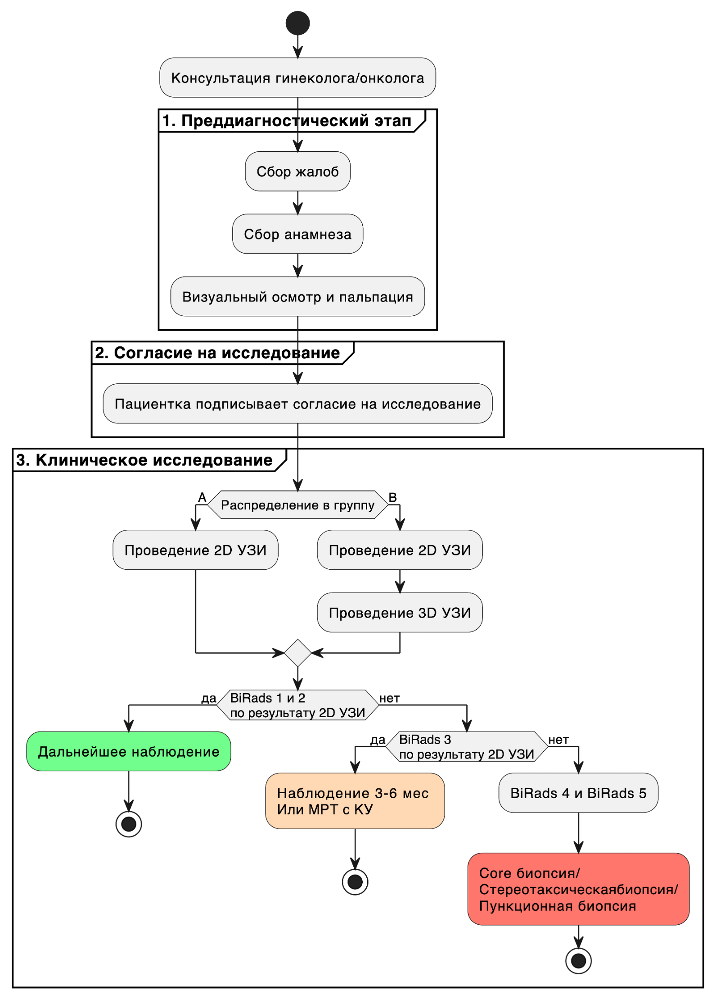
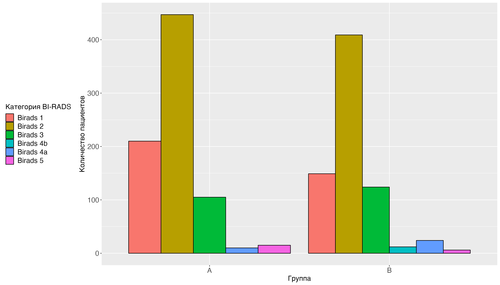
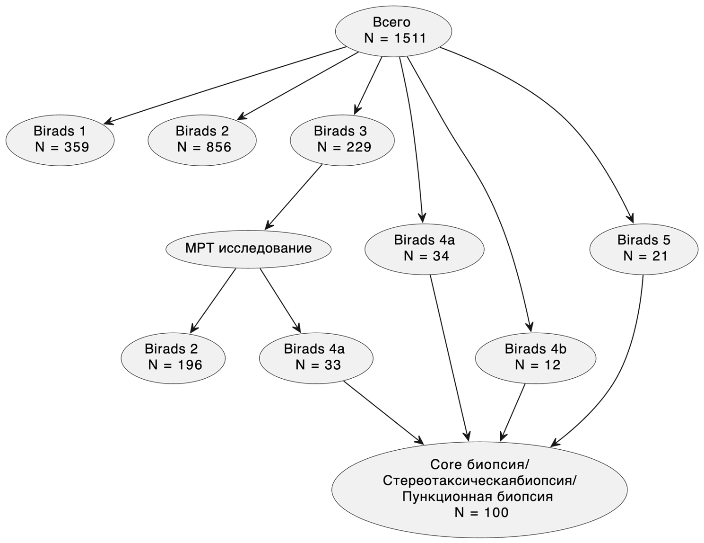
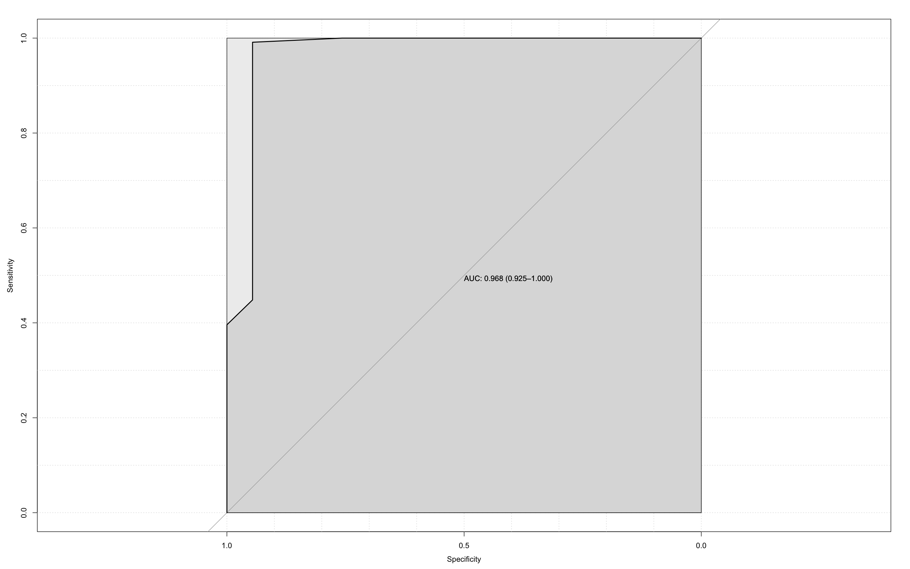
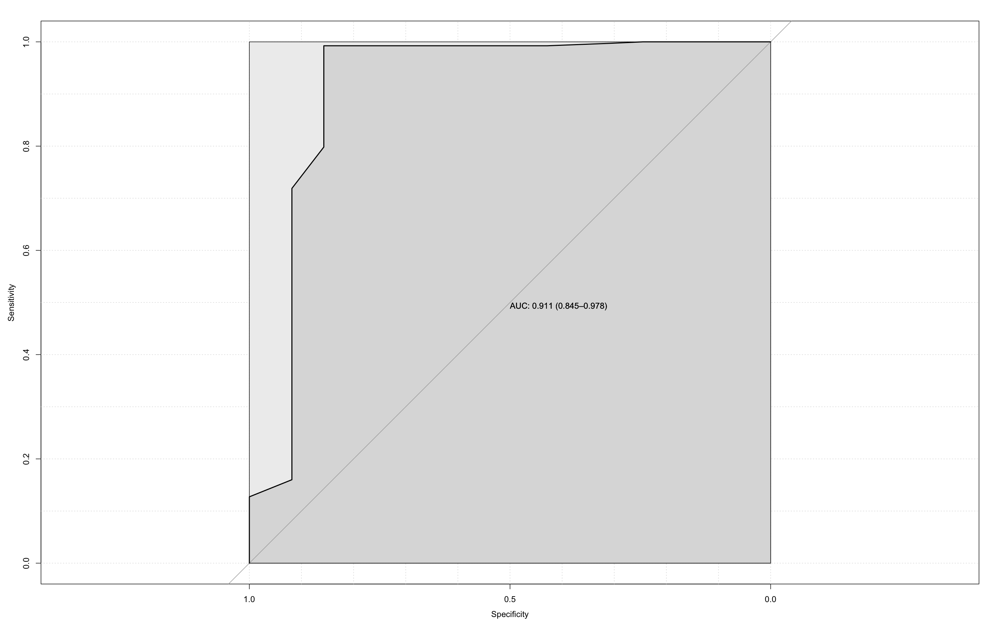
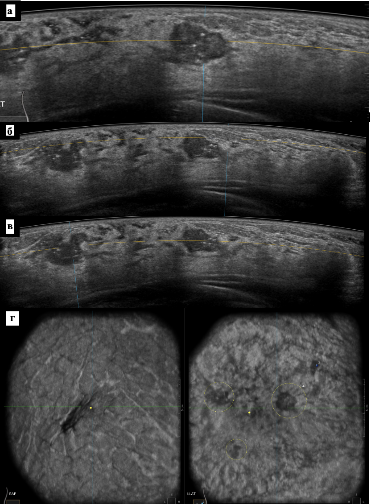
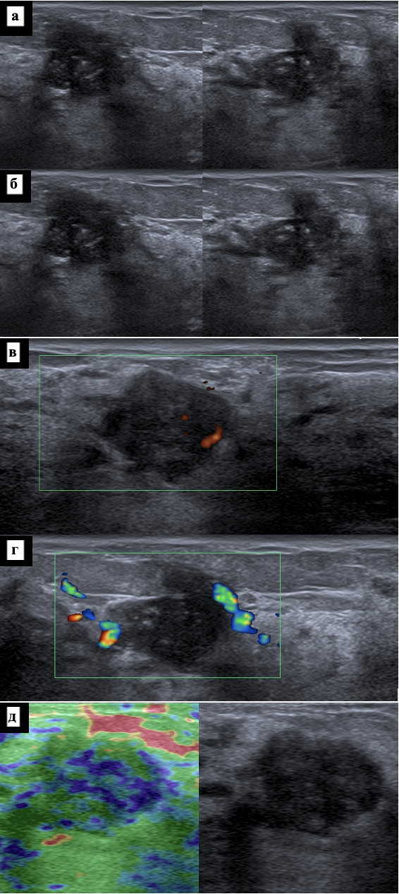
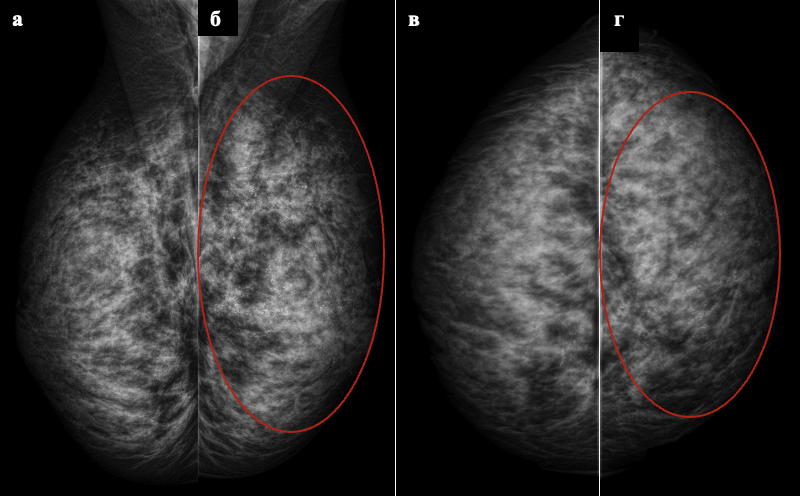

```{r setup, include=FALSE}
knitr::opts_chunk$set(echo = FALSE)
```

УДК 616-006.04

# Сравнение диагностической эффективности 2D и 3D ультразвукового исследования у женщин, не достигших возраста маммографического скрининга

Гаранина А.Э. 1,2, Холин А.В.1

1 Северо-Западный государственный Медицинский университет им. И. И.
Мечникова, Россия, Санкт-Петербург, 191015, Российская Федерация, г.
Санкт-Петербург, ул. Кирочная, д. 41

2 Клиника СМТ АО Поликлинический комплекс, Россия, 190013, г.
Санкт-Петербург, Московский пр., д. 22, литер а

**Резюме** Рак молочной железы является наиболее распространенным раком
среди женщин во всем мире. Молодые женщины чаще, чем женщины старшего
возраста, имеют агрессивные молекулярные подтипы и позднюю стадию
заболевания. Маммография имеет меньшую чувствительность в выявлении рака
молочной железы у женщин с плотной молочной железой, а 2D ультразвуковое
исследование (2D УЗИ) имеет ограничения, такие как высокий уровень
навыков и опыта специалиста и затраты времени на проведение
исследования. На сегодняшний день есть новая методика -
автоматизированное объемное ультразвуковое сканирование молочных желез
(3D УЗИ), позволяющая получать изображения с высоким разрешением.

**Цель исследования.** Провести сравнительный анализ диагностической
эффективности УЗИ в 2D-режиме и 3D (3D УЗИ) у женщин в возрастной группе
до 40 лет с высокой плотностью тканей молочной железы.

**Материалы и методы.** Ретро-проспективное клиническое одноцентровое
исследование. С февраля 2019 по май 2023 года было исследовано 1511
пациенток с возрастом до 40 лет. Пациентки были разделены на две группы.
Пациентки, попавшие в группу А проходили 2D УЗИ, результаты исследования
оценивались по классификации BI-RADS. Пациентки, попавшие в группу B в
дополнение к 2D ультразвуковому исследованию, проходили 3D УЗИ также с
выставлением категории BI-RADS. По итогам исследования определялись
положительная и отрицательная прогностическая ценность чувствительность,
специфичность и точность, а также составление предсказательной модели
метода.

**Результаты.** Метод УЗИ в группе А показал чувствительность 0.8,
специфичность 1, отбалансированную точность 0.9 и площадь под кривой
предсказательной модели 0.947, УЗИ в группе B 0.89, 0.98, 0.94 и 0.903
соответственно, УЗИ по всей выборке 0.87, 0.99, 0.93 и 0.916
соответственно. Метод 3D УЗИ в группе B показал чувствительность 0.95,
специфичность 0.99 и отбалансированную точность 0.97 и площадь под
кривой предсказательной модели 0.968.

**Выводы.** Диагностическая эффективность автоматизированного УЗИ
молочных желез у пациенток до 40 лет сопоставима по показателю
специфичности и лучше по показателю точности, чувствительности и лучше
прогностическая модель метода по сравнению с ультразвуковым
исследованием в 2D режиме. Метод 3D УЗИ имеет преимущества в сравнении с
2D ультразвуковым исследованием, а именно – воспроизводимость, оператор
независимость метода, сокращенное время проведения исследования,
получение визуализации всего органа, улучшенная визуализация при
мультицентричных и мультифокальных процессах, возможность оперативного
планирования, возможность «двойного чтения» результатов.

**Ключевые слова:** рак молочной железы, ультразвуковое исследование,
автоматизированное объемное сканирование молочных желез, молодые
женщины.

Авторы подтверждают отсутствие конфликтов интересов.

# Comparison of diagnostic efficacy of 2D and 3D ultrasound in women under the age of mammography screening

Garanina A.E. 1,2, Kholin A.V.1

1 North-Western State Medical University named after I.I. Mechnikov,
Saint-Petersburg, 191015, 41 Kirochnaya str., Saint Petersburg, Russian
Federation

2 SMT Clinic JSC Polyclinic Complex, Russia, 190013, St. Petersburg,
Moskovsky ave., 22, letter a

**Abstract** Breast cancer is the most common cancer among women
worldwide. Younger women are more likely than older women to have
aggressive molecular subtypes and late-stage disease. Mammography has
less sensitivity in detecting breast cancer in women with a dense
breast, and 2D ultrasound (2D US) has limitations, such as the
specialists high level of skill and experience and the time it takes to
perform the examination. Nowadays, there is a new technique - automated
volumetric ultrasound scanning of the breast (3D US), which allows you
to obtain high-resolution images. **Aim.** To perform a comparative
analysis of the diagnostic efficacy of 2D US and 3D US among women under
40 years of age with high breast tissue density. \*\* Methods.\*\* A
retro-prospective clinical single-center study. From February 2019 to
May 2023, 1511 patients under the age of 40 were examined. The patients
were divided into two groups. Patients in group A underwent 2D
ultrasound, the results of the study were evaluated according to the
BI-RADS classification. In addition to 2D ultrasound, the patients who
were placed in group B underwent 3D US also with the BI-RADS category.
Based on the results of the study, the positive and negative predictive
value, sensitivity, specificity and accuracy, as well as the compilation
of a predictive model of the method were determined. **Results.** The 2D
US in group A showed sensitivity of 0.8, specificity 1, balanced
accuracy of 0.9, and area under the predictive model curve of 0.947, US
in group B 0.89, 0.98, 0.94, and 0.903, respectively, and US of the
entire sample of 0.87, 0.99, 0.93, and 0.916, respectively. The 3D US in
group B showed a sensitivity of 0.95, specificity of 0.99 and a balanced
accuracy of 0.97 and an area under the predictive model curve of 0.968.
\*\* Conclusion.\*\* The diagnostic efficiency of 3D US of the mammary
glands in patients under 40 years of age is comparable in terms of
specificity and is better in terms of accuracy, sensitivity and a better
prognostic model of the method compared to US examination in 2D mode.
The 3D US method has advantages in comparison with 2D US examination,
namely reproducibility, operator independence of the method, reduced
examination time, obtaining visualization of the entire organ, improved
visualization in multicentric and multifocal processes, the possibility
of operational planning, the possibility of "double reading" of the
results. **Keywords:** Breast Cancer, Ultrasound, Automated Breast
Volumetric Scan, Young Women. Conflict of interest. The authors declare
no conflict of interest. The study had no sponsorship

## Введение

Рак молочной железы является наиболее распространенным раком среди
женщин во всем мире [@shapira2017; @kocarnik2022cancer;
@мерабишвили2023состояние; @мерабишвили2022состояние]. В США у одной из
196 женщин диагностируется рак молочной железы в возрасте до 40 лет. В
западной литературе принято использовать термин «Подростки и молодые
женщины», то есть пациентки в возрасте 15–39 лет [@cathcart-rake2021]. В
нашем исследовании будем пользоваться термином молодые женщины (МЖ). МЖ
чаще, чем женщины старшего возраста, имеют агрессивные молекулярные
подтипы и позднюю стадию заболевания, и при постановке диагноза они
часто требуют системного определения стадии [@cathcart-rake2021]. Риск
смерти от рака молочной железы увеличивается на 5% на каждый год
снижения возраста на момент постановки диагноза, что отражает более
агрессивные фенотипы, чем рак молочной железы, возникающий в более
позднем возрасте [@desreux2018]. Поскольку рак молочной железы среди МЖ
коррелирует с плохой выживаемостью [@desreux2018], раннее выявление
потенциально может улучшить выживаемость, повлиять на эффективность
лечения и задать более высокое качество жизни. Потенциально это снизит
бремя болезни и затраты на лечение. Однако к вопросам скрининга у МЖ
нужно относиться осторожно. Маммография остается золотым стандартом
скрининга рака молочной железы. Однако маммография имеет меньшую
чувствительность при выявлении рака молочной железы у женщин с плотной
молочной железой, особенно если речь идет о МЖ [@nazari2018]. Согласно
исследованиям, скрининг с помощью 2D ультразвукового исследования (2D
УЗИ) в дополнение к маммографии у женщин с плотной грудью
продемонстрировал увеличение показателей выявления рака молочной железы,
которые варьировались от 1,8 до 4,6 случаев рака на 1000 обследованных
женщин, в зависимости от стратификации населения по риску [@scheel2015;
@nazari2018]. Однако исследования программ скрининга в Дании у МЖ
[@jorgensen2010] с включением маммографии (ММГ) показали снижение
смертности, объясняется это изменениями факторов риска и улучшением
лечения, а не скрининговой ММГ. Однако УЗИ имеет ограничения, а именно
отсутствие стандартизации метода, требуемый высокий уровень навыков и
опыта, затраты времени [@rebolj2018]. Поэтому для скрининга рака
молочной железы было разработана новая методика - объемного
автоматизированного объемного сканирования молочных желез (3D УЗИ).
Новое поколение 3D УЗИ предлагает автоматическое сканирование молочной
железы с помощью датчика с большим полем обзора, позволяющего получать
изображения с высоким разрешением. Форма датчика специально разработана
с учетом нормальной кривизны молочной железы, сводя к минимуму
индуцированные артефакты на периферии [@vourtsis2017; @xin2021]. На
сегодняшний день 3D УЗИ является потенциалом развития в направлении
развития скрининга рака молочной железы, в частности у МЖ.

## Цель исследования

Провести сравнительный анализ диагностической эффективности
(чувствительности, специфичности и точности) 2D и 3D УЗИ, и комбинации
этих методик у женщин в возрастной группе до 40 лет с высокой плотностью
тканей молочной железы.

## Материалы и методы

Объектом исследования являются новообразования молочной железы,
регистрируемые при диагностике с использованием 2D УЗИ, 3D УЗИ.
Предметом исследования является изучение диагностической эффективности
автоматизированного объемного 2D УЗИ сканирования молочных желез, а
также анализ наиболее важных факторов на преддиагностическом этапе, так
и при выполнении конкретного диагностического метода, в частности при
выполнении автоматизированного объемного 2D УЗИ сканирования молочных
желез. Дизайн исследования можно охарактеризовать ретро-проспективное
наблюдательное исследование. Протокол настоящего исследования был
одобрен на заседании локального этического комитета СЗГМУ им. Мечникова
№9 от 12.10.2022 года.

*Последовательность проведения диагностики*

При обращении пациентки к гинекологу или онкологу проводился сбор жалоб,
анамнеза и осмотр, полученные данные регистрировались в карте пациента.
Далее пациентке предлагалось пройти обследование в рамках настоящего
исследования и после получения согласия проводилась распределение по
группам в случайном порядке. Пациентки, попавшие в группу А проходили 2D
УЗИ результаты исследования оценивались по классификации BI-RADS.
Пациентки, попавшие в группу B в дополнение, проходили 3D УЗИ также с
выставлением категории BI-RADS по УЗИ (Рисунок №1).



**Рисунок 1.** Схема проведения диагностики настоящего исследования МРТ
с КУ - магнитно-резонансная томография с контрастным усилением; УЗИ -
ультразвуковое исследование, BI-RADS - «Breast Imaging-Reporting and
Data System», стандартизированная шкала оценки результатов маммографии,
УЗИ и МРТ по степени риска наличия злокачественных образований молочной
железы)

**Figure 1.** Scheme of diagnostics of this study: MRI -
contrast-enhanced magnetic resonance imaging; Ultrasound - ultrasound
examination, BI-RADS - Breast Imaging-Reporting and Data System, a
standardized scale for assessing the results of mammography, ultrasound
and MRI according to the risk of the presence of malignant breast
tumors)

Пациенткам, которым по результатам УЗИ исследования были выставлены
категории BI-RADS 1 и BI-RADS 2 было рекомендовано дальнейшее
наблюдение. При выставлении категории BI-RADS 3 был рекомендован
короткий период наблюдения в течении 3-6 месяцев или МРТ с контрастным
усилением. При категории BI-RADS 4 и BI-RADS 5 проводилась core биопсия
или стереотаксическая биопсия или пункционная биопсия (при наличии
жидкостного компонента). Все данные регистрировались для дальнейшего
анализа.

Описание выборки и групп

С февраля 2019 по май 2023 года было исследовано 1511 пациенток с
возрастом до 40 лет. Медиана возраста пациенток выборке до 40 лет
составил 35 [Q1-Q3: 32;37] лет. Минимальный возраст составил 20 лет
Максимальный возраст составил 39 лет Медиана роста пациенток выборке до
40 лет составил 167 [Q1-Q3: 164;170] см. Медиана веса пациенток выборке
до 40 лет составил 59 [Q1-Q3: 55;65] кг. Все пациентки были разделены на
две группы A и B. В группу A вошло 724 пациенток и в этой группе
скрининг проводился с использованием 2D УЗИ диагностики и
автоматизированного объемного УЗИ сканирования молочных желез
(исследуемая группа). В группу B вошло 787 пациенток и в этой группе
скрининг проводился только с использованием ручного УЗИ диагностики
(контрольная группа). У всех пациенток проводился сбор жалоб, анамнеза и
осмотр. Основные описательные данные групп представлены в таблице №1.

**Таблица № 1.**

**Основные характеристики пациенток, прошедших исследование**

**Table № 1.**

**Main characteristics of the patients included in the study**

| Группы                             | Группа A          | -----        | Группа B          | ------            |
|------------------------------------|-------------------|--------------|-------------------|-------------------|
| Жалобы                             | ------            | ------       | ------            | ------            |
| без жалоб                          | 86.785% (683/787) | [0.84; 0.89] | 82.873% (600/724) | [0.8; 0.86]       |
| боль                               | 4.828% (38/787)   | [0.03; 0.07] | 5.249% (38/724)   | [0.04; 0.07]      |
| выделения из соска                 | 0.381% (3/787)    | [0; 0.01]    | 0.967% (7/724)    | [0; 0.02]         |
| уплотнение                         | 8.005% (63/787)   | [0.06; 0.1]  | 10.912%           | (79/724)          |
| Репродуктивный статус              | ------            | ------       | ------            | ------            |
| репродуктивный возраст             | 96.696% (761/787) | [0.95; 0.98] | 97.238% (704/724) | [0.96; 0.98]      |
| пременопауза                       | 3.304% (26/787)   | [0.02; 0.05] | 2.762% (20/724)   | [0.02; 0.04]      |
| Операции на молочной железе        | ------            | ------       | ------            | ------            |
| не было операций                   | 98.475% (775/787) | [0.97; 0.99] | 98.343% (712/724) | [0.97; 0.99]      |
| были операции                      | 1.525% (12/787)   | [0.01; 0.03] | 1.657% (12/724)   | [0.01; 0.03]      |
| Прием гормональных препаратов      | ------            | ------       | ------            | ------            |
| да                                 | 19.695% (155/787) | [0.17; 0.23] | 21.409% (155/724) | [0.19; 0.25]      |
| нет                                | 80.305% (632/787) | [0.77; 0.83] | 78.591% (569/724) | [0.75; 0.81]      |
| Наследственная предрасположенность | ------            | ------       | ------            | ------            |
| есть                               | 31.004% (244/787) | [0.28; 0.34] | 31.077% (225/724) | [0.28; 0.35]      |
| нет                                | 68.996% (543/787) | [0.66; 0.72] | 68.923% (499/724) | [0.65; 0.72]      |
| Мутация BRCA                       | ------            | ------       | ------            | ------            |
| BRCA1                              | 100% (6/6)        | [0.52; 1]    | 0% (0/18)         | [0; 0.22]         |
| мутаций не выявлено                | 0% (0/6)          | [0; 0.48]    | 100% (18/18)      | [0.78; 1]         |
| Симптом втягивания соска           | ------            | ------       | ------            | ------            |
| да                                 | 0% (0/787)        | [0; 0.01]    | 2.486% (18/724)   | [0.02; 0.04]      |
| нет                                | 100% (787/787)    | [0.99; 1]    | 97.514% (706/724) | [0.96; 0.98]      |
| Симптом выделения из соска         | ------            | ------       | ------            | ------            |
| нет                                | 99.111% (780/787) | [0.98; 1]    | 100% (724/724)    | [0.99; 1]         |
| кровянистые                        | 0.889% (7/787)    | [0; 0.02]    | 0% (0/724)        | [0; 0.01]         |
| Тип структуры ACR                  | ------            | ------       | ------            | ------            |
| С                                  | 72.935% (574/787) | [0.7; 0.76]  | 67.818% (491/724) | [0.64; 0.71]      |
| D                                  | 27.065%           | (213/787)    | [0.24; 0.3]       | 32.182% (233/724) |

Группы распределены равномерно по показателям «Репродуктивный статус»
(p-уровень = 0,57), «Наследственная предрасположенность» (p-уровень =
0,89), «Прием гормональных препаратов» (p-уровень = 0,19), и «Тип
структуры ACR» (p-уровень = 0,11).

*Описание 3D УЗИ*

3D-автоматизированная ультразвуковая система Invenia (3D УЗИ)
производства GE Healthcare (Саннивейл, Калифорния, США) 2018 года
выпуска— это компьютерная система для оценки плотной молочной железы.
Каждая молочная железа была визуализирована в трех проекциях: боковой
(LAT), переднезадней (AP) и медиальный (MED) с автоматическим датчиком с
линейной матрицей от 6 до 14 МГц, прикрепленным к жесткой компрессионной
пластине (площадь 15,4×17,0×5,0 см).

После завершения сбора данных ультразвуковой системой весь массив
передавался на специальную рабочую станцию для интерпретации. Оценку
изображений 3D УЗИ выполнял один врач ультразвуковой диагностики, со
стажем работы более 7 лет.

*Описание УЗИ-исследования*

УЗИ исследование выполняли два врача ультразвуковой диагностики со
стажем работы более 7 лет. Исследование проводилось в положении лежа, с
руками за головой, с последовательным сканированием каждого квадранта
обеих молочных железе в сагитальной и аксиальной плоскостях, с
исследованием ретроареолярной области и аксиллярных областей с двух
сторон. Устройства, используемые для проведения 2D узи, включали GE
LOGIQS 8 (GE Medical Systems, Милуоки, Висконсин, США), Toshiba Aplio
300(Canon Япония)- ультразвуковые системы экспертного класса.

*Интервенционные вмешательства.*

При выявлении изменений, оцененных категорией BI-RADS 4-5, выполнялась
трепан- биопсия под ультразвуковым наведением с помощью специальной
системы для биопсии Bard-Magnum, полуавтоматическое устройство и игл
14-G или 12-G, полученные образцы оправляли на гистологическое и
иммуногистохимическое исследование.

*Статистический анализ*

Статистическая обработка проводилась с помощью язык программирования R.
Для определения числа наблюдений при каждом типе воздействия в каждой
группе производился расчет мощности пропорций при уровне значимости 95%
и мощностью 0.8 с предварительным расчетом величины эффекта. Данные,
необходимые для расчета величины эффекта были взяты из исследования Xin
Y. и коллег (2021) [10]. Для описания количественных показателей
проводилась оценка на нормальность распределения, в качестве метода
использовался критерий Шапиро-Уилка. Определялась чувствительность,
специфичность и точность. Для построения предсказательной модели на
основании данных использовалась логистическая регрессия.

## Результаты исследования

По результатам выполнения УЗИ был поставлен диагноз злокачественного
образования в группе A в 1.91% (15), в группе B в 6.49% (47). При
выполнении 3D УЗИ был поставлен диагноз злокачественного образования в
группе B в 6.077% (44). На рисунке №2а представлено распределение
пациентов по системе BI-RADS. Пациенты, которым была определена
категория BI-RADS 3 выполняли МРТ исследование и по его результатам была
определена категория BI-RADS 2 в 196 и BI-RADS 4а в 33 случаях (Рисунок
2б).





**Рисунок №2** Распределение поставленных категорий BI-RADS после
выполнения УЗИ (а) и количество пациентов, которым была выполнена
биопсия (б)

**Figure 2** Distribution of BI-RADS categories after ultrasound (a) and
number of patients who passed biopsy (b)

Основные результаты гистологического и иммуногистохимического
исследований по результатам проведенной биопсии представлены в таблице
№2.

**Таблица №2**

**Результаты гистологического и иммуногистохимического исследований**

**Table 2**

**Results of histological and immunohistochemical study**

| Показатель                              | Процентная доля    | 95% ДИ         | Процентная доля    | 95% ДИ      |
|-----------------------------------------|--------------------|----------------|--------------------|-------------|
| Группы                                  | Группа А           | -----          | Группа Б           | -----       |
| Гистологическое и сследование-----      | -----              | -----          | -----              |             |
| инвазивный дольковый рак                | 13.333% (2/15)     | [0.02;0.42]    | 0% (0/37) [0;0.12] |             |
| инвазивный рак нес пециального типа     | 60% (9/15)         | [0.33;0.83]    | 67.568% (25/37)    | [0.5;0.81]  |
| протоковый рак in situ                  | 26.667% (4/15)     | [0.09;0.55]    | 32.432% (12/37)    | [0.19;0.5]  |
| Иммуногистохимическое исследование----- | -----              | -----          | -----              |             |
| негатив                                 | 60% (9/15)         | [0.33;0.83]    | 10.811% (4/37)     | [0.04;0.26] |
| Her-2_neu                               | 0% (0/15) [0;0.25] | 16.216% (6/37) | [0.07;0.33]        |             |
| РЭ+РП +Her-2_neu                        | 0% (0/15) [0;0.25] | 16.216% (6/37) | [0.07;0.33]        |             |
| РЭ+РП +Her-2_neu негатив                | 40% (6/15)         | [0.17;0.67]    | 56.757% (21/37)    | [0.4;0.72]  |
| Степень злокачественности-----          | -----              | -----          | -----              |             |
| II (умеренная 6-7 балов)                | 40% (6/15)         | [0.17;0.67]    | 51.351% (19/37)    | [0.35;0.68] |
| III (высокая 8-9 бал)                   | 60% (9/15)         | [0.33;0.83]    | 48.649% (18/37)    | [0.32;0.65] |

*Определение чувствительности, специфичности и точности методов*

Основные результаты определения точности, чувствительности и
специфичности приведены в таблице №3. Согласно полученным результатам 3D
УЗИ показал лучшие результаты по показателю отбалансированной точности и
чувствительности, и сопоставимые результаты по показателю специфичности,
чем ультразвуковое исследование в 2D режиме.

**Таблица №3.**

**Результаты статистического анализа в группах А и B**

(Т -Точность, P - P-Value, КК - Коэффициент Kappa, ТМ -Тест Макнемара,
ППЦ - положительная прогностическая ценность, ОПЦ - отрицательная
прогностическая ценность, Ч-Чувствительность, Сп -Специфичность, ОТ-
Отбалансированная точность)

**Table 3.**

**Results of statistical analyses in groups A and B**

| Метод                             | Т                        | P    | КК   | ТМ   | ППЦ  | ОПЦ  | Ч    | Сп   | ОТ   |
|-----------------------------------|--------------------------|------|------|------|------|------|------|------|------|
| УЗИ в группе А                    | 0.99 [95% ДИ: 0.98,1]    | 0.01 | 0.8  | 1    | 0.8  | 1    | 0.8  | 1    | 0.9  |
| УЗИ в группе B                    | 0.98 [95% ДИ: 0.96,0.99] | 0    | 0.77 | 0.03 | 0.7  | 0.99 | 0.89 | 0.98 | 0.94 |
| 3D УЗИ в группе B                 | 0.98 [95% ДИ: 0.97,0.99] | 0    | 0.86 | 0.07 | 0.8  | 1    | 0.95 | 0.99 | 0.97 |
| УЗИ в выборке пациенток до 40 лет | 0.98 [95% ДИ: 0.98,0.99] | 0    | 0.78 | 0.07 | 0.73 | 1    | 0.87 | 0.99 | 0.93 |

*Прогностическая оценка методов*

Основные результаты представлены на рисунке №2 и таблице №4. Следует
сказать, что прогностическая модель также показывает лучшую
эффективность 3D, чем 2D УЗИ.


А


Б



В



Г

*Рисунок №3.* а. ROC-кривая предсказательной модели для метода УЗИ, по
данным полученным в группе A. б. ROC-кривая предсказательной модели для
метода УЗИ, по данным полученным в группе B. в. ROC-кривая
предсказательной модели для метода 3D УЗИ, по данным полученным в группе
B. г. ROC-кривая предсказательной модели для метода УЗИ, по данным
полученным в выборке пациенток до 40 лет.

*Figure 2.* a. ROC curve of the predictive model for the ultrasound
method, according to the data obtained in group A. b. ROC curve of the
predictive model for the ultrasound method, according to the data
obtained in the group B. ROC curve of the predictive model for the 3D
ultrasound method, according to the data obtained in group B. g. ROC
curve of the predictive model for the ultrasound method, according to
the data obtained in a sample of patients under 40 years old.

**Таблица №4.**

**Определение площади под кривой представленных предсказательных моделей
метода в группах А и B.**

**Table 4.**

**Determination of the area under the curve of the presented predictive
models of the method in groups A and B.**

| Метод                             | Площадь под кривой          |
|-----------------------------------|-----------------------------|
| УЗИ в группе A                    | 0.947 95% ДИ: 0.894 - 1     |
| УЗИ в группе B                    | 0.903 95% ДИ: 0.82 - 0.986  |
| УЗИ в выборке пациенток до 40 лет | 0.916 95% ДИ: 0.853 - 0.979 |
| ABUS в группе B                   | 0.968 95% ДИ: 0.925 - 1     |

**Клинический случай**

Пациентка М. 32 года. Показание для исследования уплотнение в левой
молочной железе около 1 месяца, болезненность в обеих молочных железах.
Анамнез не отягощен, в том числе семейный. ВВК левой молочной железы
пальпируется узловое образование до 1,2 см в диаметре, ННК до 1,5 см в
диаметре, без четких контуров, плотное, не спаяно с окружающими тканями.

Автоматизированное 3D ультразвуковое сканирование молочных желез
представлено на рисунке №4. Мультицентричный рак левой молочной железы.
MD BI-RADS 2, MS BI-RADS 4С.



**Рисунок №4. а, б, в, г.** Система 3D УЗИ. Анализ 3D-данных на
ультразвуковом аппарате.

**Figure №4. a, b, c, d.** 3D ultrasound system. Analysis of 3D data on
an ultrasound machine.

Ультразвуковое исследование представлено на рисунке № 5. Ультразвуковые
признаки выраженного диффузного фиброаденоматоза обеих молочных желез с
преобладанием железистого компонента (аденоз). Ультразвуковая оценка
BI-RADS справа 2/слева 4С. Гистологически выявлен инвазивный рак
неспециального типа на фоне протокового G 3. Иммуногистохическое
исследование: ER - 8 баллов, PR - 8 баллов, HER2/neu - 2+, Ki67 - 70%.
Пациентке показано оперативное лечение.



**Рисунок № 5.а.** Эхограмма левой молочной железы. ВВК определяется
образование неправильной формы. **б.** Эхограмма левой молочной железы.
В режиме Micro Pure определяются кальцинаты. **в.** Эхограмма левой
молочной железы. В режиме ЦДК - перинодулярные локусы кровотока. **г.**
Эхограмма левой молочной железы. В ВНК определяется образование овальной
формы. д. Эхограмма левой молочной железы. В режиме эластографии
картируется эластотип N2-мозаичный зелено-синий. Коэффициент
деформации - 2,18.

**Figure 5.a.** Echogram of the left mammary gland. An irregular shape
is determined by the VVK. **b.** Echogram of the left breast. In the
Micro Pure mode, calcifications are determined. **c.** Echogram of the
left breast. In the CDK mode, there are perinodular loci of blood flow.
**g.** Echogram of the left breast. In the KSS, an oval-shaped formation
is determined. d. Echogram of the left breast. In the elastography mode,
the N2-mosaic green-blue elastotype is mapped. The strain coefficient is
2.18.

Далее была выполнена диагностическая ММГ, так как выявлено
подозрительное новообразование на 2d УЗИ и 3D УЗИ. Рентгеновская
маммография показана на рисунке №6.



**Рисунок 6** Цифровая маммография обеих молочных желез **а, б.** косая
медиолатеральная проекция; **в, г.** краниокаудальная проекция.

**Figure 6** Digital mammography of both breasts**a, b.** oblique
mediolateral projection; **B, G.** Craniocaudal projection.

Кальцинаты: слева в ВВК определяются в структуре диффузно множественные
полиморфные микрокальцинаты. Инфильтративная форма образования левой
молочной железы? нелактационный мастит? Тип С по ACR. MD BI-RADS 2, MS
BIRАDS 4А.

## Дискуссия

Проблема раннего выявления рака молочной железы у МЖ является актуальной
и рассматривать ее следует не только с точки зрения эффективности
метода, а с точки зрения выживаемости пациенток.

Раннее выявление снижает смертность среди женщин с раком молочной железы
[@monticciolo2018]. В настоящее время ACR рекомендует ежегодно
маммографический скрининг, начиная с 40 лет для женщины со средним
риском развития рака молочной железы. [@monticciolo2018]. Женщины с
дополнительными факторами, такими как семейный анамнез, генетический
фактор мутации, эндогенные гормональные факторы и гормонозаместительная
терапия, имеют риск выше среднего развития рака молочной железы и это
требует дальнейшего рассмотрения более раннего и/или более интенсивного
скрининга [@monticciolo2018].

На сегодняшний день существуют исследования, которые продемонстрировали
аналогичную диагностическую эффективность 3D УЗИ по сравнению с УЗИ, но
в целом общие результаты были противоречивыми. В некоторых исследованиях
сообщалось, что 3D УЗИ имеет более высокую чувствительность от 95 до
100% и более низкую специфичность от 58 до 95% [@lin2012; @wang2012;
@kotsianos-hermle2009]. Напротив, другие показали, что УЗИ
продемонстрировал превосходную чувствительность, в то время как 3D УЗИ
продемонстрировал несколько более высокую специфичность [@kim2013;
@prosch2011].

Авторы указывают две причины более низкой чувствительности 3D УЗИ.
Во-первых, у рентгенологов было мало опыта интерпретации изображений 3D
УЗИ [@skaane2015; @chen2013]. Одно исследование также показало, что все
пропущенные раки, можно было продемонстрировать в ретроспективном
анализе [@lin2020]. Во-вторых, 3D УЗИ мог пропустить поражения из-за
плохого качества изображения [@lin2020]. В нашем центре качество
изображений получено на высоком уровне. Средний медицинский персонал,
работающий с системой 3D УЗИ, прошел достаточную подготовку, чтобы
гарантировать качество получения изображений, специалисты УЗИ имеют
высокий квалификационный уровень для интерпретации изображений. Также
стоит обратить внимание, что требуется более короткий срок обучения для
того, чтобы рутинно выполнять 3D УЗИ, при этом метод имеет сопоставимую
диагностическую эффективность в сравнении с выполнением УЗИ
[@rebolj2018]. Это подчеркивает преимущества 3D УЗИ перед УЗИ: 3D УЗИ
менее зависит от оператора и может снизить рабочую нагрузку на
специалистов за счет обучения квалифицированных специалистов со средним
медицинским образованием.

## Выводы

1.  3D УЗИ представляется перспективным методом, дополняющим программы
    скрининга в особенности у женщин с плотной молочной железой.
    Представленная методика повышает частоту выявления рака.

2.  Согласно проведенному нами исследованию, диагностическая
    эффективность автоматизированного УЗИ молочных желез у пациенток до
    40 лет сопоставима по показателю специфичности и лучше по показателю
    точности, чувствительности, лучше прогностическая модель метода по
    сравнению с ультразвуковым исследованием в 2D режиме.

3.  Однако 2D ультразвуковое исследование имеет ограничения, в частности
    зависимость от оператора, небольшое поле обзора, которые
    ограничивают его широкое внедрение. В то время как 3D ультразвуковое
    исследование имеет преимущества в сравнении с 2D ультразвуковым
    исследованием, а именно – воспроизводимость, независимость метода от
    оператора, быстрое получение изображение, время интерпретации
    изображения около 3-5 минут на одно исследование, возможность
    «двойного чтения» результатов.

4.  Таким образом 3D ультразвуковое исследование становится
    многообещающим методом для интеграции в клиническую практику у
    женщин всех возрастных групп, в том числе репродуктивного возраста,
    с учетом персонализированного подхода к программам скрининга.

## Участие авторов

Гаранина А.Э. – концепция и дизайн исследования,

проведение исследования, анализ и интерпретация полученных данных,
написание текста и статистическая обработка данных.

Холин А.В. – концепция и дизайн исследования, подготовка и

редактирование текста, утверждение окончательного варианта

статьи.

## Authors’ participation

Garanina A.E. – сoncept and design of the study, conducting research,
analysis and interpretation of the data, text writing and data
processing.

Kholin A.V. – concept and design of the study, preparation and editing
of the text and approval of the final version of the article.

## Информация об авторах

Гаранина Анна Эдуардовна – аспирант кафедры лучевой диагностики ФГБОУ ВО
“Северо-Западный государственный Медицинский университет
им.И.И.Мечникова”, Врач ультразвуковой диагностики, Клиника СМТ АО
Поликлинический комплекс, Санкт-Петербург, Российская Федерация.

e-mail:
[anna.garanina.90\@mail.ru](mailto:anna.garanina.90@mail.ru){.email}

SPIN-код: 8668-3521

ORCID: <https://orcid.org/0009-0001-8193-6657>

Холин Александр Васильевич - доктор медицинских наук, профессор
заведующий кафедрой лучевой диагностики ФГБОУ ВО “Северо-Западный
государственный Медицинский университет им.И.И.Мечникова”.

e-mail: [holin1959\@list.ru](mailto:holin1959@list.ru){.email}.

SPIN-код: 9791-8550

ORCID: <https://orcid.org/0000-0001-8227-1530>

## Информация об авторах

Контакты: Гаранина Анна Эдуардовна,
[anna.garanina.90\@mail.ru](mailto:anna.garanina.90@mail.ru){.email}

Гаранина Анна Эдуардовна – аспирант кафедры лучевой диагностики ФГБОУ ВО
“Северо-Западный государственный Медицинский университет
им.И.И.Мечникова”, Врач ультразвуковой диагностики, Клиника СМТ АО
Поликлинический комплекс, Санкт-Петербург, Российская Федерация.

e-mail:
[anna.garanina.90\@mail.ru](mailto:anna.garanina.90@mail.ru){.email}

SPIN-код: 8668-3521

ORCID: <https://orcid.org/0009-0001-8193-6657>

Холин Александр Васильевич - доктор медицинских наук, профессор
заведующий кафедрой лучевой диагностики ФГБОУ ВО “Северо-Западный
государственный Медицинский университет им.И.И.Мечникова”.

e-mail: [holin1959\@list.ru](mailto:holin1959@list.ru){.email}.

SPIN-код: 9791-8550

ORCID: <https://orcid.org/0000-0001-8227-1530>

## About the authors

Contacts: Anna E. Garanina,
[anna.garanina.90\@mail.ru](mailto:anna.garanina.90@mail.ru){.email}

Garanina Anna Eduardovna – PhD student at the Department of Radiation
Diagnostics North-Western State Medical University named after I.I.
Mechnikov, Saint-Petersburg, 191015, 41 Kirochnaya str., Saint
Petersburg, Russian Federation, Врач ультразвуковой диагностики, SMT
Clinic JSC Polyclinic Complex, Russia, 190013, St. Petersburg, Moskovsky
ave., 22, letter a.

e-mail:
[anna.garanina.90\@mail.ru](mailto:anna.garanina.90@mail.ru){.email}

SPIN-код: 8668-3521

ORCID: <https://orcid.org/0009-0001-8193-6657>

Kholin Aleksandr Vasilevich - Doctor of Medical Sciences, Professor,
Head of the Department of Radiation Diagnostics North-Western State
Medical University named after I.I. Mechnikov, Saint-Petersburg, 191015,
41 Kirochnaya str., Saint Petersburg, Russian Federation

e-mail: [holin1959\@list.ru](mailto:holin1959@list.ru){.email}.

SPIN-код: 9791-8550

ORCID: <https://orcid.org/0000-0001-8227-1530>

## Список литературы
