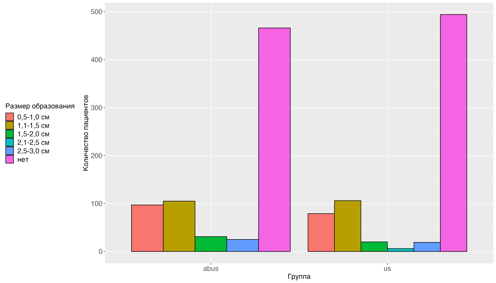
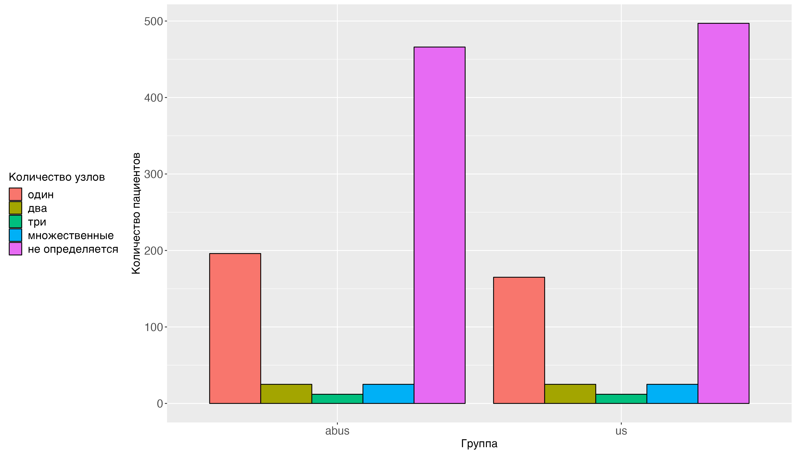
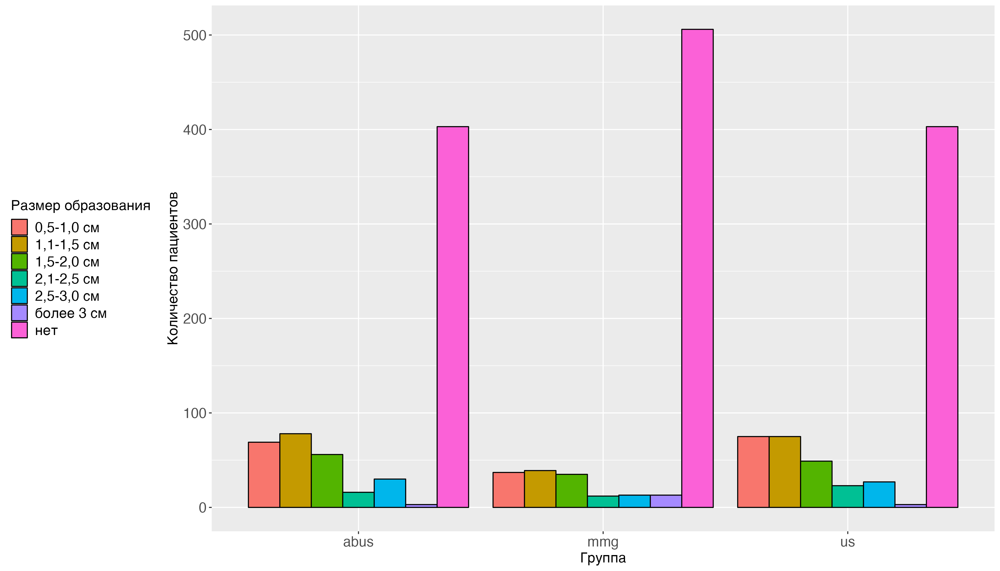
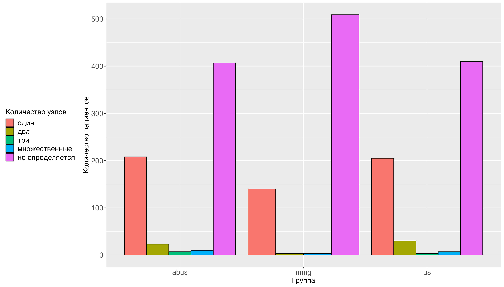

```{r setup, include=FALSE}
knitr::opts_chunk$set(echo = TRUE)
```

УДК 616-006.04

# Сравнение возможностей 2D и 3D УЗИ определение локализации и размера новообразований у женщин с плотной молочной железой

Гаранина А.Э. ^1,2^, Холин А.В.^1^

^1^ Северо-Западный государственный Медицинский университет им. И. И.

Мечникова, Россия, Санкт-Петербург, 191015, Российская Федерация, г.

Санкт-Петербург, ул. Кирочная, д. 41

^2^ Клиника СМТ АО Поликлинический комплекс, Россия, 190013, г.

Санкт-Петербург, Московский пр., д. 22, литер а

Контакты: Гаранина Анна Эдуардовна,

[anna.garanina.90\@mail.ru](mailto:anna.garanina.90@mail.ru)

**Резюме** В сочетании с маммографией (ММГ) ультразвуковое исследование
2D УЗИ молочных желез получило широкое признание в качестве
диагностического инструмента для оценки и характеристики пальпируемых и
непальпируемых образований молочной железы (МЖ). Трёхмерное
автоматизированное ультразвуковое исследование молочных желез (3D УЗИ)
позволяет получить полное документирование.

**Цель исследования.** Провести сравнительное исследование определения
локализации и размера образований методами 2D и 3D УЗИ у женщин с
плотной МЖ.

**Материалы и методы.** С февраля 2019 по май 2023 года проводилось
ретро-проспективное наблюдательное исследование. В исследование вошло
628 пациенток до 40 лет. Пациенток 40 лет и старше в исследование вошло
655. Всем пациенткам выполнялось 2d УЗИ в B-режиме MicroPure и
автоматизированного 3d УЗИ. Пациенткам 40 лет и старше также выполнялась
ММГ. Проводилась сравнения найденных размеров и количества узлов.

**Результаты.** В группе пациенток до 40 лет представлена. по показателю
Размеры узлов статистически значимой разницы по показателям не было
выявлено В сравнении методов 2d УЗИ и 3d УЗИ в группе 40 лет и старше
также не было выявлено разницы ни по количеству узлов, ни по размерам
узлов. В то время как при сравнении методов 2d УЗИ/3d УЗИ и ММГ выявлена
статистически значимая разница в пользу УЗИ в выявлении размеров 0,5-1,0
см, 1,1-1,5 см, 2,5-3,0 см, и вползу ММГ при размерах более 3 см
(p-уровень = 0.023). Так же найдена разница в пользу УЗИ при обнаружении
одного узла и двух узлов и нахождении узлов в целом.

**Выводы.** Размер очагов и количество очагов, выявленных с помощью 3d
УЗИ сопоставим с 2d УЗИ, методы точно лучше выявляют образований менее 2
мм в сравнении с ММГ. Метод 3d УЗИ имеет улучшенную визуализацию
мультицентричных и мультифокальных очагов за счет уникального
коронарного среза, имеет возможность более точно оперативного
планирования за счет уникального коронарного среза, улучшенную
визуализацию участков нарушения архитектоники так же за счет уникального
коронарного среза, позволяет ⁠более четко расписать визуализируемые
размеры образований и ⁠так же метод 3d УЗИ позволяет описать результаты
что за счет возможности архивного хранения и возможности сопоставлять в
динамике размеры очагов и оценку при неоадьювантной химиотерапии.

**Ключевые слова:** рак молочной железы, ультразвуковое исследование,
автоматизированное объемное сканирование молочных желез, размер узлов,
количество узлов.

Авторы подтверждают отсутствие конфликтов интересов.

# Comparison of the possibilities of 2D and 3D ultrasound to determine the size and number of neoplasms in women with a dense breast

Garanina A.E. 1,2, Kholin A.V.1

1 North-Western State Medical University named after I.I. Mechnikov,
Saint-Petersburg, 191015, 41 Kirochnaya str., Saint Petersburg, Russian
Federation

2 SMT Clinic JSC Polyclinic Complex, Russia, 190013, St. Petersburg,
Moskovsky ave., 22, letter a

**Abstract** In combination with mammography (MMG), 2D breast ultrasound
has gained wide recognition as a diagnostic tool for the evaluation and
characterization of palpable and nonpalpable breast masses.
Three-dimensional automated ultrasound examination of the mammary glands
(3D ultrasound) allows for complete documentation.

**Aim.** To perform a comparative study of determining the localization
and size of lesions by 2D and 3D ultrasound methods in women with dense
breast disease.

\*\* Methods.\*\* From February 2019 to May 2023, a retro-prospective
observational study was conducted. The study included 628 patients under
40 years of age. A total of 655 patients aged 40 and older were included
in the study. All patients underwent 2D ultrasound in B-mode MicroPure
and automated 3D ultrasound. Patients 40 years of age and older also
underwent MMG. A comparison of the found sizes and number of nodes was
carried out.

**Results.** In the group of patients under 40 years of age, it is
represented. There was no statistically significant difference in the 2D
ultrasound and 3D ultrasound methods in the group of 40 years and older
In the comparison of the methods of 2d ultrasound and 3d ultrasound in
the group of 40 years and older, there was also no difference in either
the number of nodules or the size of the nodules. At the same time, when
comparing the methods of 2d ultrasound/3d ultrasound and MMG, a
statistically significant difference was found in favor of ultrasound in
detecting sizes of 0.5-1.0 cm, 1.1-1.5 cm, 2.5-3.0 cm, and creeping MMG
at sizes greater than 3 cm (p-level = 0.023). There was also a
difference in favor of ultrasound when detecting one node and two nodes
and finding nodules as a whole.

\*\* Conclusion.\*\* The size of the nodules and the number of nodules
detected by 3d ultrasound is comparable to 2d ultrasound, the methods
are definitely better at detecting formations less than 2 mm compared to
MMG. The 3D ultrasound method has improved visualization of multicentric
and multifocal foci due to a unique coronary section, has the ability to
more accurately plan operational due to a unique coronary section,
improved visualization of areas of architectonics violation also due to
a unique coronary section, allows you to more clearly describe the
visualized size of formations and also the 3D ultrasound method allows
you to describe the results, which due to the possibility of archival
storage and the ability to compare the dynamics of the size of the foci
and the assessment in neoadjuvant chemotherapy.

**Keywords:** breast cancer, ultrasound, automated volumetric breast
scanning, nodules size, number of nodules.

Conflict of interest. The authors declare no conflict of interest. The
study had no sponsorship

## Введение

В сочетании с маммографией (ММГ) ультразвуковое исследование 2D УЗИ
молочных желез получило широкое признание в качестве диагностического
инструмента для оценки и характеристики пальпируемых и непальпируемых
образований молочной железы (МЖ) [@myers2015benefits; @euhus2015breast;
@joshi2022performance; @holm2020risk]. Поскольку ММГ имеет ограничения в
выявлении злокачественных новообразований, скрытых в плотной
фиброзно-железистой ткани, возникает необходимость в дополнительном
скрининговом исследовании, которое может быть автоматизированным,
удобным в использовании, приемлемым для пациента, воспроизводимым и
надежным [@vourtsis2019breast]. По результатам некоторых исследований
[@mcdonald2016clinical] с использованием дополнительного скринингового
2D УЗИ МЖ у женщин с плотной тканью молочной железы были
многообещающими. Однако эти результаты имеют недостаточную
воспроизводимость в отношении характеристик обнаруженного образования,
особенно для небольших по размеру образований [@guo2018ultrasound].

Трёхмерное автоматизированное ультразвуковое исследование молочных желез
(3D УЗИ) позволяет получить полное документирование. Недавние
исследования 3D УЗИ показали, что использование 3D УЗИ в дополнение к
ММГ повышает точность обнаружения рака молочной железы [@garanina2023;
@ефремова2017трехмерное]. Современные 3D УЗИ обладают такими
преимуществами, как воспроизводимость, практичность с точки зрения
обследования больших участков молочной железы и снижение зависимости от
оператора [@vourtsis2019three]. Так же известно, что 2D УЗИ молочной
железы является точной для мониторинга размера опухоли после
неоадъювантной химиотерапии [@rauch2017multimodality], современные
установки 3D УЗИ также могут быть полезны у пациентов, получающих
неоадъювантную химиотерапию. Ожидается высокая воспроизводимость точной
характеристики поражения с помощью 3D УЗИ, однако эти методы не
стандартизированы. Таким образом, существует риск различий в сборе
данных [@chang2015automated].

Для 3D УЗИ должна быть гарантирована воспроизводимость, чтобы метод
можно было практически использовать в качестве скринингового или
диагностического метода, а также для повышения надежности данных
последующего наблюдения. Для понимания этого аспекта было решено
провести сравнительное исследование 2D УЗИ и 3D УЗИ в определении
размера и локализации образования МЖ.

## Цель исследования

Провести сравнительное исследование определения локализации и размера
образований методами 2D и 3D УЗИ у женщин с плотной МЖ.

## Материалы и методы

С февраля 2019 по май 2023 года проводилось ретро-проспективное
наблюдательное исследование. Среди исследуемых диагностических методик
рассматривались 2d УЗИ в B-режиме MicroPure и автоматизированного 3d
УЗИ. Проводилось исследование среди женщин моложе 40 лет (группа А) и
женщин 40 лет и старше (группа Б). Диагностическая маммография была
обязательным исследованием для пациенток 40 лет. Протокол настоящего
исследования был одобрен на заседании локального этического комитета
СЗГМУ им. Мечникова №9 от 12.10.2022 года.

*Описание выборки и групп*

В исследование вошло 628 пациенток до 40 лет. Медиана возраста пациенток
выборке до 40 лет составила 49.5 [Q1-Q3: 45;56] лет. Минимальный возраст
пациенток до 40 лет сотсавил 40 лет, максимальный - 79 лет. Медиана
роста пациенток выборке до 40 лет составил 167 [Q1-Q3: 164;169] см, веса
пациенток выборке до 40 лет составил 65 [Q1-Q3: 60;72] кг.

Пациенток 40 лет и старше в исследование вошло 655. Медиана возраста
пациенток выборке 40 лет и старше составило 49 [Q1-Q3: 45;56.5] лет.
Минимальный возраст 40 лет, максимальный возраст сотсавил 72 лет Медиана
роста пациенток выборке 40 лет и старше составил 165 [Q1-Q3: 164;168]
см, веса - 65 [Q1-Q3: 59;75] кг. Основные характеристики пациенток,
прошедших исследование представлены в таблице №1.

Таблица № 1.

Основные характеристики пациенток, прошедших исследование

| Показатель                         | Процентная доля               | 95% ДИ          | Процентная доля               | 95% ДИ          |
|------------------------------------|-------------------------------|-----------------|-------------------------------|-----------------|
| Группы                             | Группа А                      | ------          | Группа B                      | ------          |
| Репродуктивный статус              |                               |                 |                               |                 |
| менопауза более 5 лет              | 23.885 % ( 150 / 628 случаев) | [ 0.21 ; 0.27 ] | 25.954 % ( 170 / 655 случаев) | [ 0.23 ; 0.3 ]  |
| менопауза до 5 лет                 | 21.975 % ( 138 / 628 случаев) | [ 0.19 ; 0.25 ] | 15.115 % ( 99 / 655 случаев)  | [ 0.13 ; 0.18 ] |
| оперативная менопауза              | 0.637 % ( 4 / 628 случаев)    | [ 0 ; 0.02 ]    | 0 % ( 0 / 655 случаев)        | [ 0 ; 0.01 ]    |
| пременопауза                       | 32.006 % ( 201 / 628 случаев) | [ 0.28 ; 0.36 ] | 35.725 % ( 234 / 655 случаев) | [ 0.32 ; 0.4 ]  |
| репродуктивный возраст             | 21.497 % ( 135 / 628 случаев) | [ 0.18 ; 0.25 ] | 23.206 % ( 152 / 655 случаев) | [ 0.2 ; 0.27 ]  |
| Операции на МЖ                     |                               |                 |                               |                 |
| были операции                      | 1.752 % ( 11 / 628 случаев)   | [ 0.01 ; 0.03 ] | 0 % ( 0 / 655 случаев)        | [ 0 ; 0.01 ]    |
| не было операций                   | 98.248 % ( 617 / 628 случаев) | [ 0.97 ; 0.99 ] | 100 % ( 655 / 655 случаев)    | [ 0.99 ; 1 ]    |
| Прием гормональных препаратов      | Процентная доля               | 95% ДИ          | Процентная доля               | 95% ДИ          |
| да                                 | 22.611 % ( 142 / 628 случаев) | [ 0.19 ; 0.26 ] | 18.779 % ( 123 / 655 случаев) | [ 0.16 ; 0.22 ] |
| нет                                | 77.389 % ( 486 / 628 случаев) | [ 0.74 ; 0.81 ] | 81.221 % ( 532 / 655 случаев) | [ 0.78 ; 0.84 ] |
| Наследственная предрасположенность |                               |                 |                               |                 |
| есть                               | 39.65 % ( 249 / 628 случаев)  | [ 0.36 ; 0.44 ] | 33.282 % ( 218 / 655 случаев) | [ 0.3 ; 0.37 ]  |
| нет                                | 60.35 % ( 379 / 628 случаев)  | [ 0.56 ; 0.64 ] | 66.718 % ( 437 / 655 случаев) | [ 0.63 ; 0.7 ]  |

*Описание ABUS*

В настоящем исследовании использовалось трехмерная автоматизированная
ультразвуковая система Invenia (ABUS). Производитель GE Healthcare
(Саннивейл, Калифорния, США) 2018 года выпуска. Сканирование ABUS было
непрерывным и автоматизированным. В течение исследования женщин
попросили не двигаться, не разговаривать и дышать ровно. Выполнял
исследование сертифицированный персонал со средним медицинским
образованием.

После завершения сбора данных ультразвуковой системой весь массив
передавался на специальную рабочую станцию для интерпретации. Оценку
изображений ABUS выполнял один врач ультразвуковой диагностики, со
стажем работы более 7 лет. Фиксировалось общее время, необходимое для
подготовки пациента и получения ABUS.

*Описание маммографии*

Пациентки прошли двухпроекционную цифровую маммографию (в
медиалатеральной косой и краниокаудальной проекции) обеих молочных
желез. Маммографию также выполняли женщинам моложе 40 лет в случае
положительного семейного или личного анамнеза - рак молочной железы.
Используемое оборудование- Planmed Clarity 3D с функцией томосинтеза
(Финляндия). Оценку изображений проводил один рентгенолог со стажем
работы более 10 лет.

Описание УЗИ-исседования

УЗИ мсследование выполняли два врача ультразвуковой диагностики со
стажем работы более 7 лет. Устройства, используемые для проведения 2d
УЗИ включали GE LOGIQS 8 (GE Medical Systems, Милуоки, Висконсин, США),
Toshiba Aplio 300(Canon Япония)- ультразвуковые системы экспертного
класса.

*Статистический анализ*

Статистическая обработка проводилась с помощью языка программы
STATISTICS 12. Для определения числа наблюдений при каждом типе
воздействия в каждой группе производился расчет мощности пропорций при
уровне значимости 95%. Для описания количественных показателей
проводилась оценка на нормальность распределения, в качестве метода
использовался критерий Шапиро-Уилка. Переменные, имеющие нормальное
распределение, описывались как среднее ± стандартное отклонение (M±SD).
Переменные, распределение которых отличалось от нормального, описывались
при помощи значений медианы (Me) и нижнего и верхнего квартилей (Q1-Q3).
Для определения статистически значимой разницы непрерывных величин
использовали критерий Манна-Уитни для независимых непараметрических
выборок при ненормальном распределении и t-критерий Стюдента для
независимых параметрических выборок при нормальном. Для определения
статистически значимой разницы независимых качественных величин
Хи-квадрат Пирсона, при недостаточном количестве наблюдений, то есть
число наблюдений в любой из ячеек четырёхпольной таблицы было менее 5
наблюдений, использовался точный критерий Фишера.

## Результаты

Основные результаты исследования в группе пациенток до 40 лет
представлена в таблице №2 и на рисунке №1а, б. По показателю Размеры
узлов статистически значимой разницы по показателям не было выявлено,
кроме размера 2,1-2,5 см (p-уровень = 0.04081), только при применении
метода 2D УЗИ были обнаружены указанные размеры. По показателю
Количество узлов выявлена статистически значимая разница по одиночным
узлам в пользу метода 3D УЗИ (p-уровень = 0.0484).

Таблица №2.

Результаты определения размера и количества узлов в группе пациенток до
40 лет

| Показатель       | Процентная доля               | 95% ДИ          | Процентная доля               | 95% ДИ          | p-уровень   |
|------------------|-------------------------------|-----------------|-------------------------------|-----------------|-------------|
| Методы           | Метод 2d УЗИ                  | ------          | Метод 3d УЗИ                  | ------          | ------      |
| Размеры узлов    | ------                        | ------          | ------                        | ------          | ------      |
| 0,5-1,0 см       | 10.912 % ( 79 / 724 случаев)  | [ 0.09 ; 0.13 ] | 13.398 % ( 97 / 724 случаев)  | [ 0.11 ; 0.16 ] | 0.1716      |
| 1,1-1,5 см       | 14.641 % ( 106 / 724 случаев) | [ 0.12 ; 0.17 ] | 14.503 % ( 105 / 724 случаев) | [ 0.12 ; 0.17 ] | 1           |
| 1,5-2,0 см       | 2.762 % ( 20 / 724 случаев)   | [ 0.02 ; 0.04 ] | 4.282 % ( 31 / 724 случаев)   | [ 0.03 ; 0.06 ] | 0.154       |
| 2,1-2,5 см       | 0.829 % ( 6 / 724 случаев)    | [ 0 ; 0.02 ]    | 0 % ( 0 / 724 случаев)        | [ 0 ; 0.01 ]    | **0.04081** |
| 2,5-3,0 см       | 2.624 % ( 19 / 724 случаев)   | [ 0.02 ; 0.04 ] | 3.453 % ( 25 / 724 случаев)   | [ 0.02 ; 0.05 ] | 0.444       |
| нет              | 68.232 % ( 494 / 724 случаев) | [ 0.65 ; 0.72 ] | 64.365 % ( 466 / 724 случаев) | [ 0.61 ; 0.68 ] | 0.1333      |
| Количество узлов | ------                        | ------          | ------                        | ------          | ------      |
| один             | 22.79 % ( 165 / 724 случаев)  | [ 0.2 ; 0.26 ]  | 27.072 % ( 196 / 724 случаев) | [ 0.24 ; 0.3 ]  | **0.0484**  |
| два              | 3.453 % ( 25 / 724 случаев)   | [ 0.02 ; 0.05 ] | 3.453 % ( 25 / 724 случаев)   | [ 0.02 ; 0.05 ] | 1           |
| три              | 1.867 % ( 15 / 724 случаев)   | [ 0.01 ; 0.03 ] | 1.657 % ( 12 / 724 случаев)   | [ 0.01 ; 0.03 ] | 1           |
| множественные    | 3.453 % ( 25 / 724 случаев)   | [ 0.02 ; 0.05 ] | 3.453 % ( 25 / 724 случаев)   | [ 0.02 ; 0.05 ] | 1           |
| не определяется  | 68.232 % ( 494 / 724 случаев) | [ 0.65 ; 0.72 ] | 64.365 % ( 466 / 724 случаев) | [ 0.61 ; 0.68 ] | 0.09484     |



А



Б

Рисунок №1.Результаты определения размера(А) и количества узлов (Б) в
группе пациенток до 40 лет.

Результаты исследования в группе пациенток до 40 лет представлена в
таблице №3 и на рисунке №2а, б.

В сравнении методов 2d УЗИ и 3d УЗИ в данной возрастной категории не
было выявлено разницы ни по количеству узлов, ни по размерам узлов. При
сравненнии методов 2d УЗИ и ММГ выявлена статистически значимая разница
в пользу УЗИ в выявлении размеров 0,5-1,0 см (p-уровень = 0.00025),
1,1-1,5 см (p-уровень = 0.0006), 2,5-3,0 см (p-уровень = 0.036) и вползу
ММГ при размерах более 3 см (p-уровень = 0.023). Так же надена разница
при сравнении этих методов в пользу 2d УЗИ при обнаружении одного узла
(p-уровень \< 0.0001), двух узлов (p-уровень \< 0.0001) и нахождении
узлов в целом (p-уровень \< 0.0001).

При сравненнии методов 2d УЗИ и ММГ выявлена статистически значимая
разница в пользу УЗИ в выявлении размеров 0,5-1,0 см (p-уровень =
0.001685), 1,1-1,5 см (p-уровень = 0.000232), 1,5-2,0 см (p-уровень =
0.02975), 2,5-3,0 см (p-уровень = 0.0131) и вползу ММГ при размерах
более 3 см (p-уровень = 0.02358).

Так же надена разница при сравнении этих методов в пользу 3d УЗИ при
обнаружении одного узла (p-уровень = 0.00016), двух узлов (p-уровень \<
0.0001), двух узлов (p-уровень = 0.02297) и нахождении узлов в целом
(p-уровень \< 0.0001).

Таблица №3.

Результаты определения размера и количества узлов в группе пациенток 40
лет и страше

| Показатель       | Процентная доля               | 95% ДИ          | Процентная доля               | 95% ДИ          |                               |                 |
|------------------|-------------------------------|-----------------|-------------------------------|-----------------|-------------------------------|-----------------|
| Метод            | 2d УЗИ                        | ------          | ММГ                           | ------          | 3d УЗИ                        | ------          |
| Размеры узлов    | ------                        | ------          | ------                        | ------          | ------                        | ------          |
| 0,5-1,0 см       | 11.45 % ( 75 / 655 случаев)   | [ 0.09 ; 0.14 ] | 5.649 % ( 37 / 655 случаев)   | [ 0.04 ; 0.08 ] | 10.534 % ( 69 / 655 случаев)  | [ 0.08 ; 0.13 ] |
| 1,1-1,5 см       | 11.45 % ( 75 / 655 случаев)   | [ 0.09 ; 0.14 ] | 5.954 % ( 39 / 655 случаев)   | [ 0.04 ; 0.08 ] | 11.908 % ( 78 / 655 случаев)  | [ 0.1 ; 0.15 ]  |
| 1,5-2,0 см       | 7.481 % ( 49 / 655 случаев)   | [ 0.06 ; 0.1 ]  | 5.344 % ( 35 / 655 случаев)   | [ 0.04 ; 0.07 ] | 8.55 % ( 56 / 655 случаев)    | [ 0.07 ; 0.11 ] |
| 2,1-2,5 см       | 3.511 % ( 23 / 655 случаев)   | [ 0.02 ; 0.05 ] | 1.832 % ( 12 / 655 случаев)   | [ 0.01 ; 0.03 ] | 2.443 % ( 16 / 655 случаев)   | [ 0.01 ; 0.04 ] |
| 2,5-3,0 см       | 4.122 % ( 27 / 655 случаев)   | [ 0.03 ; 0.06 ] | 1.985 % ( 13 / 655 случаев)   | [ 0.01 ; 0.03 ] | 4.58 % ( 30 / 655 случаев)    | [ 0.03 ; 0.07 ] |
| более 3 см       | 0.458 % ( 3 / 655 случаев)    | [ 0 ; 0.01 ]    | 1.985 % ( 13 / 655 случаев)   | [ 0.01 ; 0.03 ] | 0.458 % ( 3 / 655 случаев)    | [ 0 ; 0.01 ]    |
| Количество узлов | ------                        | ------          | ------                        | ------          | ------                        | ------          |
| один             | 31.756 % ( 212 / 655 случаев) | [ 0.28 ; 0.35 ] | 21.570 % ( 143 / 655 случаев) | [ 0.18 ; 0.25 ] | 32.018 % ( 212 / 655 случаев) | [ 0.28 ; 0.35 ] |
| два              | 4.58 % ( 30 / 655 случаев)    | [ 0.03 ; 0.07 ] | 0.458 % ( 3 / 655 случаев)    | [ 0 ; 0.01 ]    | 3.511 % ( 23 / 655 случаев)   | [ 0.02 ; 0.05 ] |
| три              | 0.458 % ( 3 / 655 случаев)    | [ 0 ; 0.01 ]    | 0 % ( 0 / 655 случаев)        | [ 0 ; 0.01 ]    | 1.069 % ( 7 / 655 случаев)    | [ 0 ; 0.02 ]    |
| множественные    | 1.069 % ( 7 / 655 случаев)    | [ 0 ; 0.02 ]    | 0.458 % ( 3 / 655 случаев)    | [ 0 ; 0.01 ]    | 1.527 % ( 10 / 655 случаев)   | [ 0.01 ; 0.03 ] |
| не определяется  | 61.527 % ( 403 / 655 случаев) | [ 0.59 ; 0.66 ] | 77.252 % ( 506 / 655 случаев) | [ 0.74 ; 0.81 ] | 61.527 % ( 403 / 655 случаев) | [ 0.58 ; 0.66 ] |



А



Б

Рисунок №2.Результаты определения размера(А) и количества узлов (Б) в
группе пациенток 40 лет и старше.

## Дискуссия

Автоматизированные аппараты УЗИ молочных желез рассматриваются как
недавнее дополнение к инструментам скрининга молочной железы,
предназначенное для преодоления некоторых ограничений обычного ручного
ультразвукового сканирования [@saadatmand2015]. Конечной целью успешной
программы маммографического скрининга является раннее выявление рака
молочной железы [@choi2014].

3D УЗИ на сегодняшний день имеет потенциал использования в качестве
рутинного метода скрининга. Кроме того, последовательное распознавание
доброкачественных поражений также важно для повышения надежности данных
наблюдения. В нашем исследовании мы обнаружили высокую надежность
регистрации размера и количества образования. Наши результаты
свидетельствуют о том, что 3D УЗИ обеспечивает воспроизводимые
изображения, и что последующее наблюдение с помощью 3D УЗИ как для
доброкачественных и злокачественных поражений [@chen2021, @chang2015].

Chen H. и коллеги в 2021 году [@chen2021] выявили соответствие между 3D
УЗИ и 2D УЗИ в случаях злокачественных поражений молочной железы. 3D УЗИ
может служить эффективным инструментом для оценки распространенности
опухоли при раке молочной железы со степенью точности, аналогичной 2D
УЗИ, и большей, чем ММГ, что в целом совпадает с полученной нами
картиной, за тем исключением, что в исследовании Chen H. рассматривались
злокачественные образования.

Chang, Jung Min и коллеги в своем исследовании 2015 году [@chang2015]
также отмечают воспроизводимость результатов относительно размеров
образования

Одна вещь, которую следует учитывать при применении 3D УЗИ в качестве
метода скрининга, - это область сканирования, так как некоторые
поражения не могут быть включены в зону сканирования с помощью нашей
системы 3D УЗИ в положении лежа [@chang2015].

Эти результаты согласуются с теми, о которых сообщили Kelly и коллег
[@mostafa2019; @kelly2009], которые сообщили о значительном увеличении
числа выявленных небольших инвазивных раковых опухолей размером менее 20
мм при добавлении ABUS к маммографии.

Ограничением этого исследования считается, что оно включают один
специализированный центр, где может быть смещение и по выборки по
качеству работы персонала. Дальнейшие исследования, включающие этот
метод должны попадать в системные программы скрининга с охватом большего
количества центров и специалистов, определенно предоставят больше
информации об эффективности метода и экономической выгоде от его
использования на рутинной основе.

## Выводы

1.  Размер очагов и количество очагов, выявленных с помощью 3d УЗИ
    сопоставим с 2d УЗИ, методы точно лучше выявляют образований менее 2
    мм в сравнении с ММГ.

2.  ⁠Метод 3d УЗИ имеет улучшенную визуализацию мультицентричных и
    мультифокальных очагов за счет уникального коронарного среза.

3.  ⁠Также метод 3d УЗИ имеет возможность более точно оперативного
    планирования за счет уникального коронарного среза.

4.  ⁠Метод 3d УЗИ имеет улучшенную визуализацию участков нарушения
    архитектоники так же за счет уникального коронарного среза.

5.  Метод 3d УЗИ ⁠более четко расписать визуализируемые размеры
    образований.

6.  ⁠Так же метод 3d УЗИ позволяет описать результаты что за счет
    возможности архивного хранения возможность сопоставлять в динамике
    размеры очагов и оценку при неоадьювантной химиотерапии

Метод 3d УЗИ обладает высокой воспроизводимостью и требует дальнейших
проспективных исследований.

## Участие авторов

Гаранина А.Э. – концепция и дизайн исследования,

проведение исследования, анализ и интерпретация полученных данных,
написание текста и статистическая обработка данных.

Холин А.В. – концепция и дизайн исследования, подготовка и

редактирование текста, утверждение окончательного варианта

статьи.

## Authors’ participation

Garanina A.E. – сoncept and design of the study, conducting research,
analysis and interpretation of the data, text writing and data
processing.

Kholin A.V. – concept and design of the study, preparation and editing
of the text and approval of the final version of the article.

## Информация об авторах

Гаранина Анна Эдуардовна – аспирант кафедры лучевой диагностики ФГБОУ ВО
“Северо-Западный государственный Медицинский университет
им.И.И.Мечникова”, Врач ультразвуковой диагностики, Клиника СМТ АО
Поликлинический комплекс, Санкт-Петербург, Российская Федерация.

e-mail:
[anna.garanina.90\@mail.ru](mailto:anna.garanina.90@mail.ru){.email}

SPIN-код: 8668-3521

ORCID: <https://orcid.org/0009-0001-8193-6657>

Холин Александр Васильевич - доктор медицинских наук, профессор
заведующий кафедрой лучевой диагностики ФГБОУ ВО “Северо-Западный
государственный Медицинский университет им.И.И.Мечникова”.

e-mail: [holin1959\@list.ru](mailto:holin1959@list.ru){.email}.

SPIN-код: 9791-8550

ORCID: <https://orcid.org/0000-0001-8227-1530>

## Информация об авторах

Контакты: Гаранина Анна Эдуардовна,
[anna.garanina.90\@mail.ru](mailto:anna.garanina.90@mail.ru){.email}

Гаранина Анна Эдуардовна – аспирант кафедры лучевой диагностики ФГБОУ ВО
“Северо-Западный государственный Медицинский университет
им.И.И.Мечникова”, Врач ультразвуковой диагностики, Клиника СМТ АО
Поликлинический комплекс, Санкт-Петербург, Российская Федерация.

e-mail:
[anna.garanina.90\@mail.ru](mailto:anna.garanina.90@mail.ru){.email}

SPIN-код: 8668-3521

ORCID: <https://orcid.org/0009-0001-8193-6657>

Холин Александр Васильевич - доктор медицинских наук, профессор
заведующий кафедрой лучевой диагностики ФГБОУ ВО “Северо-Западный
государственный Медицинский университет им.И.И.Мечникова”.

e-mail: [holin1959\@list.ru](mailto:holin1959@list.ru){.email}.

SPIN-код: 9791-8550

ORCID: <https://orcid.org/0000-0001-8227-1530>

## About the authors

Contacts: Anna E. Garanina,
[anna.garanina.90\@mail.ru](mailto:anna.garanina.90@mail.ru){.email}

Garanina Anna Eduardovna – PhD student at the Department of Radiation
Diagnostics North-Western State Medical University named after I.I.
Mechnikov, Saint-Petersburg, 191015, 41 Kirochnaya str., Saint
Petersburg, Russian Federation, Врач ультразвуковой диагностики, SMT
Clinic JSC Polyclinic Complex, Russia, 190013, St. Petersburg, Moskovsky
ave., 22, letter a.

e-mail:
[anna.garanina.90\@mail.ru](mailto:anna.garanina.90@mail.ru){.email}

SPIN-код: 8668-3521

ORCID: <https://orcid.org/0009-0001-8193-6657>

Kholin Aleksandr Vasilevich - Doctor of Medical Sciences, Professor,
Head of the Department of Radiation Diagnostics North-Western State
Medical University named after I.I. Mechnikov, Saint-Petersburg, 191015,
41 Kirochnaya str., Saint Petersburg, Russian Federation

e-mail: [holin1959\@list.ru](mailto:holin1959@list.ru){.email}.

SPIN-код: 9791-8550

ORCID: <https://orcid.org/0000-0001-8227-1530>

## Список литературы
