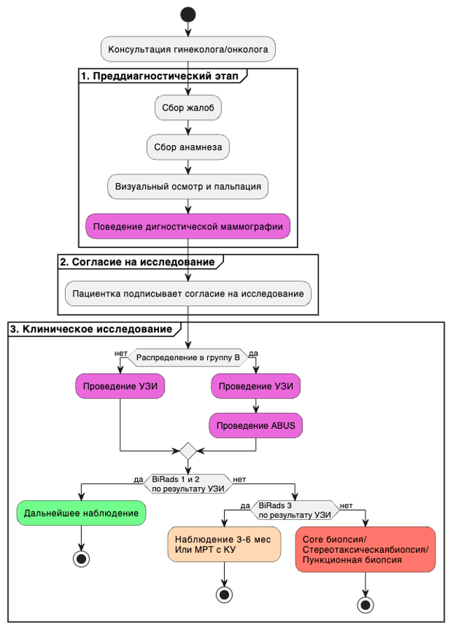
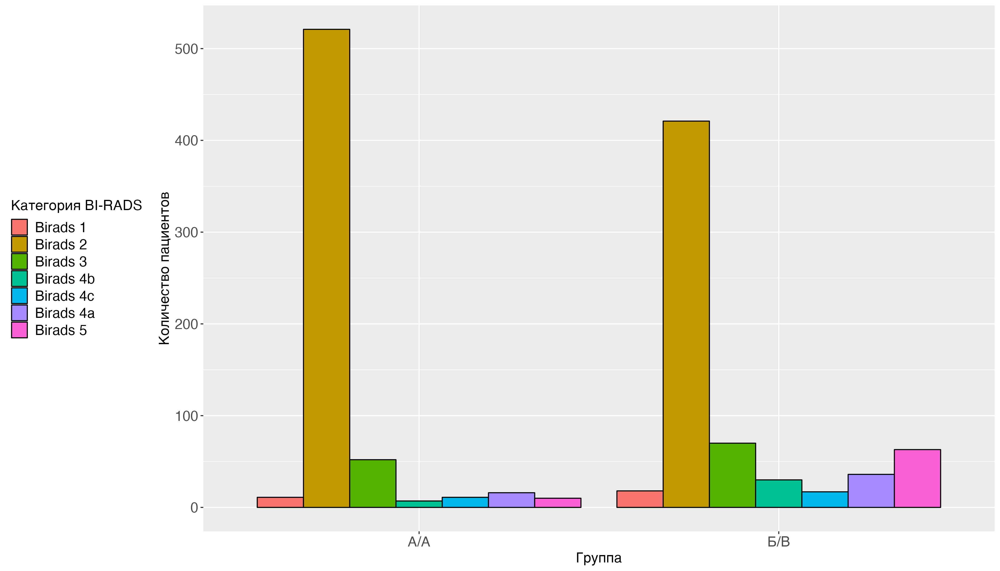
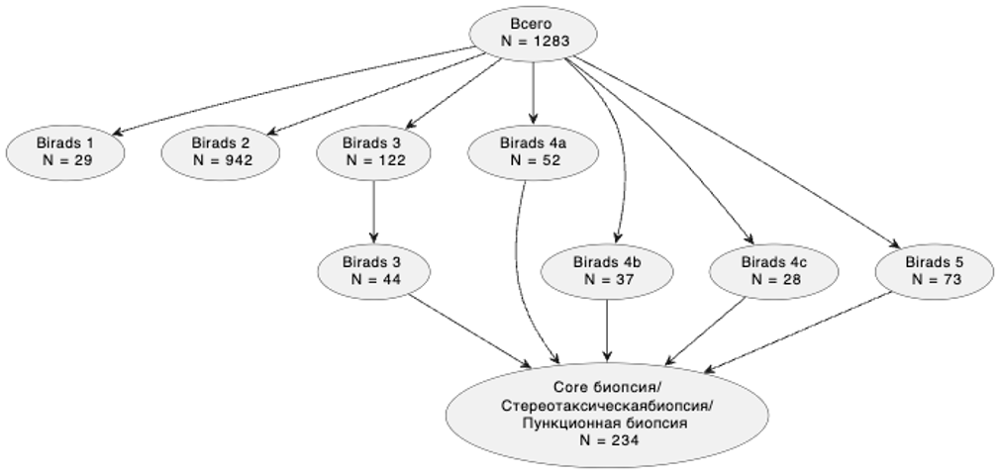
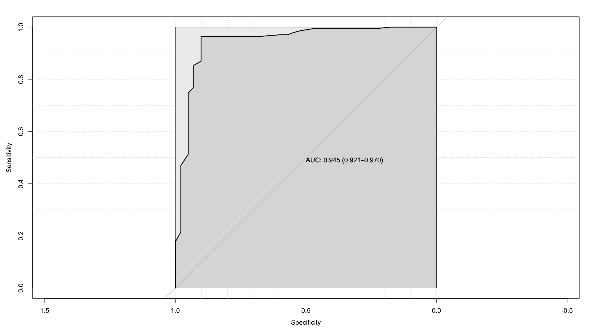
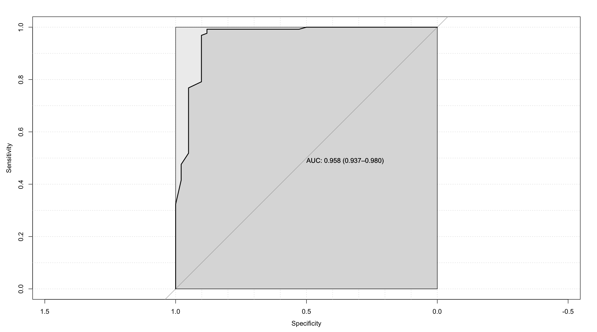
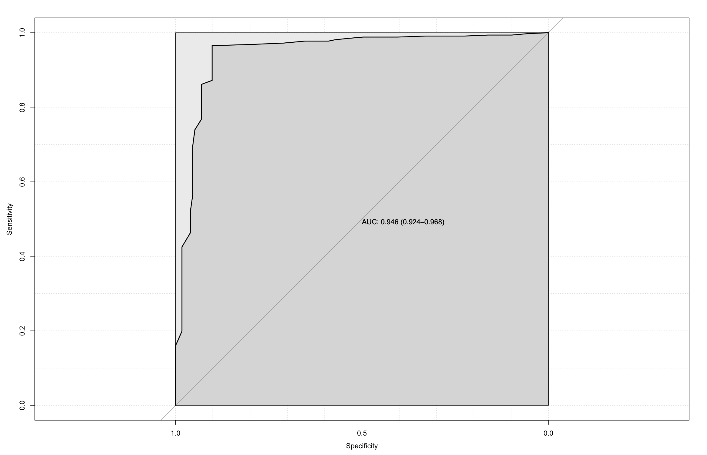

```{r setup, include=FALSE}
knitr::opts_chunk$set(echo = TRUE)
```

УДК 616-006.04

# Добавление автоматизированного 3D-УЗИ молочной железы к маммографическому скринингу у женщин 40 лет и старше с неоднородной и плотной грудью

Гаранина А.Э. ^1,2^, Холин А.В.^1^

^1^ Северо-Западный государственный Медицинский университет им. И. И.
Мечникова, Россия, Санкт-Петербург, 191015, Российская Федерация, г.
Санкт-Петербург, ул. Кирочная, д. 41

^2^ Клиника СМТ АО Поликлинический комплекс, Россия, 190013, г.
Санкт-Петербург, Московский пр., д. 22, литер а

Гаранина Анна Эдуардовна – аспирант кафедры лучевой диагностики ФГБОУ ВО
“Северо-Западный государственный Медицинский университет
им.И.И.Мечникова”, Врач ультразвуковой диагностики, Клиника СМТ АО
Поликлинический комплекс, Санкт-Петербург, Российская Федерация.

e-mail:
[anna.garanina.90\@mail.ru](mailto:anna.garanina.90@mail.ru){.email}

SPIN-код: 8668-3521

ORCID: <https://orcid.org/0009-0001-8193-6657> Холин Александр
Васильевич - доктор медицинских наук, профессор заведующий кафедрой
лучевой диагностики ФГБОУ ВО “Северо-Западный государственный
Медицинский университет им.И.И.Мечникова”.

e-mail: [holin1959\@list.ru](mailto:holin1959@list.ru){.email}.

SPIN-код: 9791-8550

ORCID: <https://orcid.org/0000-0001-8227-1530>

## Резюме

**Резюме.** В структуре раннего скрининга молочной железы имеет важное
значение проблематика плотности молочной железы (МЖ). Литературные
данные подтверждают факт того, что женщины с типом C и D МЖ по ACR имеют
четырех-шестикратное увеличение риска развития рака по сравнению с
женщинами с плотностью МЖ типа А. При таком типе плотности эффективность
диагностической маммографии значительно снижается. На сегодняшний день
можно рассмотреть технологию автоматизированная 3D-УЗИ молочной железы
(3D-УЗИ) в качестве дополнительного скрининга у женщин с типом строения
молочной железы C и D по ACR. Цель исследования. Провести сравнительный
анализ диагностической эффективности 2D-УЗИ и 3D-УЗИ у женщин в
возрастной группе 40 лет и старше с высокой плотностью тканей молочной
железы.

**Материалы и методы.** Ретро-проспективное наблюдательное одноцентровое
исследование. С февраля 2019 по май 2023 года было исследовано 1283
пациенток с 40 лет и старше. Пациентки были разделены на две группы.
Пациентки, попавшие в группу А, проходили 2D-УЗИ и маммографию,
результаты исследования оценивались по классификации BI-RADS. Пациентки,
попавшие в группу B в дополнение к 2D ультразвуковому исследованию и
маммографии, проходили 3D-УЗИ также с выставлением категории BI-RADS. По
итогам исследования определялись положительная и отрицательная
прогностическая ценность, чувствительность, специфичность и точность
метода, а также составление предсказательной модели метода.

**Результаты.** Метод ММГ показал ППЦ 0.89, ОПЦ 0.93, чувствительность
0.53, специфичность 0.99, отбалансированную точность 0.76. Метод 2D-УЗИ
показал ППЦ 0.8, ОПЦ 0.98, чувствительность 0.9, специфичность 0.97,
отбалансированную точность 0.93 и площадь под кривой предсказательной
модели 0.968. 3D-УЗИ показал ППЦ 0.97, ОПЦ 0.97, чувствительность 0.9,
специфичность 0.99, отбалансированную точность 0.94 и площадь под кривой
предсказательной модели 0.98. Выводы. Согласно проведенному нами
исследованию, диагностическая эффективность автоматизированного 3D-УЗИ
молочных желез у пациенток 40 лет и старше сопоставима по показателю
чувствительности и лучше по показателю точности, специфичности и лучше
прогностическая модель метода по сравнению с ультразвуковым
исследованием в 2D режиме.

**Ключевые слова:** рак молочной железы, ультразвуковое исследование,
автоматизированное объемное сканирование молочных желез, молодые
женщины. Для корреспонденции: Гаранина Анна Эдуардовна,
[anna.garanina.90\@mail.ru](mailto:anna.garanina.90@mail.ru){.email}

# Complementing mammography screening with automated 3D ultrasound in women with high-density breasts.

Garanina A.E. 1,2, Kholin A.V.1

1 North-Western State Medical University named after I.I. Mechnikov,
Saint-Petersburg, 191015, 41 Kirochnaya str., Saint Petersburg, Russian
Federation

2 SMT Clinic JSC Polyclinic Complex, Russia, 190013, St. Petersburg,
Moskovsky ave., 22, letter a

Garanina Anna Eduardovna – PhD student at the Department of Radiation
Diagnostics North-Western State Medical University named after I.I.
Mechnikov, Saint-Petersburg, 191015, 41 Kirochnaya str., Saint
Petersburg, Russian Federation, Ultrasound Diagnostics Doctor, SMT
Clinic JSC Polyclinic Complex, Russia, 190013, St. Petersburg, Moskovsky
ave., 22, letter a.

e-mail:
[anna.garanina.90\@mail.ru](mailto:anna.garanina.90@mail.ru){.email}

SPIN-код: 8668-3521

ORCID: <https://orcid.org/0009-0001-8193-6657>

Kholin Aleksandr Vasilevich - Doctor of Medical Sciences, Professor,
Head of the Department of Radiation Diagnostics North-Western State
Medical University named after I.I. Mechnikov, Saint-Petersburg, 191015,
41 Kirochnaya str., Saint Petersburg, Russian Federation

e-mail: [holin1959\@list.ru](mailto:holin1959@list.ru){.email}.

SPIN-код: 9791-8550

ORCID: <https://orcid.org/0000-0001-8227-1530>

## Abstract

**Background.** Breast density is important in the structure of early
breast screening. Literature evidence supports the fact that women with
type C and D breast cancer according to ACR have a four- to six-fold
increased risk of cancer compared to women with type A breast density.
With this type of density, the effectiveness of diagnostic mammography
is significantly reduced. Today, automated 3D ultrasound of the breast
(3D ultrasound) can be considered as an additional screening in women
with breast structure type C and D according to ACR. Objective. To
perform a comparative analysis of the diagnostic efficacy of 2D
ultrasound and 3D ultrasound in women aged 40 years and older with high
breast tissue density.

**Materials and methods.** Retro-prospective, observational,
single-center study. From February 2019 to May 2023, 1283 patients aged
40 years and older were examined. The patients were divided into two
groups. Patients in group A underwent 2D ultrasound and mammography, the
results of the study were evaluated according to the BI-RADS
classification. In addition to 2D ultrasound and mammography, patients
who were placed in group B also underwent 3D ultrasound with the BI-RADS
category. Based on the results of the study, the following were
determined: positive and negative predictive value, sensitivity,
specificity and accuracy of the method, as well as the compilation of a
predictive model of the method.

**Results.** The MMG method showed a PPV of 0.89, an NPV of 0.93, a
sensitivity of 0.53, a specificity of 0.99, and a balanced accuracy of
0.76. The 2D ultrasound method showed a PPV of 0.8, an NPV of 0.98, a
sensitivity of 0.9, a specificity of 0.97, a balanced accuracy of 0.93,
and an area under the predictive model curve of 0. 968. The 3D
ultrasound showed a PPV of 0.97, an NPV of 0.97, a sensitivity of 0.9, a
specificity of 0.99, a balanced accuracy of 0.94, and an area under the
predictive model curve of 0.98. **Conslusions.** According to our study,
the diagnostic efficiency of automated 3D ultrasound of the mammary
glands in patients 40 years and older is comparable in terms of
sensitivity and better in terms of accuracy, specificity and a better
prognostic model of the method compared to ultrasound in 2D mode.

**Key words:** breast cancer, ultrasound, automated volumetric scanning.

**For corresponding:** Anna E. Garanina,
[anna.garanina.90\@mail.ru](mailto:anna.garanina.90@mail.ru){.email}

## Введение / Introduction

Рак молочной железы (РМЖ) относится к серьезной глобальной проблеме
здравоохранения: это наиболее часто диагностируемый вид рака в мире.
Количество случаев РМЖ, зарегистрированных в 2020 году, составило 2,26
миллиона [@wilkinson2022]. В структуре раннего скрининга молочной железы
имеет важное значение проблематика плотности молочной железы.
Литературные данные подтверждают факт того, что женщины с типом строения
C и D МЖ по ACR имеют четырех-шестикратное увеличение риска развития
рака по сравнению с женщинами с плотностью МЖ типа a [@boyd2013].

В настоящее время повышенная плотность молочной железы по
диагностической маммографии (ММГ) является независимым фактором риска,
определяющим рак молочной железы и, возможно, прогноз [@wilczek2016].
Плотная МЖ встречается довольно часто: примерно у 2/3 всех женщин в
пременопаузе примерно у 30% и у женщин 40 лет и старше плотность желез
составляет 50% или выше [@guo2018]. У женщин с плотностью паренхимы
молочной железы более 75% чувствительность, как было показано,
составляет всего 48% [@guo2018]. Более того, некоторые исследования
показали, что количество пропущенных злокачественных новообразований при
ММГ выше при плотной паренхиме молочной железы, чем при молочной железе
с жировой паренхимой. Также существуют исследования, указывающие на
увеличение частоты ложноотрицательных результатов маммографического
скрининга, которая увеличивается в 10 раз при переходе от самой низкой
до самой высокой категории плотности молочной железы [@wilczek2016].

Также в качестве дополнения диагностической ММГ выполняется 2D-УЗИ
молочных желез. Этот метод давно используется в качестве дополнительного
диагностического инструмента, поскольку хорошо визуализирует железистую
ткань. Однако 2D-УЗИ является оператор зависимым методом, процесс
исследования занимает много времени, трудно воспроизводим [@berg2009].

На сегодняшний день можно рассмотреть технологию автоматизированная
3D-УЗИ молочной железы (3D-УЗИ) в качестве дополнительного скрининга у
женщин с типом строения молочной железы C и D по ACR [@jia2020] . В
отличие от 2D-УЗИ, метод имеет стандартизированный протокол сбора
данных, который может выполняться медицинским персоналом со средним
образованием после короткого обучения без необходимости участия
высококвалифицированных специалистов во время обследования. 3D 3D-УЗИ
позволяет получать большие трехмерные объемы данных, которые могут быть
оценены в нескольких плоскостях: корональной, поперечной и сагиттальной.
Очаговые изменения можно увидеть на нескольких срезах, что облегчает
восприятие [@zanotel2017].

Исследование технологии 3D-УЗИ является перспективным направлением
улучшения алгоритмов и подходов при скрининге рака молочной железы.

## Цель исследования / Objective

-   провести сравнительный анализ диагностической эффективности, именно
    чувствительности, специфичности и точности 2D-УЗИ в B-режиме,
    автоматизированного объемного сканирования молочных желез (3D-УЗИ),
    и маммографического скрининга у женщин в возрастной группе 40 лет и
    старше лет с неоднородной и высокой плотностью тканей молочной
    железы.

## Материалы и методы / Material and methods

С февраля 2019 по май 2023 года проводилось ретро-проспективное
наблюдательное исследование, в котором рассматривались диагностические
аспекты ранней диагностики рака молочной железы среди женщин в возрасте
40 лет и старше. Среди исследуемых диагностических методов
рассматривались 2D-УЗИ, 3D-УЗИ и маммография. Протокол настоящего
исследования был одобрен на заседании локального этического комитета
СЗГМУ им. Мечникова №9 от 12.10.2022 года.

*Последовательность проведения диагностики*



Рисунок 1. Схема проведения диагностики настоящего исследования (МРТ с
КУ - магнитно-резонансная томография с контрастным усилением; 2D-УЗИ -
ультразвуковое исследование, BI-RADS - «Breast Imaging-Reporting and
Data System», стандартизированная шкала оценки результатов маммографии,
2D-УЗИ и МРТ по степени риска наличия злокачественных образований
молочной железы)

Figure 1. Scheme of diagnostics of this study (MRI with CU - magnetic
resonance imaging with contrast enhancement; 2D ultrasound - ultrasound
examination, BI-RADS - "Breast Imaging-Reporting and Data System",
standardized scale for assessing the results of mammography, 2D
ultrasound and MRI according to the risk of the presence of malignant
breast tumors)

Врачом- исследователем проводилось объяснение целей, структуры
исследования и проводилось подписание согласия на исследование. Все
пациентки проходили диагностическую ММГ перед осмотром. Далее пациентки
попадали в произвольном порядке в группы. Пациентки, попавшие в группу
А, проходили 2D-УЗИ с последующей установкой категории BI-RADS.
Пациентки, попавшие в группу B в дополнение, проходили 3D-УЗИ также с
определением категории BI-RADS по 2D-УЗИ.

*Интервенционное вмешательство* Пациенткам, которым по результатам
2D-УЗИ исследования были выставлены категории BI-RADS 1 и BI-RADS 2 было
рекомендовано дальнейшее наблюдение. При выставлении категории BI-RADS 3
было рекомендовано наблюдение в течении 3-6 месяцев или МРТ с КУ. При
категории BI-RADS 4 и BI-RADS 5 проводилась core биопсия под узи - или
стереотаксическим наведением и\\или пункционная биопсия при наличии
жидкостного компонента в образовании. Все данные регистрировались для
дальнейшего анализа (рисунок №1).

*Описание выборки и групп*

Всего в исследование вошло 1283 пациентов. Медиана возраста пациенток
выборке 40 лет и старше составил 49 [Q1-Q3: 45;56] лет. Минимальный
возраст составил 40 лет Максимальный возраст составил 79 лет. Медиана
роста оставила 166 [Q1-Q3: 164;168] см. Медиана веса - 65 [Q1-Q3:
60;73.25] кг. В группу A вошло 628 пациенток, в то время как в группу B
655 пациентов. Основные показатели групп представлены в таблицу №1.

**Таблица № 1.**

**Основные характеристики пациенток, прошедших исследование**

**Table 1.**

**Main characteristics of patients who have undergone the study**

[ТАБЛИЦА]

Группы были распределены равномерно по показателям «Репродуктивный
статус» (p-уровень = 0.09, «Прием гормональных препаратов» (p-уровень =
0.08), «Симптом втягивания соска» (p-уровень = 0.48), «Симптом выделения
из соска» (p-уровень = 0.12) и «Тип структуры ACR» (p-уровень = 0.71)

*Описание 3D-УЗИ*

В настоящем исследовании использовалось трехмерная автоматизированная
ультразвуковая система Invenia (3D-УЗИ). Производитель GE Healthcare
(Саннивейл, Калифорния, США) 2018 года выпуска. Основным назначением
компьютерной системы – это оценка плотной молочной железы. Визуализация
молочных желез проводилось в трех проекциях: боковой (LAT),
переднезадней (AP) и медиальный (MED) с автоматическим датчиком с
линейной матрицей от 6 до 14 МГц, прикрепленным к жесткой компрессионной
пластине (площадь 15,4×17,0×5,0 см). Оценку изображений 3D-УЗИ выполнял
один врач ультразвуковой диагностики, со стажем работы более 7 лет.
Фиксировалось общее время, необходимое для подготовки пациента и
получения данных.

*Описание маммографии*

Пациентки прошли двух проекционную цифровую маммографию (в
медиолатеральной косой и краниокаудальной проекции) обеих молочных
желез. Используемое оборудование- Planmed Clarity 3D с функцией
томосинтеза (Финляндия). Оценку изображений проводил один рентгенолог со
стажем работы более 10 лет.

*Описание 2D-УЗИ-исследования*

Устройства, используемые для проведения 2D-УЗИ включали GE LOGIQS 8 (GE
Medical Systems, Милуоки, Висконсин, США), Toshiba Aplio 300(Canon
Япония)- ультразвуковые системы экспертного класса.

*Интервенционное вмешательство*

При выявлении изменений, оцененных категорией BI-RADS 4-5, выполнялась
трепан- биопсия под ультразвуковым или рентген наведением с помощью
специальной системы для биопсии Bard-Magnum, полуавтоматическое
устройство и игл 14-G или 12-G, полученные образцы оправляли на
гистологическое и иммуногистохимическое исследование.

*Статистический анализ*

Статистическая обработка проводилась с помощью языка программы
STATISTICS 12. Для определения числа наблюдений при каждом типе
воздействия в каждой группе производился расчет мощности пропорций при
уровне значимости 95% и мощностью 0.8. Данные, необходимые для расчета
величины эффекта были взяты из исследования Xin Y. и коллег (2021)
[@xin2021].

Для описания количественных показателей проводилась оценка на
нормальность распределения, в качестве метода использовался критерий
Шапиро-Уилка. Для определения статистически значимой разницы непрерывных
величин использовали критерий Манна-Уитни для независимых
непараметрических выборок при ненормальном распределении и t-критерий
Стюдента для независимых параметрических выборок при нормальном. Для
определения статистически значимой разницы независимых качественных
величин Хи-квадрат Пирсона, или точный критерий Фишера. Для определения
чувствительности, специфичности и точности использовалась функция
confusionMatrix из библиотеки caret версия 3.45, язык программирования R
(среда разработки RStudio).

Для построения предсказательной модели на основании данных
использовалась логистическая регрессия с помощью функций glm, predict из
пакета stats версия 3.6.2, язык программирования R (среда разработки
RStudio). Для оценки получено предсказательной модели и построения
ROC-кривой с расчетом площади под кривой (AUC - area under curve)
использовался пакет pROC version 1.18.4 с функцией roc.

## Результаты исследования / Results

По результатам выполнения УЗИ был поставлен дигноз злокачественного
образования в группе A в 7.64% (48), а в группе B в 22.29% (146)

По результатам выполнения УЗИ в группе A была поставлена категория
Birads 1 в 1.75% (11),Birads 2 в 84.55% (531),Birads 3 в 6.69%
(42),Birads 4b в 1.11% (7),Birads 4c в 1.75% (11), Birads 4а в 2.55%
(16) и Birads 5 в 1.59% (10). В группе B кактегрия Birads 1 была в 2.75%
(18), Birads 2 в 66.56% (436), Birads 3 в 8.4% (55), Birads 4b в 4.58%
(30), Birads 4c в 2.6% (17), Birads 4а в 5.5% (36) и Birads 5 в 9.62%
(63).

 

Рисунок №2 Распределение поставленных категорий BiRads после выполнения
УЗИ (а) и количество пациентов, которым была выполнена биопсия (б)

По результатам выполнения гистологическкого исследования был поставлен
дигноз злокачественного образования в группе A в 7.64% (48) и и в группе
B в 22.29% (146).

Таблица №2 Основные результаты гистологического и степени
злокачественности и иммуногистохимического исследований по результатам
проведенной биопсии

| Показатель                         | Процентная доля             | 95% ДИ          | Процентная доля               | 95% ДИ          |
|------------------------------------|-----------------------------|-----------------|-------------------------------|-----------------|
| Группы                             | Группа А                    | ------          | Группа Б                      | ------          |
| Гистологическое исследование       |                             |                 |                               |                 |
| инвазивный дольковый рак           | 0 % ( 0 / 31 случаев)       | [ 0 ; 0.14 ]    | 5.634 % ( 8 / 142 случаев)    | [ 0.03 ; 0.11 ] |
| инвазивный рак неспециального типа | 90.323 % ( 28 / 31 случаев) | [ 0.73 ; 0.97 ] | 76.761 % ( 109 / 142 случаев) | [ 0.69 ; 0.83 ] |
| протоковый рак in situ             | 9.677 % ( 3 / 31 случаев)   | [ 0.03 ; 0.27 ] | 17.606 % ( 25 / 142 случаев)  | [ 0.12 ; 0.25 ] |
| Иммуногистохическое исследование   |                             |                 |                               |                 |
| негатив                            | 0 % ( 0 / 31 случаев)       | [ 0 ; 0.14 ]    | 7.042 % ( 10 / 142 случаев)   | [ 0.04 ; 0.13 ] |
| Her-2_neu                          | 0 % ( 0 / 31 случаев)       | [ 0 ; 0.14 ]    | 4.93 % ( 7 / 142 случаев)     | [ 0.02 ; 0.1 ]  |
| РП                                 | 9.677 % ( 3 / 31 случаев)   | [ 0.03 ; 0.27 ] | 0 % ( 0 / 142 случаев)        | [ 0 ; 0.03 ]    |
| РЭ+РП+Her-2_neu                    | 19.355 % ( 6 / 31 случаев)  | [ 0.08 ; 0.38 ] | 14.789 % ( 21 / 142 случаев)  | [ 0.1 ; 0.22 ]  |
| РЭ+РП+Her-2_neu негатив            | 70.968 % ( 22 / 31 случаев) | [ 0.52 ; 0.85 ] | 73.239 % ( 104 / 142 случаев) | [ 0.65 ; 0.8 ]  |
| Степень злокачественности          |                             |                 |                               |                 |
| I (низкая 3-5 бал)                 | 12.903 % ( 4 / 31 случаев)  | [ 0.04 ; 0.31 ] | 10.563 % ( 15 / 142 случаев)  | [ 0.06 ; 0.17 ] |
| II (умеренная 6-7 балов)           | 64.516 % ( 20 / 31 случаев) | [ 0.45 ; 0.8 ]  | 69.718 % ( 99 / 142 случаев)  | [ 0.61 ; 0.77 ] |
| III(высокая 8-9 бал)               | 22.581 % ( 7 / 31 случаев)  | [ 0.1 ; 0.42 ]  | 19.718 % ( 28 / 142 случаев)  | [ 0.14 ; 0.27 ] |

Подробные данные сравненияпо методам предствалена в таблице №3. Для
корректности приведены результаты токо из группы B.

| Показатель                              | Всего  | УЗИ    | ABUS   | ММГ    |
|-----------------------------------------|--------|--------|--------|--------|
| Найдено злокачественных новообразований | 142    | 128    | 125    | 76     |
| Гистология                              | ------ | ------ | ------ | ------ |
| инвазивный дольковый рак                | 8      | 4      | 8      | 0      |
| инвазивный рак неспециального типа      | 109    | 102    | 95     | 62     |
| протоковый рак in situ                  | 25     | 22     | 22     | 14     |
| Уровень злокачестванности               | ------ | ------ | ------ | ------ |
| I (низкая 3-5 бал)                      | 15     | 15     | 15     | 11     |
| II (умеренная 6-7 балов)                | 99     | 87     | 86     | 51     |
| III(высокая 8-9 бал)                    | 28     | 26     | 24     | 14     |
| Размер                                  | ------ | ------ | ------ | ------ |
| 0,5-1,0 см                              | ------ | 28     | 28     | 16     |
| 1,1-1,5 см                              | ------ | 34     | 37     | 24     |
| 1,5-2,0 см                              | ------ | 37     | 38     | 19     |
| 2,1-2,5 см                              | ------ | 17     | 13     | 8      |
| 2,5-3,0 см                              | ------ | 9      | 6      | 3      |
| более 3 см                              | ------ | 3      | 3      | 6      |

*Определение чувствительности, спецефичности и точности методов*

При оценке УЗИ в группе А количество истинно верно определенных
образований как доброкачественные было 577, количество верно
определённых образований как злокачественные было 28, количество неверно
определенных образований как злокачественные было 20 и количество
неопределенных злокачественных образований как доброкачественные было 3
. Точность метода составила 0.96 [95% ДИ: 0.95, 0.98]. P-Value модели
составил 0.08 что означает, что модель отличается от точности нулевой
гипотезы. Коэфициент Kappa составил 0.69 показывает, что метод указывает
на высокое согласие между предсказаниями и истинными значениями
(количество истинно положительных и отрицательных результатов). Тест
Макнемара составил \<0,01 и показывает, что метод имеет существенно
отличную от контрольного метода частоту ошибок в пользу количества
ложноположительных. Чувствительность метода составила 0.9 .
Специфичность метода составила 0.97 . Доля положительных прогнозов
составила 0.58 . Доля отрицательных прогнозов составила 0.99 . Доля
истинно положительных случаев в наборе данных составила 0.05 . Доля
истинно положительных случаев, правильно определённых методом составила
0.04 . Отбалансированная точность метода составила 0.93 (Таблица №2).

При оценке УЗИ в группе B количество истинно верно определенных
образований как доброкачественные было 495, количество верно
определённых образований как злокачественные было 128, количество
неверно определенных образований как злокачественные было 18 и
количество неопределенных злокачественных образований как
доброкачественные было 14 . Точность метода составила 0.95 [95% ДИ:
0.93, 0.97]. P-Value модели составил 0 что означает, что модель
отличается от точности нулевой гипотезы. Коэфициент Kappa составил 0.86
показывает (если стремится к 1), что метод указывает на высокое согласие
между предсказаниями и истинными значениями (количество истинно
положительных и отрицательных результатов). Тест Макнемара составил 0.6
показывает, что метод не имеет существенно отличную от контрольного
метода частоту ошибок (количество ложноположительных и
ложноотрицательных результатов). Чувствительность метода составила 0.9 .
Специфичность метода составила 0.96 . Доля положительных прогнозов
составила 0.88 . Доля отрицательных прогнозов составила 0.97 . Доля
истинно положительных случаев в наборе данных составила 0.22 . Доля
истинно положительных случаев, правильно определённых методом составила
0.2 . Отбалансированная точность метода составила 0.93 (Таблица №2).

При оценке УЗИ в выборке пациенток 40 лет и старше количество истинно
верно определенных образований как доброкачественные было 1072,
количество верно определённых образований как злокачественные было 156,
количество неверно определенных образований как злокачественные было 38
и количество неопределенных злокачественных образований как
доброкачественные было 17 . Точность метода составила 0.96 [95% ДИ:
0.94, 0.97]. P-Value модели составил 0 что означает, что модель
отличается от точности нулевой гипотезы. Коэфициент Kappa составил 0.83
показывает (если стремится к 1), что метод указывает на высокое согласие
между предсказаниями и истинными значениями (количество истинно
положительных и отрицательных результатов). Тест Макнемара составил 0.01
показывает, что метод не имеет существенно отличную от контрольного
метода частоту ошибок (количество ложноположительных и
ложноотрицательных результатов). Чувствительность метода составила 0.9 .
Специфичность метода составила 0.97 . Доля положительных прогнозов
составила 0.8 . Доля отрицательных прогнозов составила 0.98 . Доля
истинно положительных случаев в наборе данных составила 0.13 . Доля
истинно положительных случаев, правильно определённых методом составила
0.12 . Отбалансированная точность метода составила 0.93 (Таблица №2).

При оценке ММГ в группе А количество истинно верно определенных
образований как доброкачественные было 590, количество верно
определённых образований как злокачественные было 16, количество неверно
определенных образований как злокачественные было 7 и количество
неопределенных злокачественных образований как доброкачественные было 15
. Точность метода составила 0.96 [95% ДИ: 0.95, 0.98]. P-Value модели
составил 0.05 что означает, что модель отличается от точности нулевой
гипотезы. Коэфициент Kappa составил 0.57 показывает (если стремится к
1), что метод указывает на высокое согласие между предсказаниями и
истинными значениями (количество истинно положительных и отрицательных
результатов). Тест Макнемара составил 0.14 показывает, что метод не
имеет существенно отличную от контрольного метода частоту ошибок
(количество ложноположительных и ложноотрицательных результатов).
Чувствительность метода составила 0.52 . Специфичность метода составила
0.99 . Доля положительных прогнозов составила 0.7 . Доля отрицательных
прогнозов составила 0.98 . Доля истинно положительных случаев в наборе
данных составила 0.05 . Доля истинно положительных случаев, правильно
определённых методом составила 0.03 . Отбалансированная точность метода
составила 0.75 (Таблица №2).

При оценке ММГ в группе B количество истинно верно определенных
образований как доброкачественные было 509, количество верно
определённых образований как злокачественные было 76, количество неверно
определенных образований как злокачественные было 4 и количество
неопределенных злокачественных образований как доброкачественные было 66
. Точность метода составила 0.89 [95% ДИ: 0.87, 0.92]. P-Value модели
составил 0 что означает, что модель отличается от точности нулевой
гипотезы. Коэфициент Kappa составил 0.63 показывает (если стремится к
1), что метод указывает на высокое согласие между предсказаниями и
истинными значениями (количество истинно положительных и отрицательных
результатов). Тест Макнемара составил 0 показывает, что метод не имеет
существенно отличную от контрольного метода частоту ошибок (количество
ложноположительных и ложноотрицательных результатов). Чувствительность
метода составила 0.54 . Специфичность метода составила 0.99 . Доля
положительных прогнозов составила 0.95 . Доля отрицательных прогнозов
составила 0.89 . Доля истинно положительных случаев в наборе данных
составила 0.22 . Доля истинно положительных случаев, правильно
определённых методом составила 0.12 . Отбалансированная точность метода
составила 0.76 (Таблица №2).

При оценке ММГ в выборке пациенток до 40 лет количество истинно верно
определенных образований как доброкачественные было 1099, количество
верно определённых образований как злокачественные было 92, количество
неверно определенных образований как злокачественные было 11 и
количество неопределенных злокачественных образований как
доброкачественные было 81 . Точность метода составила 0.93 [95% ДИ:
0.91, 0.94]. P-Value модели составил 0 что означает, что модель
отличается от точности нулевой гипотезы. Коэфициент Kappa составил 0.63
показывает (если стремится к 1), что метод указывает на высокое согласие
между предсказаниями и истинными значениями (количество истинно
положительных и отрицательных результатов). Тест Макнемара составил 0
показывает, что метод не имеет существенно отличную от контрольного
метода частоту ошибок (количество ложноположительных и
ложноотрицательных результатов). Чувствительность метода составила 0.53
. Специфичность метода составила 0.99 . Доля положительных прогнозов
составила 0.89 . Доля отрицательных прогнозов составила 0.93 . Доля
истинно положительных случаев в наборе данных составила 0.13 . Доля
истинно положительных случаев, правильно определённых методом составила
0.07 . Отбалансированная точность метода составила 0.76 (Таблица №2).

При оценке ABUS в группе B количество истинно верно определенных
образований как доброкачественные было 509, количество верно
определённых образований как злокачественные было 125, количество
неверно определенных образований как злокачественные было 4 и количество
неопределенных злокачественных образований как доброкачественные было 17
. Точность метода составила 0.97 [95% ДИ: 0.95, 0.98]. P-Value модели
составил 0 что означает, что модель отличается от точности нулевой
гипотезы. Коэфициент Kappa составил 0.9 показывает (если стремится к 1),
что метод указывает на высокое согласие между предсказаниями и истинными
значениями (количество истинно положительных и отрицательных
результатов). Тест Макнемара составил 0.01 показывает, что метод не
имеет существенно отличную от контрольного метода частоту ошибок
(количество ложноположительных и ложноотрицательных результатов).
Чувствительность метода составила 0.88 . Специфичность метода составила
0.99 . Доля положительных прогнозов составила 0.97 . Доля отрицательных
прогнозов составила 0.97 . Доля истинно положительных случаев в наборе
данных составила 0.22 . Доля истинно положительных случаев, правильно
определённых методом составила 0.19 . Отбалансированная точность метода
составила 0.94 (Таблица №3).

Таблица №3. Определение точности, P-уровня значимости модели,
коэффициент Kappa, Тест Макнемара, чувствительности, специфичности и
отбалансированной точности в группах А и B (Т -Точность, P - P-Value,
КК - Коэффициент Kappa, ТМ -Тест Макнемара, ППЦ - положительная
прогностическая ценность, ОПЦ - отрицательная прогностическая ценность,
Ч-Чувствительность, Сп -Специфичность, ОТ- Отбалансированная точность)

| Метод                             | Т                            | P    | КК   | ТМ   | ППЦ  | ОПЦ  | Ч    | Сп   | ОТ   |
|-----------------------------------|------------------------------|------|------|------|------|------|------|------|------|
| ММГ в группе А                    | 0.96 [95% ДИ: 0.95 , 0.98 ]. | 0.05 | 0.57 | 0.14 | 0.7  | 0.98 | 0.52 | 0.99 | 0.75 |
| ММГ в выборке пациенток до 40 лет | 0.93 [95% ДИ: 0.91 , 0.94 ]. | 0    | 0.63 | 0    | 0.89 | 0.93 | 0.53 | 0.99 | 0.76 |
| ММГ в группе B                    | 0.89 [95% ДИ: 0.87 , 0.92 ]. | 0    | 0.63 | 0    | 0.95 | 0.89 | 0.54 | 0.99 | 0.76 |
| УЗИ в группе А                    | 0.96 [95% ДИ: 0.95 , 0.98 ]. | 0.08 | 0.69 | 0    | 0.58 | 0.99 | 0.9  | 0.97 | 0.93 |
| УЗИ в группе B                    | 0.95 [95% ДИ: 0.93 , 0.97 ]. | 0    | 0.86 | 0.6  | 0.88 | 0.97 | 0.9  | 0.96 | 0.93 |
| УЗИ в выборке пациенток до 40 лет | 0.96 [95% ДИ: 0.94 , 0.97 ]. | 0    | 0.83 | 0.01 | 0.8  | 0.98 | 0.9  | 0.97 | 0.93 |
| ABUS в группе B                   | 0.97 [95% ДИ: 0.95 , 0.98 ]. | 0    | 0.9  | 0.01 | 0.97 | 0.97 | 0.88 | 0.99 | 0.94 |

*Прогностическая оценка методов*

На основании полученных данных, пыла построена предсказательная модель
изучаемых методов. ROC-кривая предсказательной модели для метода УЗИ, по
данным полученным в группе A представлена на рисунке № 2а. Площадь под
кривой (AUC- area under cruve) составила: 0.958 95% ДИ: 0.922 - 0.994


Рисунок №2а. ROC-кривая предсказательной

модели для метода УЗИ, по данным полученным в группе A. ROC-кривая
предсказательной модели для метода УЗИ, по данным полученным в группе B
представлена на рисунке № 2б. Площадь под кривой (AUC- area under cruve)
составила: 0.735 95% ДИ: 0.684 - 0.786



Рисунок №2б. ROC-кривая предсказательной модели для метода УЗИ, по
данным полученным в группе B.

ROC-кривая предсказательной модели для метода ABUS, по данным полученным
в группе B представлена на рисунке № 2в. Площадь под кривой (AUC- area
under cruve) составила: 0.958 95% ДИ: 0.937 - 0.98



Рисунок №2в. ROC-кривая предсказательной модели для метода ABUS, по
данным полученным в группе B.

ROC-кривая предсказательной модели для метода УЗИ, по данным полученным
в выборке пациенток 40 лет и старше представлена на рисунке № 2г.
Площадь под кривой (AUC- area under cruve) составила: 0.946 95% ДИ:
0.924 - 0.968

 Рисунок №2г.

ROC-кривая предсказательной модели для метода УЗИ, по данным полученным
в выборке пациенток 40 лет и старше.

Таблица №3. Определение площади под кривой представленных
предсказательных моделей метода в группах А и B.

| Метод                                   | Площадь под кривой          |
|-----------------------------------------|-----------------------------|
| УЗИ в группе A                          | 0.958 95% ДИ: 0.922 - 0.994 |
| УЗИ в группе B                          | 0.945 95% ДИ: 0.921 - 0.97  |
| УЗИ в выборке пациенток 40 лет и старше | 0.946 95% ДИ: 0.924 - 0.968 |
| ABUS в группе B                         | 0.958 95% ДИ: 0.937 - 0.98  |

## Обсуждение / Discussion

Плотная ткань молочной железы означает большое количество радиологически
определяемой фиброзно-железистой ткани в молочной железе [@busko2024].
Плотная ткань молочной железы связана со значительным снижением
маммографической чувствительности и более высоким уровнем интервального
рака [@rozhkova2021; @garanina2023].

Анализ различных исследований показал более высокие или равные
результаты обнаружения поражений МЖ с помощью 3D-УЗИ по сравнению с
2D-УЗИ. Показатели обнаружения с помощью 3D-УЗИ варьируют от 84,8% до
100%, тогда как соответствующие показатели для ультразвукового метода-
от 60,6% до 100% [@xiao2015; @vourtsis2019].

В литературе также встречается достаточное количество работ, посвященных
дифференциации злокачественных и доброкачественных образований МЖ с
помощью 3D 3D-УЗИ [@golatta2013; @golatta2014].

3D-УЗИ, благодаря хорошей визуализации МЖ также является новым методом
оперативного планирования [@garanina2024]; размер поражения,
определенный с помощью 3D-УЗИ, хорошо коррелирует с результатами МРТ
[@schmachtenberg2017] и гистопатологическими изменениями [@chang2015].

Коронарная плоскость имеет особое значение для хирургического
планирования из-за лучшей визуализации сегментарного доступа и схожей
ориентации при позиционировании пациента во время операции
[@amy2018lobar]. 3D-УЗИ позволяет визуализировать сателлитные очаги
размером менее 1 см, что очень ценно в оценке многоочагового рака.
3D-УЗИ может применяться при оценке результатов МРТ в качестве
уточняющей методики [@halshtok2015use; @girometti2017]так, например,
3D-УЗИ превзошла 2D-УЗИ в качестве вторичного исследования после
проведения МРТ МЖ, выявив дополнительные очаги [@kim2016].

В работах отечественных исследователей (В.Е. Гажонова, М.П. Ефремова,
Е.М. Бачурина, Е.М. Хлюстина, С.Б. Поткин) изучались возможности данной
методики в определении типа строения МЖ среди женщин разных возрастных
групп, имеющих различную патологию. Полученные ими данные
свидетельствовали и значительном увеличении специфичности данного метода
(до 96%) у пациенток с типами плотности МЖ С и D что может иметь важное
значение при скрининге женщин данной категории
[@гажонова2015возможности].

Важным аспектом изучения технологии 3D-УЗИ является время, необходимое
для выполнения и изучения изображений. В различных исследования это
время колеблется от 12 до 25 минут [@skaane2015]. Этот вопрос ставит
важным изучение кривой обучения специалистов и уже в контексте этого
требуется уточнение данных об эффективности метода в структуре
скрининга.

Arslan A. и коллеги в 2019 году [@arslan2019] в своем исследовании
выявили сокращение времени оценки по мере накопления опыта. Brunetti и
коллеги в 2020 [@brunetti2020] отмечают проблему более длительной
интерпретации и Güldoğan N. и коллеги [@güldogan2023] изучавшие этот
отчет пришли к мнению, что это проблема связана с различием в опыте
работы рентгенологов с системой. Однако в других исследованиях
[@vourtsis2017; @huppe2018] время интерпретации 3D-УЗИ было намного
меньше времени, необходимого для 2D-УЗИ.

Наше исследование имеет некоторые ограничения. Настоящее исследование не
учитывает проблему кривых обучения специалистов, включенных в процесс
работы. Такой фактор может снизить показатели эффективности.
Исследование является моноцентровым. Центр, в котором проводилось
исследование имеет специфику работы с пациентами представленного профиля
и оценить возможности метода в других много профильных центрах еще
придется. Также одним из важных показателей эффективности предлагаемого
метода — это оценка смертности, а именно ожидаемое снижение из-за
раннего обнаружения новообразования.

Все эти факторы говорят о том, что требуются дальнейшие исследования
технологии 3D-3D-УЗИ и определения наиболее эффективных алгоритмов
скрининга с использованием представленной технологии.

## Заключение / Conclusion

1.  Согласно проведенному нами исследованию, диагностическая
    эффективность автоматизированного 3D-УЗИ молочных желез у пациенток
    40 лет и старше сопоставима по показателю чувствительности и лучше
    по показателю точности, специфичности по сравнению с ультразвуковым
    исследованием в 2D режиме. Также нами выявлено, что методы 3D-УЗИ и
    2D-УЗИ сопоставимы по определяемым размерам образований.

2.  Преимущества 3D ультразвукового исследования перед ММГ выявление
    большего количества образований менее 1см, так же более четкое
    выявление мультиочаговых поражений.

3.  3D ультразвуковое исследование предоставило дополнительную
    информацию о распространенности мультифокального и мультицентричного
    поражения молочных желез, включая визуализацию анатомии всего
    органа.

4.  Ограничения ММГ у пациенток с типом строения С и D по ACR могут быть
    дополнены 3D ультразвуковым исследованием, что повысит выявление
    злокачественных образований.

5.  Дополняя ММГ, 3D ультразвуковое исследование способствует выявлению
    некальцинированных карцином, скрытых плотной тканью молочной железы,
    тем не менее ММГ остается основным методом выявления поражений DCIS
    из-за ее превосходства в обнаружении кальцинатов.

6.  Учитывая возрастающую сложность обнаружения новообразований при
    плотной МЖ предлагаемый метод представляет большой интерес и
    является перспективным направлением развития систем скрининга рака
    МЖ.

## Список литературы [References]
