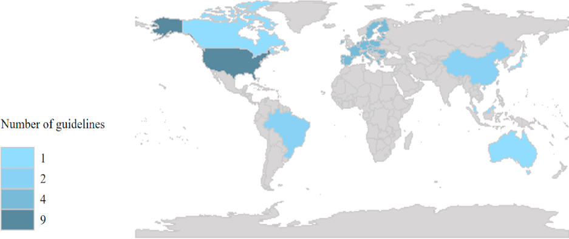
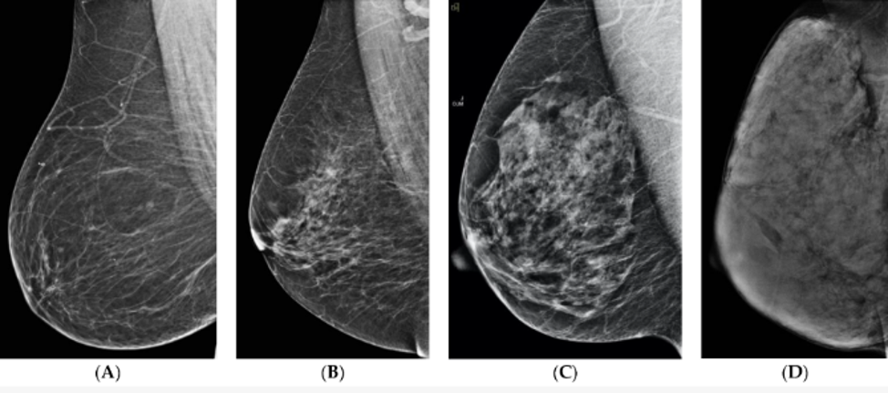

```{r setup, include=FALSE}
knitr::opts_chunk$set(echo = TRUE)
```

# ГЛАВА 1. СОВРЕМЕННОЕ СОСТОЯНИЕ ВОПРОСА ДИАГНОСТИКИ ОБРАЗОВАНИЙ МОЛОЧНОЙ ЖЕЛЕЗЫ У ЖЕНЩИН.

## 1.1. Эпидемиология рака молочной железы.

Рак молочной железы (РМЖ) относится к серьезной глобальной проблеме здравоохранения: это наиболее часто диагностируемый вид рака в мире.
Количество случаев РМЖ, зарегистрированных в 2020 году, составило 2,26 миллиона [@wilkinson2022], причем более половины из них зарегистрированы в менее развитых регионах мира [@sung2021].
Страны с высоким уровнем развития имеют самые высокие показатели заболеваемости РМЖ: стандартизированный по возрасту показатель заболеваемости среди женщин составляет 48 случаев на 100 000 человек, варьируя от менее 30 случаев на 100 000 человек в странах Африки к югу от Сахары до более 70 случаев на 100 000 человек в Западной Европе и Северной Америке [@abdulrahman2012epidemiology].
Наблюдаемое преимущество в выживаемости пациентов с диагностированным РМЖ в более развитых странах в значительной степени может быть связано с сочетанием стратегий раннего выявления, доступа к ранней диагностике и эффективным методам лечения.
Напротив, отсроченное проявление чаще встречается в менее развитых регионах мира, где более половины случаев РМЖ относятся местно-распространенному или метастатическому.
РМЖ представляет наиболее распространенный вид рака, диагностируемый ежегодно среди женщин (более 1 из 10 новых ежегодных случаев РМЖ).
В соответствии с данными ВОЗ и The Global Cancer Observatory (GCO), РМЖ --- самое распространенное онкологическое заболевание у женщин с частотой выявления 46,4 на 100 тыс.
женщин в мире и 53,6 на 100 тыс.
в Российской Федерации (РФ).
Анализ данных по частоте выявления злокачественных новообразований (ЗНО) у женщин свидетельствует о том, что после РМЖ следуют злокачественные новообразования кожи (15,2%, с меланомой -- 17,2%), тела матки (7,8%), ободочной кишки (7,3%), шейки матки (5,0%), лимфатической и кроветворной ткани (4,7%), прямой кишки, ректосигмоидного соединения, ануса (4,4%), желудка (4,4%), яичника (4,1%), трахеи, бронхов, легкого (3,8%) [@mahvi2018; @каприн2017злокачественные; @каприн2020состояние; @кушунина2019выявление].
РМЖ также является основной причиной смерти от ЗНО среди женщин; смертность от РМЖ в мире составляет 13,0 на 100 тыс.
женщин, в РФ --- 15,1 на 100 тыс.
женщин [@кушунина2019выявление; @каприн2014злокачественные; @tabar2016; @sardanelli2016; @sankatsing2017; @brand2019].
Соответственно последним статистическим данным и тенденции нарастания случаев регистрации РМЖ, Всемирной Организацией Здравоохранения (ВОЗ) в 2021 году запустила новую глобальную программу по борьбе с РМЖ, основные направления которой были следующими: общие мероприятия по укреплению здоровья, своевременная диагностика, комплексный подход к лечению и обеспечению всеми его необходимыми видами [@wilkinson2022].
Фундаментальной задачей данного подхода является диагностика ранних форм онкологического процесса для улучшения показателей смертности и стоимость лечения.
Одной из составляющих частей комплексной ранней диагностики РМЖ является разработка и внедрение скрининговых программ молочных желез (МЖ) с применением цифровой маммографии (ЦММГ).
Большинство программ скрининга МЖ по всему миру заменили экранную пленочную ММГ полноформатной ЦММГ из-за технических и практических преимуществ (возможность хранения и передачи изображений в электронном виде).
К другим преимуществам ЦММГ могут быть отнесены: высокая чувствительность (75-90%) и специфичность (80-90%), высокая разрешающая способность, четкость получаемого изображения, снижение лучевой нагрузки на пациентку, в том числе за счет выбора параметров экспонирования исследования.
В обзоре Rachel Farber MPH et al. (2021 г.) исследователями было продемонстрировано, что после перехода от пленочной к ЦММГ произошло умеренное, но статистически значимое увеличение частоты выявления рака, статистически значимое увеличение количества ложноположительных скринингов, а также отсутствие влияние на частоту выявления интервального рака.
Увеличение частоты обнаружения рака, отмеченное при переходе от пленочной к ЦММГ, в значительной степени связано с более широким обнаружением протоковой карциномы in situ, с небольшой разницей в обнаружении инвазивного рака [@farber2020].
Так, у женщин с высокой плотностью МЖ (категории ACR-с и d по классификации американской коллегии радиологов (American College of Radiology (ACR) ЦММГ недостаточно чувствительна.
Это связано с возможным перекрытием патологических участков фиброгландулярными структурами [@wilkinson2022; @farber2020; @ma2019].
Существуют доказательства высокой достоверности того, что маммографический скрининг снижает риск смертности от РМЖ у женщин в возрасте от 50 до 69 лет, при этом число предотвращенных смертей варьирует от 138 до 483 на 100 000 женщин, приглашенных на скрининг, в зависимости от предполагаемого исходного риск (от 0,6 до 2,1%).
Для других возрастных групп полученные данные не являются окончательными.
Тем не менее, женщины всех возрастных групп, приглашенные для скрининга, показали более низкий риск развития поздних стадий РМЖ.
В тоже время, скрининг может быть связан с увеличением нежелательных эффектов: ложноположительные результаты, требующие проведения дополнительных диагностических мероприятий, увеличивают количество инвазивных процедур и частоту развития психологического стресса [@canelo2021benefits].
Для надежной оценки результатов программ скрининга или изменений в политике скрининга традиционно используют результаты долгосрочных последующих исследований и, в идеале, рандомизированных контролируемых испытаний.
Тем не менее, такие исследования, хотя и предоставляют высококачественные доказательства, занимают много лет, что задерживает доступность важной информации для оценки эффективности политики скрининга.
Анализ существующих данных подчеркивает необходимость тщательной оценки последствий будущих изменений в технологиях, например, таких как томосинтез, в том числе и с применением технологий искусственного интеллекта (ИИ), в плане улучшения результатов в отношении прогноза заболевания и жизни [@hogg2015digital; @demircioglu2017; @pesapane2020; @valdora2018; @mayerhoefer2020; @pesapane2020].
Приоритетным направлением дальнейших исследований является разработка методов диагностики РМЖ на ранней стадии, оптимизация и персонализация алгоритмов скрининга.

## 1.2 Скрининг рака молочной железы в России и в мире.

Скрининг (от англ. screening --- «отбор, сортировка») РМЖ является эффективной мерой для выявления патологического процесса на ранней стадии и повышения выживаемости данной когорты больных.
Программы скрининга РМЖ были реализованы во многих развитых странах в течение последних десятилетий, что способствовало снижению смертности и заболеваемости РМЖ на поздних стадиях.
На сегодняшний день во многих развитых странах выпущено несколько руководств по основным положениям проводимого скрининга РМЖ.
Изучение литературных данных позволяет оценить зарубежные руководства, которые были опубликованы в период с 2010 по 2021 год [@siu2016; @cardoso2019; @hamashima2016; @ren2022; @qaseem2019; @gradishar2020; @mainiero2017; @monticciolo2018; @monticciolo2017; @lee2010; @lee2010; @oeffinger2015; @practice2017; @schünemann2019; @sardanelli2010; @klarenbach2018; @wöckel2018; @ren2022; @he2021china; @ching2018; @migowski2018; @urban2017].

Большинство изучаемых руководств (17 из 23) были разработаны в развитых странах.
Руководства из Соединенных Штатов Америки (США) составили наибольшую долю, достигнув 39,1%.
Одно было разработано ВОЗ, а четыре --- в Европе (Рисунок 1).



Рисунок 1.
Сравнительный анализ географического распределения руководств по скринингу РМЖ.

Большинством руководств маммографический скрининг был рекомендован женщинам в возрасте 40--74 лет [@siu2016; @hamashima2016; @qaseem2019; @ren2022; @urban2017], женщинам в возрасте 50--69 лет проведение скрининга было обязательным [@schünemann2019; @wöckel2018; @ren2022; @migowski2018].

В девяти руководствах не было выделено верхнего возрастного показателя для проведения скрининга РМЖ [@cardoso2019; @hamashima2016; @ren2022; @gradishar2020, @monticciolo2018; @schünemann2019; @klarenbach2018; @he2021china].
Так, в некоторых руководствах [@monticciolo2017; @lee2010; @oeffinger2015] предлагается определение возрастного параметра на основании состояния здоровья женщины, в котором проведение скрининга будет нецелесообразным (например, прекращение выполнения скрининга среди женщин с ожидаемой продолжительностью жизни менее 5--7 или 10 лет).
Другими руководствами (USPSTF, ACP, CBR, SBM ) не рекомендовано проведение скрининга РМЖ женщинам старше 75 лет, за исключением случаев, когда ожидаемая продолжительность их жизни превышает 7 или 10 лет [@siu2016,@qaseem2019, @urban2017].
Немецким онкологическим обществом (AWMF) [@wöckel2018] и научным обществом Сингапура [@ren2022] рекомендовано прекращение проведения скрининга в возрасте 70 лет.

ММГ была рекомендована в качестве основного метода скрининга для женщин со средним риском всеми включенными руководствами [@siu2016; @cardoso2019; @hamashima2016; @ren2022; @qaseem2019; @gradishar2020; @mainiero2017; @monticciolo2018; @monticciolo2017; @lee2010; @lee2010; @oeffinger2015; @practice2017; @schünemann2019; @sardanelli2010; @klarenbach2018; @wöckel2018; @ren2022; @he2021china; @ching2018; @migowski2018; @urban2017].
Задачей скрининговой ММГ является выявление подозрительных участков, нуждающихся в дополнительном обследовании (биопсии под контролем рентгена или ультразвукового исследования (УЗИ)).
По результатам скрининга на дополнительное обследование приглашаются в среднем от 5 до 20% пациенток, прошедших обследование [@рожкова2019онкомаммоскрининг; @klarenbach2018; @рожкова2019новые].

В большинстве руководств предлагается проходить маммографический скрининг ежегодно или раз в два года [@siu2016; @ren2022; @qaseem2019a], в трех- каждые 1-2 года [@cardoso2019, @oeffinger2015; @schünemann2019].

В некоторых рекомендациях указано, что интервалы скрининга следует определять в зависимости от возраста [@gradishar2020].
ACS [@oeffinger2015] рекомендует проведение скрининговой ММГ ежегодно для женщин в возрасте 40-54 лет и каждые 1-2 года для женщин в возрасте 55 лет и старше; в другом руководстве [@schünemann2019] рекомендуется скрининг каждые 2--3 года для женщин в возрасте 40--49 лет и для женщин в возрасте 70--74 лет.

На данный момент времени учеными не определен точный возраст женщины, в котором должно быть начато проведение программ скрининга РМЖ.
К странном с ранним началом (в возрастном диапазоне 40-45 лет) относят Республику Корею, Испанию и Венгрию; с поздним окончанием (возрастной диапазон 73-75 лет)- Великобританию, Францию и Нидерланды [@рожкова2019онкомаммоскрининг; @smith2004].

Даже на родине скрининга в США отмечаются противоречия между данными таких организаций, как Национальный институт здоровья США (The National Institutes of Health), Ассоциация исследования рака (the American Association for Cancer Research) и Национальноым институтом рака (NCI) и Коллегии радиологов США (ACR) [@arleo2013; @Medical_Advisory_Secretariat2007-el].

Анализ ряда проведенных исследований (США, Канада, Великобритания, Нидерланды, Швеция и др.) по эффективности проводимого скрининга демонстрирует убедительные положительные результаты, особенно в отношении выявляемости РМЖ (8,2 на 1000 обследованных женщин), где более половины случаев приходится на рак in situ и инвазивный рак I стадии [@michell2012].

Даже в тех станах, где программы скрининга начались не так давно (в Венгрии -- в 2002 г, Хорватии -- с 2006 г, Дании -- с 2007 г.) уже отмечены положительные результаты.
Отчет The Danish Quality Database of Mammography в 2013г крупного исследования в Дании продемонстрировал факт того, что охват женщин составил 77,4% от предполагаемого числа в возрастном диапазоне 50-- 69 лет [@langagergaard2013].

В настоящее время в абсолютном большинстве развитых стран Европы внедрен скрининг РМЖ (в 25 из 28 стран, кроме Болгарии, Греции и Словакии).

В тех же странах, где отсутствуют национальные программы скрининга, регистрируется лишь небольшое количество женщин, которые обратились самостоятельно в лечебное учреждение для прохождения ММГ.
Например, в Китае, согласно национальному опросу, лишь 21,7% женщин добровольно прошли скрининговую ММГ [@wang2013; @nagtegaal2010].

Основные этапы проведения скрининговых программ в России представлены в Таблице 1 [@призова2014скрининг; @белоцерковцева2012скрининговая; @bray2018global; @эрштейн2018эволюция; @лесько2012современное; @гамиров2014организация; @манихас2017маммографический; @захарова2012итоги; @семиглазов2007диагностика; @семиглазов2008скрининг; @семиглазов2010скрининг].

Таблица 1- Основные этапы развития скрининговых программ по выявлению РМЖ в России

Разработка и создание единого системного подхода к организации скрининга РМЖ (от 2013 г.) за 10 лет продемонстрировало свои положительные результаты.

Отмечено снижение показателей одногодичной и общей летальности на 26-28%, смертности -на 14,9%.
Выявляемость TI и TII стадий РМЖ выросла до 70,4%, а пятилетняя выживаемость -- до 60%.

И все же существует некоторое противоречие в данных цифрах, связанное с фактом интерпретации данных соответственно принятым общемировым стандартам, особенно при определении ранней диагностики РМЖ.

В РФ организация маммографического скрининга отражена в приказах МЗ РФ № 124н от 13.03.2019 «Об утверждении порядка проведения профилактического медицинского осмотра и диспансеризации определенных групп взрослого населения», № 154 от 15.03.2006 «О мерах по совершенствованию оказания медицинской помощи при заболеваниях молочной железы» и №1011н от 06.12.2012 «Об утверждении порядка профилактического медицинского осмотра».

В указанных выше документах говорится о том, что женщины в возрасте старше 39 лет должны обследоваться маммографическим методом каждые 2 года.
Однако, по утверждению В.Ф.
Семиглазова и соавт., скрининг в РФ не носит массового характера [@эрштейн2018эволюция; @лесько2012современное; @гамиров2014организация].

В 2019 году Минздравом России был издан документ «Методические рекомендации по выполнению программы популяционного скрининга злокачественных новообразований МЖ среди женского населения», который призван устранить организационные и методические пробелы при проведении скрининга РМЖ на территории РФ.

## **1.3 Проблематика плотности молочной железы.**

Под термином «плотность» МЖ понимается характер распределения фиброгландулярной ткани, способствующий ослаблению рентгеновского излучения при прохождении через МЖ.
Точное измерение плотности МЖ поможет в более точной стратификации риска развития РМЖ (прогностической и профилактической), позволит определиться с необходимым объемом дополнительных диагностических методик исследования плотности МЖ как независимого фактора риска развития РМЖ.

Американский колледж радиологии (ACR) в 3-ем издании BI-RADS описывает плотность груди с точки зрения четырех категорий общей плотности.
Первоначально эти категории были простыми описательными терминами («жировая», «рассеянная плотность», «гетерогенно плотная» и «чрезвычайно плотная») [@d2018breast].

В 2003 г.
в 4-м издании BI-RADS ACR добавил проценты к каждой категории, пытаясь сделать оценку плотности более объективной (0--25%, 25--50%, 50--75% и 75%--100%) [@d2018breast; @mendelson2013acr; @lee2017risk; @alomaim2020subjective; @wang2014breast].

тип A- почти полностью жировая ткань (наличие фиброгландулярной ткани менее 25% площади МЖ);

тип B: наличие рассеянных фиброзно-железистые уплотнений (фиброгландулярная ткань от 25 до 50 % площади ММГ);

тип C: неоднородно плотная ткань МЖ (фиброгландулярная ткань от 51 до 75 % площади ММГ);

тип D: чрезвычайно плотная (фиброгландулярная ткань более 75 %).

В 2013 году ACR изменили маркировку с категории плотности 1--4 на a-- d, удалили количественный элемент каждой категории и внесли некоторые тонкие изменения в формулировку.

Категории BI-RADS представлены в Таблице 2; Рисунках 2,3.
Их определение позволит определять лечебно-диагностический алгоритм ведения женщин.

Таблица 2 -- BI-RADS категории.



Рисунок 2- Категории плотности МЖ в соответствии с 5-м изданием ACR BI-RADS: (A) Категория a --- почти полностью жировая ткань, (B) Категория b --- плотные разбросанные фиброзные железы, (C) Категория c --- неоднородно плотная МЖ, (D) Категория d --- очень плотная МЖ.


Рисунок 3 -- Участки плотной фиброгландулярной ткани на ММГ заслоняют узловое образование, которое отмечено стрелкой (слева).
Данное узловое образование на сонограмме (справа).
Гистологически инвазивный протоковый рак.

Литературные данные подтверждают факт того, что женщины с плотной МЖ типа d имеют четырех-шестикратное увеличение риска по сравнению с женщинами с плотностью МЖ типа a [@boyd2013; @lee2012].
Именно плотность МЖ в общей популяции чаще по сравнению с другими факторами (возраст, генетические мутации (*BRCA 1/BRCA2*)) является самым сильным предиктором РМЖ.

В некоторых исследованиях было высказано предположение, что только показатель плотности МЖ вносит значительный вклад в риск развития РМЖ на популяционном уровне, составляя 16% всех диагностированных РМЖ [@boyd2011; @bae2014; @boyd2007; @fasching2006].

По мнению большинства исследователей интервальный рак (рак, выявленный в промежутке между запланированными скрининговыми маммограммами) в 13-31 раз более вероятен в груди с плотностью типа d, чем в МЖ с плотностью типа a (исследования Posso M., 2019) [@posso2019; @boyd2007; @ciatto2004; @strand2019].

Плотность груди также является биомаркером для прогнозирования ответа на неоадъювантную химиотерапию.
Skarping, I.et al. (2019 г.) в своем исследовании показали, что женщины в пременопаузе с высокой маммографической плотностью плохо реагируют на неоадъювантную химиотерапию [@skarping2019].

Huang et al. и Eriksson et al. в своих работах случай-контроль показали более высокий риск развития регионарного рецидива у женщин с категориями с и d после модифицированной радикальной мастэктомии [@huang2016; @eriksson2013].

Плотная ткань также ограничивает выявление рецидива РМЖ у женщин, получавших лечение.

Маммографическая плотность МЖ длительное время была предметом дискуссий между учеными и практическими докторами.
В частности, активно обсуждался вопрос необходимости информирования женщин о наличии у них высокой плотности МЖ [@almousa2014; @machida2015; @tossas-milligan2019].Большинство авторов сходятся во мнении, что женщины должны быть проинформированы в связи с тем, что плотная ткань МЖ может 1) скрывать опухоли на маммограмме, 2) повышать риск развития РМЖ и 3) требовать проведения дополнительных методов исследований, таких как УЗИ и магнитно-резонансной томографии (МРТ) [@tossas-milligan2019].

## **1.4 Современные методы диагностики рака молочных желез**

### **1.4.1** **Томосинтез**

В течение нескольких десятилетий идет активная разработка специальных рентгенологических исследований МЖ, наиболее перспективным из которых является цифровой томосинтез (ЦТ).
В США в 2011 году ЦТ был признан к использованию в качестве диагностического метода, в 2016г- в качестве скринингового [@us26department], применение которого обеспечивает лучшую визуализацию всех структурных элементов МЖ.
Это, в свою очередь, позволяет дифференцировать нарушение архитектоники и объемные изменения, обнаруживать патологические образования, не всегда различимые на маммограммах [@skaane2013; @friedewald2014; @kim2017; @vourtsis2018; @айнакулова2021возможности; @айнакулова2020сравнительный].
Данный факт объясняет значительное уменьшение повторных исследований.
В работе E.
McDonald et al. (25 000 женщин) было отмечено, что лишь небольшое количество были приглашены на повторное исследование [98,99].

Результаты исследований, выполненных разными авторами, свидетельствуют о повышении показателя частоты обнаружения РМЖ от 5,4 на 1000 исследований [100] до 8,0 на 1000 обследованных [@friedewald2014].

Сравнительный анализ неясных результатов, требующих дополнительного уточнения другими методами, при проведении ЦММГ (17 899) и ЦТ (11 331) в период 2016-2018 гг, был выполнен Scott AM. Et al., 2019 [@scott2019], составил 82,08% для ЦММГ и 60,09% для ЦТ.

Результаты рандомизированного открытого исследования TOSYMA показывают, что частота обнаружения инвазивного рака МЖ была значительно выше при использовании ЦТ МЖ в сочетании с ММГ s2D, чем при использовании только ЦММГ (354 из 49 715 в группе ЦТ и ЦММГ и у 240 из 49 762 женщин в группе ЦММГ соответственно, p\<0,0001)).

Большинство обзоров свидетельствуют о том, что ЦТ с ЦММГ была более эффективной при установлении РМЖ, поскольку приводила к большему числу выявления патологических образований и меньшему количеству ложноположительных результатов [@giampietro2020].

В работе отечественных исследователей (Гринберг М.В., Харченко Н.В., Рожкова Н.И., Чибисов С.М., Еремина И.З.) были отмечены основные преимущества применения ЦТ в лучевой диагностике непальпируемых образований МЖ [@гринберг2015первый].
Другими отечественными исследователями- ограничения его применения в качестве рутинного скрининга [@айнакулова2021возможности; @айнакулова2020сравнительный].

### **1.4.2 CESM- двуэнергетическая спектральная маммография.**

Контрастная спектральная двухэнергетическая маммография (Contrast-Enhanced Spectral Mammography -- CESM), позволяет визуализировать образования на фоне плотной ткани МЖ [@черная2020контрастная].

В доступной мировой и отечественной литературе имеется небольшое количество информации об использовании CESM в клинической практике.
Авторы отмечают, что диагностическая эффективность CESM выше, чем у традиционной рентгеновской ММГ, и приближается к таковой при МРТ с контрастным усилением [@рожкова2015контрастная; @cheung2014; @covington2018; @patel2018].

Исследование Lewin JM.
[@lewin2003] является единственным опубликованным предварительным клиническим опытом использования двухэнергетической CEDM.
Авторы продемонстрировали техническую и клиническую осуществимость этого метода, сообщили о чувствительности 92% и специфичности 83% для обнаружения карциномы МЖ.
Однако это исследование было ограничено малой выборкой исследуемых.

В настоящее время не существует стандартизированного протокола описания метода, не систематизирована семиотика рентгеновских признаков образований на субтракционных снимках [@james2018; @lobbes2013].
Необходимы дальнейшие исследования для оценки диагностической точности и экономической эффективности CEDM по сравнению с МРТ для определения соответствующей роли CEDM в будущем.

### **1.4.3** **МРТ с контрастным усилением (в том числе короткий протокол МРТ -- профессор Kuhl).**

Первоначальное осознание факта того, что магнитно-резонансная томография (МРТ) молочной железы с контрастным усилением обладает очень высокой чувствительностью для выявления рака молочной железы спровоцировало проведение ряда работ, которые были направлены на анализ данного метода при проведении скрининга МЖ [@kaiser1992mrm; @heywang1986].

Процесс неоваскуляризации приводит к образованию новых сосудов.
Контрастные вещества при проведении МРТ с контрастированием способны к быстрому накоплению в строме РМЖ [@knopp1999].
Их парамагнитные свойства сокращают T ~1~время в окружающих тканях, и поэтому усиливают локальный сигнал на T ~1~ -основанных последовательностях.

Базовый протокол МРТ МЖ состоит из описания одного Т1 -взвешенного изображения до введения контраста и нескольких Т1 -взвешенных изображений после введения контраста, с целью анализа кинетического поведения накопленного контраста в очаге поражения.
Часто также получают T ~2~ -взвешенные данные [@mann2008; @newell2018acr].

После анализа результатов данных одноцентрового исследования, показавшего потенциал МРТ как инструмента скрининга, было проведено несколько крупномасштабных многоцентровых исследований для оценки ценности МРТ как дополнительного инструмента скрининга [@kuhl2000].

Критерии включения варьировали, но всегда в исследованиях были женщины с мутациями в генах BRCA1 и BRCA2, повышенным риском вследствие семейной предрасположенности [@kriege2004a; @kuhl2005].
Первоначальные результаты исследований свидетельствовали о сниженной чувствительности данного исследования: 71% в голландском скрининговом исследовании -MRISC [@kriege2004], и 77% в британском исследовании -- MARIBS [@screenin2005].
Относительно низкая чувствительность первоначальных исследований, вероятно, была связана с несовершенной техникой в сочетании с отсутствием четких рекомендаций по интерпретации.

В более поздних исследованиях, таких как немецкое исследование EVA и итальянское исследование HIBCRIT-1, чувствительность превышала 90% [@kuhl2010; @sardanelli2011].
Недавно были представлены результаты еще ряда исследований, изучающих такие характеристики, как чувствительность и специфичность МРТ [@chiarelli2014; @riedl2015; @sung2016; @huzarski2017; @lo2017; @kuhl2017; @lee2017].

Вариабельность показателя чувствительности МРТ в них колебалась от 75,2% до 100%, в среднем превышая 80%; специфичность - от 83% до 98,4%.

В 2007 г.
Американским онкологическим сообществом (ACS) определен клинический протокол ежегодного МРТ-скрининга РМЖ для женщин высокой группы риска.
По мнению экспертов, эти рекомендации также включают женщин с облучением грудной клетки в анамнезе в молодом возрасте и женщин с мутацией p53 и PTEN, для которых относительный риск развития РМЖ также высокий (примерно в 6--8 раз выше популяционного риска).

Данные рекомендации по-прежнему составляют основу большинства национальных и международных руководств.
К сожалению, из-за того, что для многих женщин наличие генетических факторов риска неизвестно, а также из-за того, что во многих учреждениях нет магнитно-резонансного томографа, существует большая часть женщин, которые не проходят скрининг в соответствии с этими стандартами.
Отчасти это также может быть связано с недостаточной информацией пациентов о преимуществах МРТ.
Wernli et al. сообщили, что в 2009 г.
в США 29% женщин прошли скрининг с помощью МРТ; в 2012 г.- 43,9% женщин с отягощенным анамнезом [@wernli2014].

Ускоренная МРТ -- метод, предложенный С.
Kuhl et al. для снижения себестоимости и времязатратности исследования за счет сокращения количества выполненных последовательностей сканирования: Т1; T2-STIR и диффузионно-взвешенную визуализацию (DWI) [@kuhl2014].

Первоначальные выводы С.
Kuhl et al. были подтверждены исследованием Mango VL.
et al.: в выполненном ими исследовании чувствительность метода составила 99% (из 100 историй болезни при ускоренной МРТ верифицировались более 95 % узлов на T1 изображениях) [@mango2015].
Moschetta M.
et al. в своем исследовании не обнаружили существенных различий в диагностической точности между полным и сокращенным протоколом, включая STIR, Т2-взвешенные последовательности, преконтрастную и одну постконтрастную Т1-взвешенную последовательности [@moschetta2016].
Dogan et al. исследовали сокращенный протокол при скрининге женщин высокой группы риска и получили данные, эквивалентные отдельному полному протоколу [@dogan2018].

Преимуществом выполнения ускоренной МРТ является сокращение времени сканирования в среднем на 18,8 минут и интерпретации изображений -- на 4,9 минут (ср.) [@harvey2016; @vanzelst2018].

Недавно выполненные работы свидетельствуют о том, что оценка только этих сверхбыстрых изображений дает результаты, аналогичные чтению полного диагностического протокола, включая позднюю фазу усиления, T~2~ и DWI.
Почти во всех рассмотренных исследованиях короткое время сбора данных и быстрая интерпретация изображений различных сокращенных протоколов не оказывали отрицательного влияния на точность диагностики [@mango2015; @moschetta2016; @vanzelst2018].

В работе Panigrahi B.
et al в 2017 году при оценке соотношения результатов полного и сокращенного протоколов с присвоенной категорией оценки BI-RADS в 1052 случаях было показало, что полный протокол привел к изменению итоговых оценок BI-RADS только в 3,4% случаев [@panigrahi2017].

На сегодняшний день сокращенный протокол МРТ МЖ был проведен в восьми разных странах и более чем у 4500 женщин.
Общий вывод почти всех сокращенных МРТ-исследований заключается в том, что обнаруженный РМЖ был в основном инвазивным раком на ранней стадии с процентным соотношением от 64 до 97%.
Протоковые карциномы in situ, обнаруженные с помощью сокращенного скрининга МРТ, были преимущественно средней или высокой степени злокачественности [@oldrini2018; @heacock2016; @romeo2017].
Это хорошо согласуется с недавним исследованием Sung et al., которые обнаружили, что у женщин с высоким риском РМЖ, прошедших скрининг с помощью маммографии и МРТ, инвазивный рак с большей вероятностью выявляется с помощью МРТ.

К сожалению, эффективность МРТ МЖ по-прежнему зависит от внутривенного введения контрастного вещества.
Это отнимает много времени, дорого, болезненно и чревато осложнениями, несмотря на тот факт, что используемые в настоящее время макроциклические контрастные вещества очень стабильны и безопасны [@runge2018].

Метод МРТ, который не предполагает введение контраста (DWI), находятся в стадии оценки.
До сих пор исследования были однозначно успешными, показывая, что DWI, по крайней мере, так же чувствителен, как ММГ, для раннего выявления рака [@bickelhaupt2016; @trimboli2014].

Однако ограниченное пространственное разрешение и частое присутствие артефактов снижает ценность DWI при обнаружении поражений размером менее 12 мм [@pinker2018].
Следовательно, на данный момент методы МРТ без внутривенного введения контраста не могут конкурировать в скрининговых целях с МРТ МЖ с контрастным усилением.

### **1.4.4 Автоматизированное объемное ультразвуковое сканирование (ABUS)**

Развитие автоматизированного ультразвукового томосинтеза (АУС/ABUS/ABVS) является одним из наиболее перспективных направлений, который позволяет получить в среднем за 3 сканирования (коронарная, сагиттальная и аксиальная) плоскости изображение всей МЖ.

Кроме того, разработано специальное программное обеспечение для 3D ABUS с целью автоматизированного обнаружения патологических образований (CAD) (QVCAD™, QView Medical), которое получило одобрение FDA [@vourtsis2019].
Восемнадцатью рентгенологами, участвовавшими в исследовании Y.
Jiang, M.F.
et al. (2018), без системы QVCAD среднее время интерпретации результатов МЖ составляло 3 минуты 33 секунды для каждого случая, но уменьшалось до 2 минут 24 секунд при внедрении QVCAD, при этом разница соответствует 1 минуте 9 секундам, сэкономленным на каждом случае [@jiang2018].

Анализ различных исследований показал более высокие или равные результаты обнаружения поражений МЖ с помощью 3D ABUS по сравнению с УЗИ.
Показатели обнаружения с помощью 3D ABUS варьируют от 84,8% до 100%, тогда как соответствующие показатели для ультразвукового метода- от 60,6% до 100% [@wang2012; @xiao2015; @wang2012a; @lin2012; @kim2013; @vourtsis2019].

В литературе также встречается достаточное количество работ, посвященных дифференциации злокачественных и доброкачественных образований МЖ с помощью 3D ABUS [@chou2007automated; @golatta2013; @golatta2014; @kotsianos-hermle2009].

3D ABUS, благодаря хорошей визуализации МЖ также является новым методом оперативного планирования [@grady2010]; размер поражения, определенный с помощью 3D ABUS, хорошо коррелирует с результатами МРТ [@schmachtenberg2017] и гистопатологическими изменениями [@chang2015].

Коронарная плоскость имеет особое значение для хирургического планирования из-за лучшей визуализации сегментарного доступа и схожей ориентации при позиционировании пациента во время операции [@amy2018lobar].
3D ABUS также позволяет визуализировать сателлитные очаги размером менее 1 см, что очень ценно в оценке многоочагового рака.

3D ABUS может применяться при оценке результатов МРТ в качестве уточняющей методики [@halshtok2015use; @girometti2017]: так, например, 3D ABUS превзошла УЗИ в качестве вторичного исследования после проведения МРТ МЖ, выявив дополнительные очаги [@kim2016].

В работах отечественных исследователей (В.Е. Гажонова, М.П. Ефремова, Е.М. Бачурина, Е.М. Хлюстина, С.Б. Поткин) изучались возможности данной методики в определении типа строения МЖ среди женщин разных возрастных групп, имеющих различную патологию.
Полученные ими данные свидетельствовали и значительном увеличении специфичности данного метода (до 96%) у пациенток с типами плотности МЖ с и d, что может иметь важное значение при скрининге женщин данной категории [@гажонова2015возможности].

Добавленную ценность ABUS к ММГ при высокой плотности МЖ исследовали также Wilczek, Leifland и другие.
Ученые доказали повышение выявляемости РМЖ на 57% [@vourtsis2018].

ABUS--- это технологический прогресс в области визуализации и скрининга МЖ с преимуществами стандартизации сканирований, лучшего обнаружения небольших поражений, особенно у женщин с повышенной плотностью МЖ, и сокращения времени сканирования.
Продолжаются интенсивные исследования новых разработок и исследований дополнительных приложений технологии 3D ABUS.
Оценка плотности МЖ с помощью 3D ABUS также является еще одним перспективным направлением.

### **1.4.5** **Искусственный интеллект**.

Технологии Искусственного интеллекта (ИИ, англ.-- Artificial intelligence, Al) включают: Глубокое обучение (ГО, англ.-- Deep learning, Dl); Нейронную сеть (НС, англ.-- Neural networks, NN).

Системы ИИ в медицинской практике -- новое перспективное направление во всем мире, они могут помочь в рутинных и сложных задачах медицинскому персоналу, повысить уровень оказываемой медицинской помощи.
При этом разработка, производство и выпуск в обращение систем ИИ должны в обязательном порядке регулироваться.
Регистрация и последующий контроль в медицине требуют создания нормативной правовой базы и технического регулирования [@morozov2020artificial; @morozov2018artificial].

Отечественными учеными активно изучается данное направление применительно к скринингу РМЖ.
В недавно представленной работе ряда исследователей (С.П. Морозов, В.Г. Говорухина, В.В. Диденко, О.С. Пучкова и др., 2020г.) проанализированы перспективы использования технологий ИИ в скрининге РМЖ в мире и использование в этой области технологий в России [@морозов2020перспективы].

В мировой практике ценность представляют исследования Wu et al. (2019 г.), McKinney S.M.
et al. (2020), Sasaki M.et al. (2020) [@wu2020; @mckinney2020; @sasaki2020].
Сверточная НС, объединяющая глобальную (симметрия между двумя МЖ) и локальную (на уровне пикселей) информацию, обученную более чем на 1000000 снимков для обнаружения РМЖ была описана Wu et al. (2019 г.) [@wu2020].
Применение ИИ в исследовании Nature позволило снизить процент ложноотрицательных результатов.
При этом полученные данные анализировались с учетом стандартного двойного чтения маммограмм [@mckinney2020].
По мнению некоторых зарубежных авторов, проблемы в разработке алгоритма чаще приводят к гипердиагностике [@sasaki2020], в связи с этим дальнейшие исследования в данной области должны быть направлены прежде всего на улучшение диагностической точности.

Президент Российской Федерации 6 июня 2019 года подписал Указ № 254 «О Стратегии развития здравоохранения в Российской Федерации на период до 2025 года», согласно которому решение основных задач развития здравоохранения должно осуществляться, в том числе, в направлении развития единой государственной информационной системы в сфере здравоохранения, обеспечивающей взаимосвязь процессов организации оказания медицинской помощи; развитие государственных информационных систем субъектов Российской Федерации в сфере здравоохранения в целях их интеграции в единую государственную информационную систему.

При этом эффективность внедрения и использования IT-технологий определяет доступность и качество работы системы здравоохранения регионов РФ [@егорова2018цифровизация].

С.П.
Морозов в своем докладе «Стандартизация в области ИИ» рассказал о реализации эксперимента по внедрению технологий ИИ (компьютерного зрения) на базе Центра диагностики и телемедицины ДЗМ, а также о разрабатываемых стандартах СИИ и о создании Подкомитета 01/ТК 164 «ИИ в здравоохранении».

Таким образом, данное направление-перспектива будущего, однако для эффективного его распространения необходимо решение ряда вопросов.
Среди многих из них особенное внимание должно быть уделено следующим:

1)  Слаженность работы медицинского и инженерного сообществ для создания легкодоступных баз данных и ПО.

2)  Внедрение разработанных алгоритмов в клиническую практику не только городов, но и районных центров.

3)  Проведение курсов обучения медицинского персонала работе с технологиями ИИ.

Анализ результатов ММГ с учетом сделанных ранее снимков позволит определить женщин с высокими факторами риска, а также подобрать персонализированную терапию с учетом выявленного патологического образования.

### **1.4.6** **Радиогеномика**

Радиогеномика при РМЖ-- быстроразвивающаяся область исследований и клинического применения.

Корреляция конкретных фенотипов на основе изображений (радиомика) с крупномасштабным геномным анализом (геномика) является новой областью исследований, называемой «радиогеномикой» или, точнее, «геномикой изображений».
В этой новой области рассматриваются новые высокопроизводительные методы связывания информативных рентгенографических изображений с геномными данными, а также другой клинически значимой информацией [@yeh2019; @zhu2015; @li2016; @li2016a; @guo2015; @burnside2015].

Радиогеномика оказывает влияние на диагностические и терапевтические стратегии, создавая более индивидуализированные прогностические признаки и измерения в реальном времени в ответ на терапию.
Применение радиогеномики для лечения РМЖ в последнее время привлекает все больше внимания.

Первая статья о радиомике / радиогеномике при РМЖ была опубликована в 2012 году [@ashraf2014], и с тех пор количество публикаций в данной области возрастает с каждым годом.
Большинство работ по радиогеномике РМЖ связано с его корреляцией с индивидуальными геномными особенностями, молекулярными подтипами или показателями рецидива [@pinker2018background; @sutton2016; @mahrooghy2015].

Например, исследования с использованием маммографических изображений показали, что рентгенографический анализ текстуры может идентифицировать пациентов, которые с большей вероятностью являются носителями мутации BRCA1/2 [@gierach2014], а паренхиматозный рисунок и плотность МЖ были связаны с вариациями гена UGT2B [@li2014].

Данные МРТ, также использовались для выявления взаимосвязи между радиологическими особенностями с лежащими в их основе клиническими или гистологическими характеристиками [@yeh2019].

Однако большинство этих исследований были сосредоточены на нескольких клинических, гистопатологических или генетических особенностях.
Например, Bhooshan N.
et al. в своей работе рассматривал классифицированные признаки, которые коррелировали со способностью различать инвазивные и неинвазивные поражения, а также со степенью опухоли [@bhooshan2011].

Mazurowski MA. Et al. продемонстрировали взаимосвязь динамики усиления МРТ с люминальными подтипами РМЖ [@mazurowski2014].
Agrawal G, et al. смогли показать корреляцию между определенными фенотипами МРТ и подтипом рецептора HER-2 [@agrawal2007].

В настоящее время проводятся многоцентровые исследования РМЖ, сочетающие многочисленные качественные и количественные параметры визуализации с геномными, транскриптомными, протеомными и метаболомными данными.
В итоге такие исследования будут разрабатывать значимые биомаркеры визуализации для достижения конечной цели прецизионной медицины при РМЖ.

В обзоре 2020 года отечественными учеными (Рожкова Н.И., Боженко В.К., Бурдина И.И., Запирова С.Б., Кудинова Е.А., Лабазанова П.Г.) изложены последние данные радиогеномики.
По их мнению дальнейшее развитие данного направления позволит решить ряд важнейших задач в алгоритме ведения женщин с РМЖ (например, диагностика разных проявлений рака, выбор оптимальной лечебной тактики) [@рожкова2020радиогеномика].

## **1.5 Сравнительная характеристика методов.**

Сравнительная характеристика основных методов, применяемых при диагностике РМЖ, приведена в Таблице 3.

Таблица 3 - Характеристика основных методов диагностики РМЖ

Таким образом, в практическом здравоохранении существует ряд нерешенных вопросов относительно частоты проведения скрининга, возрастного диапазона женщин, предпочтительного метода с учетом категории плотности МЖ и риска развития РМЖ (наследственная предрасположенность, мутации).
Существующие методы диагностики имеют определенные преимущества и недостатки друг относительно друга, учет которых необходим при составлении плана уточняющих диагностических мероприятий, в том числе и у женщин с высокой плотностью МЖ.

Определение лучшего метода/комбинации методов является залогом усовершенствования скрининга РМЖ, улучшения показателей раннего выявления РМЖ и повышения экономической эффективности.

## 1.6 Резюме

**Список сокращений**

The Global Cancer Observatory (GCO)

Рак молочной железы (РМЖ)

Российской Федерации (РФ)

злокачественных новообразований (ЗНО)

Всемирной Организацией Здравоохранения (ВОЗ)

молочных желез (МЖ)

цифровой маммографии (ЦММГ)

Соединенных Штатов Америки (США)

## **Список литературы**

## 
