```{r setup, include=FALSE}
knitr::opts_chunk$set(echo = TRUE)
```

## 3.1 Общее Описание результатов исследования УЗИ в выборке до 40 лет

### 3.1.1 Результаты ручного УЗИ исследования

Всего в исследование вошло 1511 пациентов.
В выборке до 40 лет при выполнении УЗИ кожа была не изменена во всех 100% (1511/1511 случаев) [95% ДИ 1;1].
УЗИ протоки были не расширены в 99.6% (1505/1511 случаев) [95% ДИ 0.99;1] и в 0.4% расширены (6/1511 случаев) [95% ДИ 0;0.01].
УЗИ фоном была железистая ткань в 65.59% (991/1511 случаев) [95% ДИ 0.63;0.68], фиброзно-кистозная мастопатия в 33.55% (507/1511 случаев) [95% ДИ 0.31;0.36], склероз в 0.46% (7/1511 случаев) [95% ДИ 0;0.01] и кисты в 0.4% (6/1511 случаев) [95% ДИ 0;0.01].
При выполнении УЗИ был найден узел в 26.94% (407/1511 случаев) [95% ДИ 0.25;0.29].
В выборке до 40 лет при выполнении УЗИ образование находилось в верхне-внутреннем квадранте в 17.44% (71/407 случаев) [95% ДИ 0.14;0.22], в верхне-наружном квадранте в 34.89% (142/407 случаев) [95% ДИ 0.3;0.4], во всей железе в 1.47% (6/407 случаев) [95% ДИ 0.01;0.03], на границе в 7.86% (32/407 случаев) [95% ДИ 0.06;0.11], на границе верхних в 8.11% (33/407 случаев) [95% ДИ 0.06;0.11], на границе внутренних в 6.14% (25/407 случаев) [95% ДИ 0.04;0.09], границе наружных в 7.37% (30/407 случаев) [95% ДИ 0.05;0.1], в нижне-внутреннем квадранте в 4.67% (19/407 случаев) [95% ДИ 0.03;0.07], в нижне-наружном квадранте в 10.57% (43/407 случаев) [95% ДИ 0.08;0.14] и в центральном отделе в 1.47% (6/407 случаев) [95% ДИ 0.01;0.03].
Форма образования была неправильной формы в 8.85% (36/407 случаев) [95% ДИ 0.06;0.12], овальной формы в 82.06% (334/407 случаев) [95% ДИ 0.78;0.86], округлой в 4.42% (18/407 случаев) [95% ДИ 0.03;0.07] и участок нарушения архитектоники в 4.67% (19/407 случаев) [95% ДИ 0.03;0.07].
Размер узла был в диапазоне 0,5-1,0 см в 35.87% (146/407 случаев) [95% ДИ 0.31;0.41], 1,1-1,5 см в 42.51% (173/407 случаев) [95% ДИ 0.38;0.47], 1,5-2,0 см в 12.29% (50/407 случаев) [95% ДИ 0.09;0.16], 2,1-2,5 см в 1.47% (6/407 случаев) [95% ДИ 0.01;0.03] и 2,5-3,0 см в 7.86% (32/407 случаев) [95% ДИ 0.06;0.11].
В выборке до 40 лет при выполнении УЗИ контуры узлов были ровные в 80.1% (326/407 случаев) [95% ДИ 0.76;0.84], волнистые в 11.06% (45/407 случаев) [95% ДИ 0.08;0.15], неровные в 4.42% (18/407 случаев) [95% ДИ 0.03;0.07], звездчатые в 2.95% (12/407 случаев) [95% ДИ 0.02;0.05] и полициклические в 1.47% (6/407 случаев) [95% ДИ 0.01;0.03].
Гипоэхогенное образование было в 92.38% (376/407 случаев) [95% ДИ 0.89;0.95], смешанная эхогенность в 4.42% (18/407 случаев) [95% ДИ 0.03;0.07] и изоэхогенное образование в 3.19% (13/407 случаев) [95% ДИ 0.02;0.06].
Однородная структура узла в 78.87% (321/407 случаев) [95% ДИ 0.75;0.83], неоднородная в 19.66% (80/407 случаев) [95% ДИ 0.16;0.24] и наличие внутрикистозных пристеночных разрастаний в 1.47% (6/407 случаев) [95% ДИ 0.01;0.03].
В выборке до 40 лет при выполнении УЗИ кровоток в образовании был по периферии в 42.26% (172/407 случаев) [95% ДИ 0.37;0.47], не определяется в 36.86% (150/407 случаев) [95% ДИ 0.32;0.42], интранодулярный в 14.99% (61/407 случаев) [95% ДИ 0.12;0.19], перинодулярный в 2.95% (12/407 случаев) [95% ДИ 0.02;0.05], определяется внутри в 1.47% (6/407 случаев) [95% ДИ 0.01;0.03] и смешанный в 1.47% (6/407 случаев) [95% ДИ 0.01;0.03].
Один узел был определен в 75.68% (308/407 случаев) [95% ДИ 0.71;0.8], два в 12.29% (50/407 случаев) [95% ДИ 0.09;0.16], три в 4.42% (18/407 случаев) [95% ДИ 0.03;0.07] и множественные в 7.62% (31/407 случаев) [95% ДИ 0.05;0.11].
Был выявлен 0 эластотип в 77.7% (1174/1511 случаев) [95% ДИ 0.75;0.8], 1 эластотип в 0.4% (6/1511 случаев) [95% ДИ 0;0.01], 3 эластотип в 19.06% (288/1511 случаев) [95% ДИ 0.17;0.21], 4 эластотип в 1.26% (19/1511 случаев) [95% ДИ 0.01;0.02] и нет данных в 1.59% (24/1511 случаев) [95% ДИ 0.01;0.02].
Регионарные лимфоузлы были не изменены в 96.69% (1461/1511 случаев) [95% ДИ 0.96;0.98] и увеличены в правой надключичной области в 3.31% (50/1511 случаев) [95% ДИ 0.02;0.04].
После выполнения УЗИ был поставлен диагноз "без патологии" в 24.55% (371/1511 случаев) [95% ДИ 0.22;0.27], "внутрипротоковая папиллома молочной железы" в 0% (0/1511 случаев) [95% ДИ 0;0], "диффузный фиброаденоматоз" в 4.24% (64/1511 случаев) [95% ДИ 0.03;0.05], "киста" в 2.12% (32/1511 случаев) [95% ДИ 0.01;0.03], "кисты" в 2.91% (44/1511 случаев) [95% ДИ 0.02;0.04], "локализованный фиброаденоматоз" в 0.66% (10/1511 случаев) [95% ДИ 0;0.01], "мультицентричный рак" в 1.59% (24/1511 случаев) [95% ДИ 0.01;0.02], "мультфококальный рак"в 0.2% (3/1511 случаев) [95% ДИ 0;0.01], "образование Ca" в 2.32% (35/1511 случаев) [95% ДИ 0.02;0.03], "сложная киста" в 0.07% (1/1511 случаев) [95% ДИ 0;0], "фиброаденома единичная" в 17.41% (263/1511 случаев) [95% ДИ 0.16;0.19], "фиброаденомы множествненные" в 5.16% (78/1511 случаев) [95% ДИ 0.04;0.06], "фиброзно-кистозная мастопатия" в 38.39% (580/1511 случаев) [95% ДИ 0.36;0.41] и "цистаденопапиллома" в 0.4% (6/1511 случаев) [95% ДИ 0;0.01].
Была установлена категория Birads 1 в 23.76% (359/1511 случаев) [95% ДИ 0.22;0.26], Birads 2 в 58.44% (883/1511 случаев) [95% ДИ 0.56;0.61], Birads 3 в 13.77% (208/1511 случаев) [95% ДИ 0.12;0.16], Birads 4b в 0.79% (12/1511 случаев) [95% ДИ 0;0.01], Birads 4а в 2.45% (37/1511 случаев) [95% ДИ 0.02;0.03] и Birads 5 в 0.79% (12/1511 случаев) [95% ДИ 0;0.01].
Были найдены кальцинаты микрокальцинаты в 33.33% (6/18 случаев) [95% ДИ 0.14;0.59] и кальцинаты определялись в 66.67% (12/18 случаев) [95% ДИ 0.41;0.86].
В выборке до 40 лет при выполнении УЗИ был поставлен диагноз рак в 4.1% (62/1511 случаев) [95% ДИ 0.03;0.05].

### 3.1.2 Автоматизированное объемное УЗИ сканирование молочных желез (ABUS.png)

В выборке до 40 лет был выполнен ABUS в 47.92% (724/1511 случаев) [95% ДИ 0.45;0.5].
Кожа была не изменена в 100% (724/724 случаев) [95% ДИ 0.99;1].
Симптом ретракции был в 11.05% (80/724 случаев) [95% ДИ 0.09;0.14] и в 88.95% его не было (644/724 случаев) [95% ДИ 0.86;0.91].
Было найдено образование в 35.64% (258/724 случаев) [95% ДИ 0.32;0.39].
В выборке до 40 лет при выполнении ABUS размеры узлов были в диапазоне 0,5-1,0 см в 37.6% (97/258 случаев) [95% ДИ 0.32;0.44], 1,1-1,5 см в 40.7% (105/258 случаев) [95% ДИ 0.35;0.47], 1,5-2,0 см в 12.02% (31/258 случаев) [95% ДИ 0.08;0.17] и 2,5-3,0 см в 9.69% (25/258 случаев) [95% ДИ 0.06;0.14].
Контуры узлов были ровные в 80.62% (208/258 случаев) [95% ДИ 0.75;0.85], неровные в 14.34% (37/258 случаев) [95% ДИ 0.1;0.19], полициклические в 2.33% (6/258 случаев) [95% ДИ 0.01;0.05] и нарушение архитектоники в 2.71% (7/258 случаев) [95% ДИ 0.01;0.06].
Образование было гипоэхогенное в 97.67% (252/258 случаев) [95% ДИ 0.95;0.99] и смешанная эхогенность в 2.33% (6/258 случаев) [95% ДИ 0.01;0.05].
Структура узлов однородная была в 71.32% (184/258 случаев) [95% ДИ 0.65;0.77], неоднородная в 25.97% (67/258 случаев) [95% ДИ 0.21;0.32] и наличие внутрикистозных пристеночных разрастаний в 2.71% (7/258 случаев) [95% ДИ 0.01;0.06].
Один узел был определен в 75.97% (196/258 случаев) [95% ДИ 0.7;0.81], два в 9.69% (25/258 случаев) [95% ДИ 0.06;0.14], три в 4.65% (12/258 случаев) [95% ДИ 0.03;0.08] и множественные в 9.69% (25/258 случаев) [95% ДИ 0.06;0.14].
Была установлена категория Birads 1 в 21.13% (153/724 случаев) [95% ДИ 0.18;0.24], Birads 2 в 58.7% (425/724 случаев) [95% ДИ 0.55;0.62], Birads 3 в 15.19% (110/724 случаев) [95% ДИ 0.13;0.18], Birads 4b в 0.83% (6/724 случаев) [95% ДИ 0;0.02], Birads 4а в 1.66% (12/724 случаев) [95% ДИ 0.01;0.03] и Birads 5 в 2.49% (18/724 случаев) [95% ДИ 0.02;0.04].
По результатам выполнения ABUS был поставлен диагноз "без патологии" в 25.83% (187/724 случаев) [95% ДИ 0.23;0.29], "диффузный фиброаденоматоз" в 0.83% (6/724 случаев) [95% ДИ 0;0.02], "киста" в 4.28% (31/724 случаев) [95% ДИ 0.03;0.06], "кисты" в 4.56% (33/724 случаев) [95% ДИ 0.03;0.06], "мультифокальный рак"в 1.93% (14/724 случаев) [95% ДИ 0.01;0.03], "мультицентричный рак" в 1.8% (13/724 случаев) [95% ДИ 0.01;0.03], "образование Ca" в 2.35% (17/724 случаев) [95% ДИ 0.01;0.04], "склерозирующий аденоз" в 0.83% (6/724 случаев) [95% ДИ 0;0.02], "сложная киста" в 0.28% (2/724 случаев) [95% ДИ 0;0.01], "фиброаденома единичная" в 20.03% (145/724 случаев) [95% ДИ 0.17;0.23], "фиброаденомы множествненные" в 6.63% (48/724 случаев) [95% ДИ 0.05;0.09] и "фиброзно-кистозная мастопатия" в 30.66% (222/724 случаев) [95% ДИ 0.27;0.34].
Были найдены микрокальцинаты в 50% (6/12 случаев) [95% ДИ 0.25;0.75] и кальцинаты определлись в 50% (6/12 случаев) [95% ДИ 0.25;0.75].
В выборке до 40 лет при выполнении ABUS был поставлен диагноз рак в 6.08% (44/724 случаев) [95% ДИ 0.04;0.08].

### 3.1.3 Результаты МРТ исследования

В выборке до 40 лет был выполнена МРТ в 13.77% (208/1511 случаев) [95% ДИ 0.12;0.16].
При выполнении МРТ были интраммарные лимфоузлы в 25.96% (54/208 случаев) [95% ДИ 0.2;0.33] и сегментарно-протоковая зона контрастирования в 74.04% (154/208 случаев) [95% ДИ 0.67;0.8].
Один узел был определен в 72.6% (151/208 случаев) [95% ДИ 0.66;0.78], два в 5.77% (12/208 случаев) [95% ДИ 0.03;0.1], три в 8.65% (18/208 случаев) [95% ДИ 0.05;0.14], множественные в 5.77% (12/208 случаев) [95% ДИ 0.03;0.1] и не определяется в 7.21% (15/208 случаев) [95% ДИ 0.04;0.12].

### 3.1.4 Результаты гистологического исследования

В выборке до 40 лет был проводилась пункция и морфологическая оценка в 6.22% (94/1511 случаев) [95% ДИ 0.05;0.08].
Морфологическая структура была "инвазивный рак неспециального типа" в 39.36% (37/94 случаев) [95% ДИ 0.3;0.5], "очаговый аденоз" в 12.77% (12/94 случаев) [95% ДИ 0.07;0.22], "протоковый рак in situ" в 12.77% (12/94 случаев) [95% ДИ 0.07;0.22], "склерозирующий аденоз" в 6.38% (6/94 случаев) [95% ДИ 0.03;0.14], "ткань молочной железы с фиброзом стромы" в 6.38% (6/94 случаев) [95% ДИ 0.03;0.14] и"фиброаденома" в 22.34% (21/94 случаев) [95% ДИ 0.15;0.32].
Проводилась цитологическая оценка в 1.59% (24/1511 случаев) [95% ДИ 0.01;0.02].
По результатам выполнении цитологии было заключение "белковая субстанция, капли жира" в 25% (6/24 случаев) [95% ДИ 0.11;0.47], "интрадуктальная папиллома" в 25% (6/24 случаев) [95% ДИ 0.11;0.47], "фиброаденома" в 25% (6/24 случаев) [95% ДИ 0.11;0.47] и "цистаденопапиллома" в 25% (6/24 случаев) [95% ДИ 0.11;0.47].
В выборке до 40 лет гистологически поставлен рак в 3.24% (49/1511 случаев) [95% ДИ 0.02;0.04].
Был определен уровень злокачественности II (умеренная 6-7 балов) в 51.02% (25/49 случаев) [95% ДИ 0.37;0.65] и III(высокая 8-9 бал) в 48.98% (24/49 случаев) [95% ДИ 0.35;0.63].
В выборке до 40 лет был проводилась оценка оценка рецепторов опухоли в 1.99% (30/1511 случаев) [95% ДИ 0.01;0.03].
Был определены рецеторы "Her-2_neu" в 20% (6/30 случаев) [95% ДИ 0.08;0.39],"негатив" в 40% (12/30 случаев) [95% ДИ 0.23;0.59] и "РЭ+РП" в 40% (12/30 случаев) [95% ДИ 0.23;0.59].

## 3.2 Характеристика результатов по группам

В группу A 787 пациентов, а группу B 724 пациентов.

### 3.2.1 Исследование УЗИ

*Кожа при выполнении УЗИ*

Во всех случаях кожа была не изменена в обеих группах.

*Протоки при выполнении УЗИ*

В группе A протоки не расширены в 100% (787/787 случаев) [95% ДИ 0.99;1].
В группе B не расширены в 99.17% (718/724 случаев) [95% ДИ 0.98;1] и расширены в 0.83% (6/724 случаев) [95% ДИ 0;0.02] (Таблица 3.1, Рисунок 3.1).

Таблица №3.1.
Оценка протоков при выполнении ручного УЗ исследования в группах А и B.

| Протоки при выполнении УЗИ | Процентная доля         | 95% ДИ      | Процентная доля            | 95% ДИ      |
|---------------|---------------|---------------|---------------|---------------|
| Группы                     | Группа A                | ------      | Группа B                   | ------      |
| не расширены               | 100% (787/ 787 случаев) | [ 0.99; 1 ] | 99.171% (718/ 724 случаев) | [ 0.98; 1 ] |
| расширены                  | 0% (0/ 787 случаев)     | [ 0; 0.01 ] | 0.829% (6/ 724 случаев)    | [ 0; 0.02 ] |

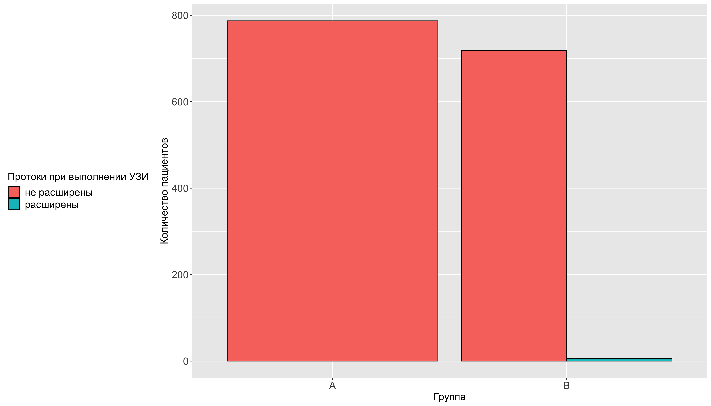

Рисунок №3.1.
Оценка протоков при выполнении ручного УЗ исследования в группах А и B.

*УЗ-фон* УЗ-фоном была в группе A железистая ткань в 63.28% (498/787 случаев) [95% ДИ 0.6;0.67],кисты в 0.76% (6/787 случаев) [95% ДИ 0;0.02] и фиброзно-кистозная мастопатия в 35.96% (283/787 случаев) [95% ДИ 0.33;0.39].
В группе B железистая ткань в 68.09% (493/724 случаев) [95% ДИ 0.65;0.71], склероз в 0.97% (7/724 случаев) [95% ДИ 0;0.02] и фиброзно-кистозная мастопатия в 30.94% (224/724 случаев) [95% ДИ 0.28;0.34](Таблица%203.2,%20Рисунок%203.2).

Таблица №3.2.
УЗ фон при УЗ исследовании в группах А и B.

| УЗ-фон                        | Процентная доля            | 95% ДИ         | Процентная доля            | 95% ДИ         |
|---------------|---------------|---------------|---------------|---------------|
| Группы                        | Группа A                   | ------         | Группа B                   | ------         |
| железистая ткань              | 63.278% (498/ 787 случаев) | [ 0.6; 0.67 ]  | 68.094% (493/ 724 случаев) | [ 0.65; 0.71 ] |
| кисты                         | 0.762% (6/ 787 случаев)    | [ 0; 0.02 ]    | 0% (0/ 724 случаев)        | [ 0; 0.01 ]    |
| склероз                       | 0% (0/ 787 случаев)        | [ 0; 0.01 ]    | 0.967% (7/ 724 случаев)    | [ 0; 0.02 ]    |
| фиброзно-кистозная мастопатия | 35.959% (283/ 787 случаев) | [ 0.33; 0.39 ] | 30.939% (224/ 724 случаев) | [ 0.28; 0.34 ] |

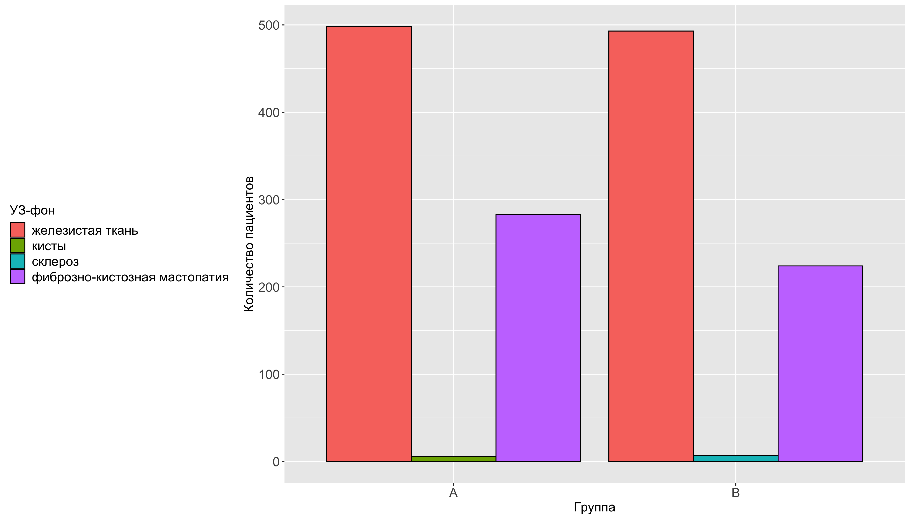

Рисунок №3.2.
УЗ фона при УЗ исследовании в группах А и B.

*Расположение образования*

Образование находилось в группе A локация образования была верхне-внутренний квадрант в 22.78% (41/180 случаев) [95% ДИ 0.17;0.3], верхне-наружный квадрант в 20.56% (37/180 случаев) [95% ДИ 0.15;0.27], вся железа в 3.33% (6/180 случаев) [95% ДИ 0.01;0.07], граница в 6.67% (12/180 случаев) [95% ДИ 0.04;0.12], граница верхних квадрантов в 15% (27/180 случаев) [95% ДИ 0.1;0.21], граница внутренних квадрантов в 13.89% (25/180 случаев) [95% ДИ 0.09;0.2], нижне-внутренний квадрант в 7.22% (13/180 случаев) [95% ДИ 0.04;0.12] и нижне-наружный квадрант в 10.56% (19/180 случаев) [95% ДИ 0.07;0.16].
В группе B - верхне-внутренний квадрант в 13.22% (30/227 случаев) [95% ДИ 0.09;0.18], верхне-наружный квадрант в 46.26% (105/227 случаев) [95% ДИ 0.4;0.53], граница в 8.81% (20/227 случаев) [95% ДИ 0.06;0.13], граница верхних квадрантов в 2.64% (6/227 случаев) [95% ДИ 0.01;0.06], граница наружных квадрантов 13.22% (30/227 случаев) [95% ДИ 0.09;0.18], нижне-внутренний квадрант в 2.64% (6/227 случаев) [95% ДИ 0.01;0.06], нижне-наружный квадрант в 10.57% (24/227 случаев) [95% ДИ 0.07;0.16] и центральный отдел в 2.64% (6/227 случаев) [95% ДИ 0.01;0.06] (Таблица 3.3, Рисунок 3.3).

Таблица №3.3.
Расположения образования при УЗ исследовании в группах А и B.

| Образование находилось | Процентная доля           | 95% ДИ         | Процентная доля            | 95% ДИ         |
|---------------|---------------|---------------|---------------|---------------|
| Группы                 | Группа A                  | ------         | Группа B                   | ------         |
| верхне-внутренний      | 22.778% (41/ 180 случаев) | [ 0.17; 0.3 ]  | 13.216% (30/ 227 случаев)  | [ 0.09; 0.18 ] |
| верхне-наружный        | 20.556% (37/ 180 случаев) | [ 0.15; 0.27 ] | 46.256% (105/ 227 случаев) | [ 0.4; 0.53 ]  |
| вся железа             | 3.333% (6/ 180 случаев)   | [ 0.01; 0.07 ] | 0% (0/ 227 случаев)        | [ 0; 0.02 ]    |
| граница                | 6.667% (12/ 180 случаев)  | [ 0.04; 0.12 ] | 8.811% (20/ 227 случаев)   | [ 0.06; 0.13 ] |
| граница верхних        | 15% (27/ 180 случаев)     | [ 0.1; 0.21 ]  | 2.643% (6/ 227 случаев)    | [ 0.01; 0.06 ] |
| граница внутренних     | 13.889% (25/ 180 случаев) | [ 0.09; 0.2 ]  | 0% (0/ 227 случаев)        | [ 0; 0.02 ]    |
| граница наружных       | 0% (0/ 180 случаев)       | [ 0; 0.03 ]    | 13.216% (30/ 227 случаев)  | [ 0.09; 0.18 ] |
| граница нижних         | 0% (0/ 180 случаев)       | [ 0; 0.03 ]    | 0% (0/ 227 случаев)        | [ 0; 0.02 ]    |
| нижне-внутренний       | 7.222% (13/ 180 случаев)  | [ 0.04; 0.12 ] | 2.643% (6/ 227 случаев)    | [ 0.01; 0.06 ] |
| нижне-наружный         | 10.556% (19/ 180 случаев) | [ 0.07; 0.16 ] | 10.573% (24/ 227 случаев)  | [ 0.07; 0.16 ] |
| центральный отдел      | 0% (0/ 180 случаев)       | [ 0; 0.03 ]    | 2.643% (6/ 227 случаев)    | [ 0.01; 0.06 ] |

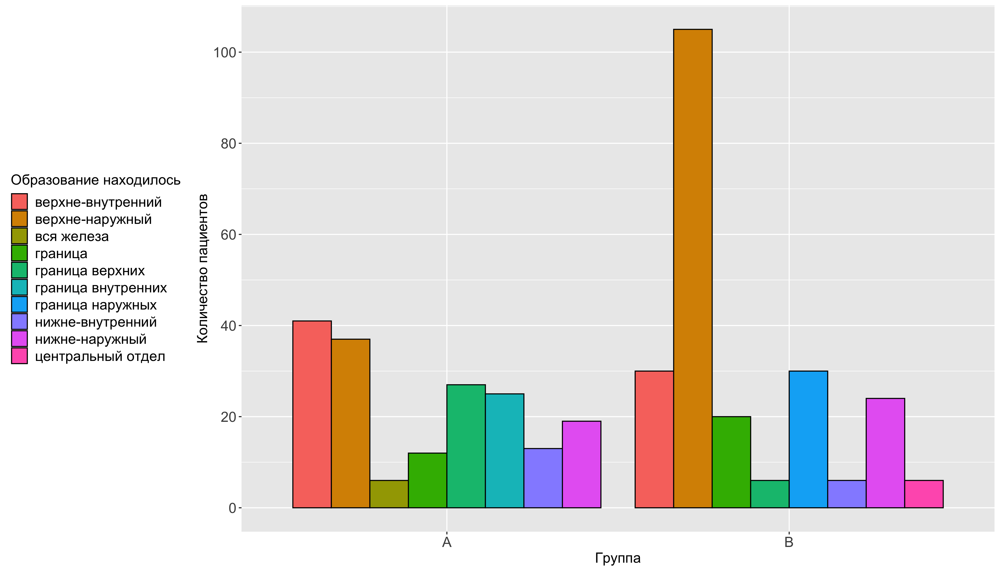

Рисунок №3.3.
Расположения образования при УЗ исследовании в группах А и B.

*Форма образования*

Форма образования в группе A неправильная в 3.33% (6/180 случаев) [95% ДИ 0.01;0.07], овальная в 86.67% (156/180 случаев) [95% ДИ 0.81;0.91], округлая в 6.67% (12/180 случаев) [95% ДИ 0.04;0.12] и участок нарушения архитектоники в 3.33% (6/180 случаев) [95% ДИ 0.01;0.07].
В группе B неправильная в 13.22% (30/227 случаев) [95% ДИ 0.09;0.18], овальная в 78.41% (178/227 случаев) [95% ДИ 0.72;0.83], округлая в 2.64% (6/227 случаев) [95% ДИ 0.01;0.06] и участок нарушения архитектоники в 5.73% (13/227 случаев) [95% ДИ 0.03;0.1] (Таблица 3.4, Рисунок 3.4).

Таблица №3.4.
Форма образования при УЗ исследовании в группах А и B.

| Форма образования               | Процентная доля            | 95% ДИ         | Процентная доля            | 95% ДИ         |
|---------------|---------------|---------------|---------------|---------------|
| Группы                          | Группа A                   | ------         | Группа B                   | ------         |
| неправильная                    | 3.333% (6/ 180 случаев)    | [ 0.01; 0.07 ] | 13.216% (30/ 227 случаев)  | [ 0.09; 0.18 ] |
| овальная                        | 86.667% (156/ 180 случаев) | [ 0.81; 0.91 ] | 78.414% (178/ 227 случаев) | [ 0.72; 0.83 ] |
| округлая                        | 6.667% (12/ 180 случаев)   | [ 0.04; 0.12 ] | 2.643% (6/ 227 случаев)    | [ 0.01; 0.06 ] |
| участок нарушения архитектоники | 3.333% (6/ 180 случаев)    | [ 0.01; 0.07 ] | 5.727% (13/ 227 случаев)   | [ 0.03; 0.1 ]  |

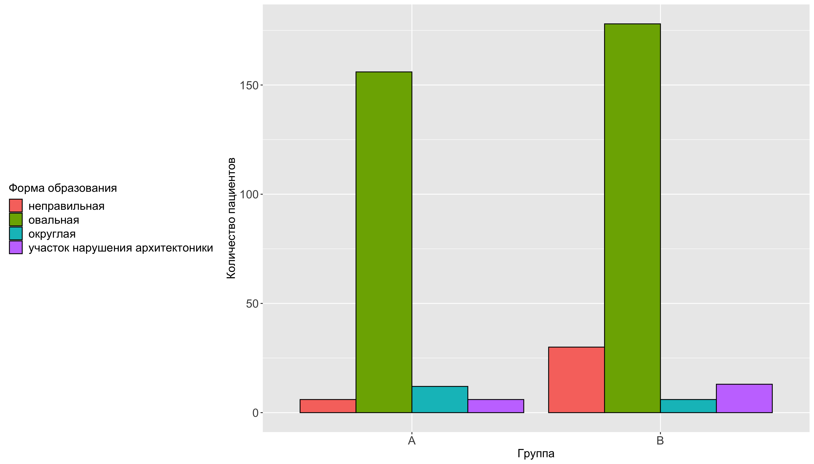

Рисунок №3.4.
Форма образования при УЗ исследовании в группах А и B.

*Размер образования*

Размер образования в группе A был в диапазоне 0,5-1,0 см в 37.22% (67/180 случаев) [95% ДИ 0.3;0.45], 1,1-1,5 см в 38.33% (69/180 случаев) [95% ДИ 0.31;0.46], 1,5-2,0 см в 17.22% (31/180 случаев) [95% ДИ 0.12;0.24] и 2,5-3,0 см в 7.22% (13/180 случаев) [95% ДИ 0.04;0.12].
В группе B 0,5-1,0 см в 34.8% (79/227 случаев) [95% ДИ 0.29;0.41], 1,1-1,5 см в 45.81% (104/227 случаев) [95% ДИ 0.39;0.53], 1,5-2,0 см в 8.37% (19/227 случаев) [95% ДИ 0.05;0.13], 2,1-2,5 см в 2.64% (6/227 случаев) [95% ДИ 0.01;0.06] и 2,5-3,0 см в 8.37% (19/227 случаев) [95% ДИ 0.05;0.13] (Таблица 3.5, Рисунок 3.5).

Таблица №3.5.
Размер образования при УЗ исследовании в группах А и B.

| Размер образования | Процентная доля           | 95% ДИ         | Процентная доля            | 95% ДИ         |
|---------------|---------------|---------------|---------------|---------------|
| Группы             | Группа A                  | ------         | Группа B                   | ------         |
| 0,5-1,0 см         | 37.222% (67/ 180 случаев) | [ 0.3; 0.45 ]  | 34.802% (79/ 227 случаев)  | [ 0.29; 0.41 ] |
| 1,1-1,5 см         | 38.333% (69/ 180 случаев) | [ 0.31; 0.46 ] | 45.815% (104/ 227 случаев) | [ 0.39; 0.53 ] |
| 1,5-2,0 см         | 17.222% (31/ 180 случаев) | [ 0.12; 0.24 ] | 8.37% (19/ 227 случаев)    | [ 0.05; 0.13 ] |
| 2,1-2,5 см         | 0% (0/ 180 случаев)       | [ 0; 0.03 ]    | 2.643% (6/ 227 случаев)    | [ 0.01; 0.06 ] |
| 2,5-3,0 см         | 7.222% (13/ 180 случаев)  | [ 0.04; 0.12 ] | 8.37% (19/ 227 случаев)    | [ 0.05; 0.13 ] |
| более 3 см         | 0% (0/ 180 случаев)       | [ 0; 0.03 ]    | 0% (0/ 227 случаев)        | [ 0; 0.02 ]    |

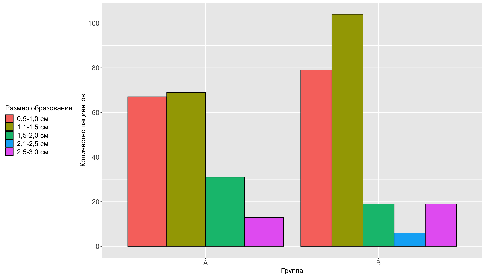

Рисунок №3.5.
Размер образования при УЗ исследовании в группах А и B.

*Края образования*

В группе A края образования были волнистые в 14.44% (26/180 случаев) [95% ДИ 0.1;0.21], неровные в 3.33% (6/180 случаев) [95% ДИ 0.01;0.07] и ровные в 82.22% (148/180 случаев) [95% ДИ 0.76;0.87].
В группе B волнистые в 8.37% (19/227 случаев) [95% ДИ 0.05;0.13], звездчатые в 5.29% (12/227 случаев) [95% ДИ 0.03;0.09], неровные в 5.29% (12/227 случаев) [95% ДИ 0.03;0.09], полициклические в 2.64% (6/227 случаев) [95% ДИ 0.01;0.06] ировные в 78.41% (178/227 случаев) [95% ДИ 0.72;0.83] (Таблица 3.6, Рисунок 3.6).

Таблица №3.6.
Оценка краев образования при УЗ исследовании в группах А и B.

| Края образования | Процентная доля            | 95% ДИ         | Процентная доля            | 95% ДИ         |
|---------------|---------------|---------------|---------------|---------------|
| Группы           | Группа A                   | ------         | Группа B                   | ------         |
| волнистые        | 14.444% (26/ 180 случаев)  | [ 0.1; 0.21 ]  | 8.37% (19/ 227 случаев)    | [ 0.05; 0.13 ] |
| звездчатые       | 0% (0/ 180 случаев)        | [ 0; 0.03 ]    | 5.286% (12/ 227 случаев)   | [ 0.03; 0.09 ] |
| неровные         | 3.333% (6/ 180 случаев)    | [ 0.01; 0.07 ] | 5.286% (12/ 227 случаев)   | [ 0.03; 0.09 ] |
| полициклические  | 0% (0/ 180 случаев)        | [ 0; 0.03 ]    | 2.643% (6/ 227 случаев)    | [ 0.01; 0.06 ] |
| ровные           | 82.222% (148/ 180 случаев) | [ 0.76; 0.87 ] | 78.414% (178/ 227 случаев) | [ 0.72; 0.83 ] |

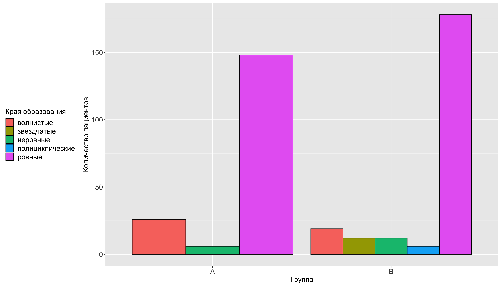

Рисунок №3.6.
Оценка краев образования при УЗ исследовании в группах А и B.

*Эхогенность образования*

В группе A гипоэхогенное образование было в 89.44% (161/180 случаев) [95% ДИ 0.84;0.93], изоэхогенное в 3.89% (7/180 случаев) [95% ДИ 0.02;0.08] и смешанная эхогенность в 6.67% (12/180 случаев) [95% ДИ 0.04;0.12].
В группе B гипоэхогенное образование в 94.71% (215/227 случаев) [95% ДИ 0.91;0.97], изоэхогенное в 2.64% (6/227 случаев) [95% ДИ 0.01;0.06] и смешанная эхогенность в 2.64% (6/227 случаев) [95% ДИ 0.01;0.06] (Таблица 3.7, Рисунок 3.7).

Таблица №3.7.
Оценка эхогенности образования при УЗ исследовании в группах А и B.

| Эхогенность образования | Процентная доля            | 95% ДИ         | Процентная доля            | 95% ДИ         |
|---------------|---------------|---------------|---------------|---------------|
| Группы                  | Группа A                   | ------         | Группа B                   | ------         |
| анэхогенное             | 0% (0/ 180 случаев)        | [ 0; 0.03 ]    | 0% (0/ 227 случаев)        | [ 0; 0.02 ]    |
| гиперэхогенное          | 0% (0/ 180 случаев)        | [ 0; 0.03 ]    | 0% (0/ 227 случаев)        | [ 0; 0.02 ]    |
| гипоэхогенное           | 89.444% (161/ 180 случаев) | [ 0.84; 0.93 ] | 94.714% (215/ 227 случаев) | [ 0.91; 0.97 ] |
| изоэхогенное            | 3.889% (7/ 180 случаев)    | [ 0.02; 0.08 ] | 2.643% (6/ 227 случаев)    | [ 0.01; 0.06 ] |
| смешанная               | 6.667% (12/ 180 случаев)   | [ 0.04; 0.12 ] | 2.643% (6/ 227 случаев)    | [ 0.01; 0.06 ] |

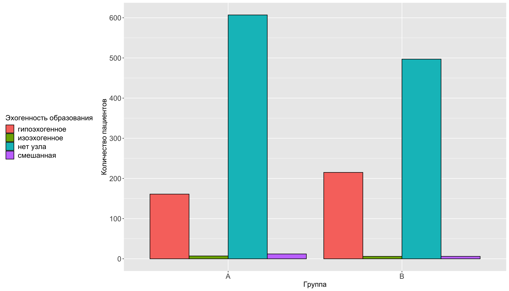

Рисунок №3.7.
Оценка эхогенности образования при УЗ исследовании в группах А и B.

*УЗ-структура образования*

В группе A УЗ-структура образования неоднородная в 13.89% (25/180 случаев) [95% ДИ 0.09;0.2], однородная в 82.78% (149/180 случаев) [95% ДИ 0.76;0.88], с жидкостным содержимым в 0% (0/180 случаев) [95% ДИ 0;0.03] и наличие внутрикистозных пристеночных разрастаний в 3.33% (6/180 случаев) [95% ДИ 0.01;0.07].
В группе B неоднородная в 24.23% (55/227 случаев) [95% ДИ 0.19;0.3] и однородная в 75.77% (172/227 случаев) [95% ДИ 0.7;0.81] (Таблица 3.8, Рисунок 3.8).

Таблица №3.8.
Оценка УЗ-структуры образования при УЗ исследовании в группах А и B.

| УЗ-структура образования                         | Процентная доля            | 95% ДИ         | Процентная доля            | 95% ДИ        |
|---------------|---------------|---------------|---------------|---------------|
| Группы                                           | Группа A                   | ------         | Группа B                   | ------        |
| наличие внутрикистозных пристеночных разрастаний | 3.333% (6/ 180 случаев)    | [ 0.01; 0.07 ] | 0% (0/ 227 случаев)        | [ 0; 0.02 ]   |
| неоднородная                                     | 13.889% (25/ 180 случаев)  | [ 0.09; 0.2 ]  | 24.229% (55/ 227 случаев)  | [ 0.19; 0.3 ] |
| однородная                                       | 82.778% (149/ 180 случаев) | [ 0.76; 0.88 ] | 75.771% (172/ 227 случаев) | [ 0.7; 0.81 ] |
| с жидкостным содержимым                          | 0% (0/ 180 случаев)        | [ 0; 0.03 ]    | 0% (0/ 227 случаев)        | [ 0; 0.02 ]   |

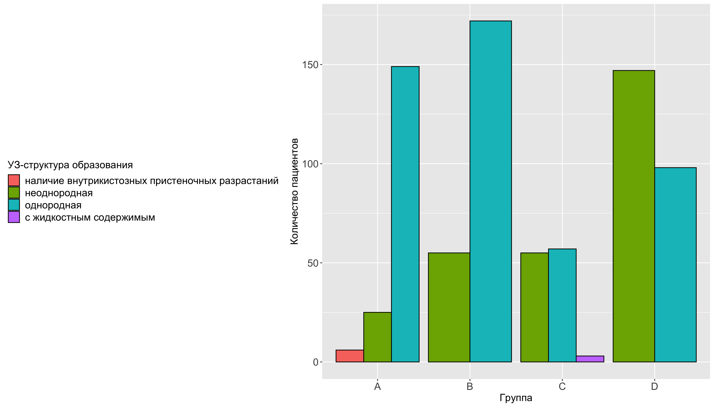

Рисунок №3.8.
Оценка УЗ-структуры образования образования при УЗ исследовании в группах А и B.

*Количество узлов*

В группе A один узел обнаружен в 79.44% (143/180 случаев) [95% ДИ 0.73;0.85], два в 13.89% (25/180 случаев) [95% ДИ 0.09;0.2], три в 3.33% (6/180 случаев) [95% ДИ 0.01;0.07] и множественные в 3.33% (6/180 случаев) [95% ДИ 0.01;0.07].

В группе B один узел обнаружен в 72.69% (165/227 случаев) [95% ДИ 0.66;0.78], два в 11.01% (25/227 случаев) [95% ДИ 0.07;0.16], три в 5.29% (12/227 случаев) [95% ДИ 0.03;0.09] и множественные в 11.01% (25/227 случаев) [95% ДИ 0.07;0.16] (Таблица 3.9, Рисунок 3.9).

Таблица №3.9.
Оценка количества узлов при УЗ исследовании в группах А и B.

| Количество узлов | Процентная доля            | 95% ДИ         | Процентная доля            | 95% ДИ         |
|---------------|---------------|---------------|---------------|---------------|
| Группы           | Группа A                   | ------         | Группа B                   | ------         |
| один             | 79.444% (143/ 180 случаев) | [ 0.73; 0.85 ] | 72.687% (165/ 227 случаев) | [ 0.66; 0.78 ] |
| два              | 13.889% (25/ 180 случаев)  | [ 0.09; 0.2 ]  | 11.013% (25/ 227 случаев)  | [ 0.07; 0.16 ] |
| три              | 3.333% (6/ 180 случаев)    | [ 0.01; 0.07 ] | 5.286% (12/ 227 случаев)   | [ 0.03; 0.09 ] |
| множественные    | 3.333% (6/ 180 случаев)    | [ 0.01; 0.07 ] | 11.013% (25/ 227 случаев)  | [ 0.07; 0.16 ] |

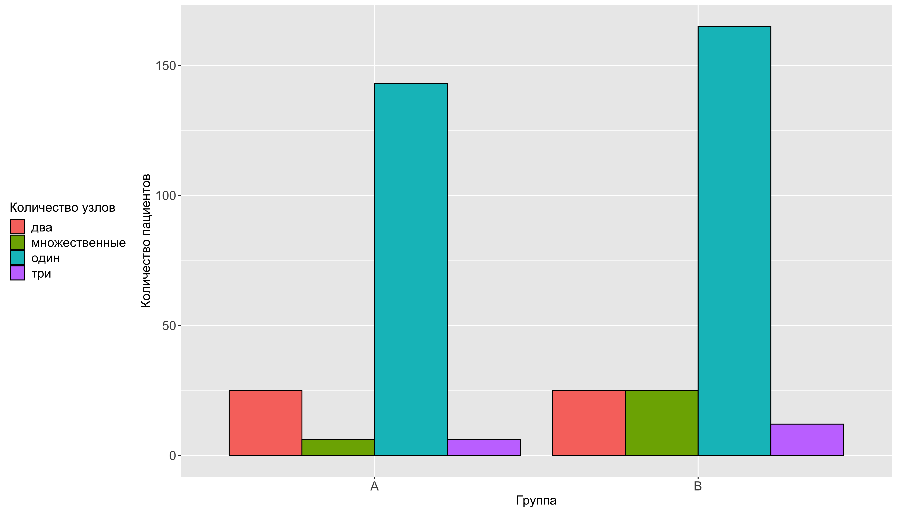

Рисунок №3.9.
Оценка количества узлов при УЗ исследовании в группах А и B.

*Кровоток в образовании* Кровоток в образовании в группе A интранодулярный в 6.67% (12/180 случаев) [95% ДИ 0.04;0.12], не определяется в 36.11% (65/180 случаев) [95% ДИ 0.29;0.44], определяются внутри в 3.33% (6/180 случаев) [95% ДИ 0.01;0.07], перинодулярный в 3.33% (6/180 случаев) [95% ДИ 0.01;0.07], по периферии в 47.22% (85/180 случаев) [95% ДИ 0.4;0.55] и смешанный в 3.33% (6/180 случаев) [95% ДИ 0.01;0.07].
В группе B кровоток интранодулярный в 21.59% (49/227 случаев) [95% ДИ 0.17;0.28], не определяется в 37.44% (85/227 случаев) [95% ДИ 0.31;0.44], перинодулярный в 2.64% (6/227 случаев) [95% ДИ 0.01;0.06] и по периферии в 38.33% (87/227 случаев) [95% ДИ 0.32;0.45] (Таблица 3.10, Рисунок 3.10).

Таблица №3.10.
Оценка кровотока в образовании при УЗ исследовании в группах А и B.

| Кровоток в образовании | Процентная доля           | 95% ДИ         | Процентная доля           | 95% ДИ         |
|---------------|---------------|---------------|---------------|---------------|
| Группы                 | Группа A                  | ------         | Группа B                  | ------         |
| интранодулярный        | 6.667% (12/ 180 случаев)  | [ 0.04; 0.12 ] | 21.586% (49/ 227 случаев) | [ 0.17; 0.28 ] |
| не определяется        | 36.111% (65/ 180 случаев) | [ 0.29; 0.44 ] | 37.445% (85/ 227 случаев) | [ 0.31; 0.44 ] |
| определяются внутри    | 3.333% (6/ 180 случаев)   | [ 0.01; 0.07 ] | 0% (0/ 227 случаев)       | [ 0; 0.02 ]    |
| перинодулярный         | 3.333% (6/ 180 случаев)   | [ 0.01; 0.07 ] | 2.643% (6/ 227 случаев)   | [ 0.01; 0.06 ] |
| по периферии           | 47.222% (85/ 180 случаев) | [ 0.4; 0.55 ]  | 38.326% (87/ 227 случаев) | [ 0.32; 0.45 ] |
| смешанный              | 3.333% (6/ 180 случаев)   | [ 0.01; 0.07 ] | 0% (0/ 227 случаев)       | [ 0; 0.02 ]    |

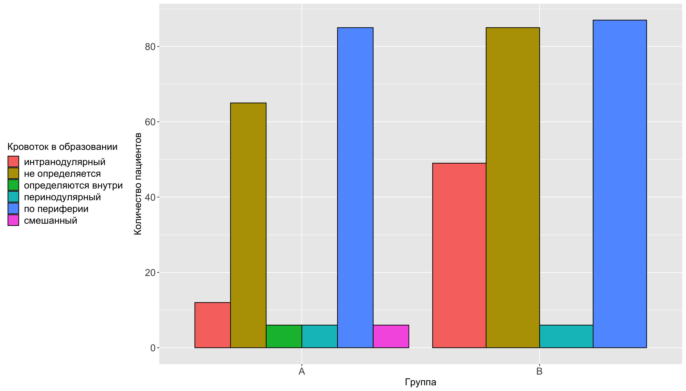

Рисунок №3.10.
Оценка кровотока в образовании при УЗ исследовании в группах А и B.

*Эластография*

В группе A был определен 0 эластотип в 82.08% (646/787 случаев) [95% ДИ 0.79;0.85], 1 эластотип в 0.76% (6/787 случаев) [95% ДИ 0;0.02], 3 эластотип в 14.1% (111/787 случаев) [95% ДИ 0.12;0.17], 4 эластотип в 1.52% (12/787 случаев) [95% ДИ 0.01;0.03] и нет данных в 1.52% (12/787 случаев) [95% ДИ 0.01;0.03].
В группе B 0 эластотип был в 72.93% (528/724 случаев) [95% ДИ 0.7;0.76], 3 эластотип в 24.45% (177/724 случаев) [95% ДИ 0.21;0.28], 4 эластотип в 0.97% (7/724 случаев) [95% ДИ 0;0.02] и нет данных в 1.66% (12/724 случаев) [95% ДИ 0.01;0.03] (Таблица 3.11, Рисунок 3.11).

Таблица №3.11.
Результаты эластографии при УЗ исследовании в группах А и B.

| Эластография | Процентная доля            | 95% ДИ         | Процентная доля            | 95% ДИ         |
|---------------|---------------|---------------|---------------|---------------|
| Группы       | Группа A                   | ------         | Группа B                   | ------         |
| 0 эластотип  | 82.084% (646/ 787 случаев) | [ 0.79; 0.85 ] | 72.928% (528/ 724 случаев) | [ 0.7; 0.76 ]  |
| 1 эластотип  | 0.762% (6/ 787 случаев)    | [ 0; 0.02 ]    | 0% (0/ 724 случаев)        | [ 0; 0.01 ]    |
| 3 эластотип  | 14.104% (111/ 787 случаев) | [ 0.12; 0.17 ] | 24.448% (177/ 724 случаев) | [ 0.21; 0.28 ] |
| 4 эластотип  | 1.525% (12/ 787 случаев)   | [ 0.01; 0.03 ] | 0.967% (7/ 724 случаев)    | [ 0; 0.02 ]    |
| нет данных   | 1.525% (12/ 787 случаев)   | [ 0.01; 0.03 ] | 1.657% (12/ 724 случаев)   | [ 0.01; 0.03 ] |

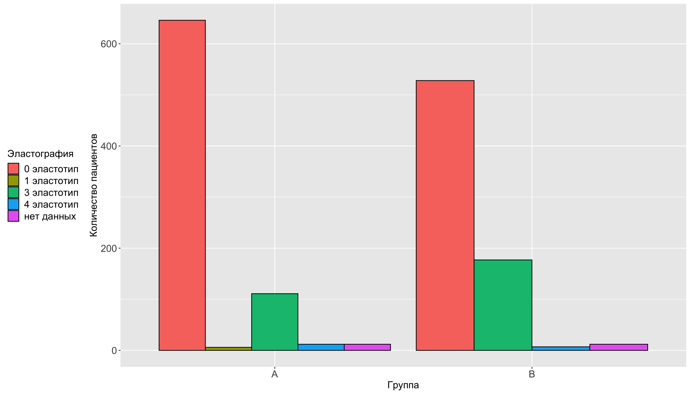

Рисунок №3.11.
Результаты эластографии при УЗ исследовании в группах А и B.

*Регионарные лимфоузлы*

В группе A лимфоузлы не изменены в 97.59% (768/787 случаев) [95% ДИ 0.96;0.98] и увеличены в правой надключичной области в 2.41% (19/787 случаев) [95% ДИ 0.02;0.04].
В группе B лимфоузлы не изменены в 95.72% (693/724 случаев) [95% ДИ 0.94;0.97] и увеличены в правой надключичной области в 4.28% (31/724 случаев) [95% ДИ 0.03;0.06] (Таблица 3.12, Рисунок 3.12).

Таблица №3.12.
Результаты оценки регионарных лимфоузлов при УЗ исследовании в группах А и B.

| Увеличение регинарных лимфоузлов | Процентная доля            | 95% ДИ         | Процентная доля            | 95% ДИ         |
|---------------|---------------|---------------|---------------|---------------|
| Группы                           | Группа A                   | ------         | Группа B                   | ------         |
| не изменены                      | 97.586% (768/ 787 случаев) | [ 0.96; 0.98 ] | 95.718% (693/ 724 случаев) | [ 0.94; 0.97 ] |
| правая надключичная область      | 2.414% (19/ 787 случаев)   | [ 0.02; 0.04 ] | 4.282% (31/ 724 случаев)   | [ 0.03; 0.06 ] |

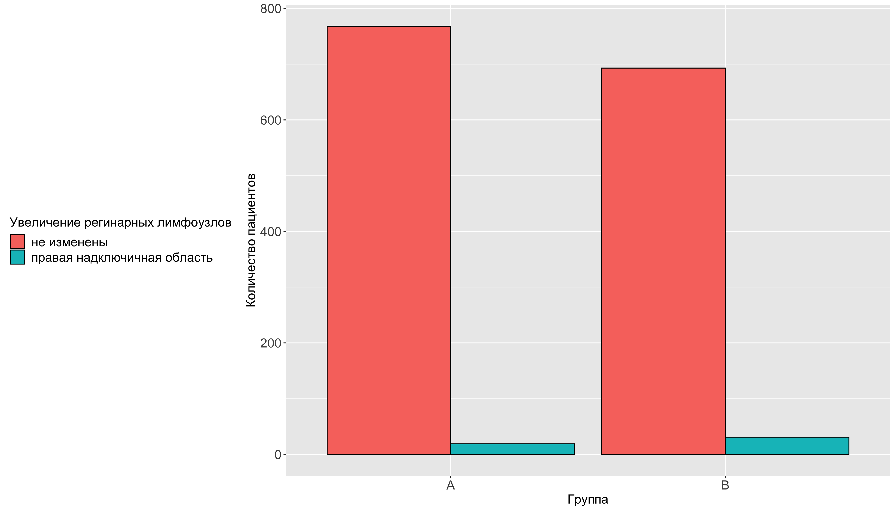

Рисунок №3.12.
Результаты оценки регионарных лимфоузлов при УЗ исследовании в группах А и B.

*Определение категории BI-RADS*

В группе A категория Birads 1 была в 26.68% (210/787 случаев) [95% ДИ 0.24;0.3], Birads 2 в 58.45% (460/787 случаев) [95% ДИ 0.55;0.62], Birads 3 в 12.45% (98/787 случаев) [95% ДИ 0.1;0.15], Birads 4а в 1.65% (13/787 случаев) [95% ДИ 0.01;0.03] и Birads 5 в 0.76% (6/787 случаев) [95% ДИ 0;0.02].
В группе B Birads 1 в 20.58% (149/724 случаев) [95% ДИ 0.18;0.24], Birads 2 в 58.43% (423/724 случаев) [95% ДИ 0.55;0.62], Birads 3 в 15.19% (110/724 случаев) [95% ДИ 0.13;0.18], Birads 4b в 1.66% (12/724 случаев) [95% ДИ 0.01;0.03], Birads 4а в 3.31% (24/724 случаев) [95% ДИ 0.02;0.05] и Birads 5 в 0.83% (6/724 случаев) [95% ДИ 0;0.02] (Таблица 3.13, Рисунок 3.13).

Таблица №3.13.
Определение категории BIRADS при УЗ исследовании в группах А и B.

| Категория BI-RADS | Процентная доля            | 95% ДИ         | Процентная доля            | 95% ДИ         |
|---------------|---------------|---------------|---------------|---------------|
| Группы            | Группа A                   | ------         | Группа B                   | ------         |
| Birads 1          | 26.684% (210/ 787 случаев) | [ 0.24; 0.3 ]  | 20.58% (149/ 724 случаев)  | [ 0.18; 0.24 ] |
| Birads 2          | 58.45% (460/ 787 случаев)  | [ 0.55; 0.62 ] | 58.425% (423/ 724 случаев) | [ 0.55; 0.62 ] |
| Birads 3          | 12.452% (98/ 787 случаев)  | [ 0.1; 0.15 ]  | 15.193% (110/ 724 случаев) | [ 0.13; 0.18 ] |
| Birads 4b         | 0% (0/ 787 случаев)        | [ 0; 0.01 ]    | 1.657% (12/ 724 случаев)   | [ 0.01; 0.03 ] |
| Birads 4а         | 1.652% (13/ 787 случаев)   | [ 0.01; 0.03 ] | 3.315% (24/ 724 случаев)   | [ 0.02; 0.05 ] |
| Birads 5          | 0.762% (6/ 787 случаев)    | [ 0; 0.02 ]    | 0.829% (6/ 724 случаев)    | [ 0; 0.02 ]    |

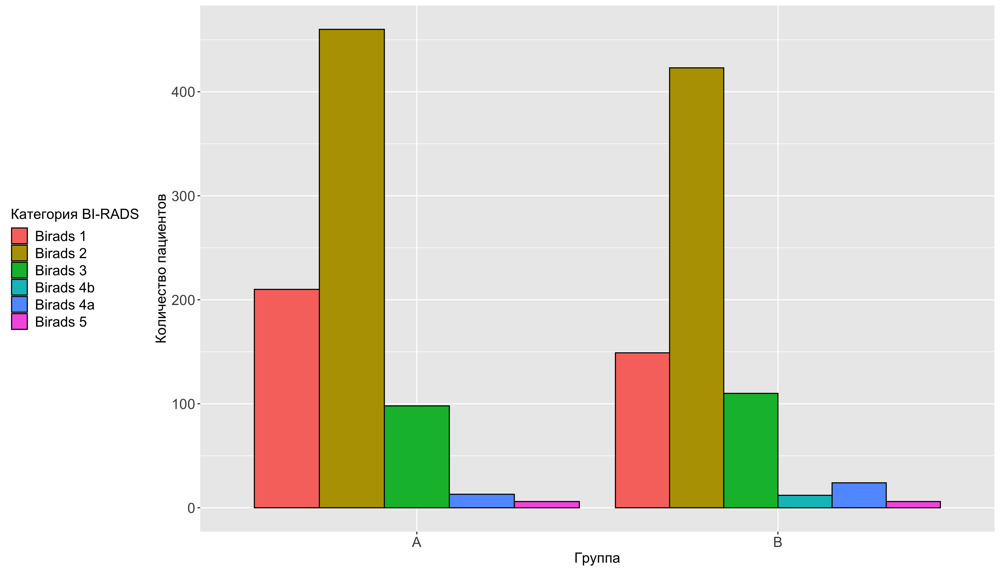

Рисунок №3.13.
Определение категории BIRADS при УЗ исследовании в группах А и B.

*Диагноз после выполнения УЗ исследования*

УЗ-диагноз в группе A "без патологии" в 27.32% (215/787 случаев) [95% ДИ 0.24;0.31], "диффузный фиброаденоматоз" в 4.19% (33/787 случаев) [95% ДИ 0.03;0.06], "киста" в 1.02% (8/787 случаев) [95% ДИ 0;0.02], "кисты" в 2.29% (18/787 случаев) [95% ДИ 0.01;0.04], "локализованный фиброаденоматоз" в 1.02% (8/787 случаев) [95% ДИ 0;0.02], "мультицентричный рак" в 0.76% (6/787 случаев) [95% ДИ 0;0.02], "образование Ca" в 1.14% (9/787 случаев) [95% ДИ 0.01;0.02], "сложная киста" в 0.13% (1/787 случаев) [95% ДИ 0;0.01], "фиброаденома единичная" в 14.1% (111/787 случаев) [95% ДИ 0.12;0.17], "фиброаденомы множествненные" в 3.94% (31/787 случаев) [95% ДИ 0.03;0.06], "фиброзно-кистозная мастопатия" в 43.33% (341/787 случаев) [95% ДИ 0.4;0.47] и "цистаденопапиллома" в 0.76% (6/787 случаев) [95% ДИ 0;0.02].
В группе B были поставлены диагнозы "без патологии" в 21.55% (156/724 случаев) [95% ДИ 0.19;0.25], "диффузный фиброаденоматоз" в 4.28% (31/724 случаев) [95% ДИ 0.03;0.06], "интрамаммарный лимфатический узел" в 0% (0/724 случаев) [95% ДИ 0;0.01], "киста" в 3.31% (24/724 случаев) [95% ДИ 0.02;0.05], "кисты" в 3.59% (26/724 случаев) [95% ДИ 0.02;0.05], "локализованный фиброаденоматоз" в 0.28% (2/724 случаев) [95% ДИ 0;0.01], "мультицентричный рак" в 2.49% (18/724 случаев) [95% ДИ 0.02;0.04], "мультфококальный рак" в 0.41% (3/724 случаев) [95% ДИ 0;0.01], "образование Ca" в 3.59% (26/724 случаев) [95% ДИ 0.02;0.05], "фиброаденома единичная" в 20.99% (152/724 случаев) [95% ДИ 0.18;0.24], "фиброаденомы множествненные" в 6.49% (47/724 случаев) [95% ДИ 0.05;0.09] и "фиброзно-кистозная мастопатия" в 33.01% (239/724 случаев) [95% ДИ 0.3;0.37] (Таблица 3.14, Рисунок 3.14).

Таблица №3.14.
Поставленные диагнозы при УЗ исследовании в группах А и B.

| УЗ-диагноз                                 | Процентная доля            | 95% ДИ         | Процентная доля            | 95% ДИ         |
|---------------|---------------|---------------|---------------|---------------|
| Группы                                     | Группа A                   | ------         | Группа B                   | ------         |
| без патологии                              | 27.319% (215/ 787 случаев) | [ 0.24; 0.31 ] | 21.547% (156/ 724 случаев) | [ 0.19; 0.25 ] |
| внутрипротоковая папиллома молочной железы | 0% (0/ 787 случаев)        | [ 0; 0.01 ]    | 0% (0/ 724 случаев)        | [ 0; 0.01 ]    |
| диффузный фиброаденоматоз                  | 4.193% (33/ 787 случаев)   | [ 0.03; 0.06 ] | 4.282% (31/ 724 случаев)   | [ 0.03; 0.06 ] |
| интрамаммарный лимфатический узел          | 0% (0/ 787 случаев)        | [ 0; 0.01 ]    | 0% (0/ 724 случаев)        | [ 0; 0.01 ]    |
| киста                                      | 1.017% (8/ 787 случаев)    | [ 0; 0.02 ]    | 3.315% (24/ 724 случаев)   | [ 0.02; 0.05 ] |
| кисты                                      | 2.287% (18/ 787 случаев)   | [ 0.01; 0.04 ] | 3.591% (26/ 724 случаев)   | [ 0.02; 0.05 ] |
| липома                                     | 0% (0/ 787 случаев)        | [ 0; 0.01 ]    | 0% (0/ 724 случаев)        | [ 0; 0.01 ]    |
| локализованный фиброаденоматоз             | 1.017% (8/ 787 случаев)    | [ 0; 0.02 ]    | 0.276% (2/ 724 случаев)    | [ 0; 0.01 ]    |
| мультицентричный рак                       | 0.762% (6/ 787 случаев)    | [ 0; 0.02 ]    | 2.486% (18/ 724 случаев)   | [ 0.02; 0.04 ] |
| мультфококальный рак                       | 0% (0/ 787 случаев)        | [ 0; 0.01 ]    | 0.414% (3/ 724 случаев)    | [ 0; 0.01 ]    |
| образование Ca                             | 1.144% (9/ 787 случаев)    | [ 0.01; 0.02 ] | 3.591% (26/ 724 случаев)   | [ 0.02; 0.05 ] |
| сложная киста                              | 0.127% (1/ 787 случаев)    | [ 0; 0.01 ]    | 0% (0/ 724 случаев)        | [ 0; 0.01 ]    |
| фиброаденома единичная                     | 14.104% (111/ 787 случаев) | [ 0.12; 0.17 ] | 20.994% (152/ 724 случаев) | [ 0.18; 0.24 ] |
| фиброаденомы множествненные                | 3.939% (31/ 787 случаев)   | [ 0.03; 0.06 ] | 6.492% (47/ 724 случаев)   | [ 0.05; 0.09 ] |
| фиброзно-кистозная мастопатия              | 43.329% (341/ 787 случаев) | [ 0.4; 0.47 ]  | 33.011% (239/ 724 случаев) | [ 0.3; 0.37 ]  |
| цистаденопапиллома                         | 0.762% (6/ 787 случаев)    | [ 0; 0.02 ]    | 0% (0/ 724 случаев)        | [ 0; 0.01 ]    |

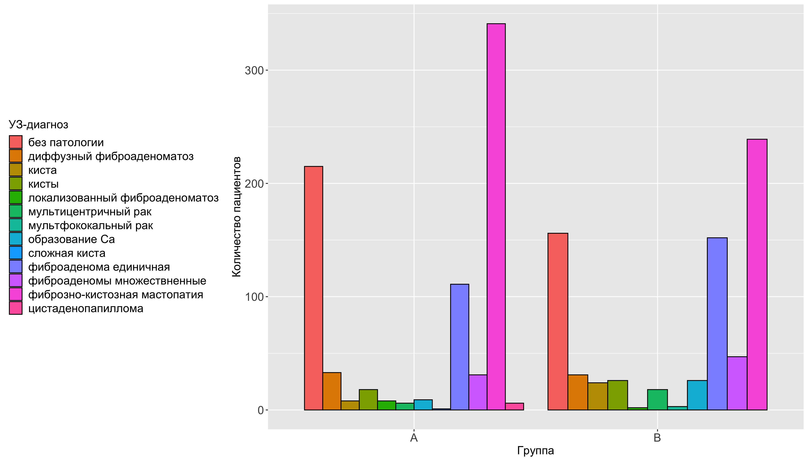

Рисунок №3.14.
Поставленные диагнозы при УЗ исследовании в группах А и B.

*Диагноз после выполнении УЗ исследования*

В группе A определяются кальцинаты в 0.76% (6/787 случаев) [95% ДИ 0;0.02].
В группе B обнаружены микрокальцинаты в 0.83% (6/724 случаев) [95% ДИ 0;0.02] и определяются кальцинаты в 0.83% (6/724 случаев) [95% ДИ 0;0.02] (Таблица 3.15, Рисунок 3.15).

Таблица №3.15.
Определение кальцинатов при УЗ исследовании в группах А и B.

| Кальцинаты      | Процентная доля            | 95% ДИ      | Процентная доля            | 95% ДИ         |
|--------------|----------------|--------------|----------------|--------------|
| Группы          | Группа A                   | ------      | Группа B                   | ------         |
| микрокальцинаты | 0% (0/ 787 случаев)        | [ 0; 0.01 ] | 0.829% (6/ 724 случаев)    | [ 0; 0.02 ]    |
| нет             | 99.238% (781/ 787 случаев) | [ 0.98; 1 ] | 98.343% (712/ 724 случаев) | [ 0.97; 0.99 ] |
| определяются    | 0.762% (6/ 787 случаев)    | [ 0; 0.02 ] | 0.829% (6/ 724 случаев)    | [ 0; 0.02 ]    |

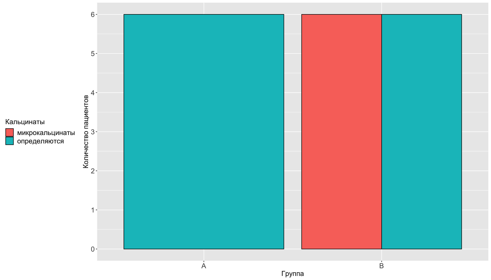

Рисунок №3.15.
Определение кальцинатов при УЗ исследовании в группах А и B.

*Определние злокачественного образования при УЗИ исследовании*

В группе A был установлен УЗ диагноз злокачественное образование в 1.91% (15/787 случаев) [95% ДИ 0.01;0.03].
В группе B в 6.49% (47/724 случаев) [95% ДИ 0.05;0.09] (Таблица 3.16, Рисунок 3.16).

Таблица №3.16.
Определение злокачественного новообразование при УЗ исследовании в группах А и B.

| УЗ диагноз злокачественное образование | Процентная доля            | 95% ДИ         | Процентная доля            | 95% ДИ         |
|---------------|---------------|---------------|---------------|---------------|
| Группы                                 | Группа A                   | ------         | Группа B                   | ------         |
| Да                                     | 1.906% (15/ 787 случаев)   | [ 0.01; 0.03 ] | 6.492% (47/ 724 случаев)   | [ 0.05; 0.09 ] |
| Нет                                    | 98.094% (772/ 787 случаев) | [ 0.97; 0.99 ] | 93.508% (677/ 724 случаев) | [ 0.91; 0.95 ] |

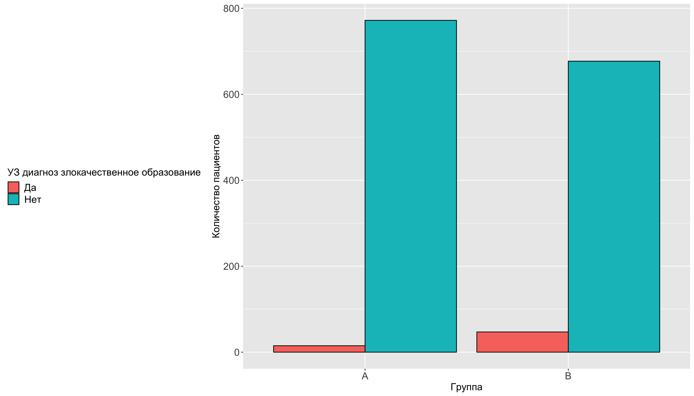

Рисунок №3.16.
Определение злокачественного новообразование при УЗ исследовании в группах А и B.

### 3.2.3 Исследование МРТ

*Данные МРТ исследования*

В группе A по МРТ были обнаружены интраммарные лимфоузлы в 31.63% (31/98 случаев) [95% ДИ 0.23;0.42] и сегментарно-протоковая зона контрастирования в 68.37% (67/98 случаев) [95% ДИ 0.58;0.77].
В группе B интраммарные лимфоузлы в 20.91% (23/110 случаев) [95% ДИ 0.14;0.3] и сегментарно-протоковая зона контрастирования в 79.09% (87/110 случаев) [95% ДИ 0.7;0.86] (Таблица 3.17, Рисунок 3.17).

Таблица №3.17.
Данные МРТ в группах А и B.

| Данные МРТ                                   | Процентная доля          | 95% ДИ         | Процентная доля           | 95% ДИ        |
|---------------|---------------|---------------|---------------|---------------|
| Группы                                       | Группа A                 | ------         | Группа B                  | ------        |
| интраммарные лимфоузлы                       | 31.633% (31/ 98 случаев) | [ 0.23; 0.42 ] | 20.909% (23/ 110 случаев) | [ 0.14; 0.3 ] |
| сегментарно-протоковая зона контрастирования | 68.367% (67/ 98 случаев) | [ 0.58; 0.77 ] | 79.091% (87/ 110 случаев) | [ 0.7; 0.86 ] |

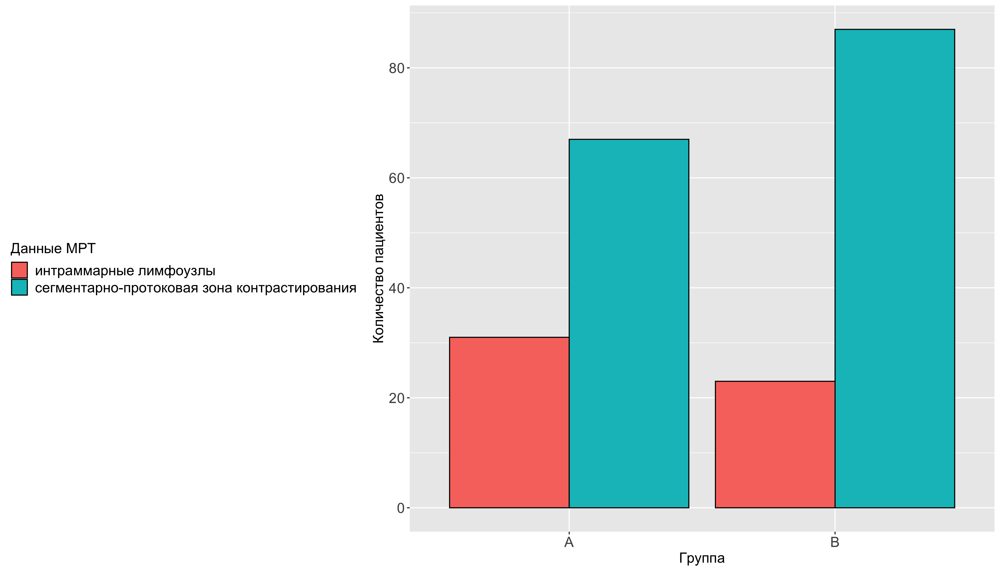

Рисунок №3.17.
Данные МРТ в группах А и B.

*Количество узлов на МРТ*

В группе A был обнаружен один узел в 76.53% (75/98 случаев) [95% ДИ 0.67;0.84], два в 6.12% (6/98 случаев) [95% ДИ 0.03;0.13], три в 6.12% (6/98 случаев) [95% ДИ 0.03;0.13], множественные в 0% (0/98 случаев) [95% ДИ 0;0.05] и не определяется в 11.22% (11/98 случаев) [95% ДИ 0.06;0.2].
В группе B был обнаружен один узел в 69.09% (76/110 случаев) [95% ДИ 0.59;0.77], два в 5.45% (6/110 случаев) [95% ДИ 0.02;0.12], три в 10.91% (12/110 случаев) [95% ДИ 0.06;0.19], множественные в 10.91% (12/110 случаев) [95% ДИ 0.06;0.19] и не определяется в 3.64% (4/110 случаев) [95% ДИ 0.01;0.1] (Таблица 3.18, Рисунок 3.18).

Таблица №3.18.
Количество узлов на МРТ в группах А и B.

| Количество узлов на МРТ | Процентная доля          | 95% ДИ         | Процентная доля           | 95% ДИ         |
|---------------|---------------|---------------|---------------|---------------|
| Группы                  | Группа A                 | ------         | Группа B                  | ------         |
| один                    | 76.531% (75/ 98 случаев) | [ 0.67; 0.84 ] | 69.091% (76/ 110 случаев) | [ 0.59; 0.77 ] |
| два                     | 6.122% (6/ 98 случаев)   | [ 0.03; 0.13 ] | 5.455% (6/ 110 случаев)   | [ 0.02; 0.12 ] |
| три                     | 6.122% (6/ 98 случаев)   | [ 0.03; 0.13 ] | 10.909% (12/ 110 случаев) | [ 0.06; 0.19 ] |
| множественные           | 0% (0/ 98 случаев)       | [ 0; 0.05 ]    | 10.909% (12/ 110 случаев) | [ 0.06; 0.19 ] |
| не определяется         | 11.224% (11/ 98 случаев) | [ 0.06; 0.2 ]  | 3.636% (4/ 110 случаев)   | [ 0.01; 0.1 ]  |

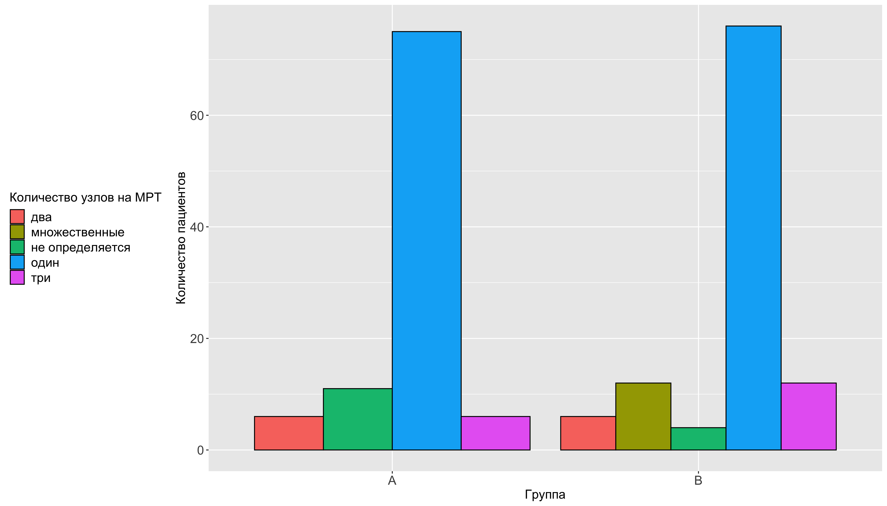

Рисунок №3.18.
Количество узлов на МРТ в группах А и B.

### 3.2.3 Гистологическая оценка

*Морфологическая структура*

В группе A гистологическое заключение инвазивный рак неспециального типа в 100% (12/12 случаев) [95% ДИ 0.7;1].
В группе B инвазивный рак неспециального типа в 67.57% (25/37 случаев) [95% ДИ 0.5;0.81] и протоковый рак in situ в 32.43% (12/37 случаев) [95% ДИ 0.19;0.5] (Таблица 3.19, Рисунок 3.19).

Таблица №3.19.
Морфологическая структура гистопрепаратов в группах А и B.

| Морфологическая структура          | Процентная доля       | 95% ДИ     | Процентная доля          | 95% ДИ        |
|---------------|---------------|---------------|---------------|---------------|
| Группы                             | Группа A              | ------     | Группа B                 | ------        |
| инвазивный рак неспециального типа | 100% (12/ 12 случаев) | [ 0.7; 1 ] | 67.568% (25/ 37 случаев) | [ 0.5; 0.81 ] |
| протоковый рак in situ             | 0% (0/ 12 случаев)    | [ 0; 0.3 ] | 32.432% (12/ 37 случаев) | [ 0.19; 0.5 ] |

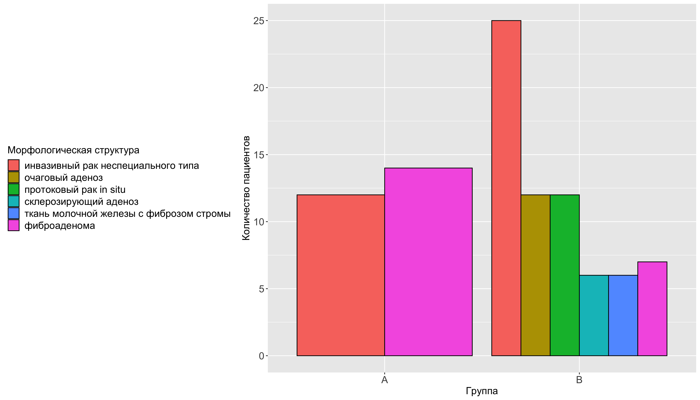

Рисунок №3.19.
Морфологическая структура гистопрепаратов в группах А и B.

*Цитологическое заключение*

Цитологическое заключение в группе A белковая субстанция, капли жира в 33.33% (6/18 случаев) [95% ДИ 0.14;0.59], фиброаденома в 33.33% (6/18 случаев) [95% ДИ 0.14;0.59] и цистаденопапиллома в 33.33% (6/18 случаев) [95% ДИ 0.14;0.59].
В группе B "интрадуктальная папиллома" в 100% (6/6 случаев) [95% ДИ 0.52;1] (Таблица 3.20, Рисунок 3.20).

Таблица №3.20.
Цитологическое исследование материалов в группах А и B.

| Цитологическое заключение       | Процентная доля         | 95% ДИ         | Процентная доля     | 95% ДИ      |
|---------------|---------------|---------------|---------------|---------------|
| Группы                          | Группа A                | ------         | Группа B            | ------      |
| белковая субстанция, капли жира | 33.333% (6/ 18 случаев) | [ 0.14; 0.59 ] | 0% (0/ 6 случаев)   | [ 0; 0.48 ] |
| интрадуктальная папиллома       | 0% (0/ 18 случаев)      | [ 0; 0.22 ]    | 100% (6/ 6 случаев) | [ 0.52; 1 ] |
| фиброаденома                    | 33.333% (6/ 18 случаев) | [ 0.14; 0.59 ] | 0% (0/ 6 случаев)   | [ 0; 0.48 ] |
| цистаденопапиллома              | 33.333% (6/ 18 случаев) | [ 0.14; 0.59 ] | 0% (0/ 6 случаев)   | [ 0; 0.48 ] |

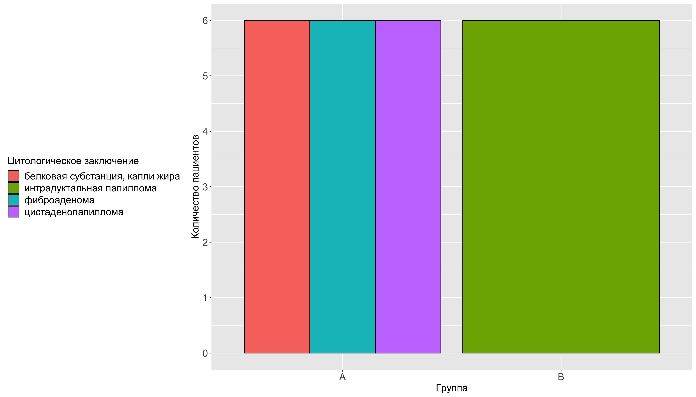

Рисунок №3.20.
Цитологическое исследование материалов в группах А и B.

*Рецепторы опухоли*

При оценке рецепторов опухоли в группе A ьыл обнаружен негатив в 100% (12/12 случаев) [95% ДИ 0.7;1].
В группе B Her-2_neu в 33.33% (6/18 случаев) [95% ДИ 0.14;0.59] и РЭ+РП в 66.67% (12/18 случаев) [95% ДИ 0.41;0.86] (Таблица 3.21, Рисунок 3.21).

Таблица №3.21.
Определение рецепторов опухоли в группах А и B.

| Рецепторы опухоли | Процентная доля       | 95% ДИ     | Процентная доля          | 95% ДИ         |
|---------------|---------------|---------------|---------------|---------------|
| Группы            | Группа A              | ------     | Группа B                 | ------         |
| Her-2_neu         | 0% (0/ 12 случаев)    | [ 0; 0.3 ] | 33.333% (6/ 18 случаев)  | [ 0.14; 0.59 ] |
| не проводилось    | 0% (0/ 12 случаев)    | [ 0; 0.3 ] | 0% (0/ 18 случаев)       | [ 0; 0.22 ]    |
| негатив           | 100% (12/ 12 случаев) | [ 0.7; 1 ] | 0% (0/ 18 случаев)       | [ 0; 0.22 ]    |
| РЭ+РП             | 0% (0/ 12 случаев)    | [ 0; 0.3 ] | 66.667% (12/ 18 случаев) | [ 0.41; 0.86 ] |

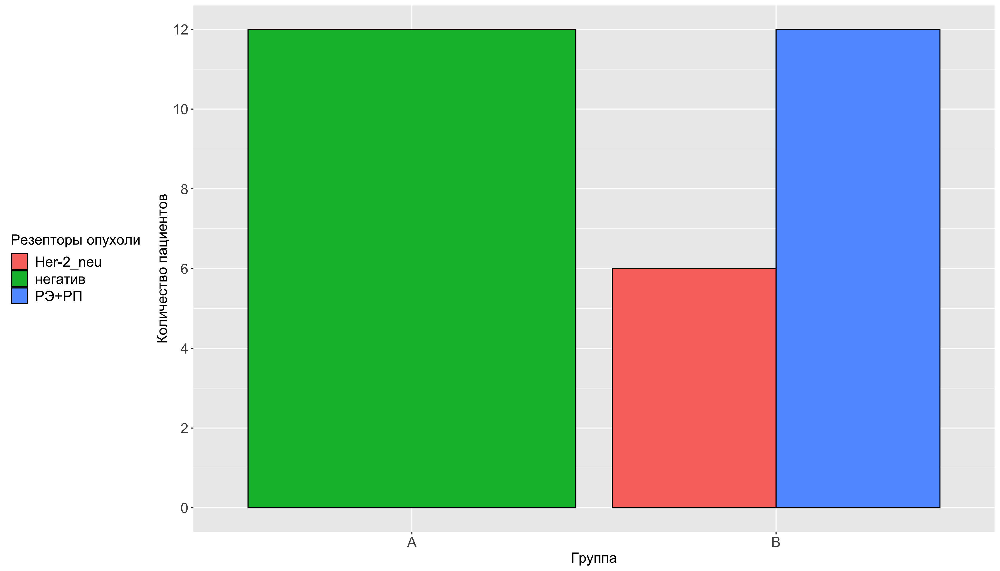

Рисунок №3.21.
Определение рецепторов опухоли в группах А и B.

*Гистологическое поддтверждение злокачественного новообразования*

Гистологически обнаружено злокачественное образование в группе A в 1.52% (12/787 случаев) [95% ДИ 0.01;0.03].
В группе B в 5.11% (37/724 случаев) [95% ДИ 0.04;0.07] (Таблица 3.22, Рисунок 3.22).

Таблица №3.22.
Гистологическое поддтверждение злокачественного оразования в группах А и B.

| Гистологически обнаружено злокачественное образование | Процентная доля            | 95% ДИ         | Процентная доля           | 95% ДИ         |
|---------------|---------------|---------------|---------------|---------------|
| Группы                                                | Группа A                   | ------         | Группа B                  | ------         |
| Да                                                    | 1.525% (12/ 787 случаев)   | [ 0.01; 0.03 ] | 5.11% (37/ 724 случаев)   | [ 0.04; 0.07 ] |
| Нет                                                   | 98.475% (775/ 787 случаев) | [ 0.97; 0.99 ] | 94.89% (687/ 724 случаев) | [ 0.93; 0.96 ] |

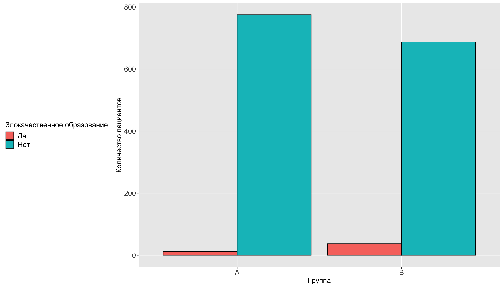

Рисунок №3.22.
Гистологическое поддтверждение злокачественного оразования в группах А и B.

*Определение злокачественности новообразования*

В группе A уровень злокачественности был II (умеренная 6-7 балов) в 50% (6/12 случаев) [95% ДИ 0.25;0.75] и III(высокая 8-9 бал) в 50% (6/12 случаев) [95% ДИ 0.25;0.75].
В группе B II (умеренная 6-7 балов) в 51.35% (19/37 случаев) [95% ДИ 0.35;0.68] и III(высокая 8-9 бал) в 48.65% (18/37 случаев) [95% ДИ 0.32;0.65].
не проводилось в 0% (0/37 случаев) [95% ДИ 0;0.12] (Таблица 3.23, Рисунок 3.23).

Таблица №3.23.
Определение злокачественности новообразования в группах А и B.

| Уровень злокачественности | Процентная доля     | 95% ДИ         | Процентная доля          | 95% ДИ         |
|---------------|---------------|---------------|---------------|---------------|
| Группы                    | Группа A            | ------         | Группа B                 | ------         |
| II (умеренная 6-7 балов)  | 50% (6/ 12 случаев) | [ 0.25; 0.75 ] | 51.351% (19/ 37 случаев) | [ 0.35; 0.68 ] |
| III(высокая 8-9 бал)      | 50% (6/ 12 случаев) | [ 0.25; 0.75 ] | 48.649% (18/ 37 случаев) | [ 0.32; 0.65 ] |
| не проводилось            | 0% (0/ 12 случаев)  | [ 0; 0.3 ]     | 0% (0/ 37 случаев)       | [ 0; 0.12 ]    |

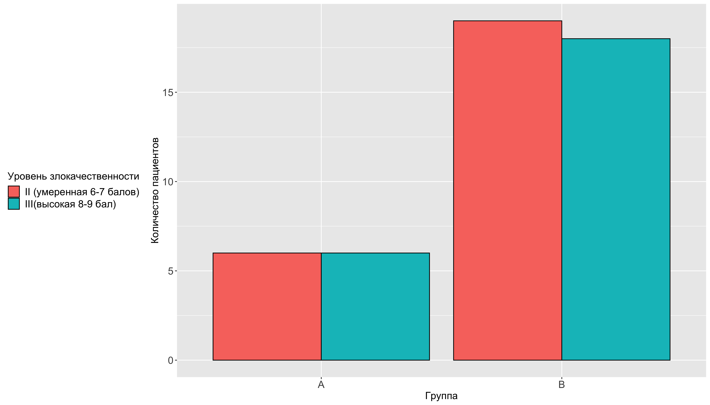

Рисунок №3.23.
Определение злокачественности новообразования в группах А и B.

## 3.3 Определение чувствительности, спецефичности и точности методов

При оценке УЗИ в группе А количество истинно верно определенных образований как доброкачественные было 769 , количество верно определённых образований как злокачественные было 9 , количество неверно определенных образований как злокачественные было 3 и количество неопределенных злокачественных образований как злокачественные было 6 .
Точность метода составила 0.99 [95% ДИ: 0.98 , 0.99 ].
P-Value модели составил 0.24 что означает, что модель отличается от точности нулевой гипотезы.
Коэфициент Kappa составил 0.66 показывает, что метод не имеет существенно отличную от контрольного метода частоту верно определенных результатов (количество истинно положительных и отрицательных результатов).
Тест Макнемара составил 0.5 показывает, что метод не имеет существенно отличную от контрольного метода частоту ошибок (количество ложноположительных и ложноотрицательных результатов).
Чувствительность метода составила 0.75 .
Специфичность метода составила 0.99 .
Доля положительных прогнозов составила 0.6 .
Доля отрицательных прогнозов составила 1 .
Доля истинно положительных случаев в наборе данных составила 0.02 .
Доля истинно положительных случаев, правильно определённых методом составила 0.01 .
Отбалансированная точность метода составила 0.87 (Таблица №3.24).

При оценке УЗИ в группе B количество истинно верно определенных образований как злокачественные было 673 , количество верно определённых образований как доброкачественные было 33 , количество неверно определенных образований как злокачественные было 4 и количество неопределенных злокачественных образований как злокачественные было 14 .
Точность метода составила 0.98 [95% ДИ: 0.96 , 0.99 ].
P-Value модели составил 0 что означает, что модель отличается от точности нулевой гипотезы.
Коэфициент Kappa составил 0.77 показывает, что метод не имеет существенно отличную от контрольного метода частоту верно определенных результатов (количество истинно положительных и отрицательных результатов).
Тест Макнемара составил 0.03 показывает, что метод не имеет существенно отличную от контрольного метода частоту ошибок (количество ложноположительных и ложноотрицательных результатов).
Чувствительность метода составила 0.89 .
Специфичность метода составила 0.98 .
Доля положительных прогнозов составила 0.7 .
Доля отрицательных прогнозов составила 0.99 .
Доля истинно положительных случаев в наборе данных составила 0.05 .
Доля истинно положительных случаев, правильно определённых методом составила 0.05 .
Отбалансированная точность метода составила 0.94 (Таблица №3.24).

При оценке ABUS в группе B количество истинно верно определенных образований как злокачественные было 678 , количество верно определённых образований как доброкачественные было 35 , количество неверно определенных образований как злокачественные было 2 и количество неопределенных злокачественных образований как злокачественные было 9 .
Точность метода составила 0.98 [95% ДИ: 0.97, 0.99 ].
P-Value модели составил 0 что означает, что модель отличается от точности нулевой гипотезы.
Коэфициент Kappa составил 0.86 показывает, что метод не имеет существенно отличную от контрольного метода частоту верно определенных результатов (количество истинно положительных и отрицательных результатов).
Тест Макнемара составил 0.07 показывает, что метод не имеет существенно отличную от контрольного метода частоту ошибок (количество ложноположительных и ложноотрицательных результатов).
Чувствительность метода составила 0.95 .
Специфичность метода составила 0.99 .
Доля положительных прогнозов составила 0.8 .
Доля отрицательных прогнозов составила 1 .
Доля истинно положительных случаев в наборе данных составила 0.05 .
Доля истинно положительных случаев, правильно определённых методом составила 0.05 .
Отбалансированная точность метода составила 0.97 (Таблица №3.24).

При оценке УЗИ в выборке пациенток до 40 лет количество истинно верно определенных образований как злокачественные было 1442 , количество верно определённых образований как доброкачественные было 42 , количество неверно определенных образований как злокачественные было 7 и количество неопределенных злокачественных образований как злокачественные было 20 .
Точность метода составила 0.98 [95% ДИ: 0.97 , 0.99 ].
P-Value модели составил 0 что означает, что модель отличается от точности нулевой гипотезы.
Коэфициент Kappa составил 0.75 показывает, что метод не имеет существенно отличную от контрольного метода частоту верно определенных результатов (количество истинно положительных и отрицательных результатов).
Тест Макнемара составил 0.02 показывает, что метод не имеет существенно отличную от контрольного метода частоту ошибок (количество ложноположительных и ложноотрицательных результатов).
Чувствительность метода составила 0.86 .
Специфичность метода составила 0.99 .
Доля положительных прогнозов составила 0.68 .
Доля отрицательных прогнозов составила 1 .
Доля истинно положительных случаев в наборе данных составила 0.03 .
Доля истинно положительных случаев, правильно определённых методом составила 0.03 .
Отбалансированная точность метода составила 0.92 (Таблица №3.24).

| Метод                             | Т                            | P    | КК   | ТМ   | Ч    | Сп   | ОТ   |
|---------|---------|---------|---------|---------|---------|---------|---------|
| УЗИ в группе А                    | 0.99 [95% ДИ: 0.98 , 1 ].    | 0.01 | 0.8  | 1    | 0.8  | 1    | 0.9  |
| УЗИ в группе B                    | 0.98 [95% ДИ: 0.96 , 0.99 ]. | 0    | 0.77 | 0.03 | 0.89 | 0.98 | 0.94 |
| УЗИ в выборке пациенток до 40 лет | 0.98 [95% ДИ: 0.97 , 0.99 ]. | 0    | 0.75 | 0.02 | 0.86 | 0.99 | 0.92 |
| ABUS в группе B                   | 0.98 [95% ДИ: 0.97 , 0.99 ]. | 0    | 0.86 | 0.07 | 0.95 | 0.99 | 0.97 |

Таблица №3.24.
Определение точности, P-уровня значимости модели, коэфициент Kappa, Тест Макнемара, чувствительности, специфичности и отбалансированной точности в группах А и B (Т -Точность, P - P-Value, КК - Коэффициент Kappa, ТМ -Тест Макнемара, Ч-Чувствительность, Сп -Специфичность, ОТ- Отбалансированная точность).

## 3.4 Прогностическая оценка методов

На основании полученных данных, пыла построена предсказательная модель изучаемых методов.
ROC-кривая предсказательной модели для метода УЗИ, по данным полученным в группе A представлена на рисунке № 3.24.
Площадь под кривой (AUC- area under cruve) составила: 0.935 95% ДИ: 0.869 - 1

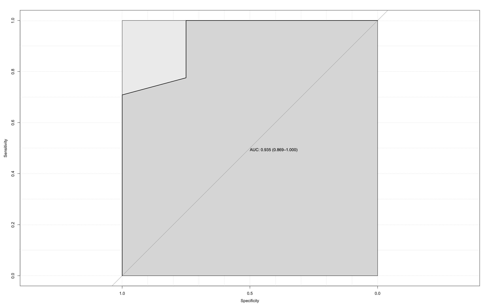

Рисунок №3.24.
ROC-кривая предсказательной модели для метода УЗИ, по данным полученным в группе A.
ROC-кривая предсказательной модели для метода УЗИ, по данным полученным в группе B представлена на рисунке № 3.25.
Площадь под кривой (AUC- area under cruve) составила: 0.903 95% ДИ: 0.82 - 0.986

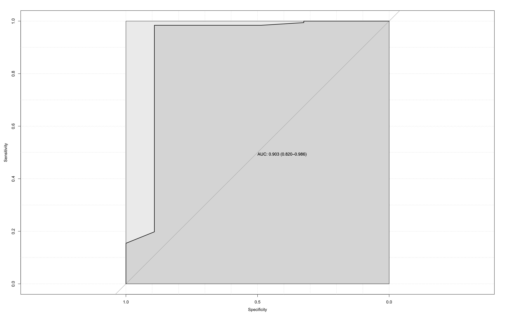

Рисунок №3.25.
ROC-кривая предсказательной модели для метода УЗИ, по данным полученным в группе B.
ROC-кривая предсказательной модели для метода ABUS, по данным полученным в группе B представлена на рисунке № 3.26.
Площадь под кривой (AUC- area under cruve) составила: 0.968 95% ДИ: 0.925 - 1


Рисунок №3.26.
ROC-кривая предсказательной модели для метода ABUS, по данным полученным в группе B.
ROC-кривая предсказательной модели для метода УЗИ, по данным полученным в выборке пациенток до 40 лет представлена на рисунке № 3.27.
Площадь под кривой (AUC- area under cruve) составила: 0.911 95% ДИ: 0.845 - 0.978


Рисунок №3.27.
ROC-кривая предсказательной модели для метода УЗИ, по данным полученным в выборке пациенток до 40 лет.

Таблица №3.25.
Определение площади под кривой представленных предсказательных моделей метода в группах А и B.

| Метод                             | Площадь под кривой          |
|-----------------------------------|-----------------------------|
| УЗИ в группе A                    | 0.935 95% ДИ: 0.869 - 1     |
| УЗИ в группе B                    | 0.903 95% ДИ: 0.82 - 0.986  |
| УЗИ в выборке пациенток до 40 лет | 0.911 95% ДИ: 0.845 - 0.978 |
| ABUS в группе B                   | 0.968 95% ДИ: 0.925 - 1     |

## 3.5 Клинические примеры

## 3.6 Заключение
