```{r setup, include=FALSE}
knitr::opts_chunk$set(echo = TRUE)
```

# ГЛАВА 4. Диагностическая эффективность автоматизированного УЗИ всей молочной железы при раке молочной железы у пациенток 40 лет и старше.

## 4.1 Общее Описание результатов исследования УЗИ в выборке 40 лет и старше

### 4.1.1 Результаты ручного УЗИ исследования

Всего в исследование вошло 1283 пациентов.

*Кожа*

Кожа была не изменена в 99.45% (1276/1283случаев)[95% ДИ 0.99;1] и утолщена в 0.55% (7/1283случаев)[95% ДИ 0;0.01].

*Протоки*

Протоки были не расширены в 98.91% (1269/1283случаев)[95% ДИ 0.98;0.99] и расширены в 1.09% (14/1283случаев)[95% ДИ 0.01;0.02].

*Фон*

Фоном была железистая ткань в 55.88% (717/1283случаев)[95% ДИ 0.53;0.59], фиброзно-кистозная мастопатия в 44.12% (566/1283случаев)[95% ДИ 0.41;0.47]. Был найден узел в 28.06% (360/1283случаев)[95% ДИ 0.26;0.31].

*Локализация образования*

Локализация образования: верхне-внутренний квадрант в 15.56% (56/360случаев)[95% ДИ 0.12;0.2], верхне-наружный квадрант в 41.94% (151/360случаев)[95% ДИ 0.37;0.47], граница в 7.78% (28/360случаев)[95% ДИ 0.05;0.11], граница верхних квадрантов в 6.94% (25/360случаев)[95% ДИ 0.05;0.1], граница внутренних квадрантов в 0% (0/360случаев)[95% ДИ 0;0.01], граница наружных квадрантов в 6.94% (25/360случаев)[95% ДИ 0.05;0.1], граница нижних квадрантов в 2.22% (8/360случаев)[95% ДИ 0.01;0.05], нижне-внутренний квадрант в 5.28% (19/360случаев)[95% ДИ 0.03;0.08], нижне-наружный квадрант в 10.56% (38/360случаев)[95% ДИ 0.08;0.14] и центральный отдел в 2.78% (10/360случаев)[95% ДИ 0.01;0.05].

*Форма образования*

Форма образования в 44.72% (161/360случаев)[95% ДИ 0.4;0.5], овальная в 44.72% (161/360случаев)[95% ДИ 0.4;0.5], округлая в 4.72% (17/360случаев)[95% ДИ 0.03;0.08] и участок нарушения архитектоники в 5.83% (21/360случаев)[95% ДИ 0.04;0.09]. Размер узла был в диапазоне 0,5-1,0 см в 30.83% (111/360случаев)[95% ДИ 0.26;0.36], 1,1-1,5 см в 25.56% (92/360случаев)[95% ДИ 0.21;0.3], 1,5-2,0 см в 24.44% (88/360случаев)[95% ДИ 0.2;0.29], 2,1-2,5 см в 7.22% (26/360случаев)[95% ДИ 0.05;0.11], 2,5-3,0 см в 11.11% (40/360случаев)[95% ДИ 0.08;0.15] и более 3 см в 0.83% (3/360случаев)[95% ДИ 0;0.03].

*Контуры узлов*

Контуры узлов были волнистые в 9.72% (35/360случаев)[95% ДИ 0.07;0.13], звездчатые в 11.39% (41/360случаев)[95% ДИ 0.08;0.15], неровные в 33.06% (119/360случаев)[95% ДИ 0.28;0.38] и ровные в 45.83% (165/360случаев)[95% ДИ 0.41;0.51].

*Эхогенность*

По эхогенности образование анэхогенное в 0.83% (3/360случаев)[95% ДИ 0;0.03], гиперэхогенное в 1.11% (4/360случаев)[95% ДИ 0;0.03], гипоэхогенное в 93.89% (338/360случаев)[95% ДИ 0.91;0.96], изоэхогенное в 1.11% (4/360случаев)[95% ДИ 0;0.03] и смешанная эхогенность в 3.06% (11/360случаев)[95% ДИ 0.02;0.06].

*Структура узла*

Структура узла была неоднородная в 56.11% (202/360случаев)[95% ДИ 0.51;0.61], однородная в 43.06% (155/360случаев)[95% ДИ 0.38;0.48] и с жидкостным содержимым в 0.83% (3/360случаев)[95% ДИ 0;0.03].

*Кровоток в образовании*

Кровоток в образовании был интранодулярный в 40.28% (145/360случаев)[95% ДИ 0.35;0.46], не определяется в 24.17% (87/360случаев)[95% ДИ 0.2;0.29], определяются внутри в 1.11% (4/360случаев)[95% ДИ 0;0.03], перинодулярный в 2.22% (8/360случаев)[95% ДИ 0.01;0.05], по периферии в 26.67% (96/360случаев)[95% ДИ 0.22;0.32] и смешанный в 5.56% (20/360случаев)[95% ДИ 0.04;0.09].

*Количество узлов*

Один узел был обнаружен в 80.83% (291/360случаев)[95% ДИ 0.76;0.85], два в 15.28% (55/360случаев)[95% ДИ 0.12;0.2], три в 1.94% (7/360случаев)[95% ДИ 0.01;0.04] и множественные узлы в 1.94% (7/360случаев)[95% ДИ 0.01;0.04].

*Эластотип*

Был устанвлен 0 эластотип в 73.5% (943/1283случаев)[95% ДИ 0.71;0.76], 1 эластотип в 0.47% (6/1283случаев)[95% ДИ 0;0.01], 2 эластотип в 0.31% (4/1283случаев)[95% ДИ 0;0.01], 3 эластотип в 13.33% (171/1283случаев)[95% ДИ 0.12;0.15], 4 эластотип в 5.3% (68/1283случаев)[95% ДИ 0.04;0.07] и нет данных в 7.09% (91/1283случаев)[95% ДИ 0.06;0.09].

*Регионарные лимфоузлы*

Регионарные лимфоузлы не изменены в 96.8% (1242/1283случаев)[95% ДИ 0.96;0.98]. Увеличение регионарных лимфоузлов было в левой подключичной области в 0.47% (6/1283случаев)[95% ДИ 0;0.01], левой подмышечной области в 0.31% (4/1283случаев)[95% ДИ 0;0.01], правой надключичной области в 1.64% (21/1283случаев)[95% ДИ 0.01;0.03] и правой подмышечной области в 0.78% (10/1283случаев)[95% ДИ 0;0.01].

*УЗ диагноз*

Был поставлен диагноз "без патологии" в 2.81% (36/1283случаев)[95% ДИ 0.02;0.04], "внутрипротоковая папиллома молочной железы" в 0.47% (6/1283случаев)[95% ДИ 0;0.01], "диффузный фиброаденоматоз" в 22.06% (283/1283случаев)[95% ДИ 0.2;0.24], "интрамаммарный лимфатический узел" в 0.23% (3/1283случаев)[95% ДИ 0;0.01], "киста" в 1.33% (17/1283случаев)[95% ДИ 0.01;0.02], "кисты" в 0.62% (8/1283случаев)[95% ДИ 0;0.01], "липома" в 0.31% (4/1283случаев)[95% ДИ 0;0.01], "локализованный фиброаденоматоз" в 1.48% (19/1283случаев)[95% ДИ 0.01;0.02], "мультицентричный рак" в 2.65% (34/1283случаев)[95% ДИ 0.02;0.04], "мультфококальный рак" в 0.55% (7/1283случаев)[95% ДИ 0;0.01], "образование Ca" в 11.93% (153/1283случаев)[95% ДИ 0.1;0.14], "сложная киста" в 1.09% (14/1283случаев)[95% ДИ 0.01;0.02], "фиброаденома единичная" в 8.42% (108/1283случаев)[95% ДИ 0.07;0.1], "фиброаденомы множествненные" в 2.96% (38/1283случаев)[95% ДИ 0.02;0.04], "фиброзно-кистозная мастопатия" в 42.87% (550/1283случаев)[95% ДИ 0.4;0.46] и"цистаденопапиллома" в 0.23% (3/1283случаев)[95% ДИ 0;0.01]. Был поставлен диагноз рак в 15.12% (194/1283случаев)[95% ДИ 0.13;0.17].

*Категория Birads*

Была установлена категория Birads 1 в 2.26% (29/1283случаев)[95% ДИ 0.02;0.03], Birads 2 в 75.37% (967/1283случаев)[95% ДИ 0.73;0.78], Birads 3 в 7.56% (97/1283случаев)[95% ДИ 0.06;0.09], Birads 4b в 2.88% (37/1283случаев)[95% ДИ 0.02;0.04], Birads 4c в 2.18% (28/1283случаев)[95% ДИ 0.01;0.03], Birads 4а в 4.05% (52/1283случаев)[95% ДИ 0.03;0.05] и Birads 5 в 5.69% (73/1283случаев)[95% ДИ 0.05;0.07].

*Кальцинаты*

Найдены кальцинаты в 47.22% (51/108случаев)[95% ДИ 0.38;0.57], макрокальцинаты в 13.89% (15/108случаев)[95% ДИ 0.08;0.22] и микрокальцинаты в 38.89% (42/108случаев)[95% ДИ 0.3;0.49].

### 4.1.2 Маммография

Кожа не изменена в 98.13% (1259/1283случаев)[95% ДИ 0.97;0.99], диффузное утолщение в 0.47% (6/1283случаев)[95% ДИ 0;0.01] и локальное утолщение в 0.55% (7/1283случаев)[95% ДИ 0;0.01]. Ареола не изменена в 99.45% (1276/1283случаев)[95% ДИ 0.99;1], деформирована в 0.31% (4/1283случаев)[95% ДИ 0;0.01] и подтянута в 0.23% (3/1283случаев)[95% ДИ 0;0.01]. Сосок не изменен в 97.82% (1259/1283случаев)[95% ДИ 0.97;0.99], втянут в 1.56% (20/1283случаев)[95% ДИ 0.01;0.02] и отечен в 0.31% (4/1283случаев)[95% ДИ 0;0.01]. Фоном была железистая ткань в 58.53% (751/1283случаев)[95% ДИ 0.56;0.61], диффузная фибрознокистозная мастопатия в 39.98% (513/1283случаев)[95% ДИ 0.37;0.43], инволюция в 0.23% (3/1283случаев)[95% ДИ 0;0.01], нормальная ткань МЖ в 0.94% (12/1283случаев)[95% ДИ 0.01;0.02] и узловая мастопатия в 0.31% (4/1283случаев)[95% ДИ 0;0.01]. Было найдено образование в 15.43% (198/1283случаев)[95% ДИ 0.14;0.18].

*Характеристика узлов*

Обнаруженный узел был ровный в 35.35% (70/198случаев)[95% ДИ 0.29;0.42], неровный в 18.18% (36/198случаев)[95% ДИ 0.13;0.24], фокус уплотнения в 16.16% (32/198случаев)[95% ДИ 0.11;0.22], волнистый в 5.56% (11/198случаев)[95% ДИ 0.03;0.1], дольчатый в 1.52% (3/198случаев)[95% ДИ 0;0.05], лучистый в 16.67% (33/198случаев)[95% ДИ 0.12;0.23], образование в 1.52% (3/198случаев)[95% ДИ 0;0.05], участок нарушения архитектоники в 1.52% (3/198случаев)[95% ДИ 0;0.05] и участок уплотнения в 3.54% (7/198случаев)[95% ДИ 0.02;0.07]. Контур узлов был нечеткий в 52.53% (104/198случаев)[95% ДИ 0.45;0.6], четкий в 34.85% (69/198случаев)[95% ДИ 0.28;0.42], полициклический в 8.59% (17/198случаев)[95% ДИ 0.05;0.14] и размытый в 4.04% (8/198случаев)[95% ДИ 0.02;0.08].

*Размер узлов*

Размер узлов был в пределах 0,5-1,0 в 20.71% (41/198случаев)[95% ДИ 0.15;0.27], 1,1-1,5см в 25.76% (51/198случаев)[95% ДИ 0.2;0.33], 1,6-2,0см в 27.27% (54/198случаев)[95% ДИ 0.21;0.34], 2,1-2,5см в 6.06% (12/198случаев)[95% ДИ 0.03;0.11], 2,6-3,0см в 11.62% (23/198случаев)[95% ДИ 0.08;0.17] и более 3 см в 8.59% (17/198случаев)[95% ДИ 0.05;0.14].

*Количество узлов*

Один узел был обнаружен в 96.97% (192/198случаев)[95% ДИ 0.93;0.99], два в 1.52% (3/198случаев)[95% ДИ 0;0.05] и множественные в 1.52% (3/198случаев)[95% ДИ 0;0.05].

*Количество визуализыруемых образований*

Количество визуализыруемых образований было одно в 81.82% (162/198случаев)[95% ДИ 0.76;0.87], два в 2.02% (4/198случаев)[95% ДИ 0.01;0.05], четыре в 1.52% (3/198случаев)[95% ДИ 0;0.05] и участок асимметрии в 14.65% (29/198случаев)[95% ДИ 0.1;0.21]. Подмышечные лимфоузлы не визуализировались в 85.5% (1097/1283случаев)[95% ДИ 0.83;0.87], метастатически изменены в 0.7% (9/1283случаев)[95% ДИ 0;0.01], не увеличены в 13.56% (174/1283случаев)[95% ДИ 0.12;0.16] и были увеличены, жировая инволюция в 0.23% (3/1283случаев)[95% ДИ 0;0.01].

*Кальцификаты*

Кальцификаты были диффузные в 5.61% (12/214случаев)[95% ДИ 0.03;0.1], единичные мелкие в 49.53% (106/214случаев)[95% ДИ 0.43;0.56], крупные в 3.74% (8/214случаев)[95% ДИ 0.02;0.08], микрокальцинаты в 1.4% (3/214случаев)[95% ДИ 0;0.04], множественные точечные в 1.4% (3/214случаев)[95% ДИ 0;0.04], плеоморфные в 5.14% (11/214случаев)[95% ДИ 0.03;0.09], по типу пудры в 1.4% (3/214случаев)[95% ДИ 0;0.04], полиморфные в 16.36% (35/214случаев)[95% ДИ 0.12;0.22], разнокалиберные в 3.74% (8/214случаев)[95% ДИ 0.02;0.08] и сгруппированные в 11.68% (25/214случаев)[95% ДИ 0.08;0.17].

*Категория Birads*

Была поставлена категория Birads 0 в 0.62% (8/1283случаев)[95% ДИ 0;0.01], Birads 1 в 2.34% (30/1283случаев)[95% ДИ 0.02;0.03], Birads 2 в 84.57% (1096/1283случаев)[95% ДИ 0.82;0.86], Birads 3 в 3.74% (48/1283случаев)[95% ДИ 0.03;0.05], Birads 4b в 1.87% (24/1283случаев)[95% ДИ 0.01;0.03], Birads 4c в 1.71% (22/1283случаев)[95% ДИ 0.01;0.03], Birads 4а в 3.04% (39/1283случаев)[95% ДИ 0.02;0.04] и Birads 5 в 1.4% (18/1283случаев)[95% ДИ 0.01;0.02].

*Заключение ММГ*

Заключение по ММГ было "Susp Ca" в 8.03% (103/1283случаев)[95% ДИ 0.07;0.1], "без патологии" в 0.62% (8/1283случаев)[95% ДИ 0;0.01], "дифузный фиброаденоматоз" в 82.39% (1057/1283случаев)[95% ДИ 0.8;0.84], "интраммарные лимфоузлы"в 0.78% (10/1283случаев)[95% ДИ 0;0.01], "киста" в 1.09% (14/1283случаев)[95% ДИ 0.01;0.02], "кластер кальцинатов" в 0.86% (11/1283случаев)[95% ДИ 0;0.02], "локализованный фиброаденоматоз" в 2.57% (33/1283случаев)[95% ДИ 0.02;0.04], "образование" в 0.23% (3/1283случаев)[95% ДИ 0;0.01] и "фиброаденома" в 3.43% (44/1283случаев)[95% ДИ 0.03;0.05]. Поставлен рак по ММГ в 8.03% (103/1283случаев)[95% ДИ 0.07;0.1].

### 4.1.3 Автоматизированное объемное УЗИ сканирование молочных желез (ABUS)

В выборке 40 лет и старше был выполнен ABUS в 51.05% (655/1283случаев)[95% ДИ 0.48;0.54]. Кожа была не изменена в 99.39% (651/655случаев)[95% ДИ 0.98;1] и утолщена в 0.61% (4/655случаев)[95% ДИ 0;0.02]. Симптом ретракции был в 19.39% (127/655случаев)[95% ДИ 0.16;0.23]. Было найдено образование в 37.86% (248/655случаев)[95% ДИ 0.34;0.42].

*Размеры узлов*

Размеры узлов были в пределах 0,5-1,0 см в 27.02% (67/248случаев)[95% ДИ 0.22;0.33], 1,1-1,5 см в 30.65% (76/248случаев)[95% ДИ 0.25;0.37], 1,5-2,0 см в 22.58% (56/248случаев)[95% ДИ 0.18;0.28], 2,1-2,5 см в 6.45% (16/248случаев)[95% ДИ 0.04;0.1], 2,5-3,0 см в 12.1% (30/248случаев)[95% ДИ 0.08;0.17] и более 3 см в 1.21% (3/248случаев)[95% ДИ 0;0.04].

*Контуры узлов*

Контуры узлов были неровные в 46.77% (116/248случаев)[95% ДИ 0.4;0.53], ровные в 31.45% (78/248случаев)[95% ДИ 0.26;0.38], волнистые в 5.65% (14/248случаев)[95% ДИ 0.03;0.09], нарушение архитектоники в 6.05% (15/248случаев)[95% ДИ 0.04;0.1], нечеткие в 7.26% (18/248случаев)[95% ДИ 0.04;0.11] и полициклические в 2.82% (7/248случаев)[95% ДИ 0.01;0.06]. Образование было гипоэхогенное в 95.56% (237/248случаев)[95% ДИ 0.92;0.98], смешанной эхогенности в 3.23% (8/248случаев)[95% ДИ 0.02;0.06] и анэхогенное в 1.21% (3/248случаев)[95% ДИ 0;0.04].

*Структура узлов*

Структура узлов была неоднородная в 56.05% (139/248случаев)[95% ДИ 0.5;0.62], однородная в 41.13% (102/248случаев)[95% ДИ 0.35;0.48], наличие внутрикистозных пристеночных разрастаний в 1.61% (4/248случаев)[95% ДИ 0.01;0.04] и с кальцинатами в 1.21% (3/248случаев)[95% ДИ 0;0.04]. Один узел был определен в 83.87% (208/248случаев)[95% ДИ 0.79;0.88], два в 9.27% (23/248случаев)[95% ДИ 0.06;0.14], три в 2.82% (7/248случаев)[95% ДИ 0.01;0.06] и множественные в 4.03% (10/248случаев)[95% ДИ 0.02;0.08].

*Категория Birads*

Была установлена категория Birads 1 в 3.05% (20/655случаев)[95% ДИ 0.02;0.05], Birads 2 в 67.48% (442/655случаев)[95% ДИ 0.64;0.71], Birads 3 в 7.18% (47/655случаев)[95% ДИ 0.05;0.09], Birads 4b в 3.51% (23/655случаев)[95% ДИ 0.02;0.05], Birads 4c в 2.14% (14/655случаев)[95% ДИ 0.01;0.04], Birads 4а в 3.66% (24/655случаев)[95% ДИ 0.02;0.05] и Birads 5 в 12.98% (85/655случаев)[95% ДИ 0.11;0.16].

*Диагноз*

Был поставлен диагноз "без патологии" в 5.34% (35/655случаев)[95% ДИ 0.04;0.07], "диффузный фиброаденоматоз" в 18.63% (122/655случаев)[95% ДИ 0.16;0.22], "киста" в 1.53% (10/655случаев)[95% ДИ 0.01;0.03], "кисты" в 2.9% (19/655случаев)[95% ДИ 0.02;0.05], "локализованный фиброаденоматоз" в 0.61% (4/655случаев)[95% ДИ 0;0.02], "мультифокальный рак" в 1.07% (7/655случаев)[95% ДИ 0;0.02], "мультицентричный рак" в 1.07% (7/655случаев)[95% ДИ 0;0.02], "образование Ca" в 17.56% (115/655случаев)[95% ДИ 0.15;0.21], "склерозирующий аденоз" в 2.14% (14/655случаев)[95% ДИ 0.01;0.04], "фиброаденома единичная" в 11.15% (73/655случаев)[95% ДИ 0.09;0.14], "фиброаденомы множествненные" в 2.29% (15/655случаев)[95% ДИ 0.01;0.04] и "фиброзно-кистозная мастопатия" в 35.73% (234/655случаев)[95% ДИ 0.32;0.4]. Был поставлен диагноз рак в 19.69% (129/655случаев)[95% ДИ 0.17;0.23].

*Кальцинаты*

Кальцинаты не определяются в 87.79% (575/655случаев)[95% ДИ 0.85;0.9], макрокальцинаты в 1.83% (12/655случаев)[95% ДИ 0.01;0.03] и микрокальцинаты в 5.19% (34/655случаев)[95% ДИ 0.04;0.07].

### 4.1.4 Результаты МРТ исследования

В выборке 40 лет и старше был выполнена МРТ в 7.56% (97/1283случаев)[95% ДИ 0.06;0.09]. При выполнении МРТ были интраммарные лимфоузлы в 59.79% (58/97случаев)[95% ДИ 0.49;0.69] и сегментарно-протоковая зона контрастирования в 40.21% (39/97случаев)[95% ДИ 0.31;0.51].

Один узел был в 76.29% (74/97случаев)[95% ДИ 0.66;0.84], два в 13.4% (13/97случаев)[95% ДИ 0.08;0.22], три в 1.03% (1/97случаев)[95% ДИ 0;0.06], множественные в 3.09% (3/97случаев)[95% ДИ 0.01;0.09] и не определены в 6.19% (6/97случаев)[95% ДИ 0.03;0.14].

### 4.1.5 Результаты гистологического исследования

*Морфологическая оценка*

В выборке 40 лет и старше был проводилась пункция и морфологическая оценка в 18% (231/1283случаев)[95% ДИ 0.16;0.2].

*Морфологическая структура*

Была морфологическая структура инвазивный дольковый рак в 3.46% (8/231случаев)[95% ДИ 0.02;0.07], инвазивный рак неспециального типа в 59.31% (137/231случаев)[95% ДИ 0.53;0.66], интраканаликулярная фиброаденома в 1.73% (4/231случаев)[95% ДИ 0.01;0.05], очаговый аденоз в 1.3% (3/231случаев)[95% ДИ 0;0.04], протоковый рак in situ в 12.12% (28/231случаев)[95% ДИ 0.08;0.17], склерозирующий аденоз в 1.73% (4/231случаев)[95% ДИ 0.01;0.05], ткань молочной железы с фиброзом стромы в 4.76% (11/231случаев)[95% ДИ 0.03;0.09], фиброаденома в 11.26% (26/231случаев)[95% ДИ 0.08;0.16], фиброаденома с гиперплазией флоридного типа в 1.3% (3/231случаев)[95% ДИ 0;0.04] и фиброз стромы с гиалинозом в 3.03% (7/231случаев)[95% ДИ 0.01;0.06]. Гистологически поставлен рак в 13.48% (173/1283случаев)[95% ДИ 0.12;0.16].

*Цитологическая оценка*

Цитологическая оценка проводилась в 1.56% (20/1283случаев)[95% ДИ 0.01;0.02]. Было заключение интрадуктальная папиллома в 15% (3/20случаев)[95% ДИ 0.04;0.39], фиброзно-кистозный характер изменений в 30% (6/20случаев)[95% ДИ 0.13;0.54], фиброзно-кистозные изменения в 20% (4/20случаев)[95% ДИ 0.07;0.44] и цистаденопапиллома в 35% (7/20случаев)[95% ДИ 0.16;0.59].

*Уровень злокачественности*

Был определен уровень злокачественности I (низкая 3-5 бал) в 14.85% (15/101случаев)[95% ДИ 0.09;0.24], II (умеренная 6-7 балов) в 61.39% (62/101случаев)[95% ДИ 0.51;0.71] и III(высокая 8-9 бал) в 23.76% (24/101случаев)[95% ДИ 0.16;0.33].

*Рецепторы опухоли*

Проводилась оценка оценка рецепторов опухоли в 7.64% (98/1283случаев)[95% ДИ 0.06;0.09]. Были определены рецеторы Her-2_neu в 3.06% (3/98случаев)[95% ДИ 0.01;0.09], негатив в 8.16% (8/98случаев)[95% ДИ 0.04;0.16], РП в 3.06% (3/98случаев)[95% ДИ 0.01;0.09], РЭ в 6.12% (6/98случаев)[95% ДИ 0.03;0.13], РЭ+РП в 52.04% (51/98случаев)[95% ДИ 0.42;0.62], РЭ+РП+Her-2_neu в 3.06% (3/98случаев)[95% ДИ 0.01;0.09] и РЭ+РП+Her-2_neu негатив в 24.49% (24/98случаев)[95% ДИ 0.17;0.34].

## 4.2 Характеристика результатов по группам

В группу C вошло 628 пациентов, в группу D 655 пациентов.

### 4.2.1 Исследование УЗИ

*Кожа при выполнении УЗИ*

Кожа при выполнении УЗИ в группе C не изменена в 100% (628/628случаев)[95% ДИ 0.99;1]. В группе D не изменена в 98.93% (648/655случаев)[95% ДИ 0.98;1] и утолщена в 1.07% (7/655случаев)[95% ДИ 0;0.02] (Таблица 4.1, Рисунок 4.1).

Таблица №4.1. Оценка кожи при выполнении ручного УЗ исследования в группах C и D.

| Кожа при выполнении УЗИ | Процентная доля            | 95% ДИ       | Процентная доля               | 95% ДИ       |
|---------------|---------------|---------------|---------------|---------------|
| Группы                  | Группа C                   | ------       | Группа D                      | ------       |
| не изменена             | 100 % ( 628 / 628 случаев) | [ 0.99 ; 1 ] | 98.931 % ( 648 / 655 случаев) | [ 0.98 ; 1 ] |
| утолщена                | 0 % ( 0 / 628 случаев)     | [ 0 ; 0.01 ] | 1.069 % ( 7 / 655 случаев)    | [ 0 ; 0.02 ] |

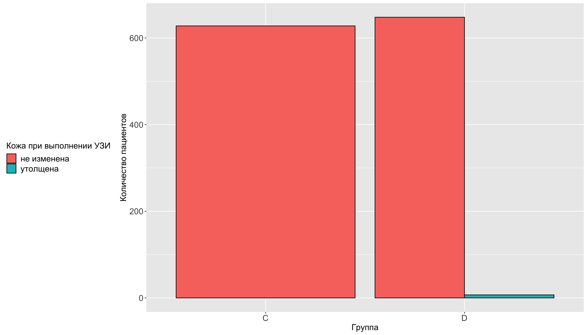

Рисунок №4.1. Оценка кожи при выполнении ручного УЗ исследования в группах C и D.

*Протоки при выполнении УЗИ*

Протоки при выполнении УЗИ в группе C не расширены в 99.52% (625/628случаев)[95% ДИ 0.98;1] и расширены в 0.48% (3/628случаев)[95% ДИ 0;0.02].

В группе D не расширены в 98.32% (644/655случаев)[95% ДИ 0.97;0.99] и расширены в 1.68% (11/655случаев)[95% ДИ 0.01;0.03] (Таблица 4.2, Рисунок 4.2).

Таблица №4.2. Оценка протоков при выполнении ручного УЗ исследования в группах C и D.

| Протоки при выполнении УЗИ | Процентная доля               | 95% ДИ       | Процентная доля               | 95% ДИ          |
|---------------|---------------|---------------|---------------|---------------|
| Группы                     | Группа C                      | ------       | Группа D                      | ------          |
| не расширены               | 99.522 % ( 625 / 628 случаев) | [ 0.98 ; 1 ] | 98.321 % ( 644 / 655 случаев) | [ 0.97 ; 0.99 ] |
| расширены                  | 0.478 % ( 3 / 628 случаев)    | [ 0 ; 0.02 ] | 1.679 % ( 11 / 655 случаев)   | [ 0.01 ; 0.03 ] |

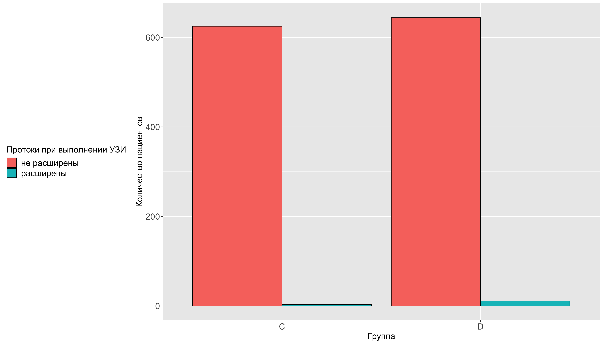

Рисунок №4.2. Оценка протоков при выполнении ручного УЗ исследования в группах C и D.

*УЗ-фон*

УЗ-фон в группе C железистая ткань в 53.34% (335/628случаев)[95% ДИ 0.49;0.57], кисты в 0% (0/628случаев)[95% ДИ 0;0.01], склероз в 0% (0/628случаев)[95% ДИ 0;0.01] и фиброзно-кистозная мастопатия в 46.66% (293/628случаев)[95% ДИ 0.43;0.51]. В группе D железистая ткань в 58.32% (382/655случаев)[95% ДИ 0.54;0.62] и фиброзно-кистозная мастопатия в 41.68% (273/655случаев)[95% ДИ 0.38;0.46] (Таблица 4.3, Рисунок 4.3).

Таблица №4.3. УЗ фона при УЗ исследовании в группах C и D.

| УЗ-фон                        | Процентная доля               | 95% ДИ          | Процентная доля               | 95% ДИ          |
|---------------|---------------|---------------|---------------|---------------|
| Группы                        | Группа C                      | ------          | Группа D                      | ------          |
| железистая ткань              | 53.344 % ( 335 / 628 случаев) | [ 0.49 ; 0.57 ] | 58.321 % ( 382 / 655 случаев) | [ 0.54 ; 0.62 ] |
| кисты                         | 0 % ( 0 / 628 случаев)        | [ 0 ; 0.01 ]    | 0 % ( 0 / 655 случаев)        | [ 0 ; 0.01 ]    |
| склероз                       | 0 % ( 0 / 628 случаев)        | [ 0 ; 0.01 ]    | 0 % ( 0 / 655 случаев)        | [ 0 ; 0.01 ]    |
| фиброзно-кистозная мастопатия | 46.656 % ( 293 / 628 случаев) | [ 0.43 ; 0.51 ] | 41.679 % ( 273 / 655 случаев) | [ 0.38 ; 0.46 ] |

(Таблица 4.3, Рисунок 4.3).

Таблица №4.3. УЗ фона при УЗ исследовании в группах C и D.

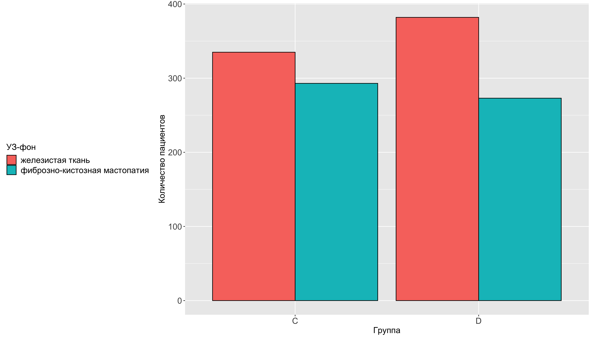

Рисунок №4.3. УЗ фона при УЗ исследовании в группах C и D.

*Расположение образования*

Локалтзация образования в группе C верхне-внутренний квадрант в 20% (23/115случаев)[95% ДИ 0.13;0.29], верхне-наружный квадрант в 31.3% (36/115случаев)[95% ДИ 0.23;0.41], граница в 12.17% (14/115случаев)[95% ДИ 0.07;0.2], граница верхних квадрантов в 6.09% (7/115случаев)[95% ДИ 0.03;0.13], граница наружных квадрантов в 5.22% (6/115случаев)[95% ДИ 0.02;0.11], нижне-внутренний квадрант в 10.43% (12/115случаев)[95% ДИ 0.06;0.18] и нижне-наружный квадрант в 14.78% (17/115случаев)[95% ДИ 0.09;0.23]. В группе D верхне-внутренний квадрант в 13.47% (33/245случаев)[95% ДИ 0.1;0.19], верхне-наружный квадрант в 46.94% (115/245случаев)[95% ДИ 0.41;0.53], граница в 5.71% (14/245случаев)[95% ДИ 0.03;0.1], граница верхних квадрантов в 7.35% (18/245случаев)[95% ДИ 0.05;0.12], граница наружных квадрантов в 7.76% (19/245случаев)[95% ДИ 0.05;0.12], граница нижних квадрантов в 3.27% (8/245случаев)[95% ДИ 0.02;0.07], нижне-внутренний квадрант в 2.86% (7/245случаев)[95% ДИ 0.01;0.06], нижне-наружный квадрант в 8.57% (21/245случаев)[95% ДИ 0.06;0.13] и центральный отдел в 4.08% (10/245случаев)[95% ДИ 0.02;0.08] (Таблица 4.4, Рисунок 4.4).

Таблица №4.4. Расположения образования при УЗ исследовании в группах C и D.

| Образование находилось        | Процентная доля              | 95% ДИ          | Процентная доля               | 95% ДИ          |
|---------------|---------------|---------------|---------------|---------------|
| Группы                        | Группа C                     | ------          | Группа D                      | ------          |
| верхне-внутренний квадрант    | 20 % ( 23 / 115 случаев)     | [ 0.13 ; 0.29 ] | 13.469 % ( 33 / 245 случаев)  | [ 0.1 ; 0.19 ]  |
| верхне-наружный квадрант      | 31.304 % ( 36 / 115 случаев) | [ 0.23 ; 0.41 ] | 46.939 % ( 115 / 245 случаев) | [ 0.41 ; 0.53 ] |
| вся железа                    | 0 % ( 0 / 115 случаев)       | [ 0 ; 0.04 ]    | 0 % ( 0 / 245 случаев)        | [ 0 ; 0.02 ]    |
| граница                       | 12.174 % ( 14 / 115 случаев) | [ 0.07 ; 0.2 ]  | 5.714 % ( 14 / 245 случаев)   | [ 0.03 ; 0.1 ]  |
| граница верхних квадрантов    | 6.087 % ( 7 / 115 случаев)   | [ 0.03 ; 0.13 ] | 7.347 % ( 18 / 245 случаев)   | [ 0.05 ; 0.12 ] |
| граница внутренних квадрантов | 0 % ( 0 / 115 случаев)       | [ 0 ; 0.04 ]    | 0 % ( 0 / 245 случаев)        | [ 0 ; 0.02 ]    |
| граница наружных квадрантов   | 5.217 % ( 6 / 115 случаев)   | [ 0.02 ; 0.11 ] | 7.755 % ( 19 / 245 случаев)   | [ 0.05 ; 0.12 ] |
| граница нижних квадрантов     | 0 % ( 0 / 115 случаев)       | [ 0 ; 0.04 ]    | 3.265 % ( 8 / 245 случаев)    | [ 0.02 ; 0.07 ] |
| нет                           | 0 % ( 0 / 115 случаев)       | [ 0 ; 0.04 ]    | 0 % ( 0 / 245 случаев)        | [ 0 ; 0.02 ]    |
| нижне-внутренний квадрант     | 10.435 % ( 12 / 115 случаев) | [ 0.06 ; 0.18 ] | 2.857 % ( 7 / 245 случаев)    | [ 0.01 ; 0.06 ] |
| нижне-наружный квадрант       | 14.783 % ( 17 / 115 случаев) | [ 0.09 ; 0.23 ] | 8.571 % ( 21 / 245 случаев)   | [ 0.06 ; 0.13 ] |
| центральный отдел             | 0 % ( 0 / 115 случаев)       | [ 0 ; 0.04 ]    | 4.082 % ( 10 / 245 случаев)   | [ 0.02 ; 0.08 ] |

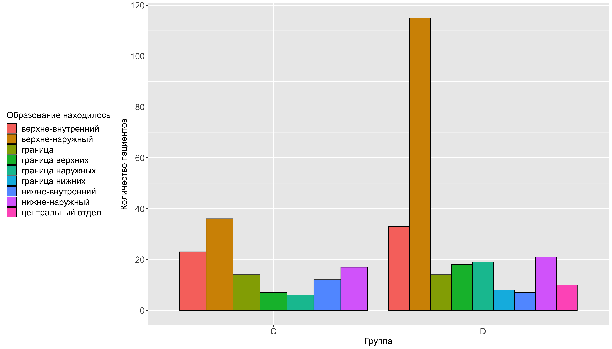

Рисунок №4.4. Расположения образования при УЗ исследовании в группах C и D.

*Форма образования*

Форма образования в группе C неправильная в 33.04% (38/115случаев)[95% ДИ 0.25;0.43], овальная в 58.26% (67/115случаев)[95% ДИ 0.49;0.67], округлая в 2.61% (3/115случаев)[95% ДИ 0.01;0.08] и участок нарушения архитектоники в 6.09% (7/115случаев)[95% ДИ 0.03;0.13]. В группе D неправильная в 50.2% (123/245случаев)[95% ДИ 0.44;0.57], овальная в 38.37% (94/245случаев)[95% ДИ 0.32;0.45], округлая в 5.71% (14/245случаев)[95% ДИ 0.03;0.1] и участок нарушения архитектоники в 5.71% (14/245случаев)[95% ДИ 0.03;0.1] (Таблица 4.5, Рисунок 4.5).

Таблица №4.5. Форма образования при УЗ исследовании в группах C и D.

| Форма образования               | Процентная доля              | 95% ДИ          | Процентная доля               | 95% ДИ          |
|---------------|---------------|---------------|---------------|---------------|
| Группы                          | Группа C                     | ------          | Группа D                      | ------          |
| неправильная                    | 33.043 % ( 38 / 115 случаев) | [ 0.25 ; 0.43 ] | 50.204 % ( 123 / 245 случаев) | [ 0.44 ; 0.57 ] |
| нет узла                        | 0 % ( 0 / 115 случаев)       | [ 0 ; 0.04 ]    | 0 % ( 0 / 245 случаев)        | [ 0 ; 0.02 ]    |
| овальная                        | 58.261 % ( 67 / 115 случаев) | [ 0.49 ; 0.67 ] | 38.367 % ( 94 / 245 случаев)  | [ 0.32 ; 0.45 ] |
| округлая                        | 2.609 % ( 3 / 115 случаев)   | [ 0.01 ; 0.08 ] | 5.714 % ( 14 / 245 случаев)   | [ 0.03 ; 0.1 ]  |
| участок нарушения архитектоники | 6.087 % ( 7 / 115 случаев)   | [ 0.03 ; 0.13 ] | 5.714 % ( 14 / 245 случаев)   | [ 0.03 ; 0.1 ]  |

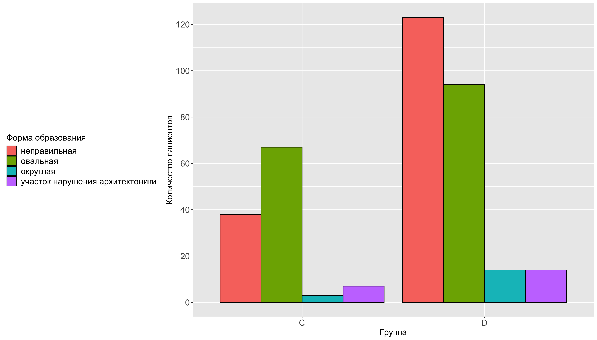

Рисунок №4.5. Форма образования при УЗ исследовании в группах C и D.

*Размер образования*

Размер образования в группе C 0,5-1,0 см в 33.91% (39/115случаев)[95% ДИ 0.26;0.43], 1,1-1,5 см в 18.26% (21/115случаев)[95% ДИ 0.12;0.27], 1,5-2,0 см в 33.91% (39/115случаев)[95% ДИ 0.26;0.43], 2,1-2,5 см в 2.61% (3/115случаев)[95% ДИ 0.01;0.08] и 2,5-3,0 см в 11.3% (13/115случаев)[95% ДИ 0.06;0.19]. В группе D 0,5-1,0 см в 29.39% (72/245случаев)[95% ДИ 0.24;0.36], 1,1-1,5 см в 28.98% (71/245случаев)[95% ДИ 0.23;0.35], 1,5-2,0 см в 20% (49/245случаев)[95% ДИ 0.15;0.26], 2,1-2,5 см в 9.39% (23/245случаев)[95% ДИ 0.06;0.14], 2,5-3,0 см в 11.02% (27/245случаев)[95% ДИ 0.08;0.16] и более 3 см в 1.22% (3/245случаев)[95% ДИ 0;0.04] (Таблица 4.6, Рисунок 4.6).

Таблица №4.6. Размер образования при УЗ исследовании в группах C и D.

| Размер образования | Процентная доля              | 95% ДИ          | Процентная доля              | 95% ДИ          |
|---------------|---------------|---------------|---------------|---------------|
| Группы             | Группа C                     | ------          | Группа D                     | ------          |
| 0,5-1,0 см         | 33.913 % ( 39 / 115 случаев) | [ 0.26 ; 0.43 ] | 29.388 % ( 72 / 245 случаев) | [ 0.24 ; 0.36 ] |
| 1,1-1,5 см         | 18.261 % ( 21 / 115 случаев) | [ 0.12 ; 0.27 ] | 28.98 % ( 71 / 245 случаев)  | [ 0.23 ; 0.35 ] |
| 1,5-2,0 см         | 33.913 % ( 39 / 115 случаев) | [ 0.26 ; 0.43 ] | 20 % ( 49 / 245 случаев)     | [ 0.15 ; 0.26 ] |
| 2,1-2,5 см         | 2.609 % ( 3 / 115 случаев)   | [ 0.01 ; 0.08 ] | 9.388 % ( 23 / 245 случаев)  | [ 0.06 ; 0.14 ] |
| 2,5-3,0 см         | 11.304 % ( 13 / 115 случаев) | [ 0.06 ; 0.19 ] | 11.02 % ( 27 / 245 случаев)  | [ 0.08 ; 0.16 ] |
| более 3 см         | 0 % ( 0 / 115 случаев)       | [ 0 ; 0.04 ]    | 1.224 % ( 3 / 245 случаев)   | [ 0 ; 0.04 ]    |
| нет                | 0 % ( 0 / 115 случаев)       | [ 0 ; 0.04 ]    | 0 % ( 0 / 245 случаев)       | [ 0 ; 0.02 ]    |

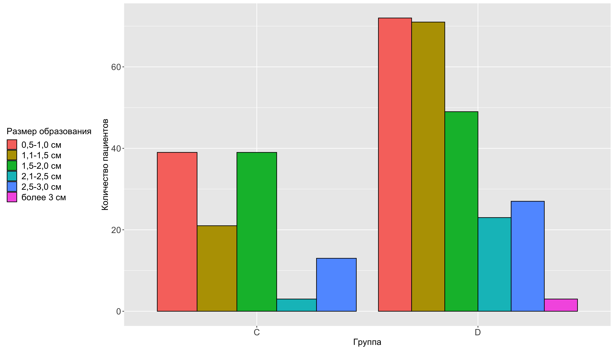

Рисунок №4.6. Размер образования при УЗ исследовании в группах C и D.

*Края образования*

Края образования в группе C волнистые в 12.17% (14/115случаев)[95% ДИ 0.07;0.2], звездчатые в 3.48% (4/115случаев)[95% ДИ 0.01;0.09], неровные в 28.7% (33/115случаев)[95% ДИ 0.21;0.38], полициклические в 0% (0/115случаев)[95% ДИ 0;0.04] и ровные в 55.65% (64/115случаев)[95% ДИ 0.46;0.65]. В группе D волнистые в 8.57% (21/245случаев)[95% ДИ 0.06;0.13], звездчатые в 15.1% (37/245случаев)[95% ДИ 0.11;0.2], неровные в 35.1% (86/245случаев)[95% ДИ 0.29;0.41], полициклические в 0% (0/245случаев)[95% ДИ 0;0.02] и ровные в 41.22% (101/245случаев)[95% ДИ 0.35;0.48] (Таблица 4.7, Рисунок 4.7).

Таблица №4.7. Оценка краев образования при УЗ исследовании в группах C и D.

| Края образования | Процентная доля              | 95% ДИ          | Процентная доля               | 95% ДИ          |
|---------------|---------------|---------------|---------------|---------------|
| Группы           | Группа C                     | ------          | Группа D                      | ------          |
| волнистые        | 12.174 % ( 14 / 115 случаев) | [ 0.07 ; 0.2 ]  | 8.571 % ( 21 / 245 случаев)   | [ 0.06 ; 0.13 ] |
| звездчатые       | 3.478 % ( 4 / 115 случаев)   | [ 0.01 ; 0.09 ] | 15.102 % ( 37 / 245 случаев)  | [ 0.11 ; 0.2 ]  |
| неровные         | 28.696 % ( 33 / 115 случаев) | [ 0.21 ; 0.38 ] | 35.102 % ( 86 / 245 случаев)  | [ 0.29 ; 0.41 ] |
| нет узла         | 0 % ( 0 / 115 случаев)       | [ 0 ; 0.04 ]    | 0 % ( 0 / 245 случаев)        | [ 0 ; 0.02 ]    |
| полициклические  | 0 % ( 0 / 115 случаев)       | [ 0 ; 0.04 ]    | 0 % ( 0 / 245 случаев)        | [ 0 ; 0.02 ]    |
| ровные           | 55.652 % ( 64 / 115 случаев) | [ 0.46 ; 0.65 ] | 41.224 % ( 101 / 245 случаев) | [ 0.35 ; 0.48 ] |

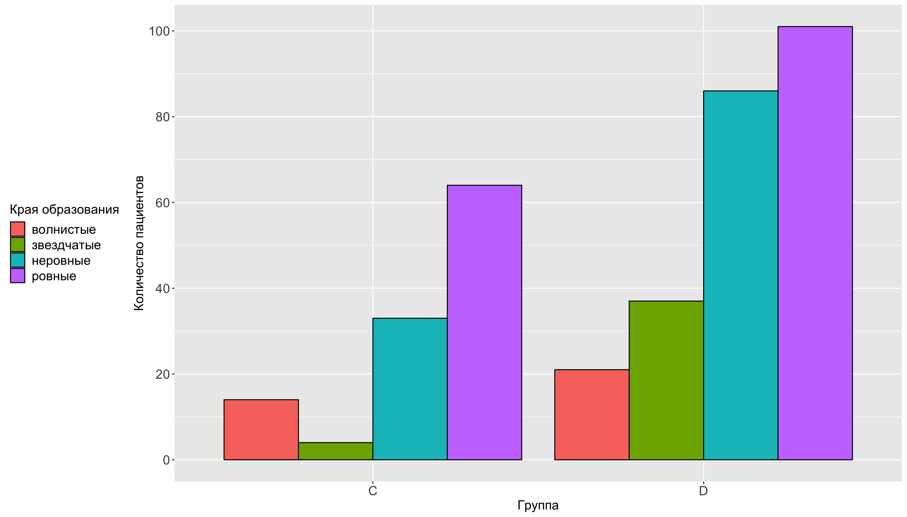

Рисунок №4.7. Оценка краев образования при УЗ исследовании в группах C и D.

*Эхогенность образования*

Образование в группе C гиперэхогенное в 3.48% (4/115случаев)[95% ДИ 0.01;0.09], гипоэхогенное в 93.04% (107/115случаев)[95% ДИ 0.86;0.97] и изоэхогенное в 3.48% (4/115случаев)[95% ДИ 0.01;0.09]. В группе D анэхогенное в 1.22% (3/245случаев)[95% ДИ 0;0.04], гипоэхогенное в 94.29% (231/245случаев)[95% ДИ 0.9;0.97] и смешанная в 4.49% (11/245случаев)[95% ДИ 0.02;0.08] (Таблица 4.8, Рисунок 4.8).

Таблица №4.8. Оценка эхогенности образования при УЗ исследовании в группах C и D.

| Эхогенность образования | Процентная доля               | 95% ДИ          | Процентная доля               | 95% ДИ          |
|---------------|---------------|---------------|---------------|---------------|
| Группы                  | Группа C                      | ------          | Группа D                      | ------          |
| анэхогенное             | 0 % ( 0 / 115 случаев)        | [ 0 ; 0.04 ]    | 1.224 % ( 3 / 245 случаев)    | [ 0 ; 0.04 ]    |
| гиперэхогенное          | 3.478 % ( 4 / 115 случаев)    | [ 0.01 ; 0.09 ] | 0 % ( 0 / 245 случаев)        | [ 0 ; 0.02 ]    |
| гипоэхогенное           | 93.043 % ( 107 / 115 случаев) | [ 0.86 ; 0.97 ] | 94.286 % ( 231 / 245 случаев) | [ 0.9 ; 0.97 ]  |
| изоэхогенное            | 3.478 % ( 4 / 115 случаев)    | [ 0.01 ; 0.09 ] | 0 % ( 0 / 245 случаев)        | [ 0 ; 0.02 ]    |
| нет узла                | 0 % ( 0 / 115 случаев)        | [ 0 ; 0.04 ]    | 0 % ( 0 / 245 случаев)        | [ 0 ; 0.02 ]    |
| смешанная               | 0 % ( 0 / 115 случаев)        | [ 0 ; 0.04 ]    | 4.49 % ( 11 / 245 случаев)    | [ 0.02 ; 0.08 ] |

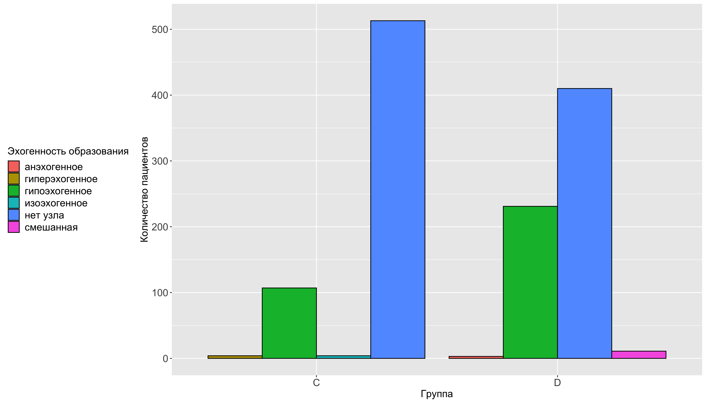

Рисунок №4.8. Оценка эхогенности образования при УЗ исследовании в группах C и D.

*УЗ-структура образования*

УЗ-структура образования в группе C неоднородная в 47.83% (55/115случаев)[95% ДИ 0.38;0.57], однородная в 49.57% (57/115случаев)[95% ДИ 0.4;0.59] и с жидкостным содержимым в 2.61% (3/115случаев)[95% ДИ 0.01;0.08]. В группе D неоднородная в 22.44% (147/655случаев)[95% ДИ 0.19;0.26], однородная в 14.96% (98/655случаев)[95% ДИ 0.12;0.18] и с жидкостным содержимым в 0% (0/655случаев)[95% ДИ 0;0.01] (Таблица 4.9, Рисунок 4.9).

Таблица №4.9. Оценка УЗ-структуры образования при УЗ исследовании в группах C и D.

| УЗ-структура образования                         | Процентная доля              | 95% ДИ          | Процентная доля               | 95% ДИ          |
|---------------|---------------|---------------|---------------|---------------|
| Группы                                           | Группа C                     | ------          | Группа D                      | ------          |
| наличие внутрикистозных пристеночных разрастаний | 0 % ( 0 / 115 случаев)       | [ 0 ; 0.04 ]    | 0 % ( 0 / 655 случаев)        | [ 0 ; 0.01 ]    |
| неоднородная                                     | 47.826 % ( 55 / 115 случаев) | [ 0.38 ; 0.57 ] | 22.443 % ( 147 / 655 случаев) | [ 0.19 ; 0.26 ] |
| нет узла                                         | 0 % ( 0 / 115 случаев)       | [ 0 ; 0.04 ]    | 62.595 % ( 410 / 655 случаев) | [ 0.59 ; 0.66 ] |
| однородная                                       | 49.565 % ( 57 / 115 случаев) | [ 0.4 ; 0.59 ]  | 14.962 % ( 98 / 655 случаев)  | [ 0.12 ; 0.18 ] |
| с жидкостным содержимым                          | 2.609 % ( 3 / 115 случаев)   | [ 0.01 ; 0.08 ] | 0 % ( 0 / 655 случаев)        | [ 0 ; 0.01 ]    |

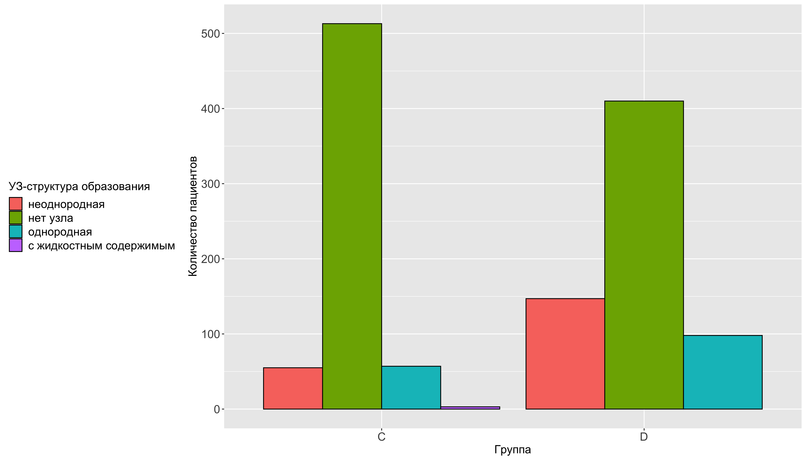

Рисунок №4.9. Оценка УЗ-структуры образования образования при УЗ исследовании в группах C и D.

*Количество узлов*

Количество узлов в группе C один в 74.78% (86/115случаев)[95% ДИ 0.66;0.82], два в 21.74% (25/115случаев)[95% ДИ 0.15;0.31] и три в 3.48% (4/115случаев)[95% ДИ 0.01;0.09].

В группе D один в 83.67% (205/245случаев)[95% ДИ 0.78;0.88], два в 12.24% (30/245случаев)[95% ДИ 0.09;0.17], три в 1.22% (3/245случаев)[95% ДИ 0;0.04] и множественные в 2.86% (7/245случаев)[95% ДИ 0.01;0.06] (Таблица 4.10, Рисунок 4.10).

Таблица №4.10. Оценка количества узлов при УЗ исследовании в группах C и D.

| Количество узлов | Процентная доля              | 95% ДИ          | Процентная доля               | 95% ДИ          |
|---------------|---------------|---------------|---------------|---------------|
| Группы           | Группа C                     | ------          | Группа D                      | ------          |
| один             | 74.783 % ( 86 / 115 случаев) | [ 0.66 ; 0.82 ] | 83.673 % ( 205 / 245 случаев) | [ 0.78 ; 0.88 ] |
| два              | 21.739 % ( 25 / 115 случаев) | [ 0.15 ; 0.31 ] | 12.245 % ( 30 / 245 случаев)  | [ 0.09 ; 0.17 ] |
| три              | 3.478 % ( 4 / 115 случаев)   | [ 0.01 ; 0.09 ] | 1.224 % ( 3 / 245 случаев)    | [ 0 ; 0.04 ]    |
| множественные    | 0 % ( 0 / 115 случаев)       | [ 0 ; 0.04 ]    | 2.857 % ( 7 / 245 случаев)    | [ 0.01 ; 0.06 ] |

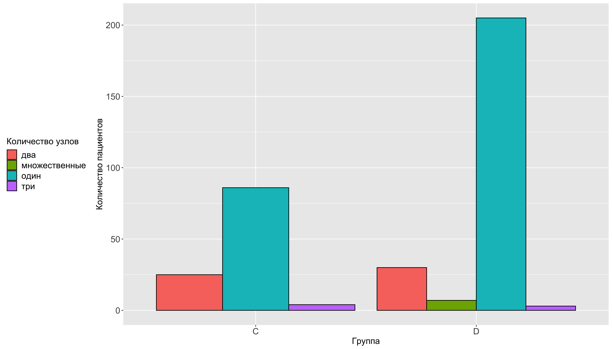

Рисунок №4.10. Оценка количества узлов при УЗ исследовании в группах C и D.

*Кровоток в образовании*

Кровоток в образовании в группе Cинтранодулярный в 34.78% (40/115случаев)[95% ДИ 0.26;0.44], не определяется в 31.3% (36/115случаев)[95% ДИ 0.23;0.41], по периферии в 31.3% (36/115случаев)[95% ДИ 0.23;0.41] и смешанный в 2.61% (3/115случаев)[95% ДИ 0.01;0.08]. В группе D интранодулярный в 42.86% (105/245случаев)[95% ДИ 0.37;0.49], не определяется в 20.82% (51/245случаев)[95% ДИ 0.16;0.27], определяются внутри в 1.63% (4/245случаев)[95% ДИ 0.01;0.04], перинодулярный в 3.27% (8/245случаев)[95% ДИ 0.02;0.07], по периферии в 24.49% (60/245случаев)[95% ДИ 0.19;0.3] и смешанный в 6.94% (17/245случаев)[95% ДИ 0.04;0.11] (Таблица 4.11, Рисунок 4.11).

Таблица №4.11. Оценка кровотока в образовании при УЗ исследовании в группах C и D.

| Кровоток в образовании | Процентная доля              | 95% ДИ          | Процентная доля               | 95% ДИ          |
|---------------|---------------|---------------|---------------|---------------|
| Группы                 | Группа C                     | ------          | Группа D                      | ------          |
| интранодулярный        | 34.783 % ( 40 / 115 случаев) | [ 0.26 ; 0.44 ] | 42.857 % ( 105 / 245 случаев) | [ 0.37 ; 0.49 ] |
| не определяется        | 31.304 % ( 36 / 115 случаев) | [ 0.23 ; 0.41 ] | 20.816 % ( 51 / 245 случаев)  | [ 0.16 ; 0.27 ] |
| определяются внутри    | 0 % ( 0 / 115 случаев)       | [ 0 ; 0.04 ]    | 1.633 % ( 4 / 245 случаев)    | [ 0.01 ; 0.04 ] |
| перинодулярный         | 0 % ( 0 / 115 случаев)       | [ 0 ; 0.04 ]    | 3.265 % ( 8 / 245 случаев)    | [ 0.02 ; 0.07 ] |
| по периферии           | 31.304 % ( 36 / 115 случаев) | [ 0.23 ; 0.41 ] | 24.49 % ( 60 / 245 случаев)   | [ 0.19 ; 0.3 ]  |
| смешанный              | 2.609 % ( 3 / 115 случаев)   | [ 0.01 ; 0.08 ] | 6.939 % ( 17 / 245 случаев)   | [ 0.04 ; 0.11 ] |

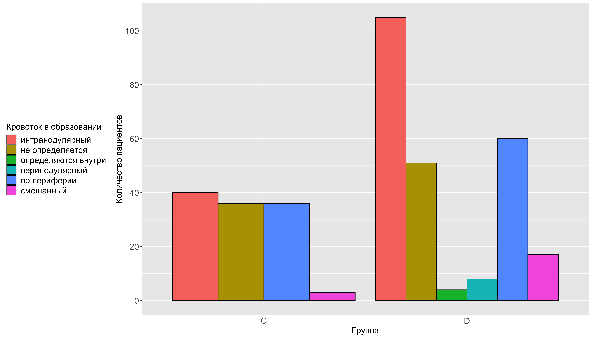

Рисунок №4.11. Оценка кровотока в образовании при УЗ исследовании в группах C и D.

*Эластография*

Эластография в группе C 0 эластотип в 82.32% (517/628случаев)[95% ДИ 0.79;0.85], 1 эластотип в 0.48% (3/628случаев)[95% ДИ 0;0.02], 2 эластотип в 0.64% (4/628случаев)[95% ДИ 0;0.02], 3 эластотип в 10.19% (64/628случаев)[95% ДИ 0.08;0.13], 4 эластотип в 1.43% (9/628случаев)[95% ДИ 0.01;0.03] и нет данных в 4.94% (31/628случаев)[95% ДИ 0.03;0.07]. В группе D 0 эластотип в 65.04% (426/655случаев)[95% ДИ 0.61;0.69], 1 эластотип в 0.46% (3/655случаев)[95% ДИ 0;0.01], 3 эластотип в 16.34% (107/655случаев)[95% ДИ 0.14;0.19], 4 эластотип в 9.01% (59/655случаев)[95% ДИ 0.07;0.12] и нет данных в 9.16% (60/655случаев)[95% ДИ 0.07;0.12] (Таблица 4.12, Рисунок 4.12).

Таблица №4.12. Результаты эластографии при УЗ исследовании в группах C и D.

| Эластография | Процентная доля               | 95% ДИ          | Процентная доля               | 95% ДИ          |
|---------------|---------------|---------------|---------------|---------------|
| Группы       | Группа C                      | ------          | Группа D                      | ------          |
| 0 эластотип  | 82.325 % ( 517 / 628 случаев) | [ 0.79 ; 0.85 ] | 65.038 % ( 426 / 655 случаев) | [ 0.61 ; 0.69 ] |
| 1 эластотип  | 0.478 % ( 3 / 628 случаев)    | [ 0 ; 0.02 ]    | 0.458 % ( 3 / 655 случаев)    | [ 0 ; 0.01 ]    |
| 2 эластотип  | 0.637 % ( 4 / 628 случаев)    | [ 0 ; 0.02 ]    | 0 % ( 0 / 655 случаев)        | [ 0 ; 0.01 ]    |
| 3 эластотип  | 10.191 % ( 64 / 628 случаев)  | [ 0.08 ; 0.13 ] | 16.336 % ( 107 / 655 случаев) | [ 0.14 ; 0.19 ] |
| 4 эластотип  | 1.433 % ( 9 / 628 случаев)    | [ 0.01 ; 0.03 ] | 9.008 % ( 59 / 655 случаев)   | [ 0.07 ; 0.12 ] |
| нет данных   | 4.936 % ( 31 / 628 случаев)   | [ 0.03 ; 0.07 ] | 9.16 % ( 60 / 655 случаев)    | [ 0.07 ; 0.12 ] |

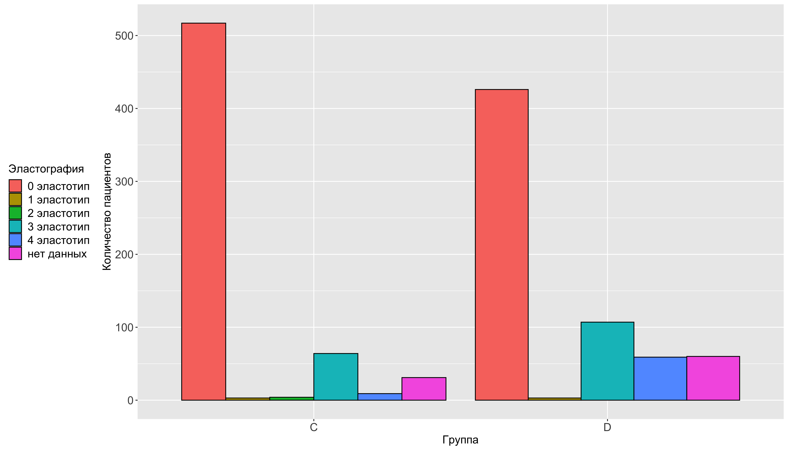

Рисунок №4.12. Результаты эластографии при УЗ исследовании в группах C и D.

*Регионарные лимфоузлы*

Увеличение регинарных лимфоузлов в группе C левая подключичная область в 0.48% (3/628случаев)[95% ДИ 0;0.02], левая подмышечная область в 0.64% (4/628случаев)[95% ДИ 0;0.02], не изменены в 97.77% (614/628случаев)[95% ДИ 0.96;0.99] и правая надключичная область в 1.11% (7/628случаев)[95% ДИ 0;0.02]. В группе D левая подключичная область в 0.46% (3/655случаев)[95% ДИ 0;0.01], не изменены в 95.88% (628/655случаев)[95% ДИ 0.94;0.97], правая надключичная область в 2.14% (14/655случаев)[95% ДИ 0.01;0.04] и правая подмышечная область в 1.53% (10/655случаев)[95% ДИ 0.01;0.03] (Таблица 4.13, Рисунок 4.13).

Таблица №4.13. Результаты оценки регионарных лимфоузлов при УЗ исследовании в группах C и D.

| Увеличение регинарных лимфоузлов | Процентная доля               | 95% ДИ          | Процентная доля               | 95% ДИ          |
|---------------|---------------|---------------|---------------|---------------|
| Группы                           | Группа C                      | ------          | Группа D                      | ------          |
| левая подключичная область       | 0.478 % ( 3 / 628 случаев)    | [ 0 ; 0.02 ]    | 0.458 % ( 3 / 655 случаев)    | [ 0 ; 0.01 ]    |
| левая подмышечная область        | 0.637 % ( 4 / 628 случаев)    | [ 0 ; 0.02 ]    | 0 % ( 0 / 655 случаев)        | [ 0 ; 0.01 ]    |
| не изменены                      | 97.771 % ( 614 / 628 случаев) | [ 0.96 ; 0.99 ] | 95.878 % ( 628 / 655 случаев) | [ 0.94 ; 0.97 ] |
| правая надключичная область      | 1.115 % ( 7 / 628 случаев)    | [ 0 ; 0.02 ]    | 2.137 % ( 14 / 655 случаев)   | [ 0.01 ; 0.04 ] |
| правая подмышечная область       | 0 % ( 0 / 628 случаев)        | [ 0 ; 0.01 ]    | 1.527 % ( 10 / 655 случаев)   | [ 0.01 ; 0.03 ] |

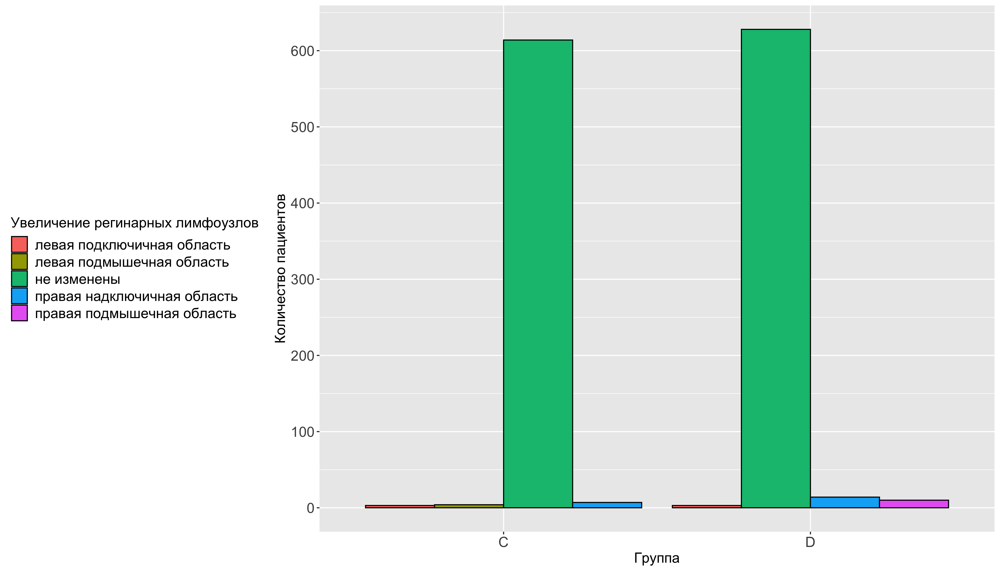

Рисунок №4.13. Результаты оценки регионарных лимфоузлов при УЗ исследовании в группах C и D.

*Определение категории BI-RADS*

Категория BI-RADS в группе C Birads 1 в 1.75% (11/628случаев)[95% ДИ 0.01;0.03], Birads 2 в 84.55% (531/628случаев)[95% ДИ 0.81;0.87], Birads 3 в 6.69% (42/628случаев)[95% ДИ 0.05;0.09], Birads 4b в 1.11% (7/628случаев)[95% ДИ 0;0.02], Birads 4c в 1.75% (11/628случаев)[95% ДИ 0.01;0.03], Birads 4а в 2.55% (16/628случаев)[95% ДИ 0.02;0.04] и Birads 5 в 1.59% (10/628случаев)[95% ДИ 0.01;0.03]. В группе D Birads 1 в 2.75% (18/655случаев)[95% ДИ 0.02;0.04], Birads 2 в 66.56% (436/655случаев)[95% ДИ 0.63;0.7], Birads 3 в 8.4% (55/655случаев)[95% ДИ 0.06;0.11], Birads 4b в 4.58% (30/655случаев)[95% ДИ 0.03;0.07], Birads 4c в 2.6% (17/655случаев)[95% ДИ 0.02;0.04], Birads 4а в 5.5% (36/655случаев)[95% ДИ 0.04;0.08] и Birads 5 в 9.62% (63/655случаев)[95% ДИ 0.08;0.12] (Таблица 4.14, Рисунок 4.14).

Таблица №4.14. Определение категории BIRADS при УЗ исследовании в группах C и D.

| Категория BI-RADS | Процентная доля               | 95% ДИ          | Процентная доля               | 95% ДИ          |
|---------------|---------------|---------------|---------------|---------------|
| Группы            | Группа C                      | ------          | Группа D                      | ------          |
| Birads 1          | 1.752 % ( 11 / 628 случаев)   | [ 0.01 ; 0.03 ] | 2.748 % ( 18 / 655 случаев)   | [ 0.02 ; 0.04 ] |
| Birads 2          | 84.554 % ( 531 / 628 случаев) | [ 0.81 ; 0.87 ] | 66.565 % ( 436 / 655 случаев) | [ 0.63 ; 0.7 ]  |
| Birads 3          | 6.688 % ( 42 / 628 случаев)   | [ 0.05 ; 0.09 ] | 8.397 % ( 55 / 655 случаев)   | [ 0.06 ; 0.11 ] |
| Birads 4b         | 1.115 % ( 7 / 628 случаев)    | [ 0 ; 0.02 ]    | 4.58 % ( 30 / 655 случаев)    | [ 0.03 ; 0.07 ] |
| Birads 4c         | 1.752 % ( 11 / 628 случаев)   | [ 0.01 ; 0.03 ] | 2.595 % ( 17 / 655 случаев)   | [ 0.02 ; 0.04 ] |
| Birads 4а         | 2.548 % ( 16 / 628 случаев)   | [ 0.02 ; 0.04 ] | 5.496 % ( 36 / 655 случаев)   | [ 0.04 ; 0.08 ] |
| Birads 5          | 1.592 % ( 10 / 628 случаев)   | [ 0.01 ; 0.03 ] | 9.618 % ( 63 / 655 случаев)   | [ 0.08 ; 0.12 ] |

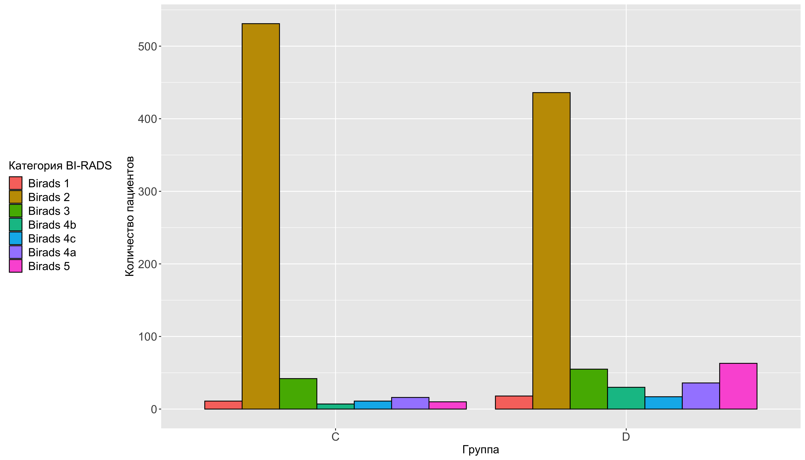

Рисунок №4.14. Определение категории BIRADS при УЗ исследовании в группах C и D.

*Диагноз после выполнения УЗ исследования*

УЗ-диагноз в группе C без патологии в 3.34% (21/628случаев)[95% ДИ 0.02;0.05], внутрипротоковая папиллома молочной железы в 0.96% (6/628случаев)[95% ДИ 0;0.02], диффузный фиброаденоматоз в 23.09% (145/628случаев)[95% ДИ 0.2;0.27], интрамаммарный лимфатический узел в 0.48% (3/628случаев)[95% ДИ 0;0.02], киста в 1.59% (10/628случаев)[95% ДИ 0.01;0.03], локализованный фиброаденоматоз в 0.64% (4/628случаев)[95% ДИ 0;0.02], мультицентричный рак в 2.23% (14/628случаев)[95% ДИ 0.01;0.04], образование Ca в 5.41% (34/628случаев)[95% ДИ 0.04;0.08], сложная киста в 1.59% (10/628случаев)[95% ДИ 0.01;0.03], фиброаденома единичная в 6.69% (42/628случаев)[95% ДИ 0.05;0.09], фиброаденомы множествненные в 3.66% (23/628случаев)[95% ДИ 0.02;0.06] и фиброзно-кистозная мастопатия в 49.68% (312/628случаев)[95% ДИ 0.46;0.54]. В группе D без патологии в 2.29% (15/655случаев)[95% ДИ 0.01;0.04], диффузный фиброаденоматоз в 21.07% (138/655случаев)[95% ДИ 0.18;0.24], киста в 1.07% (7/655случаев)[95% ДИ 0;0.02], кисты в 1.22% (8/655случаев)[95% ДИ 0.01;0.02], локализованный фиброаденоматоз в 2.29% (15/655случаев)[95% ДИ 0.01;0.04], мультицентричный рак в 3.05% (20/655случаев)[95% ДИ 0.02;0.05], мультфококальный рак в 1.07% (7/655случаев)[95% ДИ 0;0.02], образование Ca в 18.17% (119/655случаев)[95% ДИ 0.15;0.21], сложная киста в 0.61% (4/655случаев)[95% ДИ 0;0.02], фиброаденома единичная в 10.08% (66/655случаев)[95% ДИ 0.08;0.13], фиброаденомы множествненные в 2.29% (15/655случаев)[95% ДИ 0.01;0.04], фиброзно-кистозная мастопатия в 36.34% (238/655случаев)[95% ДИ 0.33;0.4] и цистаденопапиллома в 0.46% (3/655случаев)[95% ДИ 0;0.01] (Таблица 4.15, Рисунок 4.15).

Таблица №4.15. Поставленные диагнозы при УЗ исследовании в группах C и D.

| УЗ-диагноз                                 | Процентная доля               | 95% ДИ          | Процентная доля               | 95% ДИ          |
|---------------|---------------|---------------|---------------|---------------|
| Группы                                     | Группа C                      | ------          | Группа D                      | ------          |
| без патологии                              | 3.344 % ( 21 / 628 случаев)   | [ 0.02 ; 0.05 ] | 2.29 % ( 15 / 655 случаев)    | [ 0.01 ; 0.04 ] |
| внутрипротоковая папиллома молочной железы | 0.955 % ( 6 / 628 случаев)    | [ 0 ; 0.02 ]    | 0 % ( 0 / 655 случаев)        | [ 0 ; 0.01 ]    |
| диффузный фиброаденоматоз                  | 23.089 % ( 145 / 628 случаев) | [ 0.2 ; 0.27 ]  | 21.069 % ( 138 / 655 случаев) | [ 0.18 ; 0.24 ] |
| интрамаммарный лимфатический узел          | 0.478 % ( 3 / 628 случаев)    | [ 0 ; 0.02 ]    | 0 % ( 0 / 655 случаев)        | [ 0 ; 0.01 ]    |
| киста                                      | 1.592 % ( 10 / 628 случаев)   | [ 0.01 ; 0.03 ] | 1.069 % ( 7 / 655 случаев)    | [ 0 ; 0.02 ]    |
| кисты                                      | 0 % ( 0 / 628 случаев)        | [ 0 ; 0.01 ]    | 1.221 % ( 8 / 655 случаев)    | [ 0.01 ; 0.02 ] |
| липома                                     | 0.637 % ( 4 / 628 случаев)    | [ 0 ; 0.02 ]    | 0 % ( 0 / 655 случаев)        | [ 0 ; 0.01 ]    |
| локализованный фиброаденоматоз             | 0.637 % ( 4 / 628 случаев)    | [ 0 ; 0.02 ]    | 2.29 % ( 15 / 655 случаев)    | [ 0.01 ; 0.04 ] |
| мультицентричный рак                       | 2.229 % ( 14 / 628 случаев)   | [ 0.01 ; 0.04 ] | 3.053 % ( 20 / 655 случаев)   | [ 0.02 ; 0.05 ] |
| мультфококальный рак                       | 0 % ( 0 / 628 случаев)        | [ 0 ; 0.01 ]    | 1.069 % ( 7 / 655 случаев)    | [ 0 ; 0.02 ]    |
| образование Ca                             | 5.414 % ( 34 / 628 случаев)   | [ 0.04 ; 0.08 ] | 18.168 % ( 119 / 655 случаев) | [ 0.15 ; 0.21 ] |
| сложная киста                              | 1.592 % ( 10 / 628 случаев)   | [ 0.01 ; 0.03 ] | 0.611 % ( 4 / 655 случаев)    | [ 0 ; 0.02 ]    |
| фиброаденома единичная                     | 6.688 % ( 42 / 628 случаев)   | [ 0.05 ; 0.09 ] | 10.076 % ( 66 / 655 случаев)  | [ 0.08 ; 0.13 ] |
| фиброаденомы множествненные                | 3.662 % ( 23 / 628 случаев)   | [ 0.02 ; 0.06 ] | 2.29 % ( 15 / 655 случаев)    | [ 0.01 ; 0.04 ] |
| фиброзно-кистозная мастопатия              | 49.682 % ( 312 / 628 случаев) | [ 0.46 ; 0.54 ] | 36.336 % ( 238 / 655 случаев) | [ 0.33 ; 0.4 ]  |
| цистаденопапиллома                         | 0 % ( 0 / 628 случаев)        | [ 0 ; 0.01 ]    | 0.458 % ( 3 / 655 случаев)    | [ 0 ; 0.01 ]    |

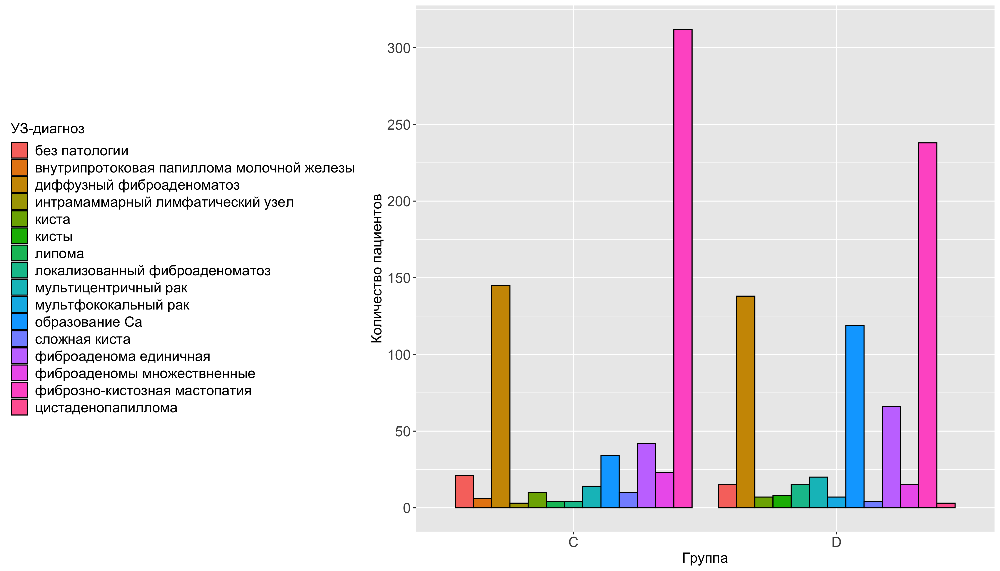

Рисунок №4.15. Поставленные диагнозы при УЗ исследовании в группах C и D.

*Диагноз после выполнении УЗ исследования*

Кальцинаты в группе C макрокальцинаты в 0% (0/628случаев)[95% ДИ 0;0.01], микрокальцинаты в 1.75% (11/628случаев)[95% ДИ 0.01;0.03], нет в 96.02% (603/628случаев)[95% ДИ 0.94;0.97] и определяются в 2.23% (14/628случаев)[95% ДИ 0.01;0.04]. В группе D макрокальцинаты в 2.29% (15/655случаев)[95% ДИ 0.01;0.04], микрокальцинаты в 4.73% (31/655случаев)[95% ДИ 0.03;0.07], нет в 87.33% (572/655случаев)[95% ДИ 0.84;0.9] и определяются в 5.65% (37/655случаев)[95% ДИ 0.04;0.08] (Таблица 4.16, Рисунок 4.16).

Таблица №4.16. Определение кальцинатов при УЗ исследовании в группах C и D.

| Кальцинаты      | Процентная доля               | 95% ДИ          | Процентная доля               | 95% ДИ          |
|---------------|---------------|---------------|---------------|---------------|
| Группы          | Группа C                      | ------          | Группа D                      | ------          |
| макрокальцинаты | 0 % ( 0 / 628 случаев)        | [ 0 ; 0.01 ]    | 2.29 % ( 15 / 655 случаев)    | [ 0.01 ; 0.04 ] |
| микрокальцинаты | 1.752 % ( 11 / 628 случаев)   | [ 0.01 ; 0.03 ] | 4.733 % ( 31 / 655 случаев)   | [ 0.03 ; 0.07 ] |
| нет             | 96.019 % ( 603 / 628 случаев) | [ 0.94 ; 0.97 ] | 87.328 % ( 572 / 655 случаев) | [ 0.84 ; 0.9 ]  |
| определяются    | 2.229 % ( 14 / 628 случаев)   | [ 0.01 ; 0.04 ] | 5.649 % ( 37 / 655 случаев)   | [ 0.04 ; 0.08 ] |

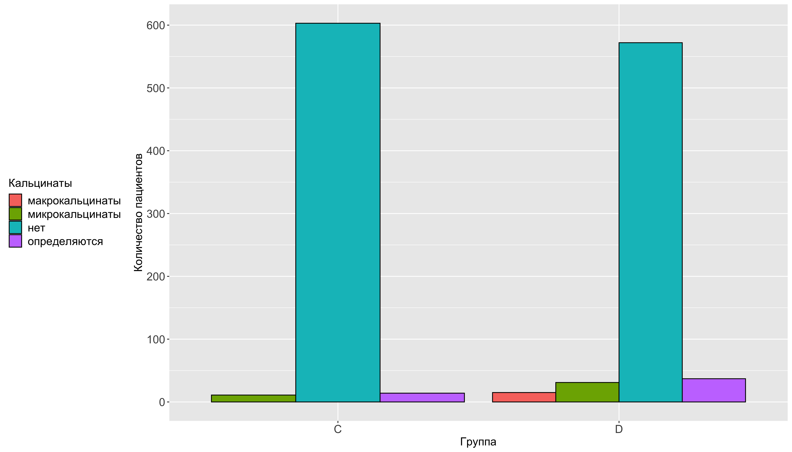

Рисунок №4.16. Определение кальцинатов при УЗ исследовании в группах C и D.

*Определние злокачественного образования при УЗИ исследовании*

УЗ диагноз злокачественное образование в группе C в 7.64% (48/628случаев)[95% ДИ 0.06;0.1]. В группе D в 22.29% (146/655случаев)[95% ДИ 0.19;0.26] (Таблица 4.17, Рисунок 4.17).

Таблица №4.17. Определение злокачественного новообразование при УЗ исследовании в группах C и D.

| УЗ диагноз злокачественное образование | Процентная доля               | 95% ДИ         | Процентная доля              | 95% ДИ          |
|---------------|---------------|---------------|---------------|---------------|
| Группы                                 | Группа C                      | ------         | Группа D                     | ------          |
| Да                                     | 7.643 % ( 48 / 628 случаев)   | [ 0.06 ; 0.1 ] | 22.29 % ( 146 / 655 случаев) | [ 0.19 ; 0.26 ] |
| Нет                                    | 92.357 % ( 580 / 628 случаев) | [ 0.9 ; 0.94 ] | 77.71 % ( 509 / 655 случаев) | [ 0.74 ; 0.81 ] |

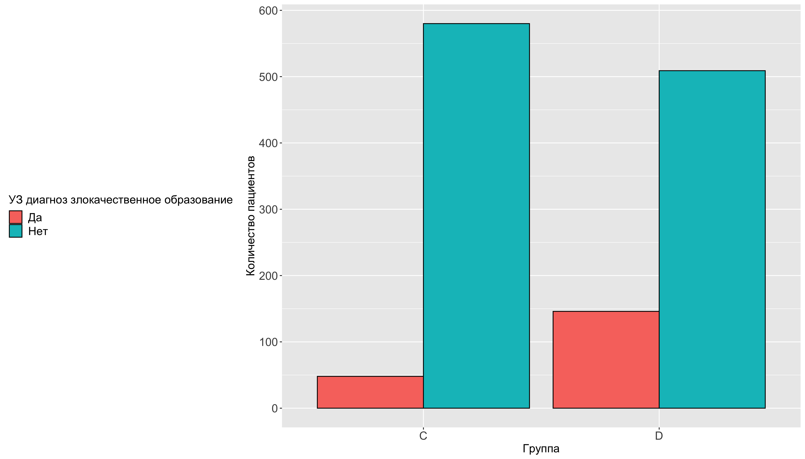

Рисунок №4.17. Определение злокачественного новообразование при УЗ исследовании в группах C и D.

### 4.2.2 Исследование ММГ

*Кожа при ММГ исследовании*

Кожа в группе C не изменена во всех 100% случаях (628/628случаев)[95% ДИ 0.98;1]. В группе D диффузное утолщение в 0.92% (6/655случаев)[95% ДИ 0;0.02], локальное утолщение в 1.07% (7/655случаев)[95% ДИ 0;0.02] и не изменена в 98.01% (642/655случаев)[95% ДИ 0.95;0.98] (Таблица 4.18, Рисунок 4.18).

Таблица №4.18. Кожный покров при ММГ исследовании в группах C и D.

| Кожа                | Процентная доля            | 95% ДИ       | Процентная доля             | 95% ДИ          |
|---------------|---------------|---------------|---------------|---------------|
| Группы              | Группа C                   | ------       | Группа D                    | ------          |
| диффузное утолщение | 0 % ( 0 / 628 случаев)     | [ 0 ; 0.01 ] | 0.916 % ( 6 / 655 случаев)  | [ 0 ; 0.02 ]    |
| локальное утолщение | 0 % ( 0 / 628 случаев)     | [ 0 ; 0.01 ] | 1.069 % ( 7 / 655 случаев)  | [ 0 ; 0.02 ]    |
| не выполнялась      | 0 % ( 0 / 628 случаев)     | [ 0 ; 0.01 ] | 0 % ( 0 / 655 случаев)      | [ 0 ; 0.01 ]    |
| не изменена         | 100 % ( 625 / 628 случаев) | [ 0.98 ; 1 ] | 98.01% ( 642 / 655 случаев) | [ 0.95 ; 0.98 ] |

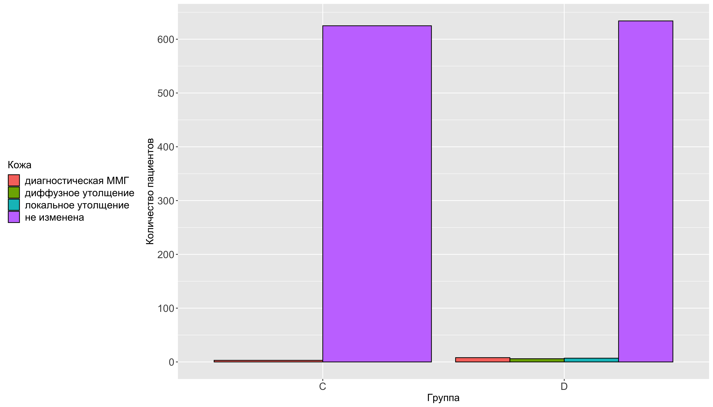

Рисунок №4.18. Кожный покров при ММГ исследовании в группах C и D.

*Ареола при ММГ исследовании*

Ареола в группе C не изменена в 100% (628/628случаев)[95% ДИ 0.99;1].

В группе D не изменена в 98.93% (648/655случаев)[95% ДИ 0.98;1], деформирована в 0.61% (4/655случаев)[95% ДИ 0;0.02] и подтянута в 0.46% (3/655случаев)[95% ДИ 0;0.01] (Таблица 4.19, Рисунок 4.19).

Таблица №4.19. Ареола при ММГ исследовании в группах C и D.

| Ареола         | Процентная доля            | 95% ДИ       | Процентная доля               | 95% ДИ       |
|---------------|---------------|---------------|---------------|---------------|
| Группы         | Группа C                   | ------       | Группа D                      | ------       |
| деформирована  | 0 % ( 0 / 628 случаев)     | [ 0 ; 0.01 ] | 0.611 % ( 4 / 655 случаев)    | [ 0 ; 0.02 ] |
| не изменена    | 100 % ( 628 / 628 случаев) | [ 0.99 ; 1 ] | 98.931 % ( 648 / 655 случаев) | [ 0.98 ; 1 ] |
| не проводилось | 0 % ( 0 / 628 случаев)     | [ 0 ; 0.01 ] | 0 % ( 0 / 655 случаев)        | [ 0 ; 0.01 ] |
| подтянута      | 0 % ( 0 / 628 случаев)     | [ 0 ; 0.01 ] | 0.458 % ( 3 / 655 случаев)    | [ 0 ; 0.01 ] |

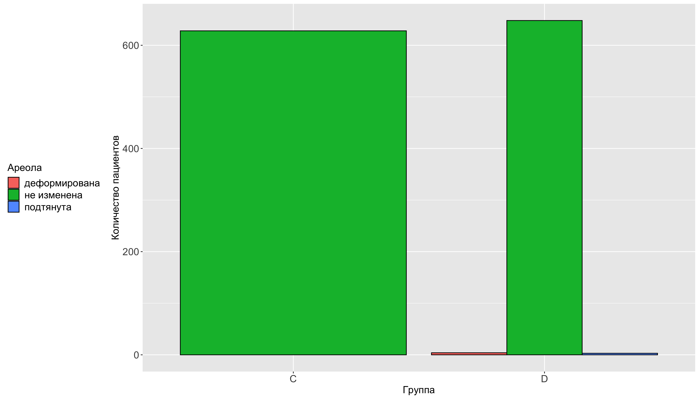

Рисунок №4.19. Ареола при ММГ исследовании в группах C и D.

*Сосок при ММГ исследовании*

Сосок в группе C не изменен в 98.81% (621/628случаев)[95% ДИ 0.97;0.99], втянут в 0.48% (3/628случаев)[95% ДИ 0;0.02] и отечен в 0.64% (4/628случаев)[95% ДИ 0;0.02].

В группе D не изменен в 97.4% (638/655случаев)[95% ДИ 0.96;0.98] и втянут в 2.6% (17/655случаев)[95% ДИ 0.02;0.04] (Таблица 4.20, Рисунок 4.20).

Таблица №4.20. Сосок при ММГ исследовании в группах C и D.

| Сосок      | Процентная доля              | 95% ДИ          | Процентная доля               | 95% ДИ          |
|---------------|---------------|---------------|---------------|---------------|
| Группы     | Группа C                     | ------          | Группа D                      | ------          |
| втянут     | 0.478 % ( 3 / 628 случаев)   | [ 0 ; 0.02 ]    | 2.595 % ( 17 / 655 случаев)   | [ 0.02 ; 0.04 ] |
| не изменен | 98.81 % ( 621 / 628 случаев) | [ 0.97 ; 0.99 ] | 97.405 % ( 638 / 655 случаев) | [ 0.96 ; 0.98 ] |
| отечен     | 0.637 % ( 4 / 628 случаев)   | [ 0 ; 0.02 ]    | 0 % ( 0 / 655 случаев)        | [ 0 ; 0.01 ]    |

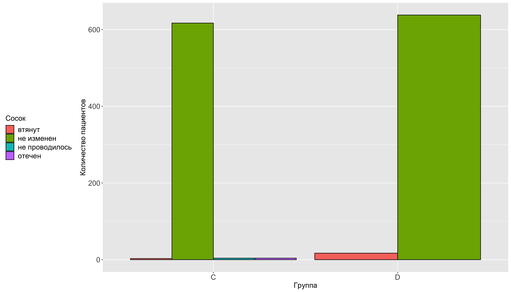

Рисунок №4.20. Сосок при ММГ исследовании в группах C и D.

*Фон при ММГ исследовании*

ММГ-фон в группе C диффузная ФКМ в 39.65% (249/628случаев)[95% ДИ 0.36;0.44], железистая ткань в 58.6% (368/628случаев)[95% ДИ 0.55;0.62], инволюция в 0.48% (3/628случаев)[95% ДИ 0;0.02], нормальная ткань МЖ в 0.64% (4/628случаев)[95% ДИ 0;0.02] и узловая мастопатия в 0.64% (4/628случаев)[95% ДИ 0;0.02]. В группе D диффузная ФКМ в 40.31% (264/655случаев)[95% ДИ 0.37;0.44], железистая ткань в 58.47% (383/655случаев)[95% ДИ 0.55;0.62] и нормальная ткань МЖ в 1.22% (8/655случаев)[95% ДИ 0.01;0.02] (Таблица 4.21, Рисунок 4.21).

Таблица №4.21. Фон при ММГ исследовании в группах C и D.

| ММГ-фон             | Процентная доля               | 95% ДИ          | Процентная доля               | 95% ДИ          |
|---------------|---------------|---------------|---------------|---------------|
| Группы              | Группа C                      | ------          | Группа D                      | ------          |
| диффузная ФКМ       | 39.65 % ( 249 / 628 случаев)  | [ 0.36 ; 0.44 ] | 40.305 % ( 264 / 655 случаев) | [ 0.37 ; 0.44 ] |
| железистая ткань    | 58.599 % ( 368 / 628 случаев) | [ 0.55 ; 0.62 ] | 58.473 % ( 383 / 655 случаев) | [ 0.55 ; 0.62 ] |
| инволюция           | 0.478 % ( 3 / 628 случаев)    | [ 0 ; 0.02 ]    | 0 % ( 0 / 655 случаев)        | [ 0 ; 0.01 ]    |
| нормальная ткань МЖ | 0.637 % ( 4 / 628 случаев)    | [ 0 ; 0.02 ]    | 1.221 % ( 8 / 655 случаев)    | [ 0.01 ; 0.02 ] |
| узловая мастопатия  | 0.637 % ( 4 / 628 случаев)    | [ 0 ; 0.02 ]    | 0 % ( 0 / 655 случаев)        | [ 0 ; 0.01 ]    |

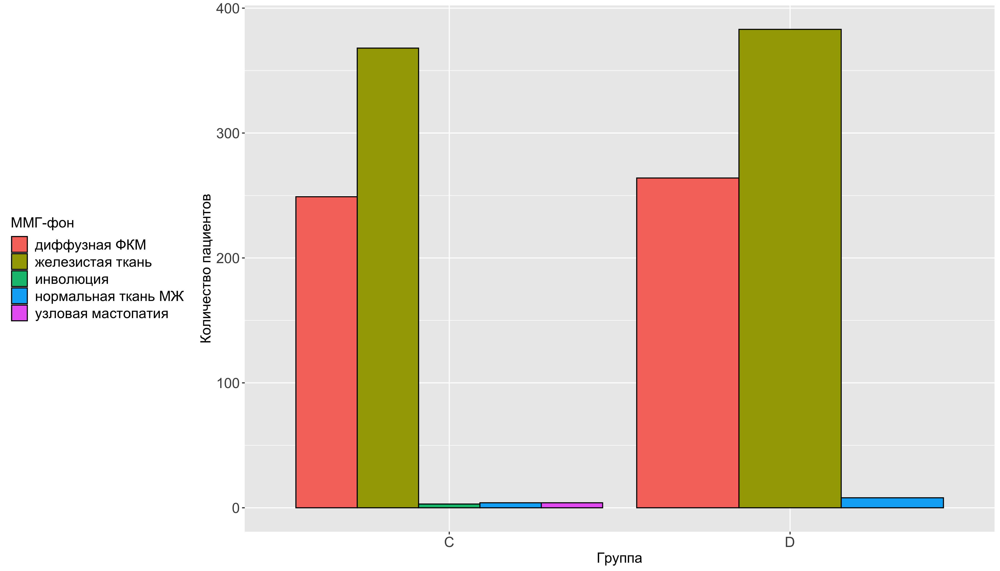

Рисунок №4.21. Фон при ММГ исследовании в группах C и D.

*Определние узлов при ММГ исследовании*

Узлы были найдены в группе C в 8.28% (52/628случаев)[95% ДИ 0.06;0.11]. В группе D в 22.29% (146/655случаев)[95% ДИ 0.19;0.26] (Таблица 4.22, Рисунок 4.22).

Таблица №4.22. Найдены узлы при ММГ исследовании в группах C и D.

| Узлы были найдены | Процентная доля              | 95% ДИ          | Процентная доля              | 95% ДИ          |
|---------------|---------------|---------------|---------------|---------------|
| Группы            | Группа C                     | ------          | Группа D                     | ------          |
| Да                | 8.28 % ( 52 / 628 случаев)   | [ 0.06 ; 0.11 ] | 22.29 % ( 146 / 655 случаев) | [ 0.19 ; 0.26 ] |
| Нет               | 91.72 % ( 576 / 628 случаев) | [ 0.89 ; 0.94 ] | 77.71 % ( 509 / 655 случаев) | [ 0.74 ; 0.81 ] |

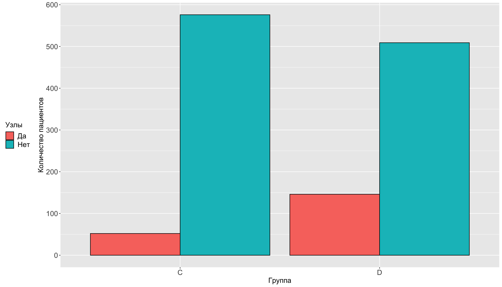

Рисунок №4.22. Найдены узлы при ММГ исследовании в группах C и D.

*Характеристика узлов*

Узел в группе C лучистый в 5.77% (3/52случаев)[95% ДИ 0.02;0.17], неровный в 7.69% (4/52случаев)[95% ДИ 0.02;0.19], ровный в 53.85% (28/52случаев)[95% ДИ 0.4;0.68], участок нарушения архитектоники в 5.77% (3/52случаев)[95% ДИ 0.02;0.17], участок уплотнения в 7.69% (4/52случаев)[95% ДИ 0.02;0.19] и фокус уплотнения в 19.23% (10/52случаев)[95% ДИ 0.1;0.33]. В группе D волнистый в 7.53% (11/146случаев)[95% ДИ 0.04;0.13], дольчатый в 2.05% (3/146случаев)[95% ДИ 0.01;0.06], лучистый в 20.55% (30/146случаев)[95% ДИ 0.14;0.28], неровный в 21.92% (32/146случаев)[95% ДИ 0.16;0.3], образование в 2.05% (3/146случаев)[95% ДИ 0.01;0.06], ровный в 28.77% (42/146случаев)[95% ДИ 0.22;0.37], участок уплотнения в 2.05% (3/146случаев)[95% ДИ 0.01;0.06] и фокус уплотнения в 15.07% (22/146случаев)[95% ДИ 0.1;0.22] (Таблица 4.23, Рисунок 4.23).

Таблица №4.23. Узлы при ММГ исследовании в группах C и D.

| Узлы                            | Процентная доля             | 95% ДИ          | Процентная доля              | 95% ДИ          |
|---------------|---------------|---------------|---------------|---------------|
| Группы                          | Группа C                    | ------          | Группа D                     | ------          |
| лучистый                        | 5.769 % ( 3 / 52 случаев)   | [ 0.02 ; 0.17 ] | 20.548 % ( 30 / 146 случаев) | [ 0.14 ; 0.28 ] |
| неровный                        | 7.692 % ( 4 / 52 случаев)   | [ 0.02 ; 0.19 ] | 21.918 % ( 32 / 146 случаев) | [ 0.16 ; 0.3 ]  |
| ровный                          | 53.846 % ( 28 / 52 случаев) | [ 0.4 ; 0.68 ]  | 28.767 % ( 42 / 146 случаев) | [ 0.22 ; 0.37 ] |
| участок нарушения архитектоники | 5.769 % ( 3 / 52 случаев)   | [ 0.02 ; 0.17 ] | 0 % ( 0 / 146 случаев)       | [ 0 ; 0.03 ]    |
| участок уплотнения              | 7.692 % ( 4 / 52 случаев)   | [ 0.02 ; 0.19 ] | 2.055 % ( 3 / 146 случаев)   | [ 0.01 ; 0.06 ] |
| фокус уплотнения                | 19.231 % ( 10 / 52 случаев) | [ 0.1 ; 0.33 ]  | 15.068 % ( 22 / 146 случаев) | [ 0.1 ; 0.22 ]  |

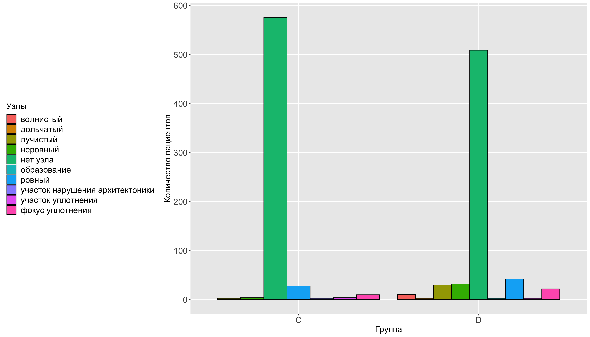

Рисунок №4.23. Узлы при ММГ исследовании в группах C и D.

*Края узлов при ММГ исследовании*

Край узлов в группе C нечеткий в 38.46% (20/52случаев)[95% ДИ 0.26;0.53], полициклический в 13.46% (7/52случаев)[95% ДИ 0.06;0.26], и четкий в 48.08% (25/52случаев)[95% ДИ 0.34;0.62]. В группе D нечеткий в 57.53% (84/146случаев)[95% ДИ 0.49;0.66], полициклический в 6.85% (10/146случаев)[95% ДИ 0.04;0.13], размытый в 5.48% (8/146случаев)[95% ДИ 0.03;0.11] и четкий в 30.14% (44/146случаев)[95% ДИ 0.23;0.38] (Таблица 4.24, Рисунок 4.24).

Таблица №4.24. Края узлов при ММГ исследовании в группах C и D.

| Края узлов      | Процентная доля             | 95% ДИ          | Процентная доля              | 95% ДИ          |
|---------------|---------------|---------------|---------------|---------------|
| Группы          | Группа C                    | ------          | Группа D                     | ------          |
| не проводилось  | 0 % ( 0 / 52 случаев)       | [ 0 ; 0.09 ]    | 0 % ( 0 / 146 случаев)       | [ 0 ; 0.03 ]    |
| нет             | 0 % ( 0 / 52 случаев)       | [ 0 ; 0.09 ]    | 0 % ( 0 / 146 случаев)       | [ 0 ; 0.03 ]    |
| нечеткий        | 38.462 % ( 20 / 52 случаев) | [ 0.26 ; 0.53 ] | 57.534 % ( 84 / 146 случаев) | [ 0.49 ; 0.66 ] |
| полициклический | 13.462 % ( 7 / 52 случаев)  | [ 0.06 ; 0.26 ] | 6.849 % ( 10 / 146 случаев)  | [ 0.04 ; 0.13 ] |
| размытый        | 0 % ( 0 / 52 случаев)       | [ 0 ; 0.09 ]    | 5.479 % ( 8 / 146 случаев)   | [ 0.03 ; 0.11 ] |
| четкий          | 48.077 % ( 25 / 52 случаев) | [ 0.34 ; 0.62 ] | 30.137 % ( 44 / 146 случаев) | [ 0.23 ; 0.38 ] |

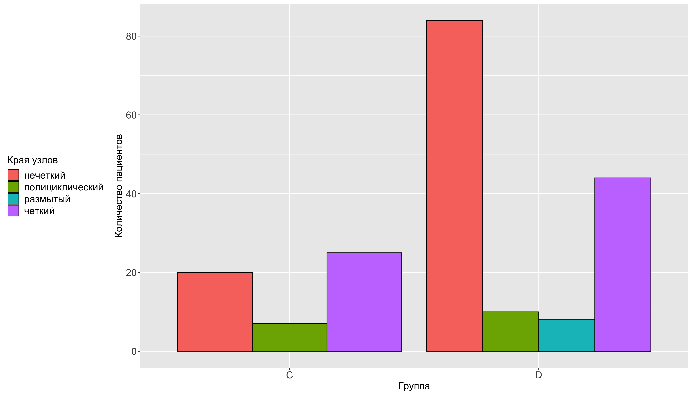

Рисунок №4.24. Края узлов при ММГ исследовании в группах C и D.

*Размер узлов при ММГ исследовании*

Размер узлов в группе C 0,5-1,0 в 11.54% (6/52случаев)[95% ДИ 0.05;0.24], 1,1-1,5см в 23.08% (12/52случаев)[95% ДИ 0.13;0.37], 1,6-2,0см в 38.46% (20/52случаев)[95% ДИ 0.26;0.53], 2,6-3,0см в 19.23% (10/52случаев)[95% ДИ 0.1;0.33] и более 3 см в 7.69% (4/52случаев)[95% ДИ 0.02;0.19]. В группе D 0,5-1,0 в 23.97% (35/146случаев)[95% ДИ 0.17;0.32], 1,1-1,5см в 26.71% (39/146случаев)[95% ДИ 0.2;0.35], 1,6-2,0см в 23.29% (34/146случаев)[95% ДИ 0.17;0.31], 2,1-2,5см в 8.22% (12/146случаев)[95% ДИ 0.05;0.14], 2,6-3,0см в 8.9% (13/146случаев)[95% ДИ 0.05;0.15] и более 3 см в 8.9% (13/146случаев)[95% ДИ 0.05;0.15] (Таблица 4.25, Рисунок 4.25).

Таблица №4.25. Размер узлов при ММГ исследовании в группах C и D.

| Размер узлов   | Процентная доля             | 95% ДИ          | Процентная доля              | 95% ДИ          |
|---------------|---------------|---------------|---------------|---------------|
| Группы         | Группа C                    | ------          | Группа D                     | ------          |
| 0,5-1,0        | 11.538 % ( 6 / 52 случаев)  | [ 0.05 ; 0.24 ] | 23.973 % ( 35 / 146 случаев) | [ 0.17 ; 0.32 ] |
| 1,1-1,5см      | 23.077 % ( 12 / 52 случаев) | [ 0.13 ; 0.37 ] | 26.712 % ( 39 / 146 случаев) | [ 0.2 ; 0.35 ]  |
| 1,6-2,0см      | 38.462 % ( 20 / 52 случаев) | [ 0.26 ; 0.53 ] | 23.288 % ( 34 / 146 случаев) | [ 0.17 ; 0.31 ] |
| 2,1-2,5см      | 0 % ( 0 / 52 случаев)       | [ 0 ; 0.09 ]    | 8.219 % ( 12 / 146 случаев)  | [ 0.05 ; 0.14 ] |
| 2,6-3,0см      | 19.231 % ( 10 / 52 случаев) | [ 0.1 ; 0.33 ]  | 8.904 % ( 13 / 146 случаев)  | [ 0.05 ; 0.15 ] |
| более 3 см     | 7.692 % ( 4 / 52 случаев)   | [ 0.02 ; 0.19 ] | 8.904 % ( 13 / 146 случаев)  | [ 0.05 ; 0.15 ] |
| не проводилось | 0 % ( 0 / 52 случаев)       | [ 0 ; 0.09 ]    | 0 % ( 0 / 146 случаев)       | [ 0 ; 0.03 ]    |
| нет            | 0 % ( 0 / 52 случаев)       | [ 0 ; 0.09 ]    | 0 % ( 0 / 146 случаев)       | [ 0 ; 0.03 ]    |

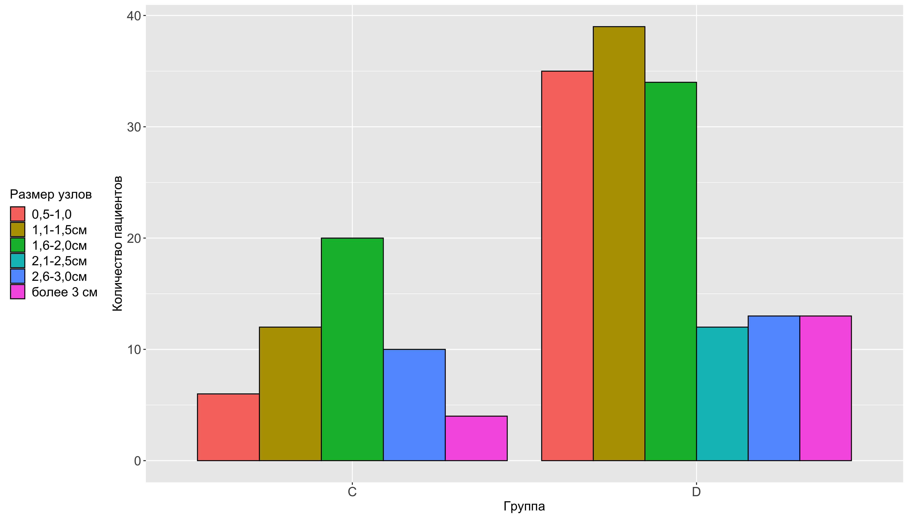

Рисунок №4.25. Размер узлов при ММГ исследовании в группах C и D.

*Количество визуализируемых узлов при ММГ исследовании*

Количество визуализируемых образований в группе C одно в 86.54% (45/52случаев)[95% ДИ 0.74;0.94] и участок асимметрии в 13.46% (7/52случаев)[95% ДИ 0.06;0.26]. В группе D одно в 80.14% (117/146случаев)[95% ДИ 0.73;0.86], два в 2.74% (4/146случаев)[95% ДИ 0.01;0.07], четыре в 2.05% (3/146случаев)[95% ДИ 0.01;0.06] и участок асимметрии в 15.07% (22/146случаев)[95% ДИ 0.1;0.22] (Таблица 4.26, Рисунок 4.26).

Таблица №4.26. Количество визуализируемых образований при ММГ исследовании в группах C и D.

| Количество визуализируемых образований | Процентная доля             | 95% ДИ          | Процентная доля               | 95% ДИ          |
|---------------|---------------|---------------|---------------|---------------|
| Группы                                 | Группа C                    | ------          | Группа D                      | ------          |
| два                                    | 0 % ( 0 / 52 случаев)       | [ 0 ; 0.09 ]    | 2.74 % ( 4 / 146 случаев)     | [ 0.01 ; 0.07 ] |
| не определяется                        | 0 % ( 0 / 52 случаев)       | [ 0 ; 0.09 ]    | 0 % ( 0 / 146 случаев)        | [ 0 ; 0.03 ]    |
| не проводилось                         | 0 % ( 0 / 52 случаев)       | [ 0 ; 0.09 ]    | 0 % ( 0 / 146 случаев)        | [ 0 ; 0.03 ]    |
| одно                                   | 86.538 % ( 45 / 52 случаев) | [ 0.74 ; 0.94 ] | 80.137 % ( 117 / 146 случаев) | [ 0.73 ; 0.86 ] |
| участок асимметрии                     | 13.462 % ( 7 / 52 случаев)  | [ 0.06 ; 0.26 ] | 15.068 % ( 22 / 146 случаев)  | [ 0.1 ; 0.22 ]  |
| четыре                                 | 0 % ( 0 / 52 случаев)       | [ 0 ; 0.09 ]    | 2.055 % ( 3 / 146 случаев)    | [ 0.01 ; 0.06 ] |

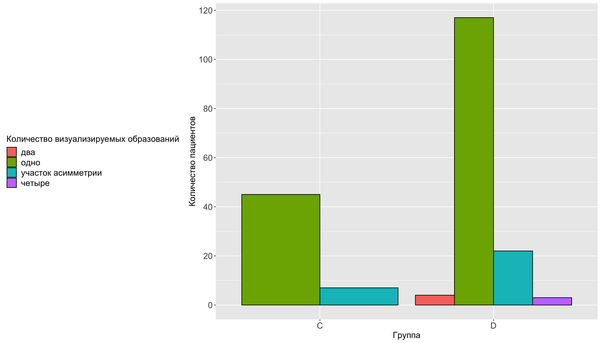

Рисунок №4.26. Количество визуализируемых образований при ММГ исследовании в группах C и D.

*Количество узлов при ММГ исследовании*

Количество узлов в группе C один узел в 100% (52/52случаев)[95% ДИ 0.91;1]. В группе D один в 95.89% (140/146случаев)[95% ДИ 0.91;0.98], два в 2.05% (3/146случаев)[95% ДИ 0.01;0.06] и множественные в 2.05% (3/146случаев)[95% ДИ 0.01;0.06] (Таблица 4.27, Рисунок 4.27).

Таблица №4.27. Количество узлов при ММГ исследовании в группах C и D.

| Количество узлов | Процентная доля          | 95% ДИ       | Процентная доля              | 95% ДИ          |
|---------------|---------------|---------------|---------------|---------------|
| Группы           | Группа C                 | ------       | Группа D                     | ------          |
| один             | 100 % ( 52 / 52 случаев) | [ 0.91 ; 1 ] | 95.89 % ( 140 / 146 случаев) | [ 0.91 ; 0.98 ] |
| два              | 0 % ( 0 / 52 случаев)    | [ 0 ; 0.09 ] | 2.055 % ( 3 / 146 случаев)   | [ 0.01 ; 0.06 ] |
| множественные    | 0 % ( 0 / 52 случаев)    | [ 0 ; 0.09 ] | 2.055 % ( 3 / 146 случаев)   | [ 0.01 ; 0.06 ] |

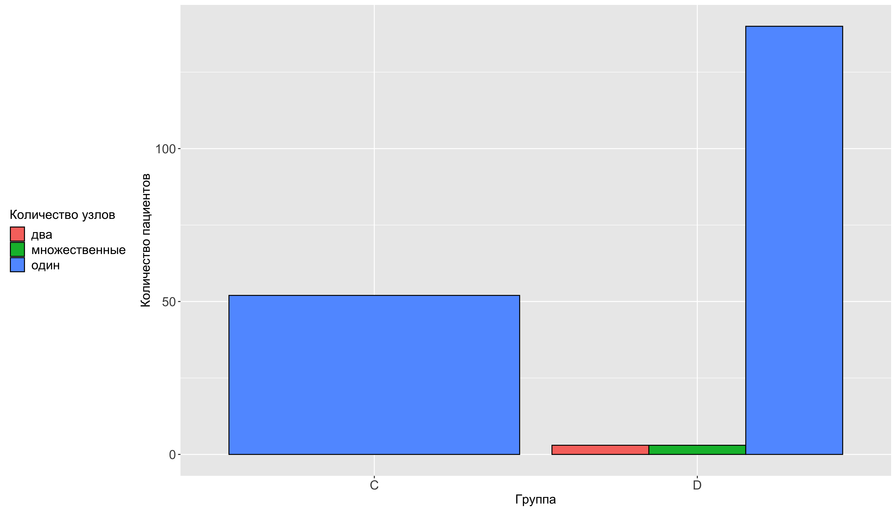

Рисунок №4.27. Количество узлов при ММГ исследовании в группах C и D.

*Кальльцификаты при ММГ исследовании*

Кальльцификаты в группе C диффузные в 0.64% (4/628случаев)[95% ДИ 0;0.02], единичные мелкие в 4.62% (29/628случаев)[95% ДИ 0.03;0.07], нет в 89.65% (563/628случаев)[95% ДИ 0.87;0.92], плеоморфные в 0.64% (4/628случаев)[95% ДИ 0;0.02], полиморфные в 1.59% (10/628случаев)[95% ДИ 0.01;0.03], разнокалиберные в 0.64% (4/628случаев)[95% ДИ 0;0.02] и сгруппированные в 2.23% (14/628случаев)[95% ДИ 0.01;0.04]. В группе D диффузные в 1.22% (8/655случаев)[95% ДИ 0.01;0.02], единичные мелкие в 11.76% (77/655случаев)[95% ДИ 0.09;0.15], крупные в 1.22% (8/655случаев)[95% ДИ 0.01;0.02], микрокальцинаты в 0.46% (3/655случаев)[95% ДИ 0;0.01].множественные точечные в 0.46% (3/655случаев)[95% ДИ 0;0.01], нет в 77.25% (506/655случаев)[95% ДИ 0.74;0.8], плеоморфные в 1.07% (7/655случаев)[95% ДИ 0;0.02], по типу пудры в 0.46% (3/655случаев)[95% ДИ 0;0.01], полиморфные в 3.82% (25/655случаев)[95% ДИ 0.03;0.06], разнокалиберные в 0.61% (4/655случаев)[95% ДИ 0;0.02] и сгруппированные в 1.68% (11/655случаев)[95% ДИ 0.01;0.03] (Таблица 4.28, Рисунок 4.28).

Таблица №4.28. Кальльцификаты при ММГ исследовании в группах C и D.

| Кальльцификаты         | Процентная доля              | 95% ДИ          | Процентная доля               | 95% ДИ          |
|---------------|---------------|---------------|---------------|---------------|
| Группы                 | Группа C                     | ------          | Группа D                      | ------          |
| диффузные              | 0.637 % ( 4 / 628 случаев)   | [ 0 ; 0.02 ]    | 1.221 % ( 8 / 655 случаев)    | [ 0.01 ; 0.02 ] |
| единичные мелкие       | 4.618 % ( 29 / 628 случаев)  | [ 0.03 ; 0.07 ] | 11.756 % ( 77 / 655 случаев)  | [ 0.09 ; 0.15 ] |
| крупные                | 0 % ( 0 / 628 случаев)       | [ 0 ; 0.01 ]    | 1.221 % ( 8 / 655 случаев)    | [ 0.01 ; 0.02 ] |
| микрокальцинаты        | 0 % ( 0 / 628 случаев)       | [ 0 ; 0.01 ]    | 0.458 % ( 3 / 655 случаев)    | [ 0 ; 0.01 ]    |
| множественные точечные | 0 % ( 0 / 628 случаев)       | [ 0 ; 0.01 ]    | 0.458 % ( 3 / 655 случаев)    | [ 0 ; 0.01 ]    |
| нет                    | 89.65 % ( 563 / 628 случаев) | [ 0.87 ; 0.92 ] | 77.252 % ( 506 / 655 случаев) | [ 0.74 ; 0.8 ]  |
| плеоморфные            | 0.637 % ( 4 / 628 случаев)   | [ 0 ; 0.02 ]    | 1.069 % ( 7 / 655 случаев)    | [ 0 ; 0.02 ]    |
| по типу пудры          | 0 % ( 0 / 628 случаев)       | [ 0 ; 0.01 ]    | 0.458 % ( 3 / 655 случаев)    | [ 0 ; 0.01 ]    |
| полиморфные            | 1.592 % ( 10 / 628 случаев)  | [ 0.01 ; 0.03 ] | 3.817 % ( 25 / 655 случаев)   | [ 0.03 ; 0.06 ] |
| разнокалиберные        | 0.637 % ( 4 / 628 случаев)   | [ 0 ; 0.02 ]    | 0.611 % ( 4 / 655 случаев)    | [ 0 ; 0.02 ]    |
| сгруппированные        | 2.229 % ( 14 / 628 случаев)  | [ 0.01 ; 0.04 ] | 1.679 % ( 11 / 655 случаев)   | [ 0.01 ; 0.03 ] |

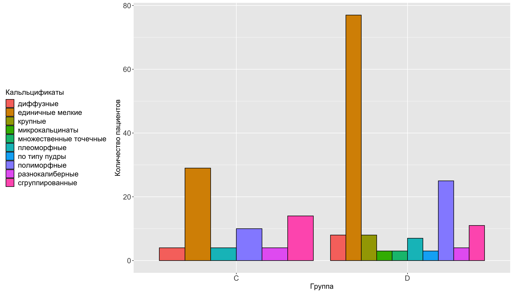

Рисунок №4.28. Кальльцификаты при ММГ исследовании в группах C и D.

*Подмышечные лимфоузлы при ММГ исследовании*

Подмышечные лимфоузлы в группе C метастатически изменены в 0.48% (3/628случаев)[95% ДИ 0;0.02], не визуализируются в 85.51% (537/628случаев)[95% ДИ 0.82;0.88], не увеличены в 13.54% (85/628случаев)[95% ДИ 0.11;0.17] и увеличены, жировая инволюция в 0.48% (3/628случаев)[95% ДИ 0;0.02].

В группе D метастатически изменены в 0.92% (6/655случаев)[95% ДИ 0;0.02], не визуализируются в 85.5% (560/655случаев)[95% ДИ 0.83;0.88], не увеличены в 13.59% (89/655случаев)[95% ДИ 0.11;0.17] и увеличены, жировая инволюция в 0% (0/655случаев)[95% ДИ 0;0.01] (Таблица 4.29, Рисунок 4.29).

Таблица №4.29. Подмышечные лимфоузлы при ММГ исследовании в группах C и D.

| Подмышечные лимфоузлы        | Процентная доля              | 95% ДИ          | Процентная доля               | 95% ДИ          |
|---------------|---------------|---------------|---------------|---------------|
| Группы                       | Группа C                     | ------          | Группа D                      | ------          |
| метастатически изменены      | 0.478 % ( 3 / 628 случаев)   | [ 0 ; 0.02 ]    | 0.916 % ( 6 / 655 случаев)    | [ 0 ; 0.02 ]    |
| не визуализируются           | 85.51 % ( 537 / 628 случаев) | [ 0.82 ; 0.88 ] | 85.496 % ( 560 / 655 случаев) | [ 0.83 ; 0.88 ] |
| не увеличены                 | 13.535 % ( 85 / 628 случаев) | [ 0.11 ; 0.17 ] | 13.588 % ( 89 / 655 случаев)  | [ 0.11 ; 0.17 ] |
| увеличены, жировая инволюция | 0.478 % ( 3 / 628 случаев)   | [ 0 ; 0.02 ]    | 0 % ( 0 / 655 случаев)        | [ 0 ; 0.01 ]    |

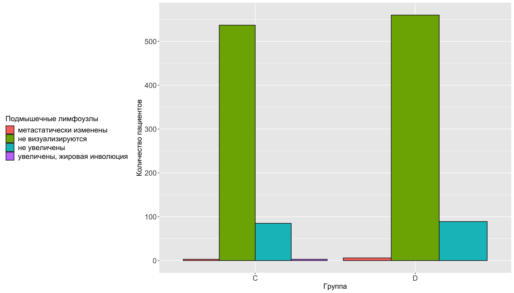

Рисунок №4.29. Подмышечные лимфоузлы при ММГ исследовании в группах C и D.

*Категория BI-RADS при ММГ исследовании*

В группе C категория Birads 1 была поставлена в 1.27% (8/628случаев)[95% ДИ 0.01;0.03], Birads 2 в 94.42% (595/628случаев)[95% ДИ 0.91;0.95], Birads 3 в 1.11% (7/628случаев)[95% ДИ 0;0.02], Birads 4b в 0.48% (3/628случаев)[95% ДИ 0;0.02], Birads 4c в 1.11% (7/628случаев)[95% ДИ 0;0.02], Birads 4а в 0.96% (6/628случаев)[95% ДИ 0;0.02] и Birads 5 в 0.64% (4/628случаев)[95% ДИ 0;0.02]. В группе D Birads 0 в 1.22% (8/655случаев)[95% ДИ 0.01;0.02], Birads 1 в 3.36% (22/655случаев)[95% ДИ 0.02;0.05], Birads 2 в 76.49% (501/655случаев)[95% ДИ 0.73;0.8], Birads 3 в 6.26% (41/655случаев)[95% ДИ 0.05;0.08], Birads 4b в 3.21% (21/655случаев)[95% ДИ 0.02;0.05], Birads 4c в 2.29% (15/655случаев)[95% ДИ 0.01;0.04], Birads 4а в 5.04% (33/655случаев)[95% ДИ 0.04;0.07] и Birads 5 в 2.14% (14/655случаев)[95% ДИ 0.01;0.04] (Таблица 4.30, Рисунок 4.30).

Таблица №4.30. Категория BI-RADS по результатам выполнения ММГ в группах C и D.

| Категория BI-RADS | Процентная доля              | 95% ДИ          | Процентная доля               | 95% ДИ          |
|---------------|---------------|---------------|---------------|---------------|
| Группы            | Группа C                     | ------          | Группа D                      | ------          |
| Birads 0          | 0 % ( 0 / 628 случаев)       | [ 0 ; 0.01 ]    | 1.221 % ( 8 / 655 случаев)    | [ 0.01 ; 0.02 ] |
| Birads 1          | 1.274 % ( 8 / 628 случаев)   | [ 0.01 ; 0.03 ] | 3.359 % ( 22 / 655 случаев)   | [ 0.02 ; 0.05 ] |
| Birads 2          | 94.42 % ( 595 / 628 случаев) | [ 0.91 ; 0.95 ] | 76.489 % ( 501 / 655 случаев) | [ 0.73 ; 0.8 ]  |
| Birads 3          | 1.115 % ( 7 / 628 случаев)   | [ 0 ; 0.02 ]    | 6.26 % ( 41 / 655 случаев)    | [ 0.05 ; 0.08 ] |
| Birads 4b         | 0.478 % ( 3 / 628 случаев)   | [ 0 ; 0.02 ]    | 3.206 % ( 21 / 655 случаев)   | [ 0.02 ; 0.05 ] |
| Birads 4c         | 1.115 % ( 7 / 628 случаев)   | [ 0 ; 0.02 ]    | 2.29 % ( 15 / 655 случаев)    | [ 0.01 ; 0.04 ] |
| Birads 4а         | 0.955 % ( 6 / 628 случаев)   | [ 0 ; 0.02 ]    | 5.038 % ( 33 / 655 случаев)   | [ 0.04 ; 0.07 ] |
| Birads 5          | 0.637 % ( 4 / 628 случаев)   | [ 0 ; 0.02 ]    | 2.137 % ( 14 / 655 случаев)   | [ 0.01 ; 0.04 ] |

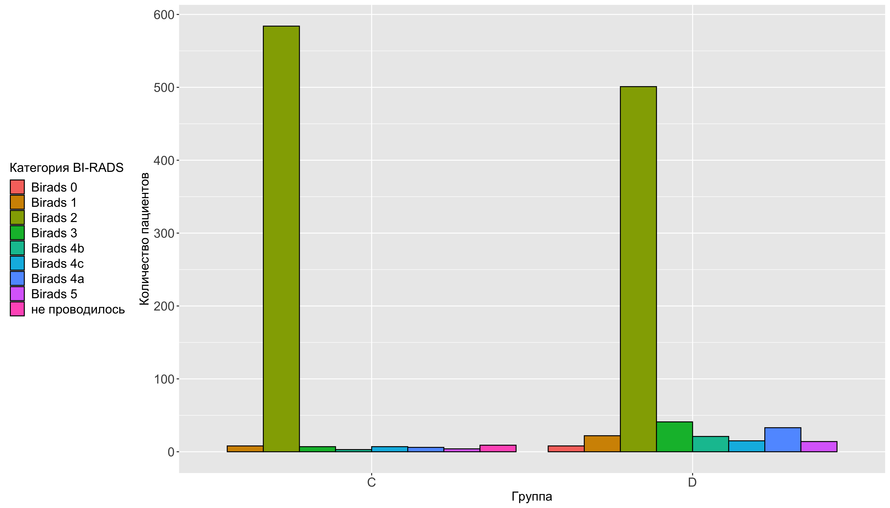

Рисунок №4.30. Категория BI-RADS по результатам выполнения ММГ в группах C и D.

*Заключение ММГ*

ММГ заключение в группе C Susp Ca в 3.66% (23/628случаев) [95% ДИ 0.02;0.06], без патологии в 0.64% (4/628случаев) [95% ДИ 0;0.02], дифузный фиброаденоматоз в 89.97% (565/628случаев) [95% ДИ 0.87;0.92], интраммарные лимфоузлы в 1.11% (7/628случаев) [95% ДИ 0;0.02], киста в 1.11% (7/628случаев) [95% ДИ 0;0.02], кластер кальцинатов в 0.64% (4/628случаев) [95% ДИ 0;0.02], локализованный фиброаденоматоз в 0.64% (4/628случаев) [95% ДИ 0;0.02], не проводилось в 0% (0/628случаев) [95% ДИ 0;0.01], образование в 0% (0/628случаев) [95% ДИ 0;0.01] и фиброаденома в 2.23% (14/628случаев) [95% ДИ 0.01;0.04]. В группе D Susp Ca в 12.21% (80/655случаев) [95% ДИ 0.1;0.15], без патологии в 0.61% (4/655случаев) [95% ДИ 0;0.02], дифузный фиброаденоматоз в 75.11% (492/655случаев) [95% ДИ 0.72;0.78], интраммарные лимфоузлы в 0.46% (3/655случаев) [95% ДИ 0;0.01], киста в 1.07% (7/655случаев) [95% ДИ 0;0.02], кластер кальцинатов в 1.07% (7/655случаев) [95% ДИ 0;0.02], локализованный фиброаденоматоз в 4.43% (29/655случаев) [95% ДИ 0.03;0.06], не проводилось в 0% (0/655случаев) [95% ДИ 0;0.01], образование в 0.46% (3/655случаев) [95% ДИ 0;0.01] и фиброаденома в 4.58% (30/655случаев) [95% ДИ 0.03;0.07] (Таблица 4.31, Рисунок 4.31).

Таблица №4.31. Заключение по результатам выполнения ММГ в группах C и D.

| ММГ заключение                 | Процентная доля               | 95% ДИ          | Процентная доля               | 95% ДИ          |
|---------------|---------------|---------------|---------------|---------------|
| Группы                         | Группа C                      | ------          | Группа D                      | ------          |
| Susp Ca                        | 3.662 % ( 23 / 628 случаев)   | [ 0.02 ; 0.06 ] | 12.214 % ( 80 / 655 случаев)  | [ 0.1 ; 0.15 ]  |
| без патологии                  | 0.637 % ( 4 / 628 случаев)    | [ 0 ; 0.02 ]    | 0.611 % ( 4 / 655 случаев)    | [ 0 ; 0.02 ]    |
| дифузный фиброаденоматоз       | 89.968 % ( 565 / 628 случаев) | [ 0.87 ; 0.92 ] | 75.115 % ( 492 / 655 случаев) | [ 0.72 ; 0.78 ] |
| интраммарные лимфоузлы         | 1.115 % ( 7 / 628 случаев)    | [ 0 ; 0.02 ]    | 0.458 % ( 3 / 655 случаев)    | [ 0 ; 0.01 ]    |
| киста                          | 1.115 % ( 7 / 628 случаев)    | [ 0 ; 0.02 ]    | 1.069 % ( 7 / 655 случаев)    | [ 0 ; 0.02 ]    |
| кластер кальцинатов            | 0.637 % ( 4 / 628 случаев)    | [ 0 ; 0.02 ]    | 1.069 % ( 7 / 655 случаев)    | [ 0 ; 0.02 ]    |
| локализованный фиброаденоматоз | 0.637 % ( 4 / 628 случаев)    | [ 0 ; 0.02 ]    | 4.427 % ( 29 / 655 случаев)   | [ 0.03 ; 0.06 ] |
| образование                    | 0 % ( 0 / 628 случаев)        | [ 0 ; 0.01 ]    | 0.458 % ( 3 / 655 случаев)    | [ 0 ; 0.01 ]    |
| фиброаденома                   | 2.229 % ( 14 / 628 случаев)   | [ 0.01 ; 0.04 ] | 4.58 % ( 30 / 655 случаев)    | [ 0.03 ; 0.07 ] |

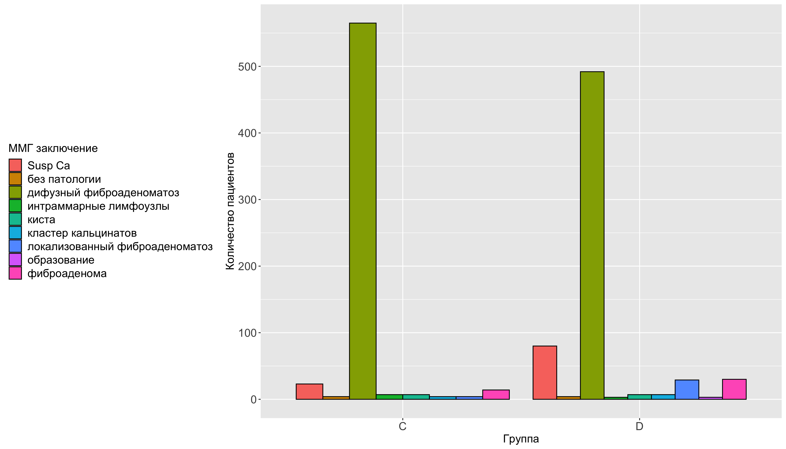

Рисунок №4.31. Заключение по результатам выполнения ММГв группах А и B.

*Злокачественное новообразование по результатам выполнения ММГ*

ММГ диагноз злокачественное образование был поставлен в группе C в 3.66% (23/628случаев)[95% ДИ 0.02;0.06]. В группе D в 12.21% (80/655случаев)[95% ДИ 0.1;0.15] (Таблица 4.32, Рисунок 4.32).

Таблица №4.32. Злокачественное новообразование по результатам выполнения ММГ в группах C и D.

| ММГ диагноз злокачественное образование | Процентная доля               | 95% ДИ          | Процентная доля               | 95% ДИ         |
|---------------|---------------|---------------|---------------|---------------|
| Группы                                  | Группа C                      | ------          | Группа D                      | ------         |
| Да                                      | 3.662 % ( 23 / 628 случаев)   | [ 0.02 ; 0.06 ] | 12.214 % ( 80 / 655 случаев)  | [ 0.1 ; 0.15 ] |
| Нет                                     | 96.338 % ( 605 / 628 случаев) | [ 0.94 ; 0.98 ] | 87.786 % ( 575 / 655 случаев) | [ 0.85 ; 0.9 ] |

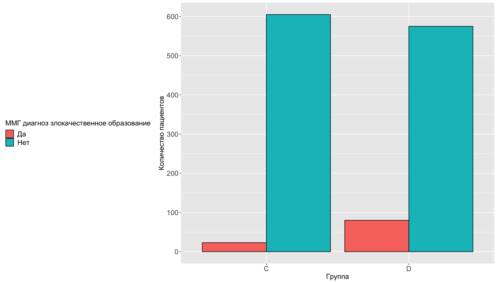

Рисунок №4.32. Злокачественное новообразование по результатам выполнения ММГ А и B.

### 4.2.3 Исследование МРТ

*Данные МРТ исследования*

В группе C были интраммарные лимфоузлы в 59.52% (25/42случаев)[95% ДИ 0.43;0.74] и сегментарно-протоковая зона контрастирования в 40.48% (17/42случаев)[95% ДИ 0.26;0.57]. В группе D были интраммарные лимфоузлы в 60% (33/55случаев)[95% ДИ 0.46;0.73] и сегментарно-протоковая зона контрастирования в 40% (22/55случаев)[95% ДИ 0.27;0.54] (Таблица 4.33, Рисунок 4.33).

Таблица №4.33. Данные МРТ в группах C и D.

| Данные МРТ                                   | Процентная доля             | 95% ДИ          | Процентная доля         | 95% ДИ          |
|---------------|---------------|---------------|---------------|---------------|
| Группы                                       | Группа C                    | ------          | Группа D                | ------          |
| интраммарные лимфоузлы                       | 59.524 % ( 25 / 42 случаев) | [ 0.43 ; 0.74 ] | 60 % ( 33 / 55 случаев) | [ 0.46 ; 0.73 ] |
| сегментарно-протоковая зона контрастирования | 40.476 % ( 17 / 42 случаев) | [ 0.26 ; 0.57 ] | 40 % ( 22 / 55 случаев) | [ 0.27 ; 0.54 ] |

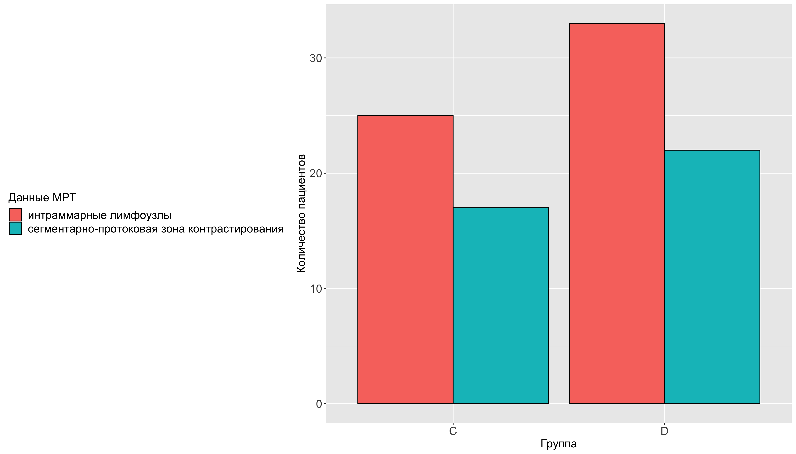

Рисунок №4.33. Данные МРТ в группах C и D.

*Количество узлов на МРТ*

В группе C определен один узел в 80.95% (34/42случаев)[95% ДИ 0.65;0.91], два в 14.29% (6/42случаев)[95% ДИ 0.06;0.29], три в 0% (0/42случаев)[95% ДИ 0;0.1], множественные в 0% (0/42случаев)[95% ДИ 0;0.1] и не определены в 4.76% (2/42случаев)[95% ДИ 0.01;0.17]. В группе D был один узел в 72.73% (40/55случаев)[95% ДИ 0.59;0.83], два в 12.73% (7/55случаев)[95% ДИ 0.06;0.25], три в 1.82% (1/55случаев)[95% ДИ 0;0.11], множественные в 5.45% (3/55случаев)[95% ДИ 0.01;0.16] и не определены в 7.27% (4/55случаев)[95% ДИ 0.02;0.18] (Таблица 4.34, Рисунок 4.34).

Таблица №4.34. Количество узлов на МРТ в группах C и D.

| Количество узлов на МРТ | Процентная доля             | 95% ДИ          | Процентная доля             | 95% ДИ          |
|---------------|---------------|---------------|---------------|---------------|
| Группы                  | Группа C                    | ------          | Группа D                    | ------          |
| один                    | 80.952 % ( 34 / 42 случаев) | [ 0.65 ; 0.91 ] | 72.727 % ( 40 / 55 случаев) | [ 0.59 ; 0.83 ] |
| два                     | 14.286 % ( 6 / 42 случаев)  | [ 0.06 ; 0.29 ] | 12.727 % ( 7 / 55 случаев)  | [ 0.06 ; 0.25 ] |
| три                     | 0 % ( 0 / 42 случаев)       | [ 0 ; 0.1 ]     | 1.818 % ( 1 / 55 случаев)   | [ 0 ; 0.11 ]    |
| множественные           | 0 % ( 0 / 42 случаев)       | [ 0 ; 0.1 ]     | 5.455 % ( 3 / 55 случаев)   | [ 0.01 ; 0.16 ] |
| не определены           | 4.762 % ( 2 / 42 случаев)   | [ 0.01 ; 0.17 ] | 7.273 % ( 4 / 55 случаев)   | [ 0.02 ; 0.18 ] |

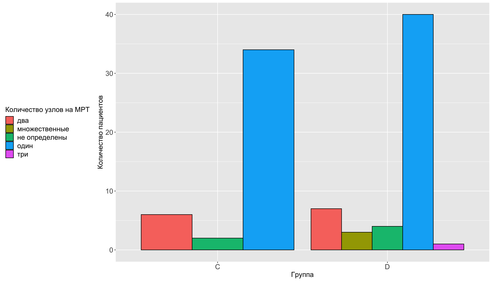

Рисунок №4.34. Количество узлов на МРТ в группах C и D.

### 4.2.4 Гистологическая оценка

*Морфологическая структура*

Морфологическая структура в группе C была инвазивный рак неспециального типа в 100% (17/17случаев)[95% ДИ 0.77;1]. В группе D инвазивный дольковый рак в 9.52% (8/84случаев)[95% ДИ 0.04;0.18], инвазивный рак неспециального типа в 82.14% (69/84случаев)[95% ДИ 0.72;0.89] и протоковый рак in situ в 8.33% (7/84случаев)[95% ДИ 0.04;0.17] (Таблица 4.35, Рисунок 4.35).

Таблица №4.35. Морфологическая структура гистопрепаратов в группах C и D.

| Морфологическая структура          | Процентная доля          | 95% ДИ       | Процентная доля             | 95% ДИ          |
|---------------|---------------|---------------|---------------|---------------|
| Группы                             | Группа C                 | ------       | Группа D                    | ------          |
| инвазивный дольковый рак           | 0 % ( 0 / 17 случаев)    | [ 0 ; 0.23 ] | 9.524 % ( 8 / 84 случаев)   | [ 0.04 ; 0.18 ] |
| инвазивный рак неспециального типа | 100 % ( 17 / 17 случаев) | [ 0.77 ; 1 ] | 82.143 % ( 69 / 84 случаев) | [ 0.72 ; 0.89 ] |
| протоковый рак in situ             | 0 % ( 0 / 17 случаев)    | [ 0 ; 0.23 ] | 8.333 % ( 7 / 84 случаев)   | [ 0.04 ; 0.17 ] |

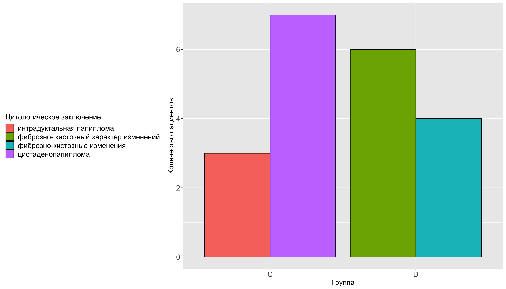

Рисунок №4.35. Морфологическая структура гистопрепаратов в группах C и D.

*Цитологическое заключение*

Цитологическое заключение в группе C было интрадуктальная папиллома в 30% (3/10случаев)[95% ДИ 0.08;0.65] и цистаденопапиллома в 70% (7/10случаев)[95% ДИ 0.35;0.92]. В группе D фиброзно- кистозный характер изменений в 60% (6/10случаев)[95% ДИ 0.27;0.86] и фиброзно-кистозные изменения в 40% (4/10случаев)[95% ДИ 0.14;0.73] (Таблица 4.36, Рисунок 4.36).

Таблица №4.36. Цитологическое исследование материалов в группах C и D.

| Цитологическое заключение              | Процентная доля        | 95% ДИ          | Процентная доля        | 95% ДИ          |
|---------------|---------------|---------------|---------------|---------------|
| Группы                                 | Группа C               | ------          | Группа D               | ------          |
| интрадуктальная папиллома              | 30 % ( 3 / 10 случаев) | [ 0.08 ; 0.65 ] | 0 % ( 0 / 10 случаев)  | [ 0 ; 0.34 ]    |
| фиброзно- кистозный характер изменений | 0 % ( 0 / 10 случаев)  | [ 0 ; 0.34 ]    | 60 % ( 6 / 10 случаев) | [ 0.27 ; 0.86 ] |
| фиброзно-кистозные изменения           | 0 % ( 0 / 10 случаев)  | [ 0 ; 0.34 ]    | 40 % ( 4 / 10 случаев) | [ 0.14 ; 0.73 ] |
| цистаденопапиллома                     | 70 % ( 7 / 10 случаев) | [ 0.35 ; 0.92 ] | 0 % ( 0 / 10 случаев)  | [ 0 ; 0.34 ]    |


Рисунок №4.36. Цитологическое исследование материалов в группах C и D.

*Рецепторы опухоли*

В группе C были обнаружены рецепторы Her-2_neu в 0% (0/17случаев)[95% ДИ 0;0.23], РП в 17.65% (3/17случаев)[95% ДИ 0.05;0.44], РЭ в 17.65% (3/17случаев)[95% ДИ 0.05;0.44] и РЭ+РП+Her-2_neu негатив в 64.71% (11/17случаев)[95% ДИ 0.39;0.85]. В группе D были обнаружены рецепторы Her-2_neu в 3.7% (3/81случаев)[95% ДИ 0.01;0.11], негатив в 9.88% (8/81случаев)[95% ДИ 0.05;0.19], РЭ в 3.7% (3/81случаев)[95% ДИ 0.01;0.11], РЭ+РП в 62.96% (51/81случаев)[95% ДИ 0.51;0.73],РЭ+РП+Her-2_neu в 3.7% (3/81случаев)[95% ДИ 0.01;0.11] и РЭ+РП+Her-2_neu негатив в 16.05% (13/81случаев)[95% ДИ 0.09;0.26] (Таблица 4.37, Рисунок 4.37).

Таблица №4.37. Определение рецепторов опухоли в группах C и D.

| Рецепторы опухоли       | Процентная доля             | 95% ДИ          | Процентная доля             | 95% ДИ          |
|---------------|---------------|---------------|---------------|---------------|
| Группы                  | Группа C                    | ------          | Группа D                    | ------          |
| Her-2_neu               | 0 % ( 0 / 17 случаев)       | [ 0 ; 0.23 ]    | 3.704 % ( 3 / 81 случаев)   | [ 0.01 ; 0.11 ] |
| негатив                 | 0 % ( 0 / 17 случаев)       | [ 0 ; 0.23 ]    | 9.877 % ( 8 / 81 случаев)   | [ 0.05 ; 0.19 ] |
| РП                      | 17.647 % ( 3 / 17 случаев)  | [ 0.05 ; 0.44 ] | 0 % ( 0 / 81 случаев)       | [ 0 ; 0.06 ]    |
| РЭ                      | 17.647 % ( 3 / 17 случаев)  | [ 0.05 ; 0.44 ] | 3.704 % ( 3 / 81 случаев)   | [ 0.01 ; 0.11 ] |
| РЭ+РП                   | 0 % ( 0 / 17 случаев)       | [ 0 ; 0.23 ]    | 62.963 % ( 51 / 81 случаев) | [ 0.51 ; 0.73 ] |
| РЭ+РП+Her-2_neu         | 0 % ( 0 / 17 случаев)       | [ 0 ; 0.23 ]    | 3.704 % ( 3 / 81 случаев)   | [ 0.01 ; 0.11 ] |
| РЭ+РП+Her-2_neu негатив | 64.706 % ( 11 / 17 случаев) | [ 0.39 ; 0.85 ] | 16.049 % ( 13 / 81 случаев) | [ 0.09 ; 0.26 ] |

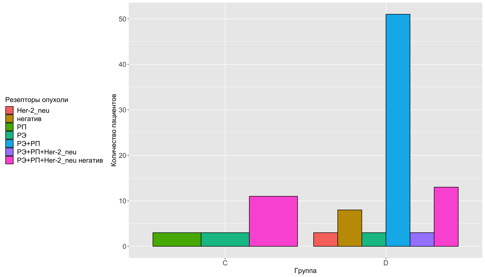

Рисунок №4.37. Определение рецепторов опухоли в группах C и D.

*Гистологическое поддтверждение злокачественного новообразования*

Гистологически обнаружено злокачественное образование в группе C в 4.94% (31/628случаев)[95% ДИ 0.03;0.07].В группе D в 21.68% (142/655случаев)[95% ДИ 0.19;0.25] (Таблица 4.38, Рисунок 4.38).

Таблица №4.38. Гистологическое поддтверждение злокачественного оразования в группах C и D.

| Гистологически обнаружено злокачественное образование | Процентная доля               | 95% ДИ          | Процентная доля               | 95% ДИ          |
|---------------|---------------|---------------|---------------|---------------|
| Группы                                                | Группа C                      | ------          | Группа D                      | ------          |
| Да                                                    | 4.936 % ( 31 / 628 случаев)   | [ 0.03 ; 0.07 ] | 21.679 % ( 142 / 655 случаев) | [ 0.19 ; 0.25 ] |
| Нет                                                   | 95.064 % ( 597 / 628 случаев) | [ 0.93 ; 0.97 ] | 78.321 % ( 513 / 655 случаев) | [ 0.75 ; 0.81 ] |

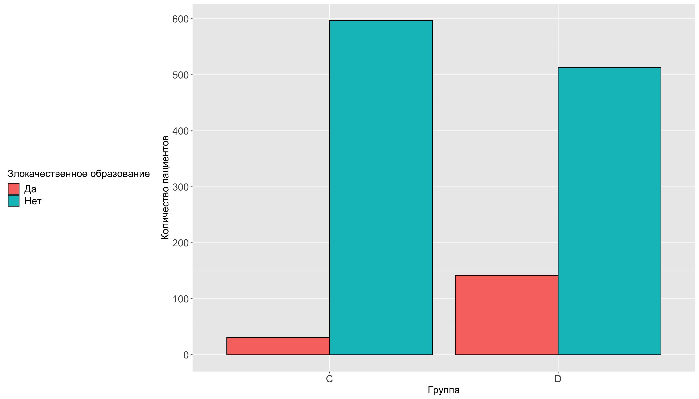

Рисунок №4.38. Гистологическое поддтверждение злокачественного оразования в группах C и D.

*Определение злокачественности новообразования*

В группе C уровень злокачественности был I (низкая 3-5 бал) в 0% (0/17случаев)[95% ДИ 0;0.23], II (умеренная 6-7 балов) в 58.82% (10/17случаев)[95% ДИ 0.33;0.81] и III(высокая 8-9 бал) в 41.18% (7/17случаев)[95% ДИ 0.19;0.67]. В группе D уровень злокачественности был I (низкая 3-5 бал) в 17.86% (15/84случаев)[95% ДИ 0.11;0.28], II (умеренная 6-7 балов) в 61.9% (52/84случаев)[95% ДИ 0.51;0.72] и III(высокая 8-9 бал) в 20.24% (17/84случаев)[95% ДИ 0.13;0.31] (Таблица 4.39, Рисунок 4.39).

Таблица №4.39. Определение злокачественности новообразования в группах C и D.

| Уровень злокачественности | Процентная доля             | 95% ДИ          | Процентная доля             | 95% ДИ          |
|---------------|---------------|---------------|---------------|---------------|
| Группы                    | Группа C                    | ------          | Группа D                    | ------          |
| I (низкая 3-5 бал)        | 0 % ( 0 / 17 случаев)       | [ 0 ; 0.23 ]    | 17.857 % ( 15 / 84 случаев) | [ 0.11 ; 0.28 ] |
| II (умеренная 6-7 балов)  | 58.824 % ( 10 / 17 случаев) | [ 0.33 ; 0.81 ] | 61.905 % ( 52 / 84 случаев) | [ 0.51 ; 0.72 ] |
| III(высокая 8-9 бал)      | 41.176 % ( 7 / 17 случаев)  | [ 0.19 ; 0.67 ] | 20.238 % ( 17 / 84 случаев) | [ 0.13 ; 0.31 ] |

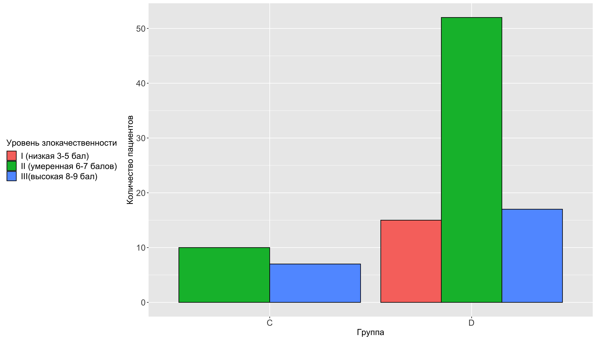

Рисунок №4.39. Определение злокачественности новообразования в группах C и D.

## 4.3 Определение чувствительности, спецефичности и точности методов

При оценке УЗИ в группе А количество истинно верно определенных образований как злокачественные было 577 , количество верно опредленных образований как доброкачественные было 28 , количество неверно определенных образований как злокачественные было 3 и количество неопределенных злокачественных образований как злокачественные было 20 . Точность метода составила 0.96 [95% ДИ: 0.95 , 0.98 ]. P-Value модели составил 0.08 что означает, что модель отличается от точности нулевой гипотезы. Коэфициент Kappa составил 0.69 показывает, что метод не имеет существенно отличную от контрольного метода частоту верно определенных результатов (количество истино положительных и отрицательных результатов). Тест Макнемара составил 0 показывает, что метод не имеет существенно отличную от контрольного метода частоту ошибок (количество ложноположительных и ложноотрицательных результатов). Чувствительность метода составила 0.9 . Специфичность метода составила 0.97 . Доля положительных прогнозов составила 0.58 . Доля отрицательных прогнозов составила 0.99 . Доля истинно положительных случаев в наборе данных составила 0.05 . Доля истинно положительных случаев, правильно определнный методом составила 0.04 . Отбалансированная точность метода составила 0.93 (Таблица №4.40). При оценке ММГ в группе А количество истинно верно определенных образований как злокачественные было 590 , количество верно опредленных образований как доброкачественные было 16 , количество неверно определенных образований как злокачественные было 15 и количество неопределенных злокачественных образований как злокачественные было 7 . Точность метода составила 0.96 [95% ДИ: 0.95 , 0.98 ]. P-Value модели составил 0.05 что означает, что модель отличается от точности нулевой гипотезы. Коэфициент Kappa составил 0.57 показывает, что метод не имеет существенно отличную от контрольного метода частоту верно определенных результатов (количество истино положительных и отрицательных результатов). Тест Макнемара составил 0.14 показывает, что метод не имеет существенно отличную от контрольного метода частоту ошибок (количество ложноположительных и ложноотрицательных результатов). Чувствительность метода составила 0.52 . Специфичность метода составила 0.99 . Доля положительных прогнозов составила 0.7 . Доля отрицательных прогнозов составила 0.98 . Доля истинно положительных случаев в наборе данных составила 0.05 . Доля истинно положительных случаев, правильно определнный методом составила 0.03 . Отбалансированная точность метода составила 0.75 (Таблица №4.40). При оценке УЗИ в группе B количество истинно верно определенных образований как злокачественные было 495 , количество верно опредленных образований как доброкачественные было 128 , количество неверно определенных образований как злокачественные было 14 и количество неопределенных злокачественных образований как злокачественные было 18 . Точность метода составила 0.95 [95% ДИ: 0.93 , 0.97 ]. P-Value модели составил 0 что означает, что модель отличается от точности нулевой гипотезы. Коэфициент Kappa составил 0.86 показывает, что метод не имеет существенно отличную от контрольного метода частоту верно определенных результатов (количество истино положительных и отрицательных результатов). Тест Макнемара составил 0.6 показывает, что метод не имеет существенно отличную от контрольного метода частоту ошибок (количество ложноположительных и ложноотрицательных результатов). Чувствительность метода составила 0.9 . Специфичность метода составила 0.96 . Доля положительных прогнозов составила 0.88 . Доля отрицательных прогнозов составила 0.97 . Доля истинно положительных случаев в наборе данных составила 0.22 . Доля истинно положительных случаев, правильно определнный методом составила 0.2 . Отбалансированная точность метода составила 0.93 (Таблица №4.40). При оценке ММГ в группе B количество истинно верно определенных образований как злокачественные было 509 , количество верно опредленных образований как доброкачественные было 76 , количество неверно определенных образований как злокачественные было 66 и количество неопределенных злокачественных образований как злокачественные было 4 . Точность метода составила 0.89 [95% ДИ: 0.87 , 0.92 ]. P-Value модели составил 0 что означает, что модель отличается от точности нулевой гипотезы. Коэфициент Kappa составил 0.63 показывает, что метод не имеет существенно отличную от контрольного метода частоту верно определенных результатов (количество истино положительных и отрицательных результатов). Тест Макнемара составил 0 показывает, что метод не имеет существенно отличную от контрольного метода частоту ошибок (количество ложноположительных и ложноотрицательных результатов). Чувствительность метода составила 0.54 . Специфичность метода составила 0.99 . Доля положительных прогнозов составила 0.95 . Доля отрицательных прогнозов составила 0.89 . Доля истинно положительных случаев в наборе данных составила 0.22 . Доля истинно положительных случаев, правильно определнный методом составила 0.12 . Отбалансированная точность метода составила 0.76 (Таблица №4.40). При оценке ABUS в группе B количество истинно верно определенных образований как злокачественные было 509 , количество верно опредленных образований как доброкачественные было 125 , количество неверно определенных образований как злокачественные было 17 и количество неопределенных злокачественных образований как злокачественные было 4 . Точность метода составила 0.97 [95% ДИ: 0.95 , 0.98 ]. P-Value модели составил 0 что означает, что модель отличается от точности нулевой гипотезы. Коэфициент Kappa составил 0.9 показывает, что метод не имеет существенно отличную от контрольного метода частоту верно определенных результатов (количество истино положительных и отрицательных результатов). Тест Макнемара составил 0.01 показывает, что метод не имеет существенно отличную от контрольного метода частоту ошибок (количество ложноположительных и ложноотрицательных результатов). Чувствительность метода составила 0.88 . Специфичность метода составила 0.99 . Доля положительных прогнозов составила 0.97 . Доля отрицательных прогнозов составила 0.97 . Доля истинно положительных случаев в наборе данных составила 0.22 . Доля истинно положительных случаев, правильно определнный методом составила 0.19 . Отбалансированная точность метода составила 0.94 (Таблица №4.40). При оценке УЗИ в выборке пациенток до 40 лет количество истинно верно определенных образований как злокачественные было 1072 , количество верно опредленных образований как доброкачественные было 156 , количество неверно определенных образований как злокачественные было 17 и количество неопределенных злокачественных образований как злокачественные было 38 . Точность метода составила 0.96 [95% ДИ: 0.94 , 0.97 ]. P-Value модели составил 0 что означает, что модель отличается от точности нулевой гипотезы. Коэфициент Kappa составил 0.83 показывает, что метод не имеет существенно отличную от контрольного метода частоту верно определенных результатов (количество истино положительных и отрицательных результатов). Тест Макнемара составил 0.01 показывает, что метод не имеет существенно отличную от контрольного метода частоту ошибок (количество ложноположительных и ложноотрицательных результатов). Чувствительность метода составила 0.9 . Специфичность метода составила 0.97 . Доля положительных прогнозов составила 0.8 . Доля отрицательных прогнозов составила 0.98 . Доля истинно положительных случаев в наборе данных составила 0.13 . Доля истинно положительных случаев, правильно определнный методом составила 0.12 . Отбалансированная точность метода составила 0.93 (Таблица №4.40). При оценке ММГ в выборке пациенток до 40 лет количество истинно верно определенных образований как злокачественные было 1099 , количество верно опредленных образований как доброкачественные было 92 , количество неверно определенных образований как злокачественные было 81 и количество неопределенных злокачественных образований как злокачественные было 11 . Точность метода составила 0.93 [95% ДИ: 0.91 , 0.94 ]. P-Value модели составил 0 что означает, что модель отличается от точности нулевой гипотезы. Коэфициент Kappa составил 0.63 показывает, что метод не имеет существенно отличную от контрольного метода частоту верно определенных результатов (количество истино положительных и отрицательных результатов). Тест Макнемара составил 0 показывает, что метод не имеет существенно отличную от контрольного метода частоту ошибок (количество ложноположительных и ложноотрицательных результатов). Чувствительность метода составила 0.53 . Специфичность метода составила 0.99 . Доля положительных прогнозов составила 0.89 . Доля отрицательных прогнозов составила 0.93 . Доля истинно положительных случаев в наборе данных составила 0.13 . Доля истинно положительных случаев, правильно определнный методом составила 0.07 . Отбалансированная точность метода составила 0.76 (Таблица №4.40).

Таблица №4.40. Определение точности, P-уровня значимости модели, коэфициент Kappa, Тест Макнемара, чувствительности, специфичности и отбалансированной точности в группах А и B.

| Метод                                   | Точность                     | P-Value | Коэфициент Kappa | Тест Макнемара | Чувствительность | Специфичность | Отбалансированная точность |
|---------|---------|---------|---------|---------|---------|---------|---------|
| УЗИ в группе C                          | 0.96 [95% ДИ: 0.95 , 0.98 ]. | 0.08    | 0.69             | 0              | 0.9              | 0.97          | 0.93                       |
| ММГ в группе C                          | 0.96 [95% ДИ: 0.95 , 0.98 ]. | 0.05    | 0.57             | 0.14           | 0.52             | 0.99          | 0.75                       |
| УЗИ в группе D                          | 0.95 [95% ДИ: 0.93 , 0.97 ]. | 0       | 0.86             | 0.6            | 0.9              | 0.96          | 0.93                       |
| ММГ в группе D                          | 0.89 [95% ДИ: 0.87 , 0.92 ]. | 0       | 0.63             | 0              | 0.54             | 0.99          | 0.76                       |
| ABUS в группе D                         | 0.97 [95% ДИ: 0.95 , 0.98 ]. | 0       | 0.9              | 0.01           | 0.88             | 0.99          | 0.94                       |
| УЗИ в выборке пациенток 40 лет и старше | 0.96 [95% ДИ: 0.94 , 0.97 ]. | 0       | 0.83             | 0.01           | 0.9              | 0.97          | 0.93                       |
| ММГ в выборке пациенток 40 лет и старше | 0.93 [95% ДИ: 0.91 , 0.94 ]. | 0       | 0.63             | 0              | 0.53             | 0.99          | 0.76                       |

## 4.4 Прогностическая оценка методов

На основании полученных данных, пыла построена предсказательная модель изучаемых методов.

ROC-кривая предсказательной модели для метода УЗИ, по данным полученным в группе C представлена на рисунке № 4.40. Площадь под кривой (AUC- area under cruve) составила: 0.958 95% ДИ: 0.922 - 0.994

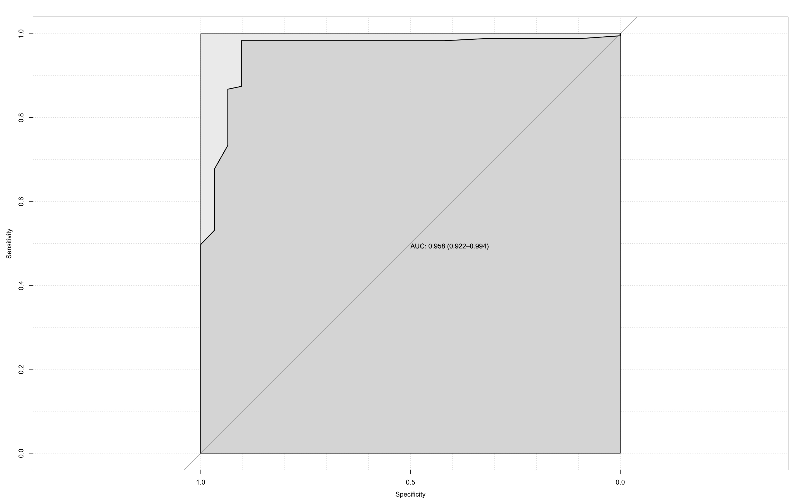

Рисунок №4.24. ROC-кривая предсказательной модели для метода УЗИ, по данным полученным в группе C.

ROC-кривая предсказательной модели для метода УЗИ, по данным полученным в группе D представлена на рисунке № 4.41. Площадь под кривой (AUC- area under cruve) составила: 0.945 95% ДИ: 0.921 - 0.97

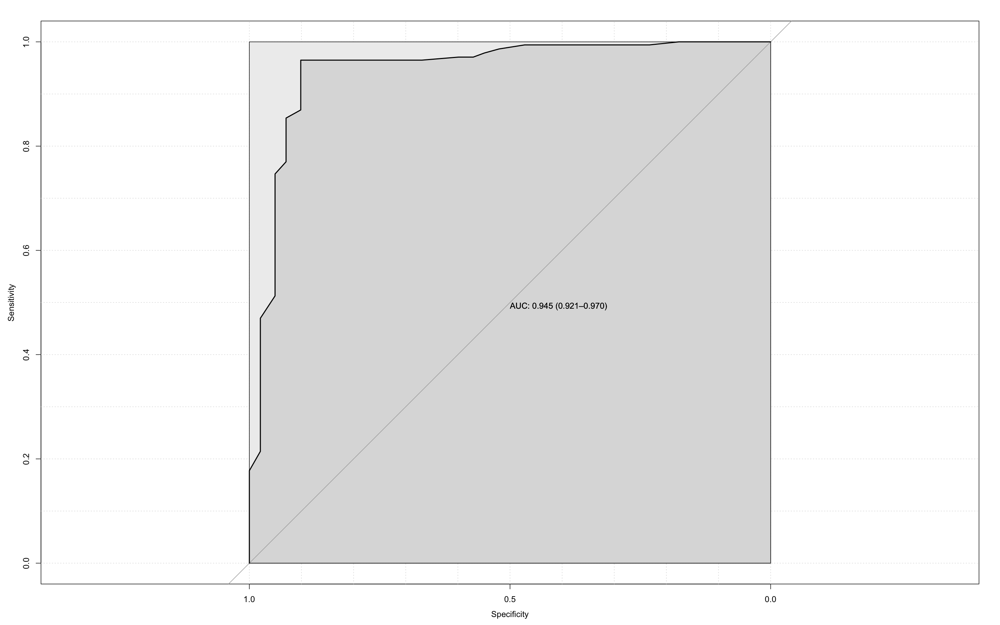

Рисунок №4.25. ROC-кривая предсказательной модели для метода УЗИ, по данным полученным в группе D.

ROC-кривая предсказательной модели для метода ММГ, по данным полученным в группе C представлена на рисунке № 4.42. Площадь под кривой (AUC- area under cruve) составила: 0.843 95% ДИ: 0.77 - 0.917

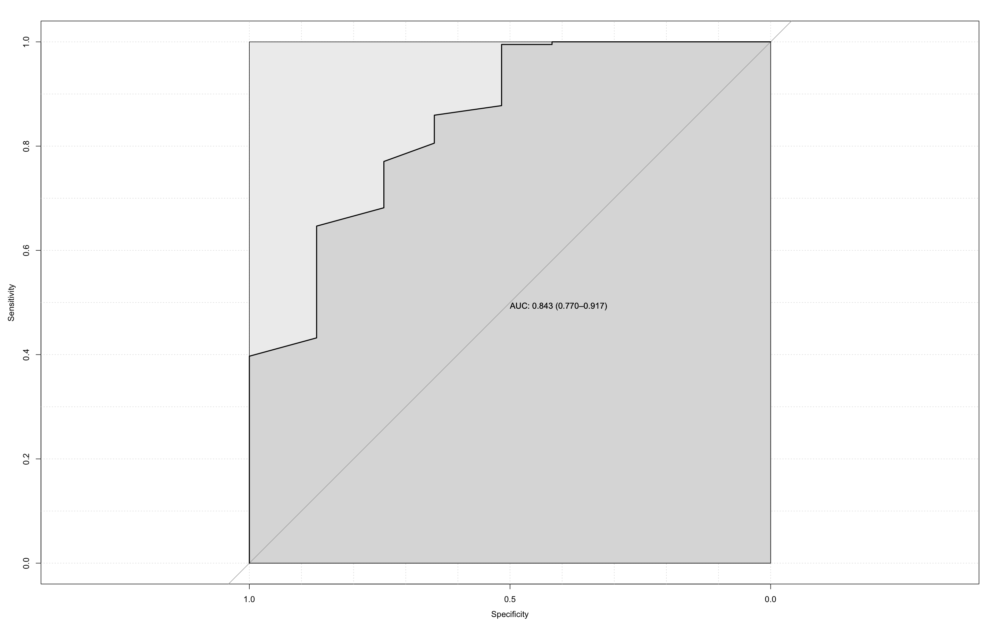

Рисунок №x.xx. ROC-кривая предсказательной модели для метода УЗИ, по данным полученным в группе C.

ROC-кривая предсказательной модели для метода ММГ, по данным полученным В группе D представлена на рисунке № 4.43. Площадь под кривой (AUC- area under cruve) составила: 0.815 95% ДИ: 0.769 - 0.862

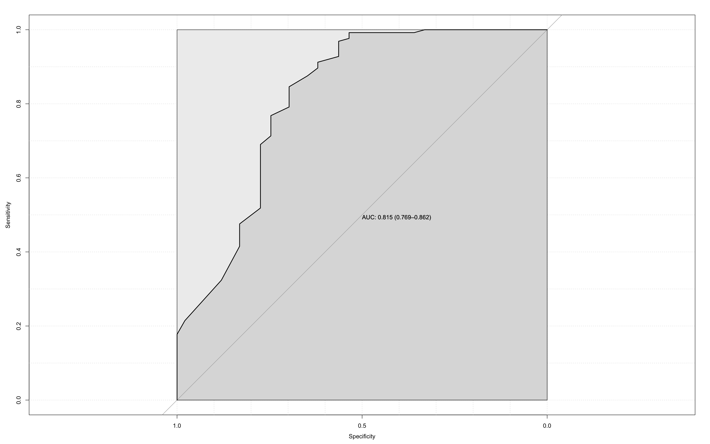

Рисунок №x.xx. ROC-кривая предсказательной модели для метода УЗИ, по данным полученным в группе D.

ROC-кривая предсказательной модели для метода ABUS, по данным полученным В группе D представлена на рисунке № 4.44. Площадь под кривой (AUC- area under cruve) составила: 0.958 95% ДИ: 0.937 - 0.98

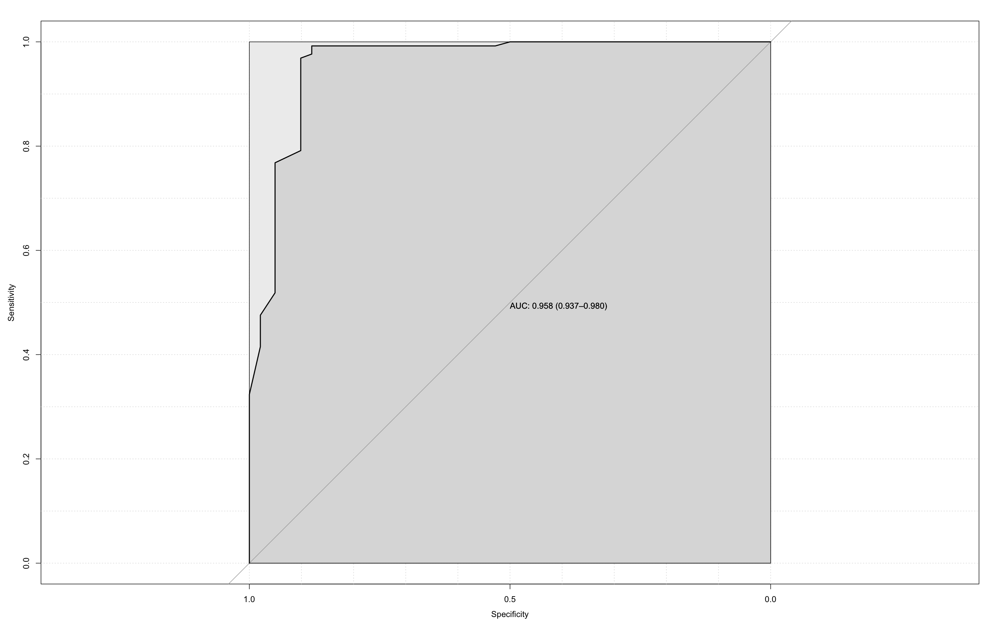

Рисунок №4.26. ROC-кривая предсказательной модели для метода ABUS, по данным полученным в группе B.

ROC-кривая предсказательной модели для метода УЗИ, по данным полученным в выборке пациенток 40 лет и старше представлена на рисунке № 4.45. Площадь под кривой (AUC- area under cruve) составила: 0.946 95% ДИ: 0.924 - 0.968


Рисунок №4.27. ROC-кривая предсказательной модели для метода УЗИ, по данным полученным в выборке пациенток до 40 лет.

ROC-кривая предсказательной модели для метода ММГ, по данным полученным в выборке пациенток 40 лет и старше представлена на рисунке № 4.45. Площадь под кривой (AUC- area under cruve) составила: 0.815 95% ДИ: 0.774 - 0.856

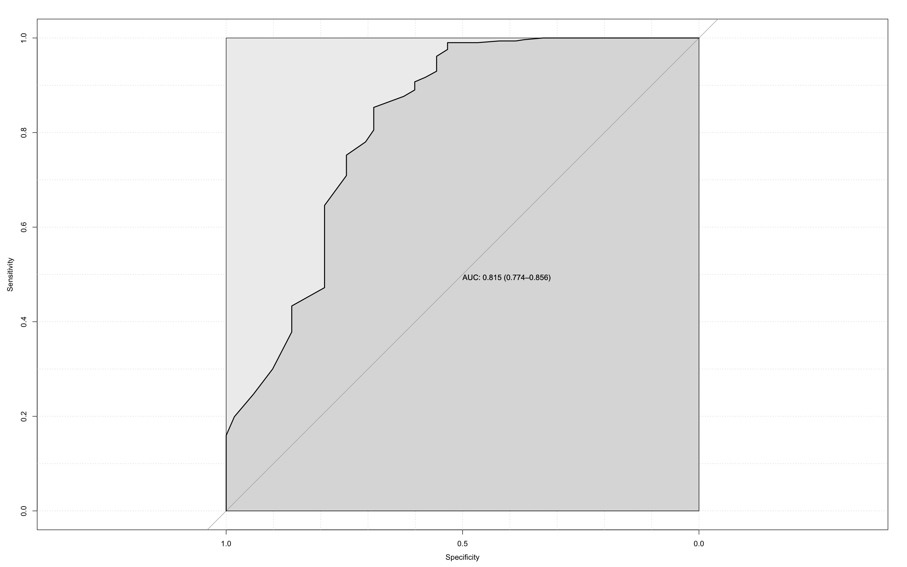

Рисунок №4.27. ROC-кривая предсказательной модели для метода ММГ, по данным полученным в выборке пациенток до 40 лет.

(Таблица №4.41)

Таблица №4.41. Определение площади под кривой представленных предсказательных моделей метода в группах А и B.

| Метод                                   | Площадь под кривой          |
|-----------------------------------------|-----------------------------|
| УЗИ в группе C                          | 0.958 95% ДИ: 0.922 - 0.994 |
| УЗИ в группе D                          | 0.945 95% ДИ: 0.921 - 0.97  |
| УЗИ в выборке пациенток 40 лет и старше | 0.946 95% ДИ: 0.924 - 0.968 |
| ММГ в группе C                          | 0.843 95% ДИ: 0.77 - 0.917  |
| ММГ в группе D                          | 0.815 95% ДИ: 0.769 - 0.862 |
| ММГ в выборке пациенток 40 лет и старше | 0.815 95% ДИ: 0.774 - 0.856 |
| ABUS в группе D                         | 0.958 95% ДИ: 0.937 - 0.98  |

## 4.5 Клинические примеры

## 4.6 Заключение
