```{r setup, include=FALSE}
knitr::opts_chunk$set(echo = TRUE)
```

# ГЛАВА 5. СРАВНЕНИЕ МЕТОДОВ УЗИ И ABUS ПО ОТДЕЛЬНЫМ ПОКАЗАТЕЛЯМ

В настоящей главе проведено сравнение по отдельным показателям насполько изучаемые методы сопоставими. Сравнение проводилось внутри групп B и D, так как именно в этих группах проводились оба изучаемыз метода УЗ-диагностики.

## 5.1 Сравнение методов УЗИ и ABUS внутри группе B

*Края образования*

По результатам УЗИ края образования были ровные в 78.41% (178/227случаев) [95% ДИ 0.72;0.83], волнистые в 8.37% (19/227случаев) [95% ДИ 0.05;0.13], звездчатые в 5.29% (12/227случаев) [95% ДИ 0.03;0.09], неровные в 5.29% (12/227случаев) [95% ДИ 0.03;0.09] и полициклические в 2.64% (6/227случаев) [95% ДИ 0.01;0.06]. По результатам ABUS края были ровные в 80.62% (208/258случаев) [95% ДИ 0.75;0.85], неровные в 14.34% (37/258случаев) [95% ДИ 0.1;0.19], полициклические в 2.33% (6/258случаев) [95% ДИ 0.01;0.05] и нарушение архитектоники в 2.71% (7/258случаев) [95% ДИ 0.01;0.06] (Таблица 5.1, Рисунок 5.1). Статистически значимая разница между методами по показателю "Края образования" была обнаружена p-уровень \< 0,01.

Таблица №5.1. Сравнение методов УЗИ и ABUS по показателю "Края образования" в группе B.

| Края образования | Процентная доля | 95% ДИ | Процентная доля | 95% ДИ |
|----|----|----|----|----|
| Группы | УЗИ | ------ | ABUS | ------ |
| волнистые | 8.37 % ( 19 / 227 случаев) | [ 0.05 ; 0.13 ] | 0 % ( 0 / 258 случаев) | [ 0 ; 0.02 ] |
| звездчатые | 5.286 % ( 12 / 227 случаев) | [ 0.03 ; 0.09 ] | 0 % ( 0 / 258 случаев) | [ 0 ; 0.02 ] |
| неровные | 5.286 % ( 12 / 227 случаев) | [ 0.03 ; 0.09 ] | 14.341 % ( 37 / 258 случаев) | [ 0.1 ; 0.19 ] |
| полициклические | 2.643 % ( 6 / 227 случаев) | [ 0.01 ; 0.06 ] | 2.326 % ( 6 / 258 случаев) | [ 0.01 ; 0.05 ] |
| ровные | 78.414 % ( 178 / 227 случаев) | [ 0.72 ; 0.83 ] | 80.62 % ( 208 / 258 случаев) | [ 0.75 ; 0.85 ] |
| нарушение архитектоники | 0 % ( 0 / 227 случаев) | [ 0 ; 0.02 ] | 2.713 % ( 7 / 258 случаев) | [ 0.01 ; 0.06 ] |

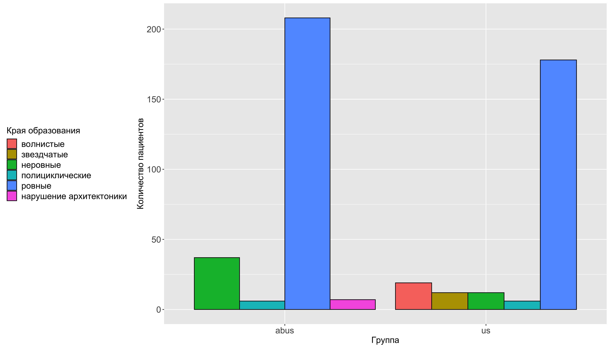

Рисунок №5.1. Сравнение методов УЗИ и ABUS по показателю "Края образования" в группе B.

*Размер образования*

Размер образования по результатам УЗИ был выявлен 0,5-1,0 см в 34.8% (79/227случаев) [95% ДИ 0.29;0.41], 1,1-1,5 см в 45.81% (104/227случаев) [95% ДИ 0.39;0.53], 1,5-2,0 см в 8.37% (19/227случаев) [95% ДИ 0.05;0.13], 2,1-2,5 см в 2.64% (6/227случаев) [95% ДИ 0.01;0.06] и 2,5-3,0 см в 8.37% (19/227случаев) [95% ДИ 0.05;0.13]. По результатам ABUS размеры образования были следующие 0,5-1,0 см в 37.6% (97/258случаев) [95% ДИ 0.32;0.44], 1,1-1,5 см в 40.7% (105/258случаев) [95% ДИ 0.35;0.47], 1,5-2,0 см в 12.02% (31/258случаев) [95% ДИ 0.08;0.17] и 2,5-3,0 см в 9.69% (25/258случаев) [95% ДИ 0.06;0.14] (Таблица 5.2, Рисунок 5.2). Статистически значимая разница между методами по показателю "Размер образования" была выявлена и p-уровень составил 0.04 .

Таблица №5.2. Сравнение методов УЗИ и ABUS по показателю "Размер образования" в группе B.

| Размер образования | Процентная доля | 95% ДИ | Процентная доля | 95% ДИ |
|----|----|----|----|----|
| Группы | УЗИ | ------ | ABUS | ------ |
| 0,5-1,0 см | 34.802 % ( 79 / 227 случаев) | [ 0.29 ; 0.41 ] | 37.597 % ( 97 / 258 случаев) | [ 0.32 ; 0.44 ] |
| 1,1-1,5 см | 45.815 % ( 104 / 227 случаев) | [ 0.39 ; 0.53 ] | 40.698 % ( 105 / 258 случаев) | [ 0.35 ; 0.47 ] |
| 1,5-2,0 см | 8.37 % ( 19 / 227 случаев) | [ 0.05 ; 0.13 ] | 12.016 % ( 31 / 258 случаев) | [ 0.08 ; 0.17 ] |
| 2,1-2,5 см | 2.643 % ( 6 / 227 случаев) | [ 0.01 ; 0.06 ] | 0 % ( 0 / 258 случаев) | [ 0 ; 0.02 ] |
| 2,5-3,0 см | 8.37 % ( 19 / 227 случаев) | [ 0.05 ; 0.13 ] | 9.69 % ( 25 / 258 случаев) | [ 0.06 ; 0.14 ] |

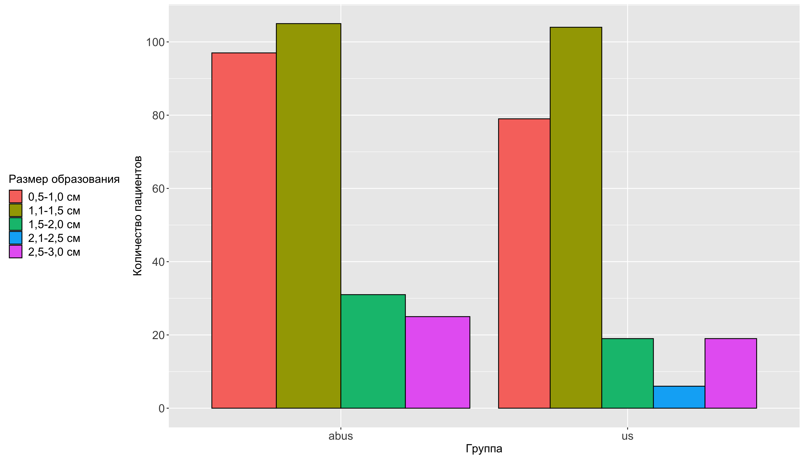

Рисунок №5.2. Сравнение методов УЗИ и ABUS по показателю "Размер образования" в группе B.

*Эхогенность образования*

По результатам УЗИ гипоэхогенное образование было в 94.71% (215/227случаев) [95% ДИ 0.91;0.97], изоэхогенное в 2.64% (6/227случаев) [95% ДИ 0.01;0.06] и смешанная эхогенность в 2.64% (6/227случаев) [95% ДИ 0.01;0.06]. По результатам ABUS гипоэхогенное образование было в 97.67% (252/258случаев) [95% ДИ 0.95;0.99] и смешанная эхогенность была в 2.33% (6/258случаев) [95% ДИ 0.01;0.05] (Таблица 5.3, Рисунок 5.3). Статистически значимая разница между методами по показателю "Эхогенность образования" была выявлена(p-уровень = 0.03).

Таблица №5.3. Сравнение методов УЗИ и ABUS по показателю "Эхогенность образования" в группе B.

| Эхогенность образования | Процентная доля | 95% ДИ | Процентная доля | 95% ДИ |
|----|----|----|----|----|
| Группы | УЗИ | ------ | ABUS | ------ |
| гипоэхогенное | 94.714 % ( 215 / 227 случаев) | [ 0.91 ; 0.97 ] | 97.674 % ( 252 / 258 случаев) | [ 0.95 ; 0.99 ] |
| изоэхогенное | 2.643 % ( 6 / 227 случаев) | [ 0.01 ; 0.06 ] | 0 % ( 0 / 258 случаев) | [ 0 ; 0.02 ] |
| смешанная | 2.643 % ( 6 / 227 случаев) | [ 0.01 ; 0.06 ] | 2.326 % ( 6 / 258 случаев) | [ 0.01 ; 0.05 ] |

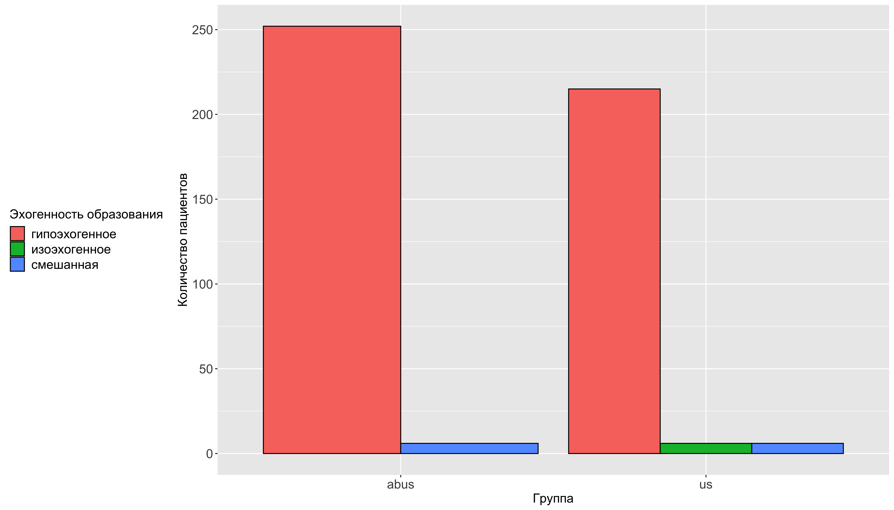

Рисунок №5.3. Сравнение методов УЗИ и ABUS по показателю "Эхогенность образования" в группе B.

*Структура образования*

По результатам УЗИ структура образования была однородная в 75.77% (172/227случаев) [95% ДИ 0.7;0.81] и неоднородная в 24.23% (55/227случаев) [95% ДИ 0.19;0.3]. По результатам ABUS однородная в 71.32% (184/258случаев) [95% ДИ 0.65;0.77], неоднородная в 25.97% (67/258случаев) [95% ДИ 0.21;0.32] и наличие внутрикистозных пристеночных разрастаний в 2.71% (7/258случаев) [95% ДИ 0.01;0.06] (Таблица 5.4, Рисунок 5.4). Статистически значимая разница между методами по показателю "Структура образования" была выявлена p-уровень = 0.03.

Таблица №5.4. Сравнение методов УЗИ и ABUS по показателю "Структура образования" в группе B.

| Структура образования | Процентная доля | 95% ДИ | Процентная доля | 95% ДИ |
|----|----|----|----|----|
| Группы | УЗИ | ------ | ABUS | ------ |
| наличие внутрикистозных пристеночных разрастаний | 0 % ( 0 / 227 случаев) | [ 0 ; 0.02 ] | 2.713 % ( 7 / 258 случаев) | [ 0.01 ; 0.06 ] |
| неоднородная | 24.229 % ( 55 / 227 случаев) | [ 0.19 ; 0.3 ] | 25.969 % ( 67 / 258 случаев) | [ 0.21 ; 0.32 ] |
| однородная | 75.771 % ( 172 / 227 случаев) | [ 0.7 ; 0.81 ] | 71.318 % ( 184 / 258 случаев) | [ 0.65 ; 0.77 ] |

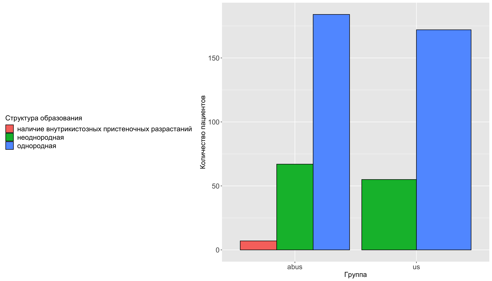

Рисунок №5.4. Сравнение методов УЗИ и ABUS по показателю "Структура образования" в группе B.

*Количество узлов*

Количество узлов

По результатам УЗИ был выявлен один узел в 72.69% (165/227случаев) [95% ДИ 0.66;0.78], два в 11.01% (25/227случаев) [95% ДИ 0.07;0.16], три в 5.29% (12/227случаев) [95% ДИ 0.03;0.09]. и множественные в 11.01% (25/227случаев) [95% ДИ 0.07;0.16].

По результатам ABUS один узел был выявлен в 75.97% (196/258случаев) [95% ДИ 0.7;0.81], два в 9.69% (25/258случаев) [95% ДИ 0.06;0.14], три в 4.65% (12/258случаев) [95% ДИ 0.03;0.08] и множественные узлы в 9.69% (25/258случаев) [95% ДИ 0.06;0.14] (Таблица 5.5, Рисунок 5.5). Статистически значимая разница между методами по показателю "Количество узлов" не была выявлена (p-уровень = 0.86).

Таблица №5.5. Сравнение методов УЗИ и ABUS по показателю "Количество узлов" в группе B.

| Количество узлов | Процентная доля | 95% ДИ | Процентная доля | 95% ДИ |
|----|----|----|----|----|
| Группы | УЗИ | ------ | ABUS | ------ |
| один | 72.687 % ( 165 / 227 случаев) | [ 0.66 ; 0.78 ] | 75.969 % ( 196 / 258 случаев) | [ 0.7 ; 0.81 ] |
| два | 11.013 % ( 25 / 227 случаев) | [ 0.07 ; 0.16 ] | 9.69 % ( 25 / 258 случаев) | [ 0.06 ; 0.14 ] |
| три | 5.286 % ( 12 / 227 случаев) | [ 0.03 ; 0.09 ] | 4.651 % ( 12 / 258 случаев) | [ 0.03 ; 0.08 ] |
| множественные | 11.013 % ( 25 / 227 случаев) | [ 0.07 ; 0.16 ] | 9.69 % ( 25 / 258 случаев) | [ 0.06 ; 0.14 ] |

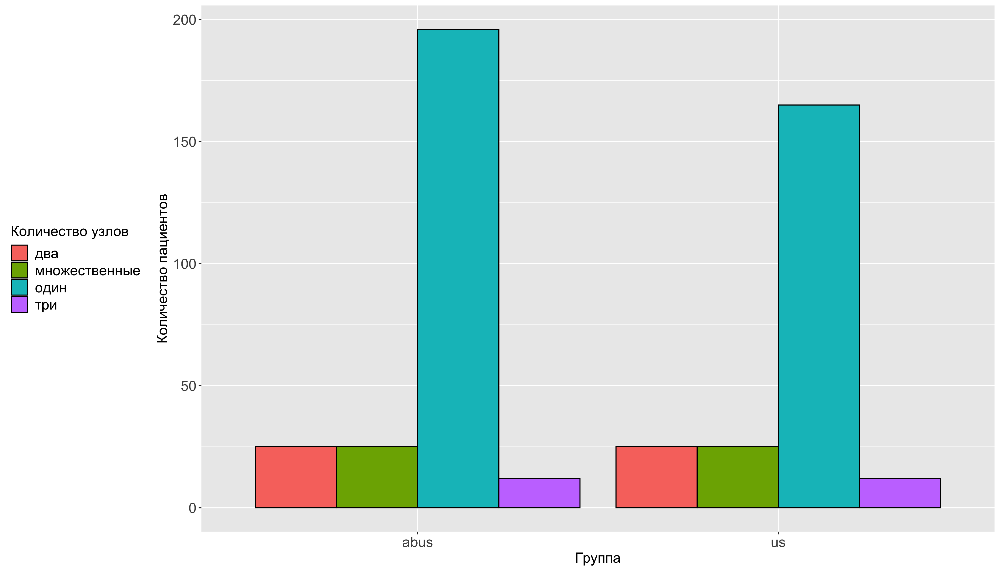

Рисунок №5.5. Сравнение методов УЗИ и ABUS по показателю "Количество узлов" в группе B.

*Локализация*

ТУТ БУДЕТ БЛОК ПРО ЛОКАЛИЗАЦИЮ!

*Кальцинаты*

По результатам УЗИ микрокальцинаты определялись в 2.64% (6/227случаев) [95% ДИ 0.01;0.06], определяются в 2.64% (6/227случаев) [95% ДИ 0.01;0.06] и не поределялись в 94.71% (215/227случаев) [95% ДИ 0.91;0.97]. По результатам ABUS микрокальцинаты определялись в 2.33% (6/258случаев) [95% ДИ 0.01;0.05], определяются в 2.33% (6/258случаев) [95% ДИ 0.01;0.05] и не поределялись в 95.35% (246/258случаев) [95% ДИ 0.92;0.97] (Таблица 5.7, Рисунок 5.7). Статистически значимая разница между методами по показателю "Кальцинаты" не было выявлено (p-уровень = 1).

Таблица №5.7. Сравнение методов УЗИ и ABUS по показателю "Кальцинаты" в группе B.

| Кальцинаты | Процентная доля | 95% ДИ | Процентная доля | 95% ДИ |
|----|----|----|----|----|
| Группы | УЗИ | ------ | ABUS | ------ |
| микрокальцинаты | 2.643 % ( 6 / 227 случаев) | [ 0.01 ; 0.06 ] | 2.326 % ( 6 / 258 случаев) | [ 0.01 ; 0.05 ] |
| нет | 94.714 % ( 215 / 227 случаев) | [ 0.91 ; 0.97 ] | 95.349 % ( 246 / 258 случаев) | [ 0.92 ; 0.97 ] |
| определяются | 2.643 % ( 6 / 227 случаев) | [ 0.01 ; 0.06 ] | 2.326 % ( 6 / 258 случаев) | [ 0.01 ; 0.05 ] |

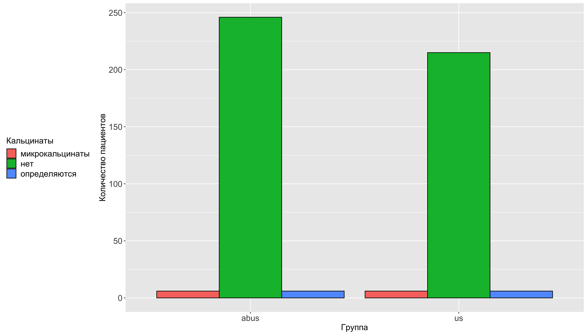

Рисунок №5.7. Сравнение методов УЗИ и ABUS по показателю "Кальцинаты" в группе B.

*Поставленный диагноз*

По результатам УЗИ был поставлен диагноз "локализованный фиброаденоматоз" в 0.88% (2/227случаев) [95% ДИ 0;0.03], "мультицентричный рак" в 7.93% (18/227случаев) [95% ДИ 0.05;0.12], "мультфококальный рак" в 1.32% (3/227случаев) [95% ДИ 0;0.04], "образование Ca" в 10.13% (23/227случаев) [95% ДИ 0.07;0.15], "фиброаденома единичная" в 59.03% (134/227случаев) [95% ДИ 0.52;0.65] и "фиброаденомы множествненные" в 20.7% (47/227случаев) [95% ДИ 0.16;0.27].

По результатам ABUS без патологии было 2.33% (6/258случаев) [95% ДИ 0.01;0.05]. Были поставлены следующие диагнозы: "мультицентричный рак" в 5.04% (13/258случаев) [95% ДИ 0.03;0.09], "образование Ca" в 6.59% (17/258случаев) [95% ДИ 0.04;0.11], "сложная киста" в 0.78% (2/258случаев) [95% ДИ 0;0.03], "фиброаденома единичная" в 56.2% (145/258случаев) [95% ДИ 0.5;0.62], "фиброаденомы множествненные" в 18.6% (48/258случаев) [95% ДИ 0.14;0.24], "фиброзно-кистозная мастопатия" в 2.71% (7/258случаев) [95% ДИ 0.01;0.06], "мультифокальный рак" в 5.43% (14/258случаев) [95% ДИ 0.03;0.09] и "склерозирующий аденоз" в 2.33% (6/258случаев) [95% ДИ 0.01;0.05] (Таблица%205.8,%20Рисунок%205.8). Статистически значимая разница между методами по показателю "Поставленный диагноз" была выявлена (p-уровень \< 0.01).

Таблица №5.8. Сравнение методов УЗИ и ABUS по показателю "Поставленный диагноз" в группе B.

| Поставленный диагноз | Процентная доля | 95% ДИ | Процентная доля | 95% ДИ |
|----|----|----|----|----|
| Группы | УЗИ | ------ | ABUS | ------ |
| без патологии | 0 % ( 0 / 227 случаев) | [ 0 ; 0.02 ] | 2.326 % ( 6 / 258 случаев) | [ 0.01 ; 0.05 ] |
| локализованный фиброаденоматоз | 0.881 % ( 2 / 227 случаев) | [ 0 ; 0.03 ] | 0 % ( 0 / 258 случаев) | [ 0 ; 0.02 ] |
| мультицентричный рак | 7.93 % ( 18 / 227 случаев) | [ 0.05 ; 0.12 ] | 5.039 % ( 13 / 258 случаев) | [ 0.03 ; 0.09 ] |
| мультфококальный рак | 1.322 % ( 3 / 227 случаев) | [ 0 ; 0.04 ] | 0 % ( 0 / 258 случаев) | [ 0 ; 0.02 ] |
| образование Ca | 10.132 % ( 23 / 227 случаев) | [ 0.07 ; 0.15 ] | 6.589 % ( 17 / 258 случаев) | [ 0.04 ; 0.11 ] |
| сложная киста | 0 % ( 0 / 227 случаев) | [ 0 ; 0.02 ] | 0.775 % ( 2 / 258 случаев) | [ 0 ; 0.03 ] |
| фиброаденома единичная | 59.031 % ( 134 / 227 случаев) | [ 0.52 ; 0.65 ] | 56.202 % ( 145 / 258 случаев) | [ 0.5 ; 0.62 ] |
| фиброаденомы множествненные | 20.705 % ( 47 / 227 случаев) | [ 0.16 ; 0.27 ] | 18.605 % ( 48 / 258 случаев) | [ 0.14 ; 0.24 ] |
| фиброзно-кистозная мастопатия | 0 % ( 0 / 227 случаев) | [ 0 ; 0.02 ] | 2.713 % ( 7 / 258 случаев) | [ 0.01 ; 0.06 ] |
| мультифокальный рак | 0 % ( 0 / 227 случаев) | [ 0 ; 0.02 ] | 5.426 % ( 14 / 258 случаев) | [ 0.03 ; 0.09 ] |
| склерозирующий аденоз | 0 % ( 0 / 227 случаев) | [ 0 ; 0.02 ] | 2.326 % ( 6 / 258 случаев) | [ 0.01 ; 0.05 ] |

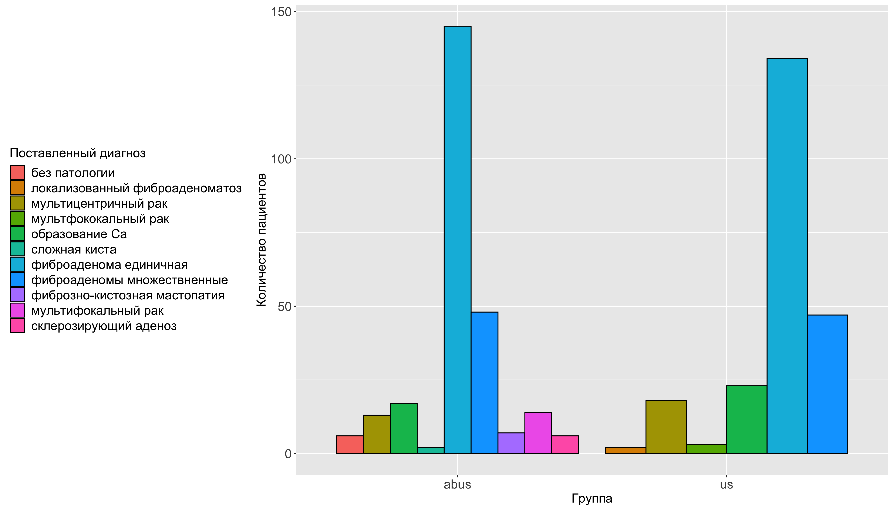

Рисунок №5.8. Сравнение методов УЗИ и ABUS по показателю "Поставленный диагноз" в группе B.

*Категория BIRADS*

По результатам УЗИ категория Birads 1 в 3.08% (7/227случаев) [95% ДИ 0.01;0.07], Birads 2 в 32.6% (74/227случаев) [95% ДИ 0.27;0.39],Birads 3 в 45.81% (104/227случаев) [95% ДИ 0.39;0.53],Birads 4b в 5.29% (12/227случаев) [95% ДИ 0.03;0.09], Birads 4а в 10.57% (24/227случаев) [95% ДИ 0.07;0.16] и Birads 5 в 2.64% (6/227случаев) [95% ДИ 0.01;0.06]. По результатам ABUS категория Birads 1 была в 6.59% (17/258случаев) [95% ДИ 0.04;0.11], Birads 2 в 36.82% (95/258случаев) [95% ДИ 0.31;0.43], Birads 3 в 42.64% (110/258случаев) [95% ДИ 0.37;0.49], Birads 4b в 2.33% (6/258случаев) [95% ДИ 0.01;0.05], Birads 4а в 4.65% (12/258случаев) [95% ДИ 0.03;0.08] и Birads 5 в 6.98% (18/258случаев) [95% ДИ 0.04;0.11] (Таблица 5.9, Рисунок 5.9). Статистически значимая разница между методами по показателю "Категория BIRADS" была выявлена (p-уровень \< 0.01).

Таблица №5.9. Сравнение методов УЗИ и ABUS по показателю "Категория BIRADS" в группе B.

| Категория BIRADS | Процентная доля | 95% ДИ | Процентная доля | 95% ДИ |
|----|----|----|----|----|
| Группы | УЗИ | ------ | ABUS | ------ |
| Birads 1 | 3.084 % ( 7 / 227 случаев) | [ 0.01 ; 0.07 ] | 6.589 % ( 17 / 258 случаев) | [ 0.04 ; 0.11 ] |
| Birads 2 | 32.599 % ( 74 / 227 случаев) | [ 0.27 ; 0.39 ] | 36.822 % ( 95 / 258 случаев) | [ 0.31 ; 0.43 ] |
| Birads 3 | 45.815 % ( 104 / 227 случаев) | [ 0.39 ; 0.53 ] | 42.636 % ( 110 / 258 случаев) | [ 0.37 ; 0.49 ] |
| Birads 4b | 5.286 % ( 12 / 227 случаев) | [ 0.03 ; 0.09 ] | 2.326 % ( 6 / 258 случаев) | [ 0.01 ; 0.05 ] |
| Birads 4а | 10.573 % ( 24 / 227 случаев) | [ 0.07 ; 0.16 ] | 4.651 % ( 12 / 258 случаев) | [ 0.03 ; 0.08 ] |
| Birads 5 | 2.643 % ( 6 / 227 случаев) | [ 0.01 ; 0.06 ] | 6.977 % ( 18 / 258 случаев) | [ 0.04 ; 0.11 ] |

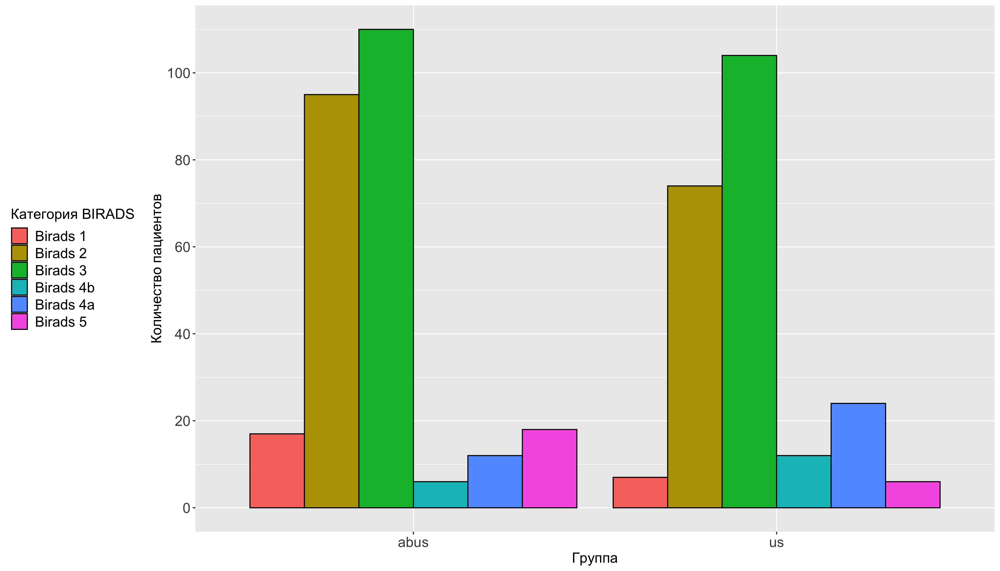

Таблица №5.9. Сравнение методов УЗИ и ABUS по показателю "Категория BIRADS" в группе B.

## 5.2 Сравнение методов УЗИ и ABUS внутри группе D

*Края образования*

По результатам УЗИ Края образования ровные в 41.22% (101/245случаев) [95% ДИ 0.35;0.48], неровные в 35.1% (86/245случаев) [95% ДИ 0.29;0.41], волнистые в 8.57% (21/245случаев) [95% ДИ 0.06;0.13] и звездчатые в 15.1% (37/245случаев) [95% ДИ 0.11;0.2]. По результатам ABUS края образования были неровные в 46.77% (116/248случаев) [95% ДИ 0.4;0.53], волнистые в 5.65% (14/248случаев) [95% ДИ 0.03;0.09], звездчатые в 7.26% (18/248случаев) [95% ДИ 0.04;0.11], полициклические в 2.82% (7/248случаев) [95% ДИ 0.01;0.06], ровные в 31.45% (78/248случаев) [95% ДИ 0.26;0.38] и нарушение архитектоники в 6.05% (15/248случаев) [95% ДИ 0.04;0.1] (Таблица 5.10, Рисунок 5.10). Статистически значимая разница между методами по показателю "Края образования" была выявлена (p-уровень \< 0.01).

Таблица №5.10. Сравнение методов УЗИ и ABUS по показателю "края образования" в группе D.

| Края образования | Процентная доля | 95% ДИ | Процентная доля | 95% ДИ |
|----|----|----|----|----|
| Группы | УЗИ | ------ | ABUS | ------ |
| волнистые | 8.571 % ( 21 / 245 случаев) | [ 0.06 ; 0.13 ] | 5.645 % ( 14 / 248 случаев) | [ 0.03 ; 0.09 ] |
| звездчатые | 15.102 % ( 37 / 245 случаев) | [ 0.11 ; 0.2 ] | 7.258 % ( 18 / 248 случаев) | [ 0.04 ; 0.11 ] |
| неровные | 35.102 % ( 86 / 245 случаев) | [ 0.29 ; 0.41 ] | 46.774 % ( 116 / 248 случаев) | [ 0.4 ; 0.53 ] |
| полициклические | 0 % ( 0 / 245 случаев) | [ 0 ; 0.02 ] | 2.823 % ( 7 / 248 случаев) | [ 0.01 ; 0.06 ] |
| ровные | 41.224 % ( 101 / 245 случаев) | [ 0.35 ; 0.48 ] | 31.452 % ( 78 / 248 случаев) | [ 0.26 ; 0.38 ] |
| нарушение архитектоники | 0 % ( 0 / 245 случаев) | [ 0 ; 0.02 ] | 6.048 % ( 15 / 248 случаев) | [ 0.04 ; 0.1 ] |

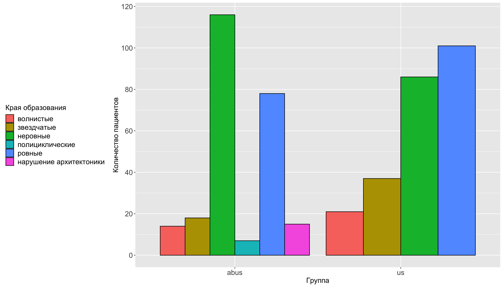

Рисунок №5.10. Сравнение методов УЗИ и ABUS по показателю "края образования" в группе D.

*Размер образования*

По результатам УЗИ размер образования был 0,5-1,0 см в 29.39% (72/245случаев) [95% ДИ 0.24;0.36], 1,1-1,5 см в 28.98% (71/245случаев) [95% ДИ 0.23;0.35], 1,5-2,0 см в 20% (49/245случаев) [95% ДИ 0.15;0.26], 2,1-2,5 см в 9.39% (23/245случаев) [95% ДИ 0.06;0.14], 2,5-3,0 см в 11.02% (27/245случаев) [95% ДИ 0.08;0.16] и более 3 см в 1.22% (3/245случаев) [95% ДИ 0;0.04]. По результатам ABUS - 0,5-1,0 см в 27.02% (67/248случаев) [95% ДИ 0.22;0.33], 1,1-1,5 см в 30.65% (76/248случаев) [95% ДИ 0.25;0.37], 1,5-2,0 см в 22.58% (56/248случаев) [95% ДИ 0.18;0.28], 2,1-2,5 см в 6.45% (16/248случаев) [95% ДИ 0.04;0.1], 2,5-3,0 см в 12.1% (30/248случаев) [95% ДИ 0.08;0.17] и более 3 см в 1.21% (3/248случаев) [95% ДИ 0;0.04](Таблица%205.11,%20Рисунок%205.11).

Статистически значимая разница между методами по показателю "Размер образования" не было выявлено (p-уровень = 0.81).

Таблица №5.11. Сравнение методов УЗИ и ABUS по показателю "Размер образования" в группе D.

| Размер образования | Процентная доля | 95% ДИ | Процентная доля | 95% ДИ |
|----|----|----|----|----|
| Группы | УЗИ | ------ | ABUS | ------ |
| 0,5-1,0 см | 29.388 % ( 72 / 245 случаев) | [ 0.24 ; 0.36 ] | 27.016 % ( 67 / 248 случаев) | [ 0.22 ; 0.33 ] |
| 1,1-1,5 см | 28.98 % ( 71 / 245 случаев) | [ 0.23 ; 0.35 ] | 30.645 % ( 76 / 248 случаев) | [ 0.25 ; 0.37 ] |
| 1,5-2,0 см | 20 % ( 49 / 245 случаев) | [ 0.15 ; 0.26 ] | 22.581 % ( 56 / 248 случаев) | [ 0.18 ; 0.28 ] |
| 2,1-2,5 см | 9.388 % ( 23 / 245 случаев) | [ 0.06 ; 0.14 ] | 6.452 % ( 16 / 248 случаев) | [ 0.04 ; 0.1 ] |
| 2,5-3,0 см | 11.02 % ( 27 / 245 случаев) | [ 0.08 ; 0.16 ] | 12.097 % ( 30 / 248 случаев) | [ 0.08 ; 0.17 ] |
| более 3 см | 1.224 % ( 3 / 245 случаев) | [ 0 ; 0.04 ] | 1.21 % ( 3 / 248 случаев) | [ 0 ; 0.04 ] |

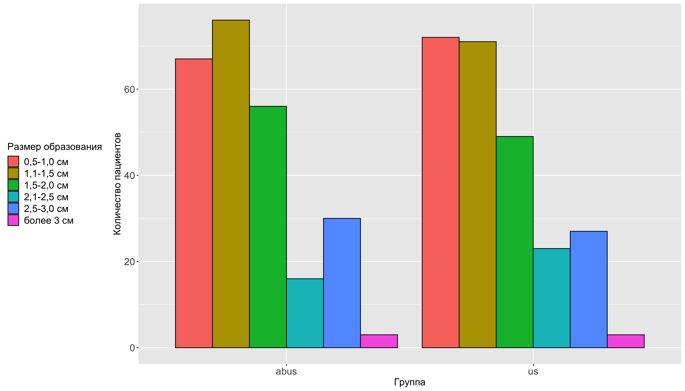

Рисунок №5.11. Сравнение методов УЗИ и ABUS по показателю "Размер образования" в группе D.

*Эхогенность образования*

Эхогенность образования

По результатам УЗИ образование было гипоэхогенное в 94.29% (231/245случаев) [95% ДИ 0.9;0.97], смешанная эхогенность в 4.49% (11/245случаев) [95% ДИ 0.02;0.08] и анэхогенное в 1.22% (3/245случаев) [95% ДИ 0;0.04]. По результатам ABUS гипоэхогенное образование было в 95.56% (237/248случаев) [95% ДИ 0.92;0.98], анэхогенное в 1.21% (3/248случаев) [95% ДИ 0;0.04] и смешанная эхогенность в 3.23% (8/248случаев) [95% ДИ 0.02;0.06] (Таблица 5.12, Рисунок 5.12). Статистически значимая разница между методами по показателю "Эхогенность образования" не была выявлена (p-уровень = 0.83).

Таблица №5.12. Сравнение методов УЗИ и ABUS по показателю "Эхогенность образования" в группе D.

| Эхогенность образования | Процентная доля | 95% ДИ | Процентная доля | 95% ДИ |
|----|----|----|----|----|
| Группы | УЗИ | ------ | ABUS | ------ |
| анэхогенное | 1.224 % ( 3 / 245 случаев) | [ 0 ; 0.04 ] | 1.21 % ( 3 / 248 случаев) | [ 0 ; 0.04 ] |
| гипоэхогенное | 94.286 % ( 231 / 245 случаев) | [ 0.9 ; 0.97 ] | 95.565 % ( 237 / 248 случаев) | [ 0.92 ; 0.98 ] |
| смешанная | 4.49 % ( 11 / 245 случаев) | [ 0.02 ; 0.08 ] | 3.226 % ( 8 / 248 случаев) | [ 0.02 ; 0.06 ] |

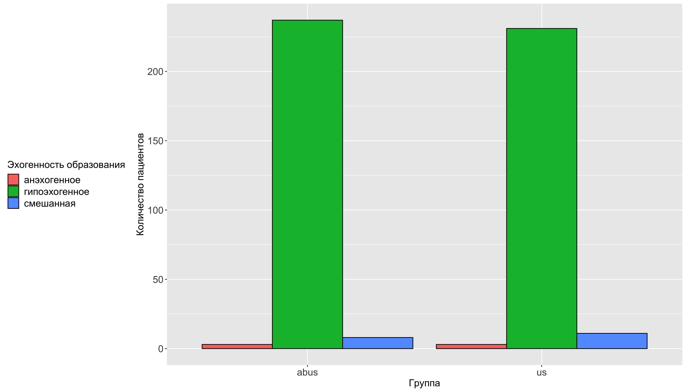

Рисунок №5.12. Сравнение методов УЗИ и ABUS по показателю "Эхогенность образования" в группе D.

*Структура образования* По результатам УЗИ структура образования неоднородная в 60% (147/245случаев) [95% ДИ 0.54;0.66] и однородная в 40% (98/245случаев) [95% ДИ 0.34;0.46], По результатам ABUS наличие внутрикистозных пристеночных разрастаний в 1.61% (4/248случаев) [95% ДИ 0.01;0.04], неоднородная структура в 56.05% (139/248случаев) [95% ДИ 0.5;0.62], однородная в 41.13% (102/248случаев) [95% ДИ 0.35;0.48] и образование с кальцинатами в 1.21% (3/248случаев) [95% ДИ 0;0.04] (Таблица 5.13, Рисунок 5.13).

Статистически значимая разница между методами по показателю "Структура образования" была сомнительная (p-уровень = 0.05).

| Структура образования | Процентная доля | 95% ДИ | Процентная доля | 95% ДИ |
|----|----|----|----|----|
| Группы | УЗИ | ------ | ABUS | ------ |
| наличие внутрикистозных пристеночных разрастаний | 0 % ( 0 / 245 случаев) | [ 0 ; 0.02 ] | 1.613 % ( 4 / 248 случаев) | [ 0.01 ; 0.04 ] |
| неоднородная | 60 % ( 147 / 245 случаев) | [ 0.54 ; 0.66 ] | 56.048 % ( 139 / 248 случаев) | [ 0.5 ; 0.62 ] |
| однородная | 40 % ( 98 / 245 случаев) | [ 0.34 ; 0.46 ] | 41.129 % ( 102 / 248 случаев) | [ 0.35 ; 0.48 ] |
| с жидкостным содержимым | 0 % ( 0 / 245 случаев) | [ 0 ; 0.02 ] | 0 % ( 0 / 248 случаев) | [ 0 ; 0.02 ] |
| с кальцинатами | 0 % ( 0 / 245 случаев) | [ 0 ; 0.02 ] | 1.21 % ( 3 / 248 случаев) | [ 0 ; 0.04 ] |

Таблица №5.13. Сравнение методов УЗИ и ABUS по показателю "Структура образования" в группе D.

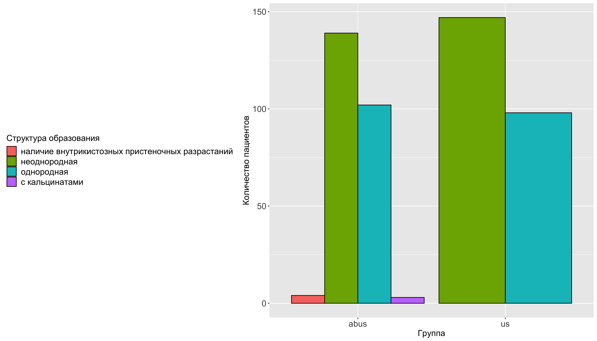

Рисунок №5.13. Сравнение методов УЗИ и ABUS по показателю "Структура образования" в группе D.

*Количество узлов*

По результатам УЗИ один узел выявлен в 83.67% (205/245случаев) [95% ДИ 0.78;0.88], два в 12.24% (30/245случаев) [95% ДИ 0.09;0.17], три в 1.22% (3/245случаев) [95% ДИ 0;0.04] и множественные в 2.86% (7/245случаев) [95% ДИ 0.01;0.06], По результатам ABUS один узел выявлен в 83.87% (208/248случаев) [95% ДИ 0.79;0.88], два в 9.27% (23/248случаев) [95% ДИ 0.06;0.14], три в 2.82% (7/248случаев) [95% ДИ 0.01;0.06] и множественные в 4.03% (10/248случаев) [95% ДИ 0.02;0.08] (Таблица 5.14, Рисунок 5.14). Статистически значимая разница между методами по показателю "Количество узлов" не была вывлена (p-уровень = 0.4).

Таблица №5.14. Сравнение методов УЗИ и ABUS по показателю "Количество узлов" в группе D.

| Количество узлов | Процентная доля | 95% ДИ | Процентная доля | 95% ДИ |
|----|----|----|----|----|
| Группы | УЗИ | ------ | ABUS | ------ |
| один | 83.673 % ( 205 / 245 случаев) | [ 0.78 ; 0.88 ] | 83.871 % ( 208 / 248 случаев) | [ 0.79 ; 0.88 ] |
| три | 1.224 % ( 3 / 245 случаев) | [ 0 ; 0.04 ] | 2.823 % ( 7 / 248 случаев) | [ 0.01 ; 0.06 ] |
| два | 12.245 % ( 30 / 245 случаев) | [ 0.09 ; 0.17 ] | 9.274 % ( 23 / 248 случаев) | [ 0.06 ; 0.14 ] |
| множественные | 2.857 % ( 7 / 245 случаев) | [ 0.01 ; 0.06 ] | 4.032 % ( 10 / 248 случаев) | [ 0.02 ; 0.08 ] |

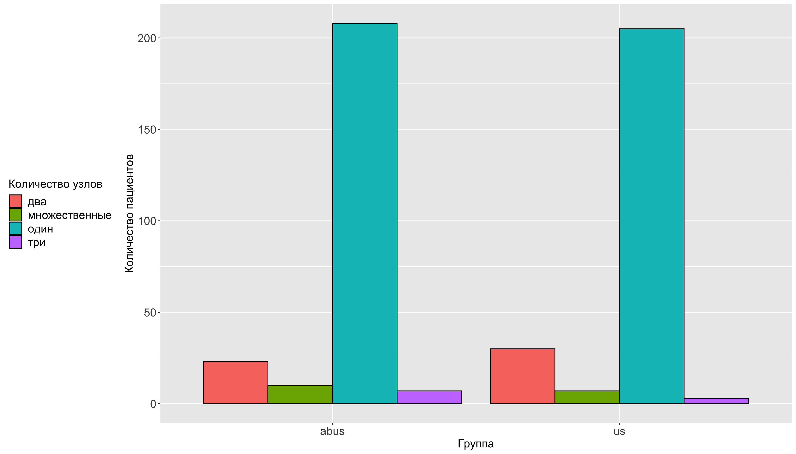

Таблица №5.5. Сравнение методов УЗИ и ABUS по показателю "Количество узлов" в группе D.

*Локализация*

ТУТ БУДЕТ БЛОК ПРО ЛОКАЛИЗАЦИЮ!

*Кальцинаты*

По результатам УЗИ не было кальцинатов в 68.98% (169/245случаев) [95% ДИ 0.63;0.75], макрокальцинаты в 6.12% (15/245случаев) [95% ДИ 0.04;0.1], микрокальцинаты в 12.65% (31/245случаев) [95% ДИ 0.09;0.18] и определяются в 12.24% (30/245случаев) [95% ДИ 0.09;0.17]. По результатам ABUS не было кальцинатов в 70.56% (175/248случаев) [95% ДИ 0.64;0.76], макрокальцинаты в 4.84% (12/248случаев) [95% ДИ 0.03;0.09], микрокальцинаты в 13.71% (34/248случаев) [95% ДИ 0.1;0.19] и определяются в 10.89% (27/248случаев) [95% ДИ 0.07;0.16] (Таблица 5.16, Рисунок 5.16).

Статистически значимая разница между методами по показателю "Кальцинаты" не была выявлена (p-уровень = 0.87).

Таблица №5.16. Сравнение методов УЗИ и ABUS по показателю "Кальцинаты" в группе D.

| Кальцинаты | Процентная доля | 95% ДИ | Процентная доля | 95% ДИ |
|----|----|----|----|----|
| Группы | УЗИ | ------ | ABUS | ------ |
| макрокальцинаты | 6.122 % ( 15 / 245 случаев) | [ 0.04 ; 0.1 ] | 4.839 % ( 12 / 248 случаев) | [ 0.03 ; 0.09 ] |
| микрокальцинаты | 12.653 % ( 31 / 245 случаев) | [ 0.09 ; 0.18 ] | 13.71 % ( 34 / 248 случаев) | [ 0.1 ; 0.19 ] |
| нет | 68.98 % ( 169 / 245 случаев) | [ 0.63 ; 0.75 ] | 70.565 % ( 175 / 248 случаев) | [ 0.64 ; 0.76 ] |
| определяются | 12.245 % ( 30 / 245 случаев) | [ 0.09 ; 0.17 ] | 10.887 % ( 27 / 248 случаев) | [ 0.07 ; 0.16 ] |

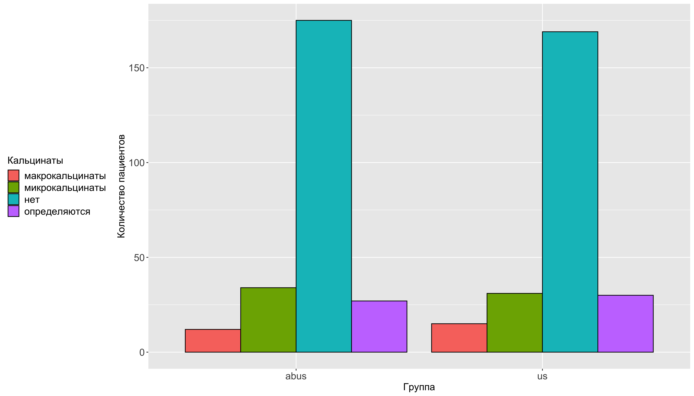

Рисунок №5.16. Сравнение методов УЗИ и ABUS по показателю "Кальцинаты" в группе D.

*Поставленный диагноз*

По результатам УЗИ был поставлен диагноз "киста" в 1.22% (3/245случаев) [95% ДИ 0;0.04], "локализованный фиброаденоматоз" в 6.12% (15/245случаев) [95% ДИ 0.04;0.1], "мультицентричный рак" в 6.94% (17/245случаев) [95% ДИ 0.04;0.11], "мультфококальный рак"в 2.86% (7/245случаев) [95% ДИ 0.01;0.06], "образование Ca" в 46.94% (115/245случаев) [95% ДИ 0.41;0.53], "сложная киста" в 1.63% (4/245случаев) [95% ДИ 0.01;0.04], "фиброаденома единичная" в 26.94% (66/245случаев) [95% ДИ 0.22;0.33], "фиброаденомы множествненные" в 6.12% (15/245случаев) [95% ДИ 0.04;0.1] и цистаденопапиллома в 1.22% (3/245случаев) [95% ДИ 0;0.04], По результатам ABUS был аоставлен диагноз "диффузный фиброаденоматоз" в 1.61% (4/248случаев) [95% ДИ 0.01;0.04], "киста" в 2.42% (6/248случаев) [95% ДИ 0.01;0.05], "локализованный фиброаденоматоз" в 1.61% (4/248случаев) [95% ДИ 0.01;0.04], "мультицентричный рак" в 2.82% (7/248случаев) [95% ДИ 0.01;0.06], "образование Ca" в 44.76% (111/248случаев) [95% ДИ 0.39;0.51], "фиброаденома единичная" в 29.44% (73/248случаев) [95% ДИ 0.24;0.36], "фиброаденомы множествненные" в 6.05% (15/248случаев) [95% ДИ 0.04;0.1], "фиброзно-кистозная мастопатия" в 2.82% (7/248случаев) [95% ДИ 0.01;0.06], "мультифокальный рак" в 2.82% (7/248случаев) [95% ДИ 0.01;0.06] и "склерозирующий аденоз" в 5.65% (14/248случаев) [95% ДИ 0.03;0.09] (Таблица 5.17, Рисунок 5.17).

Статистически значимая разница между методами по показателю "Поставленный диагноз" была выявлена (p-уровень \< 0.01).

Таблица №5.17. Сравнение методов УЗИ и ABUS по показателю "Поставленный диагноз" в группе D.

| Поставленный диагноз | Процентная доля | 95% ДИ | Процентная доля | 95% ДИ |
|----|----|----|----|----|
| Группы | УЗИ | ------ | ABUS | ------ |
| диффузный фиброаденоматоз | 0 % ( 0 / 245 случаев) | [ 0 ; 0.02 ] | 1.613 % ( 4 / 248 случаев) | [ 0.01 ; 0.04 ] |
| киста | 1.224 % ( 3 / 245 случаев) | [ 0 ; 0.04 ] | 2.419 % ( 6 / 248 случаев) | [ 0.01 ; 0.05 ] |
| локализованный фиброаденоматоз | 6.122 % ( 15 / 245 случаев) | [ 0.04 ; 0.1 ] | 1.613 % ( 4 / 248 случаев) | [ 0.01 ; 0.04 ] |
| мультицентричный рак | 6.939 % ( 17 / 245 случаев) | [ 0.04 ; 0.11 ] | 2.823 % ( 7 / 248 случаев) | [ 0.01 ; 0.06 ] |
| мультфококальный рак | 2.857 % ( 7 / 245 случаев) | [ 0.01 ; 0.06 ] | 0 % ( 0 / 248 случаев) | [ 0 ; 0.02 ] |
| образование Ca | 46.939 % ( 115 / 245 случаев) | [ 0.41 ; 0.53 ] | 44.758 % ( 111 / 248 случаев) | [ 0.39 ; 0.51 ] |
| сложная киста | 1.633 % ( 4 / 245 случаев) | [ 0.01 ; 0.04 ] | 0 % ( 0 / 248 случаев) | [ 0 ; 0.02 ] |
| фиброаденома единичная | 26.939 % ( 66 / 245 случаев) | [ 0.22 ; 0.33 ] | 29.435 % ( 73 / 248 случаев) | [ 0.24 ; 0.36 ] |
| фиброаденомы множествненные | 6.122 % ( 15 / 245 случаев) | [ 0.04 ; 0.1 ] | 6.048 % ( 15 / 248 случаев) | [ 0.04 ; 0.1 ] |
| фиброзно-кистозная мастопатия | 0 % ( 0 / 245 случаев) | [ 0 ; 0.02 ] | 2.823 % ( 7 / 248 случаев) | [ 0.01 ; 0.06 ] |
| цистаденопапиллома | 1.224 % ( 3 / 245 случаев) | [ 0 ; 0.04 ] | 0 % ( 0 / 248 случаев) | [ 0 ; 0.02 ] |
| мультифокальный рак | 0 % ( 0 / 245 случаев) | [ 0 ; 0.02 ] | 2.823 % ( 7 / 248 случаев) | [ 0.01 ; 0.06 ] |
| склерозирующий аденоз | 0 % ( 0 / 245 случаев) | [ 0 ; 0.02 ] | 5.645 % ( 14 / 248 случаев) | [ 0.03 ; 0.09 ] |

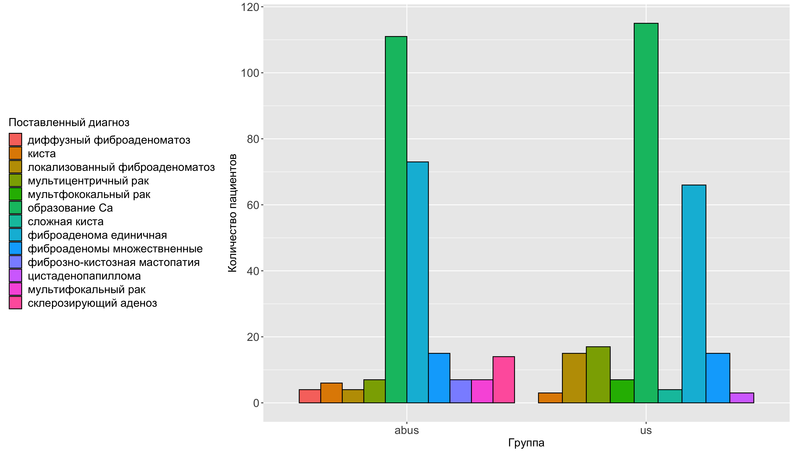

Рисунок №5.17. Сравнение методов УЗИ и ABUS по показателю "Поставленный диагноз" в группе D.

## 5.3 Определение чувствительности, спецефичности и точности методов для обнаружения кальцинатов в группе D с построением прогностической модели

При оценке УЗИ в группе C количество истинно верно определенных образований как отсутвие кальцината было 556 , количество верно опредленных образований как наличие кальцината было 18 , количество неверно определенных образований как отсутсвие кальцината было 47 и количество неопределенных отвовавших кальциантов образований как найденное было 7 . Точность метода составила 0.91 [95% ДИ: 0.89 , 0.93 ]. P-Value модели составил 0.08 что означает, что модель отличается от точности нулевой гипотезы. Коэфициент Kappa составил 0.36 показывает, что метод не имеет существенно отличную от контрольного метода частоту верно определенных результатов (количество истино положительных и отрицательных результатов). Тест Макнемара составил 0 показывает, что метод не имеет существенно отличную от контрольного метода частоту ошибок (количество ложноположительных и ложноотрицательных результатов). Чувствительность метода составила 0.28 . Специфичность метода составила 0.99 . Доля положительных прогнозов составила 0.72 . Доля отрицательных прогнозов составила 0.92 . Доля истинно положительных случаев в наборе данных составила 0.1 . Доля истинно положительных случаев, правильно определнный методом составила 0.03 . Отбалансированная точность метода составила 0.63 (Таблица №5.19). При оценке УЗИ в группе D количество истинно верно определенных образований как отсутвие кальцината было 488 , количество верно опредленных образований как наличие кальцината было 65 , количество неверно определенных образований как отсутсвие кальцината было 84 и количество неопределенных отвовавших кальциантов образований как найденное было 18 . Точность метода составила 0.84 [95% ДИ: 0.81 , 0.87 ]. P-Value модели составил 0 что означает, что модель отличается от точности нулевой гипотезы. Коэфициент Kappa составил 0.47 показывает, что метод не имеет существенно отличную от контрольного метода частоту верно определенных результатов (количество истино положительных и отрицательных результатов). Тест Макнемара составил 0 показывает, что метод не имеет существенно отличную от контрольного метода частоту ошибок (количество ложноположительных и ложноотрицательных результатов). Чувствительность метода составила 0.44 . Специфичность метода составила 0.96 . Доля положительных прогнозов составила 0.78 . Доля отрицательных прогнозов составила 0.85 . Доля истинно положительных случаев в наборе данных составила 0.23 . Доля истинно положительных случаев, правильно определнный методом составила 0.1 . Отбалансированная точность метода составила 0.7 (Таблица №5.19). При оценке ABUS в группе D количество истинно верно определенных образований как отсутвие кальцината было 488 , количество верно опредленных образований как наличие кальцината было 62 , количество неверно определенных образований как отсутсвие кальцината было 87 и количество неопределенных отвовавших кальциантов образований как найденное было 18 . Точность метода составила 0.84 [95% ДИ: 0.81 , 0.87 ]. P-Value модели составил 0 что означает, что модель отличается от точности нулевой гипотезы. Коэфициент Kappa составил 0.45 показывает, что метод не имеет существенно отличную от контрольного метода частоту верно определенных результатов (количество истино положительных и отрицательных результатов). Тест Макнемара составил 0 показывает, что метод не имеет существенно отличную от контрольного метода частоту ошибок (количество ложноположительных и ложноотрицательных результатов). Чувствительность метода составила 0.42 . Специфичность метода составила 0.96 . Доля положительных прогнозов составила 0.77 . Доля отрицательных прогнозов составила 0.85 . Доля истинно положительных случаев в наборе данных составила 0.23 . Доля истинно положительных случаев, правильно определнный методом составила 0.09 . Отбалансированная точность метода составила 0.69 (Таблица №5.19). При оценке УЗИ в выборке пациенток 40 лет и старше количество истинно верно определенных образований как отсутвие кальцината было 1044 , количество верно опредленных образований как наличие кальцината было 83 , количество неверно определенных образований как отсутсвие кальцината было 131 и количество неопределенных отвовавших кальциантов образований как найденное было 25 . Точность метода составила 0.88 [95% ДИ: 0.86 , 0.9 ]. P-Value модели составил 0 что означает, что модель отличается от точности нулевой гипотезы. Коэфициент Kappa составил 0.45 показывает, что метод не имеет существенно отличную от контрольного метода частоту верно определенных результатов (количество истино положительных и отрицательных результатов). Тест Макнемара составил 0 показывает, что метод не имеет существенно отличную от контрольного метода частоту ошибок (количество ложноположительных и ложноотрицательных результатов). Чувствительность метода составила 0.39 . Специфичность метода составила 0.98 . Доля положительных прогнозов составила 0.77 . Доля отрицательных прогнозов составила 0.89 . Доля истинно положительных случаев в наборе данных составила 0.17 . Доля истинно положительных случаев, правильно определнный методом составила 0.06 . Отбалансированная точность метода составила 0.68 (Таблица №5.19).

Таблица №5.19. Определение точности, P-уровня значимости модели, коэфициент Kappa, Тест Макнемара, чувствительности, специфичности и отбалансированной точности в группах А и B.

| Метод | Точность | P-Value | Коэфициент Kappa | Тест Макнемара | Чувствительность | Специфичность | Отбалансированная точность |
|----|----|----|----|----|----|----|----|
| УЗИ в группе C | 0.91 [95% ДИ: 0.89 , 0.93 ]. | 0.08 | 0.36 | 0 | 0.28 | 0.99 | 0.63 |
| УЗИ в группе D | 0.84 [95% ДИ: 0.81 , 0.87 ]. | 0 | 0.47 | 0 | 0.44 | 0.96 | 0.7 |
| УЗИ в выборке пациенток 40 лет и старше | 0.88 [95% ДИ: 0.86 , 0.9 ]. | 0 | 0.45 | 0 | 0.39 | 0.98 | 0.68 |
| ABUS в группе D | 0.84 [95% ДИ: 0.81 , 0.87 ]. | 0 | 0.45 | 0 | 0.42 | 0.96 | 0.69 |

На основании полученных данных, пыла построена предсказательная модель нахождения кальцинатов для изучаемых методов.

ROC-кривая предсказательной модели нахождения кальцинатов для метода УЗИ, по данным полученным в группе D представлена на рисунке № 5.19. Площадь под кривой (AUC- area under cruve) составила: 0.735 95% ДИ: 0.684 - 0.786

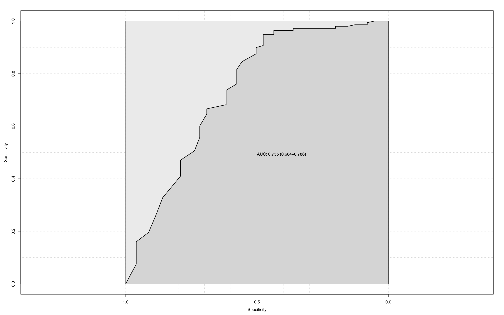)

Рисунок №5.19. ROC-кривая предсказательной модели нахождения кальцинатов для метода УЗИ, по данным полученным в группе D.

ROC-кривая предсказательной модели нахождения кальцинатов для метода УЗИ, по данным полученным в группе D представлена на рисунке № 5.19. Площадь под кривой (AUC- area under cruve) составила: 0.722 95% ДИ: 0.671 - 0.774


Рисунок №5.19. ROC-кривая предсказательной модели нахождения кальцинатов для метода УЗИ, по данным полученным в группе D.

(Таблица №5.20)

Таблица №5.20. Определение площади под кривой представленных предсказательных моделей метода в группе D.

| Метод           | Площадь под кривой          |
|-----------------|-----------------------------|
| УЗИ в группе D  | 0.735 95% ДИ: 0.684 - 0.786 |
| ABUS в группе D | 0.722 95% ДИ: 0.671 - 0.774 |

## 5.4 Клинические примеры

## 5.5 Заключение
