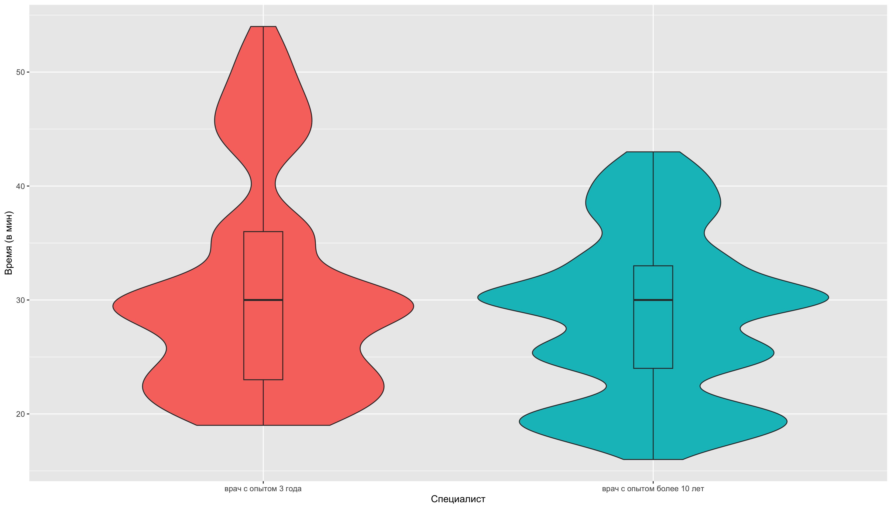
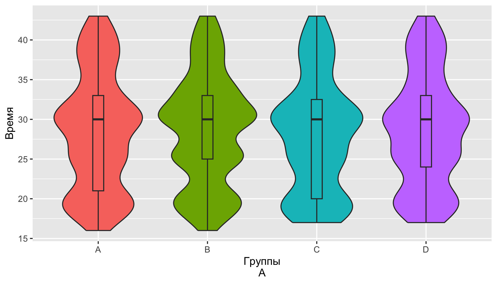
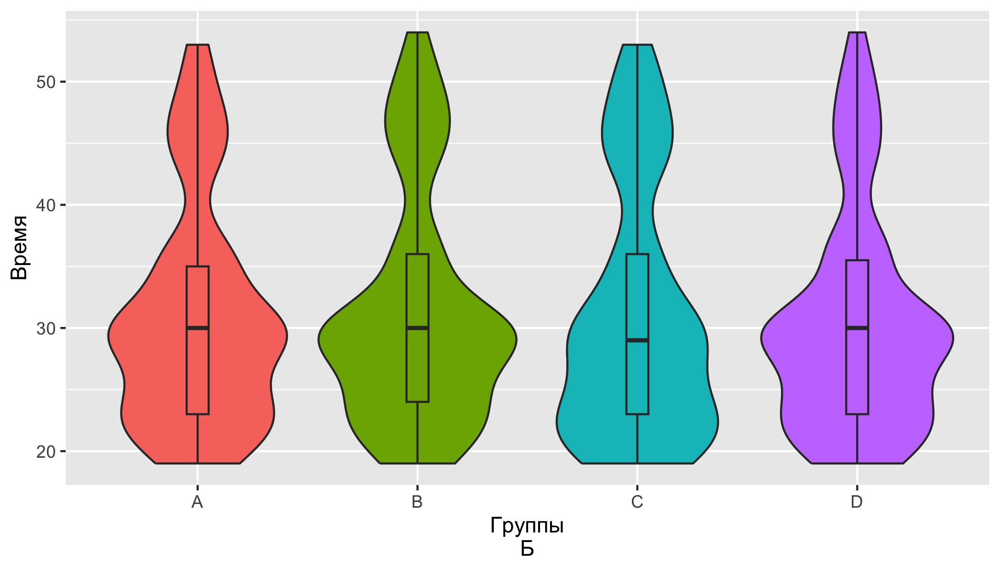
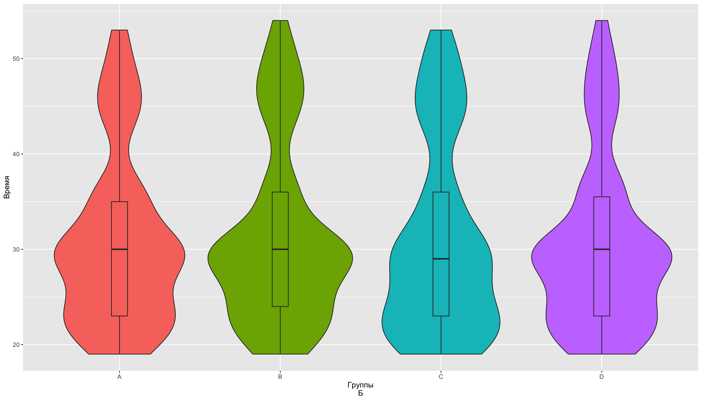
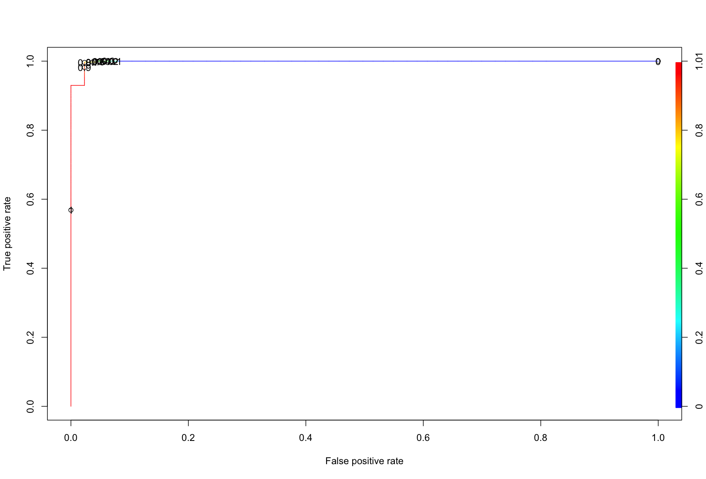
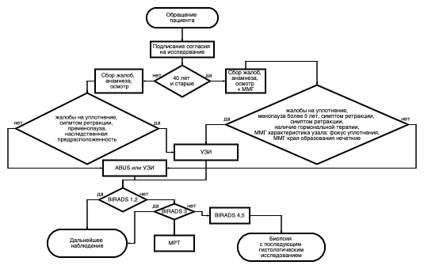

```{r setup, include=FALSE}
knitr::opts_chunk$set(echo = TRUE)
```

# ГЛАВА 6. ОПРЕДЕЛНИЕ ИСПОЛЬЗОВАНИЯ ABUS В СТРУКТУРЕ РАННЕЙ ДИАГНОСТИКИ НОВОБРАЗОВАНИЙ МОЛОЧНОЙ ЖЕЛЕЗЫ

Определение места ABUS в структуре ранней диагности новобразований в молочной железе требовало решения следующих вопросов: 1) определение временной эффективности для увеличения количества пациентов на единицу времени и 2) поредление ниболее значимых факторов, которые указывают на то, что ожидается малая вероятность нахождения образования, требующего пункцию, чтобы переопределить маршуртизацию пациента по скрининг с использование ABUS.
Данное требоование продиктовано тем, что только УЗИ специалист может выполнить пункцию образования.

## 6.1 Оценка метододов по временной характеристике и зависимость от специалиста

В настоящем исследовании было принято решение учесть фактор опытности специалиста, выполняющего УЗ исследование.
В исследовании участвовали 2 специалиста с опытом более 10 лет и специалист с опытом 3 года на момент настоящего исследования.
Более опытный специалист выполнил 1750 исследований из них 771 исследовний в выборке пациенток 40 лет и старше и 979 исследовний в выборке пациенток до 40 лет.
Специалист с опытом 3 года выполнил 1044 исследований из них 512 исследовний в выборке пациенток 40 лет и старше и 532 исследовний в выборке пациенток до 40 лет.
Медиана время выполнения УЗИ у опытного специалиста составил 30 [Q1-Q3: 24;33] мин, такая же была у специалиста с опытом 3 года составил 30 [Q1-Q3: 23;36] мин.
Разница между группами по времени выполнения составила p-уровень \<0.01.
Это свидетельствует о том, что менее опытный специалист может тратить больше времени на исследование (Рисунок 6.1).



Рисунок 6.1.
Скорость выполнеия исследования разными специалистами

Разница между группами по времени выполнения составила p-уровень = 0.46.
Полученный результат говорит о том, что различные группы не влияют на скорость выполнения протокола УЗИ у обоих специалистов (Рисунок 6.2 А,Б).





Рисунок 6.2.
А - Распределение длительности выполнения исследования УЗИ по группами, исследования выполнял специалист с опытом более 10 лет, Б- Распределение длительности выполнения исследования УЗИ по группами, исследования выполнял специалист с опытом 3 года.

Далее следует привести данные временных характеристик по изучаемым методам ранней диагностики ракак молочной железы.
Медиана время выполнения УЗИ по всей выборке составил 30 [Q1-Q3: 23;34] мин, однако медиана время выполнения ABUS по всей выборке составил 15 [Q1-Q3: 12;18] мин.

Разница между группами по времени выполнения составила p-уровень \<0.01.

Такая статистическая разница отражает очевидную разницу в скорости выполнения выполнения исследований отражены на рисуноке 6.3.



Рисунок 6.3.
Разность скорости выполнения между методами

Следует сказать, что выявленная разница по времени между методами, а так же зависимость УЗ исследования от специалиста показывает то, что система ABUS имеет конкурентные приемущества при ранней диагностике рака молочной железы по временной характеристике.
Однако стоит сказать, что при выполнии ABUS исследования нельзя выполнить пункцию для проведения гистологического исследования и требуется выполнение УЗИ исследования и проведения пункции под навигацией.
Следовательно ABUS исследование может позволить облегчить рутинизацию выполнения УЗИ исследования в тех случаях, где обнаружение образования, требующего пункцию маловероятно.
Для этого было выполнено определение наиболее значимых факторов для обоснования использования ABUS в рутинной практике.

## 6.2 Определение наиболее значимых факторов и алгоритма оптимизации использования ABUS

Наиболее значимые факторы для определения вероятности нахождения рака молочной железы при скрининге разделяется на два этапа.
Первый этап состоит из преддиагностических факторов входящих в сбор анамнеза, жалоб и осмотра врача.
Второй этап более применим только к группе пациенток возрасте 40 лет и старше а именно данные заключения ММГ.
Для каждого этапа были составлены педикторные модели, целью которых было выявление наиболее значимых факторов указывающих на высокую вероятность нахождения образования для которого требуется проведение биопсии под навигацией.
Это необходимо в первую очередь для определения маршрутизации пациентов, а именно для пациентов у которых такая вероятность невысокая, то эти пациенты направляются для скрининга систем ABUS.

### 6.2.1 Оценка преддиагностических факторов в выборке пациенток до 40 лет

Для определения наиболее значимых преддиагностических факторов производился подбор предиктороной модели с наиболее значимыми факторам.
В выборке пациенток до 40 лет была получена формула Y \~ 0.05\* (возраст пациента) + 1.82\*(Первичный диагноз:Диффузный фиброаденоматоз) + 1.6\*(Репродуктивный статус: пременопауза)+ 0.86\*(Жалоба на уплотнение)+ 4.36\*(Cимптом ретракции)+ 2.92\*(Наследственная предрасположенность).

Были расчитаны предикторные коэфициенты на основании пердставленной модели и построек график ROC- кривой качества модели (Рисунок 6.4).
Площадь под кривой составила 0.9991 Также были расчитаны показатели точности, специфичности и чувствительности модели с определением коэфициента отсечения (Рисунок 6.5).
в представленной модели коэфициент отсечения был 0.918 По высчитанному коэфициенту отсечиния был составлен прогноз рекомендаций к скринингу


Рисунок 6.4.
ROC- кривая предикторной модели опредления показаний к ABUS для скрининга у пациенток в выборке до 40 лет


Рисунок 6.5.
Показатели точности, специфичности и чувствительности модели с определением коэфициента отсечения в выборке до 40 лет

На основании данных, полученных в нашем исследовании скрининг с ABUS в выборке до 40 лет не показан в 4.04% (61/1511случаев)[95% ДИ 0.03;0.05] и в 95.96% (1450/1511случаев)[95% ДИ 0.95;0.97] его можно использовать.

Представленная модель в выборке до 40 лет сработала корректно в 99.21% (1499/1511случаев)[95% ДИ 0.99;1] и в 0.79% (12/1511случаев)[95% ДИ 0;0.01] предсказание можно отнести к невернному, а именно ложноположительные результаты.


### 6.2.2 Оценка преддиагностических факторов и факторов ММГ в выборке пациенток 40 лет и старше

Для определения наиболее значимых преддиагностических факторов производился подбор предиктороной модели с наиболее значимыми факторам.
В выборке пациенток 40 лет и старше была получена формула Y \~ 0.05\* (возраст пациента) + 2.27\*(Первичный диагноз:Листовидная опухоль)+ 3.17\*(Первичный диагноз:Локализованный фиброаденоматоз) + 1.25\*(Репродуктивный статус: менопауза более 5 лет) + 3.01\*(Жалоба на уплотнение) + 1.77\*(Cимптом ретракции)+ 1.75\*(Наследственная предрасположенность)+ 1.19\*(Наличие гормональной терапии)+ 2.18\*(Фон на ММГ: железистая ткань)+ 2.25\*(Характеристика узла на ММГ: фокус упролнения)+ 5.02\*(Края образования на ММГ: нечеткие).

Были расчитаны предикторные коэфициенты на основании пердставленной модели и построек график ROC- кривой качества модели (Рисунок 6.4).
Площадь под кривой составила 0.9983 Также были расчитаны показатели точности, специфичности и чувствительности модели с определением коэфициента отсечения (Рисунок 6.5).
в представленной модели коэфициент отсечения был 0.935 По высчитанному коэфициенту отсечиния был составлен прогноз рекомендаций к скринингу



Рисунок 6.4.
ROC- кривая предикторной модели опредления показаний к ABUS для скрининга у пациенток в выборке 40 лет и старше


Рисунок 6.5.
Показатели точности, специфичности и чувствительности модели с определением коэфициента отсечения в выборке 40 лет и старше

На основании данных, полученных в нашем исследовании скрининг с ABUS в выборке 40 лет и старше не показан в 15.74% (202/1283случаев)[95% ДИ 0.14;0.18], в 84.26% (1081/1283случаев)[95% ДИ 0.82;0.86].

Представленная модель в выборке 40 лет и старше сработала корректно в 97.12% (1246/1283случаев)[95% ДИ 0.96;0.98] и в 2.88% (37/1283случаев)[95% ДИ 0.02;0.04] нет. Среди 37 случаев неверного предсказания было 4 случая ложноотрицательных результата и эти пациенты буду направлены на повтоное исследование к специалисту УЗИ для проведения трепанбиопсии. 33 случая квалифициорованы как ложноположительные.

### 6.2.3 Алгоритм оптимизации использования ABUS

Исходя из данных, описанных в литературе [@xin2021], а также данных полученных в настоящем исследовании предлагается следующий алгоритм оптимизации использования системы ABUS.

Пациенты, прришедшие на первичный осмотр по жалобам или по скринингу подписывают согласие на исследование.
Далее пациентки машуртизируются по возрасту до 40 лет и 40 лет, так как маммография остается золотым стандартом скрининга рака молочной железы, но маммография имеет меньшую чувствительность при выявлении рака молочной железы у женщин с плотной грудью, особенно если речь идет о пациентках до 40 лет [@nazari2018].

В выборке пациенток до 40 лет, если не выявлены следующие предикторные факторы: Репродуктивный статус: пременопауза, Жалоба на уплотнение, Симптом ретракции, Наследственная предрасположенность к раку МЖ, то пациентка может быть направлена на иследование ABUS, при обнаружении указанных предикторных факторов пациентку рекомендовано направить на УЗИ исследование.
По результатам выставляется категория по классификации BIRADS, в зависмиости от которой проводят дальнейшие действия.

В выборке пациенток 40 лет и старше выполняется первичный осмотр и ММГ и если не выявлены следующие предикторные факторы: Репродуктивный статус: менопауза более 5 лет, Жалоба на уплотнение, Cимптом ретракции, Наследственная предрасположенность, наличие гормональной терапии, Фон на ММГ: железистая ткань, Характеристика узла на ММГ: фокус упролнения, Края образования на ММГ: нечеткие, то пациентка может быть направлена на иследование ABUS, при обнаружении указанных предикторных факторов пациентку рекомендовано направить на УЗИ исследование.
По результатам выставляется категория по классификации BIRADS, в зависмиости от которой проводят дальнейшие действия.

При поставленной категории BIRADS1 или BIRADS2 рекомендовано дальнейшее наблюдение.

При поставленной категории BIRADS3 требуется дополнительное выполнение МРТ и постановка категории BIRADS.
При поставленной категории после выполнений МРТ BIRADS1, BIRADS2 или BIRADS3 рекомендовано дальнейшее наблюдение.

При поставленной категории BIRADS4 или BIRADS5 рекомендуется проведение трепан биопсии под УЗ-наведением или стереотаксическим наведением с последующей морфологической и при необходимости иммуногистохимической верификацией.



Рисунок 6.5.
Оптимизированный алгоритм с учетом использования ABUS


## 6.3 Анализ полученных результатов
В настоящей главе представлены результаты, завершающие текущее исследование. Было проведен сравнительный анализ временных характеристик в зависимости от специалиста, а также между изучаемыми методами. Подтверждены ожидаемы результаты от том, метод УЗИ зависит от специалиста и вне зависимости от опыта специалиста выполнение диагностики на ABUS быстрее. Однако перед исследователями стояла задача определить место системы ABUS в существующей системе скриненг ранней диагностики новообразований молочной железы с целью выявления злокачественного новообразования. Был проведен многофакториальный анализ по которым можно предположить, что ожидается определение категории BIRADS4 или BIRADS5 после проведения УЗ-диагностики. Эти категории пациентов необходимо направлять у специалисту УЗИ, так как предполагается проведение трепан биопсии под УЗ-наведением или стереотаксическим наведением с последующей морфологической и при необходимости иммуногистохимической верификацией. На основании логистической регресси, основанных на преддиагностических данных, а именно данные жалоб, анамнеза, осмотра и результатов ММГ. ТАкие факторы были выявлены для категории пациенток до 40 лет и 40 лет и сташе. Потенциальным преимуществом предлагаемого рекомендательного алгоритва является то, то можно поток пациенток с предполагаемой низкой веротностью того, что будет требоваться биопсия напрвлять на исследование ABUS. Такой подход может снизить нагрузку на врачей УЗ-диагностки и сконцентрировать их внимание на фокусной группе предполагаемо требующих внимание специалиста. Учитывая выявленный временной фактор, то можно провести больше исследований на единицу времени.
Результаты, изложенные в настоящей главе свидетельствую о решении шестой и завершающей задачи диссертационного исследования. Можно с уверенностью сказать, что ABUS не уступает по своим возможностям традиционному методу УЗИ в ранеей диагностике новообразований молочной железы как у пациенток до 40 лет, так у пациенток 40 лет и старше. Метод диагностики ABUS является не замещающим, а дополнящим традиционную УЗИ диагностику в структуре ранней диагностики.
