```{r setup, include=FALSE}
knitr::opts_chunk$set(echo = TRUE)
```

# ВВЕДЕНИЕ

## Актуальность исследования

Рак молочной железы (РМЖ) относится к серьезной глобальной проблеме здравоохранения: это наиболее часто диагностируемый вид рака в мире. Количество случаев РМЖ, зарегистрированных в 2020 году, составило 2,26 миллиона [@wilkinson2022], причем более половины из них зарегистрированы в менее развитых регионах мира [@sung2021].

Наблюдаемое преимущество в выживаемости пациентов с диагностированным РМЖ в более развитых странах в значительной степени может быть связано с сочетанием стратегий раннего выявления, доступа к ранней диагностике и эффективным методам лечения.

Напротив, отсроченное проявление чаще встречается в менее развитых регионах мира, где более половины случаев РМЖ относятся местно-распространенному или метастатическому. РМЖ представляет наиболее распространенный вид рака, диагностируемый ежегодно среди женщин (более 1 из 10 новых ежегодных случаев РМЖ). В соответствии с данными ВОЗ и The Global Cancer Observatory (GCO), РМЖ — самое распространенное онкологическое заболевание у женщин с частотой выявления 46,4 на 100 тыс. женщин в мире и 53,6 на 100 тыс. в Российской Федерации (РФ).

РМЖ также является основной причиной смерти от ЗНО среди женщин; смертность от РМЖ в мире составляет 13,0 на 100 тыс. женщин, в РФ — 15,1 на 100 тыс [@mahvi2018; @каприн2017злокачественные; @каприн2020состояние; @кушунина2019выявление].

Большинством руководств маммографический скрининг был рекомендован женщинам в возрасте 40–74 лет [@siu2016; @hamashima2016; @qaseem2019; @ren2022; @urban2017], женщинам в возрасте 50–69 лет проведение скрининга было обязательным [@schünemann2019; @wöckel2018; @ren2022; @migowski2018].

Определение плотности МЖ поможет в более точной стратификации риска развития РМЖ (прогностической и профилактической), позволит определиться с необходимым объемом дополнительных диагностических методик исследования плотной МЖ, как независимого фактора риска развития РМЖ.

Американскаяколлегия радиологов (ACR) в 3-ем издании BI-RADS описывает плотность МЖ с точки зрения четырех категорий общей плотности. Первоначально эти категории были простыми описательными терминами («жировая», «рассеянная плотность», «гетерогенно плотная» и «чрезвычайно плотная») [@d2018breast].

Литературные данные подтверждают факт того, что женщины с плотной МЖ типа D имеют четырех-шестикратное увеличение риска по сравнению с женщинами с плотностью МЖ типа A [@boyd2013; @lee2012]. Именно плотность МЖ в общей популяции чаще по сравнению с другими факторами такими как возраст, генетические мутации BRCA 1и BRCA2, является самым сильным предиктором развития РМЖ.

В некоторых исследованиях было высказано предположение, что только показатель плотности МЖ вносит значительный вклад в риск развития РМЖ на популяционном уровне, составляя 16% всех диагностированных РМЖ [@boyd2011; @bae2014; @boyd2007; @fasching2006].

По мнению большинства исследователей интервальный рак (рак, выявленный в промежутке между запланированными скрининговыми маммограммами) в 13-31 раз более вероятен в МЖ с плотностью типа D, чем в МЖ с плотностью типа А [@posso2019; @boyd2007; @ciatto2004; @strand2019].

Плотность МЖ также является биомаркером для прогнозирования ответа на неоадъювантную химиотерапию. Skarping, I.et al. в 2019 г. в своем исследовании показали, что женщины в пременопаузе с высокой маммографической плотностью плохо реагируют на неоадъювантную химиотерапию [@skarping2019].

Маммографическая плотность МЖ длительное время была предметом дискуссий между учеными и практическими докторами. В частности, активно обсуждался вопрос необходимости информирования женщин о наличии у них высокой плотности МЖ [@almousa2014; @machida2015; @tossas-milligan2019]. Большинство авторов сходятся во мнении, что женщины должны быть проинформированы в связи с тем, что плотная ткань МЖ может 1) скрывать опухоли на маммограмме, 2) повышать риск развития РМЖ и 3) требовать проведения дополнительных методов исследований, таких как УЗИ и магнитно-резонансной томографии (МРТ) [@tossas-milligan2019].

Таким образом в настоящее время требуется изучении возможностей новых методов скрининга МЖ.

## Степень разработанности проблемы

Развитие автоматизированного ультразвукового томосинтеза (3D УЗИ/АУС/ABUS/ABVS) является одним из наиболее перспективных направлений, который позволяет получить в среднем за 3 сканирования (коронарная, сагиттальная и аксиальная) плоскости изображение всей МЖ.

Кроме того, разработано специальное программное обеспечение для 3D УЗИ с целью автоматизированного обнаружения патологических образований (CAD) (QVCAD™, QView Medical), которое получило одобрение FDA [@vourtsis2019; @jiang2018].

Анализ различных исследований показал более высокие или равные результаты обнаружения поражений МЖ с помощью 3D УЗИ по сравнению с 2D УЗИ. Показатели обнаружения с помощью 3D УЗИ варьируют от 84,8% до 100%, тогда как соответствующие показатели для ультразвукового метода- от 60,6% до 100% [@wang2012; @xiao2015; @wang2012a; @lin2012; @kim2013; @vourtsis2019].

В литературе также встречаются работы, посвященные дифференциации злокачественных и доброкачественных образований МЖ с помощью 3D УЗИ [@chou2007automated; @golatta2013; @golatta2014; @kotsianos-hermle2009].

3D УЗИ, благодаря хорошей визуализации МЖ также является новым методом оперативного планирования [@grady2010]. Размер поражения, определенный с помощью 3D УЗИ, хорошо коррелирует с результатами МРТ [@schmachtenberg2017] и гистопатологическими изменениями [@chang2015].

Коронарная плоскость имеет особое значение для хирургического планирования из-за лучшей визуализации сегментарного доступа и схожей ориентации при позиционировании пациента во время операции [@amy2018lobar]. 3D УЗИ также позволяет визуализировать сателлитные очаги размером менее 1 см, что очень ценно в оценке многоочагового рака.

3D УЗИ может применяться при оценке результатов МРТ в качестве уточняющей методики [@halshtok2015use; @girometti2017]: так, например, 3D УЗИ превзошел 2D УЗИ в качестве вторичного исследования после проведения МРТ МЖ, выявив дополнительные очаги [@kim2016].

В работах отечественных исследователей [@гажонова2015возможности] изучались возможности данной методики в определении типа строения МЖ среди женщин разных возрастных групп, имеющих различную патологию. Полученные ими данные свидетельствовали и значительном увеличении специфичности данного метода (до 96%) у пациенток с типами плотности МЖ С и D, что может иметь важное значение при скрининге женщин данной категории [@гажонова2015возможности].

Была доказана добавленная ценность 3D УЗИ к ММГ при высокой плотности МЖ, где было показано повышение выявляемости РМЖ на 57% [@vourtsis2018].

Таким образом, 3D УЗИ— это технологический прогресс в области визуализации и скрининга МЖ с преимуществами стандартизации сканирований, лучшего обнаружения небольших поражений, особенно у женщин с повышенной плотностью МЖ, и сокращения времени сканирования. Продолжаются интенсивные исследования новых разработок и дополнительных приложений технологии 3D ABUS. Оценка плотности МЖ с помощью 3D УЗИ также является еще одним перспективным направлением.

Вместе с тем стоит сказать, что тактика скрининнга в разных возрастных группах, а именно в группе пациенток до 40 лет и группе пациенток 40 лет и старше, разная. Не смотря на потенциальные преимущества 3D УЗИ четкого понимания диагностической эффективности, прогностической ценности, возможности визуализации кальцинатов нет и представленные вопросы требуют решения.

**Цель исследования** - повысить эффективность выявления образований молочных желез методом автматизированного объемного ультразвукового сканирования.

## Задачи исследования

1.Провести сравнительный анализ диагностической эффективности (чувствительности, специфичности и точности,) ультразвукового исследования в B- режиме и автоматизированного объемного ультразвукового сканирования молочных желез (3D УЗИ), и комбинации этих методик у женщин в возрастной группе 30-39 лет с высокой плотностью тканей молочной железы.

2.Провести сравнительный анализ диагностической эффективности (чувствительности, специфичности и точности,) цифровой маммографии, ультразвукового исследования в B-режиме и автоматизированного объемного ультразвукового сканирования молочных желез (3D УЗИ), и комбинации этих методик у женщин в возрастной группе 40-69 лет с высокой плотностью тканей молочной железы.

3.Определить прогностическую ценность методики автоматизированного объемного сканирования молочных желез (3D УЗИ) в диагностике образований молочной железы у женщин разных возрастных групп.

4.  Изучить возможность визуализации кальцинатов на 3D сонотомограммах и в 2D режиме ультразвукового исследования с использованием дополнительной функции Micro Pure.

5.  Оптимизировать алгоритмы обследования женщин с образованиями молочных желез с использованием возможностей нового метода автоматизированного объемного ультразвукового сканирования.

## Научная новизна

Впервые на большом материале проведен сравнительный анализ эффективности методик традиционной рентгеновской маммографии, ультразвукового исследования в 2D режиме и автоматизированного объемного ультразвукового сканирования (3D УЗИ) у женщин в разных возрастных группах.

Впервые была определена прогностическая ценность автоматизированного объемного ультразвукового сканирования в комплексной диагностике образований молочных желез.

Впервые было определено место этого метода в мультимодальном лучевом алгоритме обследования женщин с плотной молочной железой в разных возрастных группах.

## Теоретическая и практическая значимость работы

1.  Доказана прогностическая ценность автоматизированного объемного ультразвукового сканирования в комплексной диагностике образований молочных желез в группе пациенток моложе 40 лет, что позволило разработать новые подходы к скринингу РМЖ.

2.  Выявлена положительная корреляция результатов автоматизированного объемного ультразвукового сканирования в комплексной диагностике образований молочных желез в группе пациенток 40 лет и старше не уступающая традиционному УЗ-исследованию.

3.  Усовершенствован алгоритм проведения скрининга РМЖ с использованием методики автоматизированного объемного ультразвукового сканирования в комплексной ранней диагностике образований молочных желез у женщин разных возрастных групп.

## Методология и методы исследования

Исследование выполнено на кафедре лучевой диагностики ФГБОУ ВО «Северо-Западный государственный Медицинский университет им. И.И. Мечникова». Клинический отбор пациентов проводился на базе одной медицинской клиники- «СМТ», состоящей из двух зданий -амбулаторно-поликлического комплекса и хирургического корпуса со стационаром. Объектом исследования являлись пациенты с новообразованиями новообразования молочной железы, регистрируемые при диагностике с использованием мануального ультразвукового исследования (2D УЗИ), маммографии (ММГ) и автоматизированного объемного УЗИ сканирования молочных желез (ABUS, далее 3D УЗИ). Предметом исследования являлось автоматизированное объемное УЗИ сканирование молочных желез, с последующим анализом наиболее важных факторов как на преддиагностическом этапе, так и при выполнении конкретного диагностического метода. Дизайн исследования можно охарактеризовать ретро-проспективное клиническое исследование. Протокол настоящего исследования был одобрен на заседании локального этического комитета СЗГМУ им. Мечникова №9 от 12.10.2022 года.

В первой части настоящего исследования был проведен аналих профильной отечественной и зарубежной литературы для оценки состояния проблемы вывляемости РМЖ.

Вторая часть исследования состояла из клинических и диагностических исследований. Всего в исследование вошло 2794 пациенток. Критерии включения: пациенты женского пола в возрасте от 18 до 69 лет; женщина, посетившая врача для обследования молочной железы, с отсутствием видимых признаков рака молочной железы. Критериями исключения были женщины, которые были беременны, кормили грудью или планировали забеременеть; имели оперативное лечение в анамнезе (лампэктомия, мастэктомия, увеличение МЖ), эксцизионная или чрескожная биопсия за последние 12 месяцев, пациентки, получавшие лечение по поводу рака молочных желез за последние 12 месяцев. Все участники подписали форму информированного согласия. На первом этапе всем пациентам проводили клинический осмотр, пальпацию, собрали информацию о социально-демографических данных и потенциальных факторах риска РМЖ.

На втором этапе пациентки были разделены на 2 независимые друг от друга выборки по принципу возраста: выборка пациенток с возрастом моложе 40 лет и выборка пациенток с возрастом от 40 лет включительно. Принцип разделения по возрасту был связан с различными диагностическими подходами в скрининге рака молочной железы. У пациенток моложе 40 лет ММГ менее эффективна, в связи с низкой чувствительностью метода и основным методом диагностики используется УЗИ [@mandelson2000]. У пациенток моложе от 40 лет метод ММГ является обязательным в скрининге РМЖ [@narayan2020].

В выборку моложе 40 лет вошло 1511 пациенток. Эта выборка пациенток была разделена на две группы A и B. В группу A вошло 724 пациенток, которым скрининг проводился с использованием мануальной УЗИ диагностики (2D УЗИ) и автоматизированного объемного УЗИ сканирования молочных желез (3D УЗИ) (исследуемая группа). В группу B вошло 787 пациенток, в этой группе скрининг проводился только с использованием 2D УЗИ диагностики (контрольная группа). В выборку 40 лет и старше вошло 1283 пациенток. Эта выборка пациенток была разделена на две группы С и D. В группу С вошло 655 пациенток и в это группе скрининг проводился с использованием 2D УЗИ, маммографии и автоматизированного объемного УЗИ сканирования молочных желез (исследуемая группа). В группу D вошло 628 пациенток и в этой группе скрининг проводился только с использованием 2D УЗИ и маммографии (контрольная группа). Включение указанного количества пациенток в группы было основано на расчете статистической мощности.

Диагностический этап, включал в себя непосредственно диагностическое исследование с использованием метода 2D УЗИ, маммографии и автоматизированного объемного УЗИ сканирования молочных желез в зависимости от группы распределения. Производился сбор данных для последующего выявления наиболее значимых факторов, а также выявления эффективности изучаемых методов и прогностической ценности метода. 2D УЗИ выполняли на системах экспертного класса: GE LOGIQS 8 (GE Medical Systems, Милуоки, Висконсин, США), Toshiba Aplio 300 (Canon Япония). 3D-автоматизированное ультразвуковое исследование выполняли на аппарате Invenia ABUS -производства GE Healthcare (Саннивейл, Калифорния, США) 2018 года выпуска по непрерывной автоматизированной методике. Пациентки старше 40 лет прошли двухпроекционную цифровую маммографию. Также ее выполняли женщинам моложе 40 лет в случае положительного семейного или личного анамнеза - рак молочной железы. Показаниями к проведению МРТ была выставленная после проведения 2D УЗИ категория 3 по классификации BI-RADS. Результаты выявленных изменений были классифицированы по BI-RADS по шести категориям [@spak2017]: 0 = неполные данные, 1 = нормальные, 2 = доброкачественные, 3 =вероятно доброкачественные, 4 = подозрительные, 5 = с высокой степенью вероятности злокачественные, для 2D УЗИ, 3D УЗИ и ММГ. Для категории BI-RADS3 обязательно проводилась магнитно-резонансная томография (МРТ) для выявления истинно отрицательных и ложноотрицательных результатов. Женщинам, отнесенным к категории 4 или 5, проводилась трепан биопсия под уз-наведением или стереотаксическим наведением с последующей морфологической и при необходимости иммуногистохимической верификацией.

На последнем этапе выполнялась статистическая обработка данных.

## Основные положения, выносимые на защиту

1.  Диагностическая эффективность автоматизированного УЗИ молочных желез у пациенток моложе 40 лет сопоставима по показателю специфичности и лучше по показателю точности, чувствительности и прогностической модели по сравнению с ультразвуковым исследованием в 2D режиме.

2.  Диагностическая эффективность автоматизированного 3D-УЗИ молочных желез у пациенток 40 лет и старше сопоставима по показателю чувствительности и лучше по показателю точности, специфичности по сравнению с ультразвуковым исследованием в 2D режиме.

3.  Предлагаемый оптимизированный алгоритм определяет место 3D УЗИ в структуре скрининга рака молочной железы и потенциально может снизить нагрузку на врачей ультразвуковой диагностики и сократить время на проведение исследования.

## Степень достоверности и апробация диссертационной работы

Достоверность полученных результатов определяется достаточным количеством набранного материала для решения поставленной цели и задач исследования. Выбраны адекватные статистические методы обработки данных. Объем проведенной работы достаточен для решения поставленных задач, цели исследования и обоснования выводов, и клинических рекомендаций. Основные положения настоящего диссертационного исследования были доложены на Невском радиологическом форуме ( Сборник тезисов XV международного конгресса, Санкт-Петербург, 12–13 апреля 2024 года), на Всероссийском конгрессе ординаторов медицинских вузов «Научно-практическая подготовка ординаторов(СПб, 2024), на конференции «Fundamental аnd applied sciences today XXXIII”-ХXXIII международной научно-практической конференции «Фундаментальные и прикладные науки сегодня» (Bengaluru, Karnataka, India, 2024).

## Внедрение результатов работы в практику

Результаты диссертационной работы внедрены автором в практическую деятельность АО «Поликлинический комплекс» клиники СМТ.

## Личный вклад соискателя

Автор настоящего исследования определил цель и задачи, разработал методологические подходы и дизайн исследования совместно с научным руководителем. Статистическая обработка полученных результатов была проведена самостоятельно.

Автор настоящей диссертации лично участвовал в сборе и анализе литературных данных; оценке ретро- и проспективных результатов и изучению документации; разработке насадки на датчик аппарата ультразвукового исследования для диагностики молочных желез; непосредственное планирование и организация исследований 2D и 3D УЗИ; подготовке материалов к публикации; участии в написании статей; подготовке докладов на научных конференциях по теме работы.

## Публикации

По теме диссертации опубликовано 8 печатных работ, в том числе 6 статей в рецензируемых научных журналах, входящих в список рекомендованных ВАК РФ для научных публикаций диссертантов, выпущено 1 наглядное учебное пособие по теме диссертации и получен 1 патент по теме диссертации.

## Структура и объем диссертации

Диссертация изложена на 194 страницах машинописного текста, иллюстрирована 32 рисунками, содержит 28 таблиц; состоит из введения, обзора литературы, характеристики исследуемых пациентов и описания методов исследования, а также 6 глав собственных исследований, заключения, выводов, практических рекомендаций и списка литературы, содержащего 179 источников, из них 25 отечественных и 154 иностранных.

# ГЛАВА 1. СОВРЕМЕННОЕ СОСТОЯНИЕ ВОПРОСА ДИАГНОСТИКИ ОБРАЗОВАНИЙ МОЛОЧНОЙ ЖЕЛЕЗЫ У ЖЕНЩИН.

## 1.1. Эпидемиология рака молочной железы.

Рак молочной железы (РМЖ) относится к серьезной глобальной проблеме здравоохранения: это наиболее часто диагностируемый вид рака в мире. Количество случаев РМЖ, зарегистрированных в 2020 году, составило 2,26 миллиона [@wilkinson2022], причем более половины из них зарегистрированы в менее развитых регионах мира [@sung2021]. Страны с высоким уровнем развития имеют самые высокие показатели заболеваемости РМЖ: стандартизированный по возрасту показатель заболеваемости среди женщин составляет 48 случаев на 100 000 человек, варьируя от менее 30 случаев на 100 000 человек в странах Африки к югу от Сахары до более 70 случаев на 100 000 человек в Западной Европе и Северной Америке [@abdulrahman2012epidemiology]. Наблюдаемое преимущество в выживаемости пациентов с диагностированным РМЖ в более развитых странах в значительной степени может быть связано с сочетанием стратегий раннего выявления, доступа к ранней диагностике и эффективным методам лечения. Напротив, отсроченное проявление чаще встречается в менее развитых регионах мира, где более половины случаев РМЖ относятся местно-распространенному или метастатическому.

РМЖ представляет наиболее распространенный вид рака, диагностируемый ежегодно среди женщин (более 1 из 10 новых ежегодных случаев РМЖ).

В соответствии с данными ВОЗ и The Global Cancer Observatory (GCO), РМЖ — самое распространенное онкологическое заболевание у женщин с частотой выявления 46,4 на 100 тыс. женщин в мире и 53,6 на 100 тыс. в Российской Федерации (РФ).

Анализ данных по частоте выявления злокачественных новообразований (ЗНО) у женщин свидетельствует о том, что после РМЖ следуют злокачественные новообразования кожи (15,2%, с меланомой – 17,2%), тела матки (7,8%), ободочной кишки (7,3%), шейки матки (5,0%), лимфатической и кроветворной ткани (4,7%), прямой кишки, ректосигмоидного соединения, ануса (4,4%), желудка (4,4%), яичника (4,1%), трахеи, бронхов, легкого (3,8%) [@mahvi2018; @каприн2017злокачественные; @каприн2020состояние; @кушунина2019выявление]. РМЖ также является основной причиной смерти от ЗНО среди женщин; смертность от РМЖ в мире составляет 13,0 на 100 тыс. женщин, в РФ — 15,1 на 100 тыс. женщин [@кушунина2019выявление; @каприн2014злокачественные; @tabar2016; @sardanelli2016; @sankatsing2017; @brand2019].

Соответственно последним статистическим данным и тенденции нарастания случаев регистрации РМЖ, Всемирной Организацией Здравоохранения (ВОЗ) в 2021 году запустила новую глобальную программу по борьбе с РМЖ, основные направления которой были следующими: общие мероприятия по укреплению здоровья, своевременная диагностика, комплексный подход к лечению и обеспечению всеми его необходимыми видами [@wilkinson2022]. Фундаментальной задачей данного подхода является диагностика ранних форм онкологического процесса для улучшения показателей смертности и стоимость лечения.

Одной из составляющих частей комплексной ранней диагностики РМЖ является разработка и внедрение скрининговых программ диагностики молочных желез (МЖ) с применением цифровой маммографии (ЦММГ). Большинство программ скрининга МЖ по всему миру заменили экранную пленочную ММГ полноформатной ЦММГ из-за технических и практических преимуществ (возможность хранения и передачи изображений в электронном виде). К другим преимуществам ЦММГ могут быть отнесены: высокая чувствительность (75-90%) и специфичность (80-90%), высокая разрешающая способность, четкость получаемого изображения, снижение лучевой нагрузки на пациентку, в том числе за счет выбора параметров экспонирования исследования.

В обзоре Rachel Farber MPH et al. (2021 г.) исследователями было продемонстрировано, что после перехода от пленочной к ЦММГ произошло умеренное, но статистически значимое увеличение частоты выявления рака, статистически значимое увеличение количества ложноположительных скринингов, а также отсутствие влияния на частоту выявления интервального рака. Увеличение частоты обнаружения рака, отмеченное при переходе от пленочной к ЦММГ, в значительной степени связано с более широким обнаружением протоковой карциномы in situ, с небольшой разницей в обнаружении инвазивного рака [@farber2020]. Так, у женщин с высокой плотностью МЖ (категории ACR-С и D по классификации американской коллегии радиологов (American College of Radiology (ACR) ЦММГ недостаточно чувствительна. Это связано с возможным перекрытием патологических участков фиброгландулярными структурами [@wilkinson2022; @farber2020; @ma2019].

Существуют доказательства высокой достоверности того, что маммографический скрининг снижает риск смертности от РМЖ у женщин в возрасте от 50 до 69 лет, при этом число предотвращенных смертей варьирует от 138 до 483 на 100 000 женщин, приглашенных на скрининг, в зависимости от предполагаемого исходного риск (от 0,6 до 2,1%). Для других возрастных групп полученные данные не являются окончательными. Тем не менее, женщины всех возрастных групп, приглашенные для скрининга, показали более низкий риск развития поздних стадий РМЖ. В тоже время, скрининг может быть связан с увеличением нежелательных эффектов: ложноположительные результаты, требующие проведения дополнительных диагностических мероприятий, увеличивают количество инвазивных процедур и частоту развития психологического стресса [@canelo2021benefits].

Для надежной оценки результатов программ скрининга или изменений в политике скрининга традиционно используют результаты долгосрочных последующих исследований и, в идеале, рандомизированных контролируемых испытаний. Тем не менее, такие исследования, хотя и предоставляют высококачественные доказательства, занимают много лет, что задерживает доступность важной информации для оценки эффективности политики скрининга. Анализ существующих данных подчеркивает необходимость тщательной оценки последствий будущих изменений в технологиях, например, таких как томосинтез, в том числе и с применением технологий искусственного интеллекта (ИИ), в плане улучшения результатов в отношении прогноза заболевания и жизни [@hogg2015digital; @demircioglu2017; @pesapane2020; @valdora2018; @mayerhoefer2020; @pesapane2020]. Приоритетным направлением дальнейших исследований является разработка методов диагностики РМЖ на ранней стадии, оптимизация и персонализация алгоритмов скрининга.

## 1.2 Скрининг рака молочной железы в России и в мире.

Скрининг (от англ. screening — «отбор, сортировка») РМЖ является эффективной мерой для выявления патологического процесса на ранней стадии и повышения выживаемости данной когорты больных. Программы скрининга РМЖ были реализованы во многих развитых странах в течение последних десятилетий, что способствовало снижению смертности и заболеваемости РМЖ на поздних стадиях. На сегодняшний день во многих развитых странах выпущено несколько руководств по основным положениям проводимого скрининга РМЖ. Изучение литературных данных позволяет оценить зарубежные руководства, которые были опубликованы в период с 2010 по 2021 год [@siu2016; @cardoso2019; @hamashima2016; @ren2022; @qaseem2019; @gradishar2020; @mainiero2017; @monticciolo2018; @monticciolo2017; @lee2010; @lee2010; @oeffinger2015; @practice2017; @schünemann2019; @sardanelli2010; @klarenbach2018; @wöckel2018; @ren2022; @he2021china; @ching2018; @migowski2018; @urban2017].

Большинство изучаемых руководств (17 из 23) были разработаны в развитых странах. Руководства из Соединенных Штатов Америки (США) составили наибольшую долю, достигнув 39,1%. Одно было разработано ВОЗ, а четыре — в Европе (Рисунок 1).


Рисунок 1. Сравнительный анализ географического распределения руководств по скринингу РМЖ.

Большинством руководств маммографический скрининг был рекомендован женщинам в возрасте 40–74 лет [@siu2016; @hamashima2016; @qaseem2019; @ren2022; @urban2017], женщинам в возрасте 50–69 лет проведение скрининга было обязательным [@schünemann2019; @wöckel2018; @ren2022; @migowski2018].

В девяти руководствах не было выделено верхнего возрастного показателя для проведения скрининга РМЖ [@monticciolo2018]. Так, в некоторых руководствах [@monticciolo2017; @lee2010; @oeffinger2015] предлагается определение возрастного параметра на основании состояния здоровья женщины, в котором проведение скрининга будет нецелесообразным (например, прекращение выполнения скрининга среди женщин с ожидаемой продолжительностью жизни менее 5–7 или 10 лет). Другими руководствами (USPSTF, ACP, CBR, SBM) не рекомендовано проведение скрининга РМЖ женщинам старше 75 лет, за исключением случаев, когда ожидаемая продолжительность их жизни превышает 7 или 10 лет [@siu2016, @qaseem2019, @urban2017]. Немецким онкологическим обществом (AWMF) [@wöckel2018] и научным обществом Сингапура [@ren2022] рекомендовано прекращение проведения скрининга в возрасте 70 лет.

ММГ была рекомендована в качестве основного метода скрининга для женщин со средним риском всеми включенными руководствами [@siu2016; @cardoso2019; @hamashima2016; @ren2022; @qaseem2019; @gradishar2020; @mainiero2017; @monticciolo2018; @monticciolo2017; @lee2010; @lee2010; @oeffinger2015; @practice2017; @schünemann2019; @sardanelli2010; @klarenbach2018; @wöckel2018; @ren2022; @he2021china; @ching2018; @migowski2018; @urban2017]. Задачей скрининговой ММГ является выявление подозрительных участков, нуждающихся в дополнительном обследовании: биопсии под контролем рентгена или ультразвукового исследования (УЗИ). По результатам скрининга на дополнительное обследование приглашаются в среднем от 5 до 20% пациенток, прошедших обследование [@рожкова2019онкомаммоскрининг; @klarenbach2018; @рожкова2019новые].

В большинстве руководств предлагается проходить маммографический скрининг ежегодно или раз в два года [@siu2016; @ren2022; @qaseem2019a], в трех- каждые 1-2 года [@oeffinger2015].

В некоторых рекомендациях указано, что интервалы скрининга следует определять в зависимости от возраста [@gradishar2020]. ACS [@oeffinger2015] рекомендует проведение скрининговой ММГ ежегодно для женщин в возрасте 40-54 лет и каждые 1-2 года для женщин в возрасте 55 лет и старше; в другом руководстве [@schünemann2019] рекомендуется скрининг каждые 2–3 года для женщин в возрасте 40–49 лет и для женщин в возрасте 70–74 лет.

На данный момент времени учеными не определен точный возраст женщины, в котором должно быть начато проведение программ скрининга РМЖ. К странам с ранним началом (в возрастном диапазоне 40-45 лет) относят Республику Корею, Испанию и Венгрию; с поздним окончанием (возрастной диапазон 73-75 лет)- Великобританию, Францию и Нидерланды [@рожкова2019онкомаммоскрининг; @smith2004].

Даже на родине скрининга в США отмечаются противоречия между данными таких организаций, как Национальный институт здоровья США (The National Institutes of Health), Ассоциация исследования рака (the American Association for Cancer Research) и Национальноым институтом рака (NCI) и Коллегии радиологов США (ACR) [@arleo2013; @Medical_Advisory_Secretariat2007-el].

Анализ ряда проведенных исследований (США, Канада, Великобритания, Нидерланды, Швеция и др.) по эффективности проводимого скрининга демонстрирует убедительные положительные результаты, особенно в отношении выявляемости РМЖ (8,2 на 1000 обследованных женщин), где более половины случаев приходится на рак in situ и инвазивный рак I стадии [@michell2012].

Даже в тех станах, где программы скрининга начались не так давно (в Венгрии – в 2002 г, Хорватии – с 2006 г, Дании – с 2007 г.) уже отмечены положительные результаты. Отчет The Danish Quality Database of Mammography в 2013г крупного исследования в Дании продемонстрировал факт того, что охват женщин составил 77,4% от предполагаемого числа в возрастном диапазоне 50– 69 лет [@langagergaard2013].

В настоящее время в абсолютном большинстве развитых стран Европы внедрен скрининг РМЖ (в 25 из 28 стран, кроме Болгарии, Греции и Словакии).

В тех же странах, где отсутствуют национальные программы скрининга, регистрируется лишь небольшое количество женщин, которые обратились самостоятельно в лечебное учреждение для прохождения ММГ. Например, в Китае, согласно национальному опросу, лишь 21,7% женщин добровольно прошли скрининговую ММГ [@wang2013; @nagtegaal2010].

Основные этапы проведения скрининговых программ в России представлены в таблице №1 [@призова2014скрининг; @белоцерковцева2012скрининговая; @bray2018global; @эрштейн2018эволюция; @лесько2012современное; @гамиров2014организация; @манихас2017маммографический; @захарова2012итоги; @семиглазов2007диагностика; @семиглазов2008скрининг; @семиглазов2010скрининг].

Таблица 1- Основные этапы развития скрининговых программ по выявлению РМЖ в России

+-----------------+-----------------------------------------------------------------------------------------+--------------------------------------------------------------------------------------------------------------------------------------------------------------------------------------------------------------------------------------------------------------------------------+
| **Период**      | **Скрининговая программа**                                                              | **Основные положения**                                                                                                                                                                                                                                                         |
+-----------------+-----------------------------------------------------------------------------------------+--------------------------------------------------------------------------------------------------------------------------------------------------------------------------------------------------------------------------------------------------------------------------------+
| 1973- 1990 гг.  | Флюоромаммография                                                                       | Женщины старше 35 лет                                                                                                                                                                                                                                                          |
+-----------------+-----------------------------------------------------------------------------------------+--------------------------------------------------------------------------------------------------------------------------------------------------------------------------------------------------------------------------------------------------------------------------------+
| 1998- 2012 гг.  | Масштабная и региональная программа скрининга РМЖ в Москве                              | Женщины в возрастной группе от 40 до 60 лет, межскрининговый интервал- 2 года, ММГ каждой молочной железы в одной проекции (медиолатеральной). 3 организационных уровня: поликлиника, маммографические кабинеты, окружное маммологическое отделение/ онкологический диспансер. |
|                 |                                                                                         |                                                                                                                                                                                                                                                                                |
|                 | «Целевая диспансеризация женского населения по выявлению заболеваний молочных желез».   |                                                                                                                                                                                                                                                                                |
+-----------------+-----------------------------------------------------------------------------------------+--------------------------------------------------------------------------------------------------------------------------------------------------------------------------------------------------------------------------------------------------------------------------------+
| 2007- 2014 гг.  | Региональная скрининговая программа по диагностике РМЖ в Ханты-Мансийском автономном    | Женщины старше 40 лет, межскрининговый ранней интервал составлял 2 года, ММГ обеих молочных желез в 2-х проекциях, описание ММГ проводилось одним рентгенологом                                                                                                                |
|                 |                                                                                         |                                                                                                                                                                                                                                                                                |
|                 | округе, Югре                                                                            |                                                                                                                                                                                                                                                                                |
+-----------------+-----------------------------------------------------------------------------------------+--------------------------------------------------------------------------------------------------------------------------------------------------------------------------------------------------------------------------------------------------------------------------------+
| 2008 г-2012 гг. | Программа массового скрининга РМЖ Республике Татарстан                                  | Практически здоровые женщины 50-69 лет. Четыре этапа: 1-й маммографическое исследование в прямой и в косой (угол 45 градусов) проекциях для обеих МЖ;                                                                                                                          |
|                 |                                                                                         |                                                                                                                                                                                                                                                                                |
|                 |                                                                                         | 2-й этап уточняющая диагностика;                                                                                                                                                                                                                                               |
|                 |                                                                                         |                                                                                                                                                                                                                                                                                |
|                 |                                                                                         | 3-й этап-формирование диспансерных групп, 4-й этап-организация лечения и дальнейшее наблюдение пациенток с подтвержденным РМЖ.                                                                                                                                                 |
+-----------------+-----------------------------------------------------------------------------------------+--------------------------------------------------------------------------------------------------------------------------------------------------------------------------------------------------------------------------------------------------------------------------------+
|                 | Программа массового скрининга в Петербурге                                              | Женщины 39-69 лет. Каждые 2 года - ММГ в Санкт- районном рентгеновском кабинете. Первое заключение по полученным изображениям выдавал местный врач-рентгенолог, а второе заключение - специалист экспертного центра онкологического городского диспансера                      |
+-----------------+-----------------------------------------------------------------------------------------+--------------------------------------------------------------------------------------------------------------------------------------------------------------------------------------------------------------------------------------------------------------------------------+
| 2013г.          | Программа диспансеризации определенных групп взрослого населения в Российской Федерации | Скрининг РМЖ на территории всей страны                                                                                                                                                                                                                                         |
+-----------------+-----------------------------------------------------------------------------------------+--------------------------------------------------------------------------------------------------------------------------------------------------------------------------------------------------------------------------------------------------------------------------------+

Разработка и создание единого системного подхода к организации скрининга РМЖ (от 2013 г.) за 10 лет продемонстрировало свои положительные результаты.

Отмечено снижение показателей одногодичной и общей летальности на 26-28%, смертности -на 14,9%. Выявляемость TI и TII стадий РМЖ выросла до 70,4%, а пятилетняя выживаемость – до 60%.

И все же существует некоторое противоречие в данных цифрах, связанное с фактом интерпретации данных соответственно принятым общемировым стандартам, особенно при определении ранней диагностики РМЖ.

В РФ организация маммографического скрининга отражена в приказах МЗ РФ № 124н от 13.03.2019 «Об утверждении порядка проведения профилактического медицинского осмотра и диспансеризации определенных групп взрослого населения», № 154 от 15.03.2006 «О мерах по совершенствованию оказания медицинской помощи при заболеваниях молочной железы» и №1011н от 06.12.2012 «Об утверждении порядка профилактического медицинского осмотра».

В указанных выше документах говорится о том, что женщины в возрасте старше 39 лет должны обследоваться маммографическим методом каждые 2 года. Однако, по утверждению В.Ф. Семиглазова и соавт., скрининг в РФ не носит массового характера [@эрштейн2018эволюция; @лесько2012современное; @гамиров2014организация].

В 2019 году Минздравом России был издан документ «Методические рекомендации по выполнению программы популяционного скрининга злокачественных новообразований МЖ среди женского населения», который призван устранить организационные и методические пробелы при проведении скрининга РМЖ на территории РФ.

## 1.3 Проблематика плотности молочной железы

Под термином «плотность» МЖ понимается характер распределения фиброгландулярной ткани, способствующий ослаблению рентгеновского излучения при прохождении через МЖ. Точное измерение плотности МЖ поможет в более точной стратификации риска развития РМЖ (прогностической и профилактической), позволит определиться с необходимым объемом дополнительных диагностических методик исследования плотности МЖ как независимого фактора риска развития РМЖ.

Американская коллегия радиологов (ACR) в 3-ем издании BI-RADS описывает плотность МЖ с точки зрения четырех категорий общей плотности. Первоначально эти категории были простыми описательными терминами («жировая», «рассеянная плотность», «гетерогенно плотная» и «чрезвычайно плотная») [@d2018breast].

В 2003 г. в 4-м издании BI-RADS ACR добавил проценты к каждой категории, пытаясь сделать оценку плотности более объективной (0–25%, 25–50%, 50–75% и 75%–100%) [@d2018breast; @mendelson2013acr; @lee2017risk; @alomaim2020subjective; @wang2014breast].

тип A- почти полностью жировая ткань (наличие фиброгландулярной ткани менее 25% площади МЖ);

тип B: наличие рассеянных фиброзно-железистые уплотнений (фиброгландулярная ткань от 25 до 50% площади ММГ);

тип C: неоднородно плотная ткань МЖ (фиброгландулярная ткань от 51 до 75% площади ММГ);

тип D: чрезвычайно плотная (фиброгландулярная ткань более 75%).

В 2013 году ACR изменили маркировку с категории плотности 1–4 на А– D, удалили количественный элемент каждой категории и внесли некоторые тонкие изменения в формулировку.

Категории BI-RADS представлены в Таблице 2; Рисунках 2,3. Их определение позволит определять лечебно-диагностический алгоритм ведения женщин.

Таблица №2

BI-RADS категории

+---------------+--------------------------------------------------------------------------------------------------------------------+
| **Категории** | **Диагноз**                                                                                                        |
+---------------+--------------------------------------------------------------------------------------------------------------------+
| 1             | • Нормальная ткань молочной железы;                                                                                |
|               |                                                                                                                    |
|               | • Патологна не определяется;                                                                                       |
|               |                                                                                                                    |
|               | • Изображение полное:                                                                                              |
|               |                                                                                                                    |
|               | • Отсутствуют признаки для комментирования;                                                                        |
|               |                                                                                                                    |
|               | • Вероятность PNDK 0%;                                                                                             |
|               |                                                                                                                    |
|               | • Направление действии: рутинное исследование.                                                                     |
+---------------+--------------------------------------------------------------------------------------------------------------------+
| 2             | • Доброкачественное образование;                                                                                   |
|               |                                                                                                                    |
|               | • Изображение полное;                                                                                              |
|               |                                                                                                                    |
|               | • Обнаруженные образования имеют все признаки доброкачественности;                                                 |
|               |                                                                                                                    |
|               | • Вероятность РМК 0%;                                                                                              |
|               |                                                                                                                    |
|               | • Направление действий: рутинное исследование.                                                                     |
+---------------+--------------------------------------------------------------------------------------------------------------------+
| 3             | • Вероятнее доброкачественное образование;                                                                         |
|               |                                                                                                                    |
|               | • Изображение полное;                                                                                              |
|               |                                                                                                                    |
|               | • Обнаруженные признаки вероятно доброкачественные;                                                                |
|               |                                                                                                                    |
|               | • Вероятность Са \<2%;                                                                                             |
|               |                                                                                                                    |
|               | • Направление действий: повторное исследование через короткий интервал (3-6 месяцев).                              |
+---------------+--------------------------------------------------------------------------------------------------------------------+
| 4             | • Подозрительное образование;                                                                                      |
|               |                                                                                                                    |
|               | • Обнаруженные подозрительные признаки;                                                                            |
|               |                                                                                                                    |
|               | • Вероятность РМК около 30% (2-90%);                                                                               |
|               |                                                                                                                    |
|               | • Субкатегории: 4а - низкая вероятность; 4b- умеренная вероятность; 4 с - высокая вероятность;                     |
|               |                                                                                                                    |
|               | • Направление действий: чрескожная биопсия.                                                                        |
+---------------+--------------------------------------------------------------------------------------------------------------------+
| 5             | • Высокая вероятность злокачественного образования;                                                                |
|               |                                                                                                                    |
|               | • Изображение полное;                                                                                              |
|               |                                                                                                                    |
|               | • Обнаруженные изменения имеют типичные признаки Са;                                                               |
|               |                                                                                                                    |
|               | • Вероятность Са 90%;                                                                                              |
|               |                                                                                                                    |
|               | • Направление действий: чрескожная бнопсия.                                                                        |
+---------------+--------------------------------------------------------------------------------------------------------------------+
| 6             | • Гистологически верифицированный РМ;                                                                              |
|               |                                                                                                                    |
|               | • Гистологическое заключение получено до начала лечения;                                                           |
|               |                                                                                                                    |
|               | • Направление действий: начать лечение, предоперационная подготовка. оценка эффективности неоадьювантного лечення. |
+---------------+--------------------------------------------------------------------------------------------------------------------+
| 0             | • Изображение неполное;                                                                                            |
|               |                                                                                                                    |
|               | • Образование молочной железы нуждается в дополнительных диагностических мероприятнях;                             |
|               |                                                                                                                    |
|               | • Используется при скрининге;                                                                                      |
|               |                                                                                                                    |
|               | • Направление действий: завершение диагностического алгоритма.                                                     |
+---------------+--------------------------------------------------------------------------------------------------------------------+


Рисунок 2- Категории плотности МЖ в соответствии с 5-м изданием ACR BI-RADS: (A) Категория a — почти полностью жировая ткань, (B) Категория b — плотные разбросанные фиброзные железы, (C) Категория c — неоднородно плотная МЖ, (D) Категория d — очень плотная МЖ.

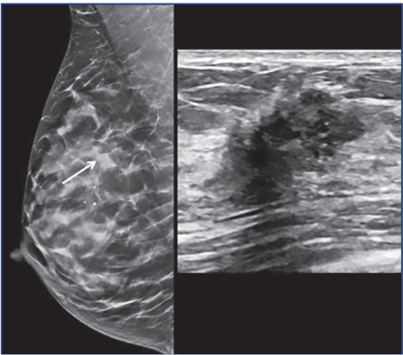

Рисунок 3 – Участки плотной фиброгландулярной ткани на ММГ заслоняют узловое образование, которое отмечено стрелкой (слева). Данное узловое образование на сонограмме (справа). Гистологически инвазивный протоковый рак.

Литературные данные подтверждают факт того, что женщины с плотной МЖ типа D имеют четырех-шестикратное увеличение риска по сравнению с женщинами с плотностью МЖ типа A [@boyd2013; @lee2012]. Именно плотность МЖ в общей популяции чаще по сравнению с другими факторами такими как возраст, генетические мутации BRCA 1 и BRCA2, является самым сильным предиктором РМЖ.

В некоторых исследованиях было высказано предположение, что только показатель плотности МЖ вносит значительный вклад в риск развития РМЖ на популяционном уровне, составляя 16% всех диагностированных РМЖ [@boyd2011; @bae2014; @boyd2007; @fasching2006].

По мнению большинства исследователей интервальный рак (рак, выявленный в промежутке между запланированными скрининговыми маммограммами) в 13-31 раз более вероятен в МЖ с плотностью типа D, чем в МЖ с плотностью типа А [@posso2019; @boyd2007; @ciatto2004; @strand2019].

Плотность МЖ также является биомаркером для прогнозирования ответа на неоадъювантную химиотерапию. Skarping, I.с соавт. в 2019 г. в своем исследовании показали, что женщины в пременопаузе с высокой маммографической плотностью плохо реагируют на неоадъювантную химиотерапию [@skarping2019].

Huang с соавт. и Eriksson с соавт. в своих работах случай-контроль показали более высокий риск развития регионарного рецидива у женщин с категориями С и D после модифицированной радикальной мастэктомии [@huang2016; @eriksson2013].

Плотная ткань также ограничивает выявление рецидива РМЖ у женщин, получавших лечение.

Маммографическая плотность МЖ длительное время была предметом дискуссий между учеными и практическими докторами. В частности, активно обсуждался вопрос необходимости информирования женщин о наличии у них высокой плотности МЖ [@almousa2014; @machida2015; @tossas-milligan2019]. Большинство авторов сходятся во мнении, что женщины должны быть проинформированы в связи с тем, что плотная ткань МЖ может 1) скрывать опухоли на маммограмме, 2) повышать риск развития РМЖ и 3) требовать проведения дополнительных методов исследований, таких как УЗИ и магнитно-резонансной томографии (МРТ) [@tossas-milligan2019].

## 1.4 Современные методы диагностики рака молочных желез

### 1.4.1 Томосинтез

В течение нескольких десятилетий идет активная разработка специальных рентгенологических исследований МЖ, наиболее перспективным из которых является цифровой томосинтез (ЦТ). В США в 2011 году ЦТ был признан к использованию в качестве диагностического метода, в 2016г- в качестве скринингового [@us26department], применение которого обеспечивает лучшую визуализацию всех структурных элементов МЖ. Это, в свою очередь, позволяет дифференцировать нарушение архитектоники и объемные изменения, обнаруживать патологические образования, не всегда различимые на маммограммах [@skaane2013; @friedewald2014; @kim2017; @vourtsis2018; @айнакулова2021возможности; @айнакулова2020сравнительный].Данный факт объясняет значительное уменьшение повторных исследований. В некоторых исследованиях было отмечено, что лишь небольшое количество были приглашены на повторное исследование [mahrooghy2015].

Результаты исследований, выполненных разными авторами, свидетельствуют о повышении показателя частоты обнаружения РМЖ от 5,4 на 1000 исследований [100] до 8,0 на 1000 обследованных [@friedewald2014].

Сравнительный анализ неясных результатов, требующих дополнительного уточнения другими методами, при проведении ЦММГ (17 899) и ЦТ (11 331) в период 2016-2018 гг, был выполнен Scott AM. Et al., 2019 [@scott2019], составил 82,08% для ЦММГ и 60,09% для ЦТ.

Результаты рандомизированного открытого исследования TOSYMA показывают, что частота обнаружения инвазивного рака МЖ была значительно выше при использовании ЦТ МЖ в сочетании с ММГ s2D, чем при использовании только ЦММГ: 354 из 49 715 в группе ЦТ и ЦММГ и у 240 из 49 762 женщин в группе ЦММГ соответственно, p\<0,0001).

Большинство обзоров свидетельствуют о том, что ЦТ с ЦММГ были более эффективны при установлении РМЖ, поскольку приводили к большему числу выявления патологических образований и меньшему количеству ложноположительных результатов [@giampietro2020].

В работе отечественных исследователей были отмечены основные преимущества применения ЦТ в лучевой диагностике непальпируемых образований МЖ [@гринберг2015первый]. Другими отечественными исследователями- ограничения его применения в качестве рутинного скрининга [@айнакулова2021возможности; @айнакулова2020сравнительный].

### 1.4.2 CESM- двуэнергетическая спектральная маммография

Контрастная спектральная двухэнергетическая маммография (Contrast-Enhanced Spectral Mammography – CESM), позволяет визуализировать образования на фоне плотной ткани МЖ [@черная2020контрастная].

В доступной мировой и отечественной литературе имеется небольшое количество информации об использовании CESM в клинической практике. Авторы отмечают, что диагностическая эффективность CESM выше, чем у традиционной рентгеновской ММГ, и приближается к таковой при МРТ с контрастным усилением [@рожкова2015контрастная; @cheung2014; @covington2018; @patel2018].

Исследование Lewin JM. [@lewin2003] является единственным опубликованным предварительным клиническим опытом использования двухэнергетической CESM. Авторы продемонстрировали техническую и клиническую осуществимость этого метода, сообщили о чувствительности 92% и специфичности 83% для обнаружения карцином МЖ. Однако это исследование было ограничено малой выборкой исследуемых.

В настоящее время не существует стандартизированного протокола описания метода, не систематизирована семиотика рентгеновских признаков образований на субтракционных снимках [@james2018; @lobbes2013]. Необходимы дальнейшие исследования для оценки диагностической точности и экономической эффективности CESM по сравнению с МРТ для определения соответствующей роли CESM в будущем.

### 1.4.3 МРТ с контрастным усилением (в том числе короткий протокол МРТ -- профессор Kuhl)

Первоначальное осознание факта того, что магнитно-резонансная томография (МРТ) молочной железы с контрастным усилением обладает очень высокой чувствительностью для выявления рака молочной железы спровоцировало проведение ряда работ, которые были направлены на анализ данного метода при проведении скрининга МЖ [@kaiser1992mrm; @heywang1986].

Процесс неоваскуляризации приводит к образованию новых сосудов. Контрастные вещества при проведении МРТ с контрастированием способны к быстрому накоплению в строме РМЖ [@knopp1999]. Их парамагнитные свойства сокращают T1 время в окружающих тканях, и поэтому усиливают локальный сигнал на T1 -зависимых последовательностях.

Базовый протокол МРТ МЖ состоит из описания одного Т1 -взвешенного изображения до введения контраста и нескольких Т1 -взвешенных изображений после введения контраста, с целью анализа кинетического поведения накопленного контраста в очаге поражения. Часто также получают T2 взвешенные данные [@mann2008; @newell2018acr].

После анализа результатов данных одноцентрового исследования, показавшего потенциал МРТ как инструмента скрининга, было проведено несколько крупномасштабных многоцентровых исследований для оценки ценности МРТ как дополнительного инструмента скрининга [@kuhl2000].

Критерии включения варьировали, но всегда в исследованиях были женщины с мутациями в генах BRCA1 и BRCA2, повышенным риском вследствие семейной предрасположенности [@kriege2004a; @kuhl2005]. Первоначальные результаты исследований свидетельствовали о сниженной чувствительности данного исследования: 71% в голландском скрининговом исследовании -MRISC [@kriege2004], и 77% в британском исследовании – MARIBS [@screenin2005]. Относительно низкая чувствительность первоначальных исследований, вероятно, была связана с несовершенной техникой в сочетании с отсутствием четких рекомендаций по интерпретации.

В более поздних исследованиях, таких как немецкое исследование EVA и итальянское исследование HIBCRIT-1, чувствительность превышала 90% [@kuhl2010; @sardanelli2011]. Недавно были представлены результаты еще ряда исследований, изучающих такие характеристики, как чувствительность и специфичность МРТ [@chiarelli2014; @riedl2015; @sung2016; @huzarski2017; @lo2017; @kuhl2017; @lee2017].

Вариабельность показателя чувствительности МРТ в них колебалась от 75,2% до 100%, в среднем превышая 80%; специфичность - от 83% до 98,4%.

В 2007 г. Американским онкологическим сообществом (ACS) определен клинический протокол ежегодного МРТ-скрининга РМЖ для женщин высокой группы риска. По мнению экспертов, эти рекомендации также включают женщин с облучением грудной клетки в анамнезе в молодом возрасте и женщин с мутацией p53 и PTEN, для которых относительный риск развития РМЖ также высокий (примерно в 6–8 раз выше популяционного риска).

Данные рекомендации по-прежнему составляют основу большинства национальных и международных руководств. К сожалению, из-за того, что для многих женщин наличие генетических факторов риска неизвестно, а также из-за того, что во многих учреждениях нет магнитно-резонансного томографа, существует большая часть женщин, которые не проходят скрининг в соответствии с этими стандартами. Отчасти это также может быть связано с недостаточной информацией пациентов о преимуществах МРТ. Wernli et al. сообщили, что в 2009 г. в США 29% женщин прошли скрининг с помощью МРТ; в 2012 г.- 43,9% женщин с отягощенным анамнезом [@wernli2014].

Ускоренная МРТ – метод, предложенный С. Kuhl et al. для снижения себестоимости и времязатратности исследования за счет сокращения количества выполненных последовательностей сканирования: Т1; T2-STIR и диффузионно-взвешенную визуализацию (DWI) [@kuhl2014].

Первоначальные выводы С. Kuhl et al. были подтверждены исследованием Mango VL. et al.: в выполненном ими исследовании чувствительность метода составила 99% (из 100 историй болезни при ускоренной МРТ верифицировались более 95% узлов на T1 изображениях) [@mango2015]. Moschetta M. et al. в своем исследовании не обнаружили существенных различий в диагностической точности между полным и сокращенным протоколом, включая STIR, Т2-взвешенные последовательности, преконтрастную и одну постконтрастную Т1-взвешенную последовательности [@moschetta2016]. Dogan et al. исследовали сокращенный протокол при скрининге женщин высокой группы риска и получили данные, эквивалентные отдельному полному протоколу [@dogan2018].

Преимуществом выполнения ускоренной МРТ является сокращение времени сканирования в среднем на 18,8 минут и интерпретации изображений – на 4,9 минут [@harvey2016; @vanzelst2018].

Недавно выполненные работы свидетельствуют о том, что оценка только этих сверхбыстрых изображений дает результаты, аналогичные чтению полного диагностического протокола, включая позднюю фазу усиления, T2 и DWI. Почти во всех рассмотренных исследованиях короткое время сбора данных и быстрая интерпретация изображений различных сокращенных протоколов не оказывали отрицательного влияния на точность диагностики [@mango2015; @moschetta2016; @vanzelst2018].

В работе Panigrahi B. et al в 2017 году при оценке соотношения результатов полного и сокращенного протоколов с присвоенной категорией оценки BI-RADS в 1052 случаях было показало, что полный протокол привел к изменению итоговых оценок BI-RADS только в 3,4% случаев [@panigrahi2017].

На сегодняшний день сокращенный протокол МРТ МЖ был проведен в восьми разных странах и более чем у 4500 женщин. Общий вывод почти всех сокращенных МРТ-исследований заключается в том, что обнаруженный РМЖ был в основном инвазивным раком на ранней стадии с процентным соотношением от 64 до 97%. Протоковые карциномы in situ, обнаруженные с помощью сокращенного скрининга МРТ, были преимущественно средней или высокой степени злокачественности [@oldrini2018; @heacock2016; @romeo2017]. Это хорошо согласуется с недавним исследованием Sung et al., которые обнаружили, что у женщин с высоким риском РМЖ, прошедших скрининг с помощью маммографии и МРТ, инвазивный рак с большей вероятностью выявляется с помощью МРТ.

К сожалению, эффективность МРТ МЖ по-прежнему зависит от внутривенного введения контрастного вещества. Это отнимает много времени, дорого, болезненно и чревато осложнениями, несмотря на тот факт, что используемые в настоящее время макроциклические контрастные вещества очень стабильны и безопасны [@runge2018].

Метод МРТ, который не предполагает введение контраста (DWI), находятся в стадии оценки. До сих пор исследования были однозначно успешными, показывая, что DWI, по крайней мере, так же чувствителен, как ММГ, для раннего выявления рака [@bickelhaupt2016; @trimboli2014].

Однако ограниченное пространственное разрешение и частое присутствие артефактов снижает ценность DWI при обнаружении поражений размером менее 12 мм [@pinker2018]. Следовательно, на данный момент методы МРТ без внутривенного введения контраста не могут конкурировать в скрининговых целях с МРТ МЖ с контрастным усилением.

### 1.4.4 Автоматизированное объемное ультразвуковое сканирование (ABUS)

Развитие автоматизированного ультразвукового томосинтеза (3D УЗИ) является одним из наиболее перспективных направлений, который позволяет получить в среднем за 3 сканирования (коронарная, сагиттальная и аксиальная) плоскости изображение всей МЖ.

Кроме того, разработано специальное программное обеспечение для 3D УЗИ с целью автоматизированного обнаружения патологических образований (CAD) (QVCAD™, QView Medical), которое получило одобрение FDA [@vourtsis2019]. Восемнадцатью рентгенологами, участвовавшими в исследовании Y. Jiang, M.F. et al. (2018), без системы QVCAD среднее время интерпретации результатов МЖ составляло 3 минуты 33 секунды для каждого случая, но уменьшалось до 2 минут 24 секунд при внедрении QVCAD, при этом разница соответствует 1 минуте 9 секундам, сэкономленным на каждом случае [@jiang2018].

Анализ различных исследований показал более высокие или равные результаты обнаружения поражений МЖ с помощью 3D УЗИ по сравнению с УЗИ. Показатели обнаружения с помощью 3D УЗИ варьируют от 84,8% до 100%, тогда как соответствующие показатели для ультразвукового метода- от 60,6% до 100% [@wang2012; @xiao2015; @wang2012a; @lin2012; @kim2013; @vourtsis2019].

В литературе также встречается достаточное количество работ, посвященных дифференциации злокачественных и доброкачественных образований МЖ с помощью 3D УЗИ [@chou2007automated; @golatta2013; @golatta2014; @kotsianos-hermle2009].

3D УЗИ, благодаря хорошей визуализации МЖ также является новым методом оперативного планирования [@grady2010]; размер поражения, определенный с помощью 3D УЗИ, хорошо коррелирует с результатами МРТ [@schmachtenberg2017] и гистопатологическими изменениями [@chang2015].

Коронарная плоскость имеет особое значение для хирургического планирования из-за лучшей визуализации сегментарного доступа и схожей ориентации при позиционировании пациента во время операции [@amy2018lobar]. 3D УЗИ также позволяет визуализировать сателлитные очаги размером менее 1 см, что очень ценно в оценке многоочагового рака.

3D УЗИ может применяться при оценке результатов МРТ в качестве уточняющей методики [@halshtok2015use; @girometti2017]: так, например, 3D УЗИ превзошла УЗИ в качестве вторичного исследования после проведения МРТ МЖ, выявив дополнительные очаги [@kim2016].

В работах отечественных исследователей изучались возможности данной методики в определении типа строения МЖ среди женщин разных возрастных групп, имеющих различную патологию. Полученные ими данные свидетельствовали и значительном увеличении специфичности данного метода (до 96%) у пациенток с типами плотности МЖ C и D, что может иметь важное значение при скрининге женщин данной категории [@гажонова2015возможности].

Добавленную ценность 3D УЗИ к ММГ при высокой плотности МЖ доказали повышение выявляемости РМЖ на 57% [@vourtsis2018].

3D УЗИ — это технологический прогресс в области визуализации и скрининга МЖ с преимуществами стандартизации сканирований, лучшего обнаружения небольших поражений, особенно у женщин с повышенной плотностью МЖ, и сокращения времени сканирования. Продолжаются интенсивные исследования новых разработок и исследований дополнительных приложений технологии 3D УЗИ. Оценка плотности МЖ с помощью 3D УЗИ также является еще одним перспективным направлением.

### 1.4.5 Искусственный интеллект

Технологии Искусственного интеллекта (ИИ, англ.– Artificial intelligence, Al) включают: Глубокое обучение (ГО, англ.– Deep learning, Dl); Нейронную сеть (НС, англ.– Neural networks, NN). Системы ИИ в медицинской практике – новое перспективное направление во всем мире, они могут помочь в рутинных и сложных задачах медицинскому персоналу, повысить уровень оказываемой медицинской помощи. При этом разработка, производство и выпуск в обращение систем ИИ должны в обязательном порядке регулироваться. Регистрация и последующий контроль в медицине требуют создания нормативной правовой базы и технического регулирования [@morozov2020artificial; @morozov2018artificial].

Отечественными учеными активно изучается данное направление применительно к скринингу РМЖ. В недавно представленной работе проанализированы перспективы использования технологий ИИ в скрининге РМЖ в мире и использование в этой области технологий в России [@морозов2020перспективы].

В мировой практике ценность представляют исследования Wu et al. (2019 г.), McKinney S.M. et al. (2020), Sasaki M.et al. (2020) [@wu2020; @mckinney2020; @sasaki2020]. Сверточная НС, объединяющая глобальную (симметрия между двумя МЖ) и локальную (на уровне пикселей) информацию, обученную более чем на 1000000 снимков для обнаружения РМЖ была описана Wu et al. (2019 г.) [@wu2020]. Применение ИИ в исследовании Nature позволило снизить процент ложноотрицательных результатов. При этом полученные данные анализировались с учетом стандартного двойного чтения маммограмм [@mckinney2020]. По мнению некоторых зарубежных авторов, проблемы в разработке алгоритма чаще приводят к гипердиагностике [@sasaki2020], в связи с этим дальнейшие исследования в данной области должны быть направлены прежде всего на улучшение диагностической точности.

Президент Российской Федерации 6 июня 2019 года подписал Указ № 254 «О Стратегии развития здравоохранения в Российской Федерации на период до 2025 года», согласно которому решение основных задач развития здравоохранения должно осуществляться, в том числе, в направлении развития единой государственной информационной системы в сфере здравоохранения, обеспечивающей взаимосвязь процессов организации оказания медицинской помощи; развитие государственных информационных систем субъектов Российской Федерации в сфере здравоохранения в целях их интеграции в единую государственную информационную систему. При этом эффективность внедрения и использования IT-технологий определяет доступность и качество работы системы здравоохранения регионов РФ [@егорова2018цифровизация].

С.П. Морозов в своем докладе «Стандартизация в области ИИ» [@морозов2020перспективы] рассказал о реализации эксперимента по внедрению технологий ИИ (компьютерного зрения) на базе Центра диагностики и телемедицины ДЗМ, а также о разрабатываемых стандартах СИИ и о создании Подкомитета 01/ТК 164 «ИИ в здравоохранении». Таким образом, данное направление-перспектива будущего, однако для эффективного его распространения необходимо решение ряда вопросов. Среди многих из них особенное внимание должно быть уделено следующим:

1)  Слаженность работы медицинского и инженерного сообществ для создания легкодоступных баз данных и ПО.

2)  Внедрение разработанных алгоритмов в клиническую практику не только городов, но и районных центров.

3)  Проведение курсов обучения медицинского персонала работе с технологиями ИИ.

Анализ результатов ММГ с учетом сделанных ранее снимков позволит определить женщин с высокими факторами риска, а также подобрать персонализированную терапию с учетом выявленного патологического образования.

### 1.4.6 Радиогеномика

Радиогеномика при РМЖ– быстроразвивающаяся область исследований и клинического применения.

Корреляция конкретных фенотипов на основе изображений (радиомика) с крупномасштабным геномным анализом (геномика) является новой областью исследований, называемой «радиогеномикой» или, точнее, «геномикой изображений». В этой новой области рассматриваются новые высокопроизводительные методы связывания информативных рентгенографических изображений с геномными данными, а также другой клинически значимой информацией [@yeh2019; @zhu2015; @li2016; @li2016a; @guo2015; @burnside2015].

Радиогеномика оказывает влияние на диагностические и терапевтические стратегии, создавая более индивидуализированные прогностические признаки и измерения в реальном времени в ответ на терапию. Применение радиогеномики для лечения РМЖ в последнее время привлекает все больше внимания.

Первая статья о радиомике/радиогеномике при РМЖ была опубликована в 2012 году [@ashraf2014], и с тех пор количество публикаций в данной области возрастает с каждым годом. Большинство работ по радиогеномике РМЖ связано с его корреляцией с индивидуальными геномными особенностями, молекулярными подтипами или показателями рецидива [@pinker2018background; @sutton2016; @mahrooghy2015].

Например, исследования с использованием маммографических изображений показали, что рентгенографический анализ текстуры может идентифицировать пациентов, которые с большей вероятностью являются носителями мутации BRCA1/2 [@gierach2014], а паренхиматозный рисунок и плотность МЖ были связаны с вариациями гена UGT2B [@li2014].

Данные МРТ, также использовались для выявления взаимосвязи между радиологическими особенностями с лежащими в их основе клиническими или гистологическими характеристиками [@yeh2019].

Однако большинство этих исследований были сосредоточены на нескольких клинических, гистопатологических или генетических особенностях. Например, Bhooshan N. et al. в своей работе рассматривал классифицированные признаки, которые коррелировали со способностью различать инвазивные и неинвазивные поражения, а также со степенью опухоли [@bhooshan2011].

Mazurowski MA. Et al. продемонстрировали взаимосвязь динамики усиления МРТ с люминальными подтипами РМЖ [@mazurowski2014]. Agrawal G, et al. смогли показать корреляцию между определенными фенотипами МРТ и подтипом рецептора HER-2 [@agrawal2007].

В настоящее время проводятся многоцентровые исследования РМЖ, сочетающие многочисленные качественные и количественные параметры визуализации с геномными, транскриптомными, протеомными и метаболомными данными. В итоге такие исследования будут разрабатывать значимые биомаркеры визуализации для достижения конечной цели прецизионной медицины при РМЖ.

В обзоре 2020 года отечественными учеными изложены последние данные радиогеномики. По их мнению, дальнейшее развитие данного направления позволит решить ряд важнейших задач в алгоритме ведения женщин с РМЖ (например, диагностика разных проявлений рака, выбор оптимальной лечебной тактики) [@рожкова2020радиогеномика].

## 1.5 Сравнительная характеристика методов.

Сравнительная характеристика основных методов, применяемых при диагностике РМЖ, приведена в Таблице 3.

Таблица 3 - Характеристика основных методов диагностики РМЖ

+---------------------+-----------------------------------------------------------------------------------------------------------------------------------------------------------------------+-------------------------------------------------------------------------------------------------------------------------------------------------------------------------------------------------------------------------------------------------------------------------------------------------------+
| **Название метода** | **Преимущества**                                                                                                                                                      | **Недостатки**                                                                                                                                                                                                                                                                                        |
+---------------------+-----------------------------------------------------------------------------------------------------------------------------------------------------------------------+-------------------------------------------------------------------------------------------------------------------------------------------------------------------------------------------------------------------------------------------------------------------------------------------------------+
| ЦММГ                | Высококачественные снимки, быстрая обработка данных, длительное хранение, меньшая компрессия МЖ, снижение лучевой нагрузки, возможность диагностировать кальцинаты МЖ | Лучевая нагрузка, низкая чувствительность в плотных тканях МЖ, высокая доля ложноположительных и ложноотрицательных результатов.                                                                                                                                                                      |
+---------------------+-----------------------------------------------------------------------------------------------------------------------------------------------------------------------+-------------------------------------------------------------------------------------------------------------------------------------------------------------------------------------------------------------------------------------------------------------------------------------------------------+
| УЗИ                 | Быстрота, отсутствие лучевой нагрузки, высокая чувствительность при плотном фоне МЖ, оценка состояния регионарных лимфоузлов                                          | Невозможность полностью визуализировать МЖ, низкая                                                                                                                                                                                                                                                    |
|                     |                                                                                                                                                                       |                                                                                                                                                                                                                                                                                                       |
|                     |                                                                                                                                                                       | информативность метода при большом объеме железы и при выраженной жировой инволюции, операторозависимость, крайне                                                                                                                                                                                     |
|                     |                                                                                                                                                                       |                                                                                                                                                                                                                                                                                                       |
|                     |                                                                                                                                                                       | ограниченная возможность                                                                                                                                                                                                                                                                              |
|                     |                                                                                                                                                                       |                                                                                                                                                                                                                                                                                                       |
|                     |                                                                                                                                                                       | визуализации микрокальцинатов                                                                                                                                                                                                                                                                         |
+---------------------+-----------------------------------------------------------------------------------------------------------------------------------------------------------------------+-------------------------------------------------------------------------------------------------------------------------------------------------------------------------------------------------------------------------------------------------------------------------------------------------------+
| ЦТ МЖ               | Возможность дифференцировать образования, не всегда различимые на ЦИМГ, уменьшение частоты повторных исследований                                                     | Высокая себестоимость, времязатратность для                                                                                                                                                                                                                                                           |
|                     |                                                                                                                                                                       |                                                                                                                                                                                                                                                                                                       |
|                     |                                                                                                                                                                       | врача, потребность в облачном хранилище, невысокая чувствительность метода при исследовании МЖ высокой плотности                                                                                                                                                                                      |
+---------------------+-----------------------------------------------------------------------------------------------------------------------------------------------------------------------+-------------------------------------------------------------------------------------------------------------------------------------------------------------------------------------------------------------------------------------------------------------------------------------------------------+
| CESM                | Высокая чувствительность и специфичность относительно других методов, эффективна при МЖ высокой и очень высокой плотности                                             | Развитие аллергических реакций на введенное контрастное вещество, высокое ионизирующее излучение                                                                                                                                                                                                      |
+---------------------+-----------------------------------------------------------------------------------------------------------------------------------------------------------------------+-------------------------------------------------------------------------------------------------------------------------------------------------------------------------------------------------------------------------------------------------------------------------------------------------------+
| MPT                 | Высокая чувствительность метода, относительно низкая специфичность, высокая чувствительность в диагностике мультицентрического и мультифокального рака МЖ             | Низкая чувствительность в выявлении микрокальцинатов МЖ, малая эффективность в дифференциальной диагностике образований менее 5мм в диаметре, низкая доступность, ограничение метода (клаустрофобия, наличие металлических объектов в организме), отложения гадолиния в тканях, высокая себестоимость |
+---------------------+-----------------------------------------------------------------------------------------------------------------------------------------------------------------------+-------------------------------------------------------------------------------------------------------------------------------------------------------------------------------------------------------------------------------------------------------------------------------------------------------+

Таким образом, в практическом здравоохранении существует ряд нерешенных вопросов относительно частоты проведения скрининга, возрастного диапазона женщин, предпочтительного метода с учетом категории плотности МЖ и риска развития РМЖ (наследственная предрасположенность, мутации). Существующие методы диагностики имеют определенные преимущества и недостатки друг относительно друга, учет которых необходим при составлении плана уточняющих диагностических мероприятий, в том числе и у женщин с высокой плотностью МЖ.

Определение лучшего метода/комбинации методов является залогом усовершенствования скрининга РМЖ, улучшения показателей раннего выявления РМЖ и повышения экономической эффективности.

## 1.6 Резюме

По результатам изучения профильной литературы было выявлено, что 3D УЗИ — это технологический прогресс в области визуализации и скрининга МЖ с преимуществами стандартизации сканирований, лучшего обнаружения небольших поражений, особенно у женщин с повышенной плотностью МЖ, и сокращения времени сканирования. Продолжаются интенсивные исследования новых разработок и исследований дополнительных приложений технологии 3D УЗИ. Оценка плотности МЖ с помощью 3D УЗИ также является еще одним перспективным направлением.

Однако недостаточно публикаций, посвященных сравнительному анализу диагностической эффективности (чувствительности, специфичности и точности) ультразвукового исследования в B- режиме и 3D УЗИ, и комбинации этих методик у женщин в возрастной группе 30-39 лет с высокой плотностью тканей молочной железы, также у женщин в возрастной группе 40-69 лет с высокой плотностью тканей молочной железы.

Прогностическая ценность метода 3D УЗИ в диагностике образований молочной железы у женщин разных возрастных групп так же недостаточно исследована. Не изучена возможность визуализации кальцинатов на 3D сонотомограммах и в 2D режиме ультразвукового исследования с использованием дополнительной функции Micro Pure.

# ГЛАВА 2. МАТРИАЛЫ И МЕТОДЫ

## 2.1 Общая характеристика исследования

Исследование можно характеризовать как клиническое исследование диагностических аспектов ранней диагностики рака молочной железы. Объектом исследования являются пациенты c новообразованиями молочной железы, регистрируемые при диагностике с использованием мануального ультразвукового исследования (2D УЗИ), маммографии (ММГ) и автоматизированного объемного УЗИ сканирования молочных желез (3D УЗИ). Предметом исследования является изучение диагностической эффективности автоматизированного объемного УЗИ сканирования молочных желез, а также анализ наиболее важных факторов на преддиагностическом этапе, так и при выполнении конкретного диагностического метода, в частности при выполнении автоматизированного объемного УЗИ сканирования молочных желез. Дизайн исследования можно охарактеризовать ретро-проспективное клиническое исследование. Протокол настоящего исследования был одобрен на заседании локального этического комитета СЗГМУ им. Мечникова №9 от 12.10.2022 года.

Всего в исследование вошло 2794 пациенток. Критериями включения были пациенты женского пола в возрасте от 18 до 69 лет; женщина, посетившая врача для обследования молочных желез, с отсутствием видимых признаков рака молочной железы. Критериями исключения были: женщины, которые были беременны, кормили грудью или планировали забеременеть; оперативное лечение в анамнезе (лампэктомия, мастэктомия, увеличение МЖ), эксцизионная или чрескожная биопсия за последние 12 месяцев, пациентки, получавшие лечение по поводу рака молочных желез за последние 12 месяцев. В это исследование была включена одна медицинская клиника- «СМТ», состоящая из двух зданий -амбулаторно-поликлического комплекса и хирургического корпуса со стационаром. Все женщины из амбулаторного отделения были приглашены для участия в нашем исследовании, участники подписали форму информированного согласия. Все обследования были проведены медицинским персоналом с соответствующей квалификацией. Всем провели клинический осмотр, пальпацию, собрали информацию о социально-демографических данных и потенциальных факторах риска РМЖ.

Все пациентки были разделены на 2 независимые друг от друга выборки по принципу возраста: выборка пациенток с возрастом моложе 40 лет и выборка пациенток с возрастом от 40 лет включительно. Принцип разделения по возрасту был связан с различными принципами использования диагностических методов в скрининге рака молочной железы. У пациенток моложе 40 лет ММГ менее эффективна, так как имеет низкую чувствительность и основным методом диагностики является УЗИ [@mandelson2000]. У пациенток моложе от 40 лет метод ММГ является обязательным в скрининге РМЖ [@narayan2020].

В выборку моложе 40 лет вошло 1511 пациенток. Эта выборка пациенток была разделена на две группы A и B. В группу A вошло 724 пациенток и в это группе скрининг проводился с использованием мануальной УЗИ диагностики и автоматизированного объемного УЗИ сканирования молочных желез (3D УЗИ) (исследуемая группа). В группу B вошло 787 пациенток и в этой группе скрининг проводился только с использованием 2D УЗИ диагностики (контрольная группа) (Рисунок № 3).


Рисунок 3. Схема проведения диагностики настоящего исследования МРТ с КУ - магнитно-резонансная томография с контрастным усилением; УЗИ - ультразвуковое исследование, BI-RADS - «Breast Imaging-Reporting and Data System», стандартизированная шкала оценки результатов маммографии, УЗИ и МРТ по степени риска наличия злокачественных образований молочной железы)

В выборку 40 лет и старше вошло 1283 пациенток. Эта выборка пациенток была разделена на две группы С и D. В группу С вошло 655 пациенток и в это группе скрининг проводился с использованием 2D УЗИ, маммографии и 3D УЗИ (исследуемая группа). В группу D вошло 628 пациенток и в этой группе скрининг проводился только с использованием 2D УЗИ и маммографии, контрольная группа (Рисунок 4).


Рисунок 4. Схема проведения диагностики настоящего исследования Сокращения: МРТ с КУ - магнитно-резонансная томография с контрастным усилением; 2D-УЗИ - ультразвуковое исследование, BI-RADS - «Breast Imaging-Reporting and Data System», стандартизированная шкала оценки результатов маммографии, 2D-УЗИ и МРТ по степени риска наличия злокачественных образований молочной железы.

Подробное описание выборок и групп представлено в разделе “2.5 Описание исследуемых групп”. Включение указанного количества пациенток в группы было основано на расчете мощности, что представлено в разделе “2.6 Статистический анализ данных”.

Далее проходил этап, где проводилось непосредственно диагностическое исследование с использованием методом 2D УЗИ, маммографии и 3D УЗИ в зависимости от руппы распределения. Производился сбор данных для последующего выявления наиболее значимых факторов, а также для определения эффективности изучаемых методов и прогностической ценности метода.

## 2.2 Описание диагностических методов

### 2.2.1 Ручное УЗИ исследование

Ультразвуковое исследование выполняли два врача ультразвуковой диагностики со стажем работы более 7 лет. У женщин в репродуктивном периоде 2D УЗИ исследование проводилось в первую фазу менструального цикла. У женщин, принимающих гормональные контрацептивы, и в постменопаузе время проведения 2D УЗИ исследования значения не имело. Пациенткам старше 39 лет 2D УЗИ исследование проводилось после предварительного проведения рентгеновской маммографии.

Использовались аппараты экспертного класса Toshiba Aplio 300 (Canon Япония) и GE LOGIQS 8 (GE Medical Systems, Милуоки, Висконсин, США) (Рисунок 5). Для исследования молочных желез применялись линейные датчики с частотой 7,5 - 12 МГц, ширина поля сканирования 5 см. На молочные железы равномерно наносили гипоаллергенный ультразвуковой гель. Исследование проводилось в положении лежа на спине, с руками за головой. При исследовании пациенток с молочными железами больших размеров, все пациентки были обследованы в положении лежа на спине, с заведенными руками за голову, на правом, на левом боку, в положении сидя с руками, заведенными за голову. Ультразвуковой датчик был расположен строго перпендикулярно, продольно или поперечно поверхности молочных желез, с дозированной и достаточно корректной компрессией. В циркулярном направлении от периферии, по часовой стрелке, по спирали передвигаясь к области соска, был осуществлен повторный осмотр каждой молочной железы. Веерообразными движениями датчика из различных положений осматривалась субареолярная область и область соска. Каждый квадрант обеих молочных желез последовательно был просканирован полипроекционно и полипозиционно, с исследованием регионарных зон лимфооттока с двух сторон.

Во время исследования оценивалось: симметричность молочных желез, состояние кожи, подкожно-жировой клетчатки, сосков, эхогенность, эхоструктура молочных желез, соотношение жировой, железистой и фиброзной тканей. Оценивалось состояние млечных протоков.

При выявлении патологических изменений оценивались их локализация, форма, эхогенность, эхоструктура, контуры, размеры. Применялись дополнительные методики: компрессионная эластография для оценки жесткости образований, цветовое допплеровское картирование и энергетическое допплеровское картирование для оценки кровотока патологических изменений, технология Micro Pure для визуализации микрокальцинатов - потенциальных маркеров злокачественных образований молочных желез.

После проведения мультипараметрического 2D УЗИ исследования каждой находке была присвоена категория оценки BI-RADS.

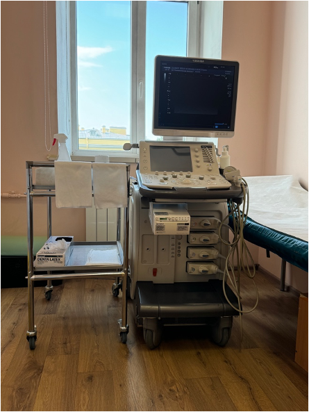 **а**

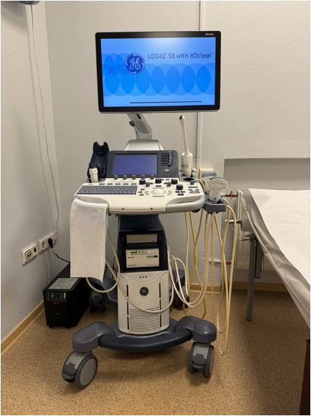 **б**

**Рисунок 5.** **а** - Ультразвуковой аппарат экспертного класса Toshiba Aplio 300 (Canon Япония); **б** - GE LOGIQS 8 (GE Medical Systems, Милуоки, Висконсин, США).

### 2.2.2 Автоматизированное объемное УЗИ сканирование молочных желез (3D УЗИ)

3D-автоматизированная ультразвуковая система Invenia ABUS (3D УЗИ), производства GE Healthcare (Саннивейл, Калифорния, США) 2018 года выпуска— это компьютерная система для оценки плотной молочной железы (Рисунок 6). Каждая молочная железа была визуализирована в трех проекциях: прямой, латеральной и медиальной автоматическим датчиком с линейной матрицей от 6 до 14 МГц, прикрепленным к жесткой компрессионной пластине (площадь 15,4×17,0×5,0 см). Индивидуальная мембрана для датчика была использована для каждой пациентки. Во время исследования система получала до 300 2D-срезов и реконструировала их в коронарной плоскости.

Стандартизированный процесс осмотра включает использование запатентованной коронарной плоскости для быстрой навигации по молочной железе, а также использование «режима обзора», позволяющего врачу быстро интерпретировать изображения. Время сбора данных для каждой проекции составляло 60 с, примерно по 3–4 мин на каждую молочную железу. Обследование проводили в положении лежа. Полотенце было помещено под плечом, что помогло расправить ткань молочной железы равномерно, соском к потолку. На молочные железы равномерно наносили гипоаллергенный ультразвуковой гель с дополнительным количество на область соска. Возможно применение трех уровней компрессии датчика для исследования молочных желез для получения наилучшей визуализации с учетом комфорта пациента.

Сканирование 3D УЗИ было непрерывным и автоматизированным. В течение исследования женщин попросили не двигаться, не разговаривать и дышать ровно. Выполнял исследование сертифицированный персонал со средним медицинским образованием. После завершения сбора данных ультразвуковой системой весь массив передавался на специальную рабочую станцию для интерпретации. Оценку изображений 3D УЗИ выполнял один врач ультразвуковой диагностики, со стажем работы более 7 лет. Общее время, необходимое для подготовки пациента и получения 3D УЗИ, фиксировалось, в каждом случае и варьировалось примерно между 10 и 15 мин.

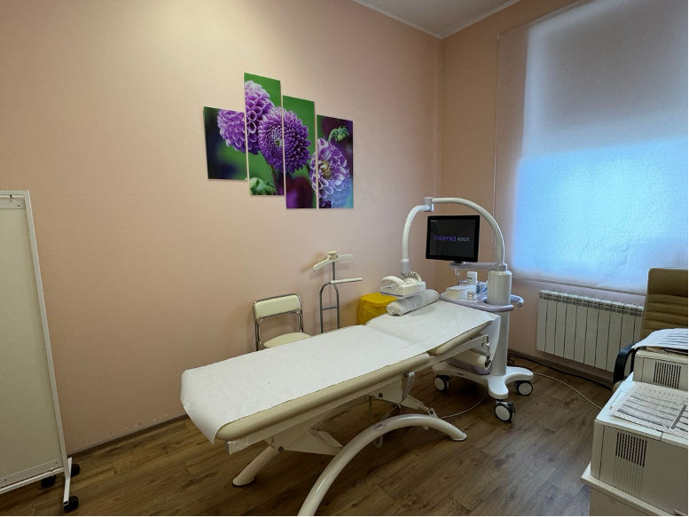

Рисунок 6. 3D-автоматизированная ультразвуковая система Invenia ABUS

### 2.2.3 Маммография

Пациентки старше 40 лет прошли цифровую маммографию на аппарате Planmed Clarity 3D (Рисунок 7) для каждой молочной железы в двух стандартных проекциях: прямой (кранио-каудальной СС) и косой (медиолатеральной MLO - с наклоном трубки примерно от 30° до 60° в зависимости от конституции пациентки). Маммографию также выполняли женщинам моложе 40 лет в случае положительного семейного или личного анамнеза - рак молочной железы. При необходимости производились рентгенограммы в боковой проекции с медиолатеральным ходом луча. Прицельная рентгенография с помощью специальных тубусов различной площади проводилась в особых случаях для уточнения характера контуров, структуры отдельных участков, для лучшего выявления кальцинатов.

При выполнении прямой (кранио-каудальной СС) проекции пациентка находилась в вертикальном положении (сидячем или стоячем) лицом к рентгеновскому аппарату. Высота кассетодержателя регулировалась таким образом, чтобы молочная железа удобно размещалась на его поверхности. Наружный край кассетодержателя был расположен на уровне нижнего отдела молочной железы и плотно прилегал к грудной клетке. Каждая молочная железа укладывалась по центру кассетодержателя, сосок выводился на контур. Центральный луч был направлен сверху вниз через центр молочной железы. Каждая пациентка должна была повернуть голову и немного наклониться вперед. При компрессии рука женщины отводилась вперед и оттягивалась боковая часть железы вперед, чтобы избежать образования складок.

При выполнении косой (медиолатеральной MLO) проекции рентгеновскую трубку устанавливали так, чтобы кассетодержатель был перпендикулярен грудной мышце пациентки. Центральный пучок излучения направляли от верхнее-медиальной к нижнелатеральной зоне, при этом варьируя угол поворота трубки: для высоких и худых женщин — 60°, для женщин среднего телосложения — 45°, для женщин с птозом молочной железы — 40°. Каждую пациентку поворачивали лицом к рентгеновскому аппарату и устанавливали на расстоянии примерно 10 см от съемочного стола. Молочные железы укладывали в медиолатеральной проекции с выведенными в профиль сосками, при этом производили компрессию каждой молочной железы.

Все маммограммы были промаркированы: обозначены фамилия, инициалы, возраст (или год рождения) обследуемой, номер истории болезни. На маммограмме обозначалась сторона исследования (R - правая, L - левая) и проекции съемки (СС - кранио-каудальная, MLO - медиолатеральная).

После выполнения маммограмм оценивалась рентгенологическая плотность молочных желез с использованием системы BI-RADS (Breast Imaging Reporting and Data System, Система описания и обработки данных лучевых исследований молочной железы) 5-го пересмотра, предложенной Американской коллегией радиологов (American College of Radiology – ACR) в 2013 году, согласно которой плотность желез подразделяется на 4 категории: A, B, C, D.

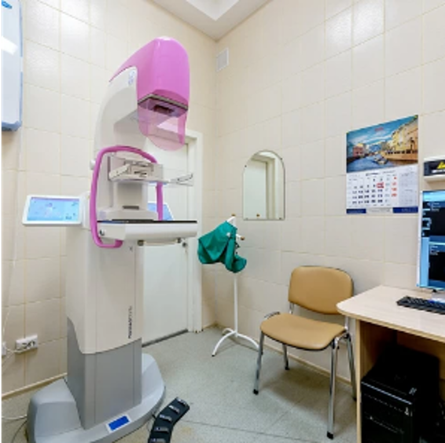

**Рисунок 7.** Цифровой маммограф Planmed Clarity 3D с функцией томосинтеза (Финляндия)

### 2.2.4 Магнитно-резонансная томография

Диагностика МРТ проводилась с контрастным усилением по стандартной методике на высокопольном магнитно-резонансном томографе General Electric Medical Systems Signa HDxt 1 (Рисунок 8). Исследование проводилось в положении лежа на животе, для чего применялась специальная укладка с отверстиями для молочных желез и лица. Во время сканирования не призводилось сдавление груди. Индукция магнитного составляла 1,5 тесла. Среднее время проведения процедуры составило 30-40 минут. Показаниями к проведению МРТ была поставленная после проведения 2D УЗИ категория 3 по классификации по BI-RADS.

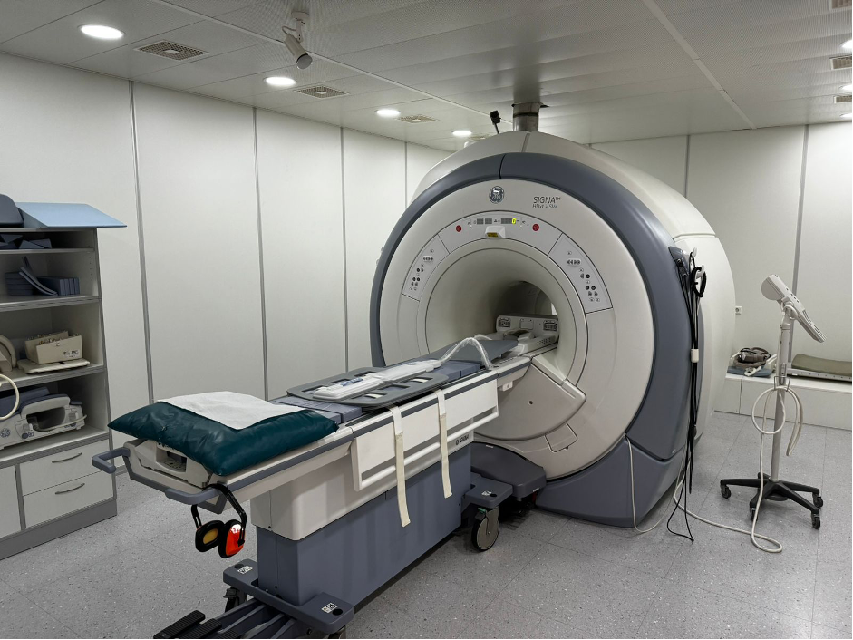

Рисунок 8. Высокопольный магнитно-резонансный томограф General Electric Medical Systems Signa HDxt 1,5 Т (США)

### 2.2.5 Оценка выявленных изменений

Результаты выявленных изменений были классифицированы по BI-RADS отсортированы по шести категориям [@spak2017]: 0 = неполные данные, 1 = нормальные, 2 = доброкачественные, 3 =вероятно доброкачественные, 4 = подозрительные изменения, 5 = с высокой степенью вероятности злокачественные, для 2D УЗИ, 3D УЗИ и ММГ. Для категории Birads 3 обязательно проводилась магнитно-резонансная томография (МРТ) для выявления истинно отрицательных и ложноотрицательных результатов. Женщинам, отнесенным к категории 4 или 5, проводилась трепан биопсия под уз-наведением или стереотаксическим наведением с последующей морфологической и при необходимости иммуногистохимической верификацией.

### 2.2.6 Интервенционные методы исследования

При выявлении изменений, оцененных категорией BI-RADS 3-5, выполнялось минимальное инвазивное вмешательство, которое позволило планировать оптимальное лечение на предоперационном этапе.

Перед выполнением инвазивного вмешательства детально был изучен медицинский и хирургический анамнез каждой пациентки. Все пациентки были ознакомлены с целью, задачами, этапами проведения манипуляции, возможными побочными эффектами, пациенткам было предложено подписать письменное информированное добровольное согласие на проведение процедуры.

В ходе проведения манипуляций были соблюдены все правила асептики и антисептики.

*Трепан-биопсия (core-биопсия) под ультразвуковым наведением*

Трепан-биопсия проводилась с помощью специальной системы для биопсии Bard-Magnum, полуавтоматическое устройство и игл 14-G или 12-G (Рисунок 9), под УЗИ контролем с линейным датчиком с частотой 7,5-12 МГц. На линейный датчик предварительно наносился стерильный ультразвуковой гель.

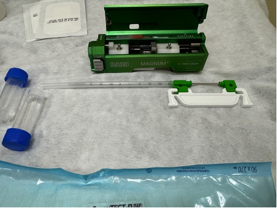 **а**

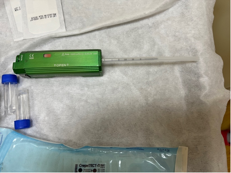 **б**

**Рисунок 9.** Система для биопсии Bard-Magnum, полуавтоматическое устройство.

Перед выполнением трепан-биопсии выполнялась прицельная эхография в зоне интереса для навигации. Процедура выполнялась в горизонтальном положении пациентки, после предварительного обезболивания кожи и подлежащих тканей раствором местного анестетика (Ропивакаин 7,5 мг/мл - 2-3 мл). Скальпелем был выполнен разрез кожи длинной до 0,5см. Под ультразвуковой навигацией к зоне интереса подводилась игла параллельно структурам передней грудной стенки во избежание их травматизации, с запасом расстояния не менее 2 см от зоны интереса до смежных с молочной железой структур при периферическом расположении опухоли. Выполнялся «выстрел», во время которого происходило взятие биопсийного материала из очага интереса (3-5 столбиков ткани длиной 15-22 мм). Полученный материал помещался в специальные транспортировочные одноразовые кассеты, погружаемые в контейнеры с 10% раствором формальдегида для фиксации ткани/образца, и направлялся на морфологическое исследование.

*Тонкоигольная пункция образований (ТАБ) под контролем ультразвукового исследования*

Тонкоигольная пункция образований проводилась с помощью специального одноразового шприца 20 мл и игл 18-G или 22-G (длиной 42 мм, 90 мм), под УЗИ контролем с линейным датчиком с частотой 7,5-12 МГц. На линейный датчик предварительно наносился стерильный ультразвуковой гель.

Исследование выполнялось в горизонтальном положении пациентки на спине или на боку, с заведенными за голову руками. Перед выполнением тонкоигольной пункционной биопсии выполнялась прицельная эхография в зоне интереса для навигации. Кожа была обработана специальным дезинфицирующим средством. В зону интереса под контролем УЗИ вводилась игла 18-G/22-G и проводилась медленная аспирация. Полученный материал был нанесен на предметные стекла и направлялся на цитологическое исследование.

*Трепан-биопсия (core-биопсия) под контролем цифровой стереотаксической приставки с использованием системы «пистолет-игла»*

Трепан-биопсия под контролем цифровой стереотаксической приставки с использованием системы «пистолет-игла» применялась для образований, которые выявлялись только на маммографии.

Исследование проводилось на оборудовании - Planmed Clarity 3D с функцией томосинтеза (Финляндия) с использованием специализированной цифровой стереотаксической приставки (Рисунок 10). Система для биопсии Bard-Magnum, полуавтоматическое устройство и иглы 14-G или 12-G.

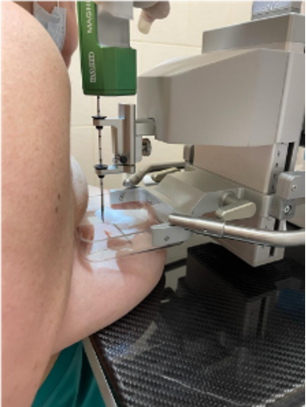

Рисунок №10. Специализированная цифровая стереотаксическая приставка.

Перед выполнением исследования на коже в проекции предполагаемого образования осуществлялась разметка, каждая пациентка усаживалась на стул, лицом к аппарату. Молочная железа укладывалась на детектор изображения специальным образом: участок железы, заранее размеченный, должен был попадать в середину окошка на компрессионной пластине. После укладки молочной железы выполнялась серия снимков с прицельным увеличением в прямой проекции и под углами +15˚ и -15˚. После получения серии снимков курсором отмечалась зона интереса, без захвата кровеносных сосудов. Позиционер выдвигался в нужное положение, благодаря корректным автоматическим расчетам. Затем проводилась местная анестезия раствором Наропина 2 мг/мл - 20-30 мм, выполнялся небольшой разрез кожи хирургическим скальпелем (лезвие № 11) до 0,5 см длинной. В позиционер устанавливался пистолет с иглой и выполнялся «выстрел», во время которого происходило взятие биопсийного материала из очага интереса.

Полученные образцы помещались на чашки Петри для контрольной маммографии, а после материал помещался в специальный флакон с 10% раствором формальдегида для фиксации и направлялся на морфологическое исследование.

## 2.3 Описание исследуемых групп

### 2.3.1 Общее описание выборки пациенток до 40 лет

С февраля 2019 по май 2023 года было исследовано 1511 пациенток с возрастом моложе 40 лет.

Медиана возраста пациенток выборке моложе 40 лет составила 35 [Q1-Q3: 32;37] лет. Минимальный возраст составил 20 лет. Максимальный возраст составил 39 лет. Медиана роста пациенток выборке моложе 40 лет составил 167 [Q1-Q3: 164;170] см. Медиана веса пациенток выборке моложе 40 лет составил 59 [Q1-Q3: 55;65] кг.

### 2.3.2 Описание групп в пациенток до 40 лет

В группу A вошло 787 пациенток. Медиана возраста составила 35 [Q1-Q3: 32;37] лет. Минимальный возраст составил 20 лет. Максимальный возраст составил 39 лет. Медиана роста составила 167 [Q1-Q3: 164;170] см. Медиана веса составила 58 [Q1-Q3: 55;65] кг. Пациенток в группе B в исследование вошло 724 пациентов. Медиана возраста составила 34 [Q1-Q3: 31;37] лет. Минимальный возраст составил 20 лет. Максимальный возраст составил 39 лет. Медиана роста оставила 167 [Q1-Q3: 164;170] см. Медиана веса составила 60 [Q1-Q3: 55;65] кг. Статистически значимой разницы по возрасту, росту, весу не было выявлено.

*Диагноз при первичном осмотре*

В группе А были поставлены следующие диагнозы: «Без патологии» было 32.15% (253/787) «Рак» было 0.76% (6/787) «Фиброаденома» в 15.63% (123/787) «Фиброзно-кистозная болезнь» в 28.72% (226/787) «Киста» в 4.45% (35/787), «Листовидная опухоль» в 0.38% (3/787) «Диффузный фиброаденоматоз» в 17.03% (134/787), «Локализованный фиброаденоматоз» в 0.89% (7/787). В группе B были поставлены диагнозы после осмотра: «Без патологии» было 27.49% (199/724) «Рак» было 0.83% (6/724),«Фиброаденома» в 24.72% (179/724) «Фиброзно-кистозная болезнь» в 22.24% (161/724) «Киста» в 8.56% (62/724) «Листовидная опухоль» в 0.83% (6/724) «Внутрипротоковая папиллома” в 0.83% (6/724) «Гиперплазия» в 0.83% (6/724) «Диффузный фиброаденоматоз» в 13.67% (99/724).

Разница между группами по первичному диагнозу была выявлена (p-value \<0,01). Разница объясняется тем, что диагнозы “Внутрипротоковая папиллома”, “Гиперплазия” в группе А не было выявлено, в то время как “Локализованный фиброаденоматоз” не был зарегистрирован в группе В. Также в группе В выявлено больше пациенток с диагнозом “Фиброаденома”, а также “Киста”. Учитывая, что наиболее значимым диагнозом являлся “Рак”, то пересчет с учетом приоритетной значимости этого диагноза привел к тому, что группы распределены однородно (p-уровень = 0.77).

*Жалобы при первичном осмотре*

В группе А были выявлены следующие жалобы: выделения из соска в 0.38% (3/787) боль была в 4.83% (38/787) уплотнение было в 8.01% (63/787), в 86.79% (683/787) не было жалоб. В группе B были выявлены следующие жалобы: выделения из соска были в 0.97% (7/724) боль была в 5.25% (38/724) уплотнение было в 10.91% (79/724) жалоб не было в 82.87% (600/724). Разница между группами по выявленным жалобам не было выявлено составила уровень значимости составил (p-уровень = 0.21). По составу жалоб группы распределены равномерно, можно отметить не значимую разницу в общем количестве пациенток с отсутствием жалоб.

*Репродуктивный статус*

В группе А репродуктивный возраст был в 96.7% (761/787) пременопауза было 3.3% (26/787). В группе B репродуктивный статус был репродуктивный возраст был в 97.24% (704/724) пременопауза в 2.76% (20/724). Разница между группами по репродуктивному статусу составила p-уровень= 0.55. Группы распределены однородно.

*Операции на молочной железе*

В группе А операций на молочной железе в анамнезе не было в 98.48% (775/787) и было 1.52% (12/787). В группе B операций на молочной железе в анамнезе не было в 98.34% (712/724) в 1.66% операции были (12/724). Разница между группами по репродуктивному статусу составила p-уровень= 0.41. Группы распределены однородно.

*Прием гормональных препаратов*

В группе А прием гормональных препаратов был в 20.34% (155/787) и в не было в 79.66% (607/787). В группе B прием гормональных препаратов был в 21.8% (155/724) и приема препаратов не было в 78.2% (556/724). Разница между группами по приему гормональных препаратов составила p-уровень= 0.17. Группы распределены однородно.

*Генетическая предрасположенность*

В группе А генетической предрасположенности не было в 68.52% (531/787) было в 31.48% (244/787). В группе B генетическая предрасположенности не было в 68.62% (492/724) в 31.38% была (225/724). Разница между группами по генетической предрасположенности составила p-уровень= 0.73. Группы распределены однородно. В таблице №4 наглядно отражены описанные показатели.

**Таблица №2.1.** Первичный диагноз, жалобы, выявленные при первичном осмотре, репродуктивный статус, операции на МЖ, гормональные препараты, наследственная прерасположенность в группах A и B.

+--------------------------------------+-------------------+-------------+-------------------+-------------+--------------+
| Диагноз                              | Процентная доля   | 95% ДИ      | Процентная доля   | 95% ДИ      | p-value      |
+--------------------------------------+-------------------+-------------+-------------------+-------------+--------------+
|                                      | Группа А          | Группа В    |                   |             |              |
+--------------------------------------+-------------------+-------------+-------------------+-------------+--------------+
| *Диагноз*                            |                   |             |                   |             |              |
+--------------------------------------+-------------------+-------------+-------------------+-------------+--------------+
| Без патологии                        | 32.147% (253/787) | [0.29;0.36] | 27.486% (199/724) | [0.24;0.31] |              |
+--------------------------------------+-------------------+-------------+-------------------+-------------+--------------+
| Рак                                  | 0.762% (6/787)    | [0;0.02]    | 0.829% (6/724)    | [0;0.02]    | 0.77         |
+--------------------------------------+-------------------+-------------+-------------------+-------------+--------------+
| Саркома                              | 0% (0/787)        | [0;0.01]    | 0% (0/724)        | [0;0.01]    | **\<0,01\*** |
+--------------------------------------+-------------------+-------------+-------------------+-------------+--------------+
| Фиброаденома                         | 15.629% (123/787) | [0.13;0.18] | 24.724% (179/724) | [0.22;0.28] |              |
+--------------------------------------+-------------------+-------------+-------------------+-------------+--------------+
| Фиброзно-кистозная болезнь           | 28.717% (226/787) | [0.26;0.32] | 22.238% (161/724) | [0.19;0.25] |              |
+--------------------------------------+-------------------+-------------+-------------------+-------------+--------------+
| Киста                                | 4.447% (35/787)   | [0.03;0.06] | 8.564% (62/724)   | [0.07;0.11] |              |
+--------------------------------------+-------------------+-------------+-------------------+-------------+--------------+
| Листовидная опухоль                  | 0.381% (3/787)    | [0;0.01]    | 0.829% (6/724)    | [0;0.02]    |              |
+--------------------------------------+-------------------+-------------+-------------------+-------------+--------------+
| Внутрипротоковая папиллома           | 0% (0/787)        | [0;0.01]    | 0.829% (6/724)    | [0;0.02]    |              |
+--------------------------------------+-------------------+-------------+-------------------+-------------+--------------+
| Гиперплазия                          | 0% (0/787)        | [0;0.01]    | 0.829% (6/724)    | [0;0.02]    |              |
+--------------------------------------+-------------------+-------------+-------------------+-------------+--------------+
| Диффузный фиброаденоматоз            | 17.027% (134/787) | [0.15;0.2]  | 13.674% (99/724)  | [0.11;0.16] |              |
+--------------------------------------+-------------------+-------------+-------------------+-------------+--------------+
| Локализованный фиброаденоматоз       | 0.889% (7/787)    | [0;0.02]    | 0% (0/724)        | [0;0.01]    |              |
+--------------------------------------+-------------------+-------------+-------------------+-------------+--------------+
| Мастит                               | 0% (0/787)        | [0;0.01]    | 0% (0/724)        | [0;0.01]    |              |
+--------------------------------------+-------------------+-------------+-------------------+-------------+--------------+
| *Жалобы*                             |                   |             |                   |             |              |
+--------------------------------------+-------------------+-------------+-------------------+-------------+--------------+
| нет                                  | 86.785% (683/787) | [0.84;0.89] | 82.873% (600/724) | [0.8;0.86]  | 0.21         |
+--------------------------------------+-------------------+-------------+-------------------+-------------+--------------+
| есть опухоль                         | 0% (0/787)        | [0;0.01]    | 0% (0/724)        | [0;0.01]    |              |
+--------------------------------------+-------------------+-------------+-------------------+-------------+--------------+
| выделения из соска                   | 0.381% (3/787)    | [0;0.01]    | 0.967% (7/724)    | [0;0.02]    |              |
+--------------------------------------+-------------------+-------------+-------------------+-------------+--------------+
| боль                                 | 4.828% (38/787)   | [0.03;0.07] | 5.249% (38/724)   | [0.04;0.07] |              |
+--------------------------------------+-------------------+-------------+-------------------+-------------+--------------+
| уплотнение                           | 8.005% (63/787)   | [0.06;0.1]  | 10.912% (79/724)  | [0.09;0.13] |              |
+--------------------------------------+-------------------+-------------+-------------------+-------------+--------------+
| гиперемия                            | 0% (0/787)        | [0;0.01]    | 0% (0/724)        | [0;0.01]    |              |
+--------------------------------------+-------------------+-------------+-------------------+-------------+--------------+
| гипертермия                          | 0% (0/787)        | [0;0.01]    | 0% (0/724)        | [0;0.01]    |              |
+--------------------------------------+-------------------+-------------+-------------------+-------------+--------------+
| *Репродуктивный статус*              |                   |             |                   |             |              |
+--------------------------------------+-------------------+-------------+-------------------+-------------+--------------+
| репродуктивный возраст               | 96.696% (761/787) | [0.95;0.98] | 97.238% (704/724) | [0.96;0.98] | 0.55         |
+--------------------------------------+-------------------+-------------+-------------------+-------------+--------------+
| менопауза до 5 лет                   | 0% (0/787)        | [0;0.01]    | 0% (0/724)        | [0;0.01]    |              |
+--------------------------------------+-------------------+-------------+-------------------+-------------+--------------+
| менопауза более 5 лет                | 0% (0/787)        | [0;0.01]    | 0% (0/724)        | [0;0.01]    |              |
+--------------------------------------+-------------------+-------------+-------------------+-------------+--------------+
| пременопауза                         | 3.304% (26/787)   | [0.02;0.05] | 2.762% (20/724)   | [0.02;0.04] |              |
+--------------------------------------+-------------------+-------------+-------------------+-------------+--------------+
| оперативная менопауза                | 0% (0/787)        | [0;0.01]    | 0% (0/724)        | [0;0.01]    |              |
+--------------------------------------+-------------------+-------------+-------------------+-------------+--------------+
| *Операции на МЖ*                     |                   |             |                   |             |              |
+--------------------------------------+-------------------+-------------+-------------------+-------------+--------------+
| не было                              | 98.5% (775/787)   | [0.97;0.99] | 98.3% (712/724)   | [0.97;0.99] | 0.41         |
+--------------------------------------+-------------------+-------------+-------------------+-------------+--------------+
| были                                 | 1.5% (12/787)     | [0.01;0.03] | 1.7% (12/724)     | [0.01;0.03] |              |
+--------------------------------------+-------------------+-------------+-------------------+-------------+--------------+
| *Гормональные препараты*             |                   |             |                   |             |              |
+--------------------------------------+-------------------+-------------+-------------------+-------------+--------------+
| да                                   | 19.7% (155/787)   | [0.17;0.23] | 21.4% (155/724)   | [0.19;0.25] | 0.17         |
+--------------------------------------+-------------------+-------------+-------------------+-------------+--------------+
| нет                                  | 80.3% (632/787)   | [0.77;0.83] | 78.6% (569/724)   | [0.75;0.81] |              |
+--------------------------------------+-------------------+-------------+-------------------+-------------+--------------+
| *Наследственная предрасположенность* |                   |             |                   |             |              |
+--------------------------------------+-------------------+-------------+-------------------+-------------+--------------+
| нет                                  | 68.9% (543/787)   | [0.66;0.72] | 68.9% (499/724)   | [0.65;0.72] | 0.73         |
+--------------------------------------+-------------------+-------------+-------------------+-------------+--------------+
| есть                                 | 31.1% (244/787)   | [0.28;0.34] | 31.1% (225/724)   | [0.28;0.35] |              |
+--------------------------------------+-------------------+-------------+-------------------+-------------+--------------+

*Мутация BRCA*

В группе А мутация BRCA1 была выявлена в 0.76% (6/787) в остальных случаях исследование не проводилось. В группе B мутаций BRCA не выявлено было в 2.49% (18/724) в остальных случаях исследование не проводилось.

Разница между группами по мутации BRCA составила p-уровень \<0.01. Группы по этому показателю распределены не однородно, так как в группе Б мутаций не выявлено вовсе, в то время как BRCA1 были выявлены в группе A (Таблица 5).

*Сторона поражения при осмотре*

В группе А сторона поражения при осмотре была правая в 7.12% (56/787) левая в 7.24% (57/787) обе стороны было 2.29% (18/787) в остальных случаях образование не пальпировалась.

В группе B сторона поражения при осмотре была правая в 15.75% (114/724) поражение левой было в 5.8% (42/724) поражение обеих сторон обе было в 5.8% (42/724) в остальных случаях образование не пальпировалось.

Разница между группами по стороне поражения составила p-уровень \<0.01. Группы по этому показателю распределены неоднородно, так как в группе Б чаще встречалось непальпируемое образование, в то время как в группе A больше поражений в правой стороне (Таблица 5).

*Кожные симптомы*

В группе А и группе B во всех случаях кожных симптомов при осмотре не было выявлено.

*Симптом втягивания*

В группе А симптом втягивания соска во всех случаях был отрицательный. В группе B симптома втягивания соска при осмотре нет было в 97.51% (706/724) и было в 2.49% (18/724).

Разница между группами по симптому втягивания соска составила p-уровень \<0.01. Группы по этому показателю распределены неоднородно, так как в группе Б регистрировались такие случаи, а в группе A нет (Таблица 5).

*Выделения из соска при осмотре*

В группе А выделений из соска при осмотре не было в 99.11% (780/787), кровянистые выделения были в 0.89% (7/787).

В группе B выделения из соска при осмотре нет было во всех случаях.

Разница между группами по симптому втягивания соска составила p-уровень 0.02. Группы по этому показателю распределены неоднородно, так как в группе А регистрировались такие случаи, а в группе Б нет (Таблица 5).

*Тип плотности*

В группе А тип плотности по ACR при осмотре был «С» в 72.27% (555/787) тип «D» в 27.73% (213/787).

В группе B тип плотности по ACR при осмотре был «C» 67.82% (491/724) тип «D» был в 32.18% (233/724).

Разница между группами по структуре ACR составила p-уровень 0.03. Группы по этому показателю распределены неоднородно, так как в группе А регистрировалось больше случаев по классификации “C”, а в группе Б больше случаев по классификации “D” (Таблица 5).

*Квадрант локализации*

В группе А квадрант локализации верхненаружный был в 4.07% (32/787) верхневнутренний в 3.81% (30/787) нижне-наружный в 0.76% (6/787) нижне-внутренний в 1.52% (12/787) граница внутреннего в 1.65% (13/787) граница наружного в 0.76% (6/787) граница верхнего в 4.07% (32/787).

В группе B квадрант локализации верхне-наружный было 12.29% (89/724), верхне-внутренний в 4.14% (30/724) нижне-наружный в 4.14% (30/724) нижне-внутренний в 0.83% (6/724) граница внутреннего в 1.8% (13/724) граница наружного в 1.66% (12/724) граница верхнего в 1.66% (12/724) граница нижних в 1.8% (13/724) вся железа в 0.83% (6/724).

Разница между группами по локализации квадранта составила p-уровень \<0.01. Группы по этому показателю распределены неоднородно (Таблица 5).

**Таблица №5.** Мутация BRCA, сторона поражения при осмотре, симптом втягивания соска, симптом выделения из соска при осмотре, тип структуры ACR, квадрант локализации в группах A и B.

+-----------------------+-----------------+-------------+-----------------+-------------+--------------+
| Показатель            | Процентная доля | 95% ДИ      | Процентная доля | 95% ДИ      | p-value      |
+-----------------------+-----------------+-------------+-----------------+-------------+--------------+
| Группы                | Группа A        | Группа B    |                 |             |              |
+-----------------------+-----------------+-------------+-----------------+-------------+--------------+
| *Мутация BRCA*        |                 |             |                 |             |              |
+-----------------------+-----------------+-------------+-----------------+-------------+--------------+
| Оценка не проводилась | 99.2% (781/787) | [0.98;1]    | 97.5% (706/724) | [0.96;0.98] | **\<0.01\*** |
+-----------------------+-----------------+-------------+-----------------+-------------+--------------+
| BRCA1                 | 0.8% (6/787)    | [0;0.02]    | 0% (0/724)      | [0;0.01]    |              |
+-----------------------+-----------------+-------------+-----------------+-------------+--------------+
| мутаций не выявлено   | 0% (0/787)      | [0;0.01]    | 2.5% (18/724)   | [0.02;0.04] |              |
+-----------------------+-----------------+-------------+-----------------+-------------+--------------+
| BRCA2                 | 0% (0/787)      | [0;0.01]    | 0% (0/724)      | [0;0.01]    |              |
+-----------------------+-----------------+-------------+-----------------+-------------+--------------+
| *Сторона поражения*   |                 |             |                 |             |              |
+-----------------------+-----------------+-------------+-----------------+-------------+--------------+
| правая                | 7.1% (56/787)   | [0.05;0.09] | 15.8% (114/724) | [0.13;0.19] | **\<0.01\*** |
+-----------------------+-----------------+-------------+-----------------+-------------+--------------+
| левая                 | 7.2% (57/787)   | [0.06;0.09] | 5.8% (42/724)   | [0.04;0.08] |              |
+-----------------------+-----------------+-------------+-----------------+-------------+--------------+
| обе                   | 2.3% (18/787)   | [0.01;0.04] | 5.8% (42/724)   | [0.04;0.08] |              |
+-----------------------+-----------------+-------------+-----------------+-------------+--------------+
| не пальпируются       | 83.4% (656/787) | [0.81;0.86] | 72.7% (526/724) | [0.69;0.76] |              |
+-----------------------+-----------------+-------------+-----------------+-------------+--------------+
| *Втягивание соска*    |                 |             |                 |             |              |
+-----------------------+-----------------+-------------+-----------------+-------------+--------------+
| нет                   | 100% (787/787)  | [0.99;1]    | 97.5% (706/724) | [0.96;0.98] | **\<0.01\*** |
+-----------------------+-----------------+-------------+-----------------+-------------+--------------+
| да                    | 0% (0/787)      | [0;0.01]    | 2.5% (18/724)   | [0.02;0.04] |              |
+-----------------------+-----------------+-------------+-----------------+-------------+--------------+
| *Выделения из соска*  |                 |             |                 |             |              |
+-----------------------+-----------------+-------------+-----------------+-------------+--------------+
| нет                   | 99.1% (780/787) | [0.98;1]    | 100% (724/724)  | [0.99;1]    | **0.02\***   |
+-----------------------+-----------------+-------------+-----------------+-------------+--------------+
| кровянистые           | 0.9% (7/787)    | [0;0.02]    | 0% (0/724)      | [0;0.01]    |              |
+-----------------------+-----------------+-------------+-----------------+-------------+--------------+
| *Структура ACR*       |                 |             |                 |             |              |
+-----------------------+-----------------+-------------+-----------------+-------------+--------------+
| Тип С                 | 72.9% (574/787) | [0.7;0.76]  | 67.8% (491/724) | [0.64;0.71] | **0.03\***   |
+-----------------------+-----------------+-------------+-----------------+-------------+--------------+
| Тип D                 | 27.1% (213/787) | [0.24;0.3]  | 32.2% (233/724) | [0.29;0.36] |              |
+-----------------------+-----------------+-------------+-----------------+-------------+--------------+
| *Квадрант*            |                 |             |                 |             |              |
+-----------------------+-----------------+-------------+-----------------+-------------+--------------+
| нет                   | 83.4% (656/787) | [0.81;0.86] | 70.9% (513/724) | [0.67;0.74] | **\<0.01**   |
+-----------------------+-----------------+-------------+-----------------+-------------+--------------+
| верхне-наружный       | 4.1% (32/787)   | [0.03;0.06] | 12.3% (89/724)  | [0.1;0.15]  |              |
+-----------------------+-----------------+-------------+-----------------+-------------+--------------+
| верхне-внутренний     | 3.8% (30/787)   | [0.03;0.05] | 4.1% (30/724)   | [0.03;0.06] |              |
+-----------------------+-----------------+-------------+-----------------+-------------+--------------+
| нижне-наружный        | 0.8% (6/787)    | [0;0.02]    | 4.1% (30/724)   | [0.03;0.06] |              |
+-----------------------+-----------------+-------------+-----------------+-------------+--------------+
| нижне-внутренний      | 1.5% (12/787)   | [0.01;0.03] | 0.8% (6/724)    | [0;0.02]    |              |
+-----------------------+-----------------+-------------+-----------------+-------------+--------------+
| граница внутреннего   | 1.7% (13/787)   | [0.01;0.03] | 1.8% (13/724)   | [0.01;0.03] |              |
+-----------------------+-----------------+-------------+-----------------+-------------+--------------+
| граница наружного     | 0.8% (6/787)    | [0;0.02]    | 1.7% (12/724)   | [0.01;0.03] |              |
+-----------------------+-----------------+-------------+-----------------+-------------+--------------+
| граница верхнего      | 4.1% (32/787)   | [0.03;0.06] | 1.7% (12/724)   | [0.01;0.03] |              |
+-----------------------+-----------------+-------------+-----------------+-------------+--------------+
| граница нижних        | 0% (0/787)      | [0;0.01]    | 1.8% (13/724)   | [0.01;0.03] |              |
+-----------------------+-----------------+-------------+-----------------+-------------+--------------+
| вся железа            | 0% (0/787)      | [0;0.01]    | 0.8% (6/724)    | [0;0.02]    |              |
+-----------------------+-----------------+-------------+-----------------+-------------+--------------+
| 1/2 железы            | 0% (0/787)      | [0;0.01]    | 0% (0/724)      | [0;0.01]    |              |
+-----------------------+-----------------+-------------+-----------------+-------------+--------------+
| центральный квадрант  | 0% (0/787)      | [0;0.01]    | 0% (0/724)      | [0;0.01]    |              |
+-----------------------+-----------------+-------------+-----------------+-------------+--------------+

### 2.3.3 Общее описание выборки пациенток 40 лет и старше

С февраля 2019 по май 2023 года было исследовано 1283 пациенток с возрастом 40 лет и старше.

Медиана возраста пациенток выборке после 40 лет составил 49 [Q1-Q3: 45;56] лет. Минимальный возраст составил 40 лет. Максимальный возраст составил 79 лет. Медиана роста пациенток выборке после 40 лет составил 166 [Q1-Q3: 164;168] см. Медиана веса пациенток выборке после 40 лет составил 65 [Q1-Q3: 60;73.25] кг. В выборке после 40 лет пациенток без выявленной патологии было 5.61% (72/1283).

### 2.3.4 Оценка однородности пациенток 40 лет и старше

Пациенток в группе C в исследование вошло 628 пациентов. Медиана возраста пациенток в группе C составила 49 [Q1-Q3: 45;56] лет. Минимальный возраст составил 40 лет. Максимальный возраст составил 69 лет. Медиана роста составила 167 [Q1-Q3: 164;169] см. Медиана веса составила 65 [Q1-Q3: 60;72] кг. Пациенток в группу D вошло 655 пациентов. Медиана возраста составила 49 [Q1-Q3: 45;56.5] лет. Минимальный возраст составил 40 лет. Максимальный возраст составил 69 лет. Медиана роста составила 165 [Q1-Q3: 164;168] см. Медиана веса составила 65 [Q1-Q3: 59;75] кг.

*Первичный диагноз*

В группе C были поставлены следующие диагнозы: «Без патологии» было 5.1% (32/628) «Рак» было 1.59% (10/628) «Фиброаденома» в 7.96% (50/628), «Фиброзно-кистозная болезнь» в 34.87% (219/628) «Киста» в 2.71% (17/628) «Листовидная опухоль» в 1.11% (7/628) «Диффузный фиброаденоматоз» в 44.43% (279/628) «Локализованный фиброаденоматоз» в 2.23% (14/628). В группе D были поставлены диагнозы: без патологии было 6.11% (40/655) «Рак» было 5.34% (35/655) «Фиброаденома» в 12.06% (79/655), «Фиброзно-кистозная болезнь» в 28.4% (186/655) «Киста» в 3.21% (21/655) «Листовидная опухоль» в 2.29% (15/655) «Диффузный фиброаденоматоз» в 39.39% (258/655) «Локализованный фиброаденоматоз» в 2.75% (18/655), «Мастит» в 0.46% (3/655).

Разница между группами по первичному диагнозу составила p-уровень \<0.01. Группы по этому показателю распределены неоднородно (Таблица 6).

*Жалобы при осмотре*

В группе C были выявлены следующие жалобы нет было 88.38% (555/628) выделения из соска были в 0.96% (6/628) боль была в 4.94% (31/628) и уплотнение было в 5.73% (36/628). В группе D при осмотре жалоб не было в 74.05% (485/655), жалобы на боль была в 3.36% (22/655) на уплотнение в 22.6% (148/655).

Разница между группами по жалобам составила p-уровень \<0.01. Группы по этому показателю распределены неоднородно (Таблица 6).

*Репродуктивный статус*

В группе C репродуктивный возраст был в 21.5% (135/628) менопауза до 5 лет в 21.97% (138/628) менопауза более 5 лет в 23.89% (150/628) пременопауза в 32.01% (201/628) оперативная менопауза в 0.64% (4/628). В группе D репродуктивный возраст был в 23.21% (152/655), менопауза до 5 лет в 15.11% (99/655) менопауза более 5 лет в 25.95% (170/655), пременопауза в 35.73% (234/655).

Разница между группами по репродуктивному возрасту составила p-уровень \<0.01. Группы по этому показателю распределены неоднородно (Таблица 6).

*Операции на молочной железе*

В группе C операций на молочной железе в анамнезе не было в 98.25% (617/628) и в 1.75% было (11/628). В группе D операций на молочной железе в анамнезе не было во всех случаях.

Разница между группами по операции на молочной железе в анамнезе составила p-уровень \<0.01. Группы по этому показателю распределены неоднородно (Таблица 6).

*Прием гормональных препаратов*

В группе C прием гормональных препаратов был в 22.76% (142/628) в 77.24% не было (482/628). В группе D прием гормональных препаратов был в 18.98% (123/655) и не было в 81.02% (525/655).

Разница между группами по операции на молочной железе в анамнезе составила p-уровень \<0.01. Группы по этому показателю распределены неоднородно (Таблица 6).

*Генетическая предрасположенность*

В группе C генетическая предрасположенности не было в 59.71% (369/628) в 40.29% было (249/628). В группе D генетической предрасположенности не было в 66.51% (433/655) и в 33.49% было (218/655).

Разница между группами по генетической предрасположенности в анамнезе составила p-уровень \<0.01. Группы по этому показателю распределены неоднородно (Таблица 6).

**Таблица №6** Первичный диагноз, осложнения, репродуктивный статус, операции на молочной железе, прием гормональных препаратов, наследственная предрасположенность в анамнезе в группах С и D.

+-------------------------------------+-----------------+-------------+-----------------+-------------+--------------+
| Диагноз                             | Процентная доля | 95% ДИ      | Процентная доля | 95% ДИ      | p-value      |
+-------------------------------------+-----------------+-------------+-----------------+-------------+--------------+
| Группы                              | Группа С        | Группа D    |                 |             |              |
+-------------------------------------+-----------------+-------------+-----------------+-------------+--------------+
| *Диагноз*                           |                 |             |                 |             |              |
+-------------------------------------+-----------------+-------------+-----------------+-------------+--------------+
| Без патологии                       | 5.1% (32/628)   | [0.04;0.07] | 6.1% (40/655)   | [0.04;0.08] | **\<0.01**   |
+-------------------------------------+-----------------+-------------+-----------------+-------------+--------------+
| Рак                                 | 1.6% (10/628)   | [0.01;0.03] | 5.3% (35/655)   | [0.04;0.07] |              |
+-------------------------------------+-----------------+-------------+-----------------+-------------+--------------+
| Саркома                             | 0% (0/628)      | [0;0.01]    | 0% (0/655)      | [0;0.01]    |              |
+-------------------------------------+-----------------+-------------+-----------------+-------------+--------------+
| Фиброаденома                        | 8% (50/628)     | [0.06;0.1]  | 12.1% (79/655)  | [0.1;0.15]  |              |
+-------------------------------------+-----------------+-------------+-----------------+-------------+--------------+
| Фиброзно-кистозная болезнь          | 34.9% (219/628) | [0.31;0.39] | 28.4% (186/655) | [0.25;0.32] |              |
+-------------------------------------+-----------------+-------------+-----------------+-------------+--------------+
| Киста                               | 2.7% (17/628)   | [0.02;0.04] | 3.2% (21/655)   | [0.02;0.05] |              |
+-------------------------------------+-----------------+-------------+-----------------+-------------+--------------+
| Листовидная опухоль                 | 1.1% (7/628)    | [0;0.02]    | 2.3% (15/655)   | [0.01;0.04] |              |
+-------------------------------------+-----------------+-------------+-----------------+-------------+--------------+
| Внутрипротоковая папиллома          | 0% (0/628)      | [0;0.01]    | 0% (0/655)      | [0;0.01]    |              |
+-------------------------------------+-----------------+-------------+-----------------+-------------+--------------+
| Гиперплазия                         | 0% (0/628)      | [0;0.01]    | 0% (0/655)      | [0;0.01]    |              |
+-------------------------------------+-----------------+-------------+-----------------+-------------+--------------+
| Диффузный фиброаденоматоз           | 44.4% (279/628) | [0.41;0.48] | 39.4% (258/655) | [0.36;0.43] |              |
+-------------------------------------+-----------------+-------------+-----------------+-------------+--------------+
| Локализованный фиброаденоматоз      | 2.2% (14/628)   | [0.01;0.04] | 2.8% (18/655)   | [0.02;0.04] |              |
+-------------------------------------+-----------------+-------------+-----------------+-------------+--------------+
| Мастит                              | 0% (0/628)      | [0;0.01]    | 0.5% (3/655)    | [0;0.01]    |              |
+-------------------------------------+-----------------+-------------+-----------------+-------------+--------------+
| *Жалобы*                            |                 |             |                 |             |              |
+-------------------------------------+-----------------+-------------+-----------------+-------------+--------------+
| нет                                 | 88.4% (555/628) | [0.86;0.91] | 74.1% (485/655) | [0.7;0.77]  | **\<0.01**   |
+-------------------------------------+-----------------+-------------+-----------------+-------------+--------------+
| есть опухоль                        | 0% (0/628)      | [0;0.01]    | 0% (0/655)      | [0;0.01]    |              |
+-------------------------------------+-----------------+-------------+-----------------+-------------+--------------+
| выделения из соска                  | 1% (6/628)      | [0;0.02]    | 0% (0/655)      | [0;0.01]    |              |
+-------------------------------------+-----------------+-------------+-----------------+-------------+--------------+
| боль                                | 5% (31/628)     | [0.03;0.07] | 3.4% (22/655)   | [0.02;0.05] |              |
+-------------------------------------+-----------------+-------------+-----------------+-------------+--------------+
| уплотнение                          | 5.7% (36/628)   | [0.04;0.08] | 22.6% (148/655) | [0.19;0.26] |              |
+-------------------------------------+-----------------+-------------+-----------------+-------------+--------------+
| гиперемия                           | 0% (0/628)      | [0;0.01]    | 0% (0/655)      | [0;0.01]    |              |
+-------------------------------------+-----------------+-------------+-----------------+-------------+--------------+
| гипертермия                         | 0% (0/628)      | [0;0.01]    | 0% (0/655)      | [0;0.01]    |              |
+-------------------------------------+-----------------+-------------+-----------------+-------------+--------------+
| *Репродуктивный статус*             |                 |             |                 |             |              |
+-------------------------------------+-----------------+-------------+-----------------+-------------+--------------+
| репродуктивный возраст              | 21.5% (135/628) | [0.18;0.25] | 23.2% (152/655) | [0.2;0.27]  | **\<0.01**   |
+-------------------------------------+-----------------+-------------+-----------------+-------------+--------------+
| менопауза до 5 лет                  | 21% (138/628)   | [0.19;0.25] | 15.1% (99/655)  | [0.13;0.18] |              |
+-------------------------------------+-----------------+-------------+-----------------+-------------+--------------+
| менопауза более 5 лет               | 23.9% (150/628) | [0.21;0.27] | 25% (170/655)   | [0.23;0.3]  |              |
+-------------------------------------+-----------------+-------------+-----------------+-------------+--------------+
| пременопауза                        | 32% (201/628)   | [0.28;0.36] | 35.7% (234/655) | [0.32;0.4]  |              |
+-------------------------------------+-----------------+-------------+-----------------+-------------+--------------+
| оперативная менопауза               | 0.6% (4/628)    | [0;0.02]    | 0% (0/655)      | [0;0.01]    |              |
+-------------------------------------+-----------------+-------------+-----------------+-------------+--------------+
| *Операции на МЖ*                    |                 |             |                 |             |              |
+-------------------------------------+-----------------+-------------+-----------------+-------------+--------------+
| не было операций                    | 98.3% (617/628) | [0.97;0.99] | 100% (655/655)  | [0.99;1]    | **\<0.01\*** |
+-------------------------------------+-----------------+-------------+-----------------+-------------+--------------+
| были операции                       | 1.8% (11/628)   | [0.01;0.03] | 0% (0/655)      | [0;0.01]    |              |
+-------------------------------------+-----------------+-------------+-----------------+-------------+--------------+
| *Гормональные препараты*            |                 |             |                 |             |              |
+-------------------------------------+-----------------+-------------+-----------------+-------------+--------------+
| да                                  | 22.6% (142/628) | [0.19;0.26] | 18.8% (123/655) | [0.16;0.22] | **\<0.01\*** |
+-------------------------------------+-----------------+-------------+-----------------+-------------+--------------+
| нет                                 | 77.4% (486/628) | [0.74;0.81] | 81.2% (532/655) | [0.78;0.84] |              |
+-------------------------------------+-----------------+-------------+-----------------+-------------+--------------+
| *Наследсвенная предрасположенность* |                 |             |                 |             |              |
+-------------------------------------+-----------------+-------------+-----------------+-------------+--------------+
| нет                                 | 60.4% (379/628) | [0.56;0.64] | 66.7% (437/655) | [0.63;0.7]  | **\<0.01\*** |
+-------------------------------------+-----------------+-------------+-----------------+-------------+--------------+
| есть                                | 39.7% (249/628) | [0.36;0.44] | 33.3% (218/655) | [0.3;0.37]  |              |
+-------------------------------------+-----------------+-------------+-----------------+-------------+--------------+

*Мутации BRCA*

В группе C было при исследовании мутации BRCA ее не выявлено было 1.27% (8/628) в остальных случаях исследование не проводилось. В группе D при исследовании мутации BRCA не было выявлено 2.29% (15/655) мутация BRCA2 в 0.61% (4/655).

Разница между группами по мутации BRCA в анамнезе составила p-уровень \<0.01. Группы по этому показателю распределены неоднородно (Таблица №7).

*Сторона поражения*

В группе C сторона поражения при осмотре правая была в 6.69% (42/628) левая было 3.66% (23/628) поражение обеих сторон было 3.18% (20/628) в остальных случаях образование не пальпировалось. В группе D сторона поражения при осмотре была правая в 12.98% (85/655) левая в 14.05% (92/655) поражение обеих сторон было в 6.26% (41/655) в остальных случаях образование не пальпировалось.

Разница между группами по стороне поражения в анамнезе составила p-уровень \<0.01. Группы по этому показателю распределены неоднородно (Таблица №7).

*Кожные симптомы*

В группе C кожных симптомов при осмотре не было в 99.52% (625/628), гиперемия была в 0.48% (3/628). В группе D кожных симптомов при осмотре не было в 98.63% (646/655) отек был 0.46% (3/655) гиперемия была в 0.92% (6/655).

Разница между группами по кожным симптомам железе в анамнезе составила p-уровень 0.17. Группы по этому показателю распределены неоднородно (Таблица №7).

*Симптом втягивания соска*

В группе C симптома втягивания соска при осмотре не было в 95.54% (600/628) и было в 4.46% (28/628). В группе D симптома втягивания соска при осмотре нет было в 96.49% (632/655) симптом был в 3.51% (23/655).

Разница между группами по симптому втягивания соска составила p-уровень 0.08. Группы по этому показателю распределены однородно (Таблица №7).

*Выделения из соска*

В группе C выделений из соска при осмотре не было в 99.52% (625/628), кровянистые были в 0.48% (3/628). В группе D выделения из соска при осмотре не был в 98.32% (644/655) светлые выделения не были 1.22% (8/655) кровянистые были в 0.46% (3/655).

Разница между группами по симптому выделения из соска составила p-уровень \<0.01. Группы по этому показателю распределены неоднородно (Таблица №7).

*Тип плотности*

В группе C тип плотности по ACR при осмотре был «C» 87.34% (545/628) тип «D» было 12.66% (79/628). В группе D тип плотности по ACR при осмотре был «С» 88.55% (580/655) тип «D» былл 11.45% (75/655).

Разница между группами по типу плотности составила p-уровень 0.55. Группы по этому показателю распределены однородно (Таблица №7).

*Квадрант локализации*

В группе C квадрант локализации верхненаружный было 7.48% (47/628), верхневнутренний в 1.75% (11/628) нижне-наружный в 1.11% (7/628) нижне-внутренний в 1.91% (12/628) граница наружного в 0.96% (6/628), граница верхнего в 1.75% (11/628) граница нижних в 0.48% (3/628). В группе D квадрант локализации верхне-наружный было в13.44% (88/655) верхне-внутренний в 7.48% (49/655), нижне-наружный в 2.75% (18/655) нижне-внутренний в 1.07% (7/655) граница наружного в 3.36% (22/655) граница верхнего в 1.53% (10/655) граница нижних в 1.07% (7/655) вся железа в 1.07% (7/655), центральный квадрант было 1.07% (7/655).

Разница между группами по квадрату локализации составила p-уровень \<0.01. Группы по этому показателю распределены неоднородно (Таблица №7).

**Таблица №7.** Мутация BRCA, сторона поражения, кожные симптомы, симптом втягивания, симптом выделения из соска при осмотре, тип структуры ACR, квадрант локализации в группах С и D.

+-----------------------+-----------------+-------------+-----------------+-------------+--------------+
| Показатель            | Процентная доля | 95% ДИ      | Процентная доля | 95% ДИ      | p-value      |
+-----------------------+-----------------+-------------+-----------------+-------------+--------------+
| Группы                | Группа С        | Группа D    |                 |             |              |
+-----------------------+-----------------+-------------+-----------------+-------------+--------------+
| *Мутация BRCA*        |                 |             |                 |             |              |
+-----------------------+-----------------+-------------+-----------------+-------------+--------------+
| Оценка не проводилась | 98.7% (620/628) | [0.97;0.99] | 94.8% (621/655) | [0.93;0.96] | **\<0.01\*** |
+-----------------------+-----------------+-------------+-----------------+-------------+--------------+
| BRCA1                 | 0% (0/628)      | [0;0.01]    | 0% (0/655)      | [0;0.01]    |              |
+-----------------------+-----------------+-------------+-----------------+-------------+--------------+
| мутаций не выявлено   | 1.3% (8/628)    | [0.01;0.03] | 2.3% (15/655)   | [0.01;0.04] |              |
+-----------------------+-----------------+-------------+-----------------+-------------+--------------+
| BRCA2                 | 0% (0/628)      | [0;0.01]    | 0.6% (4/655)    | [0;0.02]    |              |
+-----------------------+-----------------+-------------+-----------------+-------------+--------------+
| *Сторона поражения*   |                 |             |                 |             |              |
+-----------------------+-----------------+-------------+-----------------+-------------+--------------+
| правая                | 6.7% (42/628)   | [0.05;0.09] | 12% (85/655)    | [0.11;0.16] | **\<0.01\*** |
+-----------------------+-----------------+-------------+-----------------+-------------+--------------+
| левая                 | 3.7% (23/628)   | [0.02;0.06] | 14.1% (92/655)  | [0.12;0.17] |              |
+-----------------------+-----------------+-------------+-----------------+-------------+--------------+
| обе                   | 3.2% (20/628)   | [0.02;0.05] | 6.3% (41/655)   | [0.05;0.08] |              |
+-----------------------+-----------------+-------------+-----------------+-------------+--------------+
| не пальпируются       | 86.5% (543/628) | [0.83;0.89] | 66.7% (437/655) | [0.63;0.7]  |              |
+-----------------------+-----------------+-------------+-----------------+-------------+--------------+
| *Кожные симптомы*     |                 |             |                 |             |              |
+-----------------------+-----------------+-------------+-----------------+-------------+--------------+
| нет                   | 99.5% (625/628) | [0.98;1]    | 98.6% (646/655) | [0.97;0.99] | 0.17         |
+-----------------------+-----------------+-------------+-----------------+-------------+--------------+
| умбиликация кожи      | 0% (0/628)      | [0;0.01]    | 0% (0/655)      | [0;0.01]    |              |
+-----------------------+-----------------+-------------+-----------------+-------------+--------------+
| лимонная корка        | 0% (0/628)      | [0;0.01]    | 0% (0/655)      | [0;0.01]    |              |
+-----------------------+-----------------+-------------+-----------------+-------------+--------------+
| отек                  | 0% (0/628)      | [0;0.01]    | 0.5% (3/655)    | [0;0.01]    |              |
+-----------------------+-----------------+-------------+-----------------+-------------+--------------+
| гиперемия             | 0.5% (3/628)    | [0;0.02]    | 0.9% (6/655)    | [0;0.02]    |              |
+-----------------------+-----------------+-------------+-----------------+-------------+--------------+
| изъязвление           | 0% (0/628)      | [0;0.01]    | 0% (0/655)      | [0;0.01]    |              |
+-----------------------+-----------------+-------------+-----------------+-------------+--------------+
| эрозия                | 0% (0/628)      | [0;0.01]    | 0% (0/655)      | [0;0.01]    |              |
+-----------------------+-----------------+-------------+-----------------+-------------+--------------+
| *Втягивание соска*    |                 |             |                 |             |              |
+-----------------------+-----------------+-------------+-----------------+-------------+--------------+
| нет                   | 95.5% (600/628) | [0.94;0.97] | 96.5% (632/655) | [0.95;0.98] | 0.08         |
+-----------------------+-----------------+-------------+-----------------+-------------+--------------+
| да                    | 4.5% (28/628)   | [0.03;0.06] | 3.5% (23/655)   | [0.02;0.05] |              |
+-----------------------+-----------------+-------------+-----------------+-------------+--------------+
| *Выделения из соска*  |                 |             |                 |             |              |
+-----------------------+-----------------+-------------+-----------------+-------------+--------------+
| нет                   | 99.5% (625/628) | [0.98;1]    | 98.3% (644/655) | [0.97;0.99] | **\<0.01\*** |
+-----------------------+-----------------+-------------+-----------------+-------------+--------------+
| светлые               | 0% (0/628)      | [0;0.01]    | 1.2% (8/655)    | [0.01;0.02] |              |
+-----------------------+-----------------+-------------+-----------------+-------------+--------------+
| кровянистые           | 0.5% (3/628)    | [0;0.02]    | 0.5% (3/655)    | [0;0.01]    |              |
+-----------------------+-----------------+-------------+-----------------+-------------+--------------+
| гноевидные            | 0% (0/628)      | [0;0.01]    | 0% (0/655)      | [0;0.01]    |              |
+-----------------------+-----------------+-------------+-----------------+-------------+--------------+
| Структрура ACR        |                 |             |                 |             |              |
+-----------------------+-----------------+-------------+-----------------+-------------+--------------+
| Тип С                 | 87.4% (549/628) | [0.85;0.9]  | 88.6% (580/655) | [0.86;0.91] | 0.55         |
+-----------------------+-----------------+-------------+-----------------+-------------+--------------+
| Тип D                 | 12.6% (79/628)  | [0.1;0.15]  | 11.4% (75/655)  | [0.09;0.14] |              |
+-----------------------+-----------------+-------------+-----------------+-------------+--------------+
| *Квадрант*            |                 |             |                 |             |              |
+-----------------------+-----------------+-------------+-----------------+-------------+--------------+
| нет                   | 84.6% (531/628) | [0.81;0.87] | 67.2% (440/655) | [0.63;0.71] | **\<0.01\*** |
+-----------------------+-----------------+-------------+-----------------+-------------+--------------+
| верхне-наружный       | 7.5% (47/628)   | [0.06;0.1]  | 13.4% (88/655)  | [0.11;0.16] |              |
+-----------------------+-----------------+-------------+-----------------+-------------+--------------+
| верхне-внутренний     | 1.8% (11/628)   | [0.01;0.03] | 7.5% (49/655)   | [0.06;0.1]  |              |
+-----------------------+-----------------+-------------+-----------------+-------------+--------------+
| нижне-наружный        | 1.1% (7/628)    | [0;0.02]    | 2.8% (18/655)   | [0.02;0.04] |              |
+-----------------------+-----------------+-------------+-----------------+-------------+--------------+
| нижне-внутренний      | 1.9% (12/628)   | [0.01;0.03] | 1.1% (7/655)    | [0;0.02]    |              |
+-----------------------+-----------------+-------------+-----------------+-------------+--------------+
| граница внутреннего   | 0% (0/628)      | [0;0.01]    | 0% (0/655)      | [0;0.01]    |              |
+-----------------------+-----------------+-------------+-----------------+-------------+--------------+
| граница наружного     | 1% (6/628)      | [0;0.02]    | 3.4% (22/655)   | [0.02;0.05] |              |
+-----------------------+-----------------+-------------+-----------------+-------------+--------------+
| граница верхнего      | 1.8% (11/628)   | [0.01;0.03] | 1.5% (10/655)   | [0.01;0.03] |              |
+-----------------------+-----------------+-------------+-----------------+-------------+--------------+
| граница нижних        | 0.5% (3/628)    | [0;0.02]    | 1.1% (7/655)    | [0;0.02]    |              |
+-----------------------+-----------------+-------------+-----------------+-------------+--------------+
| вся железа            | 0% (0/628)      | [0;0.01]    | 1.1% (7/655)    | [0;0.02]    |              |
+-----------------------+-----------------+-------------+-----------------+-------------+--------------+
| 1/2 железы            | 0% (0/628)      | [0;0.01]    | 0% (0/655)      | [0;0.01]    |              |
+-----------------------+-----------------+-------------+-----------------+-------------+--------------+
| центральный квадрант  | 0% (0/628)      | [0;0.01]    | 1.1% (7/655)    | [0;0.02]    |              |
+-----------------------+-----------------+-------------+-----------------+-------------+--------------+

## 2.4 Статистический анализ данных

Статистическая обработка проводилась с помощью языка R версии 4.3.0 (2023-04-21). В качестве среды разработки использовалась программа RStudio версия 2023.06.0+421 (2023.06.0+421). Для определения числа наблюдений при каждом типе воздействия в каждой группе производился расчет мощности пропорций при уровне значимости 95% и мощностью 0.8 с предварительным расчетом величены эффекта (h) по следующей формуле:

h=2arcsin(p1)-2arcsin(p2)

Обозначения p1 и p2 соответствуют сравниваемым пропорциям. Функции “pwr.2p.test” для расчета мощности пропорций использовались из пакета “library(pwr)”. Данные, необходимые для расчета величины эффекта были взяты из исследования Xin Y. и коллег (2021) [@xin2021]. Получено значение умножалось на 1.15 (то есть +15%), чтобы учесть возможность устранения неподходящих к исследованию данных с сохранением необходимого объема. По результатам расчета в выборке пациенток моложе 40 лет для достижения эффекта нужно исследовать не менее 1430 пациенток, в настоящем исследовании было на 5.66% больше от необходимого. В выборке пациенток 40 лет и старше для достижения эффекта нужно исследовать не менее 1256 пациенток, в нашем исследовании было на 2.15% больше от необходимого.

Для описания количественных показателей проводилась оценка на нормальность распределения, в качестве метода использовался критерий Шапиро-Уилка: функция shapiro.test из пакета stat версия 3.6.2. Переменные, имеющие нормальное распределение, описывались как среднее ± стандартное отклонение (M±SD). Переменные, распределение которых отличалось от нормального, описывались при помощи значений медианы (Me) и нижнего и верхнего квартилей (Q1-Q3). Для определения статистически значимой разницы непрерывных величин использовали критерий Манна-Уитни для независимых непараметрических выборок при ненормальном распределении (функция wilcox.test из пакета stats версия 3.6.2) и t-критерий Стюдента для независимых параметрических выборок при нормальном (функция t.test из пакета stats версия 3.6.2). Для определения статистически значимой разницы независимых качественных величин Хи-квадрат Пирсона (chisq.test из пакета stats версия 3.6.2), при малом количестве наблюдений использовался точный критерий Фишера (fisher.test из пакета stats версия 3.6.2).

Для определения чувствительности, специфичности и точности использовалась функция confusionMatrix из библиотеки caret версия 3.45. При определении эффективности диагностических методов 2D УЗИ, ММГ, 3D УЗИ в нахождении злокачественных новообразований в качестве контрольного метода использовались данные гистологического исследования. При определении эффективности диагностических методов 2D УЗИ и 3D УЗИ в нахождении кальцинатов в качестве контрольного метода использовались данные ММГ исследования.

Для построения предсказательной модели на основании данных использовалась логистическая регрессия с помощью функций glm, predict из пакета stats версия 3.6.2. Для оценки получено предсказательной модели и построения ROC-кривой с расчетом площади под кривой (AUC - area under curve) использовался пакет pROC version 1.18.4 с функцией roc.

Таким образом, группы адекватны по размеру и несмотря на неоднородность по некоторым показателям, они адекватны для проведения оценки и решения поставленных задач. Это объясняется тем, что в дизайне исследования нет цели сравнивать группы, а провести в первую очередь сравнение 2D УЗИ и 3D УЗИ методов. Оценка проводилась как внутри группы при выполнении метода с одним и тем же пациентам, так и метод, произведенный в одной группе с другим методом в другой группе по показателям точности, специфичности и чувствительности.

# ГЛАВА №3. СРАВНЕНИЕ ДИАГНОСТИЧЕСКОЙ ЭФФЕКТИВНОСТИ 2D И 3D УЛЬТРАЗВУКОВОГО ИССЛЕДОВАНИЯ У ЖЕНЩИН, НЕ ДОСТИГШИХ ВОЗРАСТА МАММОГРАФИЧЕСКОГО СКРИНИНГА

## 3.1 Общее описание результатов исследования УЗИ в выборке моложе 40 лет

По результатам выполнения 2D УЗИ был поставлен диагноз злокачественного образования в группе A в 1.91% (15), в группе B в 6.49% (47). При выполнении 3D УЗИ был поставлен диагноз злокачественного образования в группе B в 6.077% (44). Пациенты, которым была определена категория BI-RADS 3 выполняли МРТ исследование и по его результатам была определена категория BI-RADS 2 в 196 и BI-RADS 4а в 33 случаях (Рисунок 11).

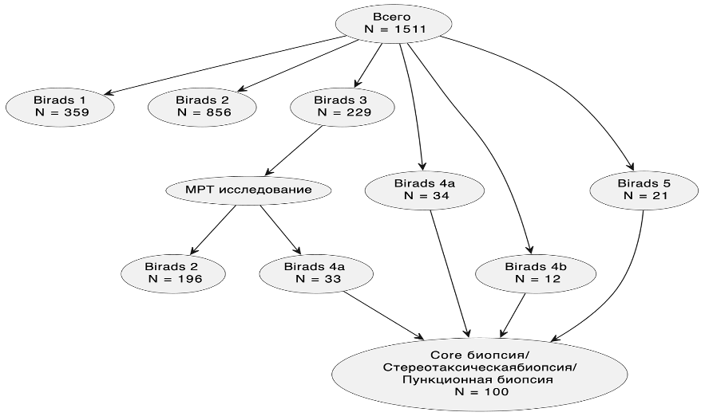

Рисунок №11 Распределение поставленных категорий BI-RADS после выполнения 2D УЗИ и количество пациентов, которым была выполнена биопсия

## 3.2 Автоматизированное объемное УЗИ сканирование молочных желез (3D УЗИ), группа B.

Пациенткам в выборке моложе 40 лет выполнено 3D УЗИ в 47.92% (724/1511). Кожа была не изменена в 100% (724/724). Симптом ретракции был в 11.05% (80/724) и в 88.95% его не было (644/724) (Рисунок 12).

Образование было найдено в 35.64% (258/724). Размеры узлов были в диапазоне 0,5-1,0 см в 37.6% (97/258), 1,1-1,5 см в 40.7% (105/258), 1,5-2,0 см в 12.02% (31/258) и 2,5-3,0 см в 9.69% (25/258). Контуры узлов были ровные в 80.62% (208/258), неровные в 14.34% (37/258), полициклические в 2.33% (6/258) и нарушение архитектоники в 2.71% (7/258). Образование было гипоэхогенное в 97.67% (252/258) и смешанная эхогенность в 2.33% (6/258). Структура узлов однородная была в 71.32% (184/258), неоднородная в 25.97% (67/258) и наличие внутрикистозных пристеночных разрастаний в 2.71% (7/258). Один узел был определен в 75.97% (196/258), два в 9.69% (25/258), три в 4.65% (12/258) и множественные в 9.69% (25/258) (Рисунок 12).

Была установлена категория Birads 1 в 21.13% (153/724), Birads 2 в 58.7% (425/724), Birads 3 в 15.19% (110/724), Birads 4b в 0.83% (6/724), Birads 4а в 1.66% (12/724) и Birads 5 в 2.49% (18/724). По результатам выполнения 3D УЗИ был поставлен диагноз “без патологии” в 25.83% (187/724), “диффузный фиброаденоматоз” в 0.83% (6/724), “киста” в 4.28% (31/724), “кисты” в 4.56% (33/724), “мультифокальный рак”в 1.93% (14/724), “мультицентричный рак” в 1.8% (13/724), “образование Ca” в 2.35% (17/724), “склерозирующий аденоз” в 0.83% (6/724), “сложная киста” в 0.28% (2/724), “фиброаденома единичная” в 20.03% (145/724), “фиброаденомы множествненные” в 6.63% (48/724) и “фиброзно-кистозная мастопатия” в 30.66% (222/724) (Рисунок 12).

Были найдены кальцинаты в 3% от выборки (24/724). В выборке моложе 40 лет при выполнении 3D УЗИ был поставлен диагноз рак в 6.08% (44/724) (Рисунок 12).

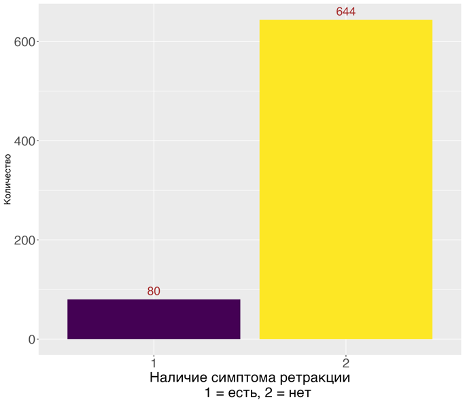 **а**

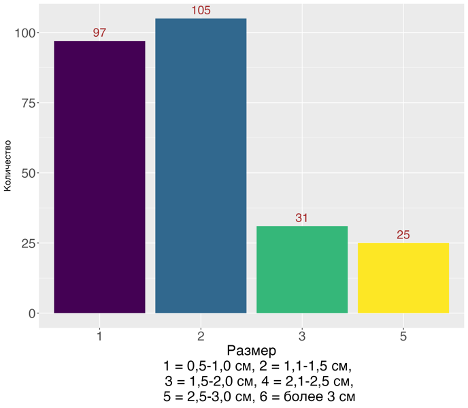 **б** 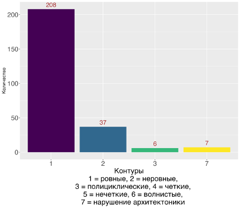 **в** 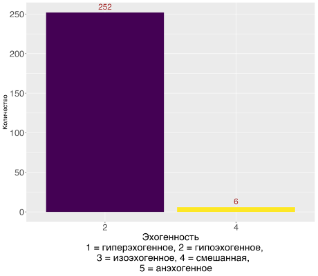 **г** 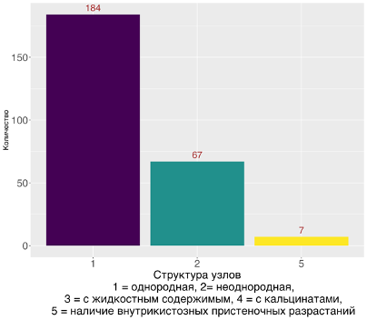 **д** 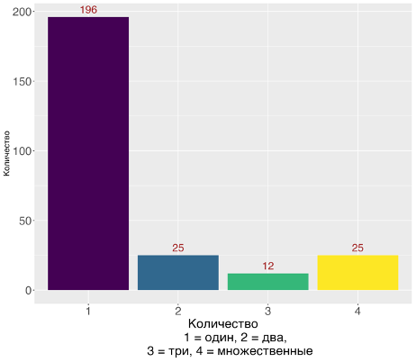 **е** 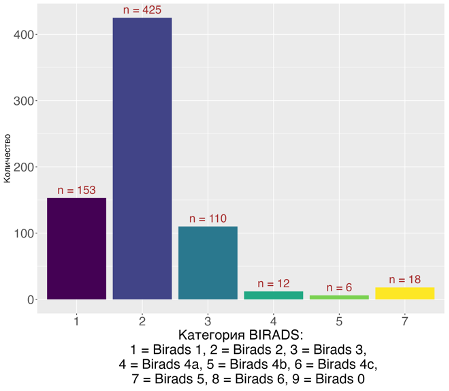 **ж** 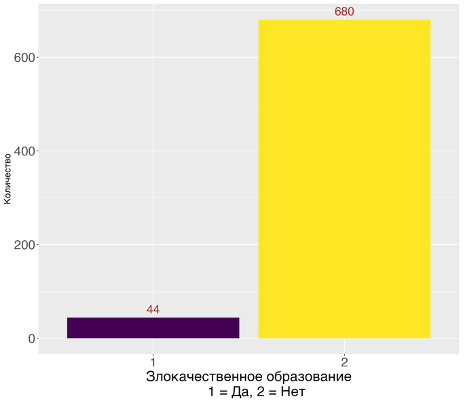 **з**

**Рисунок 12.** **(а)** симптом ретракции, **(б)** размер найденных узлов, **(в)** контур узлов, **(г)** эхогенность, **(д)** структура, **(е)** количество узлов, **(ж)** категория BIRADS, **(з)** нахождение кальцинатов, **(и)** постановка злокачественного образования по 3D УЗИ.

## 3.3 Сравнительная характеристика групп по исследованиям 2D УЗИ, МРТ и гистологической верификации

В группу A 787 пациентов, а группу B 724 пациентов.

### 3.2.1 Исследование УЗИ

*Кожа при выполнении УЗИ*

Во всех случаях кожа была не изменена в обеих группах.

*УЗ-фон*

УЗ-фоном была в группе A железистая ткань в 63.28% (498/787), кисты в 0.76% (6/787) и фиброзно-кистозная мастопатия в 35.96% (283/787). В группе B железистая ткань в 68.09% (493/724), склероз в 0.97% (7/724) и фиброзно-кистозная мастопатия в 30.94% (224/724) 95% ДИ 0.28;0.34 (Таблица 8).

*Расположение образования*

Образование находилось в группе A локация образования была верхне-внутрнний квадрант в 22.78% (41/180), верхне-наружный квадрант в 20.56% (37/180), вся железа в 3.33% (6/180), граница в 6.67% (12/180), граница верхних квадрантов в 15% (27/180), граница внутренних квадрантов в 13.89% (25/180), нижне-внутренний квадрант в 7.22% (13/180) и нижне-наружный квадрант в 10.56% (19/180). В группе B - верхне-внутренний квадрант в 13.22% (30/227), верхне-наружный квадрант в 46.26% (105/227), граница в 8.81% (20/227), граница верхних квадрантов в 2.64% (6/227), граница наружных квадрантов 13.22% (30/227), нижне-внутренний квадрант в 2.64% (6/227), нижне-наружный квадрант в 10.57% (24/227) и центральный отдел в 2.64% (6/227) (Таблица 8).

*Форма образования*

Форма образования в группе A неправильная в 3.33% (6/180), овальная в 86.67% (156/180), округлая в 6.67% (12/180) и участок нарушения архитектоники в 3.33% (6/180). В группе B неправильная в 13.22% (30/227), овальная в 78.41% (178/227), округлая в 2.64% (6/227) и участок нарушения архитектоники в 5.73% (13/227) (Таблица 8).

*Размер образования*

Размер образования в группе A был в диапазоне 0,5-1,0 см в 37.22% (67/180), 1,1-1,5 см в 38.33% (69/180), 1,5-2,0 см в 17.22% (31/180) и 2,5-3,0 см в 7.22% (13/180). В группе B 0,5-1,0 см в 34.8% (79/227), 1,1-1,5 см в 45.81% (104/227), 1,5-2,0 см в 8.37% (19/227), 2,1-2,5 см в 2.64% (6/227) и 2,5-3,0 см в 8.37% (19/227) (Таблица 8).

*Края образования*

В группе A края образования были волнистые в 14.44% (26/180), неровные в 3.33% (6/180) и ровные в 82.22% (148/180). В группе B волнистые в 8.37% (19/227), звездчатые в 5.29% (12/227), неровные в 5.29% (12/227), полициклические в 2.64% (6/227) ировные в 78.41% (178/227) (Таблица 8).

*Эхогенность образования*

В группе A гипоэхогенное образование было в 89.44% (161/180), изоэхогенное в 3.89% (7/180) и смешанная эхогенность в 6.67% (12/180). В группе B гипоэхогенное образование в 94.71% (215/227), изоэхогенное в 2.64% (6/227) и смешанная эхогенность в 2.64% (6/227) (Таблица 8).

*УЗ-структура образования*

В группе A УЗ-структура образования неоднородная в 13.89% (25/180), однородная в 82.78% (149/180), с жидкостным содержимым в 0% (0/180) и наличие внутрикистозных пристеночных разрастаний в 3.33% (6/180). В группе B неоднородная в 24.23% (55/227) и однородная в 75.77% (172/227) (Таблица 8).

*Количество узлов*

В группе A один узел обнаружен в 79.44% (143/180), два в 13.89% (25/180), три в 3.33% (6/180) и множественные в 3.33% (6/180).

В группе B один узел обнаружен в 72.69% (165/227), два в 11.01% (25/227), три в 5.29% (12/227) и множественные в 11.01% (25/227) (Таблица 8).

*Кровоток в образовании*

Кровоток в образовании в группе A интранодулярный в 6.67% (12/180), не определяется в 36.11% (65/180), определяются внутри в 3.33% (6/180), перинодулярный в 3.33% (6/180), по периферии в 47.22% (85/180) и смешанный в 3.33% (6/180). В группе B кровоток интранодулярный в 21.59% (49/227), не определяется в 37.44% (85/227), перинодулярный в 2.64% (6/227) и по периферии в 38.33% (87/227) (Таблица 8).

*Эластография*

В группе A был определен 0 эластотип в 52.86% (416/787), 1 эластотип в 3.56% (28/787), 2 эластотип в 35.96% (283/787), 3 эластотип в 5.34% (42/787), 4 эластотип в 0.76% (6/787) и не было данных в 1.52% (12/787). В группе B 0 эластотип в 52.35% (379/724), 1 эластотип в 2.35% (17/724), 2 эластотип в 37.02% (268/724), 3 эластотип в 6.49% (47/724), 4 эластотип в 0.14% (1/724) и не было данных в 1.66% (12/724) (Таблица 8).

**Таблица №8.** УЗ -фон, расположение, форма, размер, края образования, эхогенность, УЗ-структура образования, количества узлов, кровоток в образовании, результаты эластографии при УЗ исследовании в группах А и B.

+--------------------------------------------------+--------------------+--------------+--------------------+--------------+
| Показатель                                       | Процентная доля    | 95% ДИ       | Процентная доля    | 95% ДИ       |
+--------------------------------------------------+--------------------+--------------+--------------------+--------------+
| Группа                                           | Группа A           | Группа B     |                    |              |
+--------------------------------------------------+--------------------+--------------+--------------------+--------------+
| *УЗ-фон*                                         |                    |              |                    |              |
+--------------------------------------------------+--------------------+--------------+--------------------+--------------+
| железистая ткань                                 | 63.278% (498/ 787) | [0.6; 0.67]  | 68.094% (493/ 724) | [0.65; 0.71] |
+--------------------------------------------------+--------------------+--------------+--------------------+--------------+
| кисты                                            | 0.762% (6/ 787)    | [0; 0.02]    | 0% (0/ 724)        | [0; 0.01]    |
+--------------------------------------------------+--------------------+--------------+--------------------+--------------+
| склероз                                          | 0% (0/ 787)        | [0; 0.01]    | 0.967% (7/ 724)    | [0; 0.02]    |
+--------------------------------------------------+--------------------+--------------+--------------------+--------------+
| фиброзно-кистозная мастопатия                    | 35.959% (283/ 787) | [0.33; 0.39] | 30.939% (224/ 724) | [0.28; 0.34] |
+--------------------------------------------------+--------------------+--------------+--------------------+--------------+
| *Образование находилось*                         |                    |              |                    |              |
+--------------------------------------------------+--------------------+--------------+--------------------+--------------+
| верхне-внутренний                                | 22.778% (41/ 180)  | [0.17; 0.3]  | 13.216% (30/ 227)  | [0.09; 0.18] |
+--------------------------------------------------+--------------------+--------------+--------------------+--------------+
| верхне-наружный                                  | 20.556% (37/ 180)  | [0.15; 0.27] | 46.256% (105/ 227) | [0.4; 0.53]  |
+--------------------------------------------------+--------------------+--------------+--------------------+--------------+
| вся железа                                       | 3.333% (6/ 180)    | [0.01; 0.07] | 0% (0/ 227)        | [0; 0.02]    |
+--------------------------------------------------+--------------------+--------------+--------------------+--------------+
| граница                                          | 6.667% (12/ 180)   | [0.04; 0.12] | 8.811% (20/ 227)   | [0.06; 0.13] |
+--------------------------------------------------+--------------------+--------------+--------------------+--------------+
| граница верхних                                  | 15% (27/ 180)      | [0.1; 0.21]  | 2.643% (6/ 227)    | [0.01; 0.06] |
+--------------------------------------------------+--------------------+--------------+--------------------+--------------+
| граница внутренних                               | 13.889% (25/ 180)  | [0.09; 0.2]  | 0% (0/ 227)        | [0; 0.02]    |
+--------------------------------------------------+--------------------+--------------+--------------------+--------------+
| граница наружных                                 | 0% (0/ 180)        | [0; 0.03]    | 13.216% (30/ 227)  | [0.09; 0.18] |
+--------------------------------------------------+--------------------+--------------+--------------------+--------------+
| граница нижних                                   | 0% (0/ 180)        | [0; 0.03]    | 0% (0/ 227)        | [0; 0.02]    |
+--------------------------------------------------+--------------------+--------------+--------------------+--------------+
| нижне-внутренний                                 | 7.222% (13/ 180)   | [0.04; 0.12] | 2.643% (6/ 227)    | [0.01; 0.06] |
+--------------------------------------------------+--------------------+--------------+--------------------+--------------+
| нижне-наружный                                   | 10.556% (19/ 180)  | [0.07; 0.16] | 10.573% (24/ 227)  | [0.07; 0.16] |
+--------------------------------------------------+--------------------+--------------+--------------------+--------------+
| центральный отдел                                | 0% (0/ 180)        | [0; 0.03]    | 2.643% (6/ 227)    | [0.01; 0.06] |
+--------------------------------------------------+--------------------+--------------+--------------------+--------------+
| *Форма образования*                              |                    |              |                    |              |
+--------------------------------------------------+--------------------+--------------+--------------------+--------------+
| неправильная                                     | 3.333% (6/ 180)    | [0.01; 0.07] | 13.216% (30/ 227)  | [0.09; 0.18] |
+--------------------------------------------------+--------------------+--------------+--------------------+--------------+
| овальная                                         | 86.667% (156/ 180) | [0.81; 0.91] | 78.414% (178/ 227) | [0.72; 0.83] |
+--------------------------------------------------+--------------------+--------------+--------------------+--------------+
| округлая                                         | 6.667% (12/ 180)   | [0.04; 0.12] | 2.643% (6/ 227)    | [0.01; 0.06] |
+--------------------------------------------------+--------------------+--------------+--------------------+--------------+
| участок нарушения архитектоники                  | 3.333% (6/ 180)    | [0.01; 0.07] | 5.727% (13/ 227)   | [0.03; 0.1]  |
+--------------------------------------------------+--------------------+--------------+--------------------+--------------+
| *Размер образования*                             |                    |              |                    |              |
+--------------------------------------------------+--------------------+--------------+--------------------+--------------+
| 0,5-1,0 см                                       | 37.222% (67/ 180)  | [0.3; 0.45]  | 34.802% (79/ 227)  | [0.29; 0.41] |
+--------------------------------------------------+--------------------+--------------+--------------------+--------------+
| 1,1-1,5 см                                       | 38.333% (69/ 180)  | [0.31; 0.46] | 45.815% (104/ 227) | [0.39; 0.53] |
+--------------------------------------------------+--------------------+--------------+--------------------+--------------+
| 1,5-2,0 см                                       | 17.222% (31/ 180)  | [0.12; 0.24] | 8.37% (19/ 227)    | [0.05; 0.13] |
+--------------------------------------------------+--------------------+--------------+--------------------+--------------+
| 2,1-2,5 см                                       | 0% (0/ 180)        | [0; 0.03]    | 2.643% (6/ 227)    | [0.01; 0.06] |
+--------------------------------------------------+--------------------+--------------+--------------------+--------------+
| 2,5-3,0 см                                       | 7.222% (13/ 180)   | [0.04; 0.12] | 8.37% (19/ 227)    | [0.05; 0.13] |
+--------------------------------------------------+--------------------+--------------+--------------------+--------------+
| более 3 см                                       | 0% (0/ 180)        | [0; 0.03]    | 0% (0/ 227)        | [0; 0.02]    |
+--------------------------------------------------+--------------------+--------------+--------------------+--------------+
| *Края образования*                               |                    |              |                    |              |
+--------------------------------------------------+--------------------+--------------+--------------------+--------------+
| волнистые                                        | 14.444% (26/ 180)  | [0.1; 0.21]  | 8.37% (19/ 227)    | [0.05; 0.13] |
+--------------------------------------------------+--------------------+--------------+--------------------+--------------+
| звездчатые                                       | 0% (0/ 180)        | [0; 0.03]    | 5.286% (12/ 227)   | [0.03; 0.09] |
+--------------------------------------------------+--------------------+--------------+--------------------+--------------+
| неровные                                         | 3.333% (6/ 180)    | [0.01; 0.07] | 5.286% (12/ 227)   | [0.03; 0.09] |
+--------------------------------------------------+--------------------+--------------+--------------------+--------------+
| полициклические                                  | 0% (0/ 180)        | [0; 0.03]    | 2.643% (6/ 227)    | [0.01; 0.06] |
+--------------------------------------------------+--------------------+--------------+--------------------+--------------+
| ровные                                           | 82.222% (148/ 180) | [0.76; 0.87] | 78.414% (178/ 227) | [0.72; 0.83] |
+--------------------------------------------------+--------------------+--------------+--------------------+--------------+
| *Эхогенность образования*                        |                    |              |                    |              |
+--------------------------------------------------+--------------------+--------------+--------------------+--------------+
| гипоэхогенное                                    | 89.444% (161/ 180) | [0.84; 0.93] | 94.714% (215/ 227) | [0.91; 0.97] |
+--------------------------------------------------+--------------------+--------------+--------------------+--------------+
| изоэхогенное                                     | 3.889% (7/ 180)    | [0.02; 0.08] | 2.643% (6/ 227)    | [0.01; 0.06] |
+--------------------------------------------------+--------------------+--------------+--------------------+--------------+
| смешанная                                        | 6.667% (12/ 180)   | [0.04; 0.12] | 2.643% (6/ 227)    | [0.01; 0.06] |
+--------------------------------------------------+--------------------+--------------+--------------------+--------------+
| *УЗ-структура образования*                       |                    |              |                    |              |
+--------------------------------------------------+--------------------+--------------+--------------------+--------------+
| наличие внутрикистозных пристеночных разрастаний | 3.333% (6/ 180)    | [0.01; 0.07] | 0% (0/ 227)        | [0; 0.02]    |
+--------------------------------------------------+--------------------+--------------+--------------------+--------------+
| неоднородная                                     | 13.889% (25/ 180)  | [0.09; 0.2]  | 24.229% (55/ 227)  | [0.19; 0.3]  |
+--------------------------------------------------+--------------------+--------------+--------------------+--------------+
| однородная                                       | 82.778% (149/ 180) | [0.76; 0.88] | 75.771% (172/ 227) | [0.7; 0.81]  |
+--------------------------------------------------+--------------------+--------------+--------------------+--------------+
| с жидкостным содержимым                          | 0% (0/ 180)        | [0; 0.03]    | 0% (0/ 227)        | [0; 0.02]    |
+--------------------------------------------------+--------------------+--------------+--------------------+--------------+
| *Количество узлов*                               |                    |              |                    |              |
+--------------------------------------------------+--------------------+--------------+--------------------+--------------+
| один                                             | 79.444% (143/ 180) | [0.73; 0.85] | 72.687% (165/ 227) | [0.66; 0.78] |
+--------------------------------------------------+--------------------+--------------+--------------------+--------------+
| два                                              | 13.889% (25/ 180)  | [0.09; 0.2]  | 11.013% (25/ 227)  | [0.07; 0.16] |
+--------------------------------------------------+--------------------+--------------+--------------------+--------------+
| три                                              | 3.333% (6/ 180)    | [0.01; 0.07] | 5.286% (12/ 227)   | [0.03; 0.09] |
+--------------------------------------------------+--------------------+--------------+--------------------+--------------+
| множественные                                    | 3.333% (6/ 180)    | [0.01; 0.07] | 11.013% (25/ 227)  | [0.07; 0.16] |
+--------------------------------------------------+--------------------+--------------+--------------------+--------------+
| *Кровоток в образовании*                         |                    |              |                    |              |
+--------------------------------------------------+--------------------+--------------+--------------------+--------------+
| интранодулярный                                  | 6.667% (12/ 180)   | [0.04; 0.12] | 21.586% (49/ 227)  | [0.17; 0.28] |
+--------------------------------------------------+--------------------+--------------+--------------------+--------------+
| не определяется                                  | 36.111% (65/ 180)  | [0.29; 0.44] | 37.445% (85/ 227)  | [0.31; 0.44] |
+--------------------------------------------------+--------------------+--------------+--------------------+--------------+
| определяются внутри                              | 3.333% (6/ 180)    | [0.01; 0.07] | 0% (0/ 227)        | [0; 0.02]    |
+--------------------------------------------------+--------------------+--------------+--------------------+--------------+
| перинодулярный                                   | 3.333% (6/ 180)    | [0.01; 0.07] | 2.643% (6/ 227)    | [0.01; 0.06] |
+--------------------------------------------------+--------------------+--------------+--------------------+--------------+
| по периферии                                     | 47.222% (85/ 180)  | [0.4; 0.55]  | 38.326% (87/ 227)  | [0.32; 0.45] |
+--------------------------------------------------+--------------------+--------------+--------------------+--------------+
| смешанный                                        | 3.333% (6/ 180)    | [0.01; 0.07] | 0% (0/ 227)        | [0; 0.02]    |
+--------------------------------------------------+--------------------+--------------+--------------------+--------------+
| *Эластография*                                   |                    |              |                    |              |
+--------------------------------------------------+--------------------+--------------+--------------------+--------------+
| 0 эластотип                                      | 52.859% (416/787)  | [0.49; 0.56] | 52.348% (379/724)  | [0.49; 0.56] |
+--------------------------------------------------+--------------------+--------------+--------------------+--------------+
| 1 эластотип                                      | 3.558% (28/787)    | [0.02; 0.05] | 2.348% (17/724)    | [0.01; 0.04] |
+--------------------------------------------------+--------------------+--------------+--------------------+--------------+
| 2 эластотип                                      | 35.959% (283/787)  | [0.33; 0.39] | 37.017% (268/724)  | [0.34; 0.41] |
+--------------------------------------------------+--------------------+--------------+--------------------+--------------+
| 3 эластотип                                      | 5.337% (42/787)    | [0.04; 0.07] | 6.492% (47/724)    | [0.05; 0.09] |
+--------------------------------------------------+--------------------+--------------+--------------------+--------------+
| 4 эластотип                                      | 0.762% (6/787)     | [0; 0.02]    | 0.138% (1/724)     | [0; 0.01]    |
+--------------------------------------------------+--------------------+--------------+--------------------+--------------+
| нет данных                                       | 1.525% (12/787)    | [0.01; 0.03] | 1.657% (12/724)    | [0.01; 0.03] |
+--------------------------------------------------+--------------------+--------------+--------------------+--------------+

*Регионарные лимфоузлы*

В группе A лимфоузлы не изменены в 97.59% (768/787) и увеличены в правой надключичной области в 2.41% (19/787). В группе B лимфоузлы не изменены в 95.72% (693/724) и увеличены в надключичной области в 4.28% (31/724) (Таблица №9).

*Определение категории BI-RADS*

В группе A категория Birads 1 была в 26.68% (210/787), Birads 2 в 58.45% (460/787), Birads 3 в 12.45% (98/787), Birads 4а в 1.65% (13/787) и Birads 5 в 0.76% (6/787). В группе B Birads 1 в 20.58% (149/724), Birads 2 в 58.43% (423/724), Birads 3 в 15.19% (110/724), Birads 4b в 1.66% (12/724), Birads 4а в 3.31% (24/724) и Birads 5 в 0.83% (6/724) (Таблица №9).

*Диагноз после выполнения УЗ исследования*

УЗ-диагноз в группе A “без патологии” в 27.32% (215/787), “диффузный фиброаденоматоз” в 4.19% (33/787), “киста” в 1.02% (8/787), “кисты” в 2.29% (18/787), “локализованный фиброаденоматоз” в 1.02% (8/787), “мультицентричный рак” в 0.76% (6/787), “образование Ca” в 1.14% (9/787), “сложная киста” в 0.13% (1/787), “фиброаденома единичная” в 14.1% (111/787), “фиброаденомы множествненные” в 3.94% (31/787), “фиброзно-кистозная мастопатия” в 43.33% (341/787) и “цистаденопапиллома” в 0.76% (6/787) . В группе B были поставлены диагнозы “без патологии” в 21.55% (156/724), “диффузный фиброаденоматоз” в 4.28% (31/724), “интрамаммарный лимфатический узел” в 0% (0/724), “киста” в 3.31% (24/724), “кисты” в 3.59% (26/724), “локализованный фиброаденоматоз” в 0.28% (2/724), “мультицентричный рак” в 2.49% (18/724), “мультфококальный рак” в 0.41% (3/724), “образование Ca” в 3.59% (26/724), “фиброаденома единичная” в 20.99% (152/724), “фиброаденомы множествненные” в 6.49% (47/724) и “фиброзно-кистозная мастопатия” в 33.01% (239/724) (Таблица №9).

*Кальциаты*

В группе A определяются кальцинаты в 1.5% (12/787). В группе B обнаружены кальцинаты в 1.5% (12/724) (Таблица №9).

*Определние злокачественного образования при УЗИ исследовании*

В группе A был установлен УЗ диагноз злокачественное образование в 1.91% (15/787). В группе B в 6.49% (47/724) (Таблица №9).

**Таблица №9.** Увеличение регинарных лимфоузлов, определение категории BIRADS, Поставленные диагнозы при УЗ исследовании, определение кальцинатов, злокачественного новообразование при УЗ исследовании в группах А и B.

+--------------------------------------------+--------------------+--------------+--------------------+--------------+
| Показатель                                 | Процентная доля    | 95% ДИ       | Процентная доля    | 95% ДИ       |
+--------------------------------------------+--------------------+--------------+--------------------+--------------+
| Группы                                     | Группа A           | Группа B     |                    |              |
+--------------------------------------------+--------------------+--------------+--------------------+--------------+
| Увеличение регинарных лимфоузлов           |                    |              |                    |              |
+--------------------------------------------+--------------------+--------------+--------------------+--------------+
| не изменены                                | 97.586% (768/ 787) | [0.96; 0.98] | 95.718% (693/ 724) | [0.94; 0.97] |
+--------------------------------------------+--------------------+--------------+--------------------+--------------+
| надключичная область                       | 2.414% (19/ 787)   | [0.02; 0.04] | 4.282% (31/ 724)   | [0.03; 0.06] |
+--------------------------------------------+--------------------+--------------+--------------------+--------------+
| *Категория BI-RADS*                        |                    |              |                    |              |
+--------------------------------------------+--------------------+--------------+--------------------+--------------+
| Birads 1                                   | 26.684% (210/ 787) | [0.24; 0.3]  | 20.58% (149/ 724)  | [0.18; 0.24] |
+--------------------------------------------+--------------------+--------------+--------------------+--------------+
| Birads 2                                   | 58.45% (460/ 787)  | [0.55; 0.62] | 58.425% (423/ 724) | [0.55; 0.62] |
+--------------------------------------------+--------------------+--------------+--------------------+--------------+
| Birads 3                                   | 12.452% (98/ 787)  | [0.1; 0.15]  | 15.193% (110/ 724) | [0.13; 0.18] |
+--------------------------------------------+--------------------+--------------+--------------------+--------------+
| Birads 4b                                  | 0% (0/ 787)        | [0; 0.01]    | 1.657% (12/ 724)   | [0.01; 0.03] |
+--------------------------------------------+--------------------+--------------+--------------------+--------------+
| Birads 4а                                  | 1.652% (13/ 787)   | [0.01; 0.03] | 3.315% (24/ 724)   | [0.02; 0.05] |
+--------------------------------------------+--------------------+--------------+--------------------+--------------+
| Birads 5                                   | 0.762% (6/ 787)    | [0; 0.02]    | 0.829% (6/ 724)    | [0; 0.02]    |
+--------------------------------------------+--------------------+--------------+--------------------+--------------+
| *УЗ-диагноз*                               |                    |              |                    |              |
+--------------------------------------------+--------------------+--------------+--------------------+--------------+
| без патологии                              | 27.319% (215/ 787) | [0.24; 0.31] | 21.547% (156/ 724) | [0.19; 0.25] |
+--------------------------------------------+--------------------+--------------+--------------------+--------------+
| внутрипротоковая папиллома молочной железы | 0% (0/ 787)        | [0; 0.01]    | 0% (0/ 724)        | [0; 0.01]    |
+--------------------------------------------+--------------------+--------------+--------------------+--------------+
| диффузный фиброаденоматоз                  | 4.193% (33/ 787)   | [0.03; 0.06] | 4.282% (31/ 724)   | [0.03; 0.06] |
+--------------------------------------------+--------------------+--------------+--------------------+--------------+
| интрамаммарный лимфатический узел          | 0% (0/ 787)        | [0; 0.01]    | 0% (0/ 724)        | [0; 0.01]    |
+--------------------------------------------+--------------------+--------------+--------------------+--------------+
| киста                                      | 1.017% (8/ 787)    | [0; 0.02]    | 3.315% (24/ 724)   | [0.02; 0.05] |
+--------------------------------------------+--------------------+--------------+--------------------+--------------+
| кисты                                      | 2.287% (18/ 787)   | [0.01; 0.04] | 3.591% (26/ 724)   | [0.02; 0.05] |
+--------------------------------------------+--------------------+--------------+--------------------+--------------+
| липома                                     | 0% (0/ 787)        | [0; 0.01]    | 0% (0/ 724)        | [0; 0.01]    |
+--------------------------------------------+--------------------+--------------+--------------------+--------------+
| локализованный фиброаденоматоз             | 1.017% (8/ 787)    | [0; 0.02]    | 0.276% (2/ 724)    | [0; 0.01]    |
+--------------------------------------------+--------------------+--------------+--------------------+--------------+
| мультицентричный рак                       | 0.762% (6/ 787)    | [0; 0.02]    | 2.486% (18/ 724)   | [0.02; 0.04] |
+--------------------------------------------+--------------------+--------------+--------------------+--------------+
| мультфококальный рак                       | 0% (0/ 787)        | [0; 0.01]    | 0.414% (3/ 724)    | [0; 0.01]    |
+--------------------------------------------+--------------------+--------------+--------------------+--------------+
| образование Ca                             | 1.144% (9/ 787)    | [0.01; 0.02] | 3.591% (26/ 724)   | [0.02; 0.05] |
+--------------------------------------------+--------------------+--------------+--------------------+--------------+
| сложная киста                              | 0.127% (1/ 787)    | [0; 0.01]    | 0% (0/ 724)        | [0; 0.01]    |
+--------------------------------------------+--------------------+--------------+--------------------+--------------+
| фиброаденома единичная                     | 14.104% (111/ 787) | [0.12; 0.17] | 20.994% (152/ 724) | [0.18; 0.24] |
+--------------------------------------------+--------------------+--------------+--------------------+--------------+
| фиброаденомы множествненные                | 3.939% (31/ 787)   | [0.03; 0.06] | 6.492% (47/ 724)   | [0.05; 0.09] |
+--------------------------------------------+--------------------+--------------+--------------------+--------------+
| фиброзно-кистозная мастопатия              | 43.329% (341/ 787) | [0.4; 0.47]  | 33.011% (239/ 724) | [0.3; 0.37]  |
+--------------------------------------------+--------------------+--------------+--------------------+--------------+
| цистаденопапиллома                         | 0.762% (6/ 787)    | [0; 0.02]    | 0% (0/ 724)        | [0; 0.01]    |
+--------------------------------------------+--------------------+--------------+--------------------+--------------+
| *Кальцинаты*                               |                    |              |                    |              |
+--------------------------------------------+--------------------+--------------+--------------------+--------------+
| микрокальцинаты                            | 0% (0/ 787)        | [0; 0.01]    | 0.829% (6/ 724)    | [0; 0.02]    |
+--------------------------------------------+--------------------+--------------+--------------------+--------------+
| нет                                        | 99.238% (781/ 787) | [0.98; 1]    | 98.343% (712/ 724) | [0.97; 0.99] |
+--------------------------------------------+--------------------+--------------+--------------------+--------------+
| определяются                               | 0.762% (6/ 787)    | [0; 0.02]    | 0.829% (6/ 724)    | [0; 0.02]    |
+--------------------------------------------+--------------------+--------------+--------------------+--------------+
| *УЗ диагноз злокачественное образование*   |                    |              |                    |              |
+--------------------------------------------+--------------------+--------------+--------------------+--------------+
| Да                                         | 1.906% (15/ 787)   | [0.01; 0.03] | 6.492% (47/ 724)   | [0.05; 0.09] |
+--------------------------------------------+--------------------+--------------+--------------------+--------------+
| Нет                                        | 98.094% (772/ 787) | [0.97; 0.99] | 93.508% (677/ 724) | [0.91; 0.95] |
+--------------------------------------------+--------------------+--------------+--------------------+--------------+

### 3.2.2 Исследование МРТ

*Данные МРТ исследования*

В группе A по МРТ были обнаружены интраммарные лимфоузлы в 31.63% (31/98) и сегментарно-протоковая зона контрастирования в 68.37% (67/98). В группе B интраммарные лимфоузлы в 20.91% (23/110) и сегментарно-протоковая зона контрастирования в 79.09% (87/110) (Таблица №10).

*Количество узлов на МРТ*

В группе A был обнаружен один узел в 76.53% (75/98), два в 6.12% (6/98), три в 6.12% (6/98), множественные в 0% (0/98) и не определяется в 11.22% (11/98). В группе B был обнаружен один узел в 69.09% (76/110), два в 5.45% (6/110), три в 10.91% (12/110), множественные в 10.91% (12/110) и не определяется в 3.64% (4/110) (Таблица №10).

**Таблица №10.** Данные МРТ и количество узлов на МРТ в группах А и B.

+----------------------------------------------+------------------+--------------+-------------------+--------------+
| Показатель                                   | Процентная доля  | 95% ДИ       | Процентная доля   | 95% ДИ       |
+----------------------------------------------+------------------+--------------+-------------------+--------------+
| Группы                                       | Группа A         | Группа B     |                   |              |
+----------------------------------------------+------------------+--------------+-------------------+--------------+
| *Данные МРТ*                                 |                  |              |                   |              |
+----------------------------------------------+------------------+--------------+-------------------+--------------+
| интраммарные лимфоузлы                       | 31.633% (31/ 98) | [0.23; 0.42] | 20.909% (23/ 110) | [0.14; 0.3]  |
+----------------------------------------------+------------------+--------------+-------------------+--------------+
| сегментарно-протоковая зона контрастирования | 68.367% (67/ 98) | [0.58; 0.77] | 79.091% (87/ 110) | [0.7; 0.86]  |
+----------------------------------------------+------------------+--------------+-------------------+--------------+
| *Количество узлов на МРТ*                    |                  |              |                   |              |
+----------------------------------------------+------------------+--------------+-------------------+--------------+
| один                                         | 76.531% (75/ 98) | [0.67; 0.84] | 69.091% (76/ 110) | [0.59; 0.77] |
+----------------------------------------------+------------------+--------------+-------------------+--------------+
| два                                          | 6.122% (6/ 98)   | [0.03; 0.13] | 5.455% (6/ 110)   | [0.02; 0.12] |
+----------------------------------------------+------------------+--------------+-------------------+--------------+
| три                                          | 6.122% (6/ 98)   | [0.03; 0.13] | 10.909% (12/ 110) | [0.06; 0.19] |
+----------------------------------------------+------------------+--------------+-------------------+--------------+
| множественные                                | 0% (0/ 98)       | [0; 0.05]    | 10.909% (12/ 110) | [0.06; 0.19] |
+----------------------------------------------+------------------+--------------+-------------------+--------------+
| не определяется                              | 11.224% (11/ 98) | [0.06; 0.2]  | 3.636% (4/ 110)   | [0.01; 0.1]  |
+----------------------------------------------+------------------+--------------+-------------------+--------------+

### 3.2.3 Гистологическая оценка

*Морфологическая структура*

В группе A гистологическое заключение инвазивный рак неспециального типа в 100% (12/12). В группе B инвазивный рак неспециального типа в 67.57% (25/37) и протоковый рак in situ в 32.43% (12/37).

*Цитологическое заключение*

Цитологическое заключение в группе A белковая субстанция, капли жира в 33.33% (6/18), фиброаденома в 33.33% (6/18) и цистаденопапиллома в 33.33% (6/18). В группе B “интрадуктальная папиллома” в 100% (6/6).

*Рецепторы опухоли*

При оценке рецепторов опухоли в группе A был обнаружен негатив в 100% (12/12). В группе B Her-2_neu в 33.33% (6/18) и РЭ+РП в 66.67% (12/18).

*Гистологическое поддтверждение злокачественного новообразования*

Гистологически обнаружено злокачественное образование в группе A в 1.52% (12/787). В группе B в 5.11% (37/724).

*Определение злокачественности новообразования*

В группе A уровень злокачественности был II (умеренная 6-7 балов) в 50% (6/12) и III (высокая 8-9 бал) в 50% (6/12). В группе B II (умеренная 6-7 балов) в 51.35% (19/37) и III (высокая 8-9 бал) в 48.65% (18/37) не проводилось в 0% (0/37).

Основные результаты гистологического и иммуногистохимического исследований по результатам проведенной биопсии представлены в таблице №11.

**Таблица №11.** Результаты гистологического и иммуногистохимического исследований

+---------------------------------------------------------+--------------------+--------------+-------------------+--------------+
| Показатель                                              | Процентная доля    | 95% ДИ       | Процентная доля   | 95% ДИ       |
+---------------------------------------------------------+--------------------+--------------+-------------------+--------------+
| Группы                                                  | Группа А           | Группа Б     |                   |              |
+---------------------------------------------------------+--------------------+--------------+-------------------+--------------+
| *Гистологическое и сследование*                         |                    |              |                   |              |
+---------------------------------------------------------+--------------------+--------------+-------------------+--------------+
| инвазивный дольковый рак                                | 13.333% (2/15)     | [0.02;0.42]  | 0% (0/37)         | [0;0.12]     |
+---------------------------------------------------------+--------------------+--------------+-------------------+--------------+
| инвазивный рак неспециального типа                      | 60% (9/15)         | [0.33;0.83]  | 67.568% (25/37)   | [0.5;0.81]   |
+---------------------------------------------------------+--------------------+--------------+-------------------+--------------+
| протоковый рак in situ                                  | 26.667% (4/15)     | [0.09;0.55]  | 32.432% (12/37)   | [0.19;0.5]   |
+---------------------------------------------------------+--------------------+--------------+-------------------+--------------+
| *Иммуногистохимическое исследование*                    |                    |              |                   |              |
+---------------------------------------------------------+--------------------+--------------+-------------------+--------------+
| негатив                                                 | 60% (9/15)         | [0.33;0.83]  | 10.811% (4/37)    | [0.04;0.26]  |
+---------------------------------------------------------+--------------------+--------------+-------------------+--------------+
| Her-2_neu                                               | 0% (0/15)          | [0;0.25]     | 16.216% (6/37)    | [0.07;0.33]  |
+---------------------------------------------------------+--------------------+--------------+-------------------+--------------+
| РЭ+РП +Her-2_neu                                        | 0% (0/15)          | [0;0.25]     | 16.216% (6/37)    | [0.07;0.33]  |
+---------------------------------------------------------+--------------------+--------------+-------------------+--------------+
| РЭ+РП +Her-2_neu негатив                                | 40% (6/15)         | [0.17;0.67]  | 56.757% (21/37)   | [0.4;0.72]   |
+---------------------------------------------------------+--------------------+--------------+-------------------+--------------+
| *Степень злокачественности*                             |                    |              |                   |              |
+---------------------------------------------------------+--------------------+--------------+-------------------+--------------+
| II (умеренная 6-7 балов)                                | 40% (6/15)         | [0.17;0.67]  | 51.351% (19/37)   | [0.35;0.68]  |
+---------------------------------------------------------+--------------------+--------------+-------------------+--------------+
| III (высокая 8-9 бал)                                   | 60% (9/15)         | [0.33;0.83]  | 48.649% (18/37)   | [0.32;0.65]  |
+---------------------------------------------------------+--------------------+--------------+-------------------+--------------+
| *Гистологически обнаружено злокачественное образование* |                    |              |                   |              |
+---------------------------------------------------------+--------------------+--------------+-------------------+--------------+
| Да                                                      | 1.525% (12/ 787)   | [0.01; 0.03] | 5.11% (37/ 724)   | [0.04; 0.07] |
+---------------------------------------------------------+--------------------+--------------+-------------------+--------------+
| Нет                                                     | 98.475% (775/ 787) | [0.97; 0.99] | 94.89% (687/ 724) | [0.93; 0.96] |
+---------------------------------------------------------+--------------------+--------------+-------------------+--------------+

## 3.4 Определение чувствительности, специфичности и точности методов

Основные результаты определения точности, чувствительности и специфичности приведены в таблице №12. Согласно полученным результатам 3D УЗИ показал лучшие результаты по показателю отбалансированной точности и чувствительности, и сопоставимые результаты по показателю специфичности, чем ультразвуковое исследование в 2D режиме.

**Таблица №12**

Результаты статистического анализа в группах А и B (Т -Точность, P - P-Value, КК - Коэффициент Kappa, ТМ -Тест Макнемара, ППЦ - положительная прогностическая ценность, ОПЦ - отрицательная прогностическая ценность, Ч-Чувствительность, Сп -Специфичность, ОТ- Отбалансированная точность)

|  |  |  |  |  |  |  |  |  |  |
|--------|--------|--------|--------|--------|--------|--------|--------|--------|--------|
| Метод | Т | P | КК | ТМ | ППЦ | ОПЦ | Ч | Сп | ОТ |
| УЗИ в группе А | 0.99 [95% ДИ: 0.98,1] | 0.01 | 0.8 | 1 | 0.8 | 1 | 0.8 | 1 | 0.9 |
| УЗИ в группе B | 0.98 [95% ДИ: 0.96,0.99] | 0 | 0.77 | 0.03 | 0.7 | 0.99 | 0.89 | 0.98 | 0.94 |
| 3D УЗИ в группе B | 0.98 [95% ДИ: 0.97,0.99] | 0 | 0.86 | 0.07 | 0.8 | 1 | 0.95 | 0.99 | 0.97 |
| УЗИ в выборке пациенток моложе 40 лет | 0.98 [95% ДИ: 0.98,0.99] | 0 | 0.78 | 0.07 | 0.73 | 1 | 0.87 | 0.99 | 0.93 |

*Прогностическая оценка методов*

Основные результаты представлены на рисунке №13 и таблице №13. Следует сказать, что прогностическая модель также показывает лучшую эффективность 3D, чем 2D УЗИ.

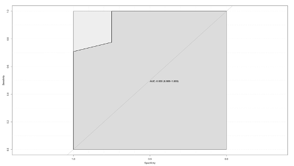 **а** 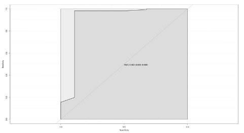 **б** 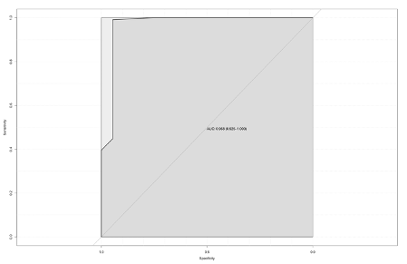 **в** 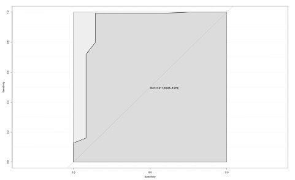 **г**

**Рисунок №13 (а)** ROC-кривая предсказательной модели для метода УЗИ, по данным полученным в группе A. **(б)** ROC-кривая предсказательной модели для метода УЗИ, по данным полученным в группе B. **(в)** ROC-кривая предсказательной модели для метода 3D УЗИ, по данным полученным в группе B. **(г)** ROC-кривая предсказательной модели для метода УЗИ, по данным полученным в выборке пациенток до 40 лет.

**Таблица №13** Определение площади под кривой представленных предсказательных моделей метода в группах А и B.

+-----------------------------------------------+-------------------------------+
| **Метод**                                     | **Площадь под кривой**        |
+-----------------------------------------------+-------------------------------+
| УЗИ в группе A                                | 0.947 [95% ДИ: 0.894 – 1]     |
+-----------------------------------------------+-------------------------------+
| УЗИ в группе B                                | 0.903 [95% ДИ: 0.82 - 0.986]  |
+-----------------------------------------------+-------------------------------+
| УЗИ в выборке пациенток моложе 40 лет (А и Б) | 0.916 [95% ДИ: 0.853 - 0.979] |
+-----------------------------------------------+-------------------------------+
| 3D УЗИ в группе B                             | 0.968 [95% ДИ: 0.925 - 1]     |
+-----------------------------------------------+-------------------------------+

## 3.5 Клинические примеры

**Клинический случай №1**

Пациентка М. 32 года. Показание для исследования уплотнение в левой молочной железе около 1 месяца, болезненность в обеих молочных железах. Анамнез не отягощен, в том числе семейный. ВВК левой молочной железы пальпируется узловое образование до 1,2 см в диаметре, ННК до 1,5 см в диаметре, без четких контуров, плотное, не спаяно с окружающими тканями.

Автоматизированное 3D ультразвуковое сканирование молочных желез представлено на рисунке №14. Мультицентричный рак левой молочной железы. MD BI-RADS 2, MS BI-RADS 4С.

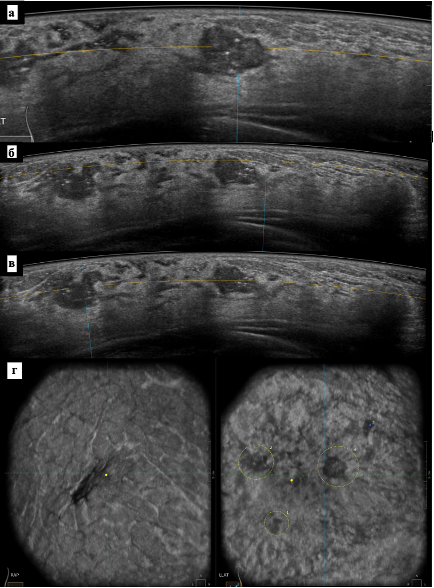 **Рисунок №14. а, б, в, г.** Система 3D УЗИ. Анализ 3D-данных на ультразвуковом аппарате.

Ультразвуковое исследование представлено на рисунке № 15. Ультразвуковые признаки выраженного диффузного фиброаденоматоза обеих молочных желез с преобладанием железистого компонента (аденоз). Ультразвуковая оценка BI-RADS справа 2/слева 4С. Гистологически выявлен инвазивный рак неспециального типа на фоне протокового G 3. Иммуногистохическое исследование: ER - 8 баллов, PR - 8 баллов, HER2/neu - 2+, Ki67 - 70%. Пациентке показано оперативное лечение.


Рисунок № 15 (а) Эхограмма левой молочной железы. ВВК определяется образование неправильной формы. (б) Эхограмма левой молочной железы. В режиме Micro Pure определяются кальцинаты. (в) Эхограмма левой молочной железы. В режиме ЦДК - перинодулярные локусы кровотока. г. Эхограмма левой молочной железы. В ВНК определяется образование овальной формы. д. Эхограмма левой молочной железы. В режиме эластографии картируется эластотип N2-мозаичный зелено-синий. Коэффициент деформации - 2,18.

Далее была выполнена диагностическая ММГ, так как выявлено подозрительные новообразования на 2D УЗИ и 3D УЗИ. Рентгеновская маммография показана на рисунке №16.

 Рисунок 16 Цифровая маммография обеих молочных желез а, б. косая медиолатеральная проекция; в, г. краниокаудальная проекция.

Кальцинаты: слева в ВВК определяются в структуре диффузно множественные полиморфные микрокальцинаты. Инфильтративная форма образования левой молочной железы? нелактационный мастит? Тип С по ACR. MD BI-RADS 2, MS BIRАDS 4А.

## 3.6 Заключение

Согласно проведенному нами исследованию, диагностическая эффективность 3D УЗИ молочных желез у пациенток моложе 40 лет сопоставима по показателю специфичности и лучше по показателю точности, чувствительности, лучше прогностическая модель метода по сравнению с ультразвуковым исследованием в 2D режиме.  2D ультразвуковое исследование имеет ограничения, в частности зависимость от оператора, небольшое поле обзора, которые ограничивают его широкое внедрение. В то время как 3D ультразвуковое исследование имеет преимущества в сравнении с 2D ультразвуковым исследованием, а именно – воспроизводимость, независимость метода от оператора, быстрое получение изображений, время интерпретации изображения около 3-5 минут на одно исследование, возможность «двойного чтения» результатов. Таким образом 3D ультразвуковое исследование становится многообещающим методом для интеграции в клиническую практику у женщин всех возрастных групп, в том числе репродуктивного возраста, с учетом персонализированного подхода к программам скрининга.

# ГЛАВА 4. ДИАГНОСТИЧЕСКАЯ ЭФФЕКТИВНОСТЬ АВТОМАТИЗИРОВАННОГО УЗИ ВСЕЙ МОЛОЧНОЙ ЖЕЛЕЗЫ ПРИ РАКЕ МОЛОЧНОЙ ЖЕЛЕЗЫ У ПАЦИЕНТОК 40 ЛЕТ И СТАРШЕ.

## 4.1 Общее Описание результатов исследования УЗИ в выборке 40 лет и старше

На сегодняшний день можно рассмотреть технологию автоматизированная 3D-УЗИ молочной железы (3D-УЗИ) в качестве дополнительного скрининга у женщин с типом строения молочной железы C и D по ACR в группе 40 лет и старше. В отличие от 2D-УЗИ, метод имеет стандартизированный протокол сбора данных, который может выполняться медицинским персоналом со средним образованием после короткого обучения без необходимости участия высококвалифицированных специалистов во время обследования. 3D-УЗИ позволяет получать большие трехмерные объемы данных, которые могут быть оценены в нескольких плоскостях: корональной, поперечной и сагиттальной. Очаговые изменения можно увидеть на нескольких срезах, что облегчает восприятие. Исследование технологии 3D-УЗИ является перспективным направлением улучшения алгоритмов и подходов при скрининге рака молочной железы. В настоящей главе был проведен сравнительный анализ диагностической эффективности, а именно чувствительности, специфичности и точности 2D-УЗИ в B-режиме, автоматизированного объемного сканирования молочных желез (3D-УЗИ), и маммографического скрининга у женщин в возрастной группе 40 лет и старше лет с неоднородной и высокой плотностью тканей молочной железы.

### 4.1.1 Результаты ручного УЗИ исследования

Всего в исследование вошло 1283 пациентов. Гистологически поставлен рак в 13.48% (173/1283). На рисунке № 17 представлено распределение пациенток при скрининге.

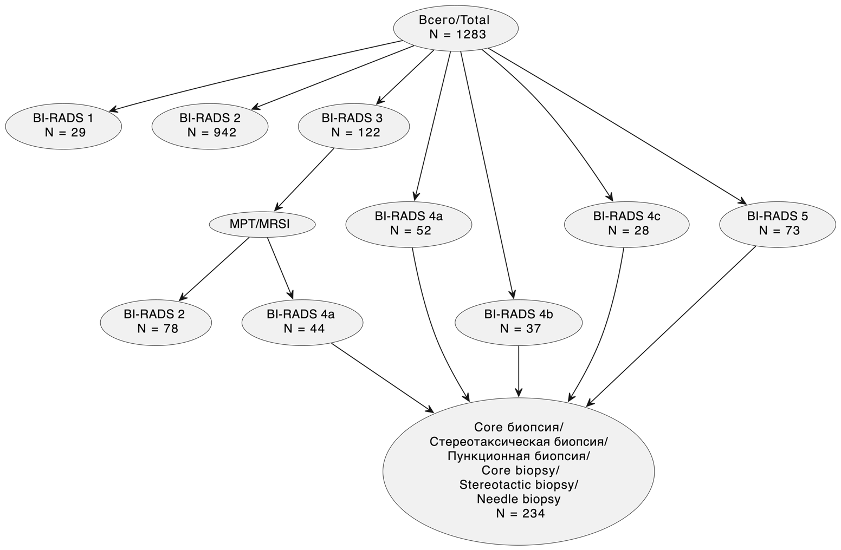 **Рисунок №17** Распределение поставленных категорий BI-RADS после выполнения 2D УЗИ и количество пациентов, которым была выполнена биопсия

### 4.2. Автоматизированное объемное УЗИ сканирование молочных желез (ABUS)

В выборке 40 лет и старше был выполнен 3D УЗИ в 51.05% (655/1283). Кожа была не изменена в 99.39% (651/655) и утолщена в 0.61% (4/655). Симптом ретракции был в 19.39% (127/655). Было выявлено новообразование в 37.86% (248/655) (Рисунок 18).

*Размеры узлов*

Размеры узлов были в пределах 0,5-1,0 см в 27.02% (67/248), 1,1-1,5 см в 30.65% (76/248), 1,5-2,0 см в 22.58% (56/248), 2,1-2,5 см в 6.45% (16/248), 2,5-3,0 см в 12.1% (30/248) и более 3 см в 1.21% (3/248) (Рисунок 18).

*Контуры узлов*

Контуры узлов были неровные в 46.77% (116/248), ровные в 31.45% (78/248), волнистые в 5.65% (14/248), нарушение архитектоники в 6.05% (15/248), нечеткие в 7.26% (18/248) и полициклические в 2.82% (7/248). Образование было гипоэхогенное в 95.56% (237/248), смешанной эхогенности в 3.23% (8/248) и анэхогенное в 1.21% (3/248) (Рисунок 18).

*Структура узлов*

Структура узлов была неоднородная в 56.05% (139/248), однородная в 41.13% (102/248), наличие внутрикистозных пристеночных разрастаний в 1.61% (4/248) и с кальцинатами в 1.21% (3/248). Один узел был определен в 83.87% (208/248), два в 9.27% (23/248), три в 2.82% (7/248) и множественные в 4.03% (10/248) (Рисунок 18).

*Категория Birads*

Была установлена категория Birads 1 в 3.05% (20/655), Birads 2 в 67.48% (442/655), Birads 3 в 7.18% (47/655), Birads 4b в 3.51% (23/655), Birads 4c в 2.14% (14/655), Birads 4а в 3.66% (24/655) и Birads 5 в 12.98% (85/655) (Рисунок 18).

*Кальцинаты*

Кальцинаты определялись в 12.21% (80/655) (Рисунок 18).

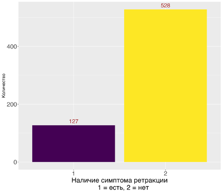 **а** 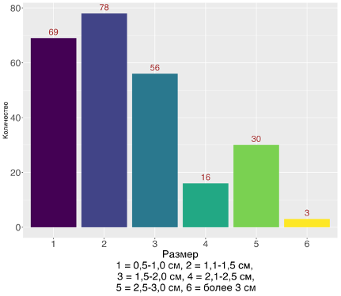 **б**

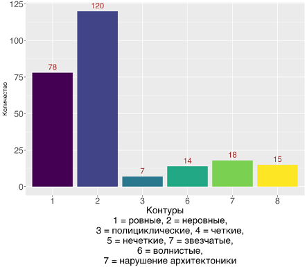 **в** 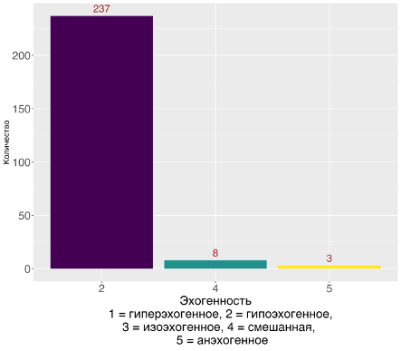 **г**

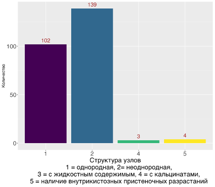 **д** 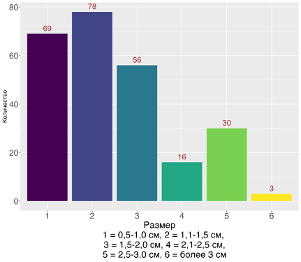 **е**

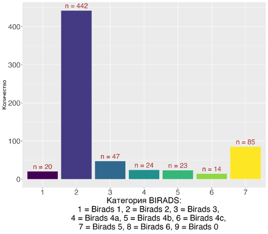 **ж** 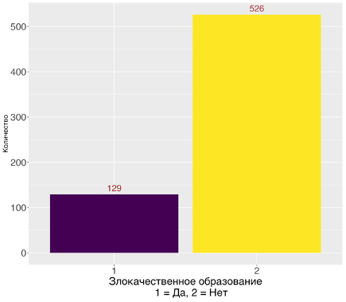 **з**

Рисунок 18 (а) симптом ретракции, (б) размер найденных узлов, (в) контур узлов, (г) эхогенность, (д) структура, (е) количество узлов, (ж) категория BIRADS, (з) постановка злокачественного образования по 3D УЗИ.

## 4.2 Характеристика результатов по группам

В группу C вошло 628 пациентов, в группу D 655 пациентов.

### 4.2.1 Исследование УЗИ

*Кожа при выполнении УЗИ*

Кожа при выполнении УЗИ в группе C не изменена в 100% (628/628). В группе D не изменена в 98.93% (648/655) и утолщена в 1.07% (7/655) (Таблица №14).

*УЗ-фон*

УЗ-фон в группе C железистая ткань в 53.34% (335/628), кисты в 0% (0/628), склероз в 0% (0/628) и фиброзно-кистозная мастопатия в 46.66% (293/628). В группе D железистая ткань в 58.32% (382/655) и фиброзно-кистозная мастопатия в 41.68% (273/655) (Таблица №14).

*Расположение образования*

Локализация образования в группе C верхневнутренний квадрант в 20% (23/115), верхненаружный квадрант в 31.3% (36/115), граница в 12.17% (14/115), граница верхних квадрантов в 6.09% (7/115), граница наружных квадрантов в 5.22% (6/115), нижне-внутренний квадрант в 10.43% (12/115) и нижне-наружный квадрант в 14.78% (17/115). В группе D верхне-внутренний квадрант в 13.47% (33/245), верхне-наружный квадрант в 46.94% (115/245), граница в 5.71% (14/245), граница верхних квадрантов в 7.35% (18/245), граница наружных квадрантов в 7.76% (19/245), граница нижних квадрантов в 3.27% (8/245), нижне-внутренний квадрант в 2.86% (7/245), нижне-наружный квадрант в 8.57% (21/245) и центральный отдел в 4.08% (10/245) (Таблица №14).

*Форма образования*

Форма образования в группе C неправильная в 33.04% (38/115), овальная в 58.26% (67/115), округлая в 2.61% (3/115) и участок нарушения архитектоники в 6.09% (7/115). В группе D неправильная в 50.2% (123/245), овальная в 38.37% (94/245), округлая в 5.71% (14/245) и участок нарушения архитектоники в 5.71% (14/245) (Таблица №14).

*Размер образования*

Размер образования в группе C 0,5-1,0 см в 33.91% (39/115), 1,1-1,5 см в 18.26% (21/115), 1,5-2,0 см в 33.91% (39/115), 2,1-2,5 см в 2.61% (3/115) и 2,5-3,0 см в 11.3% (13/115). В группе D 0,5-1,0 см в 29.39% (72/245), 1,1-1,5 см в 28.98% (71/245), 1,5-2,0 см в 20% (49/245), 2,1-2,5 см в 9.39% (23/245), 2,5-3,0 см в 11.02% (27/245) и более 3 см в 1.22% (3/245) (Таблица №14).

*Края образования*

Края образования в группе C волнистые в 12.17% (14/115), звездчатые в 3.48% (4/115), неровные в 28.7% (33/115), полициклические в 0% (0/115) и ровные в 55.65% (64/115). В группе D волнистые в 8.57% (21/245), звездчатые в 15.1% (37/245), неровные в 35.1% (86/245), полициклические в 0% (0/245) и ровные в 41.22% (101/245) (Таблица №14).

*Эхогенность образования*

Образование в группе C гиперэхогенное в 3.48% (4/115), гипоэхогенное в 93.04% (107/115) и изоэхогенное в 3.48% (4/115). В группе D анэхогенное в 1.22% (3/245), гипоэхогенное в 94.29% (231/245) и смешанная в 4.49% (11/245) (Таблица №14).

*УЗ-структура образования*

УЗ-структура образования в группе C неоднородная в 47.83% (55/115), однородная в 49.57% (57/115) и с жидкостным содержимым в 2.61% (3/115). В группе D неоднородная в 22.44% (147/655) и однородная в 14.96% (98/655) (Таблица №14).

*Количество узлов*

Количество узлов в группе C один в 74.78% (86/115), два в 21.74% (25/115) и три в 3.48% (4/115). В группе D один в 83.67% (205/245), два в 12.24% (30/245), три в 1.22% (3/245) и множественные в 2.86% (7/245) (Таблица №14).

*Кровоток в образовании*

Кровоток в образовании в группе Cинтранодулярный в 34.78% (40/115), не определяется в 31.3% (36/115), по периферии в 31.3% (36/115) и смешанный в 2.61% (3/115). В группе D интранодулярный в 42.86% (105/245), не определяется в 20.82% (51/245), определяются внутри в 1.63% (4/245), перинодулярный в 3.27% (8/245), по периферии в 24.49% (60/245) и смешанный в 6.94% (17/245) (Таблица №14).

*Эластография*

В группе C был определн 0 эластотип в 59.24% (372/628), 1 эластотип в 1.75% (11/628), 2 эластотип в 33.12% (208/628), 3 эластотип в 0.64% (4/628), 4 эластотип в 0.64% (4/628) и не было данных в 4.62% (29/628). В группе D 0 эластотип был в 54.35% (356/655), 1 эластотип в 1.53% (10/655), 2 эластотип в 31.76% (208/655), 4 эластотип в 3.51% (23/655) и не было данных в 8.85% (58/655) (Таблица №14).

**Таблица №14**

Кожа при выполнении 2D УЗИ, локализация, форма, размер, края, эхогенность образования, УЗ-структура образования, количество найденных узлов, кровоток в образовании, результаты эластографии при УЗ исследовании в группах C и D.

+---------------------------------+-----------------+--------------+-------------------+--------------+
| Показатель                      | Процентная доля | 95% ДИ       | Процентная доля   | 95% ДИ       |
+---------------------------------+-----------------+--------------+-------------------+--------------+
| Группы                          | Группа C        | Группа D     |                   |              |
+---------------------------------+-----------------+--------------+-------------------+--------------+
| *Кожа при выполнении УЗИ*       |                 |              |                   |              |
+---------------------------------+-----------------+--------------+-------------------+--------------+
| не изменена                     | 100% (628/628)  | [0.99; 1]    | 98.9% (648/655)   | [0.98; 1]    |
+---------------------------------+-----------------+--------------+-------------------+--------------+
| утолщена                        | 0% (0/628)      | [0; 0.01]    | 1.1% (7/655)      | [0; 0.02]    |
+---------------------------------+-----------------+--------------+-------------------+--------------+
| *УЗ-фон*                        |                 |              |                   |              |
+---------------------------------+-----------------+--------------+-------------------+--------------+
| железистая ткань                | 53.3% (335/628) | [0.49; 0.57] | 58.3% (382/655)   | [0.54; 0.62] |
+---------------------------------+-----------------+--------------+-------------------+--------------+
| фиброзно-кистозная мастопатия   | 46.7% (293/628) | [0.43; 0.51] | 41.7% (273/655)   | [0.38; 0.46] |
+---------------------------------+-----------------+--------------+-------------------+--------------+
| *Образование находилось*        |                 |              |                   |              |
+---------------------------------+-----------------+--------------+-------------------+--------------+
| верхне-внутренний квадрант      | 20% (23/115)    | [0.13; 0.29] | 13.5% (33/245)    | [0.1; 0.19]  |
+---------------------------------+-----------------+--------------+-------------------+--------------+
| верхне-наружный квадрант        | 31.3% (36/115)  | [0.23; 0.41] | 47% (115/245)     | [0.41; 0.53] |
+---------------------------------+-----------------+--------------+-------------------+--------------+
| граница                         | 12.2% (14/115)  | [0.07; 0.2]  | 5.8% (14/245)     | [0.03; 0.1]  |
+---------------------------------+-----------------+--------------+-------------------+--------------+
| граница верхних квадрантов      | 6.1% (7/115)    | [0.03; 0.13] | 7.4% (18/245)     | [0.05; 0.12] |
+---------------------------------+-----------------+--------------+-------------------+--------------+
| граница наружных квадрантов     | 5.2% (6/115)    | [0.02; 0.11] | 7.8% (19/245)     | [0.05; 0.12] |
+---------------------------------+-----------------+--------------+-------------------+--------------+
| граница нижних квадрантов       | 0% (0/115)      | [0; 0.04]    | 3.3% (8/245)      | [0.02; 0.07] |
+---------------------------------+-----------------+--------------+-------------------+--------------+
| нижне-внутренний квадрант       | 10.4% (12/115)  | [0.06; 0.18] | 2.9% (7/245)      | [0.01; 0.06] |
+---------------------------------+-----------------+--------------+-------------------+--------------+
| нижне-наружный квадрант         | 14.8% (17/115)  | [0.09; 0.23] | 8.6% (21/245)     | [0.06; 0.13] |
+---------------------------------+-----------------+--------------+-------------------+--------------+
| центральный отдел               | 0% (0/115)      | [0; 0.04]    | 4.1% (10/245)     | [0.02; 0.08] |
+---------------------------------+-----------------+--------------+-------------------+--------------+
| *Форма образования*             |                 |              |                   |              |
+---------------------------------+-----------------+--------------+-------------------+--------------+
| неправильная                    | 33% (38/115)    | [0.25; 0.43] | 50.2% (123/245)   | [0.44; 0.57] |
+---------------------------------+-----------------+--------------+-------------------+--------------+
| овальная                        | 58.3% (67/115)  | [0.49; 0.67] | 38.4% (94/245)    | [0.32; 0.45] |
+---------------------------------+-----------------+--------------+-------------------+--------------+
| округлая                        | 2.6% (3/115)    | [0.01; 0.08] | 5.7% (14/245)     | [0.03; 0.1]  |
+---------------------------------+-----------------+--------------+-------------------+--------------+
| участок нарушения архитектоники | 6.1% (7/115)    | [0.03; 0.13] | 5.7% (14/245)     | [0.03; 0.1]  |
+---------------------------------+-----------------+--------------+-------------------+--------------+
| *Размер образования*            |                 |              |                   |              |
+---------------------------------+-----------------+--------------+-------------------+--------------+
| 0,5-1,0 см                      | 33.9% (39/115)  | [0.26; 0.43] | 29.4% (72/245)    | [0.24; 0.36] |
+---------------------------------+-----------------+--------------+-------------------+--------------+
| 1,1-1,5 см                      | 18.3% (21/115)  | [0.12; 0.27] | 29% (71/245)      | [0.23; 0.35] |
+---------------------------------+-----------------+--------------+-------------------+--------------+
| 1,5-2,0 см                      | 33.9% (39/115)  | [0.26; 0.43] | 20% (49/245)      | [0.15; 0.26] |
+---------------------------------+-----------------+--------------+-------------------+--------------+
| 2,1-2,5 см                      | 2.6% (3/115)    | [0.01; 0.08] | 9.4% (23/245)     | [0.06; 0.14] |
+---------------------------------+-----------------+--------------+-------------------+--------------+
| 2,5-3,0 см                      | 11.3% (13/115)  | [0.06; 0.19] | 11% (27/245)      | [0.08; 0.16] |
+---------------------------------+-----------------+--------------+-------------------+--------------+
| более 3 см                      | 0% (0/115)      | [0; 0.04]    | 1.2% (3/245)      | [0; 0.04]    |
+---------------------------------+-----------------+--------------+-------------------+--------------+
| *Края образования*              |                 |              |                   |              |
+---------------------------------+-----------------+--------------+-------------------+--------------+
| волнистые                       | 12.2% (14/115)  | [0.07; 0.2]  | 8.7% (21/245)     | [0.06; 0.13] |
+---------------------------------+-----------------+--------------+-------------------+--------------+
| звездчатые                      | 3.5% (4/115)    | [0.01; 0.09] | 15.1% (37/245)    | [0.11; 0.2]  |
+---------------------------------+-----------------+--------------+-------------------+--------------+
| неровные                        | 28.7% (33/115)  | [0.21; 0.38] | 35.1% (86/245)    | [0.29; 0.41] |
+---------------------------------+-----------------+--------------+-------------------+--------------+
| ровные                          | 55.7% (64/115)  | [0.46; 0.65] | 41.2% (101/245)   | [0.35; 0.48] |
+---------------------------------+-----------------+--------------+-------------------+--------------+
| *Эхогенность образования*       |                 |              |                   |              |
+---------------------------------+-----------------+--------------+-------------------+--------------+
| анэхогенное                     | 0% (0/115)      | [0; 0.04]    | 1.2% (3/245)      | [0; 0.04]    |
+---------------------------------+-----------------+--------------+-------------------+--------------+
| гиперэхогенное                  | 3.5% (4/115)    | [0.01; 0.09] | 0% (0/245)        | [0; 0.02]    |
+---------------------------------+-----------------+--------------+-------------------+--------------+
| гипоэхогенное                   | 93.1% (107/115) | [0.86; 0.97] | 94.3% (231/245)   | [0.9; 0.97]  |
+---------------------------------+-----------------+--------------+-------------------+--------------+
| изоэхогенное                    | 3.5% (4/115)    | [0.01; 0.09] | 0% (0/245)        | [0; 0.02]    |
+---------------------------------+-----------------+--------------+-------------------+--------------+
| смешанная                       | 0% (0/115)      | [0; 0.04]    | 4.5% (11/245)     | [0.02; 0.08] |
+---------------------------------+-----------------+--------------+-------------------+--------------+
| *УЗ-структура образования*      |                 |              |                   |              |
+---------------------------------+-----------------+--------------+-------------------+--------------+
| неоднородная                    | 47.8% (55/115)  | [0.38; 0.57] | 22.4% (147/655)   | [0.19; 0.26] |
+---------------------------------+-----------------+--------------+-------------------+--------------+
| нет узла                        | 0% (0/115)      | [0; 0.04]    | 62.6% (410/655)   | [0.59; 0.66] |
+---------------------------------+-----------------+--------------+-------------------+--------------+
| однородная                      | 49.6% (57/115)  | [0.4; 0.59]  | 14% (98/655)      | [0.12; 0.18] |
+---------------------------------+-----------------+--------------+-------------------+--------------+
| с жидкостным содержимым         | 2.7% (3/115)    | [0.01; 0.08] | 0% (0/655)        | [0; 0.01]    |
+---------------------------------+-----------------+--------------+-------------------+--------------+
| *Количество узлов*              |                 |              |                   |              |
+---------------------------------+-----------------+--------------+-------------------+--------------+
| один                            | 74.8% (86/115)  | [0.66; 0.82] | 83.7% (205/245)   | [0.78; 0.88] |
+---------------------------------+-----------------+--------------+-------------------+--------------+
| два                             | 21.8% (25/115)  | [0.15; 0.31] | 12.3% (30/245)    | [0.09; 0.17] |
+---------------------------------+-----------------+--------------+-------------------+--------------+
| три                             | 3.5% (4/115)    | [0.01; 0.09] | 1.2% (3/245)      | [0; 0.04]    |
+---------------------------------+-----------------+--------------+-------------------+--------------+
| множественные                   | 0% (0/115)      | [0; 0.04]    | 2.9% (7/245)      | [0.01; 0.06] |
+---------------------------------+-----------------+--------------+-------------------+--------------+
| *Кровоток в образовании*        |                 |              |                   |              |
+---------------------------------+-----------------+--------------+-------------------+--------------+
| интранодулярный                 | 34.8% (40/115)  | [0.26; 0.44] | 42.857% (105/245) | [0.37; 0.49] |
+---------------------------------+-----------------+--------------+-------------------+--------------+
| не определяется                 | 31.3% (36/115)  | [0.23; 0.41] | 20.816% (51/245)  | [0.16; 0.27] |
+---------------------------------+-----------------+--------------+-------------------+--------------+
| определяются внутри             | 0% (0/115)      | [0; 0.04]    | 1.633% (4/245)    | [0.01; 0.04] |
+---------------------------------+-----------------+--------------+-------------------+--------------+
| перинодулярный                  | 0% (0/115)      | [0; 0.04]    | 3.265% (8/245)    | [0.02; 0.07] |
+---------------------------------+-----------------+--------------+-------------------+--------------+
| по периферии                    | 31.3% (36/115)  | [0.23; 0.41] | 24.49% (60/245)   | [0.19; 0.3]  |
+---------------------------------+-----------------+--------------+-------------------+--------------+
| смешанный                       | 2.6% (3/115)    | [0.01; 0.08] | 6.939% (17/245)   | [0.04; 0.11] |
+---------------------------------+-----------------+--------------+-------------------+--------------+
| *Эластография*                  |                 |              |                   |              |
+---------------------------------+-----------------+--------------+-------------------+--------------+
| 0 эластотип                     | 59.2% (372/628) | [0.55; 0.63] | 54.4% (356/655)   | [0.5; 0.58]  |
+---------------------------------+-----------------+--------------+-------------------+--------------+
| 1 эластотип                     | 1.8% (11/628)   | [0.01; 0.03] | 1.5% (10/655)     | [0.01; 0.03] |
+---------------------------------+-----------------+--------------+-------------------+--------------+
| 2 эластотип                     | 33.1% (208/628) | [0.29; 0.37] | 31.8% (208/655)   | [0.28; 0.35] |
+---------------------------------+-----------------+--------------+-------------------+--------------+
| 3 эластотип                     | 0.6% (4/628)    | [0; 0.02]    | 0% (0/655)        | [0; 0.01]    |
+---------------------------------+-----------------+--------------+-------------------+--------------+
| 4 эластотип                     | 0.6% (4/628)    | [0; 0.02]    | 3.5% (23/655)     | [0.02; 0.05] |
+---------------------------------+-----------------+--------------+-------------------+--------------+
| нет данных                      | 4.6% (29/628)   | [0.03; 0.07] | 8.9% (58/655)     | [0.07; 0.11] |
+---------------------------------+-----------------+--------------+-------------------+--------------+

*Регионарные лимфоузлы*

Увеличение регинарных лимфоузлов в группе C левая подключичная область в 0.48% (3/628), левая аксиллярная область в 0.64% (4/628), не изменены в 97.77% (614/628) и правая надключичная область в 1.11% (7/628). В группе D левая подключичная область в 0.46% (3/655), не изменены в 95.88% (628/655), правая надключичная область в 2.14% (14/655) и правая аксиллярная область в 1.53% (10/655) (Таблица №15).

*Определение категории BI-RADS*

Категория BI-RADS в группе C Birads 1 в 1.75% (11/628), Birads 2 в 84.55% (531/628), Birads 3 в 6.69% (42/628), Birads 4b в 1.11% (7/628), Birads 4c в 1.75% (11/628), Birads 4а в 2.55% (16/628) и Birads 5 в 1.59% (10/628). В группе D Birads 1 в 2.75% (18/655), Birads 2 в 66.56% (436/655), Birads 3 в 8.4% (55/655), Birads 4b в 4.58% (30/655), Birads 4c в 2.6% (17/655), Birads 4а в 5.5% (36/655) и Birads 5 в 9.62% (63/655) (Таблица №15).

*Диагноз после выполнения УЗ исследования*

УЗ-диагноз в группе C без патологии в 3.34% (21/628), внутрипротоковая папиллома молочной железы в 0.96% (6/628), диффузный фиброаденоматоз в 23.09% (145/628), интрамаммарный лимфатический узел в 0.48% (3/628), киста в 1.59% (10/628), локализованный фиброаденоматоз в 0.64% (4/628), мультицентричный рак в 2.23% (14/628), образование Ca в 5.41% (34/628), сложная киста в 1.59% (10/628), фиброаденома единичная в 6.69% (42/628), фиброаденомы множествненные в 3.66% (23/628) и фиброзно-кистозная мастопатия в 49.68% (312/628). В группе D без патологии в 2.29% (15/655), диффузный фиброаденоматоз в 21.07% (138/655), киста в 1.07% (7/655), кисты в 1.22% (8/655), локализованный фиброаденоматоз в 2.29% (15/655), мультицентричный рак в 3.05% (20/655), мультфококальный рак в 1.07% (7/655), образование Ca в 18.17% (119/655), сложная киста в 0.61% (4/655), фиброаденома единичная в 10.08% (66/655), фиброаденомы множествненные в 2.29% (15/655), фиброзно-кистозная мастопатия в 36.34% (238/655) и цистаденопапиллома в 0.46% (3/655) (Таблица №15).

*Кальцинаты*

Кальцинаты в группе C макрокальцинаты в 0% (0/628), микрокальцинаты в 1.75% (11/628), нет в 96.02% (603/628) и определяются в 2.23% (14/628). В группе D макрокальцинаты в 2.29% (15/655), микрокальцинаты в 4.73% (31/655), нет в 87.33% (572/655) и определяются в 5.65% (37/655) (Таблица №15).

*Определние злокачественного образования при УЗИ исследовании*

УЗ диагноз злокачественное образование в группе C в 7.64% (48/628). В группе D в 22.29% (146/655) (Таблица №15).

**Таблица №15**

Результаты оценки регионарных лимфоузлов, определение категории BIRADS, определение кальцинатов, злокачественного новообразования при УЗ исследовании в группах C и D..

+--------------------------------------------+-----------------+--------------+-----------------+--------------+
| Показатель                                 | Процентная доля | 95% ДИ       | Процентная доля | 95% ДИ       |
+--------------------------------------------+-----------------+--------------+-----------------+--------------+
| Группы                                     | Группа C        | Группа D     |                 |              |
+--------------------------------------------+-----------------+--------------+-----------------+--------------+
| *Увеличение регинарных лимфоузлов*         |                 |              |                 |              |
+--------------------------------------------+-----------------+--------------+-----------------+--------------+
| левая подключичная область                 | 0.5% (3/628)    | [0; 0.02]    | 0.5% (3/655)    | [0; 0.01]    |
+--------------------------------------------+-----------------+--------------+-----------------+--------------+
| левая аксиллярная область                  | 0.6% (4/628)    | [0; 0.02]    | 0% (0/655)      | [0; 0.01]    |
+--------------------------------------------+-----------------+--------------+-----------------+--------------+
| не изменены                                | 97.8% (614/628) | [0.96; 0.99] | 95.9% (628/655) | [0.94; 0.97] |
+--------------------------------------------+-----------------+--------------+-----------------+--------------+
| правая надключичная область                | 1.1% (7/628)    | [0; 0.02]    | 2.1% (14/655)   | [0.01; 0.04] |
+--------------------------------------------+-----------------+--------------+-----------------+--------------+
| правая аксиллярная область                 | 0% (0/628)      | [0; 0.01]    | 1.5% (10/655)   | [0.01; 0.03] |
+--------------------------------------------+-----------------+--------------+-----------------+--------------+
| *Категория BI-RADS*                        |                 |              |                 |              |
+--------------------------------------------+-----------------+--------------+-----------------+--------------+
| Birads 1                                   | 1.8% (11/628)   | [0.01; 0.03] | 2.8% (18/655)   | [0.02; 0.04] |
+--------------------------------------------+-----------------+--------------+-----------------+--------------+
| Birads 2                                   | 84.6% (531/628) | [0.81; 0.87] | 66.6% (436/655) | [0.63; 0.7]  |
+--------------------------------------------+-----------------+--------------+-----------------+--------------+
| Birads 3                                   | 6.7% (42/628)   | [0.05; 0.09] | 8.4% (55/655)   | [0.06; 0.11] |
+--------------------------------------------+-----------------+--------------+-----------------+--------------+
| Birads 4b                                  | 1.1% (7/628)    | [0; 0.02]    | 4.6% (30/655)   | [0.03; 0.07] |
+--------------------------------------------+-----------------+--------------+-----------------+--------------+
| Birads 4c                                  | 1.8% (11/628)   | [0.01; 0.03] | 2.6% (17/655)   | [0.02; 0.04] |
+--------------------------------------------+-----------------+--------------+-----------------+--------------+
| Birads 4а                                  | 2.6% (16/628)   | [0.02; 0.04] | 5.5% (36/655)   | [0.04; 0.08] |
+--------------------------------------------+-----------------+--------------+-----------------+--------------+
| Birads 5                                   | 1.6% (10/628)   | [0.01; 0.03] | 9.6% (63/655)   | [0.08; 0.12] |
+--------------------------------------------+-----------------+--------------+-----------------+--------------+
| *УЗ-диагноз*                               |                 |              |                 |              |
+--------------------------------------------+-----------------+--------------+-----------------+--------------+
| без патологии                              | 3.3% (21/628)   | [0.02; 0.05] | 2.3% (15/655)   | [0.01; 0.04] |
+--------------------------------------------+-----------------+--------------+-----------------+--------------+
| внутрипротоковая папиллома молочной железы | 0.1% (6/628)    | [0; 0.02]    | 0% (0/655)      | [0; 0.01]    |
+--------------------------------------------+-----------------+--------------+-----------------+--------------+
| диффузный фиброаденоматоз                  | 23.1% (145/628) | [0.2; 0.27]  | 21.1% (138/655) | [0.18; 0.24] |
+--------------------------------------------+-----------------+--------------+-----------------+--------------+
| интрамаммарный лимфатический узел          | 0.45% (3/628)   | [0; 0.02]    | 0% (0/655)      | [0; 0.01]    |
+--------------------------------------------+-----------------+--------------+-----------------+--------------+
| киста                                      | 1.6% (10/628)   | [0.01; 0.03] | 1.1% (7/655)    | [0; 0.02]    |
+--------------------------------------------+-----------------+--------------+-----------------+--------------+
| кисты                                      | 0% (0/628)      | [0; 0.01]    | 1.2% (8/655)    | [0.01; 0.02] |
+--------------------------------------------+-----------------+--------------+-----------------+--------------+
| липома                                     | 0.6% (4/628)    | [0; 0.02]    | 0% (0/655)      | [0; 0.01]    |
+--------------------------------------------+-----------------+--------------+-----------------+--------------+
| локализованный фиброаденоматоз             | 0.6% (4/628)    | [0; 0.02]    | 2.3% (15/655)   | [0.01; 0.04] |
+--------------------------------------------+-----------------+--------------+-----------------+--------------+
| мультицентричный рак                       | 2.3% (14/628)   | [0.01; 0.04] | 3.1% (20/655)   | [0.02; 0.05] |
+--------------------------------------------+-----------------+--------------+-----------------+--------------+
| мультфококальный рак                       | 0% (0/628)      | [0; 0.01]    | 1.1% (7/655)    | [0; 0.02]    |
+--------------------------------------------+-----------------+--------------+-----------------+--------------+
| образование Ca                             | 5.4% (34/628)   | [0.04; 0.08] | 18.2% (119/655) | [0.15; 0.21] |
+--------------------------------------------+-----------------+--------------+-----------------+--------------+
| сложная киста                              | 1.6% (10/628)   | [0.01; 0.03] | 0.6% (4/655)    | [0; 0.02]    |
+--------------------------------------------+-----------------+--------------+-----------------+--------------+
| фиброаденома единичная                     | 6.7% (42/628)   | [0.05; 0.09] | 10.1% (66/655)  | [0.08; 0.13] |
+--------------------------------------------+-----------------+--------------+-----------------+--------------+
| фиброаденомы множествненные                | 37% (23/628)    | [0.02; 0.06] | 2.3% (15/655)   | [0.01; 0.04] |
+--------------------------------------------+-----------------+--------------+-----------------+--------------+
| фиброзно-кистозная мастопатия              | 49.7% (312/628) | [0.46; 0.54] | 36.3% (238/655) | [0.33; 0.4]  |
+--------------------------------------------+-----------------+--------------+-----------------+--------------+
| цистаденопапиллома                         | 0% (0/628)      | [0; 0.01]    | 0.5% (3/655)    | [0; 0.01]    |
+--------------------------------------------+-----------------+--------------+-----------------+--------------+
| *Кальцинаты*                               |                 |              |                 |              |
+--------------------------------------------+-----------------+--------------+-----------------+--------------+
| макрокальцинаты                            | 0% (0/628)      | [0; 0.01]    | 2.3% (15/655)   | [0.01; 0.04] |
+--------------------------------------------+-----------------+--------------+-----------------+--------------+
| микрокальцинаты                            | 1.8% (11/628)   | [0.01; 0.03] | 4.7% (31/655)   | [0.03; 0.07] |
+--------------------------------------------+-----------------+--------------+-----------------+--------------+
| нет                                        | 96% (603/628)   | [0.94; 0.97] | 87.3% (572/655) | [0.84; 0.9]  |
+--------------------------------------------+-----------------+--------------+-----------------+--------------+
| определяются                               | 2.2% (14/628)   | [0.01; 0.04] | 5.7% (37/655)   | [0.04; 0.08] |
+--------------------------------------------+-----------------+--------------+-----------------+--------------+
| *УЗ диагноз злокачественное образование*   |                 |              |                 |              |
+--------------------------------------------+-----------------+--------------+-----------------+--------------+
| Да                                         | 7.6% (48/628)   | [0.06; 0.1]  | 22.3% (146/655) | [0.19; 0.26] |
+--------------------------------------------+-----------------+--------------+-----------------+--------------+
| Нет                                        | 92.4% (580/628) | [0.9; 0.94]  | 77.7% (509/655) | [0.74; 0.81] |
+--------------------------------------------+-----------------+--------------+-----------------+--------------+

### 4.2.2 Исследование ММГ

*Кожа при ММГ исследовании*

Кожа в группе C не изменена во всех 100% случаях (628/628). В группе D диффузное утолщение в 0.92% (6/655), локальное утолщение в 1.07% (7/655) и не изменена в 98.01% (642/655) (Таблица №16).

*Ареола при ММГ исследовании*

Ареола в группе C не изменена в 100% (628/628).

В группе D не изменена в 98.93% (648/655), деформирована в 0.61% (4/655) и подтянута в 0.46% (3/655) (Таблица №16).

*Сосок при ММГ исследовании*

Сосок в группе C неизменен в 98.81% (621/628), втянут в 0.48% (3/628) и отечен в 0.64% (4/628).

В группе D неизменен в 97.4% (638/655) и втянут в 2.6% (17/655) (Таблица №16).

*Фон при ММГ исследовании*

ММГ-фон в группе C диффузная ФКМ в 39.65% (249/628), железистая ткань в 58.6% (368/628), инволюция в 0.48% (3/628), нормальная ткань МЖ в 0.64% (4/628) и узловая мастопатия в 0.64% (4/628). В группе D диффузная ФКМ в 40.31% (264/655), железистая ткань в 58.47% (383/655) и нормальная ткань МЖ в 1.22% (8/655) (Таблица №16).

*Определние узлов при ММГ исследовании*

Узлы были найдены в группе C в 8.28% (52/628). В группе D в 22.29% (146/655) (Таблица №16).

*Характеристика узлов*

Узел в группе C лучистый в 5.77% (3/52), неровный в 7.69% (4/52), ровный в 53.85% (28/52), участок нарушения архитектоники в 5.77% (3/52), участок уплотнения в 7.69% (4/52) и фокус уплотнения в 19.23% (10/52). В группе D волнистый в 7.53% (11/146), дольчатый в 2.05% (3/146), лучистый в 20.55% (30/146), неровный в 21.92% (32/146), образование в 2.05% (3/146), ровный в 28.77% (42/146), участок уплотнения в 2.05% (3/146) и фокус уплотнения в 15.07% (22/146) (Таблица №16).

*Края узлов при ММГ исследовании*

Край узлов в группе C нечеткий в 38.46% (20/52), полициклический в 13.46% (7/52), и четкий в 48.08% (25/52). В группе D нечеткий в 57.53% (84/146), полициклический в 6.85% (10/146), размытый в 5.48% (8/146) и четкий в 30.14% (44/146) (Таблица №16).

*Размер узлов при ММГ исследовании*

Размер узлов в группе C 0,5-1,0 в 11.54% (6/52), 1,1-1,5см в 23.08% (12/52), 1,6-2,0см в 38.46% (20/52), 2,6-3,0см в 19.23% (10/52) и более 3 см в 7.69% (4/52). В группе D 0,5-1,0 в 23.97% (35/146), 1,1-1,5см в 26.71% (39/146), 1,6-2,0см в 23.29% (34/146), 2,1-2,5см в 8.22% (12/146), 2,6-3,0см в 8.9% (13/146) и более 3 см в 8.9% (13/146) (Таблица №16).

*Количество визуализируемых узлов при ММГ исследовании*

Количество визуализируемых образований в группе C одно в 86.54% (45/52) и участок асимметрии в 13.46% (7/52). В группе D одно в 80.14% (117/146), два в 2.74% (4/146), четыре в 2.05% (3/146) и участок асимметрии в 15.07% (22/146) (Таблица №16).

*Количество узлов при ММГ исследовании*

Количество узлов в группе C один узел в 100% (52/52). В группе D один в 95.89% (140/146), два в 2.05% (3/146) и множественные в 2.05% (3/146) (Таблица №16).

*Кальльцификаты при ММГ исследовании*

Кальльцификаты в группе C диффузные в 0.64% (4/628), единичные мелкие в 4.62% (29/628), нет в 89.65% (563/628), плеоморфные в 0.64% (4/628), полиморфные в 1.59% (10/628), разнокалиберные в 0.64% (4/628) и сгруппированные в 2.23% (14/628). В группе D диффузные в 1.22% (8/655), единичные мелкие в 11.76% (77/655), крупные в 1.22% (8/655), микрокальцинаты в 0.46% (3/655), множественные точечные в 0.46% (3/655), нет в 77.25% (506/655), плеоморфные в 1.07% (7/655), по типу пудры в 0.46% (3/655), полиморфные в 3.82% (25/655), разнокалиберные в 0.61% (4/655) и сгруппированные в 1.68% (11/655) (Таблица №16).

**Таблица №16**

Кожный покров, ареола, форма узла, края узлов, размер узлов, количество визуализируемых образований, количество визуализируемых образований, количество узлов, сосок, фон, количество найденых узлов, кальльцификаты при ММГ исследовании в группах C и D.

+------------------------------------------+-----------------+--------------+-------------------+--------------+
| Показатель                               | Процентная доля | 95% ДИ       | Процентная доля   | 95% ДИ       |
+------------------------------------------+-----------------+--------------+-------------------+--------------+
| Группы                                   | Группа C        | Группа D     |                   |              |
+------------------------------------------+-----------------+--------------+-------------------+--------------+
| *Кожа*                                   |                 |              |                   |              |
+------------------------------------------+-----------------+--------------+-------------------+--------------+
| диффузное утолщение                      | 0% (0/628)      | [0; 0.01]    | 0.9% (6/655)      | [0; 0.02]    |
+------------------------------------------+-----------------+--------------+-------------------+--------------+
| локальное утолщение                      | 0% (0/628)      | [0; 0.01]    | 1.1% (7/655)      | [0; 0.02]    |
+------------------------------------------+-----------------+--------------+-------------------+--------------+
| не изменена                              | 100% (625/628)  | [0.98; 1]    | 98% (642/655)     | [0.95; 0.98] |
+------------------------------------------+-----------------+--------------+-------------------+--------------+
| *Ареола*                                 |                 |              |                   |              |
+------------------------------------------+-----------------+--------------+-------------------+--------------+
| деформирована                            | 0% (0/628)      | [0; 0.01]    | 0.6% (4/655)      | [0; 0.02]    |
+------------------------------------------+-----------------+--------------+-------------------+--------------+
| не изменена                              | 100% (628/628)  | [0.99; 1]    | 98.931% (648/655) | [0.98; 1]    |
+------------------------------------------+-----------------+--------------+-------------------+--------------+
| подтянута                                | 0% (0/628)      | [0; 0.01]    | 0.5% (3/655)      | [0; 0.01]    |
+------------------------------------------+-----------------+--------------+-------------------+--------------+
| *Форма узла*                             |                 |              |                   |              |
+------------------------------------------+-----------------+--------------+-------------------+--------------+
| лучистый                                 | 5.8% (3/52)     | [0.02; 0.17] | 20.6% (30/146)    | [0.14; 0.28] |
+------------------------------------------+-----------------+--------------+-------------------+--------------+
| неровный                                 | 7.7% (4/52)     | [0.02; 0.19] | 21.9% (32/146)    | [0.16; 0.3]  |
+------------------------------------------+-----------------+--------------+-------------------+--------------+
| ровный                                   | 53.9% (28/52)   | [0.4; 0.68]  | 28.8% (42/146)    | [0.22; 0.37] |
+------------------------------------------+-----------------+--------------+-------------------+--------------+
| участок нарушения архитектоники          | 5.8% (3/52)     | [0.02; 0.17] | 0% (0/146)        | [0; 0.03]    |
+------------------------------------------+-----------------+--------------+-------------------+--------------+
| участок уплотнения                       | 7.7% (4/52)     | [0.02; 0.19] | 2.1% (3/146)      | [0.01; 0.06] |
+------------------------------------------+-----------------+--------------+-------------------+--------------+
| фокус уплотнения                         | 19.2% (10/52)   | [0.1; 0.33]  | 15.1% (22/146)    | [0.1; 0.22]  |
+------------------------------------------+-----------------+--------------+-------------------+--------------+
| *Края узлов*                             |                 |              |                   |              |
+------------------------------------------+-----------------+--------------+-------------------+--------------+
| нечеткий                                 | 38.5% (20/52)   | [0.26; 0.53] | 57.5% (84/146)    | [0.49; 0.66] |
+------------------------------------------+-----------------+--------------+-------------------+--------------+
| полициклический                          | 13.5% (7/52)    | [0.06; 0.26] | 6.9% (10/146)     | [0.04; 0.13] |
+------------------------------------------+-----------------+--------------+-------------------+--------------+
| размытый                                 | 0% (0/52)       | [0; 0.09]    | 5.5% (8/146)      | [0.03; 0.11] |
+------------------------------------------+-----------------+--------------+-------------------+--------------+
| четкий                                   | 48.1% (25/52)   | [0.34; 0.62] | 30.1% (44/146)    | [0.23; 0.38] |
+------------------------------------------+-----------------+--------------+-------------------+--------------+
| *Размер узлов*                           |                 |              |                   |              |
+------------------------------------------+-----------------+--------------+-------------------+--------------+
| 0,5-1,0                                  | 11.6% (6/52)    | [0.05; 0.24] | 23% (35/146)      | [0.17; 0.32] |
+------------------------------------------+-----------------+--------------+-------------------+--------------+
| 1,1-1,5см                                | 23.1% (12/52)   | [0.13; 0.37] | 26.7% (39/146)    | [0.2; 0.35]  |
+------------------------------------------+-----------------+--------------+-------------------+--------------+
| 1,6-2,0см                                | 38.5% (20/52)   | [0.26; 0.53] | 23.3% (34/146)    | [0.17; 0.31] |
+------------------------------------------+-----------------+--------------+-------------------+--------------+
| 2,1-2,5см                                | 0% (0/52)       | [0; 0.09]    | 8.2% (12/146)     | [0.05; 0.14] |
+------------------------------------------+-----------------+--------------+-------------------+--------------+
| 2,6-3,0см                                | 19.2% (10/52)   | [0.1; 0.33]  | 8.9% (13/146)     | [0.05; 0.15] |
+------------------------------------------+-----------------+--------------+-------------------+--------------+
| более 3 см                               | 7.7% (4/52)     | [0.02; 0.19] | 8.9% (13/146)     | [0.05; 0.15] |
+------------------------------------------+-----------------+--------------+-------------------+--------------+
| *Количество визуализируемых образований* |                 |              |                   |              |
+------------------------------------------+-----------------+--------------+-------------------+--------------+
| два                                      | 0% (0/52)       | [0; 0.09]    | 2.7% (4/146)      | [0.01; 0.07] |
+------------------------------------------+-----------------+--------------+-------------------+--------------+
| одно                                     | 86.5% (45/52)   | [0.74; 0.94] | 80.1% (117/146)   | [0.73; 0.86] |
+------------------------------------------+-----------------+--------------+-------------------+--------------+
| участок асимметрии                       | 13.5% (7/52)    | [0.06; 0.26] | 15.1% (22/146)    | [0.1; 0.22]  |
+------------------------------------------+-----------------+--------------+-------------------+--------------+
| четыре                                   | 0% (0/52)       | [0; 0.09]    | 2.1% (3/146)      | [0.01; 0.06] |
+------------------------------------------+-----------------+--------------+-------------------+--------------+
| *Количество узлов*                       |                 |              |                   |              |
+------------------------------------------+-----------------+--------------+-------------------+--------------+
| один                                     | 100% (52/52)    | [0.91; 1]    | 95.9% (140/146)   | [0.91; 0.98] |
+------------------------------------------+-----------------+--------------+-------------------+--------------+
| два                                      | 0% (0/52)       | [0; 0.09]    | 2.1% (3/146)      | [0.01; 0.06] |
+------------------------------------------+-----------------+--------------+-------------------+--------------+
| множественные                            | 0% (0/52)       | [0; 0.09]    | 2.1% (3/146)      | [0.01; 0.06] |
+------------------------------------------+-----------------+--------------+-------------------+--------------+
| *Сосок*                                  |                 |              |                   |              |
+------------------------------------------+-----------------+--------------+-------------------+--------------+
| втянут                                   | 0.5% (3/628)    | [0; 0.02]    | 2.6% (17/655)     | [0.02; 0.04] |
+------------------------------------------+-----------------+--------------+-------------------+--------------+
| не изменен                               | 98.8% (621/628) | [0.97; 0.99] | 97.4% (638/655)   | [0.96; 0.98] |
+------------------------------------------+-----------------+--------------+-------------------+--------------+
| отечен                                   | 0.6% (4/628)    | [0; 0.02]    | 0% (0/655)        | [0; 0.01]    |
+------------------------------------------+-----------------+--------------+-------------------+--------------+
| *ММГ-фон*                                |                 |              |                   |              |
+------------------------------------------+-----------------+--------------+-------------------+--------------+
| диффузная ФКМ                            | 39.7% (249/628) | [0.36; 0.44] | 40.3% (264/655)   | [0.37; 0.44] |
+------------------------------------------+-----------------+--------------+-------------------+--------------+
| железистая ткань                         | 58.6% (368/628) | [0.55; 0.62] | 58.5% (383/655)   | [0.55; 0.62] |
+------------------------------------------+-----------------+--------------+-------------------+--------------+
| инволюция                                | 0.5% (3/628)    | [0; 0.02]    | 0% (0/655)        | [0; 0.01]    |
+------------------------------------------+-----------------+--------------+-------------------+--------------+
| нормальная ткань МЖ                      | 0.6% (4/628)    | [0; 0.02]    | 1.2% (8/655)      | [0.01; 0.02] |
+------------------------------------------+-----------------+--------------+-------------------+--------------+
| узловая мастопатия                       | 0.6% (4/628)    | [0; 0.02]    | 0% (0/655)        | [0; 0.01]    |
+------------------------------------------+-----------------+--------------+-------------------+--------------+
| *Узлы были найдены*                      |                 |              |                   |              |
+------------------------------------------+-----------------+--------------+-------------------+--------------+
| Да                                       | 8.3% (52/628)   | [0.06; 0.11] | 22.3% (146/655)   | [0.19; 0.26] |
+------------------------------------------+-----------------+--------------+-------------------+--------------+
| Нет                                      | 91.7% (576/628) | [0.89; 0.94] | 77.7% (509/655)   | [0.74; 0.81] |
+------------------------------------------+-----------------+--------------+-------------------+--------------+
| *Кальльцификаты*                         |                 |              |                   |              |
+------------------------------------------+-----------------+--------------+-------------------+--------------+
| диффузные                                | 0.6% (4/628)    | [0; 0.02]    | 1.2% (8/655)      | [0.01; 0.02] |
+------------------------------------------+-----------------+--------------+-------------------+--------------+
| единичные мелкие                         | 4.6% (29/628)   | [0.03; 0.07] | 11.8% (77/655)    | [0.09; 0.15] |
+------------------------------------------+-----------------+--------------+-------------------+--------------+
| крупные                                  | 0% (0/628)      | [0; 0.01]    | 1.2% (8/655)      | [0.01; 0.02] |
+------------------------------------------+-----------------+--------------+-------------------+--------------+
| микрокальцинаты                          | 0% (0/628)      | [0; 0.01]    | 0.5% (3/655)      | [0; 0.01]    |
+------------------------------------------+-----------------+--------------+-------------------+--------------+
| множественные точечные                   | 0% (0/628)      | [0; 0.01]    | 0.5% (3/655)      | [0; 0.01]    |
+------------------------------------------+-----------------+--------------+-------------------+--------------+
| нет                                      | 89.7% (563/628) | [0.87; 0.92] | 77.2% (506/655)   | [0.74; 0.8]  |
+------------------------------------------+-----------------+--------------+-------------------+--------------+
| плеоморфные                              | 0.6% (4/628)    | [0; 0.02]    | 1.1% (7/655)      | [0; 0.02]    |
+------------------------------------------+-----------------+--------------+-------------------+--------------+
| по типу пудры                            | 0% (0/628)      | [0; 0.01]    | 0.5% (3/655)      | [0; 0.01]    |
+------------------------------------------+-----------------+--------------+-------------------+--------------+
| полиморфные                              | 1.6% (10/628)   | [0.01; 0.03] | 3.8% (25/655)     | [0.03; 0.06] |
+------------------------------------------+-----------------+--------------+-------------------+--------------+
| разнокалиберные                          | 0.6% (4/628)    | [0; 0.02]    | 0.6% (4/655)      | [0; 0.02]    |
+------------------------------------------+-----------------+--------------+-------------------+--------------+
| сгруппированные                          | 2.2% (14/628)   | [0.01; 0.04] | 1.7% (11/655)     | [0.01; 0.03] |
+------------------------------------------+-----------------+--------------+-------------------+--------------+

*Аксиллярные лимфоузлы при ММГ исследовании*

Аксиллярные лимфоузлы в группе C вторичными изменениями в 0.48% (3/628), не визуализируются в 85.51% (537/628), не увеличены в 13.54% (85/628) и увеличены, жировая инволюция в 0.48% (3/628).

В группе D с вторичными изменениями в 0.92% (6/655), не визуализируются в 85.5% (560/655), не увеличены в 13.59% (89/655) и увеличены, жировая инволюция в 0% (0/655) (Таблица №17).

*Категория BI-RADS при ММГ исследовании*

В группе C категория Birads 1 была поставлена в 1.27% (8/628), Birads 2 в 94.42% (595/628), Birads 3 в 1.11% (7/628), Birads 4b в 0.48% (3/628), Birads 4c в 1.11% (7/628), Birads 4а в 0.96% (6/628) и Birads 5 в 0.64% (4/628). В группе D Birads 0 в 1.22% (8/655), Birads 1 в 3.36% (22/655), Birads 2 в 76.49% (501/655), Birads 3 в 6.26% (41/655), Birads 4b в 3.21% (21/655), Birads 4c в 2.29% (15/655), Birads 4а в 5.04% (33/655) и Birads 5 в 2.14% (14/655) (Таблица №17).

*Заключение ММГ*

ММГ заключение в группе C Susp Ca в 3.66% (23/628) , без патологии в 0.64% (4/628) , дифузный фиброаденоматоз в 89.97% (565/628) , интраммарные лимфоузлы в 1.11% (7/628) , киста в 1.11% (7/628) , кластер кальцинатов в 0.64% (4/628) , локализованный фиброаденоматоз в 0.64% (4/628) , не проводилось в 0% (0/628) , образование в 0% (0/628) и фиброаденома в 2.23% (14/628) . В группе D Susp Ca в 12.21% (80/655) , без патологии в 0.61% (4/655) , дифузный фиброаденоматоз в 75.11% (492/655) , интраммарные лимфоузлы в 0.46% (3/655) , киста в 1.07% (7/655) , кластер кальцинатов в 1.07% (7/655) , локализованный фиброаденоматоз в 4.43% (29/655) , не проводилось в 0% (0/655) , образование в 0.46% (3/655) и фиброаденома в 4.58% (30/655) (Таблица №17).

*Злокачественное новообразование по результатам выполнения ММГ*

ММГ диагноз злокачественное образование был поставлен в группе C в 3.66% (23/628). В группе D в 12.21% (80/655) (Таблица №17).

Таблица №17.

Аксиллярные лимфоузлы при ММГ исследовании, категория BI-RADS, заключение, злокачественное новообразование по результатам выполнения ММГ в группах C и D.

+-------------------------------------------+-----------------+--------------+-----------------+--------------+
| Показатель                                | Процентная доля | 95% ДИ       | Процентная доля | 95% ДИ       |
+-------------------------------------------+-----------------+--------------+-----------------+--------------+
| Группы                                    | Группа C        | Группа D     |                 |              |
+-------------------------------------------+-----------------+--------------+-----------------+--------------+
| *Подмышечные лимфоузлы*                   |                 |              |                 |              |
+-------------------------------------------+-----------------+--------------+-----------------+--------------+
| метастатически изменены                   | 0.5% (3/628)    | [0; 0.02]    | 0.9% (6/655)    | [0; 0.02]    |
+-------------------------------------------+-----------------+--------------+-----------------+--------------+
| не визуализируются                        | 85.5% (537/628) | [0.82; 0.88] | 85.5% (560/655) | [0.83; 0.88] |
+-------------------------------------------+-----------------+--------------+-----------------+--------------+
| не увеличены                              | 13.5% (85/628)  | [0.11; 0.17] | 13.6% (89/655)  | [0.11; 0.17] |
+-------------------------------------------+-----------------+--------------+-----------------+--------------+
| увеличены, жировая инволюция              | 0.5% (3/628)    | [0; 0.02]    | 0% (0/655)      | [0; 0.01]    |
+-------------------------------------------+-----------------+--------------+-----------------+--------------+
| *Категория BI-RADS*                       |                 |              |                 |              |
+-------------------------------------------+-----------------+--------------+-----------------+--------------+
| Birads 0                                  | 0% (0/628)      | [0; 0.01]    | 1.2% (8/655)    | [0.01; 0.02] |
+-------------------------------------------+-----------------+--------------+-----------------+--------------+
| Birads 1                                  | 1.3% (8/628)    | [0.01; 0.03] | 3.4% (22/655)   | [0.02; 0.05] |
+-------------------------------------------+-----------------+--------------+-----------------+--------------+
| Birads 2                                  | 94.4% (595/628) | [0.91; 0.95] | 76.5% (501/655) | [0.73; 0.8]  |
+-------------------------------------------+-----------------+--------------+-----------------+--------------+
| Birads 3                                  | 1.1% (7/628)    | [0; 0.02]    | 6.3% (41/655)   | [0.05; 0.08] |
+-------------------------------------------+-----------------+--------------+-----------------+--------------+
| Birads 4b                                 | 0.5% (3/628)    | [0; 0.02]    | 3.2% (21/655)   | [0.02; 0.05] |
+-------------------------------------------+-----------------+--------------+-----------------+--------------+
| Birads 4c                                 | 1.1% (7/628)    | [0; 0.02]    | 2.3% (15/655)   | [0.01; 0.04] |
+-------------------------------------------+-----------------+--------------+-----------------+--------------+
| Birads 4а                                 | 0.955% (6/628)  | [0; 0.02]    | 5% (33/655)     | [0.04; 0.07] |
+-------------------------------------------+-----------------+--------------+-----------------+--------------+
| Birads 5                                  | 0.637% (4/628)  | [0; 0.02]    | 2.1% (14/655)   | [0.01; 0.04] |
+-------------------------------------------+-----------------+--------------+-----------------+--------------+
| *ММГ заключение*                          |                 |              |                 |              |
+-------------------------------------------+-----------------+--------------+-----------------+--------------+
| Susp Ca                                   | 3.7% (23/628)   | [0.02; 0.06] | 12.2% (80/655)  | [0.1; 0.15]  |
+-------------------------------------------+-----------------+--------------+-----------------+--------------+
| без патологии                             | 0.6% (4/628)    | [0; 0.02]    | 0.6% (4/655)    | [0; 0.02]    |
+-------------------------------------------+-----------------+--------------+-----------------+--------------+
| дифузный фиброаденоматоз                  | 89% (565/628)   | [0.87; 0.92] | 75.1% (492/655) | [0.72; 0.78] |
+-------------------------------------------+-----------------+--------------+-----------------+--------------+
| интраммарные лимфоузлы                    | 1.1% (7/628)    | [0; 0.02]    | 0.5% (3/655)    | [0; 0.01]    |
+-------------------------------------------+-----------------+--------------+-----------------+--------------+
| киста                                     | 1.1% (7/628)    | [0; 0.02]    | 1.1% (7/655)    | [0; 0.02]    |
+-------------------------------------------+-----------------+--------------+-----------------+--------------+
| кластер кальцинатов                       | 0.6% (4/628)    | [0; 0.02]    | 1.1% (7/655)    | [0; 0.02]    |
+-------------------------------------------+-----------------+--------------+-----------------+--------------+
| локализованный фиброаденоматоз            | 0.6% (4/628)    | [0; 0.02]    | 4.4% (29/655)   | [0.03; 0.06] |
+-------------------------------------------+-----------------+--------------+-----------------+--------------+
| образование                               | 0% (0/628)      | [0; 0.01]    | 0.5% (3/655)    | [0; 0.01]    |
+-------------------------------------------+-----------------+--------------+-----------------+--------------+
| фиброаденома                              | 2.2% (14/628)   | [0.01; 0.04] | 4.6% (30/655)   | [0.03; 0.07] |
+-------------------------------------------+-----------------+--------------+-----------------+--------------+
| *ММГ диагноз злокачественное образование* |                 |              |                 |              |
+-------------------------------------------+-----------------+--------------+-----------------+--------------+
| Да                                        | 3.6% (23/628)   | [0.02; 0.06] | 12.2% (80/655)  | [0.1; 0.15]  |
+-------------------------------------------+-----------------+--------------+-----------------+--------------+
| Нет                                       | 96.4% (605/628) | [0.94; 0.98] | 87.8% (575/655) | [0.85; 0.9]  |
+-------------------------------------------+-----------------+--------------+-----------------+--------------+

### 4.2.3 Исследование МРТ

*Данные МРТ исследования*

В группе C были интраммарные лимфоузлы в 59.52% (25/42) и сегментарно-протоковая зона контрастирования в 40.48% (17/42). В группе D были интраммарные лимфоузлы в 60% (33/55) и сегментарно-протоковая зона контрастирования в 40% (22/55) (Таблица №18).

*Количество узлов на МРТ*

В группе C определен один узел в 80.95% (34/42), два в 14.29% (6/42), три в 0% (0/42) [95% ДИ 0;0.1], множественные в 0% (0/42) [95% ДИ 0;0.1] и не определены в 4.76% (2/42). В группе D был один узел в 72.73% (40/55), два в 12.73% (7/55), три в 1.82% (1/55), множественные в 5.45% (3/55) и не определены в 7.27% (4/55) (Таблица №18).

**Таблица №18**

Данные МРТ и Количество узлов на МРТ в группах C и D.

+----------------------------------------------+-----------------+--------------+-----------------+--------------+
| Показатель                                   | Процентная доля | 95% ДИ       | Процентная доля | 95% ДИ       |
+----------------------------------------------+-----------------+--------------+-----------------+--------------+
| Группы                                       | Группа C        | Группа D     |                 |              |
+----------------------------------------------+-----------------+--------------+-----------------+--------------+
| *Данные МРТ*                                 |                 |              |                 |              |
+----------------------------------------------+-----------------+--------------+-----------------+--------------+
| интраммарные лимфоузлы                       | 59.5% (25/42)   | [0.43; 0.74] | 60% (33/55)     | [0.46; 0.73] |
+----------------------------------------------+-----------------+--------------+-----------------+--------------+
| сегментарно-протоковая зона контрастирования | 40.5% (17/42)   | [0.26; 0.57] | 40% (22/55)     | [0.27; 0.54] |
+----------------------------------------------+-----------------+--------------+-----------------+--------------+
| *Количество узлов на МРТ*                    |                 |              |                 |              |
+----------------------------------------------+-----------------+--------------+-----------------+--------------+
| один                                         | 80% (34/42)     | [0.65; 0.91] | 72.7% (40/55)   | [0.59; 0.83] |
+----------------------------------------------+-----------------+--------------+-----------------+--------------+
| два                                          | 14.2% (6/42)    | [0.06; 0.29] | 12.7% (7/55)    | [0.06; 0.25] |
+----------------------------------------------+-----------------+--------------+-----------------+--------------+
| три                                          | 0% (0/42)       | [0; 0.1]     | 1.8% (1/55)     | [0; 0.11]    |
+----------------------------------------------+-----------------+--------------+-----------------+--------------+
| множественные                                | 0% (0/42)       | [0; 0.1]     | 5.5% (3/55)     | [0.01; 0.16] |
+----------------------------------------------+-----------------+--------------+-----------------+--------------+
| не определены                                | 4.8% (2/42)     | [0.01; 0.17] | 7.3% (4/55)     | [0.02; 0.18] |
+----------------------------------------------+-----------------+--------------+-----------------+--------------+

### 4.2.4 Гистологическая оценка

*Морфологическая структура*

Морфологическая структура в группе C была инвазивный рак неспециального типа в 100% (17/17). В группе D инвазивный дольковый рак в 9.52% (8/84), инвазивный рак неспециального типа в 82.14% (69/84) и протоковый рак in situ в 8.33% (7/84) (Таблица №19).

*Цитологическое заключение*

Цитологическое заключение в группе C было интрадуктальная папиллома в 30% (3/10) и цистаденопапиллома в 70% (7/10). В группе D фиброзно- кистозный характер изменений в 60% (6/10) и фиброзно-кистозные изменения в 40% (4/10) (Таблица №19).

*Рецепторы опухоли*

В группе C были обнаружены рецепторы Her-2_neu в 0% (0/17), РП в 17.65% (3/17), РЭ в 17.65% (3/17) и РЭ+РП+Her-2_neu негатив в 64.71% (11/17). В группе D были обнаружены рецепторы Her-2_neu в 3.7% (3/81), негатив в 9.88% (8/81), РЭ в 3.7% (3/81), РЭ+РП в 62.96% (51/81), РЭ+РП+Her-2_neu в 3.7% (3/81) и РЭ+РП+Her-2_neu негатив в 16.05% (13/81) (Таблица №19).

*Гистологическое поддтверждение злокачественного новообразования*

Гистологически обнаружено злокачественное образование в группе C в 4.94% (31/628). В группе D в 21.68% (142/655) (Таблица №19).

*Определение злокачественности новообразования*

В группе C уровень злокачественности был I (низкая 3-5 бал) в 0% (0/17), II (умеренная 6-7 балов) в 58.82% (10/17) и III (высокая 8-9 бал) в 41.18% (7/17). В группе D уровень злокачественности был I (низкая 3-5 бал) в 17.86% (15/84), II (умеренная 6-7 балов) в 61.9% (52/84) и III (высокая 8-9 бал) в 20.24% (17/84) (Таблица №19).

**Таблица №19**

Морфологическая структура гистопрепаратов, цитологическое исследование материалов, определение рецепторов опухоли, гистологическое подтверждение злокачественного образования, определение злокачественности новообразования в группах C и D.

+---------------------------------------------------------+-----------------+--------------+-----------------+--------------+
| Показатель                                              | Процентная доля | 95% ДИ       | Процентная доля | 95% ДИ       |
+---------------------------------------------------------+-----------------+--------------+-----------------+--------------+
| Группы                                                  | Группа C        | Группа D     |                 |              |
+---------------------------------------------------------+-----------------+--------------+-----------------+--------------+
| *Морфологическая структура*                             |                 |              |                 |              |
+---------------------------------------------------------+-----------------+--------------+-----------------+--------------+
| инвазивный дольковый рак                                | 0% (0/17)       | [0; 0.23]    | 9.5% (8/84)     | [0.04; 0.18] |
+---------------------------------------------------------+-----------------+--------------+-----------------+--------------+
| инвазивный рак неспециального типа                      | 100% (17/17)    | [0.77; 1]    | 82.2% (69/84)   | [0.72; 0.89] |
+---------------------------------------------------------+-----------------+--------------+-----------------+--------------+
| протоковый рак in situ                                  | 0% (0/17)       | [0; 0.23]    | 8.3% (7/84)     | [0.04; 0.17] |
+---------------------------------------------------------+-----------------+--------------+-----------------+--------------+
| *Цитологическое заключение*                             |                 |              |                 |              |
+---------------------------------------------------------+-----------------+--------------+-----------------+--------------+
| интрадуктальная папиллома                               | 30% (3/10)      | [0.08; 0.65] | 0% (0/10)       | [0; 0.34]    |
+---------------------------------------------------------+-----------------+--------------+-----------------+--------------+
| фиброзно- кистозный характер изменений                  | 0% (0/10)       | [0; 0.34]    | 60% (6/10)      | [0.27; 0.86] |
+---------------------------------------------------------+-----------------+--------------+-----------------+--------------+
| фиброзно-кистозные изменения                            | 0% (0/10)       | [0; 0.34]    | 40% (4/10)      | [0.14; 0.73] |
+---------------------------------------------------------+-----------------+--------------+-----------------+--------------+
| цистаденопапиллома                                      | 70% (7/10)      | [0.35; 0.92] | 0% (0/10)       | [0; 0.34]    |
+---------------------------------------------------------+-----------------+--------------+-----------------+--------------+
| *Рецепторы опухоли*                                     |                 |              |                 |              |
+---------------------------------------------------------+-----------------+--------------+-----------------+--------------+
| Her-2_neu                                               | 0% (0/17)       | [0; 0.23]    | 3.7% (3/81)     | [0.01; 0.11] |
+---------------------------------------------------------+-----------------+--------------+-----------------+--------------+
| негатив                                                 | 0% (0/17)       | [0; 0.23]    | 9.9% (8/81)     | [0.05; 0.19] |
+---------------------------------------------------------+-----------------+--------------+-----------------+--------------+
| РП                                                      | 17.7% (3/17)    | [0.05; 0.44] | 0% (0/81)       | [0; 0.06]    |
+---------------------------------------------------------+-----------------+--------------+-----------------+--------------+
| РЭ                                                      | 17.7% (3/17)    | [0.05; 0.44] | 3.7% (3/81)     | [0.01; 0.11] |
+---------------------------------------------------------+-----------------+--------------+-----------------+--------------+
| РЭ+РП                                                   | 0% (0/17)       | [0; 0.23]    | 62% (51/81)     | [0.51; 0.73] |
+---------------------------------------------------------+-----------------+--------------+-----------------+--------------+
| РЭ+РП+Her-2_neu                                         | 0% (0/17)       | [0; 0.23]    | 3.7% (3/81)     | [0.01; 0.11] |
+---------------------------------------------------------+-----------------+--------------+-----------------+--------------+
| РЭ+РП+Her-2_neu негатив                                 | 64.7% (11/17)   | [0.39; 0.85] | 16.1% (13/81)   | [0.09; 0.26] |
+---------------------------------------------------------+-----------------+--------------+-----------------+--------------+
| *Гистологически обнаружено злокачественное образование* |                 |              |                 |              |
+---------------------------------------------------------+-----------------+--------------+-----------------+--------------+
| Да                                                      | 4.9% (31/628)   | [0.03; 0.07] | 21.7% (142/655) | [0.19; 0.25] |
+---------------------------------------------------------+-----------------+--------------+-----------------+--------------+
| Нет                                                     | 95.1% (597/628) | [0.93; 0.97] | 78.3% (513/655) | [0.75; 0.81] |
+---------------------------------------------------------+-----------------+--------------+-----------------+--------------+
| *Уровень злокачественности*                             |                 |              |                 |              |
+---------------------------------------------------------+-----------------+--------------+-----------------+--------------+
| I (низкая 3-5 бал)                                      | 0% (0/17)       | [0; 0.23]    | 17.9% (15/84)   | [0.11; 0.28] |
+---------------------------------------------------------+-----------------+--------------+-----------------+--------------+
| II (умеренная 6-7 балов)                                | 58.8% (10/17)   | [0.33; 0.81] | 61.9% (52/84)   | [0.51; 0.72] |
+---------------------------------------------------------+-----------------+--------------+-----------------+--------------+
| III (высокая 8-9 бал)                                   | 41.2% (7/17)    | [0.19; 0.67] | 20.2% (17/84)   | [0.13; 0.31] |
+---------------------------------------------------------+-----------------+--------------+-----------------+--------------+

## 4.3 Определение чувствительности, спецефичности и точности методов

На основании представленного массива данных был проведен анализ чувствительности, специфичности и точности изучаемых методов возрастной группу старше 40 лет. Подробные результаты по методам представлена в таблице №20.

**Таблица №20**

Определение точности, P-уровня значимости модели, коэффициент Kappa, Тест Макнемара, чувствительности, специфичности и отбалансированной точности в группах А и B (Т -Точность, P - P-Value, КК - Коэффициент Kappa, ТМ -Тест Макнемара, ППЦ - положительная прогностическая ценность, ОПЦ - отрицательная прогностическая ценность, Ч-Чувствительность, Сп -Специфичность, ОТ- Отбалансированная точность)

|  |  |  |  |  |  |  |  |  |  |
|--------|--------|--------|--------|--------|--------|--------|--------|--------|--------|
| **Метод** | **Т** | **P** | **КК** | **ТМ** | **ППЦ** | **ОПЦ** | **Ч** | **Сп** | **ОТ** |
| ММГ в группе А  | 0.96  | 0.05 | 0.57 | 0.14 | 0.7 | 0.98 | 0.52 | 0.99 | 0.75 |
| ММГ в выборке 40 лет и старше  | 0.93  | 0 | 0.63 | 0 | 0.89 | 0.93 | 0.53 | 0.99 | 0.76 |
| ММГ в группе B | 0.89  | 0 | 0.63 | 0 | 0.95 | 0.89 | 0.54 | 0.99 | 0.76 |
| 2D-УЗИ в группе А  | 0.96  | 0.08 | 0.69 | 0 | 0.58 | 0.99 | 0.9 | 0.97 | 0.93 |
| 2D-УЗИ в группе B | 0.95  | 0 | 0.86 | 0.6 | 0.88 | 0.97 | 0.9 | 0.96 | 0.93 |
| 2D-УЗИ в выборке 40 лет и старше  | 0.96  | 0 | 0.83 | 0.01 | 0.8 | 0.98 | 0.9 | 0.97 | 0.93 |
| 3D-УЗИ в группе B | 0.97  | 0 | 0.9 | 0.01 | 0.97 | 0.97 | 0.9 | 0.99 | 0.94 |

ММГ выявила меньше злокачественных образований по сравнению с 3D-УЗИ и 2D-УЗИ методами и также выявлена статистически значимая разница (p- уровень \<0.01). При сравнении между методами 3D-УЗИ и 2D-УЗИ по показателю «Размер» не было выявлено статистически значимой разницы (p-уровень 0.92), в то время как метод ММГ уступал по способности нахождения образований меньшего размера (p- уровень \<0.01).

*Прогностическая оценка методов*

## 4.4 Прогностическая оценка методов

На основании полученных данных, была построена предсказательная модель изучаемых методов (Рисунок № 19, Таблица №21).

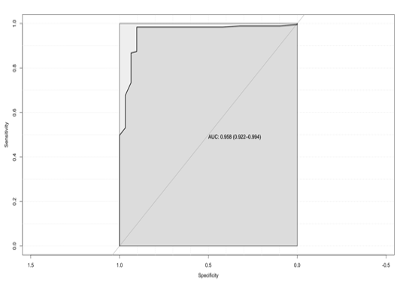 **а** 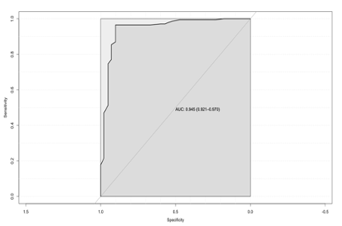 **б** 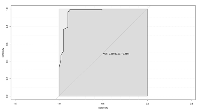 **в** 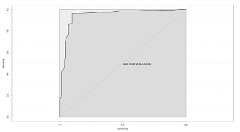 **г**

**Рисунок №419** **а**. ROC-кривая предсказательной модели для метода 2D-УЗИ, по данным полученным в группе A. **б**. ROC-кривая предсказательной модели для метода 2D-УЗИ, по данным полученным в группе B. **в**. ROC-кривая предсказательной модели для метода 3D-УЗИ, по данным полученным в группе B. **г**. ROC-кривая предсказательной модели для метода 2D-УЗИ, по данным полученным в выборке пациенток 40 лет и старше.

**Таблица №21**

Определение площади под кривой представленных предсказательных моделей метода в группах C и D.

## 4.5 Клинические примеры

**Клинический случай №2**

Пациентка Д., 62 года. Уплотнение в левой молочной железе. Анамнез не отягощен.

В левой молочной железе ВНК пальпируется зона уплотнения без четких контуров, по структуре схожее с железистой тканью размером 2,5 х 2,0 см.

Рентгеновская маммография представлена на рисунке №20.


**Рисунок №20.** Цифровая маммография обеих молочных желез, а косая, б медиолатеральная проекция, в, г краниокаудальная проекция.

Рентгенологические признаки диффузного фиброаденоматоза молочных желез, в левой молочной железе образований - кисты? Локализованный аденоз? Тип С по ACR. MD BI-RADS 2, MS BI-RADS 3.

Автоматизированное 3D ультразвуковое сканирование молочных желез представлено на рисунке №21.

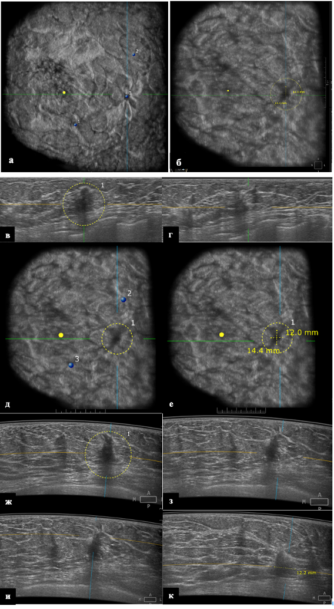

**Рисунок № 21.** Система 3D-УЗИ. Анализ 3D-данных на ультразвуковом аппарате.

При сканировании молочных желез в трех проекциях в наружных квадрантах выявлено три очаговых образований с симптомом ретракции. MD BI-RADS 2, MS BI-RADS 4С.

Ультразвуковое исследование представлено на рисунке №22.

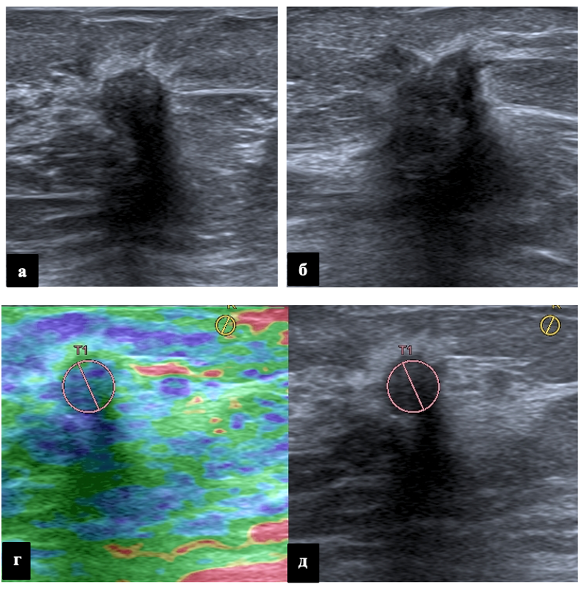

**Рисунок №22.** Эхограмма левой молочной железы: а - ВНК определяется образование неправильной формы; б - ВНК определяется гипоэхогенный участок нарушения архитектоники. в, г Эхограмма левой молочной железы. В режиме эластографии картируется эластотип N4-однотонный синий. Коэффициент деформации - 4,1.

Ультразвуковые признаки образований левой молочной железы в ВНК. Ультразвуковая оценка BI-RADS справа 2/слева 4В.

Рекомендовано МРТ молочных желез с контрастным усилением для оценки распространенности процесса, результаты исследований представлены на рисунке № 23


Рисунок №23. а, б. МРТ молочных желез с контрастным усилением.

Мультиочаговое поражение в ВНК левой молочной железе. MD BI-RADS 2, MS BI-RADS 5.

По результатам гистологического исследования инвазивный дольковый рак молочной железы, G2. Показано оперативное лечение.

## 4.6 Заключение

Согласно проведенному нами исследованию, диагностическая эффективность автоматизированного 3D-УЗИ молочных желез у пациенток 40 лет и старше сопоставима по показателю чувствительности и лучше по показателю точности, специфичности по сравнению с ультразвуковым исследованием в 2D режиме. Также нами выявлено, что методы 3D-УЗИ и 2D-УЗИ сопоставимы по определяемым размерам образований. Преимущества 3D ультразвукового исследования перед ММГ- выявление большего количества образований менее 1см, так же более четкое выявление мультиочаговых поражений. 3D ультразвуковое исследование предоставило дополнительную информацию о распространенности мультифокального и мультицентричного поражения молочных желез, включая визуализацию анатомии всего органа. Ограничения ММГ у пациенток с типом строения С и D по ACR могут быть дополнены 3D ультразвуковым исследованием, что повысит выявление злокачественных образований. Дополняя ММГ, 3D ультразвуковое исследование способствует выявлению некальцинированных карцином, скрытых плотной тканью молочной железы, тем не менее ММГ остается основным методом выявления поражений DCIS из-за ее превосходства в обнаружении кальцинатов. Учитывая возрастающую сложность обнаружения новообразований при плотной МЖ предлагаемый метод представляет большой интерес и является перспективным направлением развития систем скрининга рака МЖ.

# ГЛАВА 5. СРАВНЕНИЕ МЕТОДОВ 2D УЗИ И 3D УЗИ ПО ОТДЕЛЬНЫМ ПОКАЗАТЕЛЯМ

В настоящей главе проведено сравнение по отдельным показателям насколько изучаемые методы сопоставимы. Сравнение проводилось внутри групп B и D, так как именно в этих группах проводились оба изучаемых метода УЗ-диагностики.

В настоящем исследовании мы решили изучить вопрос возможности обнаружения кальцинатов методами 2D УЗИ в режиме MicroPure и автоматизированного объемного сканирования МЖ (ЗD УЗИ). Обнаружение кальцинатов представленными методами может позволить проводить биопсию без использования стереотаксического наведения, что может положительно повлиять на маршрутизацию пациента и снизить расходы здравоохранения.

## 5.1 Сравнение методов 2D УЗИ и 3D УЗИ внутри группе B

*Края образования*

По результатам 2D УЗИ края образования были ровные в 78.41% (178/227), волнистые в 8.37% (19/227), звездчатые в 5.29% (12/227), неровные в 5.29% (12/227) и полициклические в 2.64% (6/227). По результатам 3D УЗИ края были ровные в 80.62% (208/258), неровные в 14.34% (37/258), полициклические в 2.33% (6/258) и нарушение архитектоники в 2.71% (7/258). Статистически значимая разница между методами по показателю “Края образования” была обнаружена p-уровень \< 0,01.

*Размер образования*

Размер образования по результатам 2D УЗИ был выявлен 0,5-1,0 см в 34.8% (79/227), 1,1-1,5 см в 45.81% (104/227), 1,5-2,0 см в 8.37% (19/227), 2,1-2,5 см в 2.64% (6/227) и 2,5-3,0 см в 8.37% (19/227). По результатам 3D УЗИ размеры образования были следующие 0,5-1,0 см в 37.6% (97/258), 1,1-1,5 см в 40.7% (105/258), 1,5-2,0 см в 12.02% (31/258) и 2,5-3,0 см в 9.69% (25/258). Статистически значимая разница между методами по показателю “Размер образования” не была выявлена и p-уровень составил 0.14 (Таблица №22).

*Эхогенность образования*

По результатам 2D УЗИ гипоэхогенное образование было в 94.71% (215/227), изоэхогенное в 2.64% (6/227) и смешанная эхогенность в 2.64% (6/227). По результатам 3D УЗИ гипоэхогенное образование было в 97.67% (252/258) и смешанная эхогенность была в 2.33% (6/258). Статистически значимая разница между методами по показателю “Эхогенность образования” не была выявлена (p-уровень = 0.08) (Таблица №22).

*Структура образования*

По результатам 2D УЗИ структура образования была однородная в 75.77% (172/227) и неоднородная в 24.23% (55/227). По результатам 3D УЗИ однородная в 71.32% (184/258), неоднородная в 25.97% (67/258) и наличие внутрикистозных пристеночных разрастаний в 2.71% (7/258). Статистически значимая разница между методами по показателю “Структура образования” была выявлена p-уровень = 0.03 (Таблица №22).

*Количество узлов*

По результатам 2D УЗИ был выявлен один узел в 72.69% (165/227), два в 11.01% (25/227), три в 5.29% (12/227). и множественные в 11.01% (25/227).

По результатам 3D УЗИ один узел был выявлен в 75.97% (196/258), два в 9.69% (25/258), три в 4.65% (12/258) и множественные узлы в 9.69% (25/258). Статистически значимая разница между методами по показателю “Количество узлов” не была выявлена (p-уровень = 0.86) (Таблица №22).

*Кальцинаты*

Оба метода позволили опрделить кальцинаты в 4.64% (12/227). Статистически значимая разница между методами по показателю “Кальцинаты” не было выявлено (p-уровень = 0.1) (Таблица №22).

*Поставленный диагноз*

По результатам 2D УЗИ был поставлен диагноз “локализованный фиброаденоматоз” в 0.88% (2/227), “мультицентричный рак” в 7.93% (18/227), “мультфококальный рак” в 1.32% (3/227), “образование Ca” в 10.13% (23/227), “фиброаденома единичная” в 59.03% (134/227) и “фиброаденомы множествненные” в 20.7% (47/227) (Таблица №23).

По результатам 3D УЗИ без патологии было 2.33% (6/258). Были поставлены следующие диагнозы: “мультицентричный рак” в 5.04% (13/258), “образование Ca” в 6.59% (17/258), “сложная киста” в 0.78% (2/258), “фиброаденома единичная” в 56.2% (145/258), “фиброаденомы множествненные” в 18.6% (48/258), “фиброзно-кистозная мастопатия” в 2.71% (7/258), “мультифокальный рак” в 5.43% (14/258) и “склерозирующий аденоз” в 2.33% (6/258). Статистически значимая разница между методами по показателю “Поставленный диагноз” была выявлена (p-уровень \<0.01) (Таблица №22).

*Категория BIRADS*

По результатам 2D УЗИ категория Birads 1 в 3.08% (7/227), Birads 2 в 32.6% (74/227), Birads 3 в 45.81% (104/227), Birads 4b в 5.29% (12/227), Birads 4а в 10.57% (24/227) и Birads 5 в 2.64% (6/227). По результатам 3D УЗИ категория Birads 1 была в 6.59% (17/258), Birads 2 в 36.82% (95/258), Birads 3 в 42.64% (110/258), Birads 4b в 2.33% (6/258), Birads 4а в 4.65% (12/258) и Birads 5 в 6.98% (18/258). Статистически значимая разница между методами по показателю “Категория BIRADS” была выявлена (p-уровень 0.01) (Таблица №22).

Таблица №22.

Сравнение методов 2D УЗИ и 3D УЗИ по показателю “Края образования”, “Размер образования”, “Эхогенность образования”, “Структура образования”, “Количество узлов”, “Кальцинаты”, “Категория BIRADS” в группе B.

+--------------------------------------------------+----------------------+-----------------+---------------------+-----------------+---------------+
| Показатель                                       | Процентная доля      | 95% ДИ          | Процентная доля     | 95% ДИ          | p-уровень     |
+--------------------------------------------------+----------------------+-----------------+---------------------+-----------------+---------------+
| Группы                                           | 2D УЗИ               | 3D УЗИ          |                     |                 |               |
+--------------------------------------------------+----------------------+-----------------+---------------------+-----------------+---------------+
| *Края образования*                               |                      |                 |                     |                 |               |
+--------------------------------------------------+----------------------+-----------------+---------------------+-----------------+---------------+
| волнистые                                        | 8.37% (19/227)       | [0.05;0.13]     | **0% (0/258)**      | **[0;0.02]**    | **\*\< 0,01** |
+--------------------------------------------------+----------------------+-----------------+---------------------+-----------------+---------------+
| звездчатые                                       | 5.286% (12/227)      | [0.03;0.09]     | **0% (0/258)**      | **[0;0.02]**    |               |
+--------------------------------------------------+----------------------+-----------------+---------------------+-----------------+---------------+
| неровные                                         | 5.286% (12/227)      | [0.03;0.09]     | 14.341% (37/258)    | [0.1;0.19]      |               |
+--------------------------------------------------+----------------------+-----------------+---------------------+-----------------+---------------+
| полициклические                                  | 2.643% (6/227)       | [0.01;0.06]     | 2.326% (6/258)      | [0.01;0.05]     |               |
+--------------------------------------------------+----------------------+-----------------+---------------------+-----------------+---------------+
| ровные                                           | 78.414% (178/227)    | [0.72;0.83]     | 80.62% (208/258)    | [0.75;0.85]     |               |
+--------------------------------------------------+----------------------+-----------------+---------------------+-----------------+---------------+
| нарушение архитектоники                          | *0% (0/227)*         | *[0;0.02]*      | 2.713% (7/258)      | [0.01;0.06]     |               |
+--------------------------------------------------+----------------------+-----------------+---------------------+-----------------+---------------+
| Размер образования                               |                      |                 |                     |                 |               |
+--------------------------------------------------+----------------------+-----------------+---------------------+-----------------+---------------+
| 0,5-1,0 см                                       | 34.802% (79/227)     | [0.29;0.41]     | 37.597% (97/258)    | [0.32;0.44]     | 0.14          |
+--------------------------------------------------+----------------------+-----------------+---------------------+-----------------+---------------+
| 1,1-1,5 см                                       | 45.815% (104/227)    | [0.39;0.53]     | 40.698% (105/258)   | [0.35;0.47]     |               |
+--------------------------------------------------+----------------------+-----------------+---------------------+-----------------+---------------+
| 1,5-2,0 см                                       | 8.37% (19/227)       | [0.05;0.13]     | 12.016% (31/258)    | [0.08;0.17]     |               |
+--------------------------------------------------+----------------------+-----------------+---------------------+-----------------+---------------+
| 2,1-2,5 см                                       | 2.643% (6/227)       | [0.01;0.06]     | *0% (0/258)*        | *[0;0.02]*      |               |
+--------------------------------------------------+----------------------+-----------------+---------------------+-----------------+---------------+
| 2,5-3,0 см                                       | 8.37% (19/227)       | [0.05;0.13]     | 9.69% (25/258)      | [0.06;0.14]     |               |
+--------------------------------------------------+----------------------+-----------------+---------------------+-----------------+---------------+
| *Эхогенность образования*                        |                      |                 |                     |                 |               |
+--------------------------------------------------+----------------------+-----------------+---------------------+-----------------+---------------+
| гипоэхогенное                                    | 94.714% (215/227)    | [0.91;0.97]     | 97.674% (252/258)   | [0.95;0.99]     | 0.08          |
+--------------------------------------------------+----------------------+-----------------+---------------------+-----------------+---------------+
| изоэхогенное                                     | 2.643% (6/227)       | [0.01;0.06]     | *0% (0/258)*        | *[0;0.02]*      |               |
+--------------------------------------------------+----------------------+-----------------+---------------------+-----------------+---------------+
| смешанная                                        | 2.643% (6/227)       | [0.01;0.06]     | 2.326% (6/258)      | [0.01;0.05]     |               |
+--------------------------------------------------+----------------------+-----------------+---------------------+-----------------+---------------+
| *Структура образования*                          |                      |                 |                     |                 |               |
+--------------------------------------------------+----------------------+-----------------+---------------------+-----------------+---------------+
| наличие внутрикистозных пристеночных разрастаний | **0% (0/227)**       | **[0;0.02]**    | 2.713% (7/258)      | [0.01;0.06]     | **\*0.03**    |
+--------------------------------------------------+----------------------+-----------------+---------------------+-----------------+---------------+
| неоднородная                                     | 24.229% (55/227)     | [0.19;0.3]      | 25.969% (67/258)    | [0.21;0.32]     |               |
+--------------------------------------------------+----------------------+-----------------+---------------------+-----------------+---------------+
| однородная                                       | 75.771% (172/227)    | [0.7;0.81]      | 71.318% (184/258)   | [0.65;0.77]     |               |
+--------------------------------------------------+----------------------+-----------------+---------------------+-----------------+---------------+
| *Количество узлов*                               |                      |                 |                     |                 |               |
+--------------------------------------------------+----------------------+-----------------+---------------------+-----------------+---------------+
| один                                             | 72.687% (165/227)    | [0.66;0.78]     | 75.969% (196/258)   | [0.7;0.81]      | 0.86          |
+--------------------------------------------------+----------------------+-----------------+---------------------+-----------------+---------------+
| два                                              | 11.013% (25/227)     | [0.07;0.16]     | 9.69% (25/258)      | [0.06;0.14]     |               |
+--------------------------------------------------+----------------------+-----------------+---------------------+-----------------+---------------+
| три                                              | 5.286% (12/227)      | [0.03;0.09]     | 4.651% (12/258)     | [0.03;0.08]     |               |
+--------------------------------------------------+----------------------+-----------------+---------------------+-----------------+---------------+
| множественные                                    | 11.013% (25/227)     | [0.07;0.16]     | 9.69% (25/258)      | [0.06;0.14]     |               |
+--------------------------------------------------+----------------------+-----------------+---------------------+-----------------+---------------+
| *Кальцинаты*                                     |                      |                 |                     |                 |               |
+--------------------------------------------------+----------------------+-----------------+---------------------+-----------------+---------------+
| кальцинаты                                       | 4.64% (12/227)       | [0.01;0.06]     | 4.65% (12/258)      | [0.01;0.05]     | 1             |
+--------------------------------------------------+----------------------+-----------------+---------------------+-----------------+---------------+
| нет                                              | 95.35% (246/258)     | [0.91;0.97]     | 95.35% (246/258)    | [0.92;0.97]     |               |
+--------------------------------------------------+----------------------+-----------------+---------------------+-----------------+---------------+
| *Поставленный диагноз*                           |                      |                 |                     |                 |               |
+--------------------------------------------------+----------------------+-----------------+---------------------+-----------------+---------------+
| без патологии                                    | 0% (0/227)           | [0;0.02]        | 2.326% (6/258)      | [0.01;0.05]     | **\*\< 0,01** |
+--------------------------------------------------+----------------------+-----------------+---------------------+-----------------+---------------+
| локализованный фиброаденоматоз                   | 0.881% (2/227)       | [0;0.03]        | 0% (0/258)          | [0;0.02]        |               |
+--------------------------------------------------+----------------------+-----------------+---------------------+-----------------+---------------+
| мультицентричный рак                             | 7.93% (18/227)       | [0.05;0.12]     | 5.039% (13/258)     | [0.03;0.09]     |               |
+--------------------------------------------------+----------------------+-----------------+---------------------+-----------------+---------------+
| мультфококальный рак                             | 1.322% (3/227)       | [0;0.04]        | **0% (0/258)**      | **[0;0.02]**    |               |
+--------------------------------------------------+----------------------+-----------------+---------------------+-----------------+---------------+
| образование Ca                                   | 10.132% (23/227)     | [0.07;0.15]     | 6.589% (17/258)     | [0.04;0.11]     |               |
+--------------------------------------------------+----------------------+-----------------+---------------------+-----------------+---------------+
| сложная киста                                    | 0% (0/227)           | [0;0.02]        | 0.775% (2/258)      | [0;0.03]        |               |
+--------------------------------------------------+----------------------+-----------------+---------------------+-----------------+---------------+
| фиброаденома единичная                           | 59.031% (134/227)    | [0.52;0.65]     | 56.202% (145/258)   | [0.5;0.62]      |               |
+--------------------------------------------------+----------------------+-----------------+---------------------+-----------------+---------------+
| фиброаденомы множествненные                      | 20.705% (47/227)     | [0.16;0.27]     | 18.605% (48/258)    | [0.14;0.24]     |               |
+--------------------------------------------------+----------------------+-----------------+---------------------+-----------------+---------------+
| фиброзно-кистозная мастопатия                    | 0% (0/227)           | [0;0.02]        | 2.713% (7/258)      | [0.01;0.06]     |               |
+--------------------------------------------------+----------------------+-----------------+---------------------+-----------------+---------------+
| мультифокальный рак                              | **0% (0/227)**       | **[0;0.02]**    | 5.426% (14/258)     | [0.03;0.09]     |               |
+--------------------------------------------------+----------------------+-----------------+---------------------+-----------------+---------------+
| склерозирующий аденоз                            | 0% (0/227)           | [0;0.02]        | 2.326% (6/258)      | [0.01;0.05]     |               |
+--------------------------------------------------+----------------------+-----------------+---------------------+-----------------+---------------+
| *Категория BIRADS*                               |                      |                 |                     |                 |               |
+--------------------------------------------------+----------------------+-----------------+---------------------+-----------------+---------------+
| Birads 1                                         | 3.084% (7/227)       | [0.01;0.07]     | 6.589% (17/258)     | [0.04;0.11]     | **\*0,01**    |
+--------------------------------------------------+----------------------+-----------------+---------------------+-----------------+---------------+
| Birads 2                                         | 32.599% (74/227)     | [0.27;0.39]     | 36.822% (95/258)    | [0.31;0.43]     |               |
+--------------------------------------------------+----------------------+-----------------+---------------------+-----------------+---------------+
| Birads 3                                         | 45.815% (104/227)    | [0.39;0.53]     | 42.636% (110/258)   | [0.37;0.49]     |               |
+--------------------------------------------------+----------------------+-----------------+---------------------+-----------------+---------------+
| Birads 4b                                        | 5.286% (12/227)      | [0.03;0.09]     | 2.326% (6/258)      | [0.01;0.05]     |               |
+--------------------------------------------------+----------------------+-----------------+---------------------+-----------------+---------------+
| Birads 4а                                        | **10.573% (24/227)** | **[0.07;0.16]** | **4.651% (12/258)** | **[0.03;0.08]** |               |
+--------------------------------------------------+----------------------+-----------------+---------------------+-----------------+---------------+
| Birads 5                                         | 2.643% (6/227)       | [0.01;0.06]     | 6.977% (18/258)     | [0.04;0.11]     |               |
+--------------------------------------------------+----------------------+-----------------+---------------------+-----------------+---------------+

## 5.2 Сравнение методов 2D УЗИ и 3D УЗИ внутри группе D

*Края образования*

По результатам 2D УЗИ Края образования ровные в 41.22% (101/245), неровные в 35.1% (86/245), волнистые в 8.57% (21/245) и звездчатые в 15.1% (37/245). По результатам 3D УЗИ края образования были неровные в 46.77% (116/248), волнистые в 5.65% (14/248), звездчатые в 7.26% (18/248), полициклические в 2.82% (7/248), ровные в 31.45% (78/248) и нарушение архитектоники в 6.05% (15/248). Статистически значимая разница между методами по показателю “Края образования” была выявлена (p-уровень \<0.01) (Таблица №23).

*Размер образования*

По результатам 2D УЗИ размер образования был 0,5-1,0 см в 29.39% (72/245), 1,1-1,5 см в 28.98% (71/245), 1,5-2,0 см в 20% (49/245), 2,1-2,5 см в 9.39% (23/245), 2,5-3,0 см в 11.02% (27/245) и более 3 см в 1.22% (3/245). По результатам 3D УЗИ - 0,5-1,0 см в 27.02% (67/248), 1,1-1,5 см в 30.65% (76/248), 1,5-2,0 см в 22.58% (56/248), 2,1-2,5 см в 6.45% (16/248) , 2,5-3,0 см в 12.1% (30/248) и более 3 см в 1.21% (3/248).

Статистически значимая разница между методами по показателю “Размер образования” не было выявлено (p-уровень = 0.81) (Таблица №23).

*Эхогенность образования*

По результатам 2D УЗИ образование было гипоэхогенное в 94.29% (231/245), смешанная эхогенность в 4.49% (11/245) и анэхогенное в 1.22% (3/245). По результатам 3D УЗИ гипоэхогенное образование было в 95.56% (237/248), анэхогенное в 1.21% (3/248) и смешанная эхогенность в 3.23% (8/248). Статистически значимая разница между методами по показателю “Эхогенность образования” не была выявлена (p-уровень = 0.83) (Таблица №23).

*Структура образования*

По результатам 2D УЗИ структура образования неоднородная в 60% (147/245) и однородная в 40% (98/245), По результатам 3D УЗИ наличие внутрикистозных пристеночных разрастаний в 1.61% (4/248), неоднородная структура в 56.05% (139/248), однородная в 41.13% (102/248) и образование с кальцинатами в 1.21% (3/248).

Статистически значимая разница между методами по показателю “Структура образования” была сомнительная (p-уровень = 0.06) (Таблица №23).

*Количество узлов*

По результатам 2D УЗИ один узел выявлен в 83.67% (205/245), два в 12.24% (30/245), три в 1.22% (3/245) и множественные в 2.86% (7/245), По результатам 3D УЗИ один узел выявлен в 83.87% (208/248), два в 9.27% (23/248), три в 2.82% (7/248) и множественные в 4.03% (10/248). Статистически значимая разница между методами по показателю “Количество узлов” не была вывлена (p-уровень = 0.4) (Таблица №23).

*Кальцинаты*

По результатам 2D УЗИ в 12.67% (83/655) были обнаружены кальцинаты, а при 3D УЗИ в 12.21% (80/655). Статистически значимая разница между методами по показателю “Кальцинаты” не была выявлена (p-уровень = 0.87) (Таблица №23).

*Поставленный диагноз*

По результатам 2D УЗИ был поставлен диагноз “киста” в 1.22% (3/245), “локализованный фиброаденоматоз” в 6.12% (15/245) , “мультицентричный рак” в 6.94% (17/245), “мультфококальный рак”в 2.86% (7/245), “образование Ca” в 46.94% (115/245), “сложная киста” в 1.63% (4/245), “фиброаденома единичная” в 26.94% (66/245), “фиброаденомы множествненные” в 6.12% (15/245) и цистаденопапиллома в 1.22% (3/245), По результатам 3D УЗИ был аоставлен диагноз “диффузный фиброаденоматоз” в 1.61% (4/248), “киста” в 2.42% (6/248), “локализованный фиброаденоматоз” в 1.61% (4/248), “мультицентричный рак” в 2.82% (7/248), “образование Ca” в 44.76% (111/248), “фиброаденома единичная” в 29.44% (73/248), “фиброаденомы множествненные” в 6.05% (15/248) , “фиброзно-кистозная мастопатия” в 2.82% (7/248), “мультифокальный рак” в 2.82% (7/248) и “склерозирующий аденоз” в 5.65% (14/248) (Таблица №23).

Статистически значимая разница между методами по показателю “Поставленный диагноз” была выявлена (p-уровень \<0.01) (Таблица №23).

Таблица №23.

Сравнение методов 2D УЗИ и 3D УЗИ по показателю “Края образования”, “Размер образования”, “Эхогенность образования”, “Структура образования”, “Количество узлов”, “Кальцинаты”, “Категория BIRADS” в группе D.

+--------------------------------------------------+-------------------+-------------+-------------------+-------------+---------------+
| Показатель                                       | Процентная доля   | 95% ДИ      | Процентная доля   | 95% ДИ      | p-уровень     |
+--------------------------------------------------+-------------------+-------------+-------------------+-------------+---------------+
| Группы                                           | 2D УЗИ            | 3D УЗИ      |                   |             |               |
+--------------------------------------------------+-------------------+-------------+-------------------+-------------+---------------+
| *Края образования*                               |                   |             |                   |             |               |
+--------------------------------------------------+-------------------+-------------+-------------------+-------------+---------------+
| волнистые                                        | 8.571% (21/245)   | [0.06;0.13] | 5.645% (14/248)   | [0.03;0.09] | **\*\< 0.01** |
+--------------------------------------------------+-------------------+-------------+-------------------+-------------+---------------+
| звездчатые                                       | 15.102% (37/245)  | [0.11;0.2]  | 7.258% (18/248)   | [0.04;0.11] |               |
+--------------------------------------------------+-------------------+-------------+-------------------+-------------+---------------+
| неровные                                         | 35.102% (86/245)  | [0.29;0.41] | 46.774% (116/248) | [0.4;0.53]  |               |
+--------------------------------------------------+-------------------+-------------+-------------------+-------------+---------------+
| полициклические                                  | 0% (0/245)        | [0;0.02]    | 2.823% (7/248)    | [0.01;0.06] |               |
+--------------------------------------------------+-------------------+-------------+-------------------+-------------+---------------+
| ровные                                           | 41.224% (101/245) | [0.35;0.48] | 31.452% (78/248)  | [0.26;0.38] |               |
+--------------------------------------------------+-------------------+-------------+-------------------+-------------+---------------+
| нарушение архитектоники                          | 0% (0/245)        | [0;0.02]    | 6.048% (15/248)   | [0.04;0.1]  |               |
+--------------------------------------------------+-------------------+-------------+-------------------+-------------+---------------+
| Размер образования                               |                   |             |                   |             |               |
+--------------------------------------------------+-------------------+-------------+-------------------+-------------+---------------+
| 0,5-1,0 см                                       | 29.388% (72/245)  | [0.24;0.36] | 27.016% (67/248)  | [0.22;0.33] | 0.81          |
+--------------------------------------------------+-------------------+-------------+-------------------+-------------+---------------+
| 1,1-1,5 см                                       | 28.98% (71/245)   | [0.23;0.35] | 30.645% (76/248)  | [0.25;0.37] |               |
+--------------------------------------------------+-------------------+-------------+-------------------+-------------+---------------+
| 1,5-2,0 см                                       | 20% (49/245)      | [0.15;0.26] | 22.581% (56/248)  | [0.18;0.28] |               |
+--------------------------------------------------+-------------------+-------------+-------------------+-------------+---------------+
| 2,1-2,5 см                                       | 9.388% (23/245)   | [0.06;0.14] | 6.452% (16/248)   | [0.04;0.1]  |               |
+--------------------------------------------------+-------------------+-------------+-------------------+-------------+---------------+
| 2,5-3,0 см                                       | 11.02% (27/245)   | [0.08;0.16] | 12.097% (30/248)  | [0.08;0.17] |               |
+--------------------------------------------------+-------------------+-------------+-------------------+-------------+---------------+
| более 3 см                                       | 1.224% (3/245)    | [0;0.04]    | 1.21% (3/248)     | [0;0.04]    |               |
+--------------------------------------------------+-------------------+-------------+-------------------+-------------+---------------+
| Эхогенность образования                          |                   |             |                   |             |               |
+--------------------------------------------------+-------------------+-------------+-------------------+-------------+---------------+
| анэхогенное                                      | 1.224% (3/245)    | [0;0.04]    | 1.21% (3/248)     | [0;0.04]    | 0.83          |
+--------------------------------------------------+-------------------+-------------+-------------------+-------------+---------------+
| гипоэхогенное                                    | 94.286% (231/245) | [0.9;0.97]  | 95.565% (237/248) | [0.92;0.98] |               |
+--------------------------------------------------+-------------------+-------------+-------------------+-------------+---------------+
| смешанная                                        | 4.49% (11/245)    | [0.02;0.08] | 3.226% (8/248)    | [0.02;0.06] |               |
+--------------------------------------------------+-------------------+-------------+-------------------+-------------+---------------+
| *Структура образования*                          |                   |             |                   |             |               |
+--------------------------------------------------+-------------------+-------------+-------------------+-------------+---------------+
| наличие внутрикистозных пристеночных разрастаний | 0% (0/245)        | [0;0.02]    | 1.613% (4/248)    | [0.01;0.04] | 0.06          |
+--------------------------------------------------+-------------------+-------------+-------------------+-------------+---------------+
| неоднородная                                     | 60% (147/245)     | [0.54;0.66] | 56.048% (139/248) | [0.5;0.62]  |               |
+--------------------------------------------------+-------------------+-------------+-------------------+-------------+---------------+
| однородная                                       | 40% (98/245)      | [0.34;0.46] | 41.129% (102/248) | [0.35;0.48] |               |
+--------------------------------------------------+-------------------+-------------+-------------------+-------------+---------------+
| с жидкостным содержимым                          | 0% (0/245)        | [0;0.02]    | 0% (0/248)        | [0;0.02]    |               |
+--------------------------------------------------+-------------------+-------------+-------------------+-------------+---------------+
| с кальцинатами                                   | 0% (0/245)        | [0;0.02]    | 1.21% (3/248)     | [0;0.04]    |               |
+--------------------------------------------------+-------------------+-------------+-------------------+-------------+---------------+
| *Количество узлов*                               |                   |             |                   |             |               |
+--------------------------------------------------+-------------------+-------------+-------------------+-------------+---------------+
| один                                             | 83.673% (205/245) | [0.78;0.88] | 83.871% (208/248) | [0.79;0.88] | 0.4           |
+--------------------------------------------------+-------------------+-------------+-------------------+-------------+---------------+
| три                                              | 1.224% (3/245)    | [0;0.04]    | 2.823% (7/248)    | [0.01;0.06] |               |
+--------------------------------------------------+-------------------+-------------+-------------------+-------------+---------------+
| два                                              | 12.245% (30/245)  | [0.09;0.17] | 9.274% (23/248)   | [0.06;0.14] |               |
+--------------------------------------------------+-------------------+-------------+-------------------+-------------+---------------+
| множественные                                    | 2.857% (7/245)    | [0.01;0.06] | 4.032% (10/248)   | [0.02;0.08] |               |
+--------------------------------------------------+-------------------+-------------+-------------------+-------------+---------------+
| *Кальцинаты*                                     |                   |             |                   |             |               |
+--------------------------------------------------+-------------------+-------------+-------------------+-------------+---------------+
| макрокальцинаты                                  | 6.122% (15/245)   | [0.04;0.1]  | 4.839% (12/248)   | [0.03;0.09] | 0.87          |
+--------------------------------------------------+-------------------+-------------+-------------------+-------------+---------------+
| микрокальцинаты                                  | 12.653% (31/245)  | [0.09;0.18] | 13.71% (34/248)   | [0.1;0.19]  |               |
+--------------------------------------------------+-------------------+-------------+-------------------+-------------+---------------+
| нет                                              | 68.98% (169/245)  | [0.63;0.75] | 70.565% (175/248) | [0.64;0.76] |               |
+--------------------------------------------------+-------------------+-------------+-------------------+-------------+---------------+
| определяются                                     | 12.245% (30/245)  | [0.09;0.17] | 10.887% (27/248)  | [0.07;0.16] |               |
+--------------------------------------------------+-------------------+-------------+-------------------+-------------+---------------+
| *Поставленный диагноз*                           |                   |             |                   |             |               |
+--------------------------------------------------+-------------------+-------------+-------------------+-------------+---------------+
| диффузный фиброаденоматоз                        | 0% (0/245)        | [0;0.02]    | 1.613% (4/248)    | [0.01;0.04] | **\*\<0.01**  |
+--------------------------------------------------+-------------------+-------------+-------------------+-------------+---------------+
| киста                                            | 1.224% (3/245)    | [0;0.04]    | 2.419% (6/248)    | [0.01;0.05] |               |
+--------------------------------------------------+-------------------+-------------+-------------------+-------------+---------------+
| локализованный фиброаденоматоз                   | 6.122% (15/245)   | [0.04;0.1]  | 1.613% (4/248)    | [0.01;0.04] |               |
+--------------------------------------------------+-------------------+-------------+-------------------+-------------+---------------+
| мультицентричный рак                             | 6.939% (17/245)   | [0.04;0.11] | 2.823% (7/248)    | [0.01;0.06] |               |
+--------------------------------------------------+-------------------+-------------+-------------------+-------------+---------------+
| мультфококальный рак                             | 2.857% (7/245)    | [0.01;0.06] | 0% (0/248)        | [0;0.02]    |               |
+--------------------------------------------------+-------------------+-------------+-------------------+-------------+---------------+
| образование Ca                                   | 46.939% (115/245) | [0.41;0.53] | 44.758% (111/248) | [0.39;0.51] |               |
+--------------------------------------------------+-------------------+-------------+-------------------+-------------+---------------+
| сложная киста                                    | 1.633% (4/245)    | [0.01;0.04] | 0% (0/248)        | [0;0.02]    |               |
+--------------------------------------------------+-------------------+-------------+-------------------+-------------+---------------+
| фиброаденома единичная                           | 26.939% (66/245)  | [0.22;0.33] | 29.435% (73/248)  | [0.24;0.36] |               |
+--------------------------------------------------+-------------------+-------------+-------------------+-------------+---------------+
| фиброаденомы множествненные                      | 6.122% (15/245)   | [0.04;0.1]  | 6.048% (15/248)   | [0.04;0.1]  |               |
+--------------------------------------------------+-------------------+-------------+-------------------+-------------+---------------+
| фиброзно-кистозная мастопатия                    | 0% (0/245)        | [0;0.02]    | 2.823% (7/248)    | [0.01;0.06] |               |
+--------------------------------------------------+-------------------+-------------+-------------------+-------------+---------------+
| цистаденопапиллома                               | 1.224% (3/245)    | [0;0.04]    | 0% (0/248)        | [0;0.02]    |               |
+--------------------------------------------------+-------------------+-------------+-------------------+-------------+---------------+
| мультифокальный рак                              | 0% (0/245)        | [0;0.02]    | 2.823% (7/248)    | [0.01;0.06] |               |
+--------------------------------------------------+-------------------+-------------+-------------------+-------------+---------------+
| склерозирующий аденоз                            | 0% (0/245)        | [0;0.02]    | 5.645% (14/248)   | [0.03;0.09] |               |
+--------------------------------------------------+-------------------+-------------+-------------------+-------------+---------------+

## 5.3 Определение чувствительности, специфичности и точности методов для обнаружения кальцинатов в группе D с построением прогностической модели

В ходе настоящего исследовани я было проведено определние чувтсвительности, спецефичности и точности изучаемых методов для обнаружения кальцинатов в группе D. Основные результаты изложены в таблице №24.

Таблица №24.

Определение точности, P-уровня значимости модели, коэффициент Kappa, Тест Макнемара, чувствительности, специфичности, положительной прогностической ценности, отрицательной прогностической ценности и отбалансированной точности.

(Т -Точность, P - P-Value, КК - Коэффициент Kappa, ТМ -Тест Макнемара, Ч-Чувствительность, Сп -Специфичность, ППЦ - положительная прогностическая ценность, ОПЦ - отрицательная прогностическая ценность, ОТ- Отбалансированная точность)

|              |                           |     |      |     |      |      |      |      |      |
|--------|--------|--------|--------|--------|--------|--------|--------|--------|--------|
| Метод        | Т                         | P   | КК   | ТМ  | Ч    | Сп   | ППЦ  | ОПЦ  | ОТ   |
| *Кальцинаты* |                           |     |      |     |      |      |      |      |      |
| 2D УЗИ       | 0.84 [95% ДИ: 0.81, 0.87] | 0   | 0.47 | 0   | 0.44 | 0.96 | 0.78 | 0.85 | 0.7  |
| 3D УЗИ       | 0.84 [95% ДИ: 0.81, 0.87] | 0   | 0.45 | 0   | 0.42 | 0.96 | 0.77 | 0.85 | 0.69 |

На основании полученных данных, пыла построена предсказательная модель нахождения кальцинатов для изучаемых методов (Таблица№25, Рисунок №24).

**Рисунок №24.** ROC-кривая предсказательной модели нахождения кальцинатов для метода 2D УЗИ (А) и 3D УЗИ (Б).

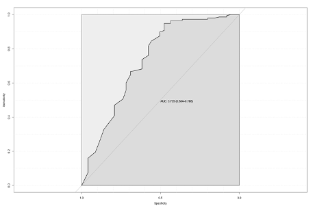 **а**  **б**

**Таблица №25.**

Определение площади под кривой представленных предсказательных моделей метода.

|              |                             |
|--------------|-----------------------------|
| **Метод**    | **Площадь под кривой**      |
| *Кальцинаты* |                             |
| 2D УЗИ       | 0.735 95% ДИ: 0.684 - 0.786 |
| 3D УЗИ       | 0.722 95% ДИ: 0.671 - 0.774 |

Исходя из полученных данных, был проведен расчет сколько было, верно, найденных кальцинатов, изучаемыми методами.

С помощью 2D УЗИ 44% кальцинатов были обнаружены, верно, в то время как с помощью 3D УЗИ кальцинаты были верно обнаружены 42%.

При этом с помощью изучаемых методов были обнаружены до 4% кальцинатов там, где их в действительности нет.

## 5.4 Клинические примеры

**Клинический пример №4** Пациентка Н. 55 лет без жалоб, обратилась планово. На рисунке № 4а можно увидеть визуализацию внутрипротоковых кальцинатов в режиме Micro Pure 2D УЗИ. На рисунке 4б на маммографии определяются плеоморфные кальцинаты, расположенные диффузно в наружных квадрантах правой молочной железы, заподозрена Са in situ. Учитывая визуализацию кальцинатов на ультразвуковом исследовании в режиме Micro pure выполнена CORE-биопсия по УЗ-наведением, морфологически верифицирована Са in situ, G2.

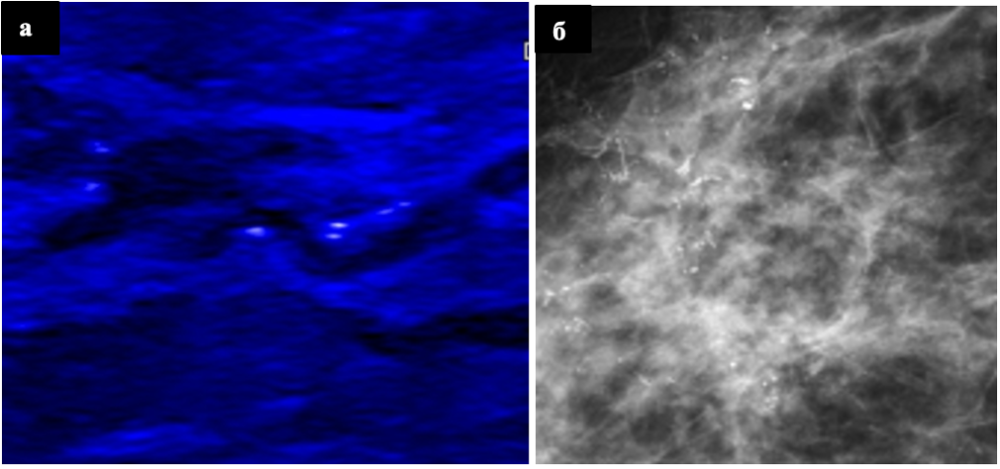

**Рисунок №25. а.** Визуализация внутрипротоковых кальцинатов у пациентки 55 лет в режиме Micro Pure – гистологически верифицированный протоковый рак in situ G2- биопсия выполнена под ультразвуковым наведением б. Визуализация кальцинатов на маммографии.

**Клинический пример №5.** Пациентка М., 41 год. Обратилась с жалобами на уплотнение в левой МЖ. Была выполнена ММГ, по результатам которой выявлены диффузно расположенный плеоморфные кальцинаты. Тип строения D по ACR. Узловые образования не определяются. Ca in situ? (Рисунок 5.б). Пациентка направлена на 2D УЗИ для оценки образований. По результатам исследования выявлены множественные узловые образования в верхневнутреннем, верхненаружном, нижневнутреннем квадрантах (Рисунок 5.а). Пациентка направлена на 3D УЗИ -для более четкой оценки мультиочагового процесса. Образования визуализированы, так же визуализированы кальцинаты. Выполнена CORE-биопсия под УЗ-наведением, по результатам которой выявлен инвазивный рак на фоне протокового G3.


**Рисунок № 26.** **а.** Визуализация кальцинатов у пациентки 41 года на 3D УЗИ гистологически верифицированный инвазивный рак неспециального типа G3. **б.** Визуализация кальцинатов на маммографии.

## 5.5 Заключение

Настоящее исследование является моноцентровым. Центр, в котором проводилось исследование имеет специфику работы с пациентами представленного профиля и оценить возможности метода в других много профильных центрах еще придется.

По результатам проведенного нами сравнительного анализа диагностической эффективности обнаружения кальцинатов с помощью 2D УЗИ в режиме Micro Pure и автоматизированного 3D УЗИ у женщин в возрастной группе 40 лет и старше лет с неоднородной и высокой плотностью тканей МЖ представленные методы показали сопоставимую эффективность. В 44% c помощью 2D УЗИ и в 42% c помощью 3D УЗИ можно, верно, обнаружить кальцинаты, что позволяет провести CORE-биопсию под УЗ- наведением, и не использовать технически более сложное стереотаксическое наведение. Ложноположительные результаты не превышают 4% случаев при использовании 2D и 3D УЗИ.

# ГЛАВА 6. ОПРЕДЕЛНИЕ ИСПОЛЬЗОВАНИЯ 3D УЗИ В СТРУКТУРЕ РАННЕЙ ДИАГНОСТИКИ НОВОБРАЗОВАНИЙ МОЛОЧНОЙ ЖЕЛЕЗЫ

Определение места 3D УЗИ в структуре ранней диагностики новообразований молочных желез требовало решения следующих вопросов: 1) определение временной эффективности для увеличения количества пациентов на единицу времени и 2) выявление наиболее значимых факторов, которые указывают на то, что ожидается малая вероятность нахождения образования, требующего core-биопсию, чтобы переопределить маршрутизацию пациента на скрининг с использованием 3D УЗИ. Данное требование продиктовано тем, что только при 2D УЗИ можно выполнить core-биопсию образования.

## 6.1 Оценка методов по временной характеристике и зависимость от специалиста

В настоящем исследовании было принято решение учесть фактор опытности специалиста, выполняющего УЗ исследование. В исследовании участвовали 2 специалиста с опытом более 10 лет и специалист с опытом 3 года на момент настоящего исследования. Более опытный специалист выполнил 1750 исследований из них 771 исследований в выборке пациенток 40 лет и старше и 979 исследований в выборке пациенток моложе 40 лет. Специалист с опытом 3 года выполнил 1044 исследований из них 512 исследований в выборке пациенток 40 лет и старше и 532 исследований в выборке пациенток моложе 40 лет. Медиана времени выполнения 2D УЗИ у опытного специалиста составила 28 [Q1-Q3: 24;33] мин, такая же была у специалиста с опытом 3 года составил 30.969.22 [Q1-Q3: 23;36] мин. Разница между группами по времени выполнения составила p-уровень \<0.01. Это свидетельствует о том, что менее опытный специалист может тратить больше времени на исследование (Рисунок №27).


Рисунок №27. Скорость выполнения исследования разными специалистами

Разница между группами по времени выполнения составила p-уровень = 0.46. Полученный результат говорит о том, что различные группы не влияют на скорость выполнения протокола 2D УЗИ у обоих специалистов (Рисунок №28 а, б).

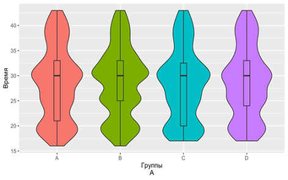 **а** 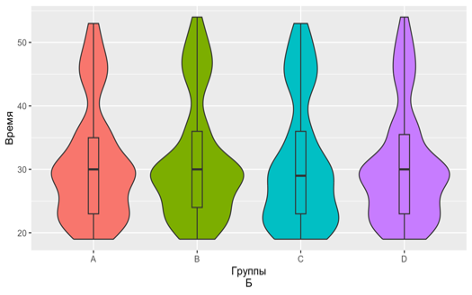 **б**

**Рисунок № 28. а** - Распределение длительности выполнения исследования 2D УЗИ по группами, исследования выполнял специалист с опытом более 10 лет, **б**- Распределение длительности выполнения исследования 2D УЗИ по группами, исследования выполнял специалист с опытом 3 года.

Далее следует привести данные временных характеристик по изучаемым методам ранней диагностики рака молочной железы. Медиана времени выполнения 2D УЗИ по всей выборке составил 30 [Q1-Q3: 23;34] мин, однако медиана время выполнения 3D УЗИ по всей выборке составил 15 [Q1-Q3: 12;18] мин.

Разница между группами по времени выполнения составила p-уровень \<0.01.

Такая статистическая разница отражает очевидную разницу в скорости выполнения исследований отражены на рисунке 29.

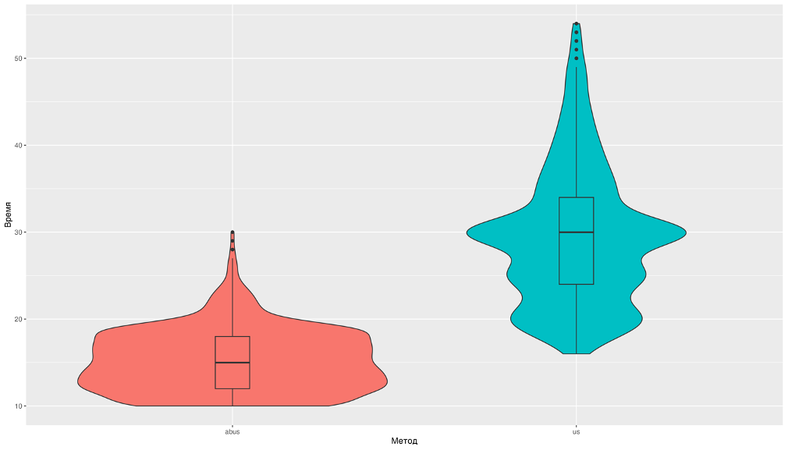

**Рисунок 6.3.** Разность скорости выполнения между методами

Следует сказать, что выявленная разница по времени между методами, а также зависимость УЗ исследования от специалиста показывает то, что система 3D УЗИ имеет конкурентные преимущества при ранней диагностике рака молочной железы по временной характеристике. Однако стоит сказать, что при выполнении 3D УЗИ исследования нельзя выполнить пункцию для проведения гистологического исследования и требуется выполнение 2D УЗИ исследования и проведения пункции под навигацией. Следовательно, 3D УЗИ исследование может позволить облегчить рутинное выполнение 2D УЗИ исследования в тех случаях, где обнаружение образования, требующего пункцию маловероятно. Для этого было выполнено определение наиболее значимых факторов для обоснования использования 3D УЗИ в рутинной практике.

## 6.2 Определение наиболее значимых факторов и алгоритма оптимизации использования 3D УЗИ

**6.2.1 Оценка преддиагностических факторов в выборке пациенток до 40 лет**

Для определения наиболее значимых преддиагностических факторов производился подбор предиктороной модели с наиболее значимыми факторам. Данные представлены в таблице №26 в порядке убывании я значимости фактора.

**Таблица №26.**

Значимые факторы риска определения РМЖ у пациенток в возрасте моложе 40 лет

+----------------------------------------------+------------------------+
| Фактор                                       | Коэффициент значимости |
+==============================================+========================+
| Наследственная предрасположенность           | 2,92                   |
+----------------------------------------------+------------------------+
| первичный диагноз: диффузный фиброаденоматоз | 1,82                   |
+----------------------------------------------+------------------------+
| репродуктивный статус: пременопауза          | 1,6                    |
+----------------------------------------------+------------------------+
| жалоба на уплотнение                         | 0,86                   |
+----------------------------------------------+------------------------+
| возраст пациента                             | 0,05                   |
+----------------------------------------------+------------------------+

Были рассчитаны предиктивные коэффициенты на основании представленной модели и построек график ROC- кривой качества модели (Рисунок 30.а). Площадь под кривой составила 0.9991 Также были рассчитаны показатели точности, специфичности и чувствительности модели с определением коэффициента отсечения (Рисунок 30.б). в представленной модели коэффициент отсечения был 0.918 По высчитанному коэффициенту отсечения был составлен прогноз рекомендаций к скринингу.

 **a** 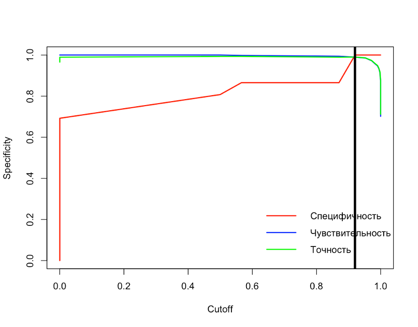 **б**

**Рисунок 1. а.** ROC- кривая предикторной модели определения показаний к 2D УЗИ для скрининга у пациенток в выборке до 40 лет; **б.** Показатели точности, специфичности и чувствительности модели с определением коэффициента отсечения в выборке до 40 лет.

На основании данных, полученных в нашем исследовании скрининг с 2D УЗИ в выборке моложе 40 лет не показан в 4.04% (61/1511) и в 95.96% (1450/1511) его можно использовать.

Представленная модель в выборке моложе 40 лет сработала корректно в 99.21% (1499/1511) и в 0.79% (12/1511) предсказание можно отнести к неверному, а именно ложноположительные результаты.

**6.2.2 Оценка преддиагностических факторов и факторов ММГ в выборке пациенток 40 лет и старше**

Для определения наиболее значимых преддиагностических факторов производился подбор предиктороной модели с значимыми факторами. Данные представлены в таблице №27 в порядке убывания значимости фактора.

**Таблица №27.**

Значимые факторы риска определения РМЖ у пациенток в возрасте 40 лет и старше

+---------------------------------------------------+------------------------+
| Фактор                                            | Коэффициент значимости |
+===================================================+========================+
| края образования на ММГ: нечеткие                 | 5,02                   |
+---------------------------------------------------+------------------------+
| первичный диагноз: Локализованный фиброаденоматоз | 3,17                   |
+---------------------------------------------------+------------------------+
| жалоба на уплотнение                              | 3,01                   |
+---------------------------------------------------+------------------------+
| характеристика узла на ММГ: фокус уплотнения      | 2,25                   |
+---------------------------------------------------+------------------------+
| фон на ММГ: железистая ткань                      | 2,18                   |
+---------------------------------------------------+------------------------+
| наследственная предрасположенность                | 1,75                   |
+---------------------------------------------------+------------------------+
| репродуктивный статус: менопауза более 5 лет      | 1,25                   |
+---------------------------------------------------+------------------------+
| гормональная терапия                              | 1,19                   |
+---------------------------------------------------+------------------------+
| возраст пациента                                  | 0,06                   |
+---------------------------------------------------+------------------------+

Были рассчитаны предикторные коэффициенты на основании представленной модели и построек график ROC- кривой качества модели (Рисунок №31.a). Площадь под кривой составила 0.9983 Также были рассчитаны показатели точности, специфичности и чувствительности модели с определением коэффициента отсечения (Рисунок №31.б). в представленной модели коэффициент отсечения был 0.935 По высчитанному коэффициенту отсечения был составлен прогноз рекомендаций к скринингу.

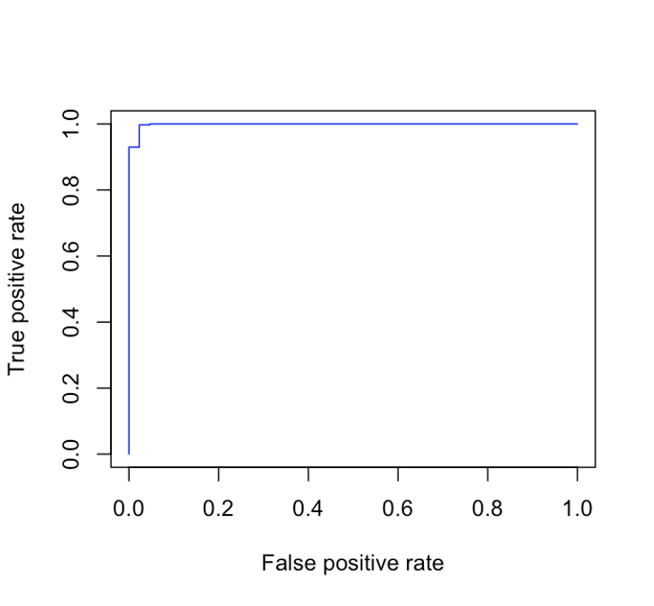 **a** 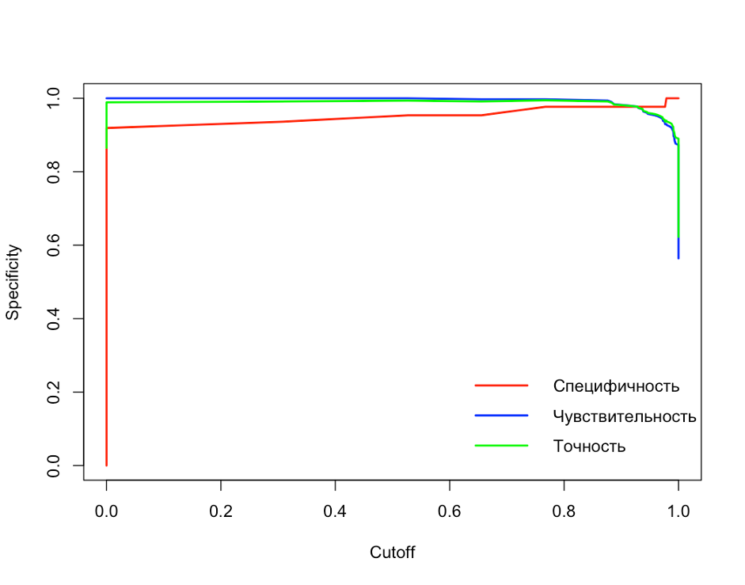 **б**

**Рисунок 31.а.** ROC- кривая предикторной модели определения показаний к 2D УЗИ для скрининга у пациенток в выборке 40 лет и старше; **б.** Показатели точности, специфичности и чувствительности модели с определением коэффициента отсечения в выборке 40 лет и старше

На основании данных, полученных в нашем исследовании скрининг с 2D УЗИ в выборке 40 лет и старше показан в 84.26% (1081/1283) и не показан в 15.74% (202/1283),

Представленная модель в выборке 40 лет и старше сработала корректно в 97.12% (1246/1283) и в 2.88% (37/1283) нет. Среди 37 случаев неверного предсказания было 4 случая ложноотрицательных результата, и эти пациенты направлены на повторное исследование к специалисту 2D УЗИ для проведения CORE-биопсии. 33 случая квалифицированы как ложноположительные.

*Алгоритм оптимизации использования 2D УЗИ*

Исходя из данных, полученных в настоящем исследовании, предлагается следующий алгоритм оптимизации использования системы 3D УЗИ.

Пациентки маршрутизируются по возрасту моложе 40 лет и старше 40 лет, так как маммография остается золотым стандартом скрининга РМЖ, но маммография имеет меньшую чувствительность при выявлении РМЖ у женщин с плотной МЖ, особенно если речь идет о пациентках моложе 40 лет.

Пациентка моложе 40 лет может быть направлена на исследование 3D УЗИ при отсутствии следующих предикторных факторов: пременопауза, жалоба на уплотнение, наследственная предрасположенность к РМЖ. При обнаружении указанных предикторных факторов пациентку рекомендовано направить на 2D УЗИ. По результатам выставляется категория по классификации BI-RADS, в зависимости от которой проводят дальнейшие действия.

В выборке пациенток 40 лет и старше при отсутствии предикторных факторов выполняется 3D УЗИ. Предикторными факторами для выполнения 2D УЗИ служат нечеткие края образования на ММГ, локализованный фиброаденоматоз в первичном диагнозе, жалоба на уплотнение, характеристика узла на ММГ: фокус уплотнения, железистая ткань, как фон на ММГ, наследственная предрасположенность, менопауза более 5 лет, наличие гормональной терапии и возраст пациента.

Исходя из вышеизложенного, предлагается следующий алгоритм диагностики РМЖ с использованием 3DУЗИ (Рисунок №32).

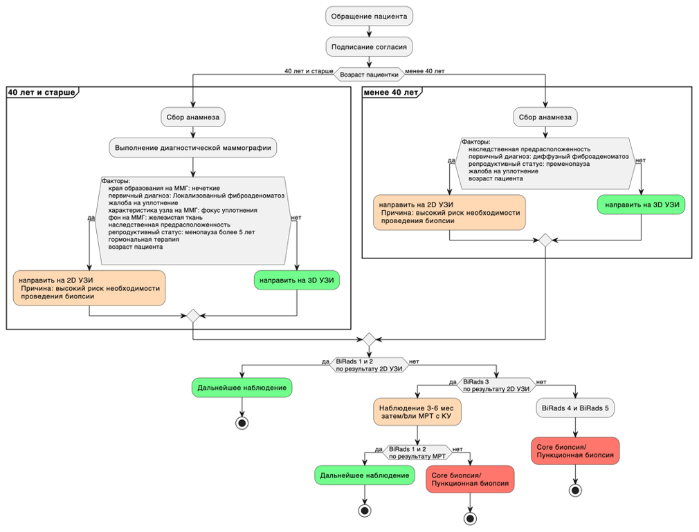

**Рисунок 32.** Алгоритм оптимизации использования 3D УЗИ

## 6.3 Анализ полученных результатов

В настоящей главе представлены результаты, завершающие текущее исследование. Было проведен сравнительный анализ временных характеристик в зависимости от опыта специалиста, а также между изучаемыми методами. Подтверждены ожидаемые результаты о том, что метод 2D УЗИ зависит от специалиста и вне зависимости от опыта специалиста выполнение 3D УЗИ быстрее. Однако перед исследователями стояла задача определить место 3D УЗИ в существующей системе скрининга ранней диагностики новообразований молочной железы с целью выявления злокачественного новообразования. Был проведен монофакториальный анализ, по которым можно предположить, что ожидается определение категории BIRADS4 или BIRADS5 после проведения УЗ-диагностики. Эти категории пациентов необходимо направлять к специалисту для выполнения 2D УЗИ, так как предполагается проведение трепан биопсии под УЗ-наведением или стереотаксическим наведением с последующей морфологической и при необходимости иммуногистохимической верификацией. На основании логистической регрессии, основанной на преддиагностических данных, а именно данные жалоб, анамнеза, осмотра и результатов ММГ. Такие факторы были выявлены для категории пациенток моложе 40 лет и 40 лет и старше. Потенциальным преимуществом предлагаемого рекомендательного алгоритма является то, что пациенток с предполагаемой низкой вероятностью того, что будет требоваться биопсия, можно направлять на 3D УЗИ. Такой подход может снизить нагрузку на врачей УЗ-диагностики и сконцентрировать их внимание на фокусной группе предполагаемо требующих внимания специалиста. Учитывая выявленный временной фактор, то можно провести больше исследований на единицу времени. Результаты, изложенные в настоящей главе, свидетельствую о решении шестой и завершающей задачи диссертационного исследования. Можно с уверенностью сказать, что 3D УЗИ не уступает по своим возможностям традиционному методу 2D УЗИ в ранней диагностике новообразований молочной железы как у пациенток моложе 40 лет, так у пациенток 40 лет и старше. Метод диагностики 3D УЗИ является не замещающим, а дополняющим традиционную 2D УЗИ диагностику в структуре ранней диагностики.

# ЗАКЛЮЧЕНИЕ

Целью настоящего диссертационного исследования было повышение эффективности выявления образований молочных желех методом автоматизированного объемного ультразвукового сканирования. Для достижения этой цели было выбрано изучение автоматизированного объемного ультразвукового сканирования молочных желез (3D УЗИ). По результатам изучения профильных научных публикаций было выявлено, что метод имеет потенциальные преимущества, которые требуют уточнения.

Первой задачей было провести сравнительный анализ диагностической эффективности (чувствительности, специфичности и точности,) ультразвукового исследования в B- режиме и автоматизированного объемного сканирования молочных желез (3D УЗИ), и комбинации этих методик у женщин в возрастной группе 30-39 лет с высокой плотностью тканей молочной железы. Для этого было проведено ретро-проспективное клиническое одноцентровое исследование. С февраля 2019 по май 2023 года было исследовано 1511 пациенток с возрастом моложе 40 лет. Пациентки были разделены на две группы. Пациентки, попавшие в группу А, проходили 2D УЗИ, результаты исследования оценивались по классификации BI-RADS. Пациентки, попавшие в группу B в дополнение к 2D ультразвуковому исследованию, проходили 3D УЗИ, также с выставлением категории BI-RADS. По итогам исследования определялись положительная и отрицательная прогностическая ценность чувствительность, специфичность и точность, а также составление предсказательной модели метода. Метод УЗИ в группе А показал чувствительность 0.8, специфичность 1 и отбалансированную точность 0.9, УЗИ в группе B 0.89, 0.98 и 0.94 соответственно, УЗИ по всей выборке 0.87, 0.99 и 0.93 соответственно. Метод 3D УЗИ в группе B показал чувствительность 0.95, специфичность 0.99 и отбалансированную точность 0.97. Диагностическая эффективность автоматизированного УЗИ молочных желез у пациенток моложе 40 лет сопоставима по показателю специфичности и лучше по показателю точности, чувствительности и обладает более высокой прогностической ценностью по сравнению с ультразвуковым исследованием в 2D режиме. Метод 3D УЗИ имеет следующие преимущества в сравнении с 2D ультразвуковым исследованием, а именно – воспроизводимость, оператор независимость, сокращенное время проведения исследования, получение визуализации всего органа, улучшенная визуализация при мультицентричных и мультифокальных процессах, возможность оперативного планирования, возможность «двойного чтения» результатов.

Второй задачей было провести сравнительный анализ диагностической эффективности (чувствительности, специфичности и точности,) цифровой маммографии, ультразвукового исследования в B-режиме и автоматизированного объемного сканирования молочных желез (3D УЗИ), и комбинации этих методик у женщин в возрастной группе 40-69 лет с высокой плотностью тканей молочной железы. Для этого было проведено ретро-проспективное клиническое одноцентровое исследование. С февраля 2019 по май 2023 года было исследовано 1283 пациенток с 40 лет и старше. Пациентки были разделены на две группы. Пациентки, попавшие в группу А, проходили 2D-УЗИ и маммографию, результаты исследования оценивались по классификации BIRADS. Пациентки, попавшие в группу B в дополнение к 2D ультразвуковому исследованию и маммографии, проходили 3D-УЗИ, также с выставлением категории BIRADS. По итогам исследования определялись положительная и отрицательная прогностическая ценность, чувствительность, специфичность и точность метода, а также составление предсказательной модели метода.

Метод ММГ показал ППЦ 0.89, ОПЦ 0.93, чувствительность 0.53, специфичность 0.99, отбалансированную точность 0.76. Метод 2D-УЗИ показал ППЦ 0.8, ОПЦ 0.98, чувствительность 0.9, специфичность 0.97 и отбалансированную точность 0.93. 3D-УЗИ показал ППЦ 0.97, ОПЦ 0.97, чувствительность 0.9, специфичность 0.99 и отбалансированную точность 0.94. Согласно проведенному нами исследованию, диагностическая эффективность автоматизированного 3D-УЗИ молочных желез у пациенток 40 лет и старше сопоставима по показателю чувствительности и лучше по показателю точности, специфичности и лучше прогностическая модель метода по сравнению с ультразвуковым исследованием в 2D режиме.

Третьей задачей было определение прогностической ценности методики автоматизированного объемного сканирования молочных желез (3D УЗИ) в диагностике образований молочной железы у женщин разных возрастных групп. В рамках проводимого исследования в группе пациенток моложе 40 лет была построена прогностическая модель, где метод УЗИ в группе А показал 0.947, метод УЗИ в группе B 0.903 соответственно и УЗИ по всей выборке 0.916 соответственно, в то время как метод 3D УЗИ в группе B площадь под кривой предсказательной модели 0.968. А в рамках проводимого исследования в группе пациенток 40 лет и старше Метод 2D-УЗИ показал площадь под кривой предсказательной модели 0.968, а 3D-УЗИ показал площадь под кривой предсказательной модели 0.98. Из этого следует, что у метода 3D-УЗИ высокая предсказательная ценность.

Четвертой задачей настоящего исследования было изучение возможности визуализации кальцинатов на 3D сонотомограммах и в 2 D режиме ультразвукового исследования с использованием дополнительной функции Micro Pure. С февраля 2019 по май 2023 года проводилось ретро-проспективное клиническое исследование. Были обследованы 655 пациенток. Все пациентки были старше 40 лет и старше. Всем пациенткам было проведено 2D УЗИ, 3D УЗИ и ММГ. Проводилась оценка чувствительности, специфичности и точности выявления кальцинатов. При выявлении кальцинатов метод 2D УЗИ показал чувствительность, 0,44, специфичность 0,96, точность 0,7, положительную прогностическую ценность 0,78 и отрицательную прогностическую ценность 0,85, в то время как метод 3D УЗИ 0.42, 0.96, 0.69, 0.77 и 0.85 соответственно. По результатам проведенного нами сравнительного анализа диагностической эффективности обнаружения кальцианатов с помощью 2D УЗИ в режиме MicroPure и автоматизированного 3D УЗИ у женщин в возрастной группе 40 лет и старше лет с неоднородной и высокой плотностью тканей МЖ представленные методы показали сопоставимую эффективность. В 44% c помощью 2D УЗИ и в 42% c помощью 3D УЗИ можно, верно, обнаружить кальцинаты, что позволяет провести CORE-биопсию под УЗ- наведением, и не использовать технически более сложное стереотаксическое наведение. Ложноположительные результаты не превышают 4% случаев при использовании 2D и 3D УЗИ.

Пятой задачей исследования была оптимизация алгоритмов обследования женщин с образованиями молочных желез с использованием возможностей нового метода автоматизированного объемного ультразвукового сканирования. Были исследованы все пациентки, вошедшие в настоящее диссертационное исследование, а именно 2794 пациенток. Всем пациенткам проводили клинический осмотр, пальпацию, собрали информацию о социально-демографических данных и потенциальных факторах риска РМЖ, также было проведено 2D УЗИ. У пациенток от 40 лет и старше проводилась ММГ. В выборку моложе 40 лет вошло 1511 пациенток из них 628 выполнено 3D УЗИ. В выборку 40 лет и старше вошло 1283 пациенток из них 655 выполнено 3D УЗИ. Были выявлены наиболее значимые факторы риска выявления РМЖ. На их основании скрининг с 3D УЗИ в выборке моложе 40 лет в 95.96% можно использовать, и он не показан в 4.04%. Представленная модель в выборке моложе 40 лет сработала корректно в 99.21%. В то время как скрининг с 3D УЗИ в выборке 40 лет и старше в 84.26% целесообразен и не показан в 15.74%. Представленная модель сработала корректно в 97.12%. 3D УЗИ не уступает по эффективности традиционному 2D УЗИ в ранней диагностике образований молочных желез как у женщин моложе 40 лет, так и у женщин старше этого возраста. 3D УЗИ дополняет традиционную ультразвуковую диагностику, что позволяет улучшить организацию потока пациенток и обеспечить более точное и своевременное выявление опухолей в молочных железах.

## ВЫВОДЫ

1.По результатам сравнительного анализа диагностической эффективности ультразвукового исследования в B- режиме и автоматизированного объемного сканирования молочных желез (3D УЗИ), и комбинации этих методик у женщин в возрастной группе 30-39 лет с высокой плотностью тканей молочной железы было выявлено, что методов сопоставимы.

2.  Диагностическая эффективность автоматизированного УЗИ молочных желез у пациенток моложе 40 лет сопоставима по показателю специфичности и лучше по показателю точности, чувствительности и обладает более высокой прогностической ценностью по сравнению с ультразвуковым исследованием в 2D режиме.

3.  Диагностическая эффективность автоматизированного 3D-УЗИ молочных желез у пациенток 40 лет и старше сопоставима по показателю чувствительности и лучше по показателю точности, специфичности по сравнению с ультразвуковым исследованием в 2D режиме.

4 По результатам проведенного нами сравнительного анализа диагностической эффективности обнаружения кальцианатов с помощью 2D УЗИ в режиме MicroPure и автоматизированного 3D УЗИ у женщин в возрастной группе 40 лет и старше лет с неоднородной и высокой плотностью тканей МЖ представленные методы показали сопоставимую эффективность. С помощью 3D УЗИ можно, верно, обнаружить кальцинаты, что позволяет провести CORE-биопсию под УЗ- наведением, и не использовать технически более сложное стереотаксическое наведение. Ложноположительные результаты не превышают 4% случаев при использовании 2D и 3D УЗИ.

5.  При оптимизации алгоритмов обследования женщин с образованиями молочных желез с использованием возможностей нового метода автоматизированного объемного ультразвукового сканирования были выявлены наиболее значимые факторы риска РМЖ. Наследственная предрасположенность, первичный диагноз: диффузный фиброаденоматоз, репродуктивный статус: пременопауза, жалоба на уплотнение и возраст пациента для пациенток моложе 40 лет. В то время как у пациенток старше 40 лет: края образования на ММГ: нечеткие, первичный диагноз: локализованный фиброаденоматоз, жалоба на уплотнение, характеристика узла на ММГ: фокус уплотнения, фон на ММГ: железистая ткань, наследственная предрасположенность, репродуктивный статус: менопауза более 5 лет, гормональная терапия и возраст пациента. На их основании скрининг с 3D УЗИ в выборке моложе 40 лет в 95.96% можно использовать, и он не показан в 4.04%. Представленная модель в выборке моложе 40 лет сработала корректно в 99.21%. В то время как скрининг с 3D УЗИ в выборке 40 лет и старше в 84.26% целесообразен и не показан в 15.74%. Представленная модель сработала корректно в 97.12%.

**ПРАКТИЧЕСКИЕ РЕКОМЕНДАЦИИ**

1.  Использование 3D УЗИ может быть рекомендовано пациенткам для скрининга молочных желез, так как не уступает по чувствительности, специфичности и точности как в группе моложе 40 лет, так в группе 40 лет и старше и имеет преимущества по временным характеристикам.

2.  Использование 3D УЗИ может быть использовано для обнаружения кальцинатов, что позволяет провести CORE-биопсию под УЗ- наведением, и не использовать технически более сложное стереотаксическое наведение.

3.  При наследственной предрасположенности или диффузном фиброаденоматозе в первичном диагнозе или пременопауза в репродуктивном статусе или наличии жалоб на уплотнение у пациенток моложе 40 лет следует сразу выполнять 2D УЗИ. Также при у пациенток старше 40 лет при наличии нечетких краев образования или фокуса уплотнения на ММГ или локализованного фиброаденоматоз в первичном диагнозе или жалоб на уплотнение или наличии фона на ММГ железистой ткани или наследственной предрасположенности, или менопаузы более 5 лет, наличие гормональной терапии следует сразу выполнять 2D УЗИ. В остальных случаях можно применять 3D УЗИ.

# СПИСОК СОКРАЩЕНИЙ И УСЛОВНЫХ ОБОЗНАЧЕНИЙ

2D УЗИ – двумерное ультразвуковое исследование 3D УЗИ – трехмерное ультразвуковое исследование ВОЗ – Всемирная организация здравоохранения ЗНО - злокачественные новообразования МЖ - молочная железа МРТ – магнитно-резонансная томография РМЖ - Рак молочной железы РФ - Российской Федерации США - Соединенные Штаты Америки ЦММГ - цифровой маммографии ЦТ- цифровой томосинтез ABUS -automated breast ultrasound GCO - The Global Cancer Observatory

# ПРИЛОЖЕНИЯ

**Приложение 1.** Присвоение категории BI-RADS по результатам УЗИ.

+------------------------------------------------------+----------------------+-------------------------------------------------------------------------------------------------------------------------------------------------+----------------------------------------------------+
| **Категория оценки BI-RADS**                         | **Вероятность рака** | **УЗИ**                                                                                                                                         | **Тактика**                                        |
+------------------------------------------------------+----------------------+-------------------------------------------------------------------------------------------------------------------------------------------------+----------------------------------------------------+
| Категория 0 - требуется дополнительная визуализация  | Не определена        | -неполное или полное замещение железы жировой тканью;                                                                                           | ММГ, МРТ                                           |
|                                                      |                      |                                                                                                                                                 |                                                    |
|                                                      |                      | -при большом объеме молочных желез (без предварительного проведения ММГ);                                                                       |                                                    |
|                                                      |                      |                                                                                                                                                 |                                                    |
|                                                      |                      | -в случаях обширных ран в области МЖ (ожоговых или после вскрытия гнойного мастита;                                                             |                                                    |
|                                                      |                      |                                                                                                                                                 |                                                    |
|                                                      |                      | -травмы и другие случаи, когда технически провести УЗИ МЖ не представляется возможным.                                                          |                                                    |
+------------------------------------------------------+----------------------+-------------------------------------------------------------------------------------------------------------------------------------------------+----------------------------------------------------+
| Категория 1 - нет изменений                          | 0%                   | -варианты нормы, когда структура молочных желез соответствует возрастной норме, физиологическому состоянию и конституции пациентки.             | Скрининг                                           |
+------------------------------------------------------+----------------------+-------------------------------------------------------------------------------------------------------------------------------------------------+----------------------------------------------------+
| Категория 2 - доброкачественные изменения            | 0%                   | Доброкачественные структуры или образования без признаков увеличения линейного размера за период наблюдения не менее 6 месяцев:                 | Скрининг                                           |
|                                                      |                      |                                                                                                                                                 |                                                    |
|                                                      |                      | -простая киста;                                                                                                                                 |                                                    |
|                                                      |                      |                                                                                                                                                 |                                                    |
|                                                      |                      | -типичная фиброаденома;                                                                                                                         |                                                    |
|                                                      |                      |                                                                                                                                                 |                                                    |
|                                                      |                      | -липома;                                                                                                                                        |                                                    |
|                                                      |                      |                                                                                                                                                 |                                                    |
|                                                      |                      | -неосложненные состояния после протезирования МЖ.                                                                                               |                                                    |
|                                                      |                      |                                                                                                                                                 |                                                    |
|                                                      |                      | Необходима оценка кровотока образования и путей лимфиброаденоматического оттока.                                                                |                                                    |
+------------------------------------------------------+----------------------+-------------------------------------------------------------------------------------------------------------------------------------------------+----------------------------------------------------+
| Категория 3 - вероятно доброкачественные изменения   | 0-2%                 | -впервые выявленная фиброаденома;                                                                                                               | Контроль через 6 месяцев или постоянное наблюдение |
|                                                      |                      |                                                                                                                                                 |                                                    |
|                                                      |                      | -раннее выявленная фиброаденома без возможности сравнения полученных данных с предыдущими исследованиями;                                       |                                                    |
|                                                      |                      |                                                                                                                                                 |                                                    |
|                                                      |                      | -атипичные или сложные кисты;                                                                                                                   |                                                    |
|                                                      |                      |                                                                                                                                                 |                                                    |
|                                                      |                      | -кисты с признаками воспаления.                                                                                                                 |                                                    |
|                                                      |                      |                                                                                                                                                 |                                                    |
|                                                      |                      | Необходима оценка кровотока образования и путей лимфиброаденоматического оттока.                                                                |                                                    |
+------------------------------------------------------+----------------------+-------------------------------------------------------------------------------------------------------------------------------------------------+----------------------------------------------------+
| Категория 4 - подозрение на рак:                     | 2-10%                | -атипичная фиброаденома;                                                                                                                        | Биопсия                                            |
|                                                      |                      |                                                                                                                                                 |                                                    |
| Категория 4А                                         |                      | -атипичные кисты;                                                                                                                               |                                                    |
|                                                      |                      |                                                                                                                                                 |                                                    |
|                                                      |                      | -абсцессы;                                                                                                                                      |                                                    |
|                                                      |                      |                                                                                                                                                 |                                                    |
|                                                      |                      | -гамартромы;                                                                                                                                    |                                                    |
|                                                      |                      |                                                                                                                                                 |                                                    |
|                                                      |                      | -гелеомы, симулирующие кистозное образование или фиброаденому;                                                                                  |                                                    |
|                                                      |                      |                                                                                                                                                 |                                                    |
|                                                      |                      |                                                                                                                                                 |                                                    |
+------------------------------------------------------+----------------------+-------------------------------------------------------------------------------------------------------------------------------------------------+----------------------------------------------------+
| Категория 4В                                         | 10-50%               | -фиброаденома с неровными контурами;                                                                                                            | Биопсия                                            |
|                                                      |                      |                                                                                                                                                 |                                                    |
|                                                      |                      | -фиброаденома с нечеткой визуализацией заднего контура;                                                                                         |                                                    |
|                                                      |                      |                                                                                                                                                 |                                                    |
|                                                      |                      | -фиброаденома с наличием кальцинатов;                                                                                                           |                                                    |
|                                                      |                      |                                                                                                                                                 |                                                    |
|                                                      |                      | -фиброаденома гиперваскулярная;                                                                                                                 |                                                    |
|                                                      |                      |                                                                                                                                                 |                                                    |
|                                                      |                      | -фиброаденома с размером более 3 см;                                                                                                            |                                                    |
|                                                      |                      |                                                                                                                                                 |                                                    |
|                                                      |                      | -фиброаденома любого размера с увеличением линейного размера более чем на 5 мм за 6 месяцев;                                                    |                                                    |
|                                                      |                      |                                                                                                                                                 |                                                    |
|                                                      |                      | -хронические абсцессы;                                                                                                                          |                                                    |
|                                                      |                      |                                                                                                                                                 |                                                    |
|                                                      |                      | -атипичные сложные кисты с наличием внутрикистозных солидных образований;                                                                       |                                                    |
|                                                      |                      |                                                                                                                                                 |                                                    |
|                                                      |                      | -внутрипротоковые папилломы;                                                                                                                    |                                                    |
|                                                      |                      |                                                                                                                                                 |                                                    |
|                                                      |                      | -узловые образования без четкой эхографической картины;                                                                                         |                                                    |
|                                                      |                      |                                                                                                                                                 |                                                    |
|                                                      |                      | -отечно-инфильтративная и другие формы мастита без положительной динамики после проведения противовоспалительного и антибактериального лечения; |                                                    |
|                                                      |                      |                                                                                                                                                 |                                                    |
|                                                      |                      | -гипоэхогенные отграниченные участки ткани железы с локальным усилением сосудистого рисунка ткани в этой области.                               |                                                    |
|                                                      |                      |                                                                                                                                                 |                                                    |
|                                                      |                      |                                                                                                                                                 |                                                    |
|                                                      |                      |                                                                                                                                                 |                                                    |
|                                                      |                      |                                                                                                                                                 |                                                    |
|                                                      |                      |                                                                                                                                                 |                                                    |
|                                                      |                      |                                                                                                                                                 |                                                    |
+------------------------------------------------------+----------------------+-------------------------------------------------------------------------------------------------------------------------------------------------+----------------------------------------------------+
| Категория 4С                                         | 50-95%               | -не классические признаки злокачественной опухоли - солидные образования с неровными, нечеткими контурами.                                      | Биопсия                                            |
|                                                      |                      |                                                                                                                                                 |                                                    |
|                                                      |                      | Необходима оценка кровотока образования и путей лимфатического оттока.                                                                          |                                                    |
+------------------------------------------------------+----------------------+-------------------------------------------------------------------------------------------------------------------------------------------------+----------------------------------------------------+
| Категория 5 - характерно для рака                    | Выше 95%             | -вертикальная пространственная ориентация образования;                                                                                          | Биопсия                                            |
|                                                      |                      |                                                                                                                                                 |                                                    |
|                                                      |                      | -нечеткие, неровные, звездчатые, лучистые контуры образования;                                                                                  |                                                    |
|                                                      |                      |                                                                                                                                                 |                                                    |
|                                                      |                      | -гиперэхогенная зона десквамации;                                                                                                               |                                                    |
|                                                      |                      |                                                                                                                                                 |                                                    |
|                                                      |                      | -широкая акустическая тень позади образования.                                                                                                  |                                                    |
+------------------------------------------------------+----------------------+-------------------------------------------------------------------------------------------------------------------------------------------------+----------------------------------------------------+
| Категория 6 -                                        | Определена           | Признаки при УЗИ соответствуют категории 5.                                                                                                     | Хирургическое лечение, если показано               |
|                                                      |                      |                                                                                                                                                 |                                                    |
| подтвержденный биопсией рак                          |                      |                                                                                                                                                 |                                                    |
+------------------------------------------------------+----------------------+-------------------------------------------------------------------------------------------------------------------------------------------------+----------------------------------------------------+

**Приложение 2.** Категории плотности ткани молочной железы.

+---------------+---------------------------------------------------------------------------------+
| Категория     | Характеристика                                                                  |
+---------------+---------------------------------------------------------------------------------+
| Категория А   | Преобладает жировая ткань                                                       |
+---------------+---------------------------------------------------------------------------------+
| Категория В   | Рассеянные участки фиброзной и железистой ткани                                 |
+---------------+---------------------------------------------------------------------------------+
| Категория С   | Железа неоднородной плотности с недифференцированными включениями               |
+---------------+---------------------------------------------------------------------------------+
| Категория D   | Железа крайне высокой плотности, на фоне чего затруднена визуализация изменений |
+---------------+---------------------------------------------------------------------------------+

**Приложение 3.** Присвоение категории BI-RADS по результатам ММГ.

+------------------------------------------------------+----------------------+------------------------------------------------------------------------------------------------------------------------------------------------------------------------------------------------------------------------------------------------------------+----------------------------------------------------+
| **Категория оценки BI-RADS**                         | **Вероятность рака** | **ММГ**                                                                                                                                                                                                                                                    | **Тактика**                                        |
+------------------------------------------------------+----------------------+------------------------------------------------------------------------------------------------------------------------------------------------------------------------------------------------------------------------------------------------------------+----------------------------------------------------+
| Категория 0 - требуется дополнительная визуализация  | Не определена        | Синдром плотной молочной железы.                                                                                                                                                                                                                           | ММГ, МРТ                                           |
|                                                      |                      |                                                                                                                                                                                                                                                            |                                                    |
|                                                      |                      | При большом объеме молочных желез.                                                                                                                                                                                                                         |                                                    |
|                                                      |                      |                                                                                                                                                                                                                                                            |                                                    |
|                                                      |                      | Нарушение укладки.                                                                                                                                                                                                                                         |                                                    |
|                                                      |                      |                                                                                                                                                                                                                                                            |                                                    |
|                                                      |                      | Невозможность выполнения компрессии.                                                                                                                                                                                                                       |                                                    |
+------------------------------------------------------+----------------------+------------------------------------------------------------------------------------------------------------------------------------------------------------------------------------------------------------------------------------------------------------+----------------------------------------------------+
| Категория 1 - нет изменений                          | 0%                   | Нет образований, нарушений архитектоники, подозрительных кальцинатов.                                                                                                                                                                                      | Скрининг                                           |
|                                                      |                      |                                                                                                                                                                                                                                                            |                                                    |
|                                                      |                      | Вариант возрастной нормы, когда структура молочных желез соответствует возраст, физиологическому состоянию и конституции пациентки.                                                                                                                        |                                                    |
+------------------------------------------------------+----------------------+------------------------------------------------------------------------------------------------------------------------------------------------------------------------------------------------------------------------------------------------------------+----------------------------------------------------+
| Категория 2 - доброкачественные изменения            | 0%                   | Кальцинированная фиброаденома.                                                                                                                                                                                                                             | Скрининг                                           |
|                                                      |                      |                                                                                                                                                                                                                                                            |                                                    |
|                                                      |                      | Киста.                                                                                                                                                                                                                                                     |                                                    |
|                                                      |                      |                                                                                                                                                                                                                                                            |                                                    |
|                                                      |                      | Фибролипома.                                                                                                                                                                                                                                               |                                                    |
|                                                      |                      |                                                                                                                                                                                                                                                            |                                                    |
|                                                      |                      | Интрамаммарный Лимфатический узел.                                                                                                                                                                                                                         |                                                    |
|                                                      |                      |                                                                                                                                                                                                                                                            |                                                    |
|                                                      |                      | Хирургический шрам.                                                                                                                                                                                                                                        |                                                    |
|                                                      |                      |                                                                                                                                                                                                                                                            |                                                    |
|                                                      |                      | Рассеянные кальцинаты.                                                                                                                                                                                                                                     |                                                    |
|                                                      |                      |                                                                                                                                                                                                                                                            |                                                    |
|                                                      |                      | Сосудистые кальцинаты.                                                                                                                                                                                                                                     |                                                    |
|                                                      |                      |                                                                                                                                                                                                                                                            |                                                    |
|                                                      |                      | Неосложненные состояния после протезирования молочной железы.                                                                                                                                                                                              |                                                    |
|                                                      |                      |                                                                                                                                                                                                                                                            |                                                    |
|                                                      |                      | Диффузные изменения ткани МЖ без очаговых образований.                                                                                                                                                                                                     |                                                    |
|                                                      |                      |                                                                                                                                                                                                                                                            |                                                    |
|                                                      |                      |                                                                                                                                                                                                                                                            |                                                    |
|                                                      |                      |                                                                                                                                                                                                                                                            |                                                    |
|                                                      |                      |                                                                                                                                                                                                                                                            |                                                    |
+------------------------------------------------------+----------------------+------------------------------------------------------------------------------------------------------------------------------------------------------------------------------------------------------------------------------------------------------------+----------------------------------------------------+
| Категория 3 - вероятно доброкачественные изменения   | 0-2%                 | Впервые выявленная фиброаденома.                                                                                                                                                                                                                           | Контроль через 6 месяцев или постоянное наблюдение |
|                                                      |                      |                                                                                                                                                                                                                                                            |                                                    |
|                                                      |                      | Раннее выявленная фиброаденома без возможности сравнения полученных данных с предыдущими исследованиями.                                                                                                                                                   |                                                    |
|                                                      |                      |                                                                                                                                                                                                                                                            |                                                    |
|                                                      |                      | Сгруппированные круглые (точечные) кальцинаты.                                                                                                                                                                                                             |                                                    |
|                                                      |                      |                                                                                                                                                                                                                                                            |                                                    |
|                                                      |                      | Очаговая асимметрия.                                                                                                                                                                                                                                       |                                                    |
+------------------------------------------------------+----------------------+------------------------------------------------------------------------------------------------------------------------------------------------------------------------------------------------------------------------------------------------------------+----------------------------------------------------+
| Категория 4 - подозрение на рак:                     | 2-10%                | 1.Очаговое образование с одним из вероятных признаков злокачественности:                                                                                                                                                                                   | Биопсия                                            |
|                                                      |                      |                                                                                                                                                                                                                                                            |                                                    |
| Категория 4А                                         | 10-50%               | \- узловое образование с нечеткими, неровными, дольчатыми, спикулообразными контурами, не соответствующее пальпаторным размерам, с нарушениями архитектоники, с дополнительной сосудистой сетью, локальной деформацией и утолщением кожи, втяжением соска; |                                                    |
|                                                      |                      |                                                                                                                                                                                                                                                            |                                                    |
| Категория 4В                                         | 50-95%               | \- нетипичные, злокачественные кальцинаты;                                                                                                                                                                                                                 |                                                    |
|                                                      |                      |                                                                                                                                                                                                                                                            |                                                    |
| Категория 4С                                         |                      | \- лимфоаденопатия: округлые лимфоузлы со склонностью к конгломерации;                                                                                                                                                                                     |                                                    |
|                                                      |                      |                                                                                                                                                                                                                                                            |                                                    |
|                                                      |                      | \- наличие лимфангоита к соску и к коже;                                                                                                                                                                                                                   |                                                    |
|                                                      |                      |                                                                                                                                                                                                                                                            |                                                    |
|                                                      |                      | \- увеличение линейного размера более чем на 5 мм за 6 месяцев.                                                                                                                                                                                            |                                                    |
|                                                      |                      |                                                                                                                                                                                                                                                            |                                                    |
|                                                      |                      | 2.Признаки воспалительного процесса без четких границ и динамики после проведения противовоспалительного лечения: утолщение кожи, утолщение трабекул, нечеткость деталей, асимметричное увеличение плотности ткани.                                        |                                                    |
|                                                      |                      |                                                                                                                                                                                                                                                            |                                                    |
|                                                      |                      | 3.Утолщение соска и ареолы с нечетким внутренним контуром с наличием или без узла в подлежащей ткани МЖ.                                                                                                                                                   |                                                    |
|                                                      |                      |                                                                                                                                                                                                                                                            |                                                    |
|                                                      |                      | 4.Локальное асимметричное нарушение архитектоники.                                                                                                                                                                                                         |                                                    |
+------------------------------------------------------+----------------------+------------------------------------------------------------------------------------------------------------------------------------------------------------------------------------------------------------------------------------------------------------+----------------------------------------------------+
| Категория 5 - характерно для рака                    | Выше 95%             | Признаки соответствуют 4 категории                                                                                                                                                                                                                         | Биопсия                                            |
+------------------------------------------------------+----------------------+------------------------------------------------------------------------------------------------------------------------------------------------------------------------------------------------------------------------------------------------------------+----------------------------------------------------+
| Категория 6 -                                        | Определена           | Признаки при ММГ соответствуют 4 категории                                                                                                                                                                                                                 | Хирургическое лечение, если показано               |
|                                                      |                      |                                                                                                                                                                                                                                                            |                                                    |
| подтвержденный биопсией рак                          |                      |                                                                                                                                                                                                                                                            |                                                    |
+------------------------------------------------------+----------------------+------------------------------------------------------------------------------------------------------------------------------------------------------------------------------------------------------------------------------------------------------------+----------------------------------------------------+

# СПИСОК ЛИТЕРАТУРЫ
