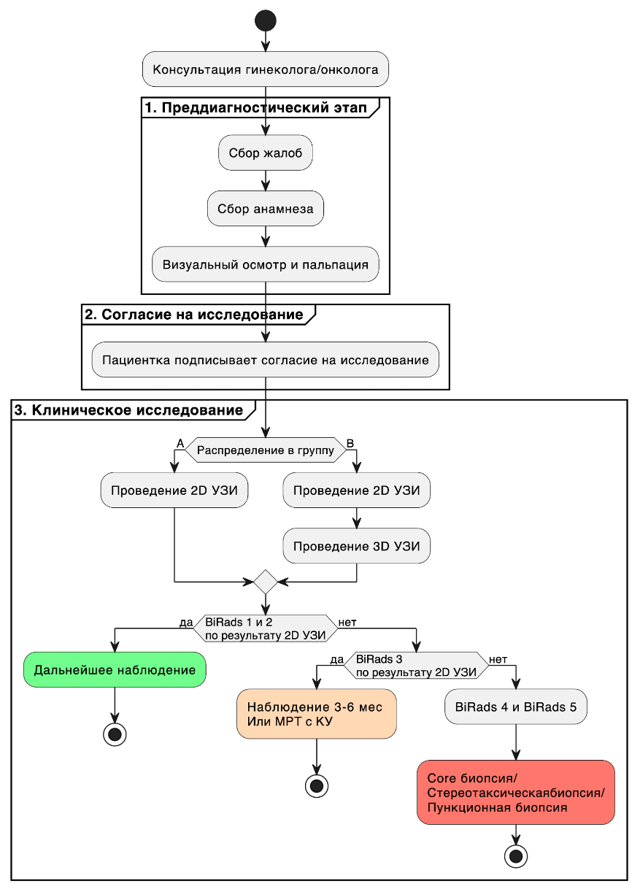
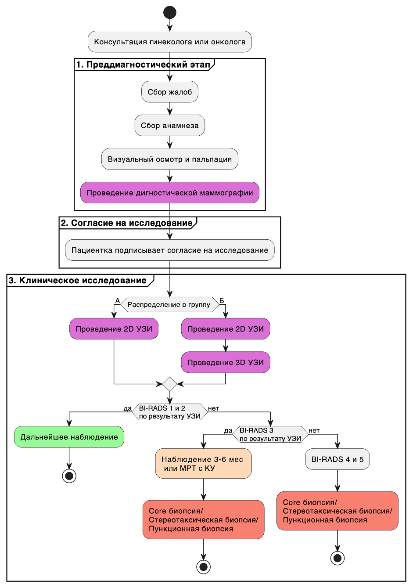
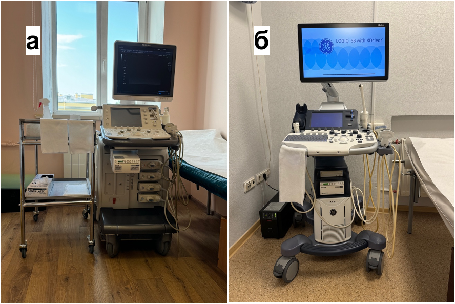
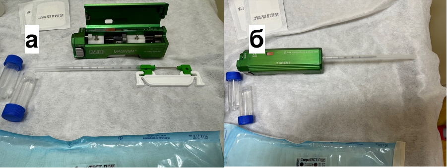

```{r echo=FALSE, message=FALSE}
library(knitr)
library(tidyverse)
library(readr)
library(flextable)

```

# ГЛАВА 2. МАТРИАЛЫ И МЕТОДЫ {.unnumbered}

## 2.1 Общая характеристика исследования

Исследование можно характеризовать как клиническое исследование диагностических аспектов ранней диагностики рака молочной железы. Объектом исследования являются пациенты c новообразованиями молочной железы, регистрируемые при диагностике с использованием мануального ультразвукового исследования (2D УЗИ), маммографии (ММГ) и автоматизированного объемного УЗИ сканирования молочных желез (3D УЗИ). Предметом исследования является изучение диагностической эффективности автоматизированного объемного УЗИ сканирования молочных желез, а также анализ наиболее важных факторов на преддиагностическом этапе, так и при выполнении конкретного диагностического метода, в частности при выполнении автоматизированного объемного УЗИ сканирования молочных желез. Дизайн исследования можно охарактеризовать ретро-проспективное клиническое исследование. Протокол настоящего исследования был одобрен на заседании локального этического комитета СЗГМУ им. Мечникова №9 от 12.10.2022 года.

Всего в исследование вошло 2794 пациенток. Критериями включения были пациенты женского пола в возрасте от 18 до 69 лет; женщина, посетившая врача для обследования молочных желез, с отсутствием видимых признаков рака молочной железы. Критериями исключения были: женщины, которые были беременны, кормили грудью или планировали забеременеть; оперативное лечение в анамнезе (лампэктомия, мастэктомия, увеличение МЖ), эксцизионная или чрескожная биопсия за последние 12 месяцев, пациентки, получавшие лечение по поводу рака молочных желез за последние 12 месяцев. В это исследование была включена одна медицинская клиника- «СМТ», состоящая из двух зданий -амбулаторно-поликлического комплекса и хирургического корпуса со стационаром. Все женщины из амбулаторного отделения были приглашены для участия в нашем исследовании, участники подписали форму информированного согласия. Все обследования были проведены медицинским персоналом с соответствующей квалификацией. Всем провели клинический осмотр, пальпацию, собрали информацию о социально-демографических данных и потенциальных факторах риска РМЖ.

Все пациентки были разделены на 2 независимые друг от друга выборки по принципу возраста: выборка пациенток с возрастом моложе 40 лет и выборка пациенток с возрастом от 40 лет включительно. Принцип разделения по возрасту был связан с различными принципами использования диагностических методов в скрининге рака молочной железы. У пациенток моложе 40 лет ММГ менее эффективна, так как имеет низкую чувствительность и основным методом диагностики является УЗИ [@mandelson2000]. У пациенток моложе от 40 лет метод ММГ является обязательным в скрининге РМЖ [@narayan2020].

В выборку моложе 40 лет вошло 1511 пациенток. Эта выборка пациенток была разделена на две группы A и Б. В группу A вошло 724 пациенток и в это группе скрининг проводился с использованием мануальной УЗИ диагностики и автоматизированного объемного УЗИ сканирования молочных желез (3D УЗИ) (исследуемая группа). В группу Б вошло 787 пациенток и в этой группе скрининг проводился только с использованием 2D УЗИ диагностики (контрольная группа) (Рисунок №3).



Рисунок 3 - Схема проведения диагностики настоящего исследования МРТ с КУ - магнитно-резонансная томография с контрастным усилением; УЗИ - ультразвуковое исследование, BI-RADS - «Breast Imaging-Reporting and Data System», стандартизированная шкала оценки результатов маммографии, УЗИ и МРТ по степени риска наличия злокачественных образований молочной железы)

В выборку 40 лет и старше вошло 1283 пациенток. Эта выборка пациенток была разделена на две группы В и Г. В группу В вошло 655 пациенток и в это группе скрининг проводился с использованием 2D УЗИ, маммографии и 3D УЗИ (исследуемая группа). В группу Г вошло 628 пациенток и в этой группе скрининг проводился только с использованием 2D УЗИ и маммографии, контрольная группа (Рисунок №4).



Рисунок 4 - Схема проведения диагностики настоящего исследования Сокращения: МРТ с КУ - магнитно-резонансная томография с контрастным усилением; 2D-УЗИ - ультразвуковое исследование, BI-RADS - «Breast Imaging-Reporting and Data System», стандартизированная шкала оценки результатов маммографии, 2D-УЗИ и МРТ по степени риска наличия злокачественных образований молочной железы.

Далее проходил этап, где проводилось непосредственно диагностическое исследование с использованием методом 2D УЗИ, маммографии и 3D УЗИ в зависимости от руппы распределения. Производился сбор данных для последующего выявления наиболее значимых факторов, а также для определения эффективности изучаемых методов и прогностической ценности метода.

## 2.2 Описание диагностических методов

### 2.2.1 Ручное ультразвуковое исследование исследование

Ультразвуковое исследование выполняли два врача ультразвуковой диагностики со стажем работы более 7 лет. У женщин в репродуктивном периоде 2D УЗИ исследование проводилось в первую фазу менструального цикла. У женщин, принимающих гормональные контрацептивы, и в постменопаузе время проведения 2D УЗИ исследования значения не имело. Пациенткам старше 39 лет 2D УЗИ исследование проводилось после предварительного проведения рентгеновской маммографии.

Использовались аппараты экспертного класса Toshiba Aplio 300 (Canon Япония) и GE LOGIQS 8 (GE Medical Systems, Милуоки, Висконсин, США) (Рисунок №5). Для исследования молочных желез применялись линейные датчики с частотой 7,5 - 12 МГц, ширина поля сканирования 5 см. На молочные железы равномерно наносили гипоаллергенный ультразвуковой гель. Исследование проводилось в положении лежа на спине, с руками за головой. При исследовании пациенток с молочными железами больших размеров, все пациентки были обследованы в положении лежа на спине, с заведенными руками за голову, на правом, на левом боку, в положении сидя с руками, заведенными за голову. Ультразвуковой датчик был расположен строго перпендикулярно, продольно или поперечно поверхности молочных желез, с дозированной и достаточно корректной компрессией. В циркулярном направлении от периферии, по часовой стрелке, по спирали передвигаясь к области соска, был осуществлен повторный осмотр каждой молочной железы. Веерообразными движениями датчика из различных положений осматривалась субареолярная область и область соска. Каждый квадрант обеих молочных желез последовательно был просканирован полипроекционно и полипозиционно, с исследованием регионарных зон лимфооттока с двух сторон.

Во время исследования оценивалось: симметричность молочных желез, состояние кожи, подкожно-жировой клетчатки, сосков, эхогенность, эхоструктура молочных желез, соотношение жировой, железистой и фиброзной тканей. Оценивалось состояние млечных протоков.

При выявлении патологических изменений оценивались их локализация, форма, эхогенность, эхоструктура, контуры, размеры. Применялись дополнительные методики: компрессионная эластография для оценки жесткости образований, цветовое допплеровское картирование и энергетическое допплеровское картирование для оценки кровотока патологических изменений, технология Micro Pure для визуализации микрокальцинатов - потенциальных маркеров злокачественных образований молочных желез.

После проведения мультипараметрического 2D УЗИ исследования каждой находке была присвоена категория оценки BI-RADS.




Рисунок 5.а - Ультразвуковой аппарат экспертного класса Toshiba Aplio 300 (Canon Япония); 5.б - GE LOGIQS 8 (GE Medical Systems, Милуоки, Висконсин, США).

### 2.2.2 Автоматизированное объемное ультразвуковое сканирование молочных желез

3D-автоматизированная ультразвуковая система Invenia ABUS (3D УЗИ), производства GE Healthcare (Саннивейл, Калифорния, США) 2018 года выпуска— это компьютерная система для оценки плотной молочной железы (Рисунок №6). Каждая молочная железа была визуализирована в трех проекциях: прямой, латеральной и медиальной автоматическим датчиком с линейной матрицей от 6 до 14 МГц, прикрепленным к жесткой компрессионной пластине (площадь 15,4×17,0×5,0 см). Индивидуальная мембрана для датчика была использована для каждой пациентки. Во время исследования система получала до 300 2D-срезов и реконструировала их в коронарной плоскости.

Стандартизированный процесс осмотра включает использование запатентованной коронарной плоскости для быстрой навигации по молочной железе, а также использование «режима обзора», позволяющего врачу быстро интерпретировать изображения. Время сбора данных для каждой проекции составляло 60 с, примерно по 3–4 мин на каждую молочную железу. Обследование проводили в положении лежа. Полотенце было помещено под плечом, что помогло расправить ткань молочной железы равномерно, соском к потолку. На молочные железы равномерно наносили гипоаллергенный ультразвуковой гель с дополнительным количество на область соска. Возможно применение трех уровней компрессии датчика для исследования молочных желез для получения наилучшей визуализации с учетом комфорта пациента.

Сканирование 3D УЗИ было непрерывным и автоматизированным. В течение исследования женщин попросили не двигаться, не разговаривать и дышать ровно. Выполнял исследование сертифицированный персонал со средним медицинским образованием. После завершения сбора данных ультразвуковой системой весь массив передавался на специальную рабочую станцию для интерпретации. Оценку изображений 3D УЗИ выполнял один врач ультразвуковой диагностики, со стажем работы более 7 лет. Общее время, необходимое для подготовки пациента и получения 3D УЗИ, фиксировалось, в каждом случае и варьировалось примерно между 10 и 15 мин.


Рисунок №6 - 3D-автоматизированная ультразвуковая система Invenia ABUS

### 2.2.3 Маммография

Пациентки старше 40 лет прошли цифровую маммографию на аппарате Planmed Clarity 3D (Рисунок №7) для каждой молочной железы в двух стандартных проекциях: прямой (кранио-каудальной СС) и косой (медиолатеральной MLO - с наклоном трубки примерно от 30° до 60° в зависимости от конституции пациентки). Маммографию также выполняли женщинам моложе 40 лет в случае положительного семейного или личного анамнеза - рак молочной железы. При необходимости производились рентгенограммы в боковой проекции с медиолатеральным ходом луча. Прицельная рентгенография с помощью специальных тубусов различной площади проводилась в особых случаях для уточнения характера контуров, структуры отдельных участков, для лучшего выявления кальцинатов.

При выполнении прямой (кранио-каудальной СС) проекции пациентка находилась в вертикальном положении (сидячем или стоячем) лицом к рентгеновскому аппарату. Высота кассетодержателя регулировалась таким образом, чтобы молочная железа удобно размещалась на его поверхности. Наружный край кассетодержателя был расположен на уровне нижнего отдела молочной железы и плотно прилегал к грудной клетке. Каждая молочная железа укладывалась по центру кассетодержателя, сосок выводился на контур. Центральный луч был направлен сверху вниз через центр молочной железы. Каждая пациентка должна была повернуть голову и немного наклониться вперед. При компрессии рука женщины отводилась вперед и оттягивалась боковая часть железы вперед, чтобы избежать образования складок.

При выполнении косой (медиолатеральной MLO) проекции рентгеновскую трубку устанавливали так, чтобы кассетодержатель был перпендикулярен грудной мышце пациентки. Центральный пучок излучения направляли от верхнее-медиальной к нижнелатеральной зоне, при этом варьируя угол поворота трубки: для высоких и худых женщин — 60°, для женщин среднего телосложения — 45°, для женщин с птозом молочной железы — 40°. Каждую пациентку поворачивали лицом к рентгеновскому аппарату и устанавливали на расстоянии примерно 10 см от съемочного стола. Молочные железы укладывали в медиолатеральной проекции с выведенными в профиль сосками, при этом производили компрессию каждой молочной железы.

Все маммограммы были промаркированы: обозначены фамилия, инициалы, возраст (или год рождения) обследуемой, номер истории болезни. На маммограмме обозначалась сторона исследования (R - правая, L - левая) и проекции съемки (СС - кранио-каудальная, MLO - медиолатеральная).

После выполнения маммограмм оценивалась рентгенологическая плотность молочных желез с использованием системы BI-RADS (Breast Imaging Reporting and Data System, Система описания и обработки данных лучевых исследований молочной железы) 5-го пересмотра, предложенной Американской коллегией радиологов (American College of Radiology – ACR) в 2013 году, согласно которой плотность желез подразделяется на 4 категории: A, B, C, D.


Рисунок №7 - Цифровой маммограф Planmed Clarity 3D с функцией томосинтеза (Финляндия)

### 2.2.4 Магнитно-резонансная томография

Диагностика МРТ проводилась с контрастным усилением по стандартной методике на высокопольном магнитно-резонансном томографе General Electric Medical Systems Signa HDxt 1 (Рисунок №8). Исследование проводилось в положении лежа на животе, для чего применялась специальная укладка с отверстиями для молочных желез и лица. Во время сканирования не призводилось сдавление груди. Индукция магнитного составляла 1,5 тесла. Среднее время проведения процедуры составило 30-40 минут. Показаниями к проведению МРТ была поставленная после проведения 2D УЗИ категория 3 по классификации по BI-RADS.


Рисунок №8 - Высокопольный магнитно-резонансный томограф General Electric Medical Systems Signa HDxt 1,5 Т (США)

### 2.2.5 Оценка выявленных изменений

Результаты выявленных изменений были классифицированы по BI-RADS отсортированы по шести категориям [@spak2017]: 0 = неполные данные, 1 = нормальные, 2 = доброкачественные, 3 =вероятно доброкачественные, 4 = подозрительные изменения, 5 = с высокой степенью вероятности злокачественные, для 2D УЗИ, 3D УЗИ и ММГ. Для категории Birads 3 обязательно проводилась МРТ для выявления истинно отрицательных и ложноотрицательных результатов. Женщинам, отнесенным к категории 4 или 5, проводилась трепан биопсия под уз-наведением или стереотаксическим наведением с последующей морфологической и при необходимости иммуногистохимической верификацией.

### 2.2.6 Интервенционные методы исследования

При выявлении изменений, оцененных категорией BI-RADS 3-5, выполнялось минимальное инвазивное вмешательство, которое позволило планировать оптимальное лечение на предоперационном этапе.

Перед выполнением инвазивного вмешательства детально был изучен медицинский и хирургический анамнез каждой пациентки. Все пациентки были ознакомлены с целью, задачами, этапами проведения манипуляции, возможными побочными эффектами, пациенткам было предложено подписать письменное информированное добровольное согласие на проведение процедуры.

В ходе проведения манипуляций были соблюдены все правила асептики и антисептики.

*Трепан-биопсия (core-биопсия) под ультразвуковым наведением*

Трепан-биопсия проводилась с помощью специальной системы для биопсии Bard-Magnum, полуавтоматическое устройство и игл 14-G или 12-G (Рисунок №9), под УЗИ контролем с линейным датчиком с частотой 7,5-12 МГц. На линейный датчик предварительно наносился стерильный ультразвуковой гель.




Рисунок 9 - Система для биопсии Bard-Magnum, полуавтоматическое устройство.

Перед выполнением трепан-биопсии выполнялась прицельная эхография в зоне интереса для навигации. Процедура выполнялась в горизонтальном положении пациентки, после предварительного обезболивания кожи и подлежащих тканей раствором местного анестетика (Ропивакаин 7,5 мг/мл - 2-3 мл). Скальпелем был выполнен разрез кожи длинной до 0,5см. Под ультразвуковой навигацией к зоне интереса подводилась игла параллельно структурам передней грудной стенки во избежание их травматизации, с запасом расстояния не менее 2 см от зоны интереса до смежных с молочной железой структур при периферическом расположении опухоли. Выполнялся «выстрел», во время которого происходило взятие биопсийного материала из очага интереса (3-5 столбиков ткани длиной 15-22 мм). Полученный материал помещался в специальные транспортировочные одноразовые кассеты, погружаемые в контейнеры с 10% раствором формальдегида для фиксации ткани/образца, и направлялся на морфологическое исследование.

*Тонкоигольная пункция образований (ТАБ) под контролем ультразвукового исследования*

Тонкоигольная пункция образований проводилась с помощью специального одноразового шприца 20 мл и игл 18-G или 22-G (длиной 42 мм, 90 мм), под УЗИ контролем с линейным датчиком с частотой 7,5-12 МГц. На линейный датчик предварительно наносился стерильный ультразвуковой гель.

Исследование выполнялось в горизонтальном положении пациентки на спине или на боку, с заведенными за голову руками. Перед выполнением тонкоигольной пункционной биопсии выполнялась прицельная эхография в зоне интереса для навигации. Кожа была обработана специальным дезинфицирующим средством. В зону интереса под контролем УЗИ вводилась игла 18-G/22-G и проводилась медленная аспирация. Полученный материал был нанесен на предметные стекла и направлялся на цитологическое исследование.

*Трепан-биопсия (core-биопсия) под контролем цифровой стереотаксической приставки с использованием системы «пистолет-игла»*

Трепан-биопсия под контролем цифровой стереотаксической приставки с использованием системы «пистолет-игла» применялась для образований, которые выявлялись только на маммографии.

Исследование проводилось на оборудовании - Planmed Clarity 3D с функцией томосинтеза (Финляндия) с использованием специализированной цифровой стереотаксической приставки (Рисунок №10). Система для биопсии Bard-Magnum, полуавтоматическое устройство и иглы 14-G или 12-G.


Рисунок 10 - Специализированная цифровая стереотаксическая приставка.

Перед выполнением исследования на коже в проекции предполагаемого образования осуществлялась разметка, каждая пациентка усаживалась на стул, лицом к аппарату. Молочная железа укладывалась на детектор изображения специальным образом: участок железы, заранее размеченный, должен был попадать в середину окошка на компрессионной пластине. После укладки молочной железы выполнялась серия снимков с прицельным увеличением в прямой проекции и под углами +15˚ и -15˚. После получения серии снимков курсором отмечалась зона интереса, без захвата кровеносных сосудов. Позиционер выдвигался в нужное положение, благодаря корректным автоматическим расчетам. Затем проводилась местная анестезия раствором Наропина 2 мг/мл - 20-30 мм, выполнялся небольшой разрез кожи хирургическим скальпелем (лезвие № 11) до 0,5 см длинной. В позиционер устанавливался пистолет с иглой и выполнялся «выстрел», во время которого происходило взятие биопсийного материала из очага интереса.

Полученные образцы помещались на чашки Петри для контрольной маммографии, а после материал помещался в специальный флакон с 10% раствором формальдегида для фиксации и направлялся на морфологическое исследование.

## 2.3 Описание исследуемых групп

### 2.3.1 Общее описание выборки пациенток до 40 лет

С февраля 2019 по май 2023 года было исследовано 1511 пациенток с возрастом моложе 40 лет.

Медиана возраста пациенток выборке моложе 40 лет составила 35 \[Q1-Q3: 32;37\] лет. Минимальный возраст составил 20 лет. Максимальный возраст составил 39 лет. Медиана роста пациенток выборке моложе 40 лет составил 167 \[Q1-Q3: 164;170\] см. Медиана веса пациенток выборке моложе 40 лет составил 59 \[Q1-Q3: 55;65\] кг.

### 2.3.2 Описание групп в пациенток до 40 лет

В группу A вошло 787 пациенток. Медиана возраста составила 35 \[Q1-Q3: 32;37\] лет. Минимальный возраст составил 20 лет. Максимальный возраст составил 39 лет. Медиана роста составила 167 \[Q1-Q3: 164;170\] см. Медиана веса составила 58 \[Q1-Q3: 55;65\] кг. Пациенток в группе B в исследование вошло 724 пациентов. Медиана возраста составила 34 \[Q1-Q3: 31;37\] лет. Минимальный возраст составил 20 лет. Максимальный возраст составил 39 лет. Медиана роста оставила 167 \[Q1-Q3: 164;170\] см. Медиана веса составила 60 \[Q1-Q3: 55;65\] кг. Статистически значимой разницы по возрасту, росту, весу не было выявлено.

В группе А наиболее часто диагностировались «Фиброзно-кистозная болезнь» (28,72%), «Без патологии» (32,15%) и «Диффузный фиброаденоматоз» (17,03%), тогда как в группе В преобладали «Фиброаденома» (24,72%), «Без патологии» (27,49%) и «Фиброзно-кистозная болезнь» (22,24%). Статистически значимые различия между группами (p\<0,01) обусловлены отсутствием в группе А диагнозов «Внутрипротоковая папиллома» и «Гиперплазия», тогда как в группе В не регистрировался «Локализованный фиброаденоматоз», однако при пересчете с учетом приоритетной значимости диагноза «Рак» группы оказались однородны (p=0,77). Большинство пациенток обеих групп не предъявляли жалоб (86,79% в группе А против 82,87% в группе В), наиболее частой жалобой было уплотнение (8,01% и 10,91% соответственно), при этом статистически значимых различий по структуре жалоб не выявлено (p=0,21). Группы также были однородны по репродуктивному статусу (репродуктивный возраст 96,7% в группе А и 97,24% в группе В, p=0,55), наличию операций на молочной железе в анамнезе (отсутствовали у 98,48% и 98,34% соответственно, p=0,41), приему гормональных препаратов (20,34% против 21,8%, p=0,17) и генетической предрасположенности (31,48% против 31,38%, p=0,73). Детальная характеристика сравниваемых групп представлена в таблице 4.

Таблица 4 - Первичный диагноз, жалобы, выявленные при первичном осмотре, репродуктивный статус, операции на МЖ, гормональные препараты, наследственная прерасположенность в группах A и B.

```{r echo=FALSE}
tbl_4 <- read.csv("tbl/chapter_2/tbl_4.csv", stringsAsFactors = FALSE)
colnames(tbl_4) <- c("Показатель","Категория","Группа А","Группа Б","p-уровень")
tbl_4 %>%
  flextable() %>%
  merge_v(j = c(1,5)) %>%  # объединяем все столбцы с 1 по 4
  set_caption("Таблица 4 - Первичный диагноз, жалобы, выявленные при первичном осмотре, репродуктивный статус, операции на МЖ, гормональные препараты, наследственная прерасположенность в группах A и B") %>%
  theme_zebra() %>%
  autofit()
```

При сравнительном анализе групп выявлены статистически значимые различия (p\<0,05) по всем изучаемым параметрам. В группе А достоверно чаще выявлялась мутация BRCA1 (0,8% против 0%), отсутствие пальпируемых образований (83,4% против 72,7%), структура ACR типа С (72,9% против 67,8%), а также локализация в нижне-внутреннем квадранте (1,5% против 0,8%) и на границе верхнего квадранта (4,1% против 1,7%). В группе А также отсутствовали случаи втягивания соска (0% против 2,5%) и кровянистые выделения (0,9% против 0%).

В группе Б значимо чаще встречались отсутствие мутаций BRCA (2,5% против 0%), поражение правой стороны (15,8% против 7,1%) и обеих сторон (5,8% против 2,3%), структура ACR типа D (32,2% против 27,1%), а также локализация в верхне-наружном (12,3% против 4,1%), нижне-наружном (4,1% против 0,8%) квадрантах и по всей железе (0,8% против 0%). В группе Б также чаще отмечалось втягивание соска (2,5% против 0%). Основные показаетли представлены в таблице 5.

Таблица 5 – Показатели в исследованных группах: мутация BRCA, сторона поражения при осмотре, симптом втягивания соска, симптом выделения из соска при осмотре, тип структуры ACR, квадрант локализации в группах A и B.

```{r echo=FALSE}
tbl_5 <- read.csv("tbl/chapter_2/tbl_5.csv", stringsAsFactors = FALSE)
colnames(tbl_5) <- c("Показатель","Категория","Группа А","Группа Б","p-уровень")
tbl_5 %>%
  flextable() %>%
  merge_v(j = c(1,5)) %>%  # объединяем все столбцы с 1 по 4
  set_caption("Таблица 5 – Показатели в исследованных группах: мутация BRCA, сторона поражения при осмотре, симптом втягивания соска, симптом выделения из соска при осмотре, тип структуры ACR, квадрант локализации в группах A и B.") %>%
  theme_zebra() %>%
  autofit()
```

### 2.3.3 Общее описание выборки пациенток 40 лет и старше

С февраля 2019 по май 2023 года было исследовано 1283 пациенток с возрастом 40 лет и старше.

Медиана возраста пациенток выборке после 40 лет составил 49 \[Q1-Q3: 45;56\] лет. Минимальный возраст составил 40 лет. Максимальный возраст составил 79 лет. Медиана роста пациенток выборке после 40 лет составил 166 \[Q1-Q3: 164;168\] см. Медиана веса пациенток выборке после 40 лет составил 65 \[Q1-Q3: 60;73.25\] кг. В выборке после 40 лет пациенток без выявленной патологии было 5.61% (72/1283).

### 2.3.4 Оценка однородности пациенток 40 лет и старше

Пациенток в группе C в исследование вошло 628 пациентов. Медиана возраста пациенток в группе C составила 49 \[Q1-Q3: 45;56\] лет. Минимальный возраст составил 40 лет. Максимальный возраст составил 69 лет. Медиана роста составила 167 \[Q1-Q3: 164;169\] см. Медиана веса составила 65 \[Q1-Q3: 60;72\] кг. Пациенток в группу D вошло 655 пациентов. Медиана возраста составила 49 \[Q1-Q3: 45;56.5\] лет. Минимальный возраст составил 40 лет. Максимальный возраст составил 69 лет. Медиана роста составила 165 \[Q1-Q3: 164;168\] см. Медиана веса составила 65 \[Q1-Q3: 59;75\] кг.

При анализе выявлены статистически значимые различия между группами по всем изучаемым параметрам (p\<0,05). В группе Г достоверно чаще диагностировались рак (5,3% против 1,6%), фиброаденома (12,1% против 8%), листовидная опухоль (2,3% против 1,1%) и мастит (0,5% против 0%). В группе В преобладали фиброзно-кистозная болезнь (34,9% против 28,4%) и диффузный фиброаденоматоз (44,4% против 39,4%).

При оценке жалоб в группе Г значительно чаще отмечалось уплотнение (22,6% против 5,7%), тогда как в группе В преобладали пациенты без жалоб (88,4% против 74,1%). По репродуктивному статусу в группе В чаще встречалась менопауза до 5 лет (21% против 15,1%), в группе Г — пременопауза (35,7% против 32%). Операции на молочной железе в анамнезе отсутствовали у всех пациентов группы Г, тогда как в группе В операции проводились в 1,8% случаев. Гормональные препараты чаще принимали пациенты группы В (22,6% против 18,8%), а наследственная предрасположенность чаще отмечалась в группе В (39,7% против 33,3%).

Таким образом, группы характеризовались различными клинико-диагностическими профилями, что отражает их неоднородность по большинству анализируемых показателей (таблица 6).

Таблица 6 - Первичный диагноз, осложнения, репродуктивный статус, операции на МЖ, прием гормональных препаратов, наследственная предрасположенность в анамнезе в группах С и D

```{r echo=FALSE}
tbl_6 <- read.csv("tbl/chapter_2/tbl_6.csv", stringsAsFactors = FALSE)
colnames(tbl_6) <- c("Показатель","Категория","Группа В","Группа Г","p-уровень")
tbl_6 %>%
  flextable() %>%
  merge_v(j = c(1,5)) %>%  # объединяем все столбцы с 1 по 4
  set_caption("Таблица 5 – Показатели в исследованных группах: мутация BRCA, сторона поражения при осмотре, симптом втягивания соска, симптом выделения из соска при осмотре, тип структуры ACR, квадрант локализации в группах A и B.") %>%
  theme_zebra() %>%
  autofit()
```

При сравнительном анализе однородности групп выявлены статистически значимые различия (p\<0,05) по большинству параметров. В группе Г достоверно чаще встречались мутации BRCA2 (0,6% против 0%), поражение левой (14,1% против 3,7%) и правой (12% против 6,7%) сторон, светлые выделения из соска (1,2% против 0%), а также локализация в верхне-наружном (13,4% против 7,5%) и верхне-внутреннем (7,5% против 1,8%) квадрантах. В группе В чаще отсутствовали пальпируемые образования (86,5% против 66,7%) и локализация в квадрантах (84,6% против 67,2%).

Группы оказались однородны по следующим показателям: кожные симптомы (p=0,17), втягивание соска (p=0,08) и структура ACR (p=0,55), что свидетельствует о сопоставимости групп по данным признакам.

Детальный анализ представлен в таблице №7.

Таблица 7 – показатели мутация BRCA, сторона поражения, кожные симптомы, симптом втягивания, симптом выделения из соска при осмотре, тип структуры ACR, квадрант локализации в группах С и D

```{r echo=FALSE}
tbl_7 <- read.csv("tbl/chapter_2/tbl_7.csv", stringsAsFactors = FALSE)
colnames(tbl_7) <- c("Показатель","Категория","Группа В","Группа Г","p-уровень")
tbl_7 %>%
  flextable() %>%
  merge_v(j = c(1,5)) %>%  # объединяем все столбцы с 1 по 4
  set_caption("Таблица 5 – Показатели в исследованных группах: мутация BRCA, сторона поражения при осмотре, симптом втягивания соска, симптом выделения из соска при осмотре, тип структуры ACR, квадрант локализации в группах A и B.") %>%
  theme_zebra() %>%
  autofit()
```

## 2.4 Статистический анализ данных

Статистическая обработка проводилась с помощью языка R версии 4.3.0 (2023-04-21). В качестве среды разработки использовалась программа RStudio версия 2023.06.0+421 (2023.06.0+421). Для определения числа наблюдений при каждом типе воздействия в каждой группе производился расчет мощности пропорций при уровне значимости 95% и мощностью 0.8 с предварительным расчетом величены эффекта (h) по следующей формуле:

h=2arcsin(p1)-2arcsin(p2)

Обозначения p1 и p2 соответствуют сравниваемым пропорциям. Функции “pwr.2p.test” для расчета мощности пропорций использовались из пакета “library(pwr)”. Данные, необходимые для расчета величины эффекта были взяты из исследования Xin Y. и коллег (2021) [@xin2021]. Получено значение умножалось на 1.15 (то есть +15%), чтобы учесть возможность устранения неподходящих к исследованию данных с сохранением необходимого объема. По результатам расчета в выборке пациенток моложе 40 лет для достижения эффекта нужно исследовать не менее 1430 пациенток, в настоящем исследовании было на 5.66% больше от необходимого. В выборке пациенток 40 лет и старше для достижения эффекта нужно исследовать не менее 1256 пациенток, в нашем исследовании было на 2.15% больше от необходимого.

Для описания количественных показателей проводилась оценка на нормальность распределения, в качестве метода использовался критерий Шапиро-Уилка: функция shapiro.test из пакета stat версия 3.6.2. Переменные, имеющие нормальное распределение, описывались как среднее ± стандартное отклонение (M±SD). Переменные, распределение которых отличалось от нормального, описывались при помощи значений медианы (Me) и нижнего и верхнего квартилей (Q1-Q3). Для определения статистически значимой разницы непрерывных величин использовали критерий Манна-Уитни для независимых непараметрических выборок при ненормальном распределении (функция wilcox.test из пакета stats версия 3.6.2) и t-критерий Стюдента для независимых параметрических выборок при нормальном (функция t.test из пакета stats версия 3.6.2). Для определения статистически значимой разницы независимых качественных величин Хи-квадрат Пирсона (chisq.test из пакета stats версия 3.6.2), при малом количестве наблюдений использовался точный критерий Фишера (fisher.test из пакета stats версия 3.6.2).

Для определения чувствительности, специфичности и точности использовалась функция confusionMatrix из библиотеки caret версия 3.45. При определении эффективности диагностических методов 2D УЗИ, ММГ, 3D УЗИ в нахождении злокачественных новообразований в качестве контрольного метода использовались данные гистологического исследования. При определении эффективности диагностических методов 2D УЗИ и 3D УЗИ в нахождении кальцинатов в качестве контрольного метода использовались данные ММГ исследования.

Для построения предсказательной модели на основании данных использовалась логистическая регрессия с помощью функций glm, predict из пакета stats версия 3.6.2. Для оценки получено предсказательной модели и построения ROC-кривой с расчетом площади под кривой (AUC - area under curve) использовался пакет pROC version 1.18.4 с функцией roc.

# 2.5 Резюме

Таким образом, группы адекватны по размеру и, несмотря на выявленную неоднородность по ряду клинико-диагностических показателей, они пригодны для проведения оценки и решения поставленных задач. Данное обстоятельство объясняется дизайном исследования, целью которого являлось не прямое сравнение групп между собой, а в первую очередь оценка диагностической эффективности методов 2D УЗИ и 3D УЗИ. Оценка проводилась как внутри группы при выполнении обоих методов у одних и тех же пациенток, так и путем сопоставления результатов, полученных в разных группах, по показателям точности, специфичности и чувствительности.

Добиться полной однородности по всем параметрам в условиях сплошного исследования не представляется возможным, однако критически важным являлось обеспечение сопоставимости групп по основному целевому показателю — частоте выявления диагноза «Рак». В обеих возрастных категориях, как в выборке пациенток моложе 40 лет, так и в выборке 40 лет и старше, группы были однородны по данному показателю (p>0,05), что позволяет корректно оценивать диагностическую эффективность изучаемых методов.
