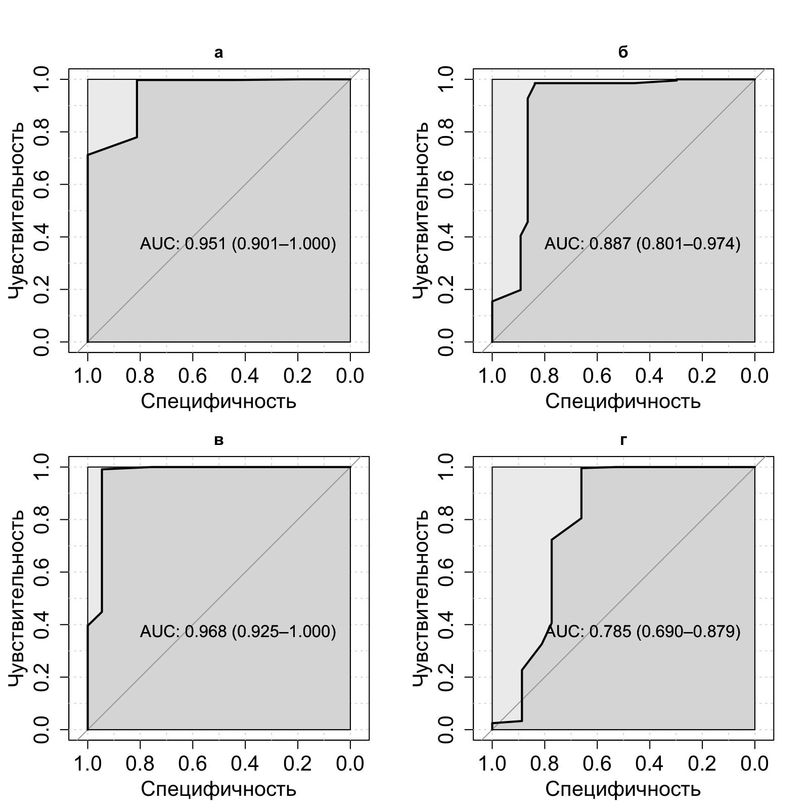
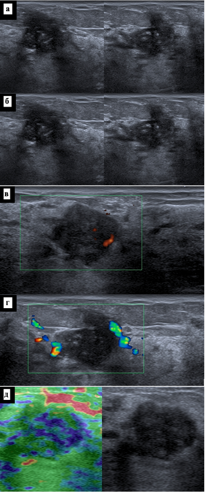
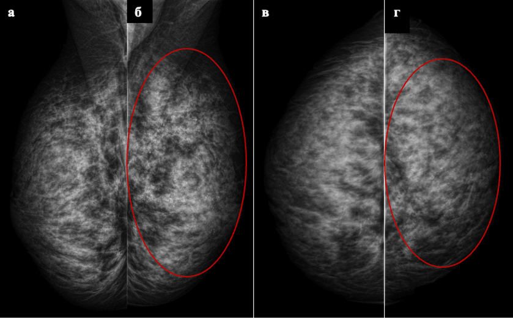

```{r echo=FALSE, message=FALSE}
library(knitr)
library(tidyverse)
library(readr)
library(flextable)

```

# ГЛАВА №3. СРАВНЕНИЕ ДИАГНОСТИЧЕСКОЙ ЭФФЕКТИВНОСТИ МЕТОДОВ УЛЬТРАЗВУКОВОГО ИССЛЕДОВАНИЯ У ЖЕНЩИН, НЕ ДОСТИГШИХ ВОЗРАСТА МАММОГРАФИЧЕСКОГО СКРИНИНГА {.unnumbered}

## 3.1 Общее описание результатов исследования в выборке моложе 40 лет

По результатам выполнения 2D УЗИ был поставлен диагноз злокачественного образования в группе A в 1.91% (15), в группе B в 6.49% (47).
При выполнении 3D УЗИ был поставлен диагноз злокачественного образования в группе B в 6.077% (44).
Пациенты, которым была определена категория BI-RADS 3 выполняли МРТ исследование и по его результатам была определена категория BI-RADS 2 в 196 и BI-RADS 4а в 33 случаях (Рисунок 11).


Рисунок 11 - Распределение поставленных категорий BI-RADS после выполнения 2D УЗИ и количество пациентов, которым была выполнена биопсия

## 3.2 Автоматизированное объемное ультразвуковое сканирование молочных желез

При выполнении 3D УЗИ пациенткам моложе 40 лет, которые составили 47.92% (724/1511) от общей выборки, были получены следующие результаты (Таблица 8n). У всех пациенток данной группы кожа оставалась не измененной (100%, 724/724), симптом ретракции наблюдался в 11.05% случаев (80/724), а кальцинаты выявлялись в 3% наблюдений (24/724). Образования были обнаружены у 35.64% пациенток (258/724), при этом наиболее часто встречались узлы размером 1,1-1,5 см (40.7%, 105/258) и 0,5-1,0 см (37.6%, 97/258). В подавляющем большинстве случаев образования имели ровные контуры (80.62%, 208/258), гипоэхогенную структуру (97.67%, 252/258) и однородное внутреннее строение (71.32%, 184/258). Преимущественно определялись одиночные узлы (75.97%, 196/258). При оценке по категориям BI-RADS чаще всего устанавливались категории BI-RADS 2 (58.7%, 425/724) и BI-RADS 1 (21.13%, 153/724). Среди заключительных УЗ-диагнозов преобладали фиброзно-кистозная мастопатия (30.66%, 222/724), отсутствие патологии (25.83%, 187/724) и фиброаденома единичная (20.03%, 145/724). Диагноз рак по результатам 3D УЗИ был поставлен в 6.08% случаев (44/724) (Таблица 8n).

Таблица 8n - Характеристика результатов 3D УЗИ у пациенток моложе 40 лет: общие показатели, особенности выявленных образований, распределение по категориям BI-RADS и заключительным УЗ-диагнозам

```{r echo=FALSE}
tbl_8n <- read.csv("tbl/chapter_3/tbl_8n.csv", stringsAsFactors = FALSE)
colnames(tbl_8n) <- c("Показатель","Значение","Группа B")
tbl_8n %>%
  flextable() %>%
  merge_v(j = c(1,5)) %>% 
  set_caption("Таблица 8n - Характеристика результатов 3D УЗИ у пациенток моложе 40 лет: общие показатели, особенности выявленных образований, распределение по категориям BI-RADS и заключительным УЗ-диагнозам") %>%
  theme_zebra() %>%
  autofit()
```


## 3.3 Сравнительная характеристика групп

В группу A 787 пациентов, а группу B 724 пациентов.

### 3.2.1 Классическое ультразвуковое исследование 

При ультразвуковом исследовании у всех пациенток обеих групп кожа оставалась не измененной. УЗ-фон в группе А характеризовался преобладанием железистой ткани (63,28%, 498/787) и фиброзно-кистозной мастопатии (35,96%, 283/787), тогда как в группе В чаще визуализировалась железистая ткань (68,09%, 493/724) и реже — фиброзно-кистозная мастопатия (30,94%, 224/724). Детальные характеристики УЗ-фона, локализации, формы, размеров, контуров, эхогенности, структуры образований, количества узлов, особенностей кровотока и результаты эластографии представлены в Таблице 8.

Анализ расположения выявленных образований показал, что в группе А они чаще локализовались в верхне-внутреннем (22,78%, 41/180) и верхне-наружном (20,56%, 37/180) квадрантах, а также на границе верхних квадрантов (15%, 27/180). В группе В доминировала локализация в верхне-наружном квадранте (46,26%, 105/227). Оценка формы узлов выявила преобладание овальных образований в обеих группах — 86,67% (156/180) в группе А и 78,41% (178/227) в группе В. Неправильная форма чаще встречалась в группе В (13,22%, 30/227), чем в группе А (3,33%, 6/180).

Размеры узлов в обеих группах преимущественно варьировали от 0,5 до 1,5 см. В группе А преобладали образования размером 1,1–1,5 см (38,33%, 69/180) и 0,5–1,0 см (37,22%, 67/180). В группе В также наиболее часто встречались узлы 1,1–1,5 см (45,81%, 104/227) и 0,5–1,0 см (34,8%, 79/227). Контуры образований в большинстве наблюдений были ровными: 82,22% (148/180) в группе А и 78,41% (178/227) в группе В. В группе В также регистрировались звездчатые (5,29%, 12/227) и полициклические (2,64%, 6/227) контуры, не выявленные в группе А.

По эхогенности в обеих группах доминировали гипоэхогенные образования — 89,44% (161/180) в группе А и 94,71% (215/227) в группе В. Структура узлов преимущественно была однородной, однако в группе В чаще отмечалась неоднородная структура (24,23%, 55/227) по сравнению с группой А (13,89%, 25/180). В группе А в 3,33% (6/180) случаев визуализировались внутрикистозные пристеночные разрастания, отсутствовавшие в группе В.

При оценке количества узлов в обеих группах преобладали солитарные образования: 79,44% (143/180) в группе А и 72,69% (165/227) в группе В. Множественные узлы чаще выявлялись в группе В (11,01%, 25/227), чем в группе А (3,33%, 6/180). Характеристика кровотока в образованиях различалась: в группе А преобладал перинодулярный тип (50,56%, 91/180), тогда как в группе В он встречался реже (40,97%, 93/227), но чаще регистрировался интранодулярный кровоток (21,59%, 49/227 против 10%, 18/180 в группе А).

Результаты эластографии в обеих группах распределились сходным образом: наиболее часто определялись 0 и 2 эластотипы. В группе А 0 эластотип зафиксирован в 52,86% (416/787), 2 эластотип — в 35,96% (283/787); в группе В — 52,35% (379/724) и 37,02% (268/724) соответственно. Полные данные по эластографии также приведены в таблице 8.

Таблица 8 - УЗ -фон, расположение, форма, размер, края образования, эхогенность, УЗ-структура образования, количества узлов, кровоток в образовании, результаты эластографии при УЗ исследовании в группах А и B.

```{r echo=FALSE}
tbl_8 <- read.csv("tbl/chapter_3/tbl_8.csv", stringsAsFactors = FALSE)
colnames(tbl_8) <- c("Показатель","Значение","Группа A","Группа B")
tbl_8 %>%
  flextable() %>%
  merge_v(j = c(1,5)) %>% 
  set_caption("Таблица 8 - УЗ -фон, расположение, форма, размер, края образования, эхогенность, УЗ-структура образования, количества узлов, кровоток в образовании, результаты эластографии при УЗ исследовании в группах А и B.") %>%
  theme_zebra() %>%
  autofit()
```


При оценке регионарных лимфоузлов в обеих группах преобладали неизмененные лимфоузлы: в группе А — 97,59% (768/787), в группе В — 95,72% (693/724). Увеличение лимфоузлов в надключичной области наблюдалось чаще в группе В — 4,28% (31/724) против 2,41% (19/787) в группе А. Распределение по категориям BI-RADS в группах А и В представлено в Таблице 9. В обеих группах наиболее часто устанавливались категории BI-RADS 2 и BI-RADS 1. В группе А BI-RADS 2 составила 58,45% (460/787), BI-RADS 1 — 26,68% (210/787), BI-RADS 3 — 12,45% (98/787), BI-RADS 4а — 1,65% (13/787), BI-RADS 5 — 0,76% (6/787). В группе В BI-RADS 2 наблюдалась в 58,43% (423/724), BI-RADS 1 — в 20,58% (149/724), BI-RADS 3 — в 15,19% (110/724), BI-RADS 4а — в 3,31% (24/724), BI-RADS 4b — в 1,66% (12/724), BI-RADS 5 — в 0,83% (6/724).

Анализ заключительных УЗ-диагнозов выявил различия в структуре патологии между группами. В группе А наиболее часто диагностировались фиброзно-кистозная мастопатия (43,33%, 341/787), отсутствие патологии (27,32%, 215/787) и фиброаденома единичная (14,10%, 111/787). Реже встречались диффузный фиброаденоматоз (4,19%, 33/787), множественные фиброаденомы (3,94%, 31/787), кисты (2,29%, 18/787), киста (1,02%, 8/787), локализованный фиброаденоматоз (1,02%, 8/787), образование Ca (1,14%, 9/787), мультицентричный рак (0,76%, 6/787), цистаденопапиллома (0,76%, 6/787) и сложная киста (0,13%, 1/787). В группе В структура диагнозов распределилась следующим образом: фиброзно-кистозная мастопатия — 33,01% (239/724), отсутствие патологии — 21,55% (156/724), фиброаденома единичная — 20,99% (152/724), множественные фиброаденомы — 6,49% (47/724), диффузный фиброаденоматоз — 4,28% (31/724), кисты — 3,59% (26/724), киста — 3,31% (24/724), образование Ca — 3,59% (26/724), мультицентричный рак — 2,49% (18/724), мультифокальный рак — 0,41% (3/724) и локализованный фиброаденоматоз — 0,28% (2/724). Кальцинаты определялись в обеих группах с одинаковой частотой — по 1,5% (12/787 в группе А и 12/724 в группе В). При этом УЗ-диагноз злокачественного образования был установлен в группе В значительно чаще — в 6,49% (47/724) случаев, тогда как в группе А — только в 1,91% (15/787) (Таблица 9).
Таблица 9 -Увеличение регинарных лимфоузлов, определение категории BI-RADS, Поставленные диагнозы при УЗ исследовании, определение кальцинатов, злокачественного новообразование при УЗ исследовании в группах А и B.

```{r echo=FALSE}
tbl_9 <- read.csv("tbl/chapter_3/tbl_8.csv", stringsAsFactors = FALSE)
colnames(tbl_9) <- c("Показатель","Значение","Группа A","Группа B")
tbl_9 %>%
  flextable() %>%
  merge_v(j = c(1,5)) %>% 
  set_caption("Таблица 9 -Увеличение регинарных лимфоузлов, определение категории BI-RADS, Поставленные диагнозы при УЗ исследовании, определение кальцинатов, злокачественного новообразование при УЗ исследовании в группах А и B.") %>%
  theme_zebra() %>%
  autofit()
```


### 3.2.2 Магнитно-резонансная томография

При выполнении МРТ в группе А интраммарные лимфоузлы визуализировались в 31,63% (31/98) случаев, тогда как в группе В — в 20,91% (23/110). Сегментарно-протоковая зона контрастирования чаще выявлялась в группе В — 79,09% (87/110) против 68,37% (67/98) в группе А.

При оценке количества узлов на МРТ в обеих группах преобладали солитарные образования: в группе А один узел определялся в 76,53% (75/98), в группе В — в 69,09% (76/110). Два узла визуализировались с сопоставимой частотой — 6,12% (6/98) в группе А и 5,45% (6/110) в группе В. Три узла чаще встречались в группе В — 10,91% (12/110) против 6,12% (6/98) в группе А. Множественные узлы (более трех) выявлялись только в группе В — в 10,91% (12/110) случаев. Отсутствие визуализации узлов на МРТ чаще отмечалось в группе А — 11,22% (11/98), тогда как в группе В этот показатель составил 3,64% (4/110) (Таблица №10).

Таблица 10 - Данные МРТ и количество узлов на МРТ в группах А и B.


```{r echo=FALSE}
tbl_10 <- read.csv("tbl/chapter_3/tbl_10.csv", stringsAsFactors = FALSE)
colnames(tbl_10) <- c("Показатель","Значение","Группа A","Группа B")
tbl_10 %>%
  flextable() %>%
  merge_v(j = c(1,5)) %>% 
  set_caption("Таблица 10 - Данные МРТ и количество узлов на МРТ в группах А и B.") %>%
  theme_zebra() %>%
  autofit()
```


### 3.2.3 Гистологическая оценка

ри гистологическом исследовании выявлены различия в структуре злокачественных образований между группами. В группе А инвазивный дольковый рак составил 12,5% (2/16), тогда как в группе Б данный тип рака не встречался (0%, 0/37). Инвазивный рак неспециального типа наблюдался в обеих группах с сопоставимой частотой: 62,5% (10/16) в группе А и 67,6% (25/37) в группе Б. Протоковый рак in situ чаще диагностировался в группе Б — 32,4% (12/37) против 25% (4/16) в группе А.

При иммуногистохимическом исследовании в группе А преобладал негативный фенотип — 60% (9/15), тогда как в группе Б его доля составила лишь 10,8% (4/37). В группе Б, напротив, чаще выявлялись Her-2_neu позитивный статус (16,2%, 6/37), РЭ+РП+Her-2_neu позитивный статус (16,2%, 6/37) и РЭ+РП+Her-2_neu негативный статус (56,8%, 21/37). В группе А два последних фенотипа не встречались (0%, 0/15).

Оценка степени злокачественности показала, что в группе А преобладали опухоли высокой степени злокачественности (III степень — 60%, 9/15), тогда как в группе Б чаще встречались опухоли умеренной степени злокачественности (II степень — 51,4%, 19/37). III степень в группе Б составила 48,6% (18/37).

Частота гистологически подтвержденных злокачественных образований в группе Б была более чем в 3 раза выше, чем в группе А: 5,11% (37/724) против 1,52% (12/787) соответственно.

Основные результаты гистологического и иммуногистохимического исследований по результатам проведенной биопсии представлены в таблице №11.

Таблица 11 - Результаты гистологического и иммуногистохимического исследований

```{r echo=FALSE}
tbl_11 <- read.csv("tbl/chapter_3/tbl_11.csv", stringsAsFactors = FALSE)
colnames(tbl_11) <- c("Показатель","Значение","Группа A","Группа B")
tbl_11 %>%
  flextable() %>%
  merge_v(j = c(1,5)) %>% 
  set_caption("Таблица 11 - Результаты гистологического и иммуногистохимического исследований.") %>%
  theme_zebra() %>%
  autofit()
```


## 3.4 Определение чувствительности, специфичности и точности ультразвуковых методов

Основные результаты определения точности, чувствительности и специфичности приведены в таблице №12.


2D УЗИ в группе А продемонстрировало высокую общую точность 99% (95% ДИ: 0,98-1,0), что указывает на минимальное количество диагностических ошибок. Статистическая значимость модели подтверждается p-уровнем 0,01, то есть метод значимо лучше случайного угадывания. Коэффициент Каппа составил 0,8, что соответствует существенному согласию между результатами УЗИ и реальным диагнозом. Тест МакНемара показал p=1,0, что свидетельствует об отсутствии статистически значимых различий при сравнении с альтернативным методом. Положительная прогностическая ценность достигла 80% — это означает, что при положительном результате УЗИ вероятность наличия заболевания составляет 80%. Отрицательная прогностическая ценность оказалась максимальной — 100%, то есть при отрицательном результате можно с полной уверенностью исключить заболевание. Чувствительность метода составила 81%, что позволяет выявить 81% пациентов с подтвержденным заболеванием. Специфичность достигла 99% — метод правильно определяет 99% здоровых пациентов. Сбалансированная точность, усредняющая чувствительность и специфичность, составила 90%, что значительно ниже общей точности (99%) из-за дисбаланса классов в выборке.

В группе В стандартное УЗИ показало общую точность 97,3% (95% ДИ: 0,959-0,984), что несколько ниже, чем в группе А. Модель высоко значима (p < 0,001). Коэффициент Каппа 0,77 также указывает на существенное согласие с реальным диагнозом. Тест МакНемара показал p=0,03, что свидетельствует о статистически значимых различиях при сравнении с 3D УЗИ в этой же группе. Положительная прогностическая ценность составила 70% — при положительном результате вероятность заболевания 70%. Отрицательная прогностическая ценность достигла 99% — высокий уровень достоверности отрицательных результатов. Чувствительность повысилась до 83% по сравнению с группой А. Специфичность осталась на высоком уровне 98%. Сбалансированная точность составила 91%, также значительно ниже общей точности (97,3%) из-за дисбаланса классов.


3D УЗИ в группе В продемонстрировало наилучшие результаты среди всех изучаемых сравнений как в группах, так и в общей кагорте. Общая точность достигла 98,4% (95% ДИ: 0,973-0,99). Модель высоко значима (p < 0,001). Коэффициент Каппа 0,86 соответствует почти полному согласию (считается отличным результатом). Тест МакНемара показал p=0,07 — различия с УЗИ в группе В не достигают статистической значимости, но приближаются к ней. Положительная прогностическая ценность составила 80% — при положительном результате 80% вероятность заболевания. Отрицательная прогностическая ценность максимальная — 100%. Чувствительность значительно повысилась до 94% — это лучший показатель среди всех методов. Специфичность осталась на уровне 98%. Сбалансированная точность достигла 96%, что значительно выше, чем у стандартного УЗИ в обеих группах, и приближается к общей точности.

У пациенток моложе 40 лет стандартное УЗИ показало общую точность 98,4% (95% ДИ: 0,9765-0,9898) — такой же высокий уровень, как у 3D УЗИ в группе В. Модель высоко значима (p < 0,001). Коэффициент Каппа 0,78 соответствует существенному согласию. Тест МакНемара показал p=0,07 — отсутствие статистически значимых различий при сравнении с другими методами. Положительная прогностическая ценность составила 73% — несколько ниже, чем в других группах. Отрицательная прогностическая ценность максимальная — 100%. Чувствительность вернулась к уровню 83% (как в группе В), уступая только 3D УЗИ. Специфичность сохранилась на уровне 98%. Сбалансированная точность составила 91%, что существенно ниже общей точности (98,4%) из-за дисбаланса классов. Основные результаты представлены в таблице 12.


Таблица 12 - Результаты статистического анализа в группах А и B (Т -Точность, P - P-Value, КК - Коэффициент Kappa, ТМ -Тест Макнемара, ППЦ - положительная прогностическая ценность, ОПЦ - отрицательная прогностическая ценность, Ч-Чувствительность, Сп -Специфичность, ОТ- Отбалансированная точность)


```{r echo=FALSE}
tbl_12 <- read.csv("tbl/chapter_3/tbl_12.csv", stringsAsFactors = FALSE)
colnames(tbl_12) <- c("Метод","Т","P","КК","ТМ","ППЦ","ОПЦ","Ч","Сп","ОТ")
tbl_12 %>%
  flextable() %>%
  merge_v(j = c(1)) %>% 
  set_caption("Таблица 12 - Результаты статистического анализа в группах А и B (Т -Точность, P - P-Value, КК - Коэффициент Kappa, ТМ -Тест Макнемара, ППЦ - положительная прогностическая ценность, ОПЦ - отрицательная прогностическая ценность, Ч-Чувствительность, Сп -Специфичность, ОТ- Отбалансированная точность)") %>%
  theme_zebra() %>%
  autofit()
```

*Сравнительная характеристика ультразвуковых методов*

Для объективного сравнения эффективности стандартного УЗИ и 3D УЗИ в группе В были созданы таблицы дискордантных пар — специальные таблицы сопряженности, которые учитывают зависимый характер данных (поскольку оба метода применялись у одних и тех же пациентов). Такой подход позволяет корректно оценить, являются ли различия между методами статистически значимыми, в отличие от простого сравнения процентов.

При оценке чувствительности 3D УЗИ демонстрирует клинически значимое преимущество (+10,8%), правильно выявляя на 4 случая рака больше, чем стандартное УЗИ (35 против 31). Однако из-за небольшого числа больных в выборке (n=37) это различие не достигло статистической значимости (p=0,221). Это точно говорит о сопостовимости методов. Специфичность обоих методов практически идентична — разница всего 0,6% (4 случая), что статистически не значимо (p=0,387). Оба метода одинаково хорошо исключают заболевание у здоровых пациентов. Общая точность 3D УЗИ выше на 1,1% (на 8 правильных диагнозов больше). P-уровень 0,099 указывает на то, что различие приближается к статистической значимости и может быть подтверждено на большей выборке (таблица 12).

Таблица 12н - Сравнение показателей чувствительности, специфичности и общей точности стандартного УЗИ и 3D УЗИ у пациенток группы В (n=724)

```{r echo=FALSE}
tbl_12n <- read.csv("tbl/chapter_3/tbl_12n1.csv", stringsAsFactors = FALSE)
colnames(tbl_12n) <- c("Показатель",	"УЗИ",	"3D УЗИ",	"Разница",	"p-уровень")
tbl_12n %>%
  flextable() %>%
  merge_v(j = c(1,5)) %>% 
  set_caption("Таблица 12н - Сравнение показателей чувствительности, специфичности и общей точности стандартного УЗИ и 3D УЗИ у пациенток группы В (n=724)") %>%
  theme_zebra() %>%
  autofit()
```


*Прогностическая оценка ультразвуковых методов*

Для оценки прогностической способности различных ультразвуковых методов была построена модель бинарной логистической регрессии, где в качестве зависимой переменной выступало наличие или отсутствие злокачественного образования, выявленного гистологически, а в качестве предикторов — комплекс ультразвуковых характеристик, выявленных при исследовании. Разработанная модель позволяет количественно оценить, насколько точно каждый метод может предсказать наличие заболевания у новых пациенток со схожими клиническими и ультразвуковыми параметрами.

Наивысшую прогностическую способность продемонстрировало 3D УЗИ в группе В, для которого площадь под ROC-кривой составила 0,968. Это означает, что модель на основе трехмерного ультразвукового исследования с вероятностью 96,8% способна правильно классифицировать. Узкий доверительный интервал (0,925–1,000) свидетельствует о стабильности и надежности полученной модели.

Стандартное УЗИ в группе А также показало следующие результаты: площадь под кривой составила 0,947 при доверительном интервале 0,894–1,000, что подтверждает высокую надежность модели. Несмотря на то, что этот метод несколько уступает 3D УЗИ в группе В, он остается эффективным диагностическим инструментом для скринингового обследования.

При оценке прогностической способности УЗИ у пациенток моложе 40 лет в общей кагорте была получена площадь под кривой, равная 0,916 с доверительным интервалом 0,853–0,979, что соответствует очень хорошему качеству модели. Некоторое расширение доверительного интервала по сравнению с предыдущими группами отражает гетерогенность смешанной выборки, однако в целом модель сохраняет стабильность и клиническую приемлемость.

2D УЗИ в группе В площадь под кривой составила 0,903. Наиболее широкий доверительный интервал (0,820–0,986) указывает на определенную вариабельность прогнозов в этой группе, что, вероятно, связано с неоднородностью включенных пациенток.

Основные результаты представлены на рисунке №13 и таблице №13.

 


Рисунок 13 - а - ROC-кривая предсказательной модели для метода УЗИ, по данным полученным в группе A;
б - ROC-кривая предсказательной модели для метода УЗИ, по данным полученным в группе B;
в - ROC-кривая предсказательной модели для метода 3D УЗИ, по данным полученным в группе B;
г - ROC-кривая предсказательной модели для метода УЗИ, по данным полученным в выборке пациенток до 40 лет.

Таблица 13 - Определение площади под кривой представленных предсказательных моделей метода в группах А и B.


```{r echo=FALSE}
tbl_13 <- read.csv("tbl/chapter_3/tbl_13.csv", stringsAsFactors = FALSE)
colnames(tbl_13) <- c("Метод","Площадь под кривой")
tbl_13 %>%
  flextable() %>%
  merge_v(j = c(1,5)) %>% 
  set_caption("Таблица 13 - Определение площади под кривой представленных предсказательных моделей метода в группах А и B.") %>%
  theme_zebra() %>%
  autofit()
```


## 3.5 Клинические примеры

**Клинический случай №1**

Пациентка М.
32 года.
Показание для исследования уплотнение в левой молочной железе около 1 месяца, болезненность в обеих молочных железах.
Анамнез не отягощен, в том числе семейный.
ВВК левой молочной железы пальпируется узловое образование до 1,2 см в диаметре, ННК до 1,5 см в диаметре, без четких контуров, плотное, не спаяно с окружающими тканями.

Автоматизированное 3D ультразвуковое сканирование молочных желез представлено на рисунке №14.
Мультицентричный рак левой молочной железы.
MD BI-RADS 2, MS BI-RADS 4С.


Рисунок 14 - а, б, в, г. Система 3D УЗИ.
Анализ 3D-данных на ультразвуковом аппарате.

Ультразвуковое исследование представлено на рисунке №15.
Ультразвуковые признаки выраженного диффузного фиброаденоматоза обеих молочных желез с преобладанием железистого компонента (аденоз).
Ультразвуковая оценка BI-RADS справа 2/слева 4С.
Гистологически выявлен инвазивный рак неспециального типа на фоне протокового G 3.
Иммуногистохическое исследование: ER - 8 баллов, PR - 8 баллов, HER2/neu - 2+, Ki67 - 70%.
Пациентке показано оперативное лечение.



Рисунок 15 - а - Эхограмма левой молочной железы.
ВВК определяется образование неправильной формы;
б - Эхограмма левой молочной железы.
В режиме Micro Pure определяются кальцинаты;
в - Эхограмма левой молочной железы.
В режиме ЦДК - перинодулярные локусы кровотока;
г - Эхограмма левой молочной железы.
В ВНК определяется образование овальной формы;
д - Эхограмма левой молочной железы.
В режиме эластографии картируется эластотип N2-мозаичный зелено-синий.
Коэффициент деформации - 2,18.

Далее была выполнена диагностическая ММГ, так как выявлено подозрительные новообразования на 2D УЗИ и 3D УЗИ.
Рентгеновская маммография показана на рисунке №16.




Рисунок 16 - Цифровая маммография обеих молочных желез а, б - косая медиолатеральная проекция; в, г - краниокаудальная проекция.

Кальцинаты: слева в ВВК определяются в структуре диффузно множественные полиморфные микрокальцинаты.
Инфильтративная форма образования левой молочной железы?
нелактационный мастит?
Тип С по ACR.
MD BI-RADS 2, MS BIRАDS 4А.

## 3.6 Резюме

3D УЗИ, представленное только в группе В, которое показало самую высокую чувствительность (94%), максимальную сбалансированную точность (96%) и наивысший коэффициент Каппа (0,86). Хотя 2D УЗИ в группе А достигло максимальной общей точности (99%), этот показатель оказался завышенным вследствие дисбаланса классов, о чем свидетельствует значительно более низкая сбалансированная точность (90%). Во всех исследуемых методах наблюдается устойчивый разрыв между общей (97-99%) и сбалансированной точностью (90-96%), что подтверждает наличие выраженного дисбаланса классов в анализируемых выборках.

При внутригрупповом сравнении в группе В 3D УЗИ демонстрирует клинически значимое улучшение чувствительности (+10,8%) при сохранении столь же высокой специфичности. Отсутствие статистической значимости (p=0,221) связано с малым количеством пациентов с верифицированным заболеванием (n=37) — при таком объеме выборки даже существенная разница может не достигать статистической значимости. Вывленный p-уровень 0,099 для общей точности может указывать на тенденцию к более лучшим результатам при использовании 3D УЗИ.

Для оценки прогностической способности методов была построена модель бинарной логистической регрессии, продемонстрировавшая высокие результаты для всех исследованных ультразвуковых методов. Наилучшие прогностические характеристики получены для 3D УЗИ в группе В (площадь под кривой = 0,968; 95% ДИ 0,925–1,000), что свидетельствует о его превосходстве в дифференциальной диагностике у пациенток с уже выявленными изменениями. 2D УЗИ в группе А также показало отличные результаты (площадь под кривой = 0,947; 95% ДИ 0,894–1,000), подтверждая его эффективность как скринингового метода. 2D УЗИ у пациенток моложе 40 лет в общей кагорте продемонстрировало очень хорошую прогностическую способность (площадь под кривой = 0,916; 95% ДИ 0,853–0,979) с некоторой вариабельностью, обусловленной гетерогенностью выборки. Наиболее низкие, но клинически приемлемые результаты зафиксированы для 2D УЗИ в группе В (площадь под кривой = 0,903; 95% ДИ 0,820–0,986).

Таким образом, согласно проведенному исследованию, диагностическая эффективность 3D УЗИ молочных желез у пациенток моложе 40 лет сопоставима по показателю специфичности и превосходит по показателям точности, чувствительности и прогностической модели по сравнению с ультразвуковым исследованием в 2D режиме.

Полученные данные позволяют рассматривать 3D ультразвуковое исследование как многообещающий метод для интеграции в клиническую практику у женщин репродуктивного возраста, с учетом персонализированного подхода к программам скрининга.