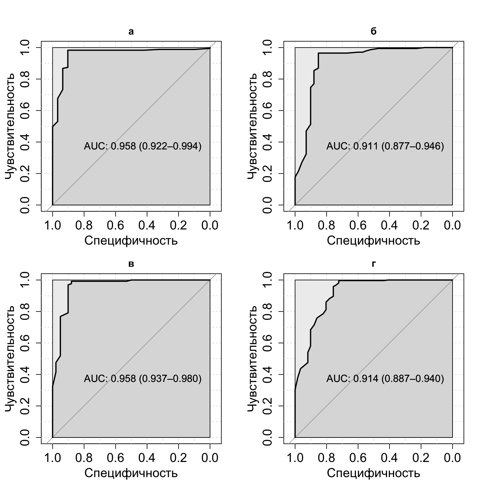
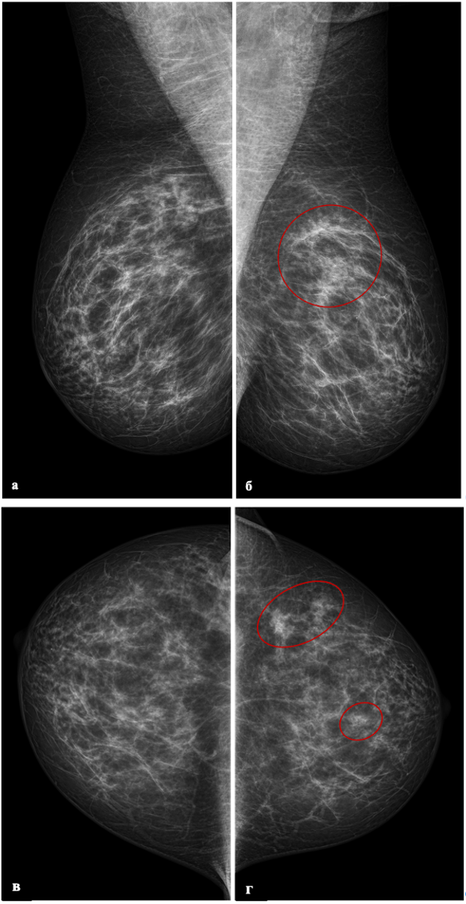
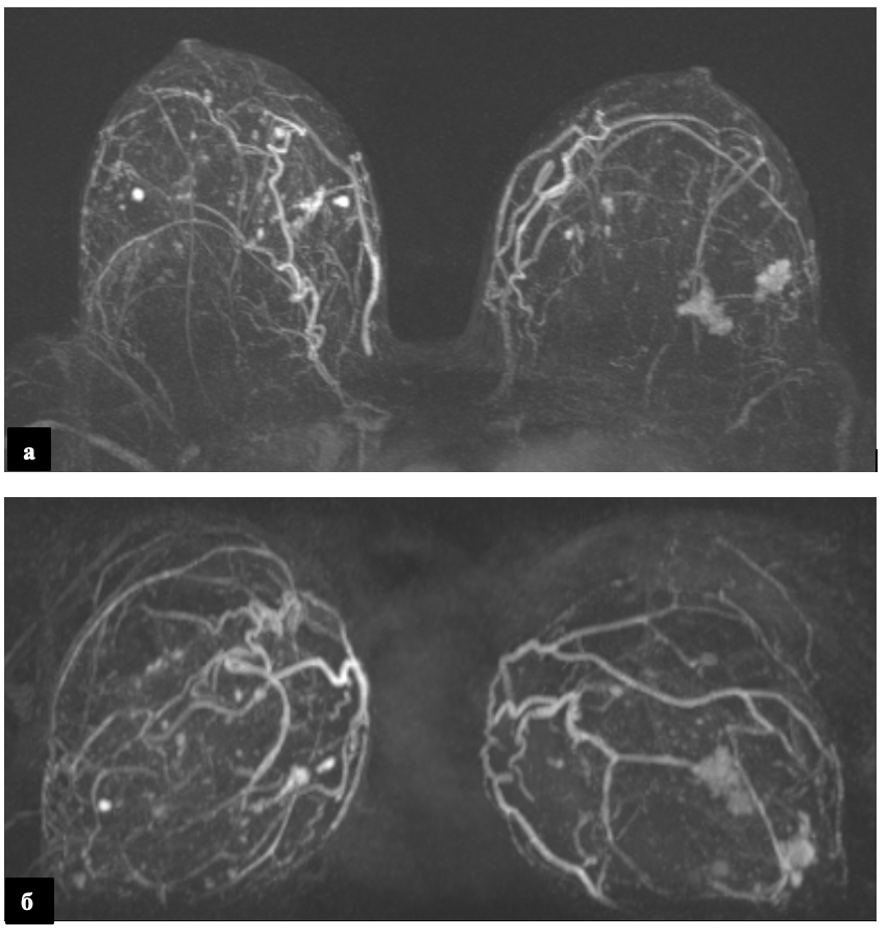

```{r echo=FALSE, message=FALSE}
library(knitr)
library(tidyverse)
library(readr)
library(flextable)

```

# ГЛАВА 4. ДИАГНОСТИЧЕСКАЯ ЭФФЕКТИВНОСТЬ АВТОМАТИЗИРОВАННОГО УЗИ ВСЕЙ МОЛОЧНОЙ ЖЕЛЕЗЫ ПРИ РАКЕ МОЛОЧНОЙ ЖЕЛЕЗЫ У ПАЦИЕНТОК 40 ЛЕТ И СТАРШЕ. {.unnumbered}

## 4.1 Общее Описание результатов исследования УЗИ в выборке 40 лет и старше

На сегодняшний день можно рассмотреть технологию автоматизированная 3D-УЗИ молочной железы (3D-УЗИ) в качестве дополнительного скрининга у женщин с типом строения молочной железы C и D по ACR в группе 40 лет и старше.
В отличие от 2D-УЗИ, метод имеет стандартизированный протокол сбора данных, который может выполняться медицинским персоналом со средним образованием после короткого обучения без необходимости участия высококвалифицированных специалистов во время обследования.
3D-УЗИ позволяет получать большие трехмерные объемы данных, которые могут быть оценены в нескольких плоскостях: корональной, поперечной и сагиттальной.
Очаговые изменения можно увидеть на нескольких срезах, что облегчает восприятие.
Исследование технологии 3D-УЗИ является перспективным направлением улучшения алгоритмов и подходов при скрининге рака молочной железы.
В настоящей главе был проведен сравнительный анализ диагностической эффективности, а именно чувствительности, специфичности и точности 2D-УЗИ в B-режиме, автоматизированного объемного сканирования молочных желез (3D-УЗИ), и маммографического скрининга у женщин в возрастной группе 40 лет и старше лет с неоднородной и высокой плотностью тканей молочной железы.

Всего в исследование вошло 1283 пациентов.
Гистологически поставлен рак в 13.48% (173/1283).
На рисунке № 17 представлено распределение пациенток при скрининге.


Рисунок 17 - Распределение поставленных категорий BI-RADS после выполнения 2D УЗИ и количество пациентов, которым была выполнена биопсия

### 4.2. Автоматизированное объемное ультразвуковое сканирование молочных желез

В выборке пациенток 40 лет и старше трехмерное ультразвуковое исследование выполнено в 51,05% случаев (655/1283).
Кожа оставалась не измененной у подавляющего большинства обследованных (99,39%, 651/655), утолщение кожи отмечено лишь в 0,61% (4/655).
Симптом ретракции наблюдался в 19,39% случаев (127/655).

Новообразования выявлены у 37,86% пациенток (248/655).
При оценке размеров узлов преобладали образования 1,1–1,5 см (30,65%, 76/248) и 0,5–1,0 см (27,02%, 67/248).
Реже встречались узлы 1,5–2,0 см (22,58%, 56/248), 2,5–3,0 см (12,1%, 30/248), 2,1–2,5 см (6,45%, 16/248) и более 3 см (1,21%, 3/248).

Анализ контуров выявленных образований показал преобладание неровных контуров (46,77%, 116/248), тогда как ровные контуры отмечены в 31,45% случаев (78/248).
Реже визуализировались нечеткие контуры (7,26%, 18/248), участки нарушения архитектоники (6,05%, 15/248), волнистые (5,65%, 14/248) и полициклические контуры (2,82%, 7/248).
Подавляющее большинство образований имели гипоэхогенную структуру (95,56%, 237/248), значительно реже встречались образования смешанной эхогенности (3,23%, 8/248) и анэхогенные (1,21%, 3/248).

Структура узлов в половине случаев была неоднородной (56,05%, 139/248), однородная структура отмечена в 41,13% (102/248).
В единичных наблюдениях визуализировались внутрикистозные пристеночные разрастания (1,61%, 4/248) и кальцинаты в структуре узлов (1,21%, 3/248).
Преимущественно определялись одиночные узлы (83,87%, 208/248), множественные образования встречались значительно реже: два узла — в 9,27% (23/248), три узла — в 2,82% (7/248), более трех узлов — в 4,03% случаев (10/248).

Распределение по категориям BI-RADS характеризовалось преобладанием категории BI-RADS 2 (67,48%, 442/655).
Категория BI-RADS 5 установлена в 12,98% (85/655), BI-RADS 3 — в 7,18% (47/655), BI-RADS 4а — в 3,66% (24/655), BI-RADS 4b — в 3,51% (23/655), BI-RADS 4c — в 2,14% (14/655) и BI-RADS 1 — в 3,05% случаев (20/655).
Кальцинаты различного типа определялись в 12,21% наблюдений (80/655).
(Таблица 14н).

```{r echo=FALSE}
tbl_14n <- read.csv("tbl/chapter_4/tbl_14n.csv", stringsAsFactors = FALSE)
colnames(tbl_14n) <- c("Показатель","Значение","Группа D")
tbl_14n %>%
  flextable() %>%
  merge_v(j = c(1,5)) %>% 
  set_caption("Таблица 14n - Характеристика результатов 3D УЗИ у пациенток 40 лет и старше: общие показатели, особенности выявленных образований, распределение по категориям BI-RADS и заключительным УЗ-диагнозам") %>%
  theme_zebra() %>%
  autofit()
```

## 4.2 Характеристика результатов по группам

При ультразвуковом исследовании в группе С кожа оставалась не измененной у всех пациенток (100%, 628/628), тогда как в группе D не измененная кожа наблюдалась в 98,93% (648/655), а утолщение кожи отмечено в 1,07% случаев (7/655).
УЗ-фон в обеих группах характеризовался преобладанием железистой ткани (группа С — 53,34%, 335/628; группа D — 58,32%, 382/655) и фиброзно-кистозной мастопатии (группа С — 46,66%, 293/628; группа D — 41,68%, 273/655).

Анализ локализации выявленных образований показал, что в группе С они чаще располагались в верхненаружном (31,3%, 36/115) и верхневнутреннем (20%, 23/115) квадрантах.
В группе D доминировала локализация в верхненаружном квадранте (46,94%, 115/245), реже образования визуализировались в верхневнутреннем квадранте (13,47%, 33/245) и на границе квадрантов.
При оценке формы узлов в группе С преобладали овальные образования (58,26%, 67/115), тогда как в группе D чаще встречались узлы неправильной формы (50,2%, 123/245).
Детальные характеристики расположения и формы образований представлены в Таблице 14.

Размеры узлов в группе С наиболее часто составляли 0,5–1,0 см (33,91%, 39/115) и 1,5–2,0 см (33,91%, 39/115).
В группе D преобладали образования размером 0,5–1,0 см (29,39%, 72/245) и 1,1–1,5 см (28,98%, 71/245).
Контуры образований в группе С преимущественно были ровными (55,65%, 64/115), тогда как в группе D чаще визуализировались неровные контуры (35,1%, 86/245) и звездчатые края (15,1%, 37/245).
По эхогенности в обеих группах доминировали гипоэхогенные образования (группа С — 93,04%, 107/115; группа D — 94,29%, 231/245).

Структура узлов в группе С была однородной в 49,57% (57/115) и неоднородной в 47,83% (55/115).
В группе D неоднородная структура отмечена у 22,44% (147/655) образований, однородная — у 14,96% (98/655).
Количество узлов в группе С в 74,78% (86/115) случаев было представлено солитарными образованиями, в группе D одиночные узлы встречались в 83,67% (205/245).
При оценке кровотока в группе С чаще регистрировался интранодулярный тип (34,78%, 40/115), тогда как в группе D интранодулярный кровоток наблюдался в 44,49% (109/245).
Результаты эластографии показали преобладание 0 и 2 эластотипов в обеих группах (Таблица 14).

Таблица 14 - Кожа при выполнении 2D УЗИ, локализация, форма, размер, края, эхогенность образования, УЗ-структура образования, количество найденных узлов, кровоток в образовании, результаты эластографии при УЗ исследовании в группах C и D.

```{r echo=FALSE}
tbl_14 <- read.csv("tbl/chapter_4/tbl_14.csv", stringsAsFactors = FALSE)
colnames(tbl_14) <- c("Показатель","Значение","Группа C","Группа D")
tbl_14 %>%
  flextable() %>%
  merge_v(j = c(1,5)) %>% 
  set_caption("Таблица 14 - Кожа при выполнении 2D УЗИ, локализация, форма, размер, края, эхогенность образования, УЗ-структура образования, количество найденных узлов, кровоток в образовании, результаты эластографии при УЗ исследовании в группах C и D.") %>%
  theme_zebra() %>%
  autofit()
```

При оценке регионарных лимфоузлов в группе С неизмененные лимфоузлы наблюдались в 97,77% (614/628), увеличение в левой подключичной области отмечено в 0,48% (3/628), в левой аксиллярной области — в 0,64% (4/628), в правой надключичной области — в 1,11% (7/628).
В группе D неизмененные лимфоузлы выявлены в 95,88% (628/655), увеличение в левой подключичной области — в 0,46% (3/655), в правой надключичной области — в 2,14% (14/655), в правой аксиллярной области — в 1,53% (10/655).

Распределение по категориям BI-RADS в группе С характеризовалось преобладанием категории BI-RADS 2 (84,55%, 531/628).
Категория BI-RADS 1 установлена в 1,75% (11/628), BI-RADS 3 — в 6,69% (42/628), BI-RADS 4а — в 2,55% (16/628), BI-RADS 4b — в 1,11% (7/628), BI-RADS 4c — в 1,75% (11/628), BI-RADS 5 — в 1,59% (10/628).
В группе D категория BI-RADS 2 составила 66,56% (436/655), BI-RADS 1 — 2,75% (18/655), BI-RADS 3 — 8,4% (55/655), BI-RADS 4а — 5,5% (36/655), BI-RADS 4b — 4,58% (30/655), BI-RADS 4c — 2,6% (17/655), BI-RADS 5 — 9,62% (63/655).

Анализ заключительных УЗ-диагнозов выявил, что в группе С наиболее часто диагностировались фиброзно-кистозная мастопатия (49,68%, 312/628), диффузный фиброаденоматоз (23,09%, 145/628) и фиброаденома единичная (6,69%, 42/628).
Реже встречались образование Ca (5,41%, 34/628), отсутствие патологии (3,34%, 21/628), мультицентричный рак (2,23%, 14/628), множественные фиброаденомы (3,66%, 23/628), киста (1,59%, 10/628), сложная киста (1,59%, 10/628), внутрипротоковая папиллома (0,96%, 6/628), локализованный фиброаденоматоз (0,64%, 4/628) и интрамаммарный лимфоузел (0,48%, 3/628).
В группе D структура диагнозов распределилась следующим образом: фиброзно-кистозная мастопатия — 36,34% (238/655), диффузный фиброаденоматоз — 21,07% (138/655), образование Ca — 18,17% (119/655), фиброаденома единичная — 10,08% (66/655), мультицентричный рак — 3,05% (20/655), отсутствие патологии — 2,29% (15/655), локализованный фиброаденоматоз — 2,29% (15/655), множественные фиброаденомы — 2,29% (15/655), кисты — 1,22% (8/655), киста — 1,07% (7/655), мультифокальный рак — 1,07% (7/655), сложная киста — 0,61% (4/655) и цистаденопапиллома — 0,46% (3/655).

Кальцинаты в группе С отсутствовали в 96,02% (603/628), определялись в 2,23% (14/628), микрокальцинаты выявлены в 1,75% (11/628).
В группе D кальцинаты отсутствовали в 87,33% (572/655), определялись в 5,65% (37/655), макрокальцинаты обнаружены в 2,29% (15/655), микрокальцинаты — в 4,73% (31/655).
Ультразвуковой диагноз злокачественного образования в группе С был установлен в 7,64% (48/628) случаев, в группе D — в 22,29% (146/655) (Таблица 15).

Таблица 15 - Результаты оценки регионарных лимфоузлов, определение категории BIRADS, определение кальцинатов, злокачественного новообразования при УЗ исследовании в группах C и D.

```{r echo=FALSE}
tbl_15 <- read.csv("tbl/chapter_4/tbl_15.csv", stringsAsFactors = FALSE)
colnames(tbl_15) <- c("Показатель","Значение","Группа C","Группа D")
tbl_15 %>%
  flextable() %>%
  merge_v(j = c(1,5)) %>% 
  set_caption("Таблица 15 - Результаты оценки регионарных лимфоузлов, определение категории BIRADS, определение кальцинатов, злокачественного новообразования при УЗ исследовании в группах C и D.") %>%
  theme_zebra() %>%
  autofit()
```

### 4.2.2 Исследование ММГ

При маммографическом исследовании в группе С кожа была не изменена во всех случаях (100%, 628/628), тогда как в группе D не измененная кожа наблюдалась в 98,01% (642/655), диффузное утолщение отмечено в 0,92% (6/655), локальное — в 1,07% (7/655).
Ареола в группе С оставалась не измененной в 100% (628/628), в группе D — в 98,93% (648/655), деформация ареолы выявлена в 0,61% (4/655), подтянутость — в 0,46% (3/655).
Сосок в группе С был не изменен в 98,81% (621/628), втянут в 0,48% (3/628), отечен в 0,64% (4/628); в группе D не измененный сосок наблюдался в 97,4% (638/655), втянутый — в 2,6% (17/655).

ММГ-фон в обеих группах характеризовался преобладанием железистой ткани (группа С — 58,6%, 368/628; группа D — 58,47%, 383/655) и диффузной фиброзно-кистозной мастопатии (группа С — 39,65%, 249/628; группа D — 40,31%, 264/655).
Узлы были выявлены в группе С в 8,28% (52/628), в группе D — в 22,29% (146/655).
Среди выявленных узлов в группе С преобладали ровные (53,85%, 28/52) и фокусы уплотнения (19,23%, 10/52), в группе D — ровные (28,77%, 42/146), неровные (21,92%, 32/146), лучистые (20,55%, 30/146) и фокусы уплотнения (15,07%, 22/146).
Края узлов в группе С чаще были четкими (48,08%, 25/52) или нечеткими (38,46%, 20/52), в группе D преобладали нечеткие края (57,53%, 84/146).

Размеры узлов в группе С наиболее часто составляли 1,6–2,0 см (38,46%, 20/52) и 1,1–1,5 см (23,08%, 12/52); в группе D преобладали узлы 1,1–1,5 см (26,71%, 39/146), 0,5–1,0 см (23,97%, 35/146) и 1,6–2,0 см (23,29%, 34/146).
В группе С во всех случаях определялся один узел (100%, 52/52), в группе D один узел выявлен в 95,89% (140/146), два узла и множественные — по 2,05% (3/146).
Кальцификаты отсутствовали в группе С в 89,65% (563/628), в группе D — в 77,25% (506/655); единичные мелкие кальцификаты встречались в 4,62% (29/628) и 11,76% (77/655) соответственно, полиморфные — в 1,59% (10/628) и 3,82% (25/655) (Таблица 16).

Таблица 16 - Кожный покров, ареола, форма узла, края узлов, размер узлов, количество визуализируемых образований, количество визуализируемых образований, количество узлов, сосок, фон, количество найденых узлов, кальльцификаты при ММГ исследовании в группах C и D.

```{r echo=FALSE}
tbl_16 <- read.csv("tbl/chapter_4/tbl_16.csv", stringsAsFactors = FALSE)
colnames(tbl_16) <- c("Показатель","Значение","Группа C","Группа D")
tbl_16 %>%
  flextable() %>%
  merge_v(j = c(1,5)) %>% 
  set_caption("Таблица 16 - Кожный покров, ареола, форма узла, края узлов, размер узлов, количество визуализируемых образований, количество визуализируемых образований, количество узлов, сосок, фон, количество найденых узлов, кальльцификаты при ММГ исследовании в группах C и D.") %>%
  theme_zebra() %>%
  autofit()
```

При ММГ аксиллярные лимфоузлы не визуализировались в 85,5% в обеих группах, не увеличены в 13,5%.
Вторичные изменения отмечены в группе С в 0,48%, в группе D — в 0,92%.

Категория BI-RADS 2 преобладала в обеих группах: 94,4% в группе С и 76,5% в группе D.
BI-RADS 5 чаще встречался в группе D (2,1% против 0,6%).

В заключениях ММГ доминировал диффузный фиброаденоматоз (группа С — 90%, группа D — 75%).
Susp Ca выявлялся в 3,7% в группе С и в 12,2% в группе D.
ММГ-диагноз злокачественного образования подтвержден в 3,7% в группе С и в 12,2% в группе D (Таблица 17).

Таблица 17 - Аксиллярные лимфоузлы при ММГ исследовании, категория BI-RADS, заключение, злокачественное новообразование по результатам выполнения ММГ в группах C и D.

```{r echo=FALSE}
tbl_17 <- read.csv("tbl/chapter_4/tbl_17.csv", stringsAsFactors = FALSE)
colnames(tbl_17) <- c("Показатель","Значение","Группа C","Группа D")
tbl_17 %>%
  flextable() %>%
  merge_v(j = c(1,5)) %>% 
  set_caption("Таблица 17 - Аксиллярные лимфоузлы при ММГ исследовании, категория BI-RADS, заключение, злокачественное новообразование по результатам выполнения ММГ в группах C и D.") %>%
  theme_zebra() %>%
  autofit()
```

### 4.2.3 Исследование МРТ

По данным МРТ, в группе С интраммарные лимфоузлы визуализировались в 59,52% (25/42), сегментарно-протоковая зона контрастирования — в 40,48% (17/42).
В группе D эти показатели составили 60% (33/55) и 40% (22/55) соответственно (Таблица 18).

При оценке количества узлов в группе С один узел определялся в 80,95% (34/42), два узла — в 14,29% (6/42), узлы не визуализировались в 4,76% (2/42).
В группе D один узел выявлен в 72,73% (40/55), два узла — в 12,73% (7/55), три узла — в 1,82% (1/55), множественные узлы — в 5,45% (3/55), узлы не определялись в 7,27% случаев (4/55) (Таблица 18).

Таблица 18 - Данные МРТ и Количество узлов на МРТ в группах C и D.

```{r echo=FALSE}
tbl_18 <- read.csv("tbl/chapter_4/tbl_18.csv", stringsAsFactors = FALSE)
colnames(tbl_18) <- c("Показатель","Значение","Группа C","Группа D")
tbl_18 %>%
  flextable() %>%
  merge_v(j = c(1,5)) %>% 
  set_caption("Таблица 18 - Данные МРТ и Количество узлов на МРТ в группах C и D.") %>%
  theme_zebra() %>%
  autofit()
```

### 4.2.4 Гистологическая оценка

При гистологическом исследовании в группе С все злокачественные образования (100%, 17/17) были представлены инвазивным раком неспециального типа.
В группе D структура распределилась следующим образом: инвазивный рак неспециального типа — 82,14% (69/84), инвазивный дольковый рак — 9,52% (8/84), протоковый рак in situ — 8,33% (7/84).

Цитологическое заключение в группе С выявило цистаденопапиллому в 70% (7/10) и интрадуктальную папиллому в 30% (3/10).
В группе D преобладали фиброзно-кистозные изменения (100%, 10/10), из них в 60% (6/10) — фиброзно-кистозный характер, в 40% (4/10) — фиброзно-кистозные изменения.

При иммуногистохимическом исследовании в группе С преобладал фенотип РЭ+РП+Her-2_neu негатив (64,71%, 11/17), рецепторы РЭ и РП определялись по отдельности в 17,65% (3/17).
В группе D доминировал фенотип РЭ+РП (62,96%, 51/81), РЭ+РП+Her-2_neu негатив выявлен в 16,05% (13/81), негативный фенотип — в 9,88% (8/81), Her-2_neu и РЭ+РП+Her-2_neu — по 3,7% (3/81).

Гистологически злокачественные образования подтверждены в группе С в 4,94% (31/628), в группе D — в 21,68% (142/655).
Оценка степени злокачественности показала, что в группе С преобладала умеренная степень (II — 58,82%, 10/17), высокая степень (III) отмечена в 41,18% (7/17).
В группе D также чаще встречалась умеренная степень (II — 61,9%, 52/84), низкая степень (I) выявлена в 17,86% (15/84), высокая (III) — в 20,24% (17/84) (Таблица 19).

Таблица 19 - Морфологическая структура гистопрепаратов, цитологическое исследование материалов, определение рецепторов опухоли, гистологическое подтверждение злокачественного образования, определение злокачественности новообразования в группах C и D.

```{r echo=FALSE}
tbl_19 <- read.csv("tbl/chapter_4/tbl_19.csv", stringsAsFactors = FALSE)
colnames(tbl_19) <- c("Показатель","Значение","Группа C","Группа D")
tbl_19 %>%
  flextable() %>%
  merge_v(j = c(1,5)) %>% 
  set_caption("Таблица 19 - Морфологическая структура гистопрепаратов, цитологическое исследование материалов, определение рецепторов опухоли, гистологическое подтверждение злокачественного образования, определение злокачественности новообразования в группах C и D.") %>%
  theme_zebra() %>%
  autofit()
```

## 4.3 Определение чувствительности, спецефичности и точности методов

В возрастной группе 40 лет и старше был проведен сравнительный анализ диагностической эффективности маммографии, 2D-УЗИ и 3D-УЗИ. Маммография в группе С продемонстрировала высокую общую точность (0,96) при отличной специфичности (0,99), однако чувствительность оказалась крайне низкой — всего 0,52, что означает выявление лишь половины злокачественных образований. Сбалансированная точность (0,75) значительно ниже общей, что указывает на дисбаланс классов и ограниченную эффективность метода для выявления рака. В группе D маммография показала самую низкую общую точность (0,89) при сохранении высокой специфичности (0,99) и низкой чувствительности (0,54). Положительная прогностическая ценность достигла 0,95 — при положительном результате ММГ вероятность заболевания высока, однако метод пропускает 46% случаев рака. В объединенной выборке 40 лет и старше маммография заняла промежуточное положение с точностью 0,93, чувствительностью 0,53 и специфичностью 0,99. Низкая чувствительность (0,52-0,54) является общим ограничением всех маммографических методов в данной возрастной группе.

Ультразвуковые методы продемонстрировали принципиально более высокую эффективность. 2D-УЗИ в группе С показало высокую точность (0,96) и отличную чувствительность (0,9), значительно превосходящую маммографию, при специфичности 0,97 и сбалансированной точности 0,93. Обращает внимание низкая положительная прогностическая ценность (0,58), что связано с большим количеством ложноположительных результатов в этой группе. В группе D 2D-УЗИ продемонстрировало сопоставимые результаты: точность 0,95, чувствительность 0,9, специфичность 0,96, сбалансированная точность 0,93. Положительная прогностическая ценность оказалась значительно выше, чем в группе С (0,88 против 0,58), что указывает на более точную верификацию положительных результатов. В объединенной выборке 40 лет и старше 2D-УЗИ показало стабильные результаты: точность 0,96, чувствительность 0,9, специфичность 0,97, сбалансированная точность 0,93 при положительной прогностической ценности 0,8 и отрицательной — 0,98.

Наилучшие результаты среди всех методов в возрастной группе 40 лет и старше продемонстрировало 3D-УЗИ в группе D. Метод показал наивысшую точность (0,97), максимальную чувствительность (0,9) на уровне лучших показателей 2D-УЗИ, отличную специфичность (0,99) и наивысший коэффициент Каппа (0,9), свидетельствующий о почти полном согласии с гистологическим заключением. Положительная прогностическая ценность достигла 0,97 — при положительном результате вероятность заболевания составляет 97%, а сбалансированная точность (0,94) стала наилучшей среди всех методов.

Таким образом, в возрастной группе 40 лет и старше маммография характеризуется высокой специфичностью, но крайне низкой чувствительностью, что ограничивает ее самостоятельное применение для скрининга. Ультразвуковые методы демонстрируют принципиально более высокую чувствительность (0,9) при сопоставимой специфичности. Наиболее эффективным методом диагностики является 3D-УЗИ, обеспечивающее оптимальное сочетание высокой чувствительности и специфичности, максимальную прогностическую ценность и наилучшее согласие с гистологическими заключениями.

Подробные результаты по методам представлена в таблице №20.

Таблица 20 - Определение точности, P-уровня значимости модели, коэффициент Kappa, Тест Макнемара, чувствительности, специфичности и отбалансированной точности в группах C и D (Т -Точность, P - P-Value, КК - Коэффициент Kappa, ТМ -Тест Макнемара, ППЦ - положительная прогностическая ценность, ОПЦ - отрицательная прогностическая ценность, Ч-Чувствительность, Сп -Специфичность, ОТ- Отбалансированная точность)

```{r echo=FALSE}
tbl_20 <- read.csv("tbl/chapter_4/tbl_20.csv", stringsAsFactors = FALSE)
colnames(tbl_20) <- c("Метод","Т","P","КК","ТМ","ППЦ","ОПЦ","Ч","Сп","ОТ")
tbl_20 %>%
  flextable() %>%
  merge_v(j = c(1)) %>% 
  set_caption("Таблица 20 - Определение точности, P-уровня значимости модели, коэффициент Kappa, Тест Макнемара, чувствительности, специфичности и отбалансированной точности в группах C и D (Т -Точность, P - P-Value, КК - Коэффициент Kappa, ТМ -Тест Макнемара, ППЦ - положительная прогностическая ценность, ОПЦ - отрицательная прогностическая ценность, Ч-Чувствительность, Сп -Специфичность, ОТ- Отбалансированная точность)") %>%
  theme_zebra() %>%
  autofit()
```


*Сравнительная характеристика ультразвуковых методов*

Чувствительность методов оказалась сопоставимой. УЗИ правильно выявило 85,2% злокачественных образований (121 из 142), а 3D УЗИ — 88,0% (125 из 142). Разница в 2,8% не достигла статистической значимости (p=0,480), что может быть связано с недостаточным объемом выборки пациентов с подтвержденным заболеванием. Тем не менее, 3D УЗИ диагностировало на 4 случая рака больше.

Специфичность 3D УЗИ оказалась значимо выше (99,2% против 96,5%, p=0,004). Это означает, что трехмерный метод реже дает ложноположительные результаты: только 4 случая против 18 у стандартного УЗИ среди 513 здоровых пациенток. Разница в 2,7% является статистически значимой и имеет важное клиническое значение, так позволяет снизить количество ненужных биопсий и дополнительных обследований.

Общая точность 3D УЗИ также значимо выше (96,8% против 94,0%, p=0,021). При помощи 3D УЗИ правильно классифицировало 634 из 655 пациенток, тогда как стандартное УЗИ — только 616. Разница в 2,8% статистически значима (p-уровень = 	0,021).


```{r echo=FALSE}
tbl_20n1 <- read.csv("tbl/chapter_4/tbl_20n1.csv", stringsAsFactors = FALSE)
colnames(tbl_20n1) <- c("Показатель","УЗИ","3D УЗИ","Разница","p-уровень")
tbl_20n1 %>%
  flextable() %>%
  merge_v(j = c(1)) %>% 
  set_caption("Таблица 20 - ") %>%
  theme_zebra() %>%
  autofit()
```

*Сравнительная характеристика автомматического обемного ультразвукового сканирования и маммографии*

Чувствительность 2D УЗИ значительно превосходит маммографию: 85,2% против 53,5% (разница 31,7%, p < 0,001). УЗИ правильно выявляет на 45 случаев рака больше (121 против 76). Это статистически значимое преимущество — маммография пропускает почти каждый второй случай злокачественного образования (46,5%), тогда как УЗИ пропускает только 15%.

Специфичность маммографии оказалась выше: 99,2% против 96,5% (разница 2,7%, p=0,004). Маммография дает меньше ложноположительных результатов (4 против 18), что снижает количество ненужных биопсий и дополнительных обследований. Разница небольшая, но статистически значимая.

Общая точность УЗИ значимо выше, а именно 94,0% против 89,3% (разница 4,7%, p < 0,001). УЗИ правильно классифицирует на 31 пациентку больше (616 против 585), несмотря на несколько большее количество ложноположительных результатов.

```{r echo=FALSE}
tbl_20n2 <- read.csv("tbl/chapter_4/tbl_20n2.csv", stringsAsFactors = FALSE)
colnames(tbl_20n2) <- c("Показатель","УЗИ","ММГ","Разница","p-уровень")
tbl_20n2 %>%
  flextable() %>%
  merge_v(j = c(1)) %>% 
  set_caption("Таблица 20 - ") %>%
  theme_zebra() %>%
  autofit()
```

*Сравнительная характеристика классического ультразвукового исследования*

Чувствительность 3D УЗИ более маммографию: 88,0% против 53,5% (разница +34,5%, p < 0,001). Трехмерное УЗИ правильно выявляет на 49 случаев рака больше (125 против 76). Это колоссальное клиническое преимущество — маммография пропускает 46,5% злокачественных образований, тогда как 3D УЗИ — только 12%.

Специфичность обоих методов идентична — 99,2% (509/513). Оба метода дают одинаковое количество ложноположительных результатов (4 случая), различия полностью отсутствуют (p=1,000).

Общая точность 3D УЗИ значимо выше: 96,8% против 89,3% (разница +7,5%, p < 0,001). Трехмерное УЗИ правильно классифицирует на 49 пациенток больше (634 против 585).

```{r echo=FALSE}
tbl_20n3 <- read.csv("tbl/chapter_4/tbl_20n3.csv", stringsAsFactors = FALSE)
colnames(tbl_20n3) <- c("Показатель","УЗИ","ММГ","Разница","p-уровень")
tbl_20n3 %>%
  flextable() %>%
  merge_v(j = c(1)) %>% 
  set_caption("Таблица 20 - ") %>%
  theme_zebra() %>%
  autofit()
```

## 4.4 Прогностическая оценка методов

На основании полученных данных, была построена предсказательная модель изучаемых методов (Рисунок № 19, Таблица №21).



Рисунок 19 - a ROC-кривая предсказательной модели для метода 2D-УЗИ, по данным полученным в группе C;
б - ROC-кривая предсказательной модели для метода 2D-УЗИ, по данным полученным в группе D; в - ROC-кривая предсказательной модели для метода 3D-УЗИ, по данным полученным в группе D; г - ROC-кривая предсказательной модели для метода 2D-УЗИ, по данным полученным в выборке пациенток 40 лет и старше.

Таблица 21 - Определение площади под кривой представленных предсказательных моделей метода в группах C и D.

```{r echo=FALSE}
tbl_21 <- read.csv("tbl/chapter_4/tbl_21.csv", stringsAsFactors = FALSE)
colnames(tbl_21) <- c("Метод","Площадь под кривой")
tbl_21 %>%
  flextable() %>%
  merge_v(j = c(1)) %>% 
  set_caption("Таблица 21 - Определение площади под кривой представленных предсказательных моделей метода в группах C и D.
") %>%
  theme_zebra() %>%
  autofit()
```

## 4.5 Клинические примеры

**Клинический случай №2**

Пациентка Д., 62 года.
Уплотнение в левой молочной железе.
Анамнез не отягощен.

В левой молочной железе ВНК пальпируется зона уплотнения без четких контуров, по структуре схожее с железистой тканью размером 2,5 х 2,0 см.

Рентгеновская маммография представлена на рисунке №20.



Рисунок 20 - Цифровая маммография обеих молочных желез, а косая, б медиолатеральная проекция, в, г краниокаудальная проекция.

Рентгенологические признаки диффузного фиброаденоматоза молочных желез, в левой молочной железе образований - кисты?
Локализованный аденоз?
Тип С по ACR.
MD BI-RADS 2, MS BI-RADS 3.

Автоматизированное 3D ультразвуковое сканирование молочных желез представлено на рисунке №21.


Рисунок 21 - Система 3D-УЗИ.
Анализ 3D-данных на ультразвуковом аппарате.

При сканировании молочных желез в трех проекциях в наружных квадрантах выявлено три очаговых образований с симптомом ретракции.
MD BI-RADS 2, MS BI-RADS 4С.

Ультразвуковое исследование представлено на рисунке №22.


Рисунок 22 - Эхограмма левой молочной железы: а - ВНК определяется образование неправильной формы; б - ВНК определяется гипоэхогенный участок нарушения архитектоники.
в, г Эхограмма левой молочной железы.
В режиме эластографии картируется эластотип N4-однотонный синий.
Коэффициент деформации - 4,1.

Ультразвуковые признаки образований левой молочной железы в ВНК.
Ультразвуковая оценка BI-RADS справа 2/слева 4В.

Рекомендовано МРТ молочных желез с контрастным усилением для оценки распространенности процесса, результаты исследований представлены на рисунке № 23



Рисунок 23 - а, б.
МРТ молочных желез с контрастным усилением.

Мультиочаговое поражение в ВНК левой молочной железе.
MD BI-RADS 2, MS BI-RADS 5.

По результатам гистологического исследования инвазивный дольковый рак молочной железы, G2.
Показано оперативное лечение.

## 4.6 Резюме

Проведенное исследование продемонстрировало высокую диагностическую эффективность автоматизированного 3D-УЗИ молочных желез у пациенток 40 лет и старше с неоднородной и высокой плотностью тканей (типы С и D по ACR). В возрастной группе 40 и старше маммография характеризуется высокой специфичностью (99,2%), но крайне низкой чувствительностью (53,5%), что ограничивает ее самостоятельное применение для скрининга и приводит к пропуску 46,5% случаев рака. Ультразвуковые методы демонстрируют принципиально более высокую чувствительность (85-88%) при сопоставимой специфичности (96-99%).

При сравнительном анализе ультразвуковых методов установлено, что 3D-УЗИ значимо превосходит 2D-УЗИ по специфичности (99,2% против 96,5%, p=0,004) и общей точности (96,8% против 94,0%, p=0,021), позволяя снизить количество ложноположительных результатов с 18 до 4 случаев. Чувствительность методов сопоставима (88,0% против 85,2%, p=0,480), однако 3D-УЗИ диагностирует на 4 случая рака больше.

Сравнение 3D-УЗИ с маммографией выявило драматическое преимущество трехмерного метода по чувствительности (88,0% против 53,5%, p < 0,001) при идентичной специфичности (99,2%). 3D-УЗИ правильно выявляет на 49 случаев рака больше, сокращая пропущенные случаи с 66 до 17. Общая точность 3D-УЗИ также значимо выше (96,8% против 89,3%, p < 0,001).

Важно подчеркнуть, что 3D-УЗИ и 2D-УЗИ сопоставимы по определяемым размерам образований, что подтверждает надежность трехмерного метода для оценки узловых образований.

Ограничения маммографии у пациенток с плотным типом строения молочных желез, тип С и D по ACR, могут быть эффективно компенсированы дополнением 3D-УЗИ, что существенно повышает выявляемость злокачественных образований. При этом маммография сохраняет свою роль как основной метод выявления протокового рака in situ благодаря превосходству в обнаружении кальцинатов.

Таким образом, автоматизированное 3D-УЗИ является многообещающим методом для интеграции в клиническую практику у женщин 40 лет и старше с плотным типом строения молочных желез. Метод обеспечивает оптимальное сочетание высокой чувствительности и специфичности, максимальную прогностическую ценность и наилучшее согласие с гистологическими заключениями, что позволяет рассматривать его как эффективный дополнительный инструмент в системах скрининга рака молочной железы.