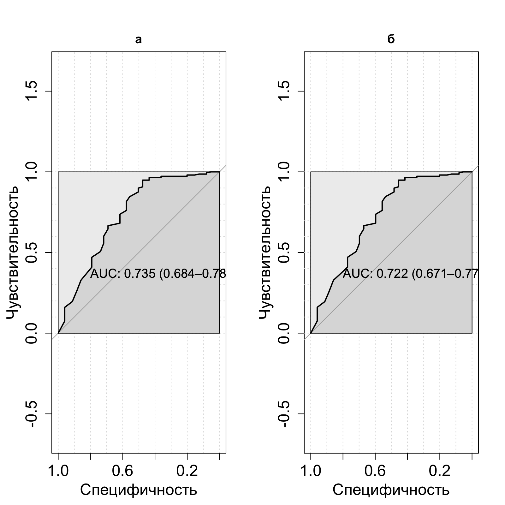
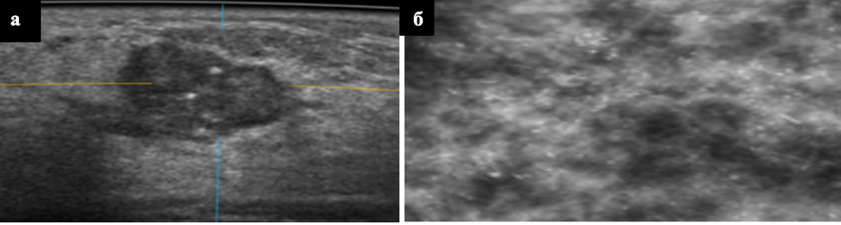

```{r echo=FALSE, message=FALSE}
library(knitr)
library(tidyverse)
library(readr)
library(flextable)

```

# ГЛАВА 5. СРАВНЕНИЕ МЕТОДОВ 2D УЗИ И 3D УЗИ ПО ОТДЕЛЬНЫМ ПОКАЗАТЕЛЯМ {.unnumbered}

В настоящей главе проведено сравнение по отдельным показателям насколько изучаемые методы сопоставимы.
Сравнение проводилось внутри групп B и D, так как именно в этих группах проводились оба изучаемых метода УЗ-диагностики.

В настоящем исследовании мы решили изучить вопрос возможности обнаружения кальцинатов методами 2D УЗИ в режиме MicroPure и автоматизированного объемного сканирования МЖ (ЗD УЗИ).
Обнаружение кальцинатов представленными методами может позволить проводить биопсию без использования стереотаксического наведения, что может положительно повлиять на маршрутизацию пациента и снизить расходы здравоохранения.

## 5.1 Сравнение методов 2D УЗИ и 3D УЗИ внутри группе B

При сравнительном анализе результатов 2D и 3D УЗИ выявлены различия по ряду показателей, детально представленные в Таблице 22. При 2D УЗИ чаще визуализировались ровные края образований (78,41%), тогда как при 3D УЗИ чаще отмечались неровные края (14,34%) и нарушение архитектоники (2,71%). Размеры образования в обеих группах были сопоставимы с преобладанием узлов 1,1-1,5 см и 0,5-1,0 см. Большинство образований в обоих методах имели гипоэхогенную структуру (94,71% и 97,67%). При 3D УЗИ чаще выявлялась неоднородная структура (25,97%) и внутрикистозные разрастания (2,71%). Количество узлов существенно не различалось, в обеих группах преобладали одиночные образования (72,69% и 75,97%), выявляемость кальцинатов была одинаковой (4,64%).

Структура диагнозов различалась: при 2D УЗИ чаще диагностировались фиброаденомы (79,73%) и образование Ca (10,13%), тогда как при 3D УЗИ чаще выявлялись мультифокальный рак (5,43%), фиброзно-кистозная мастопатия (2,71%) и склерозирующий аденоз (2,33%). Распределение категорий BI-RADS также имело особенности: при 2D УЗИ преобладали Birads 2 (32,6%) и 3 (45,81%), при 3D УЗИ — Birads 2 (36,82%) и 3 (42,64%), а Birads 5 чаще встречался при 3D УЗИ (6,98% против 2,64%). Полные данные представлены в Таблице 22.
Таблица №22 - Сравнение методов 2D УЗИ и 3D УЗИ по показателю “Края образования”, “Размер образования”, “Эхогенность образования”, “Структура образования”, “Количество узлов”, “Кальцинаты”, “Категория BIRADS” в группе B.


```{r echo=FALSE}
tbl_22 <- read.csv("tbl/chapter_5/tbl_22.csv", stringsAsFactors = FALSE)
colnames(tbl_22) <- c("Показатель","Значение","2D УЗИ","3D УЗИ")
tbl_22 %>%
  flextable() %>%
  merge_v(j = c(1,5)) %>%  # объединяем все столбцы с 1 по 4
  set_caption("Таблица 23 - Сравнение методов 2D УЗИ и 3D УЗИ по показателю “Края образования”, “Размер образования”, “Эхогенность образования”, “Структура образования”, “Количество узлов”, “Кальцинаты”, “Категория BIRADS” в группе D.") %>%
  theme_zebra() %>%
  autofit()
```

## 5.2 Сравнение методов 2D УЗИ и 3D УЗИ внутри группе D

При 2D УЗИ края образований были ровными в 41,2%, неровными в 35,1%; при 3D УЗИ преобладали неровные края (46,8%) и нарушение архитектоники (6,1%). Размеры узлов в обеих группах были сопоставимы: чаще встречались образования 0,5-1,5 см. По эхогенности доминировали гипоэхогенные структуры (94-96%).

При 2D УЗИ структура была неоднородной в 60%, однородной в 40%; при 3D УЗИ — неоднородной в 56,1%, однородной в 41,1%, внутрикистозные разрастания выявлены в 1,6%, кальцинаты — в 1,2%. В обеих группах преобладали одиночные узлы (около 84%), кальцинаты определялись в 12-13% случаев.

Структура диагнозов различалась: при 2D УЗИ чаще диагностировались образование Ca (46,9%) и фиброаденомы (33,1%), при 3D УЗИ — образование Ca (44,8%), фиброаденомы (35,5%), а также склерозирующий аденоз (5,7%) и мультифокальный рак (2,8%). Подробные данные представлены в Таблице 23.

Таблица 23 - Сравнение методов 2D УЗИ и 3D УЗИ по показателю “Края образования”, “Размер образования”, “Эхогенность образования”, “Структура образования”, “Количество узлов”, “Кальцинаты”, “Категория BIRADS” в группе D.


```{r echo=FALSE}
tbl_23 <- read.csv("tbl/chapter_5/tbl_23.csv", stringsAsFactors = FALSE)
colnames(tbl_23) <- c("Показатель","Значение","2D УЗИ","3D УЗИ")
tbl_23 %>%
  flextable() %>%
  merge_v(j = c(1,5)) %>%  # объединяем все столбцы с 1 по 4
  set_caption("Таблица 23 - Сравнение методов 2D УЗИ и 3D УЗИ по показателю “Края образования”, “Размер образования”, “Эхогенность образования”, “Структура образования”, “Количество узлов”, “Кальцинаты”, “Категория BIRADS” в группе D.") %>%
  theme_zebra() %>%
  autofit()
```


## 5.3 Определение чувствительности, специфичности и точности методов для обнаружения кальцинатов в группе D с построением прогностической модели

В ходе настоящего исследовани я было проведено определние чувтсвительности, спецефичности и точности изучаемых методов для обнаружения кальцинатов в группе D.

2D и 3D УЗИ продемонстрировали практически идентичную диагностическую эффективность в выявлении кальцинатов. Оба метода характеризуются высокой специфичностью (96%), но ограниченной чувствительностью (42-44%), что делает их надежными для подтверждения отсутствия кальцинатов, но недостаточно чувствительными для их уверенного обнаружения. Приоритет в выявлении кальцинатов, особенно микрокальцинатов, сохраняется за маммографией.

Основные результаты изложены в таблице №24.

Таблица 24 - Определение точности, P-уровня значимости модели, коэффициент Kappa, Тест Макнемара, чувствительности, специфичности, положительной прогностической ценности, отрицательной прогностической ценности и отбалансированной точности. (Т -Точность, P - P-Value, КК - Коэффициент Kappa, ТМ -Тест Макнемара, Ч-Чувствительность, Сп -Специфичность, ППЦ - положительная прогностическая ценность, ОПЦ - отрицательная прогностическая ценность, ОТ- Отбалансированная точность)

```{r echo=FALSE}
tbl_24 <- read.csv("tbl/chapter_5/tbl_24.csv", stringsAsFactors = FALSE)
colnames(tbl_24) <- c("Метод","Т","P","КК","ТМ","Ч","Сп","ППЦ","ОПЦ","ОТ")
tbl_24 %>%
  flextable() %>%
  merge_v(j = c(1)) %>%  # объединяем все столбцы с 1 по 4
  set_caption("Таблица 24 - Определение точности, P-уровня значимости модели, коэффициент Kappa, Тест Макнемара, чувствительности, специфичности, положительной прогностической ценности, отрицательной прогностической ценности и отбалансированной точности. (Т -Точность, P - P-Value, КК - Коэффициент Kappa, ТМ -Тест Макнемара, Ч-Чувствительность, Сп -Специфичность, ППЦ - положительная прогностическая ценность, ОПЦ - отрицательная прогностическая ценность, ОТ- Отбалансированная точность)") %>%
  theme_zebra() %>%
  autofit()
```

*Сравнение методов по показателям чувствительности, специфичности и точности*

```{r echo=FALSE}
tbl_24n1 <- read.csv("tbl/chapter_5/tbl_24n1.csv", stringsAsFactors = FALSE)
colnames(tbl_24n1) <- c("Показатель","УЗИ","3D УЗИ","Разница","p-уровень")
tbl_24n1 %>%
  flextable() %>%
  merge_v(j = c(1)) %>% 
  set_caption("Таблица 20 - ") %>%
  theme_zebra() %>%
  autofit()
```

*Прогностическое можелирование*

Для оценки способности ультразвуковых методов прогнозировать наличие кальцинатов в молочных железах была построена модель бинарной логистической регрессии. В качестве зависимой переменной выступало наличие или отсутствие кальцинатов, подтвержденное гистологически, а в качестве предикторов — комплекс ультразвуковых характеристик, выявленных при исследовании. Модель позволяет количественно оценить, насколько точно каждый метод может предсказать наличие кальцинатов у новых пациенток со схожими клиническими и ультразвуковыми параметрами.

2D УЗИ продемонстрировало умеренную прогностическую способность в обнаружении кальцинатов с площадью под кривой 0,735 (95% ДИ: 0,684–0,786). Это означает, что модель на основе 2D УЗИ в 73,5% случаев правильно классифицирует пары "наличие/отсутствие кальцинатов". Доверительный интервал не опускается ниже 0,684, что подтверждает стабильность модели.

3D УЗИ показало сопоставимый результат с AUC 0,722 (95% ДИ: 0,671–0,774), что соответствует 72,2% правильной классификации. Доверительные интервалы обоих методов в значительной степени перекрываются, что указывает на отсутствие статистически значимых различий между ними. Основные результаты представлены в таблице 25 и на рисуноке 24.

 

Рисунок 25 - ROC-кривая предсказательной модели нахождения кальцинатов для метода 2D УЗИ (а) и 3D УЗИ (б)

Таблица 25 - Определение площади под кривой представленных предсказательных моделей нахождения кальцинатов для метода 2D УЗИ и 3D УЗИ.

```{r echo=FALSE}
tbl_25 <- read.csv("tbl/chapter_5/tbl_25.csv", stringsAsFactors = FALSE)
colnames(tbl_25) <- c("Метод",	"Площадь под кривой")
tbl_25 %>%
  flextable() %>%
  merge_v(j = c(1)) %>%  # объединяем все столбцы с 1 по 4
  set_caption("Таблица 25 - Определение площади под кривой представленных предсказательных моделей нахождения кальцинатов для метода 2D УЗИ и 3D УЗИ.") %>%
  theme_zebra() %>%
  autofit()
```

Исходя из полученных данных, был проведен расчет сколько было, верно, найденных кальцинатов, изучаемыми методами. С помощью 2D УЗИ 44% кальцинатов были обнаружены, верно, в то время как с помощью 3D УЗИ кальцинаты были верно обнаружены 42%. При этом с помощью изучаемых методов были обнаружены до 4% кальцинатов там, где их в действительности нет.

## 5.4 Клинические примеры

**Клинический пример 3.** Пациентка Н. 55 лет без жалоб, обратилась планово. На рисунке 26а можно увидеть визуализацию внутрипротоковых кальцинатов в режиме Micro Pure 2D УЗИ. На рисунке 26б на маммографии определяются плеоморфные кальцинаты, расположенные диффузно в наружных квадрантах правой МЖ, заподозрена карцинома in situ. Учитывая визуализацию кальцинатов на ультразвуковом исследовании, в режиме Micro pure выполнена CORE-биопсия по УЗ-наведением, морфологически верифицирована карцинома in situ, G2.


Рисунок 26 - а. Визуализация внутрипротоковых кальцинатов у пациентки 55 лет в режиме Micro Pure – гистологически верифицированный протоковый рак in situ G2- биопсия выполнена под ультразвуковым наведением б. Визуализация кальцинатов на маммографии

Клинический пример 4. Пациентка М., 41 год. Обратилась с жалобами на уплотнение в левой МЖ. Была выполнена ММГ, по результатам которой выявлены диффузно расположенный плеоморфные кальцинаты. Тип строения D по ACR. Узловые образования не определяются. Ca in situ? (Рисунок 27 б). Пациентка направлена на 2D УЗИ для оценки образований. По результатам исследования выявлены множественные узловые образования в верхневнутреннем, верхненаружном, нижневнутреннем квадрантах (Рисунок 27 а). Пациентка направлена на 3D УЗИ -для более четкой оценки мультиочагового процесса. Образования визуализированы, так же визуализированы кальцинаты. Выполнена CORE-биопсия под УЗ-наведением, по результатам которой выявлен инвазивный рак на фоне протокового G3.



Рисунок 27 - а. Визуализация кальцинатов у пациентки 41 года на 3D УЗИ гистологически верифицированный инвазивный рак неспециального типа G3. б. Визуализация кальцинатов на маммографии

## 5.5 Резюме

В настоящем исследовании проведен сравнительный анализ диагностической эффективности 2D УЗИ в режиме MicroPure и автоматизированного 3D УЗИ в обнаружении кальцинатов у женщин 40 лет и старше с неоднородной и высокой плотностью молочных желез (типы С и D по ACR). Полученные результаты демонстрируют сопоставимую эффективность обоих методов.

Чувствительность методов оказалась умеренной и практически идентичной: 44% для 2D УЗИ и 42% для 3D УЗИ (p=0,480). Это означает, что с помощью ультразвуковых методов можно достоверно обнаружить менее половины имеющихся кальцинатов. Специфичность обоих методов составила 96%, а доля ложноположительных результатов не превысила 4%, что подтверждает высокую надежность методов при исключении кальцинатов.

Прогностические модели, построенные на основе логистической регрессии, показали хорошую, но не отличную предсказательную способность: AUC 0,735 для 2D УЗИ и 0,722 для 3D УЗИ. Перекрывающиеся доверительные интервалы подтверждают отсутствие статистически значимых различий между методами.

Клиническая значимость полученных результатов заключается в возможности проведения CORE-биопсии под ультразвуковым наведением при визуализации кальцинатов, что позволяет избежать использования технически более сложного и дорогостоящего стереотаксического наведения. Представленные клинические примеры демонстрируют успешную верификацию как протокового рака in situ, так и инвазивного рака с использованием ультразвуковой навигации.

Важно отметить, что данное исследование является моноцентровым и проведено в специализированном центре, что может ограничивать экстраполяцию результатов на многопрофильные медицинские учреждения. Для подтверждения полученных данных требуются дальнейшие мультицентровые исследования.

Таким образом, 2D УЗИ в режиме MicroPure и автоматизированное 3D УЗИ демонстрируют сопоставимую диагностическую эффективность в выявлении кальцинатов и могут быть использованы для ультразвуковой навигации при проведении биопсии, что упрощает процедуру, снижает затраты и улучшает маршрутизацию пациентов.

