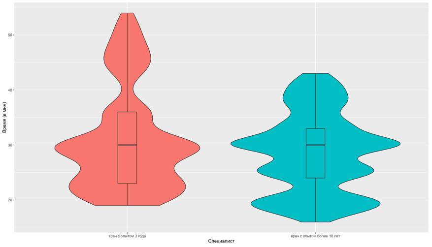
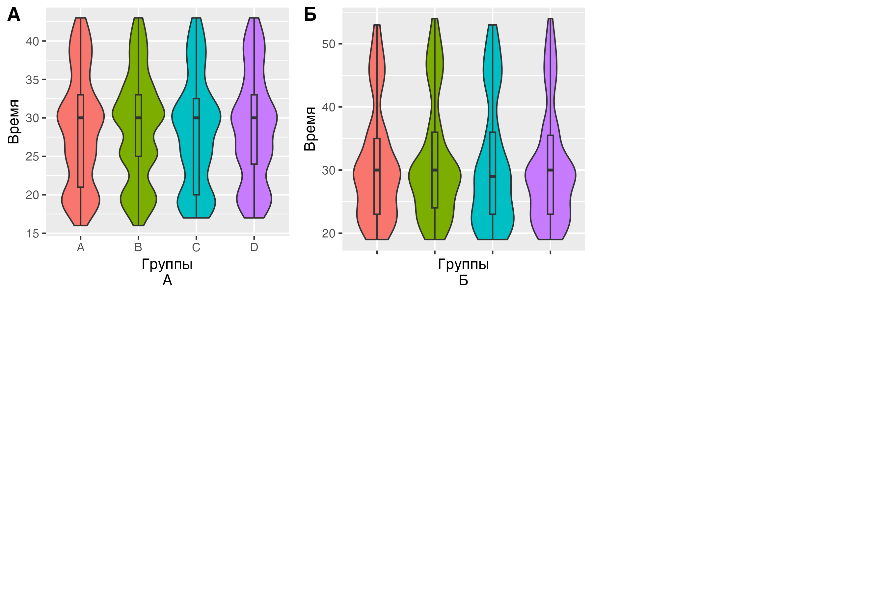
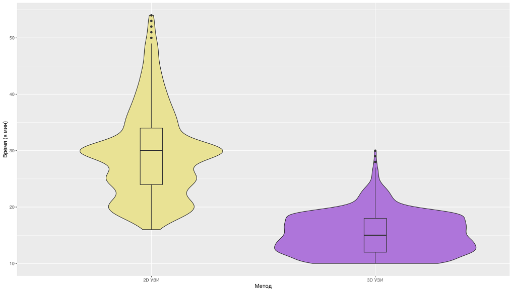
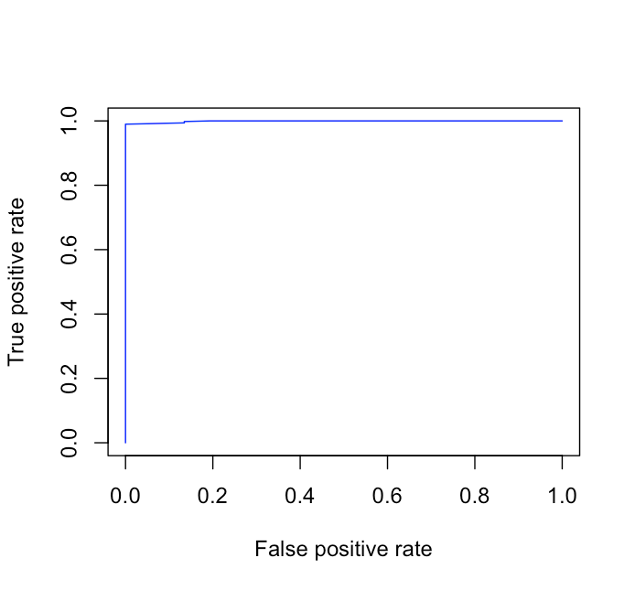

```{r echo=FALSE, message=FALSE}
library(knitr)
library(tidyverse)
library(readr)
library(flextable)

```

# ГЛАВА 6. ОПРЕДЕЛЕНИЕ ИСПОЛЬЗОВАНИЯ 3D УЗИ В СТРУКТУРЕ РАННЕЙ ДИАГНОСТИКИ НОВОБРАЗОВАНИЙ МОЛОЧНОЙ ЖЕЛЕЗЫ {.unnumbered}

Определение места 3D УЗИ в структуре ранней диагностики новообразований МЖ требовало решения следующих вопросов: 1) определение временной эффективности для увеличения количества пациентов на единицу времени и 2) выявление наиболее значимых факторов, которые указывают на то, что ожидается малая вероятность выявления образования, требующего интервенционного вмешательства (core-биопсию), чтобы переопределить маршрутизацию пациента на скрининг с использованием 3D УЗИ. Данное требование продиктовано тем, что только при 2D УЗИ можно выполнить core-биопсию образования.

## 6.1 Оценка методов по временной характеристике и зависимость от специалиста

В настоящем исследовании было принято решение учесть фактор опытности специалиста, выполняющего УЗ исследование. В исследовании участвовали 2 специалиста с опытом более 7 лет и специалист с опытом 3 года на момент настоящего исследования. Более опытный специалист выполнил 1750 исследований из них 771 исследований в выборке пациенток 40 лет и старше и 979 исследований в выборке пациенток моложе 40 лет. Специалист с опытом 3 года выполнил 1044 исследований из них 512 исследований в выборке пациенток 40 лет и старше и 532 исследований в выборке пациенток моложе 40 лет. Медиана времени выполнения 2D УЗИ у опытного специалиста составила 28 \[Q1-Q3: 24;33\] мин, такая же была у специалиста с опытом 3 года составил 30.969.22 \[Q1-Q3: 23;36\] мин. Разница между группами по времени выполнения составила p-уровень \<0.01. Это свидетельствует о том, что менее опытный специалист может тратить больше времени на исследование (Рисунок 28).



Рисунок 28 - Скорость выполнения исследования разными специалистами

Разница между группами по времени выполнения составила p-уровень = 0.46. Полученный результат говорит о том, что различные группы не влияют на скорость выполнения протокола 2D УЗИ у обоих специалистов (Рисунок 29 А, Б).



Рисунок 29 - А - Распределение длительности выполнения исследования 2D УЗИ по группами, исследования выполнял специалист с опытом более 10 лет, Б- Распределение длительности выполнения исследования 2D УЗИ по группам, исследования выполнял специалист с опытом 3 года

Далее следует привести данные временных характеристик по изучаемым методам ранней диагностики рака МЖ. Медиана времени выполнения 2D УЗИ по всей выборке составила 30 \[Q1-Q3: 23;34\] мин, однако медиана времеми интерпретации данных 3D УЗИ по всей выборке составила 15 \[Q1-Q3: 12;18\] мин. Разница между группами по времени интерпретации данных составила p-уровень \<0.01. Такая статистическая разница отражает очевидную разницу в скорости интерпретации данных исследований отражена на рисунке 30.



Рисунок 30 – Сравнение времени интерпретации данных 3D УЗИ и выполнения 2D УЗИ

Следует сказать, что выявленная разница по времени выполнения исследований между методами, а также зависимость УЗ исследования от квалификации специалиста показывает то, что система 3D УЗИ имеет конкурентные преимущества при ранней диагностике рака МЖ по временной характеристике. Однако стоит сказать, что при выполнении 3D УЗИ нельзя выполнить core-биопсию для проведения гистологического исследования и требуется выполнение 2D УЗИ исследования и проведения биопсии под УЗ-навигацией. Следовательно, 3D УЗИ позволит облегчить рутинное выполнение 2D УЗИ в тех случаях, где обнаружение образования, требующего проведения биопсии маловероятно. Для этого было выполнено определение наиболее значимых факторов для обоснования использования 3D УЗИ в рутинной практике.

## 6.2 Определение наиболее значимых факторов и алгоритма оптимизации использования 3D УЗИ

### 6.2.1 Оценка преддиагностических факторов в выборке пациенток моложе 40 лет

Для определения наиболее значимых преддиагностических факторов производился подбор предиктороной модели с наиболее значимыми факторам. Данные представлены в таблице 26 в порядке убывания значимости фактора.

Таблица 26 - Значимые факторы риска определения РМЖ у пациенток в возрасте моложе 40 лет

```{r echo=FALSE}
tbl_26 <- read.csv("tbl/chapter_6/tbl_26.csv", stringsAsFactors = FALSE)
colnames(tbl_26) <- c("Фактор",	"Коэффициент значимости")
tbl_26 %>%
  flextable() %>%
  merge_v(j = c(1,5)) %>%  # объединяем все столбцы с 1 по 4
  set_caption("Таблица 26 - Значимые факторы риска определения РМЖ у пациенток в возрасте моложе 40 лет") %>%
  theme_zebra() %>%
  autofit()
```

Были рассчитаны предиктивные коэффициенты на основании представленной модели и построек график ROC- кривой качества модели (Рисунок 31.а). Площадь под кривой составила 0.9991 Также были рассчитаны показатели точности, специфичности и чувствительности модели с определением коэффициента отсечения (Рисунок 31.б). в представленной модели коэффициент отсечения был 0.918 По высчитанному коэффициенту отсечения был составлен прогноз рекомендаций к скринингу.



**а**


**б**

Рисунок 31 - а. ROC- кривая предикторной модели определения показаний к 2D УЗИ для скрининга у пациенток в выборке моложе 40 лет; б. Показатели точности, специфичности и чувствительности модели с определением коэффициента отсечения в выборке моложе 40 лет

На основании данных, полученных в нашем исследовании скрининг с 2D УЗИ в выборке моложе 40 лет не показан в 4.04% (61/1511) и в 95.96% (1450/1511) его можно использовать.
Представленная модель в выборке моложе 40 лет сработала корректно в 99.21% (1499/1511) и в 0.79% (12/1511) предсказание можно отнести к неверному, а именно ложноположительные результаты.


### 6.2.2 Оценка преддиагностических факторов и факторов ММГ в выборке пациенток 40 лет и старше

Для определения наиболее значимых преддиагностических факторов производился подбор предиктороной модели с значимыми факторами. Данные представлены в таблице 27 в порядке убывания значимости фактора.

Таблица 27 - Значимые факторы риска определения РМЖ у пациенток в возрасте 40 лет и старше

```{r echo=FALSE}
tbl_27 <- read.csv("tbl/chapter_6/tbl_27.csv", stringsAsFactors = FALSE)
colnames(tbl_27) <- c("Фактор",	"Коэффициент значимости")
tbl_27 %>%
  flextable() %>%
  merge_v(j = c(1,5)) %>%  # объединяем все столбцы с 1 по 4
  set_caption("Таблица 27 - Значимые факторы риска определения РМЖ у пациенток в возрасте 40 лет и старше") %>%
  theme_zebra() %>%
  autofit()
```

Были рассчитаны предикторные коэффициенты на основании представленной модели и построен график ROC- кривой качества модели (Рисунок 32). Площадь под кривой составила 0.9983 Также были рассчитаны показатели точности, специфичности и чувствительности модели с определением коэффициента отсечения (Рисунок 32). в представленной модели коэффициент отсечения был 0.935 По высчитанному коэффициенту отсечения был составлен прогноз рекомендаций к скринингу.


**а**


**б**

Рисунок 32 - а. ROC- кривая предикторной модели определения показаний к 2D УЗИ для скрининга у пациенток в выборке 40 лет и старше; б. Показатели точности, специфичности и чувствительности модели с определением коэффициента отсечения в выборке 40 лет и старше

На основании данных, полученных в нашем исследовании скрининг с 2D УЗИ в выборке 40 лет и старше показан в 84.26% (1081/1283) и не показан в 15.74% (202/1283).

Представленная модель в выборке 40 лет и старше сработала корректно в 97.12% (1246/1283) и в 2.88% (37/1283) нет. Среди 37 случаев неверного предсказания было 4 случая ложноотрицательных результатов, и эти пациенты направлены на повторное исследование к специалисту 2D УЗИ для дальнейшего проведения CORE-биопсии. 33 случая квалифицированы как ложноположительные.


Алгоритм оптимизации использования 3D УЗИ. Исходя из данных, полученных в настоящем исследовании, предлагается следующий алгоритм оптимизации использования системы 3D УЗИ. Пациентки маршрутизируются по возрасту моложе 40 лет и старше 40 лет, так как маммография остается золотым стандартом скрининга РМЖ, но маммография имеет меньшую чувствительность при выявлении РМЖ у женщин с плотной МЖ, особенно если речь идет о пациентках моложе 40 лет.

Пациентка моложе 40 лет может быть направлена на исследование 3D УЗИ при отсутствии следующих предикторных факторов: пременопауза, жалоба на уплотнение, наследственная предрасположенность к РМЖ. При выявлении указанных предикторных факторов пациентку рекомендовано направить на 2D УЗИ. По результатам выставляется категория по классификации BI-RADS, в зависимости от которой проводят дальнейшие действия.
В выборке пациенток 40 лет и старше при отсутствии предикторных факторов рекомендуется выполнение 3D УЗИ. Предикторными факторами для выполнения 2D УЗИ служат нечеткие края образования на ММГ, локализованный фиброаденоматоз в первичном диагнозе, жалоба на уплотнение, характеристика узла на ММГ: фокус уплотнения, железистая ткань, как фон на ММГ, наследственная предрасположенность, менопауза более 5 лет, наличие гормональной терапии и возраст пациента.

Исходя из вышеизложенного, предлагается следующий алгоритм диагностики РМЖ с использованием 3DУЗИ (Рисунок 33).


Рисунок 33 - Алгоритм оптимизации использования 3D УЗИ
